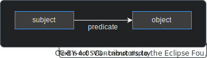

  

  

  

Behaviour Twin KIT
  

## KNOWLEDGE GRAPH BASICS

The Knowledge Agent is a set of federated components that are used to reason over knowledge graphs. For detailed information, see the [Agents KIT](../../knowledge-agents/adoption-view/intro).

Semantic models (ontologies, enriched by taxonomies) are describing the data model. They describe all possible classes, their properties and relationships within a specific domain. They may be represented as a graph, but they are not the knowledge graph itself.

Semantic models are instantiated by semantic triplets. Those triplets are consisting of a subject, a predicate and an object. Subject and object are nodes, the predicate is a unidirectional edge (a relation) between them:

Classes, properties and relations can be instantiated zero, once or multiple times. All instances of triplets together form the **knowledge graph**.

## ONTOLOGIES AND TAXONOMIES

### ONTOLOGIES BASICS

The description of ontologies is done also by triplets (subject --predicate-> object), where subject and object are nodes and the predicate represents a unidirectional edge between them.

For a specification of the preferred modelling language, see [RDF 1.1 Turtle on w3.org ](https://www.w3.org/TR/turtle/).

Object types and relations are formally defined within ontologies, e.g.:

Subjects and objects may not be real objects but conceptual ones:

### CATENA-X ONTOLOGIES AND TAXONOMIES

There is already a set of ontologies and a taxonomy defined for the [Catena-X namespace on w3.org ](https://w3id.org/catenax/):

- [core ontology ](https://w3id.org/catenax/next/ontology/core)
- [common core ontology ](https://w3id.org/catenax/next/ontology/common)
- [reliability ontology ](https://w3id.org/catenax/next/ontology/reliability)
- [vehicle ontology ](https://w3id.org/catenax/next/ontology/vehicle)

For the Behaviour Twin use case, the following ontology is defined:

- [behaviour ontology ](https://w3id.org/catenax/next/ontology/behaviour)

### OWN ONTOLOGIES FOR TEST OF NEW OR EXTENSION OF EXISTING USE CASES

Private or extended ontologies (e.g. for only two partners) can be added to the Knowledge Agent configuration. There are two options:

- Defining a public accessible storage location where all participating partners can refer to.
- Mounting the ontology file into the Knowledge Agent container.

In each case, the configuration is static and must be done within the deployment scripts of the Knowledge Agent. For the changes to take effect, the Knowledge Agent must be restarted.

## SHAPES GRAPH

Ontologies and taxonomies describe nodes and edges (triplets) as a semantic model (schema). The actual instances (data) form the knowledge graph itself.

The *shapes graph* is a separate graph written in the [Shapes Constraint Language (SHACL) ](https://www.w3.org/TR/shacl/#part1) that defines the rules and constraints for the data. It acts like a template describing the expected structure and properties.

## DATA SOVEREIGNTY THROUGH BINDINGS

Data and service bindings bring an extra layer of security. Only mapped data and services can be accessed. They are offered through graph assets. These assets are bound to policies which on the other hand are bound to a framework agreement. Using graph assets, all communication is handled by EDC connectors and this ensures data sovereignty.

Bindings are configured statically. For the changes of the binding configurations to take effect, the related Binding Agent must be restarted. New graph assets can be added dynamically.

## SKILLS

A *skill* is a query which is parameterizable by a set of input variables and executable by the Knowledge Agent. It defines the fundamental logic of how data and calculation services are linked to achieve the desired result. In most cases, it is a federated query. For more information, see the [Agents KIT](../../knowledge-agents/development-view/modelling#skill).

## BENEFITS

The Knowledge Agent approach enables high scalability by reducing complexity.

### APPROACH WITHOUT KNOWLEDGE AGENT

Many Behaviour Twin use cases start with collecting usage data and send them to a calculation service. Without generalized components, there would be a huge effort:

**For each use case at each participating *data provider***, a dedicated and complex *Coordination Service* must be developed, deployed and maintained. This service contains the overarching logic (how to link usage data and calculation services to produce the desired results), fetches usage data, negotiates contracts over EDC and calls (different) APIs of calculation services at the *Service Providers*. For this process, negotiation of contracts over EDC must also be handled by the Coordination Services. Because of different input parameters of different calculation services, for every link there must be a dedicated implementation.

There are a big variety of combinations. For small use cases, the effort would be to high to establish those complex *Coordination Services*.

Even more complexity comes in when there are more use cases, more than one data source for one calculation or more than one calculation services to get one result (for one request).

### APPROACH WITH KNOWLEDGE AGENT

A generalization with the help of the *Knowledge Agent* technology leads to a lower complexity:

This approach shifts complexity to the Knowledge Agent (KA-EDC), which is a well-developed set of components and deployed only once for a set of use cases. All the Coordination Services, API calls and explicit negotiations can be omitted. Instead, data and calculation services are bound to the *Knowledge Graph* and formal described in *graph assets* at the EDCs. By defining usage policies for those graph assets, the *Knowledge Agent* negotiates contracts and organizes data exchange automatically. This has not to be implemented by separate services any more.

### COMPARISON

| without Knowledge Agent | with Knowledge Agent |
| --- | --- |
| *Consumers* must negotiate contracts with the *data providers*. | Negotiation is done by the *Knowledge Agent*. |
| *Consumers* call the logic at data provider through APIs of the *Coordination Services*. *Data providers* define/implement the logic per use case. | *Consumer* define the logic (*skills*) and invoke it. |
| *Data providers* maintain *Coordination Services* to dispatch the consumers' requests. This services are fetching data, negotiating contracts with the *service providers*, calling the service providers' APIs and delegating the results back to the requesting *consumers*. | *Data providers* bind their data to the *knowledge graph* through static configuration files. The rest is done by the *Knowledge Agent*. |
| *Service providers* expose their services' APIs. | *Service providers* don't expose their services' APIs, but bind the services  to the *knowledge graph* through static configuration files. The input and output parameters are formally described, so that the *Knowledge Agent* can do the rest. |

## TEST

Currently, there is no ready-to-use test environment. If you want to test your use case,
you still have options:

- Have a look at the [Agents KIT](../../knowledge-agents/adoption-view/intro), maybe there is already something regarding testing.
- Search at your operating company's website or contact them.
- Build up your own test environment. As a basis, you could use the official Tractus-X [MXD test environment on GitHub ](https://github.com/eclipse-tractusx/tutorial-resources). Unfortunately, the Knowledge Agent components are not included into the MXD deployment scripts until release of the current KIT version.
