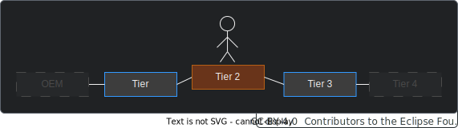

---
id: to-be-considered
title: To Be Considered
description: Behaviour Twin KIT
---

  

  

  

Behaviour Twin KIT
  

## DATA PROTECTION

### GENERAL

Behaviour Twin use cases usually utilize usage data. Therefore, data protection laws must be complied with. In the EU, the General Data Protection Regulation (GDPR) must be observed.

In general, users of data must have obtained consent from the data owner for each type of processing separately. If a data provider gets a request for passing along or processing usage data, it must ensure, that the data owner has given consent for the requested purpose. A automated consent system may be implemented.

Also note that usage data in a vehicle may be generated by other persons (drivers) than the vehicle owner.

### ACCESS DATA BY VIN

Currently, to access usage data of a vehicle from outside the data provider, the vehicle identification number (VIN) would be needed. Until the release of the current KIT version, there is no general legally permissible option for using VINs to obtain usage data. A regulation
is under discussion.

In individual cases, the usage of a VIN or some generated anonymized number may be possible.

## DATA SOVEREIGNTY

The supply chain is visible to each company *only one* up and *one down* (there may be exceptions):

### USE CASE FRAMEWORK AND CONTRACTS

For each use case there must be a *Use Case Framework*, see the [Catena-X webpage ](https://catena-x.net/en/catena-x-introduce-implement/governance-framework-for-data-space-operations). There, all general requirements for all participants are defined.

Keep in mind that use cases must fulfill the one-up-one-down-policy. If your (new) use case cannot completely comply, adapt it or consider a special solution.

Additional contracts may be required (e.g. a subset of partners within a use case have higher requirements for data quality than the remaining partners).

### WRITING SKILLS

When writing skills, keep in mind that all referenced assets are accessible in the current context (query scope/service level). An asset is accessible, if it's in the federated catalog of the related sub-skill (level). In the example diagram above, assets of Tier 4 are hidden to the Knowledge Agent of Tier 2. Within the skill, a *SERVICE* at Tier 3 must be called that can resolve the missing data from Tier 4.

## DATA QUALITY

Data quality depends on many factors. In some use cases, a minimum data quality must be ensured. Currently, there is no general concept for this. Some aspects should be kept in mind:

- **Type of data acquisition:** The data could be measured, calculated, estimated, processed, replaced ... The accuracy may vary, and data could be corrupted.

- **Availability:** The data could be fully or partially missing.

- **Stability:** For example, data may be accumulated and therefore monotonically increasing. Data could be reset or corrupted unintentionally or due to system fault.

- **Quality propagation:** Calculated/processed data may be based on input data that are for example estimated. Without a quality indicator, the quality may vary very greatly from an alternative source where the base was a measurement.

- **Error propagation:** With the Knowledge Agent, errors are not propagated by default. If some data is not available, an empty set is returned. If, for example, a service uses a variable number of parameters, and one of them is not available, a wrong result may be generated. If the result is then processed further, this issue will not be noticeable.

## VERSIONING AND BREAKING CHANGES

In Catena-X, breaking changes may only be allowed in major releases. If your use case is not affected by breaking changes, you may not need to release a new major version.

Since not all participants can update all their components at the same time, there will be a transition period.

There could be three dates within this period that must be considered:

- **Start of rollout:** From this date on, the new version can be provided/supported.
- **End of rollout (deadline):** Until this date, the new version must be provided/supported.
- **End of life:** Until this date, the related version is supported. To ensure that there is always a common (compatible) version available, this date is not before the rollout deadline of the following version.

There may be a period where two versions are provided/supported in parallel:

The three dates may coincide on a date. In this case, start of rollout is on same date as end of rollout of the previous version, and end of rollout is on same date as end of life of the previous version:

If the release cycle follows the before mentioned schema it is always guaranteed that a version is provided/supported from end of rollout until end of life.

:warning: Take into account that other components (like your own EDC connectors and your partners' components), may not be updated to their corresponding new version before end of rollout. Therefore, you can only rely on the previous version.

This release procedure may affect you only if you have breaking changes within your use cases, or the Knowledge Agent interface changes in a breaking way. In most cases, the use-case-specific components are not affected.
