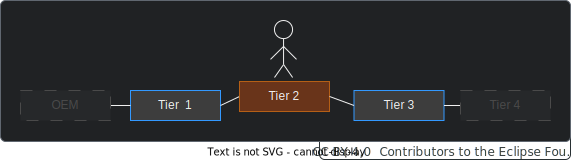

  

  

  

Behaviour Twin KIT
  

## DATA PROTECTION

### GENERAL

Behaviour Twin use cases usually utilize usage data. Therefore, data protection laws must be complied with. In the EU, the General Data Protection Regulation (GDPR) must be observed.

In general, users of data must have obtained consent from the data owner for each type of processing separately. If a data provider gets a request for passing along or processing usage data, it must ensure, that the data owner has given consent for the requested purpose. A automated consent system may be implemented.

Also note that usage data in a vehicle may be generated by other persons (drivers) than the vehicle owner.

### ACCESS DATA BY VIN

Currently, to access usage data of a vehicle from outside the data provider, the vehicle identification number (VIN) would be needed. Until the release of the current KIT version, there is no general legally permissible option for using VINs to obtain usage data. A regulation
is under discussion.

In individual cases, the usage of a VIN or some generated anonymized number may be possible.

## DATA SOVEREIGNTY

In general, the supply chain is not fully visible to the companies involved. The visibility is at least one up and one down:

To engage additional actors in the supply chain, the framework agreements and other requirements must be propagated through the chain.

## DATA QUALITY

Data quality depends on many factors. In some use cases, a minimum data quality must be ensured. Currently, there is no general concept for this. Some aspects should be kept in mind:

- **Type of data acquisition:** The data could be measured, calculated, estimated, processed, replaced ... The accuracy may vary, and data could be corrupted.

- **Availability:** The data could be fully or partially missing.

- **Stability:** For example, data may be accumulated and therefore monotonically increasing. Data could be reset or corrupted unintentionally or due to system fault.

- **Quality propagation:** Calculated/processed data may be based on input data that are for example estimated. Without a quality indicator, the quality may vary very greatly from an alternative source where the base was a measurement.

- **Error propagation:** With the Knowledge Agent, errors are not propagated by default. If some data is not available, an empty set is returned. If, for example, a service uses a variable number of parameters, and one of them is not available, a wrong result may be generated. If the result is then processed further, this issue will not be noticeable.
