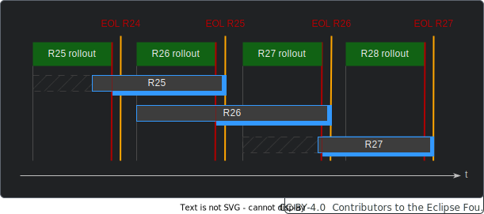
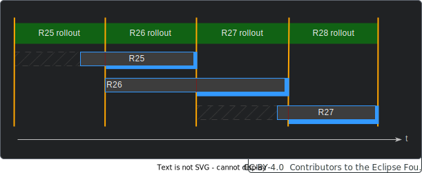

---
id: versioning
title: Versioning
description: Behaviour Twin KIT
---

  

  

  

Behaviour Twin KIT
  

## CATENA-X RELEASES

In Catena-X, breaking changes will only be allowed in main releases. Main releases are planned to happen once a year. If your use case is not affected by breaking changes, you may not need to release a new main version.

Since not all participants can update all their components at the same time, there will be a transition period. There are three dates within this period that must be considered:

- **Start of rollout:** From this date on, the new version can be provided/supported. Once it is released, it must not be revoked.
- **End of rollout (deadline):** Until this date, the new version must be provided/supported.
- **End of life:** Until this date, version must be supported. This date is not before the rollout deadline of the following version.

There may be a period where two versions are provided/supported in parallel:

The three dates may coincide on a date. In this case, start of rollout is on same date as end of rollout of the previous version, and end of rollout is on same date as end of life of the previous version:

It is always guaranteed that a version is provided/supported from end of rollout until end of life.

 Take into account that other components (like your own EDCs and your partners' components), may not be updated to their corresponding new version before end of rollout. Therefore, you can only rely on the previous version.

This release procedure may affect you only if you have breaking changes within your use cases, or the Knowledge Agent interface changes in a breaking way. In most cases, the use case specific components are not affected.

## VERSIONING ASSETS

All EDC assets must be decorated by the `cx-common:version` within the `properties` list of the asset definitions. This applies to graph assets (data and service binding assets) as well as to skill assets.

## ONTOLOGY CHANGES

In most cases, ontologies are not alternated, but extended. The meaning of nodes/edges must not change.

New service or data types must have new types within the ontologies.

 If an ontology gets extended, not all users may be aware of this extension. As a consumer of data or services, you cannot expect that all providers provide the corresponding data until next main release. If required, you may establish a appropriate mechanism in your use case for informing your partners and requiring them to provide the extended data.

## DATA AND SERVICE VERSIONS

Versioning of services, but also data is especially helpful if you want to harmonize versions within a use case. The attribute `cx-common:version` within the `properties` list of the asset definitions can be used for this purpose. Using semantic versioning, the feature version number can be harmonized by all participants (e.g. by agreements or standards). Semantic versioning is expressed in the following format: `[0-9]+.[0-9]+.[0-9]+(-SNAPSHOT)?`

A second option would be an extension of the corresponding ontologies and taxonomies. Then, the version information can be a part of the SHACL description in the graph assets.

It's up to the use case to handle the versioning. In skills, both options can be used to determine the desired data and service versions.
