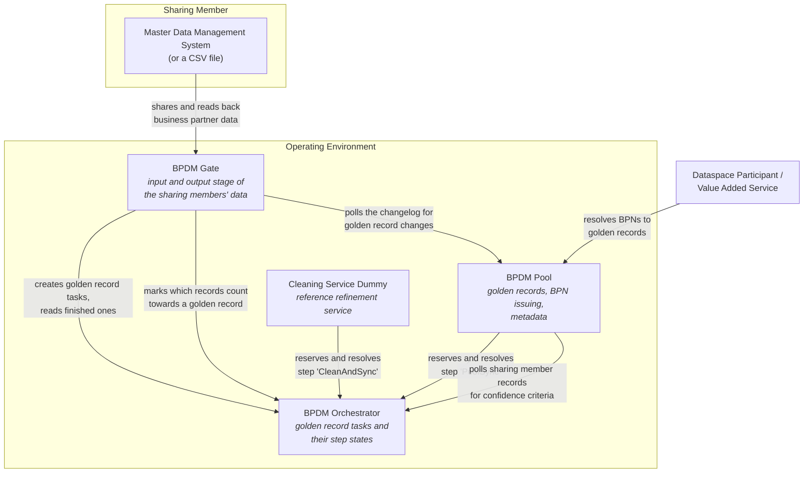
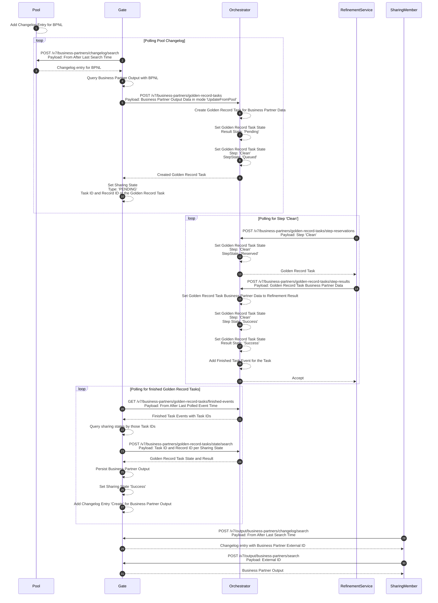
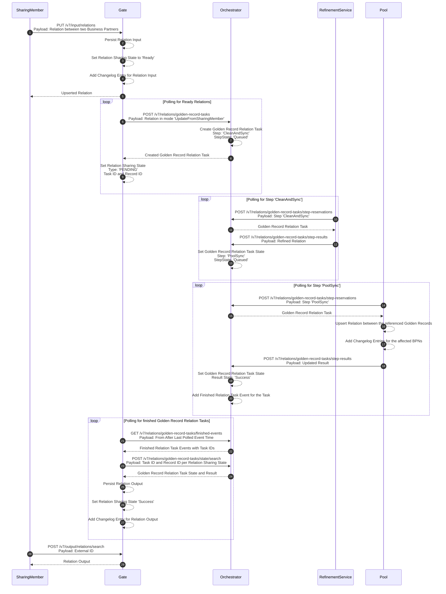
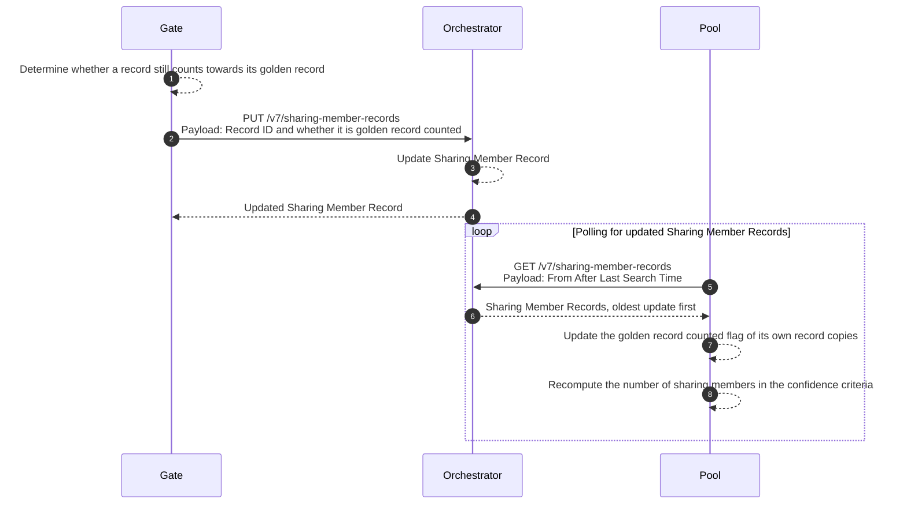
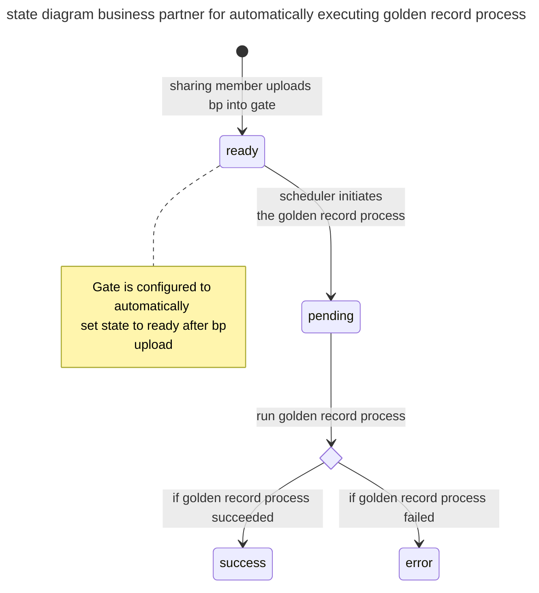
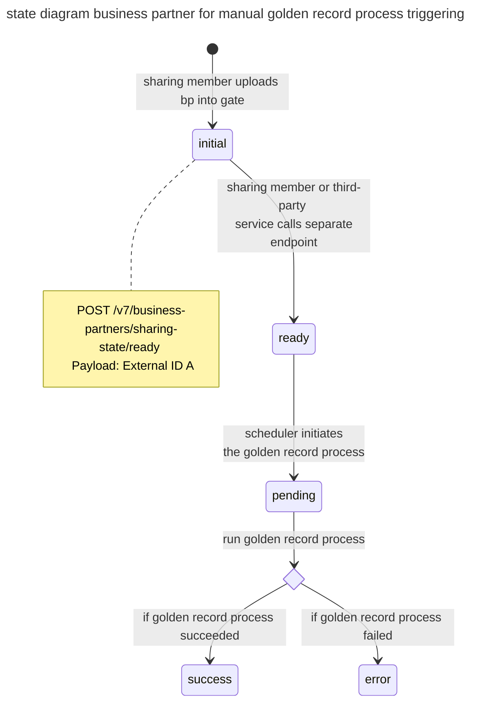
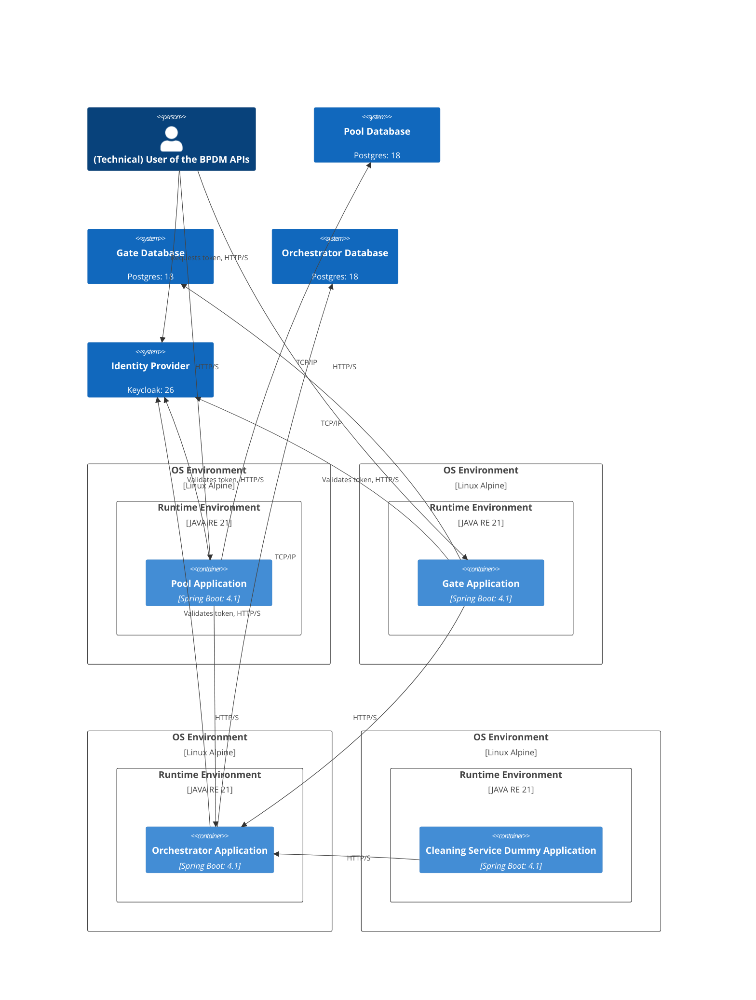
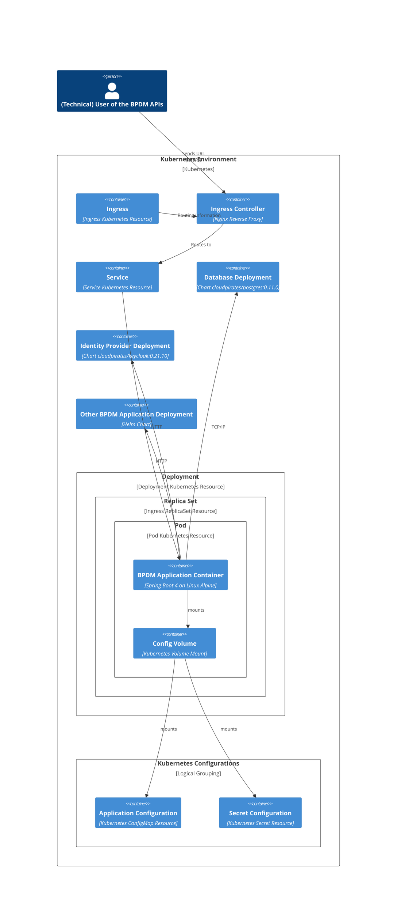
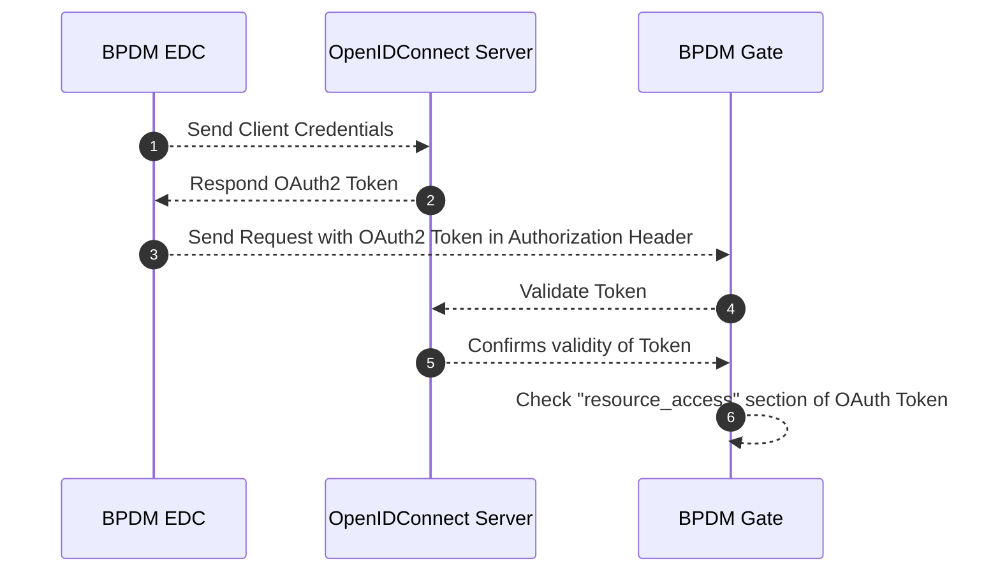

## Business Partner Data Management Application for Golden Record (BPDM)

- [Introduction and Goals](#introduction-and-goals)
  - [Goals Overview](#goals-overview)
  - [Requirements Overview](#requirements-overview)
  - [Quality Goals](#quality-goals)
  - [Stakeholders](#stakeholders)
- [Architecture Constraints](#architecture-constraints)
- [System Scope and Context](#system-scope-and-context)
  - [Business Context](#business-context)
  - [Technical Context](#technical-context)
- [Solution Strategy (High Level Picture)](#solution-strategy-high-level-picture)
- [Building Block View](#building-block-view)
  - [Level 1: The Deployed Services](#level-1-the-deployed-services)
  - [Level 2: The Modules](#level-2-the-modules)
- [Runtime View](#runtime-view)
  - [Sharing A Business Partner](#sharing-a-business-partner)
  - [Update on Golden Record Change](#update-on-golden-record-change)
  - [Sharing A Business Partner Relation](#sharing-a-business-partner-relation)
  - [Counting The Sharing Members Of A Golden Record](#counting-the-sharing-members-of-a-golden-record)
  - [Business Partner Data Records - States](#business-partner-data-records---states)
- [Deployment View](#deployment-view)
  - [Applications Deployment without Kubernetes](#applications-deployment-without-kubernetes)
  - [Kubernetes Deployment](#kubernetes-deployment)
- [Crosscutting Concepts](#crosscutting-concepts)
  - [Authentication & Authorization](#authentication--authorization)
  - [EDC Communication](#edc-communication)
  - [Business Partner Data Management Standards](#business-partner-data-management-standards)
  - [Logging Behavior](#logging-behavior)
- [Architecture Decisions](#architecture-decisions)
- [Quality Requirements](#quality-requirements)
- [Risks and Technical Debts](#risks-and-technical-debts)
  - [Risks](#risks)
  - [Technical Debts](#technical-debts)
- [NOTICE](#notice)

## Introduction and Goals

This document describes the Catena-X Business Partner Data Management Application, short BPDM.

In the Catena-X Automotive Network, the so-called Golden Record, together with a unique identifier, the Business Partner Number (BPN), creates an efficient solution to the increasing data retention costs.

The Golden Record is a concept that identifies, links and harmonizes identical data on legal entities, sites and addresses from different sources (“sharing members"). During the creation of the Golden Record data, duplicates are removed, the quality within the data records is improved, missing information is added and deviations are automatically corrected. This is done using public, commercial or other agreed sources of trust and/or information. This approach reduces costs of business partner data maintenance and validation for all the companies concerned.

The BPN, as the unique identifier of the Golden Record, can be stored as a verifiable credential used in an SSI solution so that a business partner can provide it for authentication and authorization.

The Golden Record business partner data in combination with the BPN acts as the basis for a range of supplementary value-added services to optimize business partner data management. These are referred to as value-added services. Together with decentralized, self-determined identity management, they create a global, cross-industry standard for business partner data and a possible 360° view of the value chain.

:::note

A Business Partner Data cleaning as well as Golden Record Creation Process is **not** part of this reference implementation!

:::

**Additional Information Material**:

- Visit BPDM on the official Catena-X Website: [bpdm_catenax_website](https://catena-x.net/en/offers-standards/bpdm)
- The standards BPDM implements: [CX-0010 Business Partner Number](https://catenax-ev.github.io/docs/standards/CX-0010-BusinessPartnerNumber), [CX-0012 Business Partner Data Pool API](https://catenax-ev.github.io/docs/standards/CX-0012-BusinessPartnerDataPoolAPI), [CX-0074 Business Partner Gate API](https://catenax-ev.github.io/docs/standards/CX-0074-BusinessPartnerGateAPI)

### Goals Overview

The following goals have been established for this system:

| Priority | Goal                                                                                                         |
| -------- | ------------------------------------------------------------------------------------------------------------ |
| 1        | Provide unique global business partner IDs within the Catena-X Network                                       |
| 1        | Provide centralized Master Data Management for business partner data                                         |
| 2        | Enable network-based data sharing for business partner data to increase overall data quality and reliability |
| 2        | Enable also Small and medium-sized Businesses (SMEs) to use the services |
| 3        | Provide a change history for business partner data |

### Requirements Overview

The following Usecases together with its requirements exist for this system:

| Req-Id  | Requirement        | Explanation |
| ------- | ------------------ | ----------- |
| BPDM-R1 | Upload and curate BP data     | CX Member can upload their business partner and get curated business partner information back, based on the Golden Record             |
| BPDM-R2 | Provide changelog for BP | A changelog is provided to determine which changes on which date are available             |
| BPDM-R3 | Provide GR                    | Based on the shared business partner information and external service providers a Golden Record is created             |
| BPDM-R4 | Provide changelog for GR        | A changelog is provided to determine which changes on which date are available             |
| BPDM-R5 | Keep GR up-to-date based on external resources                    | Golden Records must regularly checked for changes based on external resources             |
| BPDM-R6 | Provide unique business partner IDs                    | For each Golden Record a unique ID, the so called Business Partner Number (BPN) is created             |

### Quality Goals

| Priority | Quality Goal            | Scenario                                                                                                                                                                                                                                                                                                                                                                                             |
| -------- | ----------------------- | ---------------------------------------------------------------------------------------------------------------------------------------------------------------------------------------------------------------------------------------------------------------------------------------------------------------------------------------------------------------------------------------------------- |
| 1        | Security                | All users and services which access the Golden Record Application must be authenticated and authorized. Only the Golden Record Application itself is allowed to perform changes on data. Consuming services/users are only allowed to read data. In addition they are only allowed to read the specific data that belongs with this, the Data Sovereignty principles of Catena-X has to be fulfilled |
| 1        | Integrity               | Only the Golden Record Application is allowed to perform changes on the data. In addition, all changes must be traceable and must be able to be rolled back                                                                                                                                                                                                                                          |
| 1        | Legally                 | No natural persons are allowed to get uploaded and stored. For all other uploaded Business Partner data it is mandatory that users (CX Members) can only see their own uploaded data and that it is not possible to draw conclusions about other business partner relationships                                                                                                                      |
| 1        | Integrity & Correctness | It must be ensured that the data of the golden record which is created during the process is correct.                                                                                                                                                                                                                                                                                                |
| 2        | Reliability             | The Golden Record Application is a central foundation in the Catena-X Network. It provides all participants and services, business partner data and the unique Business Partner Number (BPN) as identifier. Therefore the BPDM Services must be always/highly available                                                                                                                              |
| 2        | Functional Stability    | Since the Golden Record Application is a central foundation in the Catena-X Network the defined standards of the API and datamodel for the associated Release Version must be fulfilled                                                                                                                                                                                                              |
| 1        | Sensitivity of data     | the uploaded business partner data is highly sensitive, that's why it must be ensured that no unauthorized user/system can access data which does not belong to it. More over it must be guaranteed that no one can see the business partners related to the specific Catena-X Member.                                                                                                               |

### Stakeholders

The API documentation describes the same roles from an integrator's perspective, each with its own
guide: [sharing member](https://github.com/eclipse-tractusx/bpdm/blob/main/docs/api/sharing-member-guide.md),
[dataspace participant](https://github.com/eclipse-tractusx/bpdm/blob/main/docs/api/dataspace-participant-guide.md) and
[refinement service provider](https://github.com/eclipse-tractusx/bpdm/blob/main/docs/api/refinement-service-guide.md).

| Role/Name                              | Expectations                                                                                                       | Example                                                                                                                                    |
|----------------------------------------|--------------------------------------------------------------------------------------------------------------------|--------------------------------------------------------------------------------------------------------------------------------------------|
| Sharing member (big company)           | Company wants to have cleaned and enriched business partner data objects with a BPN.                               | Shares its business partner data through the Gate API from its master data management system                                                |
| Sharing member (SME)                   | Company wants to have cleaned and enriched business partner data objects with a BPN based on a CSV data.            | Shares its business partner data as a CSV file through the Gate's partner upload endpoints                                                 |
| Dataspace participant                  | Resolve the BPNs it receives from other participants and look up the golden record behind them                     | A use case application that receives a BPN in a data offer and needs the legal entity behind it                                            |
| Refinement service provider            | Integrate a duplication check, cleaning or validation step into the golden record process                          | A commercial data provider reserving golden record tasks from the Orchestrator API                                                         |
| CX Apps                                | Other apps and their use cases want to use the business partner data objects and the BPN for their processes        | The CX Portal will use the BPN for on-boarding new companies into the network. Traceability Apps will use BPN to describe business partners |

## Architecture Constraints

| Constraint ID | Constraint                                                                                                                                                      | Description |
| ------------- | --------------------------------------------------------------------------------------------------------------------------------------------------------------- | ----------- |
| C-1           | Software and third party software must be compliant to the Catena-X and Eclipse Foundation Guidelines/Policies [eclipse_foundation](https://www.eclipse.org/projects/dev_process/) |             |
| C-2          | [Eclipse Dataspace Connector](https://github.com/eclipse-tractusx/tractusx-edc/tree/main) must be used for data transfer between different legal entities        |             |

## System Scope and Context

### Business Context

The following figure depicts the business context setup for BPDM:

The following are the various components of the business context setup:

- **Master Data Management (Catena-X Member)**
  - A backend system that's operated by a company which is participating in the Catena-X Ecosystem and consuming digital services or data assets.

- **Small-Medium-Enterprises (SME) (Catena-X Member)**
  - A SME company that's participating in the Catena-X Ecosystem and consuming digital services or data assets.
  - An SME does not need a master data management system to share data: the Gate accepts a CSV file over its partner upload endpoints and offers a template for it.

- **Catena-X Portal/Marketplace (CX Portal)**
  - The Portal which provides an entry point for the Catena-X Members, to discover Apps that are offered in Catena-X.

- **Value Added Services**
  - Value Added Services can be provided be either the Operator itself or by an external App/Service Provider. The Value Added Services provide data or service offers based on Catena-X Network data.
  - There are several value added services that can be offered in context of business partner data. For example a Fraud Prevention Dashboard/API, Country Risk Scoring and so on.

- **Catena-X Operative Environment for BPDM**
  - Within Catena-X there will be only one central operation environment that operates the BPDM Application. This operative environment provides the services and data for other operation environment or applications which needs to consume business partner data or golden record data.

- **Catena-X BPDM Application**
  - The BPDM Application which offers services to Catena-X Members, Catena-X Use Cases and Catena-X BPDM Value Added Services for consuming and processing business partner data as well as Golden Record Information and BPN Numbers.

- **Curation & Enrichment Services**
  - To offer the BPDM and Golden Record Services, Catena-X uses services from external third party service providers. These can either be operated by the operator itself or external companies that have a contract with the operator.
  - The API documentation calls this role a refinement service provider, or golden record processing service provider; see the [Refinement Service Provider Guide](https://github.com/eclipse-tractusx/bpdm/blob/main/docs/api/refinement-service-guide.md).

### Technical Context

The technical context setup including deployment is depicted in the following figure:

- The BPDM Application follows a microservice approach to separate the different components of the system.
- Within Catena-X there will be only one central operation environment that operates the BPDM Application. This operation environment provides the services and data for other operation environment or applications which needs to consume business partner data or golden record data.

:::note

The diagram shows the CSV upload of an SME as a separate upload service. This is no longer a
component of its own: the Gate itself accepts a CSV file, so an SME reaches the same Gate API as
any other sharing member. See the [Building Block View](#building-block-view).

:::

## Solution Strategy (High Level Picture)

The following high level view gives a basic overview about the BPDM Components:

- **BPDM Gate**
  - The BPDM Gate provides the interfaces for Catena-X Members to manage their business partner data within Catena-X.
  - Based on the network data a Golden Record Proposal is created.
  - The BPDM Gate has its own persistence layer in which the business partner data of the Catena-X Members are stored.
  - A Gate serves several sharing members at once: every business partner record, sharing state, relation and changelog entry carries the BPNL of the tenant it belongs to, and the Gate resolves that tenant from the token of the caller. A sharing member only ever sees its own data through the API.
  - An operator may still deploy a Gate per sharing member, for instance to separate the databases; this is a deployment choice, not a requirement of the implementation. It replaces the original one-Gate-per-member decision, which was overturned as infeasible for thousands of tenants (see [Architecture Decisions](#architecture-decisions)).

- **BPDM Pool**
  - The BPDM Pool is the central instance for business partner data within Catena-X.
  - The BPDM Pool provides the interface and persistance for accessing Golden Record Data and the unique Business Partner Number.
  - In comparison to the BPDM Gate, there is only one central instance of the BPDM Pool.

- **BPN Issuer**
  - Every participant in the Catena-X network shall have a unique Business Partner Number (BPN) according to the concept defined by the Catena-X BPN concept. The task of the BPN Generator is to issue such a BPN for a presented Business Partner data object. In that, the BPN Generator serves as the central issuing authority for BPNs within Catena-X.
  - Technically, it constitutes a service that is available as a singleton within the network.
  - Issuing BPNs is part of the BPDM Pool implementation and has remained there: the Pool creates a BPN whenever the golden record process presents business partner data that does not resolve to an existing golden record. There is no separate BPN issuer component.

- **BPDM Orchestrator**
  - The BPDM Orchestrator is a passive component that offers standardized APIs for the BPDM Gate, BPDM Pool and refinement services to orchestrate the process of Golden Record Creation and handling the different states a business partner record can have during this process.
  - It holds the golden record tasks, hands them to whichever service has reserved the step they are queued in, and keeps the submitting sharing member anonymous towards those services.

## Building Block View

### Level 1: The Deployed Services

- **BPDM Gate**
  - Holds the business partner data of the sharing members in an input and an output stage, together with a sharing state and a changelog per stage.
  - Serves several sharing members at once; each record carries the BPNL of its tenant.
  - Accepts data as JSON over the business partner endpoints and as a CSV file over the partner upload endpoints.
  - Drives the process from the sharing member's side: it creates golden record tasks in the Orchestrator, picks up finished ones and writes the result into the output stage.

- **BPDM Pool**
  - The single source of truth for golden records, and the issuing authority for BPNs.
  - Participates in the golden record process as the service that reserves the `PoolSync` step: it writes the refined data into the golden records and reports the resulting BPNs back into the task.
  - Serves golden record and metadata reads to dataspace participants and value added services, and a changelog the Gate polls for golden record changes.

- **BPDM Orchestrator**
  - Passive component. It stores golden record tasks and their step states and hands a task to whichever service reserved the step the task is queued in; it never calls a service itself.
  - Keeps the sharing member anonymous towards the refinement services: a task carries the business partner data, not the identity of the Gate that created it.
  - Holds two kinds of tasks - business partner tasks and relation tasks - plus the sharing member records, which state how many sharing members share a given golden record.

- **Cleaning Service Dummy**
  - A reference refinement service, so that the stack can run a golden record process end to end without an external provider under contract.
  - Reserves the step it is configured for (`CleanAndSync` by default) and applies rudimentary processing; it does not clean or correct data. Its restrictions are listed in [Risks and Technical Debts](#technical-debts).

- **EDC Operator**
  - Communication between the operating environment and another legal entity goes through an EDC. Diagrams may show an EDC several times for readability; on a technical level one EDC instance serves all BPDM assets of the operator. Which communication needs an EDC is decided in [Architecture Decisions](#recommended-usage-scenarios-of-an-edc-enabled-communication-in-business-partner-data-management-solution).

### Level 2: The Modules

The [repository](https://github.com/eclipse-tractusx/bpdm) is a multi-module Maven project. Only four modules are deployable services; the rest are libraries and tooling.

| Module                         | Kind             | Content                                                                                     |
|--------------------------------|------------------|---------------------------------------------------------------------------------------------|
| `bpdm-gate`                    | Service          | The Gate application                                                                        |
| `bpdm-pool`                    | Service          | The Pool application                                                                        |
| `bpdm-orchestrator`            | Service          | The Orchestrator application                                                                |
| `bpdm-cleaning-service-dummy`  | Service          | The reference refinement service                                                            |
| `bpdm-gate-api`                | Library          | Gate DTOs, the OpenAPI-annotated interfaces and the generated HTTP client                   |
| `bpdm-pool-api`                | Library          | The same for the Pool                                                                       |
| `bpdm-orchestrator-api`        | Library          | The same for the Orchestrator                                                               |
| `bpdm-common`                  | Library          | Models and utilities shared by all services                                                 |
| `bpdm-common-test`             | Library          | Test fixtures, test data factories and the Keycloak realm used by the integration tests      |
| `bpdm-system-tester`           | Tool             | End-to-end test framework, packaged as a runnable jar rather than a surefire run            |
| `bpdm-migration-helper`        | Tool             | Generates SQL migration scripts from non-SQL source files                                   |
| `bpdm-coverage-aggregate`      | Tool             | Aggregates JaCoCo coverage across the modules                                               |

A service reaches another service only through that service's `-api` module, so the request and
response models of an integration are the ones the API documentation publishes.

## Runtime View

The paths in this section are the current v7 API paths. The Gate, Pool and Orchestrator also still
serve a deprecated v6 API whose paths differ; the full endpoint documentation is in
[docs/api](https://github.com/eclipse-tractusx/bpdm/blob/main/docs/api/README.md).

### Sharing A Business Partner

A record a sharing member shares runs through the golden record process in mode
`UpdateFromSharingMember`, which the Orchestrator sequences as the steps `CleanAndSync` and then
`PoolSync`.

:::note

A record only enters the process once it is in sharing state 'Ready'. By default the Gate sets
that state on upload, so uploading a record shares it. An operator can configure the Gate to
leave a new record in state 'Initial' instead; the record then waits until the sharing member
releases it over the sharing state endpoint, which is the sequence shown below.

:::

```mermaid
sequenceDiagram
    autonumber

    SharingMember->>Gate: PUT /v7/input/business-partners <br> Payload: Business Partner Data A
    Gate-->>Gate: Persist Business Partner Data Input
    Gate-->>Gate: Set Sharing State to 'Initial'
    Gate-->>Gate: Add Changelog Entry 'Create' for Business Partner Input
    Gate-->>SharingMember: Upserted Business Partner

    SharingMember->>Gate: POST /v7/business-partners/sharing-state/ready <br> Payload: External ID A
    Gate-->>Gate: Set Sharing State to 'Ready'
    Gate-->>SharingMember: OK

    loop Polling for Ready Business Partners
        Gate-->>Gate: Fetch Business Partners in State 'Ready'
        Gate->>Orchestrator: POST /v7/business-partners/golden-record-tasks <br> Payload: Business Partner Input Data in mode 'UpdateFromSharingMember', <br> with the Record ID of an earlier sharing of the same External ID
        Orchestrator-->>Orchestrator: Create Golden Record Task for Business Partner Data <br> (and a Record, if the request carried no Record ID)
        Orchestrator-->>Orchestrator: Set Golden Record Task State <br> Result State: 'Pending'
        Orchestrator-->>Orchestrator: Set Golden Record Task State <br> Step: 'CleanAndSync' <br> StepState: 'Queued'
        Orchestrator-->>Gate: Created Golden Record Task with Task ID and Record ID
        Gate-->>Gate: Set Sharing State <br> Type: 'PENDING' <br> Task ID and Record ID of the Golden Record Task
    end

    loop Polling for Step 'CleanAndSync'
        RefinementService->>Orchestrator: POST /v7/business-partners/golden-record-tasks/step-reservations <br> Payload: Step 'CleanAndSync'
        Orchestrator-->>Orchestrator: Set Golden Record Task State <br> Step: 'CleanAndSync' <br> StepState: 'Reserved'
        Orchestrator-->>RefinementService: Golden Record Task
        RefinementService-->>RefinementService: Set L/S/A and Generic Business Partner Refinement Result
        RefinementService-->>RefinementService: Set BPN References to L/S/A result
        RefinementService->>Orchestrator: POST /v7/business-partners/golden-record-tasks/step-results <br> Payload: Refinement Result
        Orchestrator-->>Orchestrator: Set Golden Record Task Business Partner Data to Refinement Result
        Orchestrator-->>Orchestrator: Set Golden Record Task State <br> Step: 'PoolSync' <br> StepState: 'Queued'
        Orchestrator-->>RefinementService: Accept
    end

    loop Polling for Step 'PoolSync'
        Pool->>Orchestrator: POST /v7/business-partners/golden-record-tasks/step-reservations <br> Payload: Step 'PoolSync'
        Orchestrator-->>Orchestrator: Set Golden Record Task State <br> Step: 'PoolSync' <br> StepState: 'Reserved'
        Orchestrator-->>Pool: Golden Record Task
        opt Golden Record Legal Entity Data marked as changed
            Pool-->>Pool: Upsert Legal Entity from Golden Record Task Legal Entity Data
            Pool-->>Pool: Add Changelog Entry for BPNL
        end
        opt Golden Record Site Data marked as changed
            Pool-->>Pool: Upsert Site from Golden Record Task Site Data
            Pool-->>Pool: Add Changelog Entry for BPNS
        end
         opt Golden Record Address Data marked as changed
            Pool-->>Pool: Upsert Address from Golden Record Task Address Data
             Pool-->>Pool: Add Changelog Entry for BPNA
        end
        Pool-->>Pool: Set BPNs in Golden Record Task Generic Business Partner Data
        Pool->>Orchestrator: POST /v7/business-partners/golden-record-tasks/step-results <br> Payload: Updated Result
        Orchestrator-->>Pool: Accept
        Orchestrator-->>Orchestrator: Set Golden Record Task State <br> Step: 'PoolSync' <br> Step State: 'Success'
         Orchestrator-->>Orchestrator: Set Golden Record Task State <br> Result State: 'Success'
        Orchestrator-->>Orchestrator: Add Finished Task Event for the Task
    end

    loop Polling for finished Golden Record Tasks
        Gate->>Orchestrator: GET /v7/business-partners/golden-record-tasks/finished-events <br> Payload: From After Last Polled Event Time
        Orchestrator-->>Gate: Finished Task Events with Task IDs
        Gate-->>Gate: Query sharing states by those Task IDs
        Gate->>Orchestrator: POST /v7/business-partners/golden-record-tasks/state/search <br> Payload: Task ID and Record ID per Sharing State
        Orchestrator-->>Gate: Golden Record Task State and Result
        Gate-->>Gate: Persist Business Partner Output
        Gate-->>Gate: Set Sharing State 'Success'
        Gate-->>Gate: Add Changelog Entry 'Create' for Business Partner Output
    end

    SharingMember->>Gate: POST /v7/output/business-partners/changelog/search <br> Payload: From After Last Search Time
    Gate-->>SharingMember: Changelog entry with Business Partner External ID
    SharingMember->>Gate: POST /v7/output/business-partners/search <br> Payload: External ID
    Gate-->>SharingMember: Business Partner Output
```

### Update on Golden Record Change

When a golden record changes in the Pool, the Gate feeds the affected output records through the
process again in mode `UpdateFromPool`. That mode has a single step, `Clean`: the record is already
in the Pool, so nothing is written back to it.

:::note

The delivered Cleaning Service Dummy is configured for one step, `CleanAndSync`. Running this
flow therefore needs a refinement service that reserves the step `Clean` - for the dummy, a
second instance configured for that step.

:::

### Sharing A Business Partner Relation

Relations between business partners run through their own task type, with their own endpoints,
sharing state and changelog. The steps and the polling mechanism are the same as for business
partner data. Unlike a business partner record, a relation enters state 'Ready' as soon as it is
upserted; there is no separate endpoint to release it.

### Counting The Sharing Members Of A Golden Record

How many sharing members share a golden record is part of its confidence criteria. Neither the Gate
nor the Pool can count that on its own: the Gate does not know the golden record, and the Pool does
not know the sharing members. The Orchestrator holds the link in its sharing member records - one
per record it processes - and both sides reach it over that.

While processing a golden record task, the Pool notes which address the task's record resolved to.
The Gate states whether that record still counts towards its golden record, and the Pool polls those
statements to keep the count in the confidence criteria correct.

### Business Partner Data Records - States

This sections describes the different states a business partner data record can have.

#### Automatically executing golden record process

#### Manually triggering golden record process

## Deployment View

### Applications Deployment without Kubernetes

Each service is a Spring Boot application in a container built on `eclipse-temurin:21-jre-alpine`;
the Alpine version is whatever that base image currently carries and is not pinned by this project.
Gate, Pool and Orchestrator each persist into a database schema of their own (`bpdmgate`, `bpdm`,
`bpdm-orchestrator`), which may live in one Postgres instance or in separate ones - the diagram
shows separate ones. Each service runs its own Flyway migrations against its schema. The Cleaning
Service Dummy is stateless.

Every service is an OAuth2 resource server and therefore needs an identity provider, except when it
runs with the `no-auth` profile. The `docker/compose/dependencies` compose file brings up the
Postgres and Keycloak versions the project is developed and tested against.

### Kubernetes Deployment

The `bpdm` chart is an umbrella chart: it deploys Gate, Pool, Orchestrator and Cleaning Service
Dummy as subcharts of one release and wires them to each other, and it can bring its own Postgres
and Keycloak along as further dependencies. Each of those two can be switched off to run against
infrastructure the operator already has.

The diagram below shows one of the BPDM application subcharts; the others are deployed the same way.

The chart versions named here are the ones the umbrella currently depends on; the authoritative
list is the `dependencies` section of [charts/bpdm/Chart.yaml](https://github.com/eclipse-tractusx/bpdm/blob/main/charts/bpdm/Chart.yaml).
Installation and configuration are described in the [Operation View](../software-operation-view.md)
and in [INSTALL.md](https://github.com/eclipse-tractusx/bpdm/blob/main/INSTALL.md).

## Crosscutting Concepts

### Authentication & Authorization

#### Roles, Rights, Permissions

The authorization concept of the golden record process services (BPDM) has evolved. This impacts the permissions of portal users as well as as the creation of technical users in the Portal.

##### Relevant concepts

The golden record process contains sharing members which need to share their data (input) to the golden record process and read the result of that process (output). The Pool is a central place that offers golden records that have been created from the shared business partner data. Golden records are distinguished between whether they belong to Catena-X members or not.

##### BPDM Permission Groups

We defined the following relevant permission groups in BPDM:

1. Gate Admin: Create, update and read sharing member business partner and relation input data as well as read the output data of the golden record process
2. Gate Input Manager: Create, update and read sharing member business partner and relation input data, including uploading it as a file
3. Gate Input Consumer: Read sharing member business partner and relation input data
4. Gate Output Consumer: Read sharing member business partner and relation output data
5. Pool Admin: Read, create and update golden records as well as meta data in the Pool
6. Pool Dataspace Participant: Read golden records that belong to dataspace participants from the Pool
7. Pool Sharing Member: Read all golden records from the Pool
8. Orchestrator Admin: Full access to Golden Record Tasks
9. Orchestrator Task Creator: Create Golden Record Tasks, view task results and status
10. Orchestrator Clean And Sync Task Processor: Reserve and resolve Golden Record Tasks in step 'Clean And Sync'
11. Orchestrator Clean Task Processor: Reserve and resolve Golden Record Tasks in step 'Clean'
12. Orchestrator Pool Task Processor: Reserve and resolve Golden Record Tasks in step 'Pool'

##### Permissions as client resources

<table>
  <tbody>
    <tr>
      <th>BPDM Pool</th>
      <th>BPDM Gate</th>
      <th>BPDM Orchestrator</th>
    </tr>
    <tr>
      <td>
          <ul>
            <li>read_partner</li>
            <li>write_partner</li>
            <li>read_partner_member</li>
            <li>read_changelog</li>
            <li>read_changelog_member</li>
            <li>read_metadata</li>
            <li>write_metadata</li>
        </ul>
      </td>
      <td>
          <ul>
            <li>read_input_partner</li>
            <li>write_input_partner</li>
            <li>read_input_changelog</li>
            <li>read_output_partner</li>
            <li>read_output_changelog</li>
            <li>read_sharing_state</li>
            <li>write_sharing_state</li>
            <li>read_stats</li>
            <li>upload_input_partner</li>
            <li>read_input_relation</li>
            <li>write_input_relation</li>
        </ul>
      </td>
      <td>
          <ul>
            <li>create_task</li>
            <li>read_task</li>
            <li>create_reservation_clean</li>
            <li>create_result_clean</li>
            <li>create_reservation_cleanAndSync</li>
            <li>create_result_cleanAndSync</li>
            <li>create_reservation_poolSync</li>
            <li>create_result_poolSync</li>
        </ul>
      </td>
    </tr>
  </tbody>
</table>

##### Permissions by permission group

Gate permissions:

<table>
  <tbody>
    <tr>
      <th>Admin</th>
      <th>Input Manager</th>
      <th>Input Consumer</th>
      <th>Output Consumer</th>
    </tr>
    <tr>
      <td>
          All of BPDM Gate
      </td>
      <td>
          <ul>
            <li>read_input_partner</li>
            <li>write_input_partner</li>
            <li>read_input_changelog</li>
            <li>read_input_relation</li>
            <li>write_input_relation</li>
            <li>upload_input_partner</li>
            <li>read_sharing_state</li>
            <li>write_sharing_state</li>
            <li>read_stats</li>
        </ul>
      </td>
      <td>
         <ul>
            <li>read_input_partner</li>
            <li>read_input_changelog</li>
            <li>read_input_relation</li>
            <li>read_sharing_state</li>
            <li>read_stats</li>
        </ul>
      </td>
       <td>
         <ul>
            <li>read_output_partner</li>
            <li>read_output_changelog</li>
            <li>read_sharing_state</li>
            <li>read_stats</li>
        </ul>
      </td>
    </tr>
  </tbody>
</table>

Pool permissions:

<table>
  <tbody>
    <tr>
      <th>Admin</th>
      <th>Dataspace Participant</th>
      <th>Sharing Member</th>
    </tr>
    <tr>
      <td>
          All of BPDM Pool
      </td>
      <td>
          <ul>
            <li>read_partner_member</li>
            <li>read_changelog_member</li>
            <li>read_metadata</li>
        </ul>
      </td>
      <td>
        <ul>
            <li>read_partner_member</li>
            <li>read_changelog_member</li>
            <li>read_metadata</li>
            <li>read_changelog</li>
        </ul>
      </td>
    </tr>
  </tbody>
</table>

Orchestrator permissions:

<table>
  <tbody>
    <tr>
      <th>Admin</th>
      <th>Task Creator</th>
      <th>Clean And Sync Task Processor</th>
      <th>Clean Task Processor</th>
      <th>Pool Task Processor</th>
    </tr>
    <tr>
      <td>
          All of BPDM Orchestrator
      </td>
      <td>
          <ul>
            <li>create_task</li>
            <li>read_task</li>
        </ul>
      </td>
      <td>
        <ul>
            <li>create_reservation_cleanAndSync</li>
            <li>create_result_cleanAndSync</li>
        </ul>
      </td>
      <td>
        <ul>
            <li>create_reservation_clean</li>
            <li>create_result_clean</li>
        </ul>
      </td>
    <td>
        <ul>
            <li>create_reservation_poolSync</li>
            <li>create_result_poolSync</li>
        </ul>
      </td>
    </tr>
  </tbody>
</table>

##### Mapping to Portal user roles for all companies (for all Catena-X members)

| BPDM Permission Group      | Portal Role                   |
|----------------------------|-------------------------------|
| Gate Admin                 | Business Partner Data Manager |
| Pool Dataspace Participant | CX User                       |

##### Technical Users

The Portal operator company has rights to create technical users for each BPDM permission group.
This enables the operator to operate the golden record process components.

##### Demo Configuration

BPDM is configurable to have arbitrary configurations when it comes to redirect URLs and clients. As long as the above requirements are implemented, BPDM can be configured to be compatible with any Portal environment.

Still, for the sake of defining a demo configuration, here is a proposal:

**Clients:**

`BPDM Pool`

`BPDM Gate`

**BPDM Pool:**

Valid Origin: `https://business-partners.{env}.catena-x.net/pool/*`

Description: BPDM Pool

**BPDM Gate:**

Valid Origin: `https://business-partners.{env}.catena-x.net/companies/*`

Description: BPDM Gate

##### Keycloak Example Configuration

This example configuration includes the roles, clients and client scopes that BPDM currently expects.
The actual client IDs are subject to change depending on the name they receive in the Portal Keycloak configuration.
[BPDM-realm.json](https://github.com/eclipse-tractusx/bpdm/blob/main/bpdm-common-test/src/main/resources/keycloak/BPDM-realm.json)

:::note

The realm is the configuration the integration tests run against, so it covers the permissions
those tests need. It does not yet define the Gate's `upload_input_partner`, `read_input_relation`
and `write_input_relation`; the services define them regardless, and an operator granting them
has to add them to the realm.

:::

For more details see: [sig-release issue 565](https://github.com/eclipse-tractusx/sig-release/issues/565)

### EDC Communication

#### Data Offer Configuration

Communication with BPDM application must be via EDC. The standards for EDC Assets are defined as follows:

- [BPDM Pool API Asset Structure](https://catenax-ev.github.io/docs/standards/CX-0012-BusinessPartnerDataPoolAPI)
- [BPDM Gate API Asset Structure](https://catenax-ev.github.io/docs/standards/CX-0074-BusinessPartnerGateAPI)

An example postman collection for Asset definition you can find [here](https://github.com/eclipse-tractusx/bpdm/blob/main/docs/admin/EDC%20Provider%20Setup.postman_collection.json)

#### Verified Credentials

##### Gate

To enable communication for uploading and downloading from the gate through EDC, it's essential to have a Verifiable Credential stored in the wallet for BPDM Framework Agreement. This credential will be verified during EDC communication. Additionally, the BPN-Verifiable Credential needs to be validated to ensure that only the sharing member has access to its own gate.

##### Pool

To enable communication for downloading from the pool through EDC, it's essential to have a Verifiable Credential stored in the wallet for BPDM Framework Agreement. This credential will be verified during EDC communication. Additionally, the Membership Credential needs to be validated to ensure that only onboarded catena-x members have access to the pool.

#### Purposes

Additionally, each of the purposes need to be checked. You can find them [here](https://github.com/catenax-eV/cx-odrl-profile/blob/main/profile.md#usagepurpose). All purposes beginning with `cx.bpdm.gate` and `cx.bpdm.pool` are relevant.

#### Keycloak Authentication & Authorization Flow

### Business Partner Data Management Standards

The BPDM APIs follow the [Catena-X standards](https://catenax-ev.github.io/docs/standards/overview), in particular [CX-0010 Business Partner Number](https://catenax-ev.github.io/docs/standards/CX-0010-BusinessPartnerNumber), [CX-0012 Business Partner Data Pool API](https://catenax-ev.github.io/docs/standards/CX-0012-BusinessPartnerDataPoolAPI) and [CX-0074 Business Partner Gate API](https://catenax-ev.github.io/docs/standards/CX-0074-BusinessPartnerGateAPI).

### Logging Behavior

As Spring Boot applications BPDM employs Spring
specific [logging behavior](https://docs.spring.io/spring-boot/reference/features/logging.html).

We enhance the default log entries with user request information including the determined user ID and a generated request ID.
Not all logs belong to an ongoing user request in which case these entries are empty.

What belongs on which level is binding for the code and is defined in the
[logging guide](https://github.com/eclipse-tractusx/bpdm/blob/main/docs/developer/logging-guide.md). In short:

- INFO is reserved for three things: a change that was persisted, the effective configuration at
  startup, and a process lifecycle transition. A persisted-change entry is an outcome and names its
  subject by identifier - a BPN, a task id, an external id - so that it can be traced.
- Everything else is DEBUG, which is switched off in production. This includes the request and
  response entries: each request is logged once when it completes, with user, method, URI, status
  and duration. Requests to `/actuator` are not logged at all, as the Kubernetes probes would drown
  out everything else.
- ERROR is for uncaught exceptions occurring in the service logic.

## Architecture Decisions

1. [Use a multi gate deployment approach to realize multi-tenancy](#use-a-multi-gate-deployment-approach-to-realize-multi-tenancy) (superseded)
2. [Realize multi-tenancy within one Gate deployment](#realize-multi-tenancy-within-one-gate-deployment)
3. [EDC is not a mandatory, but recommended component for accessing BPDM Pool API/Data](#edc-is-not-a-mandatory-but-recommended-component-for-accessing-bpdm-pool-apidata)
4. [Using an API based service component approach for orchestration logic instead of a message bus approach](#using-an-api-based-service-component-approach-for-orchestration-logic-instead-of-a-message-bus-approach)
5. [Limitations of OpenAPI text descriptions](#limitations-of-openapi-text-descriptions)
6. [Recommended usage scenarios of an EDC enabled communication in Business Partner Data Management Solution](#recommended-usage-scenarios-of-an-edc-enabled-communication-in-business-partner-data-management-solution)

### ~~Use a multi gate deployment approach to realize multi-tenancy~~

:::warning Superseded

This decision has been overturned as deploying one gate per tenant is not feasible with thousands of tenants.
It is superseded by [Realize multi-tenancy within one Gate deployment](#realize-multi-tenancy-within-one-gate-deployment).
The record is kept for the reasoning it documents; it does not describe the implementation.

:::

- status: superseded
- date: 2023-06-01
- deciders: devs, architects
- consulted: ea, pca

#### Context and Problem Statement

In BPDM a wide range of CX Member share their business partner data with our system. It must be ensured that each CX Member has only access to its own data. That's why our system must realize some kind of multi-tenancy.

#### Decision Drivers

- in the automotive industry there are requirements and standards like TISAX that high confidential business partner data must be stored in secure manner

#### Considered Options

- Use one Gate and implement multi-tenancy within the code base and database
- Use multiple Gates so that every member will have its own Gate with database

#### Decision Outcome

Chosen option: "Use multiple Gates so that every member will have its own Gate with database", because so far its the most easiest and secure way to realize multi-tenancy in context of a reference implementation. It also provides the highest flexibility regarding to possible upcoming requirements. For example perspectively Gates could be deployed in different regions or locations. Also data is stored by default in different databases which gives additional security by default.

##### Consequences

- Good, because easier Identity and Access Management
- Good, because data separation by default
- Good, because better failure tolerance.
- Good, because flexibility in upcoming requirements.
- Bad, because we need a separate deployment and configuration for a new Gate when a new CX Member wants to use BPDM Service. As reference implementation this is fine, for production Usecases these deployments can be automated.

##### Implications on EDC and Asset Configuration

- Even if there are multiple BPDM Gate instances there will be only one deployed EDC
- In fact, new EDC Assets and Configurations must be applied for each new Catena-X Member who subscribes BPDM Application Service
- In context of reference implementation it is done manually. For operationalization an Operator should automate this.

##### Implications on SMEs

- To exchange business partner data accross legal entities and enabling contract negotiation, each SME needs to have its own EDC
- The EDC itself can be provided as offer by the operator or other "EDC as a Service" Service Provider

##### Implications on Value-Added-Services

- Currently it is out-of-scope that BPDM provides a kind of list or routing mechanism about which Gates are available to consume. The team is evaluating the possibility getting this information based on Catena-X Portal registrations.
- In fact for reference implementation a customer who wants to subscribe a Value Added Services has to provide his Gate/EDC Endpoints
- The Value Added Services also have to ensure by its own to secure and separate the data of each customer

#### Pros and Cons of the Options

##### Use one Gate and implement multi-tenancy within the code base and database

- Good, because only one deployment is required
- Good, because better cost saving, because only one database is used
- Bad, because higher implementation effort
- Bad, because unknown requirements in data separation. If data **must** be stored in different databases, all our efforts would be for nothing.

##### Use multiple Gates so that every member will have its own Gate with database

- Good, because easier Identity and Access Management
- Good, because data separation by default
- Good, because better failure tolerance.
- Good, because flexibility in upcoming requirements.
- Bad, because we need a separate deployment and configuration for a new Gate when a new CX Member wants to use BPDM Service. As reference implementation this is fine, for production Usecases these deployments can be automated.

### Realize multi-tenancy within one Gate deployment

- status: accepted
- date: 2024-03-19
- deciders: devs, architects

#### Context and Problem Statement

Multi-tenancy was originally realized by deploying one Gate per sharing member. With thousands of
potential sharing members in the network, one deployment and one database per tenant is not
operable, so the Gate has to be able to serve several sharing members at once - while still
guaranteeing that a sharing member never sees another one's data.

#### Decision Outcome

Chosen option: multi-tenancy inside the Gate. Every business partner record, relation, sharing state
and changelog entry carries the BPNL of the tenant it belongs to, and the Gate derives that BPNL
from the token of the caller rather than from a request parameter. Uniqueness of an external id is
enforced per tenant.

##### Consequences

- Good, because a new sharing member needs no new deployment, database or EDC asset configuration.
- Good, because one Gate can be operated and upgraded for all sharing members.
- Bad, because data separation is now a property of the code rather than of the deployment, and
  every query has to be written against the tenant of the caller. This is a permanent test concern.
- Neutral, because an operator may still run a Gate per sharing member, for instance to separate
  the databases or to place a Gate in a particular region. Nothing in the implementation prevents it.

### EDC is not a mandatory, but recommended component for accessing BPDM Pool API/Data

- status: accepted
- date: 2023-06-07
- deciders: devs, architects
- consulted: ea, pca

#### Context and Problem Statement

Ensuring Data Sovereignty is a very crucial point to be compliant to Catena-X Guidelines and passing the Quality Gates. A key aspect to technical realize Data Sovereignty is the Eclipse Dataspace Component (EDC). The question for this ADR is, clarifying if an EDC is required to access the BPDM Pool API/Data.

#### Decision Outcome

In alignment with PCA (Maximilian Ong) and BDA (Christopher Winter) it is not mandatory to have an EDC as a "Gatekeeper" in front of the BPDM Pool API for passing the Quality criteria/gates of Catena-X. Nevertheless it is recommended to use one. Especially when you think long-term about sharing data across other Dataspaces.

##### Reason

In case of BPDM Pool provides no confidential data about Business Partners. It's like a "phone book" which has public available data about the Business Partners which are commercially offered, because of the additional data quality and data enhancement features.

##### Implications

It must be ensured that only Catena-X Member have access to the BPDM Pool API. In Fact an Identity and Access Management is required in the Pool Backend which checks the technical users based on its associated roles and rights.

### Using an API based service component approach for orchestration logic instead of a message bus approach

#### Context and Problem Statement

Based on this [github issue](https://github.com/eclipse-tractusx/bpdm/issues/377) an orchestration logic is needed for the bpdm solution to manage communication between services and handles processing states of business partner records during the golden record process.

Orchestration logic can basically be realized via an API and service based approach or via a message bus approach. To keep on going with the development of BPDM solution a decision is needed which approach the team will follow to plan and implement the next tasks.

#### Considered Options

1. Using an API based service communication with an orchestrator service to handle business logic
2. Using a messaging based service communication with a message bus to handle business logic
3. Using a combination of orchestrator service together with a message bus to handle business logic

#### Decision Outcome

##### Chosen option: "1. Using an API based service communication with an orchestrator service to handle business logic", because

- **Interoperability & Standardization**:
  - Interoperability can be better realized and standardized via standardized APIs to grant third party services access and helps to prevent a vendor lock-in.
  - Especially when thinking about BPDM as a reference implementation and there might be multiple operating environments in the future that offer BPDM solution.
- **Flexibility**:
  - Thinking about future requirements that might come up like decentralized Gates, encryption of data, not storing business partner data for long-term, this solution is more flexible to deal with new requirements.
- **Anonymity**:
  - Having a service that works as a proxy for the connection between Sharing Member data and cleaning services, can ensure that the uploaded data stay anonymous.
- **Abstraction**:
  - The API based service approach allows better abstraction (who can access which kind of data?). Based on API access and the modelling of input and output data object, we can easily configure/decide which service should be able to access which kind of data or only sub-models of the data
  - Instead in a message bus and topic approach every subscriber would be able to easily see all data and can draw conclusions on ownership information and which sharing member was uploading which business partner data.
- **Cost-effectiveness**:
  - Building up on the existing infrastructure instead of setting up and operating an additional message bus system.
- **Request/Response Model**
  - Defined order via API, but not via messaging
  - Defined input and output formats / data models for service interaction

##### Decision against option 2. "Using a messaging based service communication with a message bus to handle business logic", because

- **Error handling**:
  - Error handling, error detection and tracing might become very complex in an event-based message bus architecture
  - Also race conditions might get problematic for event-based development
- **Missing expertise**
  - Missing expertise in Catena-X team in regards to event-based data exchange (RabbitMQ, AMQP)
  - Missing expertise in operating and configuring securely a message bus system
  - Higher Effort in research, because of new concepts and business-logic for data processing and service interaction
- **Cross-cutting concerns**:
  - Cross-cutting aspects should not depend on technology specific solutions like a message bus
  - Also there are already existing standard solutions available in for example Kubernetes or Spring Boot Framework
- **Difficulty in interoperability and integration**:
  - Services in the chain need to 'play ball', they need to integrate into each other very well so well-defined payloads is important (Event Queue will just take any payload at first naturally)
  - No Request/Response Feedback
- **Data Security**:
  - Cleaning requests in the queue are visible to every Gate. Even if business partners are anonymous in principle this could be a security issue.
  - Separate queues can also be problematic as it makes it visible in a message bus which Gate shared what business partner. So conclusions can be drawn which Member interacts with which business partners.
- **Higher Costs**:
  - potential higher cost operating cluster
- **Complexity**:
  - More complexity due to the Gates having to integrate to a message bus as well as an additional service
  - More complexity, because of bigger changes in business logic
- **Less flexibility for maybe upcoming requirements**
  - Hypothesis: We assume it will be easier to implement EDC with an API based service orchestrator solution than with a message bus system
  - Not clear how message queuing based solution would work with EDC component/communication
  - Not clear how a decentralized approach would look like with an message bus approach

##### Decision against option 3. "Using a combination of orchestrator service together with a message bus to handle business logic", because

- Please see the downsides above for option 2

##### Sum-up

> Arguments or advantages that comes with message bus, like a push mechanism, decoupling of services and asynchronous communication can also be realized via an API-based service interaction approach. Use cases for message bus are more focused on scenarios where you have to handle a lot of messages together with lots of message producers and consumers where most of them might be unknown in the network. But in our use case services are well-known and the number of producers and consumers are not that high. In addition, instead of communication via message bus, a callback approach for asynchronous communication might be more sufficient and could also be easier secured via EDC communication.

- **Push mechanism**: In regards to push mechanism, we do not have time critical requirements so polling is suitable for the moment. And in addition a push based solution can also be realized without a message bus in between the services.
- **Decoupling of services**: Making services more independent or decoupled is no good argument, because good API design also solves this issue and makes the services even more decoupled. In a message bus approach, every service depends on the input data and format which another service pushes inside
- **Asynchronous communication**: Asynchronous communication can be done via message bus as well as with API based communication

> **To sum up the benefits that brings a message bus approach, cannot be fully leveraged in our use case, so that the downsides outweigh the possible advantages.**

#### Alternatives in more detail

##### Using an API based service communication with an orchestrator service to handle business logic

[Here](https://github.com/eclipse-tractusx/bpdm/issues/377#issuecomment-1683880275) you can find a description of the first Variant.

**❗Disclaimer**: Keep in mind that the shown interaction diagram is only a rough idea and the business logic and process flow must still be iterated and adjusted!

##### Using a messaging based service communication with a message bus to handle business logic

[Here](https://github.com/eclipse-tractusx/bpdm/issues/377#issuecomment-1683924791) you can find a description of the second Variant.

**❗Disclaimer**: Keep in mind that the shown interaction diagram is only a rough idea and the business logic and process flow must still be iterated and adjusted!

##### Using a combination of orchestrator service together with a message bus to handle business logic

[Here](https://github.com/eclipse-tractusx/bpdm/issues/377#issuecomment-1683942552) you can find a description of the third Variant.

**❗Disclaimer**: Keep in mind that the shown interaction diagram is only a rough idea and the business logic and process flow must still be iterated and adjusted!

#### More Information / Outlook

(Further/Next Steps to be discussed)

Having in mind that a pushing mechanism might become required for a more efficient process orchestration or some other cases, it is not excluded to introduce an event queuing technology. We are open minded to this. But from current perspective we don't see hard requirements for this, so we want to focus on a minimal viable solution focusing on simplicity based on the KISS principle.

### Limitations of OpenAPI text descriptions

#### Context and Problem Statement

There are two known issues with defining text descriptions in OpenAPI/SpringDoc that affect us:

1. Generic classes can't get specific schema descriptions determined by the type parameter using SpringDoc annotations.
   Example: `TypeKeyNameVerboseDto<CountryCode>`
   With SpringDoc's annotation `@Schema(description=...)` we can set a description for `TypeKeyNameVerboseDto` in general, but not
   for `TypeKeyNameVerboseDto<CountryCode>` specifically. Internally OpenAPI generates a specific class schema named `TypeKeyNameVerboseDtoCountryCode` that
   could theoretically have a different description.
2. There is an OpenAPI limitation not allowing to specify a field description for singular objects of complex type (contrary to collection objects of complex
   type and objects of primitive type),
   see [Github issue: Description of complex object parameters](https://github.com/springdoc/springdoc-openapi/issues/1178).
   E.g. OpenAPI supports field descriptions for `val name: String` and `val states: Collection<AddressStateDto>`, but *not*
   for `val legalAddress: LogisticAddressDto`.
   The reason is that in the OpenAPI definition file, singular fields of complex type directly refer to the class schema using `$ref` and don't support a field
   description, while collection fields contain an automatic wrapper type which supports a description.
   So the only description possible for the last example is the catch-all schema description of `LogisticAddressDto`. The user should ideally get a more
   specific description for the field `legalAddress` than for just any other `LogisticAddressDto`.

#### Considered Options

- Programmatically change the schema description of specific generic class instances (Workaround for issue 1).
- Programmatically create a schema clone for each case a specific field description is needed (Workaround for issue 2).
- Live with the OpenAPI limitations.

#### Decision Outcome

Chosen option: "Live with the OpenAPI limitations", because the improvement is not worth the added complexity.

#### Pros and Cons of the Options

##### Programmatically change the schema description of specific generic class instances (Workaround for issue 1)

Using the workaround described
in [Github issue: Ability to define different schemas for the same class](https://github.com/springdoc/springdoc-openapi/issues/685) it is possible to manually
override the description of each generated schema corresponding to a specific type instance in the `OpenAPI` configuration object, e.g.
for `TypeKeyNameVerboseDto<CountryCode>` the generated schema name is `TypeKeyNameVerboseDtoCountryCode`.

- Good, because this allows specific text descriptions for generic type instances (solves issue 1).
- Bad, because the descriptions must be assigned in the OpenAPI configuration class, not in the specific DTOs as for other descriptions.
- Bad, because this is hard to maintain.

This option could be potentially improved introducing custom annotations that define the description for a specific type instance inside the relevant DTO,
like `@GenericSchema(type=CountryCode::class, description="...")"`. But the result is not worth the effort.

##### Programmatically create a schema clone for each case a specific field description is needed (Workaround for issue 2)

This is based on the first option but additionally adds schema clones with different name and description, e.g. `legalAddressAliasForLogisticAddressDto` might
be the clone of `LogisticAddressDto` used for field `legalAddress`. This schema name is referred by the field
using `@get:Schema(ref = "legalAddressAliasForLogisticAddressDto")`.

- Bad, because this adds additional nearly identical class schemas that show up in the documentation.
- Bad, because the descriptions must be assigned in the OpenAPI configuration class, not in the specific DTOs as for other descriptions.
- Bad, because the correct schema clone must be referenced for each field using it which is very error-prone and inconsistent to other fields (
  using `@get:Schema(ref=...)` instead of `@get:Schema(description=...)`).
- Bad, because this is hard to maintain.

#### More Information

The potential workarounds are implemented as proof-of-concept
in [Github pull request: Schema overriding hook for OpenApiConfig](https://github.com/eclipse-tractusx/bpdm/pull/405).

### Recommended usage scenarios of an EDC enabled communication in Business Partner Data Management Solution

#### Context and Problem Statement

Again and again the discussion arises in which scenarios third party applications (also often called value-added-services (VAS)) must use EDC enabled communication and in which scenarios no EDC is needed. In this document we want to outpoint some scenarios and give guidance for it.

:::caution

In the following diagrams the EDC component might be added multiple times within the same operating environment. This does not mean that multiple instances of EDC are used. It should only make more transparent when data or API calls takes place via EDC. It's on conceptual level, not on logical or physical. It's up to you how many instances of EDC you are operating.

:::

#### TLDR

- EDC enabled communication must always be used when business data get exchanged between the systems of different legal entities!
- For reference implementations you should always assume that the value-added-service will be operated by a different operating environment than the operating environment of the core Business Partner Data Management Solution! That means the reference implementation must support EDC enabled communication between itself and the Business Partner Data Management Solution!

#### Scenario 1.1: External web application/service that only visualizes data based on gate data and/or pool data

In this scenario a third party service provider offers a value added services that implements a web dashboard to visualize processed data based on bpdm gate data and/or pool data and presenting it via this dashboard to the customer who owns the bpdm gate data.

- EDC enabled communication is needed between the Master Data Management System of the Sharing Member and the bpdm gate operated by the Operating Environment.
- EDC enabled communication is needed between the bpdm gate and the backend service that processes the data.
- EDC enabled communication is needed between the bpdm pool and the backend service that processes the data.
- No EDC is needed for presenting the visualization via a web frontend to the customer.

#### Scenario 1.2: Internal web application that only visualizes data based on gate data and/or pool data

In this scenario the operating environment itself operates a web application that implements a web dashboard to visualize processed data based on bpdm gate data and/or pool data and presenting it via this dashboard to the customer who owns the bpdm gate data.

- EDC enabled communication is needed between the Master Data Management System of the Sharing Member and the bpdm gate operated by the Operating Environment.
- No EDC enabled communication is needed for the backend service, processing gate and/or pool data, since every component is operated by the same legal entity, the operating environment.
- No EDC is needed for presenting the visualization via a web frontend to the customer.

#### Scenario 2.1: External web application/service that provides enriched data based on gate data and/or pool data

In this scenario a third party service provider offers a value added services that implements an interface for exchanging data between its own backend system and the system of the customer. This means that business data get exchanged between the systems of two different legal entities.

- EDC enabled communication is needed between the Master Data Management System of the Sharing Member and the bpdm gate operated by the Operating Environment.
- EDC enabled communication is needed between the bpdm gate and the backend service that processes the data.
- EDC enabled communication is needed between the bpdm pool and the backend service that processes the data.
- EDC enabled communication is needed between the value-added-service backend and the customer system.

#### Scenario 2.2: Internal web application/service that provides enriched data based on gate data and/or pool data

In this scenario the operating environment itself operates a backend service or value added service that processes bpdm gate and/or pool data and implements an interface for exchanging data between its own backend system and the system of the customer. This means that business data get exchanged between the systems of two different legal entities.

- EDC enabled communication is needed between the Master Data Management System of the Sharing Member and the bpdm gate operated by the Operating Environment.
- EDC enabled communication is needed between the value-added-service backend and the customer system.
- No EDC enabled communication is needed between the bpdm gate and the backend service that processes the data.
- No EDC enabled communication is needed between the bpdm pool and the backend service that processes the data.

## Quality Requirements

- see: [Quality Goals](#quality-goals)

## Risks and Technical Debts

### Risks

- **Dependency on third party service provider**
  - Originally the golden record creation could not be changed to a different third party service provider without effort.
  - ✔️ Solved: the BPDM Orchestrator holds the golden record tasks and their data, and a refinement service integrates by reserving a step over a standardized API. The Cleaning Service Dummy is such a service and lets the stack run without any provider under contract.

- **Data Storage and anonymize concept**
  - How to anonymize the relations between CX-Member and its belonging Business Partner?
  - 💡 Idea: using kind of "ticket numbering"
  - ✔️ Solved via the golden record tasks in the Orchestrator: a task carries business partner data, not the identity of the Gate that created it.

- **Accessability for SMEs**
  - An SME has no master data management system to share data from.
  - ✔️ Solved for the upload itself: the Gate accepts a CSV file over its partner upload endpoints and offers a template for it.
  - ⚠️ Reaching the Gate across legal entities still requires an EDC, so an SME needs one - either its own or one offered as a service.

### Technical Debts

#### Dummy Golden Record Process Restrictions

A golden record process which is implemented by using the BPDM Cleaning Service Dummy has some unique restrictions.

##### Categorization

The dummy golden record process can not effectively categorize the shared business partner address and determine the golden records affected on its own.
It goes by what the record itself states: the address type and whether site information is present decide which golden record type the task expresses, and the dummy processes that type.
Therefore, in order to reliably share business partner data which is known to be of a certain type - for example it is known that it contains a legal address - this information has to be provided with the business partner input.

The dummy service has the following behaviour for categorizing business partner data to be created or updated:

| Has Site Information | Address Type                  | Golden Record Result                           |
|----------------------|-------------------------------|------------------------------------------------|
| No                   | NULL                          | Legal Entity                                   |
| Yes                  | NULL                          | Site with legal address as site main address   |
| -                    | Legal Address                 | Legal Entity                                   |
| -                    | Legal And Site Main Address   | Site with legal address as site main address   |
| -                    | Site Main Address             | Site                                           |
| No                   | Additional Address            | Additional Address of Legal Entity             |
| Yes                  | Additional Address            | Additional Address of Site                     |

##### Cleaning Data

The dummy service does not clean or correct incorrect data.
This means typos or incorrect address data or names are not corrected.

This is especially important for references to metadata information in the Pool.
Legal Forms, identifier types and administrative areas need to be referenced by their technical key/ISO code as listed in the metadata Pool endpoints.

##### Duplication Check

The dummy service matches business partner data by BPN or name - if no BPN has been provided.
If a BPN has been provided the dummy service expects that the referenced golden record already exists and will fail to process the data if the golden record with that BPN can not be found.
If no BPN has been provided business partners are matched by name.
The name has to be case-sensitively exactly match.
If no business partner can be matched by name it will be created (only in case no BPN has been provided).

##### Data Provisioning

- Missing Parents: If the golden record process determines a record to be a new additional address it may be necessary to also create its golden record parents - legal entity and site.
  If a site or legal entity parent have to be created, the dummy service uses the additional address values for the legal and site main address.
  Likewise, if a legal entity parent has to be created for a site the legal address information is taken from the site main address.
- Confidence Criteria: The dummy golden record service fills the confidence criteria with static dummy values, except for the flag stating that the data was shared by its owner, which it derives from the record's owning company.

##### Business Partner Relations

The dummy service reserves relation tasks and resolves them with exactly the content it received.
It performs no duplication check, no validation and no correction on a relation.
A golden record process that is supposed to refine relations therefore requires an actual refinement service.

##### Declared Additional Sites

A sharing member can state the further sites an address belongs to.
The Pool takes that list together with the record's own site as the address's complete site membership and unlinks whatever it leaves out.
Consolidating the records that share one address into that complete list needs the whole stream of records over time, which the dummy service does not have - it is handed one record per task and keeps no ledger of earlier ones.
It therefore passes the sharing member's statement through unchanged, which means an address named by several records ends up with the sites of whichever record was refined last.
A refinement service meant for production has to keep that ledger.

## NOTICE

This work is licensed under the [Apache-2.0](https://www.apache.org/licenses/LICENSE-2.0).

- SPDX-License-Identifier: Apache-2.0
- SPDX-FileCopyrightText: 2023-2026 ZF Friedrichshafen AG
- SPDX-FileCopyrightText: 2023-2026 SAP SE
- SPDX-FileCopyrightText: 2023-2026 Bayerische Motoren Werke Aktiengesellschaft (BMW AG)
- SPDX-FileCopyrightText: 2023-2026 Mercedes Benz Group
- SPDX-FileCopyrightText: 2023-2026 Robert Bosch GmbH
- SPDX-FileCopyrightText: 2023-2026 Schaeffler AG
- SPDX-FileCopyrightText: 2023-2026 Contributors to the Eclipse Foundation
- Source URL: [https://github.com/eclipse-tractusx/bpdm](https://github.com/eclipse-tractusx/bpdm)
