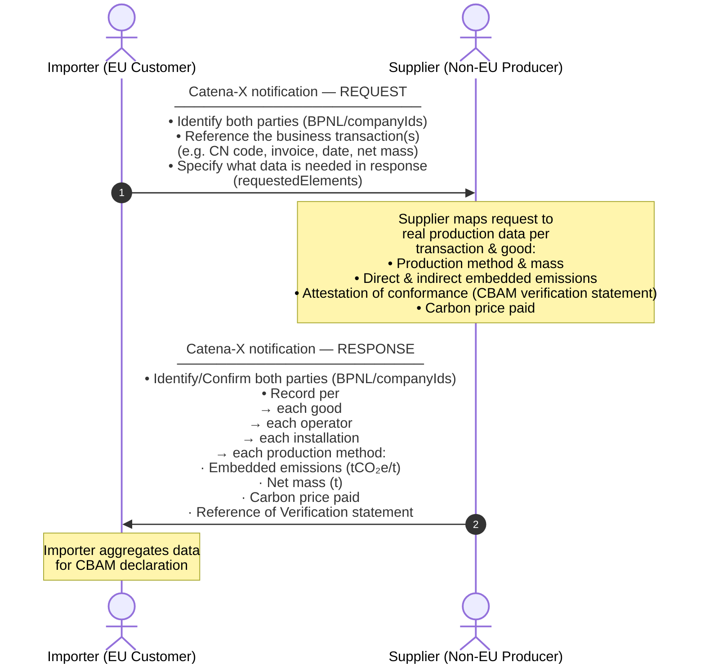

import Kit3DLogo from '@site/src/components/2.0/Kit3DLogo';

<Kit3DLogo kitId="cbam" />

## Introduction

The EU's Carbon Border Adjustment Mechanism (CBAM) sets a carbon price on imports of carbon-intensive goods to prevent carbon leakage, meaning the risk that companies relocate production to countries with weaker climate policies, or that EU products are displaced by more emission-intensive imports. CBAM aims to ensure that the carbon cost of imports reflects the same standards applied to domestic EU production.

EU CBAM applies to the sectors with the highest emission intensity and carbon leakage risk: **cement, iron and steel, aluminum, fertilizers, electricity, and hydrogen**. When fully implemented, it will cover more than 50% of emissions in the sectors subject to the EU Emissions Trading System (ETS). The definitive regime is in force since 2026.

For two reasons, regular update of this KIT will likely be required:

- Regulatory specification in the EU is incrementally deployed and refined (and will continue to be for the next years), whilst an incremental expansion of the CBAM goods scope has been envisioned by the EU from the beginning.
- From 2027, the UK will introduce its own CBAM, which is pretty comparable to the EU one. Other countries are also in preparations of very similar schemes. This KIT aims to provide a common approach for all of them, as far as feasible.

**Official Links:**

[Carbon Border Adjustment Mechanism](https://taxation-customs.ec.europa.eu/carbon-border-adjustment-mechanism_en)

[CBAM Guidance and Legislation - Taxation and Customs Union](<https://taxation-customs.ec.europa.eu/carbon-border-adjustment-mechanism/cbam-guidance-and-legislation_en>)

### Mission and Vision

The Eclipse Tractus-X CBAM KIT provides a standardized, interoperable model for exchanging CBAM-relevant data, across global supply chains. It enables companies to:

- Collect validated CBAM emissions data at the material and component level using harmonized methodologies.
- Automate CBAM data request workflows across fragmented system landscapes, reducing redundancies and administrative burden whilst ensuring compliance with CBAM regulations.
- Integrate upstream and downstream data from suppliers and partners, enabling accurate transmission of embedded emissions data for imported goods.
- Ensure data sovereignty and security, allowing companies to retain control over sensitive sustainability information while meeting transparency requirements.
- Facilitate recognition of foreign carbon pricing schemes, pending regulation.
- Enable CBAM related cost analyses, facilitate strategic sourcing decisions

### Catena-X relevant CBAM Workflow

CBAM obligations are triggered when goods are imported into the EU under a CN Code subject to CBAM reporting and originating from specified non-EU countries. Only importers whose annual import volumes exceed a defined mass-based threshold are required to submit declarations to the official EU CBAM portal (currently supporting XML uploads or manual entry). Each declaration must for example include details on:

- Production installation and date
- Verified CO₂ emissions
- Electricity sources used, etc.

To collect the required supplier-specific data, the importer sends a structured data request to the supplier via Catena-X. The supplier responds with tailored emission reports covering the relevant installations and production methods (see Figure 1). Solid arrows illustrate the main focus of this KIT which is the data exchange between supplier and importer. Dashed arrows illustrate the downstream exchange of data between supplier and operator which is also possible with the presented data model. The dashed box indicates the focus of this KIT which excludes the exchange of data between importer and EU CBAM portal.


Figure 1: The CBAM Data Exchange mechanism with Catena-X

### CBAM Personas

<details>
  <summary>CBAM Personas | click to expand</summary>

Here is a tabular overview of the key roles in the CBAM process:

| Role | Description |
| --- | --- |
|Importer/Declarant (Customer)| Is responsible for requesting CBAM relevant reporting data, purchasing CO₂ certificates, and submitting reports to the EU|
|Supplier| Business (contractual) partner of the customer/Importer responsible to provide initial product and site information from the operator to the customer.|
|Operator| Is a company who operates one or multiple installations (production sites). Responsible for providing verified CO₂ emission data.|
|EU| The European Commission, specifically the Directorate-General for Taxation and Customs Union (DG TAXUD), is responsible for the design, development, and maintenance of the CBAM Portal and its associated systems. The CBAM Registry, which is the central platform for managing declarant authorizations, submitting emissions reports (planned) and for facilitating communication between importers, national authorities, and the Commission.|

</details>

---
<br/>

## Business Process of CBAM Data Exchange in Catena-X

### CBAM Data Exchange Flow

This diagram shows the high-level flow of a CBAM data exchange between an **importer** (i.e. customer, typically EU-based) and a **supplier** (i.e. non-EU producer or distributor) using the Catena-X **notification Standard**. Each exchange entails records for one or multiple CBAM goods tied to specific business transactions. This results in a tailored emissions response scoped exactly to the specified transactions, making each exchanged response unique. Both business partners require a CBAM app to generate and receive data via standardized Catena-X notifications. CBAM apps are commercially available applications. The specification of the two current data models (request and response) is partly based on assumptions due to insufficiently specified regulation texts (data models are subject to change once official EU CBAM regulation is updated).



### Principles of Request and Response

<details>
  <summary>Principles of Request and Response | click to expand</summary>

| Principle | Explanation |
|---|---|
| **Transaction-scoped** | Every request per CBAM good is typically tied to a specific reference document (e.g. invoice), reference period and requested net mass. The response is tailored to that transaction, optionally pointing to a specific item on the reference document, and is scaled to the requested net mass. |
| **Multiple operators, installations and production methods** | One supplier may source from multiple operators. Each operator may account for multiple installations. One installation may use multiple production methods. Each method gets its own emission record and mass split, which in total sum up to the requested net mass value. |
| **Tailored scope** | The importer specifies via `requestedElements` which data blocks are needed. The supplier fills those sections as requested. The request can be sent with prefilled data fields to simplify the supplier response. The independent CBAM apps being used by the business partners are required to manage the contained information in the notifications according the specified Catena-X datamodels. |
| **Verifiable** | Each emission record provided in a response can carry a description of an attestation of conformance (third-party verification statement) and a link to the document. |

</details>

---
<br/>

## CBAM Data models: Request & Response

### CBAM Request Data Model

This table gives a business-level overview of major objects and properties contained in the CBAM request data model. For full technical details see the corresponding datamodel file.

```text
Request
├── requestedElements          # scope: which sections to include in response
├── companyIds                 # importer + supplier identifiers
└── good[]                     # one entry per CBAM-declared good and business transaction
    ├── cnCode / productIds / productDescription
    ├── businessTransactionDetails
    │   └── referencePeriod / requestNetMass
    └── operator[]
        ├── operatorIdentification
        ├── operatorNetMass
        └── installation[]
            ├── installationIdentification
            ├── installationNetMass
            └── emissionsRecords[]
                ├── productionMethod
                └── activityData / netMass
```

### CBAM Response Data Model

This table gives a business-level overview of major objects and properties contained in the CBAM response data model. For full technical details see the corresponding datamodel file.

```text
Response
├── companyIds                 # importer + supplier identifiers
└── good[]                     # mirrors request, fully populated
    ├── cnCode / productIds / productDescription
    ├── businessTransactionDetails
    │   └── referencePeriod / requestNetMass
    └── operator[]
        ├── operatorIdentification
        ├── operatorNetMass
        └── installation[]
            ├── installationIdentification
            ├── installationNetMass
            └── emissionsRecords[]
                ├── productionMethod
                ├── activityData / netMass
                ├── directEmissions
                ├── indirectEmissions
                ├── freeAllocationFactor
                ├── attestationOfConformance
                └── carbonPricePaid[]
```

---
<br/>

## Use Cases covered with this CBAM KIT

The CBAM KIT supports two distinct data exchange phases, both implemented as Catena-X notifications: the importer sends a request notification (with the CBAM request data model in the notification body) and the supplier responds with a corresponding response notification (with the CBAM response data model in the body). Partner identification is handled via the Catena-X notification header, not within the data models themselves. The **requestedElements** property in the request allows the importer to scope each exchange precisely — requesting only the data blocks needed for the given phase.

### Ongoing Data Collection During the Year of Import, Forecasting and Certificate Purchase

Throughout the import year, the importer collects shipment-specific data to support forecasting, to obtain the legally required amount of certificates, and to build a traceable record for the final annual declaration. Two types of exchanges are relevant here:

**Supplier and installation identification:** When a new supplier is onboarded or an existing one needs to be verified, the importer sends a request scoped to identity and installation data — using **requestedElements** to limit the response to operator and installation identification fields (e.g. `operatorIds`, `operatorName`, `installationIdentification`, `address`). The supplier responds with their own identifiers and the relevant installation details. If the supplier sources from multiple operators, each operator is represented as a separate operator object in the response. If sub-suppliers are involved and registered in Catena-X, the same notification exchange can be applied along the supply chain.

**Composition and installation data for interim forecasting:** During the year, the importer uses transaction-specific data (CN code, net mass, reference period, business transaction identifiers such as invoice number) to send a scoped request for installation and mass flow information. The request references the relevant business transaction via `businessTransactionDetails` and limits the expected response to non-emission fields using **requestedElements** — for example requesting `operatorNetMass`, `installationIdentification`, and `installationNetMass`, but not emission records. The supplier responds with the applicable operator(s), installation(s), and the net mass attributable to the requested transaction. This data supports quarterly forecasting and early certificate purchase based on default emission values or previously known actuals.

Trading CO₂ certificates and submitting declarations to the official EU CBAM portal are outside the scope of this KIT.

### Period Closing Emissions Data Collection

In the time following the reporting period, the importer sends requests to all relevant suppliers to collect the actual verified CO₂ emission data for each imported good. The request references the specific business transaction(s) via `businessTransactionDetails` (e.g. invoice number, reference period, net mass) and uses **requestedElements** to explicitly require the full emission-related data blocks from the supplier.

The supplier responds with a complete response notification covering, for each good and operator:

- The applicable production method(s) (`productionMethod` with `methodId`) and the net mass per method
- Direct and indirect embedded emissions (`directEmissions`, `indirectEmissions`) per production method and installation
- An attestation of conformance (`attestationOfConformance`) issued by an accredited third-party verifier, including a link to the verification document
- Any carbon price already paid in the country of production (`carbonPricePaid`), including the instrument type, legal basis, and amount

If the direct supplier does not operate the production installation, they must obtain this data from the operator and pass it through. Each operator is represented as a separate object in the response, and each installation within that operator can carry multiple production method records — enabling full traceability from transaction to emission value.

A possible alternative use case is the request for emissions per CBAM good on single installation level. In this case, the request should define the installation that the response declares emissions for. Such a case is relevant, if the importer already received information about the mass allocations to installations in previous responses before closing of the reporting period.

---
<br/>

## CBAM Activities Outside of this KIT

The following activities are part of the broader CBAM compliance process but are **not** covered by the data models or exchanges defined in this KIT.

**Submission of the annual CBAM declaration:** Using the verified emission data collected from suppliers via this KIT, the importer submits an annual CBAM declaration to the EU CBAM portal. The declaration states the actual embedded emissions imported during the reporting year and any local carbon taxes already paid by operators in the country of production. Based on this, the final number of CO₂ certificates to be surrendered is calculated. If the importer has purchased too few certificates during the year, additional ones must be acquired / excess certificates can be sold to the authorities. Certificate trade and the preparation and submission of this declaration are outside the scope of this KIT.

---
<br/>

## Semantic Models

The CBAM KIT defines two Semantic Aspect Meta Models (SAMM), one for the request and one for the response. A SAMM is a machine-readable, versioned specification of a data model. It defines every property, its data type, whether it is mandatory or optional, and the relationships between objects. The CBAM SAMMs cover all attributes shown in the data model tables above, from company identifiers and business transaction references through to operator and installation details, production methods, embedded emission values, attestation of conformance, and carbon price information.

For adopting companies and their software vendors, the SAMM serves as the authoritative implementation reference. CBAM apps on both the importer and supplier side must conform to these models when constructing and processing notifications. The full technical specification of both SAMMs is provided in the development view of this KIT.

---
<br/>

## 💬 We would like to hear your feedback

This KIT is currently published as a **Minimum Viable Product (MVP)**. It reflects our best current understanding of the CBAM regulation and its implementation in Catena-X, but it is actively evolving.

Your input directly shapes the next version. We welcome feedback on any aspect of this KIT, including the architecture, the data models, the described use cases, the clarity of the documentation, and the overall fit to your business needs.

[Click this link to provide feedback](https://forms.office.com/Pages/ResponsePage.aspx?id=bSzSGggvBU-guuF_bOiDgJKhZVObB0BBlH3UfbND6YFUNU8xUUc1T09PUDdKVkJVMzYwMzdKR1pNMS4u)

You can also use the form to get in touch with the team directly.

---
<br/>

## NOTICE

This work is licensed under the [CC-BY-4.0](https://creativecommons.org/licenses/by/4.0/legalcode).

- SPDX-License-Identifier: CC-BY-4.0
- SPDX-FileCopyrightText: 2026 BASF SE
- SPDX-FileCopyrightText: 2026 Bayerische Motoren Werke Aktiengesellschaft (BMW AG)
- SPDX-FileCopyrightText: 2026 SAP SE
- SPDX-FileCopyrightText: 2026 Siemens AG
- SPDX-FileCopyrightText: 2026 Contributors to the Eclipse Foundation
- Source URL: [https://github.com/eclipse-tractusx/eclipse-tractusx.github.io/blob/main/docs-kits/kits/cbam-kit/adoption-view/adoption-view.md](https://github.com/eclipse-tractusx/eclipse-tractusx.github.io/blob/main/docs-kits/kits/cbam-kit/adoption-view/adoption-view.md)
