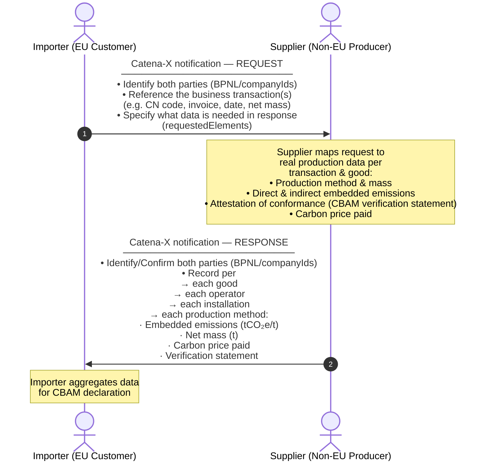

import Kit3DLogo from '@site/src/components/2.0/Kit3DLogo';

<Kit3DLogo kitId="cbam" />

## Introduction

The steady advance of climate change is a global problem that requires global solutions. In view of the fact that the EU has set itself very high climate targets, which are constantly being increased, and that many non-EU countries have less stringent climate policies, there is a risk of carbon leakage. This occurs when companies based in the EU relocate their carbon-intensive production to countries with less stringent climate protection measures than in the EU, or when EU products are replaced by more carbon-intensive imports.

To counteract this development, the EU has launched the Carbon Border Adjustment Mechanism (short: CBAM). This is the EU's instrument for setting fair prices for carbon emissions from the production of carbon-intensive goods imported into the EU. It is also intended to promote cleaner industrial production in non-EU countries.

By confirming that a price has been paid for the carbon emissions generated in the production of certain goods imported into the EU, the CBAM ensures that the carbon price for imports corresponds to the carbon price for domestic production and that the EU's climate targets are not undermined.

The CBAM will initially apply to imports of certain goods and selected inputs whose production is carbon intensive and where the risk of carbon leakage is highest: **cement, iron and steel, aluminum, fertilizers, electricity and hydrogen**. With this expanded scope, the CBAM will eventually - when fully implemented - cover more than 50% of emissions in the sectors covered by the Emission Trading System (ETS). An expansion of the sectors is planned for the future.

The Carbon Border Adjustment Mechanism will apply in its definitive regime from 2026, but the transitional phase, which will last between October 2023 and the end of December 2025, is already underway.

### Vision

A transparent, interoperable, and sustainable industrial data ecosystem that empowers companies worldwide to accurately capture, share, and manage embedded carbon emissions data for EU-CBAM reporting.

### Mission

Catena-X provides a reliable, standardized data infrastructure that enables industrial stakeholders to seamlessly exchange specific embedded emission data across global value chains. In the context of the EU CBAM, this Eclipse Tractus-X CBAM KIT empowers companies to:

- Collect and validate emissions data at the material and component level using harmonized methodologies.
- Automate CBAM data request workflows, reducing administrative burden and ensuring compliance with EU regulations.
- Integrate upstream and downstream data from suppliers and partners, enabling accurate transmission of the data required for the calculation of embedded emissions for imported goods.
- Ensure data sovereignty and security, allowing companies to retain control over sensitive sustainability information while meeting transparency requirements.
- Facilitate recognition of foreign carbon pricing schemes, promoting fair treatment of non-EU producers.
- Facilitate strategic decision-making by providing actionable insights into emissions hotspots, cost implications, and optimization opportunities within the supply chain.

[Carbon Border Adjustment Mechanism](https://taxation-customs.ec.europa.eu/carbon-border-adjustment-mechanism_en)

[CBAM Guidance and Legislation - Taxation and Customs Union](https://taxation-customs.ec.europa.eu/carbon-border-adjustment-mechanism/cbam-guidance-and-legislation_en)

## Business Process

### Initiation of the CBAM Process

The CBAM (Carbon Border Adjustment Mechanism) process begins when a product is imported into the EU under a CN Code that is subject to CBAM reporting and originates from specified countries. Only importers with annual imports above the defined mass-based threshold are subject to CBAM declarations to the official CBAM declarations portal.
CBAM relevant data must be reliably collected and submitted via the EU CBAM portal, which currently supports XML uploads or manual entry (no futher information available at this time). The CBAM declaration requires detailed information, including:

- Production date and installation
- Energy sources used
- Verified CO₂ emissions

To enable the collection of supplier specific data the importer initiates the request for CBAM relevant data via Catena-X (see Figure 1). The supplier responds with tailored emission reports and descriptions of the relevant installations.


Figure 1: The CBAM Data Exchange mechanism with Catena-X

### CBAM Data Exchange Flow

This diagram shows the high-level flow of a CBAM data exchange between an **importer** (i.e. customer, typically EU-based) and a **supplier** (i.e. non-EU producer or distributer) using the Catena-X **notification Standard** (see development view). Each exchange entails records for one or multiple CBAM goods tied to specific business transactions. This results in a tailored emissions response scoped exactly to the specified transactions, making each exchanged response unique. Both business partners require a CBAM app to generate and receive Catena-X notifications. The specification of the two current data models (request and response) is partly based on assumptions due to insufficiently specified regulation texts (data models are subject to change once official EU CBAM regulation is updated).



## Principles of CBAM exchange

| Principle | Explanation |
|---|---|
| **Transaction-scoped** | Every request per CBAM good is typically tied to a specific reference document (e.g. invoice), reference period and requested net mass. The response is tailored to that transaction, optionally pointing to a specific item on the reference document, and is scaled to the requested net mass. |
| **Multiple operators, installations and production methods** | One supplier may source from multiple operators. Each operator may account for multiple installations. One installation may use multiple production methods. Each method gets its own emission record and mass split, which in total sum up to the requested net mass value. |
| **Tailored scope** | The importer specifies via `requestedElements` which data blocks are needed — the supplier fills those sections as requested. The request can be sent with prefilled data fields to simplify the supplier response. The independent CBAM apps being used by the business partners are required to manage the contained information in the notifications according the specified Catena-X datamodels. |
| **Verifiable** | Each emission record can carry a description of an attestation of conformance (third-party verification statement) and a link to the document. |

## CBAM Data models: Request & Response

### CBAM Request Data Model

<details>
  <summary>CBAM REQUEST Data model - Property Overview | click to expand</summary>

This table gives a business-level overview of all properties in the CBAM request data model. **M** = mandatory, **O** = optional. Object groups are separated by blank rows; `·` dots indicate nesting depth. For full technical details see the corresponding datamodel file.

| Property | M/O | Description | Example |
|---|---|---|---|
| **requestedElements** | O | List of element identifiers that define the scope of objects and/or data attributes requested for inclusion in the supplier response. The identifiers refer to sections and attributes defined in the corresponding request type schemes, and indicate which parts of the data model are expected to be provided in the response (subject to the rules of the respective response schema, e.g., mandatory fields and conditional dependencies). | associatedReferenceDocument, operatorIdentification, operatorActivityData |
| | | | |
| **companyIds** | O | Object with attributes describing the identifiers of the two business exchanging this dataset, namely the requesting and the responding company | n.a. |
| | | | |
| _**requestingCompanyIds**_ | O | Object containing one or multiple pairs of identifier type and value of the requesting company. | n.a. |
| `··` type | M | Name of the identifier type. | Company-ID |
| `··` value | M | Value of the stated identifier type. | Customer-Corp-12-EU |
| | | | |
| _**· respondingCompanyIds**_ | O | Object containing one or multiple identifiers of the responding company. | n.a. |
| `··` type | M | Name of the identifier type. | Supplier-ID |
| `··` value | M | Value of the stated identifier type. | Steel-Corp-12-IN |
| | | | |
| **good** | M | Array of good records to be reported. Each good record represents one declared good instance identified by CN Code and business transaction details and contains the CBAM-related information for that declared good.  | n.a. |
| | | | |
| `·` cnCode | M | This is the 8-digit CN code (combined nomenclature) of the reported good, refering to official CBAM value list to ensure updated content.  | 72011000 |
| | | | |
| _**· productIds**_ | O | Set of product identifiers to identify the product from the business transaction. | n.a. |
| `··` type | M | Name of the identifier type. | GTIN |
| `··` value | M | Value of the stated identifier type. | 4712345060507 |
| | | | |
| `·` productDescription | O | Free text describing the product and any characteristics that help identify the right business transaction per request. | Hot-rolled steel coil, grade S235JR |
| | | | |
| _**· businessTransactionDetails**_ | O | Object describing the specific business transaction between the customer (e.g. importer) and the supplier, so the request can be mapped to a real transaction. | n.a. |
| _**·· transactionReferenceDocuments**_ | O | List of reference documents used to identify the transaction (e.g., invoice, purchase order, customs declaration, shipment); each entry provides a document type and identifier value. | n.a. |
| `···` type | M | Reference document type/category (e.g., invoice, purchaseOrder, customsDeclaration). | invoice |
| `···` id | M | Identifier of the document for the given type (e.g., invoice number). | INV-2024-12345 |
| `··` requestReferencePeriodStart | M | Start timestamp of the requested reference period; start and end must be within the same calendar year. | 2024-01-01T00:00:00Z |
| `··` requestReferencePeriodEnd | M | End timestamp of the requested reference period; start and end must be within the same calendar year. | 2024-12-31T23:59:59Z |
| `··` requestedNetMass | O | Net mass (tonnes) of CBAM-relevant good the request relates to (e.g., from customs). Note, value shall match the sum across all corresponding production method net mass values in the response. | 60 |
| | | | |
| _**· operator**_ | O | One or multiple objects containing attributes that describe an operator each that legally owns the installations producing the CBAM good that is subject of this request. Operator can be different to supplier. One supplier (business partner of this transaction) can source the good defined in the business transaction from other suppliers. This can result in multiple operators (mutliple operator objects) involved in the depicted supply chain.  | n.a. |
| _**·· transactionReferenceDocumentLink**_ | O | Pointer to a reference document previously provided in businessTransactionDetails, optionally refined to a specific part/item of that document, to indicate which document (and which part of it) the operator-related response data corresponds to. | n.a. |
| `···` refDocType | M | Type of the referenced document; must match a reference document type from the business transaction details object in the request. | invoice |
| `···` refDocId | M | Identifier of the referenced document; must match the corresponding reference document value from the request. | INV-2024-12345 |
| | | | |
| _**··· refDocElement**_ | O | Additional locator/metadata to identify a specific element within the referenced document (e.g., line item, position number, material code, annex section). Used when the document covers multiple goods/operators and you need to specify which part applies. | n.a. |
| `····` type | M | Kind of element locator provided (e.g., invoiceLineItem, customsItemNumber, purchaseOrderLine, shipmentPosition). | batchNumber |
| `····` value | M | Value of the locator (e.g., line “10”, item “3”, position “0002”). | 02 |
| | | | |
| _**·· operatorIdentification**_ | O | Object containing attributes to identify the operator. | n.a. |
| `···` operatorIsSupplier | O | Boolean property indicating whether the supplier (i.e., the business transaction partner) is also the installation operator.  | TRUE |
| | | | |
| _**··· operatorIds**_ | O | Unique set of identifiers for the operator. BPNL and Operator CBAM ID are listed as separate attributes. | n.a. |
| `····` operatorBpnl | O | BPNL (business partner number legal) of operator, if company is registered at Catena-X. | BPNL000000000OPR |
| `····` operatorCbamId | O | Unique identifier for the operator in the official EU O3CI portal (operator of third country installation).  | O3CI-OPR-123456 |
| | | | |
| _**···· otherIds**_ | O | Other identifiers for the operator excluding BPNL and Operator CBAM ID. | n.a. |
| `·····` type | M | Name of the identifier type | Operator-Tracking-ID |
| `·····` value | M | Value of the stated identifier type | OP.DE-Steel_north_AG1 |
| `···` operatorName | O | Name of the operator | Steel Example Corp. |
| `···` operatorContactEmailAddress | O | The email address of the person that is assigned in the contact details of the operator | contact@steelexample.com |
| | | | |
| _**··· address**_ | O | Object containing attributes that document the address of the operator. | n.a. |
| `····` country | O | Country code where the operator is established, refering to official CBAM value list to ensure updated content. | DE |
| `····` city | O | The city where the operator is located | Duisburg |
| `····` street | O | The street where the operator is located | Werkstraße 1 |
| | | | |
| _**·· operatorActivityData**_ | O | Object describing mass flow attributed to the operator. | n.a. |
| `···` netMass | M | Net mass (in tonnes) of the CBAM-relevant good attributable to the specific request, summed over all installations belonging to the operator described in this object. | 60.0 |
| | | | |
| _**·· installation**_ | O | One or more objects describing each installation producing the CBAM good that is the subject of this request. A single operator may own multiple installations supplying the CBAM good in this request; in that case, multiple installation objects are provided. Each installation may include multiple production methods. | n.a. |
| _**··· installationIdentification**_ | O | Object containing attributes to identify the installation. | n.a. |
| _**···· installationIds**_ | O | Unique set of identifiers of the installation. | n.a. |
| `·····` installationCbamId | O | Unique identifier for the installation in the official EU O3CI portal (operator of third country installation).  | O3CI-INST-654321 |
| | | | |
| _**····· otherIds**_ | O | Other identifiers of the installation, excluding the official CBAM installation ID.  | n.a. |
| `······` type | M | Name of the identifier type. | Installation-ID |
| `······` value | M | Value of the stated identifier type. | INST-987654 |
| `····` installationName | O | Name of the installation. | Steel Manufacturing Facility - Delhi Plant |
| | | | |
| _**···· address**_ | O | Object containing attributes that document the address of the installation. | n.a. |
| `·····` countryCode | M | Country code where the installation is established and the good is produced, refering to official CBAM value list to ensure updated content. | IN |
| `·····` city | M | The city where the installation is located. | Delhi |
| `·····` longitude | O | The longitude where the installation is located. | 77.2197 |
| `·····` latitude | O | The latitude where the installation is located. | 28.6139 |
| `·····` typeOfCoordinates | O | The type of coordinates: 01 GPS, 02 GNSS | 01 |
| `·····` plotOrParcelNumber | O | The plot or parcel number of the location. | PLOT-456-INDUSTRIAL-ZONE-A |
| `·····` unlocode | O | The UNLOCODE as defined by UNECE list which can be downloaded at [https://unece.org/trade/uncefact/unlocode](https://unece.org/trade/uncefact/unlocode) | INDEL |
| | | | |
| _**··· installationActivityData**_ | O | Object describing temporal reference and mass flow attributed to the installation. | n.a. |
| `····` netMass | M | Net mass (in tonnes) of the CBAM-relevant good attributable to the specific request, produced in the stated installation, calculated as the sum across all applicable production methods within that installation. | 60.0 |
| | | | |
| _**··· emissionsRecords**_ | O | One or more objects detailing the specific production method(s) that the emission objects refer to; each installation may include multiple production methods. | n.a. |
| _**···· productionMethod**_ | O |  |  |
| `·····` methodId | M | Specific identifier of the production method according the official value list provided by the CBAM declarant portal. | P24 |
| `·····` specificSteelMillId | O | Specific identifier of the steel mill used for the production of the good, if applicable.  | MILL-001 |
| `·····` additionalInformation | O | Any additional information that the supplier wants to provide with regard to the production method.  | Uses recycled scrap as input |
| | | | |
| _**···· productionMethodActivityData**_ | O | An object describing the temporal reference and the mass flow attributable to the specified production method within an installation. | n.a. |
| `·····` referencePeriodStart | O | Start date of the period in which relevant data was collected at the installation for the specified production method, serving as the reference period for emissions calculation; both start and end date must be in the same calendar year. | 2024-01-01T00:00:00Z |
| `·····` referencePeriodEnd | O | End date of the period in which relevant data was collected at the installation for the specified production method, serving as the reference period for emissions calculation; both start and end date must be in the same calendar year. | 2024-12-31T23:59:59Z |
| `·····` netMass | M | Net mass (in tonnes) of the CBAM-relevant good attributable to the specific request produced in the stated installation by the stated production method only. | 60.0 |

</details>

<details>
  <summary>CBAM REQUEST Example JSON Payload Notification | click to expand</summary>

Due to the fact that in Catena-X there is a Notification Payload standardized in [CX-0151 Industry Core Basics](https://catenax-ev.github.io/docs/standards/CX-0151-IndustryCoreBasics#14-examples) the CBAM REQUEST payload will follow it and be embedded in a notification payload inside the `content` key, additionally it will have a `header` which contains important metadata for the applications to parse. This payload is just an example from how it could look like, since there is yet no standard available:

```json
{
  "header": {
    "senderBpn" : "BPNL0000000001AB",
    "senderFeedbackUrl": "https://domain.tld/path/to/api",
    "context" : "CBAM-CBAMAPI-Request:1.0.0",
    "messageId" : "3b4edc05-e214-47a1-b0c2-1d831cdd9ba9",
    "receiverBpn" : "BPNL0000000002CD",
    "sentDateTime" : "2025-05-04T00:00:00-07:00",
    "version" : "0.1.0"
  },
  "content": {
    "requestedElements": [
      "operatorIdentification",
      "operatorActivityData",
      "installation",
      "emissionsRecords"
    ],
    "companyIds": {
      "requestingCompanyIds": [
        {
          "type": "Company-ID",
          "value": "Customer-Corp-12-EU"
        }
      ],
      "respondingCompanyIds": [
        {
          "type": "Supplier-ID",
          "value": "Steel-Corp-12-IN"
        }
      ]
    },
    "good": [
      {
        "cnCode": "72011000",
        "productIds": [
          {
            "type": "GTIN",
            "value": "4712345060507"
          }
        ],
        "productDescription": "Hot-rolled steel coil, grade S235JR",
        "businessTransactionDetails": {
          "transactionReferenceDocuments": [
            {
              "type": "invoice",
              "id": "INV-2024-12345"
            }
          ],
          "requestReferencePeriodStart": "2024-01-01T00:00:00Z",
          "requestReferencePeriodEnd": "2024-12-31T23:59:59Z",
          "requestedNetMass": 60
        },
        "operator": [
          {
            "transactionReferenceDocumentLink": {
              "refDocType": "invoice",
              "refDocId": "INV-2024-12345",
              "refDocElement": {
                "type": "batchNumber",
                "value": "02"
              }
            },
            "operatorIdentification": {
              "operatorIsSupplier": true,
              "operatorIds": {
                "operatorBpnl": "BPNL000000000OPR",
                "operatorCbamId": "O3CI-OPR-123456",
                "otherIds": [
                  {
                    "type": "Operator-Tracking-ID",
                    "value": "OP.DE-Steel_north_AG1"
                  }
                ]
              },
              "operatorName": "Steel Example Corp.",
              "operatorContactEmailAddress": "contact@steelexample.com",
              "address": {
                "country": "DE",
                "city": "Duisburg",
                "street": "Werkstraße 1"
              }
            },
            "operatorActivityData": {
              "netMass": 60.0
            },
            "installation": [
              {
                "installationIdentification": {
                  "installationIds": {
                    "installationCbamId": "O3CI-INST-654321",
                    "otherIds": [
                      {
                        "type": "Installation-ID",
                        "value": "INST-987654"
                      }
                    ]
                  },
                  "installationName": "Steel Manufacturing Facility - Delhi Plant",
                  "address": {
                    "countryCode": "IN",
                    "city": "Delhi",
                    "longitude": 77.2197,
                    "latitude": 28.6139,
                    "typeOfCoordinates": "01",
                    "plotOrParcelNumber": "PLOT-456-INDUSTRIAL-ZONE-A",
                    "unlocode": "INDEL"
                  }
                },
                "installationActivityData": {
                  "netMass": 60.0
                },
                "emissionsRecords": [
                  {
                    "productionMethod": {
                      "methodId": "P24",
                      "specificSteelMillId": "MILL-001",
                      "additionalInformation": "Uses recycled scrap as input"
                    },
                    "productionMethodActivityData": {
                      "referencePeriodStart": "2024-01-01T00:00:00Z",
                      "referencePeriodEnd": "2024-12-31T23:59:59Z",
                      "netMass": 60.0
                    }
                  }
                ]
              }
            ]
          }
        ]
      }
    ]
  }
}
```

</details>

### CBAM Response Data Model

<details>
  <summary>CBAM RESPONSE Data model - Property Overview | click to expand</summary>

This table gives a business-level overview of all properties in the CBAM response data model. **M** = mandatory, **O** = optional. Object groups are separated by blank rows; `·` dots indicate nesting depth. For full technical details see the corresponding datamodel file.

| Property | M/O | Description | Example |
|---|---|---|---|
| **companyIds** | O | Object with attributes describing the identifiers of the two business exchanging this dataset, namely the requesting and the responding company | n.a. |
| | | | |
| _**· requestingCompanyIds**_ | O | Object containing one or multiple pairs of identifier type and value of the requesting company. | n.a. |
| `··` type | M | Name of the identifier type. | Company-ID |
| `··` value | M | Value of the stated identifier type. | Customer-Corp-12-EU |
| | | | |
| _**· respondingCompanyIds**_ | O | Object containing one or multiple identifiers of the responding company. | n.a. |
| `··` type | M | Name of the identifier type. | Supplier-ID |
| `··` value | M | Value of the stated identifier type. | Steel-Corp-12-IN |
| | | | |
| **good** | M | Array of good records to be reported. Each good record represents one declared good instance identified by CN Code and business transaction details and contains the CBAM-related information for that declared good.  | n.a. |
| | | | |
| `·` cnCode | M | This is the 8-digit CN code (combined nomenclature) of the reported good, refering to official CBAM value list to ensure updated content.  | 72011000 |
| | | | |
| _**· productIds**_ | O | Set of product identifiers to identify the product from the business transaction. | n.a. |
| `··` type | M | Name of the identifier type. | GTIN |
| `··` value | M | Value of the stated identifier type. | 4712345060507 |
| | | | |
| `·` productDescription | O | Free text describing the product and any characteristics that help identify the right business transaction per request. | Hot-rolled steel coil, grade S235JR |
| | | | |
| _**· businessTransactionDetails**_ | O | Object describing the specific business transaction between the customer (e.g. importer) and the supplier, so the request can be mapped to a real transaction. | n.a. |
| _**·· transactionReferenceDocuments**_ | O | List of reference documents used to identify the transaction (e.g., invoice, purchase order, customs declaration, shipment); each entry provides a document type and identifier value. | n.a. |
| `···` type | M | Reference document type/category (e.g., invoice, purchaseOrder, customsDeclaration). | invoice |
| `···` id | M | Identifier of the document for the given type (e.g., invoice number). | INV-2024-12345 |
| `··` requestReferencePeriodStart | O | Start timestamp of the requested reference period; start and end must be within the same calendar year. | 2024-01-01T00:00:00Z |
| `··` requestReferencePeriodEnd | O | End timestamp of the requested reference period; start and end must be within the same calendar year. | 2024-12-31T23:59:59Z |
| `··` requestedNetMass | O | Net mass (tonnes) of CBAM-relevant good the request relates to (e.g., from customs). Note, value shall match the sum across all corresponding production method net mass values in the response. | 60 |
| | | | |
| _**· operator**_ | O | One or multiple objects containing attributes that describe an operator each that legally owns the installations producing the CBAM good that is subject of this request. Operator can be different to supplier. One supplier (business partner of this transaction) can source the good defined in the business transaction from other suppliers. This can result in multiple operators (mutliple operator objects) involved in the depicted supply chain.  | n.a. |
| _**·· transactionReferenceDocumentLink**_ | O | Pointer to a reference document previously provided in businessTransactionDetails, optionally refined to a specific part/item of that document, to indicate which document (and which part of it) the operator-related response data corresponds to. | n.a. |
| `···` refDocType | M | Type of the referenced document; must match a reference document type from the business transaction details object in the request. | invoice |
| `···` refDocId | M | Identifier of the referenced document; must match the corresponding reference document value from the request. | INV-2024-12345 |
| | | | |
| _**··· refDocElement**_ | O | Additional locator/metadata to identify a specific element within the referenced document (e.g., line item, position number, material code, annex section). Used when the document covers multiple goods/operators and you need to specify which part applies. | n.a. |
| `····` type | M | Kind of element locator provided (e.g., invoiceLineItem, customsItemNumber, purchaseOrderLine, shipmentPosition). | batchNumber |
| `····` value | M | Value of the locator (e.g., line “10”, item “3”, position “0002”). | 02 |
| | | | |
| _**·· operatorIdentification**_ | O | Object containing attributes to identify the operator. | n.a. |
| `···` operatorIsSupplier | O | Boolean property indicating whether the supplier (i.e., the business transaction partner) is also the installation operator.  | TRUE |
| | | | |
| _**··· operatorIds**_ | O | Unique set of identifiers for the operator. BPNL and Operator CBAM ID are listed as separate attributes. | n.a. |
| `····` operatorBpnl | O | BPNL (business partner number legal) of operator, if company is registered at Catena-X. | BPNL000000000OPR |
| `····` operatorCbamId | O | Unique identifier for the operator in the official EU O3CI portal (operator of third country installation).  | O3CI-OPR-123456 |
| | | | |
| _**···· otherIds**_ | O | Other identifiers for the operator excluding BPNL and Operator CBAM ID. | n.a. |
| `·····` type | M | Name of the identifier type | Operator-Tracking-ID |
| `·····` value | M | Value of the stated identifier type | OP.DE-Steel_north_AG1 |
| `···` operatorName | O | Name of the operator | Steel Example Corp. |
| `···` operatorContactEmailAddress | O | The email address of the person that is assigned in the contact details of the operator | contact@steelexample.com |
| | | | |
| _**··· address**_ | O | Object containing attributes that document the address of the operator. | n.a. |
| `····` country | O | Country code where the operator is established, refering to official CBAM value list to ensure updated content. | DE |
| `····` city | O | The city where the operator is located | Duisburg |
| `····` street | O | The street where the operator is located | Werkstraße 1 |
| | | | |
| _**·· operatorActivityData**_ | O | Object describing mass flow attributed to the operator. | n.a. |
| `···` netMass | M | Net mass (in tonnes) of the CBAM-relevant good attributable to the specific request, summed over all installations belonging to the operator described in this object. | 60.0 |
| | | | |
| _**·· installation**_ | O | One or more objects describing each installation producing the CBAM good that is the subject of this request. A single operator may own multiple installations supplying the CBAM good in this request; in that case, multiple installation objects are provided. Each installation may include multiple production methods. | n.a. |
| _**··· installationIdentification**_ | O | Object containing attributes to identify the installation. | n.a. |
| _**···· installationIds**_ | O | Unique set of identifiers of the installation. | n.a. |
| `·····` installationCbamId | O | Unique identifier for the installation in the official EU O3CI portal (operator of third country installation).  | O3CI-INST-654321 |
| | | | |
| _**····· otherIds**_ | O | Other identifiers of the installation, excluding the official CBAM installation ID.  | n.a. |
| `······` type | M | Name of the identifier type. | Installation-ID |
| `······` value | M | Value of the stated identifier type. | INST-987654 |
| `····` installationName | O | Name of the installation. | Steel Manufacturing Facility - Delhi Plant |
| | | | |
| _**···· address**_ | O | Object containing attributes that document the address of the installation. | n.a. |
| `·····` countryCode | M | Country code where the installation is established and the good is produced, refering to official CBAM value list to ensure updated content. | IN |
| `·····` city | M | The city where the installation is located. | Delhi |
| `·····` longitude | O | The longitude where the installation is located. | 77.2197 |
| `·····` latitude | O | The latitude where the installation is located. | 28.6139 |
| `·····` typeOfCoordinates | O | The type of coordinates: 01 GPS, 02 GNSS | 01 |
| `·····` plotOrParcelNumber | O | The plot or parcel number of the location. | PLOT-456-INDUSTRIAL-ZONE-A |
| `·····` unlocode | O | The UNLOCODE as defined by UNECE list which can be downloaded at [https://unece.org/trade/uncefact/unlocode](https://unece.org/trade/uncefact/unlocode) | INDEL |
| | | | |
| _**··· installationActivityData**_ | O | Object describing temporal reference and mass flow attributed to the installation. | n.a. |
| `····` netMass | M | Net mass (in tonnes) of the CBAM-relevant good attributable to the specific request, produced in the stated installation, calculated as the sum across all applicable production methods within that installation. | 60.0 |
| | | | |
| _**··· emissionsRecords**_ | O | One or more objects detailing the specific production method(s) that the emission objects refer to; each installation may include multiple production methods. | n.a. |
| _**···· productionMethod**_ | M |  |  |
| `·····` methodId | M | Specific identifier of the production method according the official value list provided by the CBAM declarant portal. | P24 |
| `·····` specificSteelMillId | O | Specific identifier of the steel mill used for the production of the good, if applicable.  | MILL-001 |
| `·····` additionalInformation | O | Any additional information that the supplier wants to provide with regard to the production method.  | Uses recycled scrap as input |
| | | | |
| _**···· productionMethodActivityData**_ | O | An object describing the temporal reference and the mass flow attributable to the specified production method within an installation. | n.a. |
| `·····` referencePeriodStart | M | Start date of the period in which relevant data was collected at the installation for the specified production method, serving as the reference period for emissions calculation; both start and end date must be in the same calendar year. | 2024-01-01T00:00:00Z |
| `·····` referencePeriodEnd | M | End date of the period in which relevant data was collected at the installation for the specified production method, serving as the reference period for emissions calculation; both start and end date must be in the same calendar year. | 2024-12-31T23:59:59Z |
| `·····` netMass | M | Net mass (in tonnes) of the CBAM-relevant good attributable to the specific request produced in the stated installation by the stated production method only. | 60.0 |
| | | | |
| _**···· directEmissions**_ | O | Object detailing the direct embedded emissions referenced to the specific production method and installation. | n.a. |
| `·····` additionalInformation | O | Any additional information that the supplier wants to provide with regard to direct embedded emissions.  | Calculated using official CBAM excel template |
| `·····` specificEmbeddedEmissionsDirect | M | Value of the direct embedded emissions, expressed in tonnes of CO₂ equivalents per tonne of product, calculated with reference to the specific production method and installation.  | 1.85 |
| | | | |
| _**···· indirectEmissions**_ | O | Object deailing the indirect embedded emissions referenced to the specific production method and installation. | n.a. |
| `·····` sourceOfEmissionFactor | M | Declaration of applied literature or published information by the statistics office, according to following allowed values: 01 Other, 02 Commission based on IEA data. | 02 |
| `·····` emissionFactorTonnesCo2PerMwh | M | This element declares the applied emission factor for electricity, expressed as tonnes CO2 per MWh. | 0.45 |
| `·····` sourceOfEmissionFactorValue | M | Any additional information detailing the source of the emissions value. | IEA 2022 Electricity Report |
| `·····` specificEmbeddedEmissionsIndirect | M | Value of the indirect embedded emissions, expressed in tonnes of CO₂ equivalents per tonne of product, calculated with reference to the specific production method and installation. | 0.25 |
| `·····` electricityConsumedMwhPerTonnesGood | M | Value of the consumed electricity, expressed as MWh per tonne of good. | 0.6 |
| `·····` sourceOfElectricity | M | Describes the source of the electricity according to the official value list: SOE01 Direct technical link to electricity generator, SOE02 (Bilateral) power purchase agreement, SOE03 Received from the grid | SOE03 |
| `····` freeAllocationFactor | O | The free allocation factor, expressed as tonnes of CO2​ equivalents per tonne of product, based on the specific material and energy inputs used to produce the product. | 0.6 |
| | | | |
| _**···· attestationOfConformance**_ | O | An object describing the attestation of conformance for the reported installation-level emission values (e.g., an annual verification statement issued by an accredited verification body in accordance with CBAM verification rules). | n.a. |
| `·····` attestationType | O | The type of attestation that indicates the assurance approach and level of trust provided by the attestation of conformance (e.g., CBAM third‑party verification). | CBAM third party verification |
| `·····` attestationStandard | O | The specific standard, methodology, or regulation applied by the installation operator to calculate and report the underlying results (e.g., emissions data) that are covered by the attestation of conformance. | Regulation (EU) 2025/2083 |
| `·····` standardName | O | The specific standard, rules, or regulation that defines how the provider of the attestation of conformance performs the attestation activities (e.g., evaluation approach, evidence requirements, level of assurance) to determine whether the reported results conform to the applicable calculation/reporting standard. |  |
| `·····` providerName | O | The legal name of the organization that issues the attestation of conformance, e.g. verifier name. | TÜV X |
| `·····` providerID | O | A unique identifier of the provider of the attestation of conformance as issued by the accreditation institute, i.e. accreditation number. | 5493001KJTIIGC8Y1R12 |
| `·····` accreditationBodyName | O | The name of the organization that grants and maintains the formal accreditation under which the provider of the attestation of conformance is authorized to perform the attestation. | National Accreditation Institute ABX |
| `·····` attestationOfConformanceId | O | A unique identifier assigned by the provider of the attestation of conformance to the attestation document (e.g., verification statement) for tracking and reference. | 123e4567-e89b-12d3-a456-426614174000 |
| `·····` attestationOfConformanceLink | O | A URL to the attestation of conformance document (e.g. verification statement), enabling manual verification of its validity and authenticity. | [https://exampleverifier.com/cbam/statement/123e4567](https://exampleverifier.com/cbam/statement/123e4567) |
| `·····` completedAt | O | Time stamp for when the attestation of conformance was issued. | 2024-03-15T10:00:00Z |
| | | | |
| _**···· carbonPricePaid**_ | O | One or multiple objects describing the carbon price due in a third country per emission object on installation level.  | n.a. |
| `·····` typeOfInstrument | O | Attribute describing the form of carbon price, also referred to as type of instrument. The values are defined as: 01 Carbon tax, 02 Carbon levy, 03 Carbon fee, 04 National Emissions Trading System, 05 Regional Emissions Trading System, 06 Other | 01 |
| | | | |
| _**····· independentPersonId**_ | M | Identifier of the independent person issuing a payment statement about the carbon price paid by the direct supplier or any other tier-n supplier in the value chain. | n.a. |
| `······` type | M | Name of the identifier type | National CBAM Verifier Registry |
| `······` value | M | Value of the stated identifier type | CBAM_VER_ZGG0612 |
| `·····` descriptionAndIndicationOfLegalAct | O | Reference the description of the underlying legal act according to which the carbon price was paid | Country ABC National Carbon Tax Act 2022 |
| `·····` amountOfCarbonPricePaid | O | Monetary value of the paid carbon price | 12000.00 |
| `·····` currency | O | The currency used for the declared amount to be paid, refering to official CBAM value list to ensure updated content. | CNY |
| `·····` countryCode | O | Country code where the carbon price is paid, refering to official CBAM value list to ensure updated content. | CN |

</details>

<details>
  <summary>CBAM RESPONSE Example JSON Payload Notification | click to expand</summary>

Due to the fact that in Catena-X there is a Notification Payload standardized in [CX-0151 Industry Core Basics](https://catenax-ev.github.io/docs/standards/CX-0151-IndustryCoreBasics#14-examples) the CBAM RESPONSE payload will follow it and be embedded in a notification payload inside the `content` key, additionally it will have a `header` which contains important metadata for the applications to parse. This payload is just an example from how it could look like, since there is yet no standard available:

```json
{
  "header" : {
    "senderBpn" : "BPNL0000000001AB",
    "senderFeedbackUrl": "https://domain.tld/path/to/api",
    "context" : "CBAM-CBAMAPI-Response:1.0.0",
    "messageId" : "3b4edc05-e214-47a1-b0c2-1d831cdd9ba9",
    "receiverBpn" : "BPNL0000000002CD",
    "sentDateTime" : "2025-05-04T00:00:00-07:00",
    "version" : "0.1.0"
  },
  "content": {
    "companyIds": {
      "requestingCompanyIds": [
        {
          "type": "Company-ID",
          "value": "Customer-Corp-12-EU"
        }
      ],
      "respondingCompanyIds": [
        {
          "type": "Supplier-ID",
          "value": "Steel-Corp-12-IN"
        }
      ]
    },
    "good": [
      {
        "cnCode": "72011000",
        "productIds": [
          {
            "type": "GTIN",
            "value": "4712345060507"
          }
        ],
        "productDescription": "Hot-rolled steel coil, grade S235JR",
        "businessTransactionDetails": {
          "transactionReferenceDocuments": [
            {
              "type": "invoice",
              "id": "INV-2024-12345"
            }
          ],
          "requestReferencePeriodStart": "2024-01-01T00:00:00Z",
          "requestReferencePeriodEnd": "2024-12-31T23:59:59Z",
          "requestedNetMass": 60
        },
        "operator": [
          {
            "transactionReferenceDocumentLink": {
              "refDocType": "invoice",
              "refDocId": "INV-2024-12345",
              "refDocElement": {
                "type": "batchNumber",
                "value": "02"
              }
            },
            "operatorIdentification": {
              "operatorIsSupplier": true,
              "operatorIds": {
                "operatorBpnl": "BPNL000000000OPR",
                "operatorCbamId": "O3CI-OPR-123456",
                "otherIds": [
                  {
                    "type": "Operator-Tracking-ID",
                    "value": "OP.DE-Steel_north_AG1"
                  }
                ]
              },
              "operatorName": "Steel Example Corp.",
              "operatorContactEmailAddress": "contact@steelexample.com",
              "address": {
                "country": "DE",
                "city": "Duisburg",
                "street": "Werkstraße 1"
              }
            },
            "operatorActivityData": {
              "netMass": 60.0
            },
            "installation": [
              {
                "installationIdentification": {
                  "installationIds": {
                    "installationCbamId": "O3CI-INST-654321",
                    "otherIds": [
                      {
                        "type": "Installation-ID",
                        "value": "INST-987654"
                      }
                    ]
                  },
                  "installationName": "Steel Manufacturing Facility - Delhi Plant",
                  "address": {
                    "countryCode": "IN",
                    "city": "Delhi",
                    "longitude": 77.2197,
                    "latitude": 28.6139,
                    "typeOfCoordinates": "01",
                    "plotOrParcelNumber": "PLOT-456-INDUSTRIAL-ZONE-A",
                    "unlocode": "INDEL"
                  }
                },
                "installationActivityData": {
                  "netMass": 60.0
                },
                "emissionsRecords": [
                  {
                    "productionMethod": {
                      "methodId": "P24",
                      "specificSteelMillId": "MILL-001",
                      "additionalInformation": "Uses recycled scrap as input"
                    },
                    "productionMethodActivityData": {
                      "referencePeriodStart": "2024-01-01T00:00:00Z",
                      "referencePeriodEnd": "2024-12-31T23:59:59Z",
                      "netMass": 60.0
                    },
                    "directEmissions": {
                      "additionalInformation": "Calculated using official CBAM excel template",
                      "specificEmbeddedEmissionsDirect": 1.85
                    },
                    "indirectEmissions": {
                      "sourceOfEmissionFactor": "02",
                      "emissionFactorTonnesCo2PerMwh": 0.45,
                      "sourceOfEmissionFactorValue": "IEA 2022 Electricity Report",
                      "specificEmbeddedEmissionsIndirect": 0.25,
                      "electricityConsumedMwhPerTonnesGood": 0.6,
                      "sourceOfElectricity": "SOE03"
                    },
                    "freeAllocationFactor": 0.6,
                    "attestationOfConformance": {
                      "attestationType": "CBAM third party verification",
                      "attestationStandard": "Regulation (EU) 2025/2083",
                      "providerName": "TÜV X",
                      "providerID": "5493001KJTIIGC8Y1R12",
                      "accreditationBodyName": "National Accreditation Institute ABX",
                      "attestationOfConformanceId": "123e4567-e89b-12d3-a456-426614174000",
                      "attestationOfConformanceLink": "https://exampleverifier.com/cbam/statement/123e4567",
                      "completedAt": "2024-03-15T10:00:00Z"
                    },
                    "carbonPricePaid": [
                      {
                        "typeOfInstrument": "01",
                        "independentPersonId": {
                          "type": "National CBAM Verifier Registry",
                          "value": "CBAM_VER_ZGG0612"
                        },
                        "descriptionAndIndicationOfLegalAct": "Country ABC National Carbon Tax Act 2022",
                        "amountOfCarbonPricePaid": 12000.00,
                        "currency": "CNY",
                        "countryCode": "CN"
                      }
                    ]
                  }
                ]
              }
            ]
          }
        ]
      }
    ]
  }
}
```

</details>

### Use Cases covered with this CBAM KIT

Different needs for CBAM relevant data require flexibility in the use of both data models (request/respnse). Accordingly, the implementing CBAM apps should preferrably be able to support following use cases.

#### Ongoing Data Collection During the Year of import, Quarterly Forecasting and Certificate Purchase

For each import, the importer collects shipment-specific data (composite data) used to specify the request to the supplier, maintain traceability and prepare for the final emissions reporting, including:

- Delivery details (Product Number, CN Code, net mass, date)
- Country of customs origin
- Associated installation

Throughout the year, the importer is required to generate forecasts of expected import volumes. Based on these forecasts, the importer is supposed to purchase a corresponding number of CO₂ certificates already during the year, as specified in the regulation. These certificates are initially based on default emission values or on the emission values known from previous requests. Actual data as provided by the supplier will be available in the year following the import. These steps of purchasing CO₂ certificates and declaring emission values to the official EU CBAM portal will be outside of this use case (i.e. data model).

This Catena-X use case serves to exchange data about the involved installations and expected mass flows only (e.g. to prepare forecasting). The request can be tailored accordingly by defining the required response objects in the property **requestedElements**. The response can be linked to the request and can be reduced to non-emission-related datafields.

#### Year-End Emissions Data Collection

In the year following the reporting year, the importer requests actual CO₂ emission data from all suppliers. These values shall be:

- Verified by an accredited verifier
- Based on the actual production method and installation
- Expressed as standardized data elements
The supplier, in turn, may need to obtain this data from the operator(s) (the actual producer), especially if the direct supplier is not directly involved in production.

### CBAM Activities Outside of this KIT | Outlook

#### Submission of the Annual CBAM Report

Using the verified emission data obtained from the supplier, the importer submits an annual CBAM report to the EU. This report states the actual emissions imported during the import year as well as any local CO2 taxes paid by the operators. This allows for the calculation of the final amount of CO2 certificates to be purchased. The following principles apply (outside of ths KIT):

- If the importer has purchased too few certificates, additional ones must be acquired.
- If too many certificates were purchased, the excess may not always be refunded
The preparation and submission of this report are not part of the KIT’s data model.

#### Transition to Actual Emission Values

From the following year onward, the importer uses the actual emission values for the same installation / CN code combinations (instead of official default values) for calculating CO₂ levies on future imports. This transition improves accuracy in terms of environmental impact of the imported goods as well as to be expected CO2 certificate purchases.
However, collecting actual data is only worthwhile for suppliers with significant shipment volumes. For small or one-off deliveries, the administrative effort may outweigh the benefits. In these cases it may be more efficient to rely on the default data published by the EU-Commission.

#### Challenges and Regulatory Requirements

A major challenge is that EU importers sometimes do not have direct contracts with the operator (e.g. in case of distributors as suppliers). Instead, importers must rely on their suppliers to provide the necessary data from upstream partners. To ensure the availability of the data, it is recommended to contractually oblige the suppliers to provide the data. This complexity increases with longer supply chains.

## Architecture

Figure 2 gives an overview about the Architecture of the CBAM service.


Figure 2: Architecture of CX-CBAM Service

### CBAM Personas

Here is a tabular overview of the key roles in the CBAM process:

| Role | Description |
| --- | --- |
|Importer/Declarant| Is responsible for requesting CBAM relevant reporting data, purchasing CO₂ certificates, and submitting reports to the EU|
|Supplier| Business (contractual) partner of the customer/Importer responsible to provide initial product and site information from the operator to the customer.|
|Operator| Is a company who operates one or multiple installations (production sites). Responsible for providing verified CO₂ emission data.|
|EU| The European Commission, specifically the Directorate-General for Taxation and Customs Union (DG TAXUD), is responsible for the design, development, and maintenance of the CBAM Portal and its associated systems. The CBAM Registry, which is the central platform for managing declarant authorizations, submitting emissions reports (planned) and for facilitating communication between importers, national authorities, and the Commission.|
|Submitter| An authorized CBAM declarant may delegate the submission of CBAM declarations to a person acting on behalf and in the name of that authorized CBAM declarant. (§7a). This is not in scope of the KIT V1 as the submitter can use the ID of the Importer to access Catena.|

### Semantic Models

Depending on the use case and related KIT, Catena-X provides different semantic models that help to structure and make use of data via semantic information. These models help to provide a basic meaning to the data and their relationship, thereby enabling interoperability between data sets. Catena-X data models rely on principles as understandability, standardization, accuracy, differentiation, audibility, comprehensiveness, and provision of insights to drive improvement actions.

## Possible Use Cases

### 1. Master data request/reply

The master data request is used when a new supplier is to be created. Their master data is requested via the Catena-X network. The aim is to verify the supplier's identity and obtain important material-related/production-related master data. This exchange is requested via the _MasterDataRequest_ API call.
The supplier responds (_MasterDataReply_. API call) with their own master data, including:

- Supplier identification (e.g., supplier number)
- Registration status in Catena-X
- Address and contact details
- Details on material composition
- Information on the production site

However, if the supplier does not have a complete overview of the origin or composition of the material, the supplier can consult its sub-supplier. If the sub-supplier is also a Catena-X partner, the same infrastructure can be used.
Once the sub-supplier responds, the supplier consolidates the data and sends it back to the importer.

### 2. Composition data request/replay

The request for the composition of the import is made when data about the material itself and its ecological footprint is needed for an interim calculation during the year.
Based on the master data, the importer uses the _CompositionDataRequest_-API call to receive data from the supplier. This includes:

- Exact material type and structure
- CN number (customs nomenclature)
- Verified CO₂ emission values from the previous year, if available
- The specific material mass delivered for the defined period
- The operator data of the plant in which it was manufactured

This data is then sent back to the importer using the _CompositionDataRequest_-API call.

### 3. Emission data request/reply

The emissions data request is initiated after the end of the calendar year. Its purpose is to record the actual emissions values for all material deliveries per supplier that took place during the year.
The importer sends an emissions data request using the _EmissionsDataRequest_-API call to each supplier, asking for the following:
Actual CO₂ emissions per installation, per material/product produced there The location of the installation for each batch/material/product delivered using the _EmissionDataReply_-API call.
If discrepancies are found—such as unknown locations, incorrect location names, or inconsistent emission values—clarification is requested. Once all data has been verified, the system aggregates it to calculate the annual emissions footprint per supplier and material.

## NOTICE

This work is licensed under the [CC-BY-4.0](https://creativecommons.org/licenses/by/4.0/legalcode).

- SPDX-License-Identifier: CC-BY-4.0
- SPDX-FileCopyrightText: 2026 BASF SE
- SPDX-FileCopyrightText: 2026 Bayerische Motoren Werke Aktiengesellschaft (BMW AG)
- SPDX-FileCopyrightText: 2026 SAP SE
- SPDX-FileCopyrightText: 2026 Siemens AG
- SPDX-FileCopyrightText: 2026 Contributors to the Eclipse Foundation
- Source URL: [https://github.com/eclipse-tractusx/eclipse-tractusx.github.io/blob/main/docs-kits/kits/cbamm-kit/adoption-view/adoption-view.md](https://github.com/eclipse-tractusx/eclipse-tractusx.github.io/blob/main/docs-kits/kits/cbamm-kit/adoption-view/adoption-view.md)
