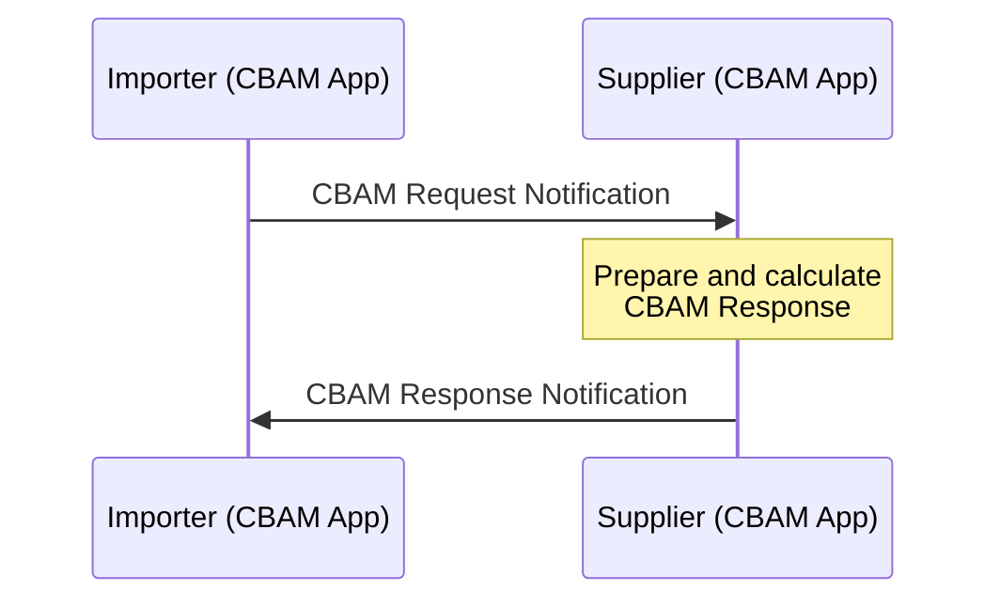

import Kit3DLogo from '@site/src/components/2.0/Kit3DLogo';

<Kit3DLogo kitId="cbam" />

This document provides a developer-focused overview of the CBAM KIT, including a technical breakdown of the architecture, and data exchange protocols and semantic models.

:::info Target Audience
Software Developers, Solution Architects, Technical Leads, API Developers, Integration Engineers.
:::

---

## Architecture Overview

The architecture is designed for a decentralized data exchange within the Catena-X network, leveraging core services and standardized components.


The diagram shows how two companies, a **Data Consumer** (the importer requesting CBAM data) and a **Data Provider** (the supplier providing it), exchange CBAM emissions data securely over the Catena-X network without connecting to each other's internal systems directly.

Each company operates the same two-component setup. The first is a **CBAM App**, the business application where the importer composes requests and where the supplier prepares and calculates the CBAM response data. The CBAM app is a third-party business application required to manage and exchange CBAM-relevant data that is compatible with Catena-X. The second is an **EDC (Eclipse Dataspace Connector)**, a standardized secure gateway which manages who is allowed to connect and under what agreed conditions, and which is the actual channel through which the notification data travels.

When a data exchange is triggered, the importer's CBAM App pushes a request notification toward the supplier. Before any data moves, both connectors perform an authorization handshake to confirm the identities of both parties and verify that the data sharing conditions are met. Once authorized, the notification is sent to the supplier's CBAM App. It prepares the CBAM response, and sends it back in the opposite direction.

The connectors act as trusted, policy-enforced gateways on both sides, ensuring that data is only shared with verified partners and under agreed terms.

Each notification consists of a header and a body. The CBAM request and response data models are carried in the notification body. The header contains the routing and identification information: the BPNL (Business Partner Number Legal) of both the sending and receiving company, a unique message ID assigned to each individual message, and a related message ID that references the original request. The related message ID is particularly important when a supplier sends multiple separate responses to a single request, for example when emission data for different operators or goods is compiled and returned in stages. Each response can be matched back to the originating request via this identifier.

---

## Data Exchange Flow

The CBAM data exchange follows the Catena-X **Connectivity** and **Industry Core** principles for connector setup and data transfer initiation. For those details, refer to the respective KITs. The description below focuses exclusively on the CBAM-specific protocol: the structure and sequence of the two CBAM notifications.



**Flow Description:**

1. **CBAM Request**: The Importer's CBAM App sends a request notification specifying the goods (by CN Code and business transaction), the reference period, and the data elements required in the response (`requestedElements`).
2. **Processing**: The Supplier's CBAM App maps the request to real production data and calculates the embedded emissions per good, operator, installation, and production method.
3. **CBAM Response**: The Supplier's CBAM App sends back a response notification containing the calculated emission data, scoped exactly to the transactions specified in the request.

**Notification structure:**
Each notification carries a `header` (sender/receiver BPNLs, a unique `messageId`, and a `relatedMessageId` linking the response back to its originating request) and a `content` field containing the CBAM request or response data model. The `relatedMessageId` is particularly important when a supplier sends multiple separate responses to a single request — for example when emission data for different operators or goods is compiled and returned in stages.

---

## Data Schema

### Semantic Models

#### Model: CBAM

**Version**: 1.0.0

**Namespace**: `urn:samm:io.catenax.cbam:1.0.0`

**Description**:
_Purpose_: The SAMM defines the CBAM data model used to exchange CBAM-relevant information between an importer (customer) and a supplier, capturing identifiers, goods, transaction context, installation/operator details, activity/emissions characteristics, attestations and carbon-price information.

_Request vs Response separation_: The SAMM cleanly separates request and response concerns: the request model specifies what the importer may ask for (scope, requested elements, transaction context, identifiers), while the response model specifies what the supplier must provide (installation/operator identification, activityData/emissionsRecords, attestations, carbon-price details), enabling clear responsibilities and automated schema generation.

**Key Properties Request Datamodel**:

<details>
  <summary>CBAM REQUEST Data model - Object Structure Overview | click to expand</summary>

```bash
Request
├── requestedElements[]  # e.g. "respondingCompanyIds", ...
├── companyIds
│   ├── requestingCompanyIds[]
│   │   ├── key
│   │   └── value
│   └── respondingCompanyIds[]
│       ├── key
│       └── value
└── good[]
    ├── cnCode
    ├── productIds[]
    │   ├── key
    │   └── value
    ├── productDescription
    ├── businessTransactionDetails
    │   ├── transactionReferenceDocuments[]
    │   │   ├── key
    │   │   └── value
    │   ├── requestReferencePeriodStart
    │   ├── requestReferencePeriodEnd
    │   └── requestNetMass
    └── operator[]
        ├── transactionReferenceDocumentLink
        │   ├── refDocKey
        │   ├── refDocValue
        │   └── refDocElement
        │       ├── key
        │       └── value
        ├── operatorIdentification
        │   ├── operatorIsSupplier
        │   ├── operatorIds
        │   │   ├── operatorBpnl
        │   │   ├── operatorCbamId
        │   │   └── otherIds[]
        │   │       ├── key
        │   │       └── value
        │   ├── operatorName
        │   ├── operatorContactEmailAddress
        │   └── address
        │       ├── country
        │       ├── city
        │       └── street
        ├── operatorNetMass
        └── installation[]
            ├── installationIdentification
            │   ├── installationIds
            │   │   ├── installationCbamId
            │   │   └── otherIds[]
            │   │       ├── key
            │   │       └── value
            │   ├── installationName
            │   └── address
            │       ├── countryCode
            │       ├── city
            │       ├── longitude
            │       ├── latitude
            │       ├── typeOfCoordinates
            │       ├── plotOrParcelNumber
            │       └── unLoCode
            ├── installationNetMass
            └── emissionsRecords[]
                ├── productionMethod
                │   ├── methodId
                │   ├── specificSteelMillId
                │   └── additionalInformation
                └── activityData
                    ├── referencePeriodStart
                    ├── referencePeriodEnd
                    └── netMass
```

</details>

<details>
  <summary>CBAM REQUEST Data model - Property Overview | click to expand</summary>

This table gives a business-level overview of all properties in the CBAM request data model. **M** = mandatory, **O** = optional. Object groups are separated by blank rows; `-` dashes indicate nesting depth. For full technical details see the corresponding datamodel file.

| Property | M/O | Description | Example |
|---|---|---|---|
| **requestedElements** | O | List of element identifiers that define the scope of objects and/or data attributes requested for inclusion in the supplier response. The identifiers refer to sections and attributes defined in the corresponding request type schemes, and indicate which parts of the data model are expected to be provided in the response (subject to the rules of the respective response schema, e.g., mandatory fields and conditional dependencies). | cnCode, operatorIdentification, installationIdentification, activityData, productionMethod, directEmissions |
| | | | |
| **companyIds** | O | Object with attributes describing the identifiers of the two business exchanging this dataset, namely the requesting and the responding company | n.a. |
| | | | |
| `-` _**requestingCompanyIds**_ | O | Object containing one or multiple pairs of identifier type and value of the requesting company. | n.a. |
| `--` key | M | Name of the identifier type. | Company-ID |
| `--` value | M | Value of the stated identifier type. | Customer-Corp-12-EU |
| | | | |
| `-` _**respondingCompanyIds**_ | O | Object containing one or multiple identifiers of the responding company. | n.a. |
| `--` key | M | Name of the identifier type. | Supplier-ID |
| `--` value | M | Value of the stated identifier type. | Steel-Corp-12-IN |
| | | | |
| **good** | M | Array of good records to be reported. Each good record represents one declared good instance identified by CN Code and business transaction details and contains the CBAM-related information for that declared good.  | n.a. |
| | | | |
| `-` cnCode | M | This is the 8-digit CN code (combined nomenclature) of the reported good, referring to official CBAM value list to ensure updated content.  | 72011000 |
| | | | |
| `-` _**productIds**_ | O | Set of product identifiers to identify the product from the business transaction. | n.a. |
| `--` key | M | Name of the identifier type. | GTIN |
| `--` value | M | Value of the stated identifier type. | 4712345060507 |
| | | | |
| `-` productDescription | O | Free text describing the product and any characteristics that help identify the right business transaction per request. | Hot-rolled steel coil, grade S235JR |
| | | | |
| `-` _**businessTransactionDetails**_ | O | Object describing the specific business transaction between the customer (e.g. importer) and the supplier, so the request can be mapped to a real transaction. | n.a. |
| `--` _**transactionReferenceDocuments**_ | O | List of reference documents used to identify the transaction (e.g., invoice, purchase order, customs declaration, shipment); each entry provides a document type and identifier value. | n.a. |
| `---` key | M | Reference document type/category (e.g., invoice, purchaseOrder, customsDeclaration). | invoice |
| `---` value | M | Identifier of the document for the given type (e.g., invoice number). | INV-2024-12345 |
| `--` requestReferencePeriodStart | M | Start timestamp of the requested reference period; start and end must be within the same calendar year. | 2024-01-01T00:00:00Z |
| `--` requestReferencePeriodEnd | M | End timestamp of the requested reference period; start and end must be within the same calendar year. | 2024-12-31T23:59:59Z |
| `--` requestedNetMass | O | Net mass (tonnes) of CBAM-relevant good the request relates to (e.g., from customs). Note, value shall match the sum across all corresponding production method net mass values in the response. | 60 |
| | | | |
| `-` _**operator**_ | O | One or multiple objects containing attributes that describe an operator each that legally owns the installations producing the CBAM good that is subject of this request. Operator can be different to supplier. One supplier (business partner of this transaction) can source the good defined in the business transaction from other suppliers. This can result in multiple operators (multiple operator objects) involved in the depicted supply chain.  | n.a. |
| `--` _**transactionReferenceDocumentLink**_ | O | Pointer to a reference document previously provided in businessTransactionDetails, optionally refined to a specific part/item of that document, to indicate which document (and which part of it) the operator-related response data corresponds to. | n.a. |
| `---` refDocKey | M | Type of the referenced document; must match a reference document type from the business transaction details object in the request. | invoice |
| `---` refDocValue | M | Identifier of the referenced document; must match the corresponding reference document value from the request. | INV-2024-12345 |
| | | | |
| `---` _**refDocElement**_ | O | Additional locator/metadata to identify a specific element within the referenced document (e.g., line item, position number, material code, annex section). Used when the document covers multiple goods/operators and you need to specify which part applies. | n.a. |
| `----` key | M | Kind of element locator provided (e.g., invoiceLineItem, customsItemNumber, purchaseOrderLine, shipmentPosition). | batchNumber |
| `----` value | M | Value of the locator (e.g., line “10”, item “3”, position “0002”). | 02 |
| | | | |
| `--` _**operatorIdentification**_ | O | Object containing attributes to identify the operator. | n.a. |
| `---` operatorIsSupplier | O | Boolean property indicating whether the supplier (i.e., the business transaction partner) is also the installation operator.  | TRUE |
| | | | |
| `---` _**operatorIds**_ | O | Unique set of identifiers for the operator. BPNL and Operator CBAM ID are listed as separate attributes. | n.a. |
| `----` operatorBpnl | O | BPNL (business partner number legal) of operator, if company is registered at Catena-X. | BPNL000000000OPR |
| `----` operatorCbamId | O | Unique identifier for the operator in the official EU O3CI portal (operator of third country installation).  | O3CI-OPR-123456 |
| | | | |
| `----` _**otherIds**_ | O | Other identifiers for the operator excluding BPNL and Operator CBAM ID. | n.a. |
| `-----` key | M | Name of the identifier type | Operator-Tracking-ID |
| `-----` value | M | Value of the stated identifier type | OP.DE-Steel_north_AG1 |
| `---` operatorName | O | Name of the operator | Steel Example Corp. |
| `---` operatorContactEmailAddress | O | The email address of the person that is assigned in the contact details of the operator | contact@steelexample.com |
| | | | |
| `---` _**address**_ | O | Object containing attributes that document the address of the operator. | n.a. |
| `----` country | O | Country code where the operator is established, refering to official CBAM value list to ensure updated content. | DE |
| `----` city | O | The city where the operator is located | Duisburg |
| `----` street | O | The street where the operator is located | Werkstraße 1 |
| `--` operatorNetMass | O | Net mass (in tonnes) of the CBAM-relevant good attributable to the specific request, summed over all installations belonging to the operator described in this object. | 60.0 |
| | | | |
| `--` _**installation**_ | O | One or more objects describing each installation producing the CBAM good that is the subject of this request. A single operator may own multiple installations supplying the CBAM good in this request; in that case, multiple installation objects are provided. Each installation may include multiple production methods. | n.a. |
| `---` _**installationIdentification**_ | O | Object containing attributes to identify the installation. | n.a. |
| `----` _**installationIds**_ | O | Unique set of identifiers of the installation. | n.a. |
| `-----` installationCbamId | O | Unique identifier for the installation in the official EU O3CI portal (operator of third country installation).  | O3CI-INST-654321 |
| | | | |
| `-----` _**otherIds**_ | O | Other identifiers of the installation, excluding the official CBAM installation ID.  | n.a. |
| `------` key | M | Name of the identifier type. | Installation-ID |
| `------` value | M | Value of the stated identifier type. | INST-987654 |
| `----` installationName | O | Name of the installation. | Steel Manufacturing Facility - Delhi Plant |
| | | | |
| `----` _**address**_ | O | Object containing attributes that document the address of the installation. | n.a. |
| `-----` countryCode | M | Country code where the installation is established and the good is produced, refering to official CBAM value list to ensure updated content. | IN |
| `-----` city | M | The city where the installation is located. | Delhi |
| `-----` longitude | O | The longitude where the installation is located. | 77.2197 |
| `-----` latitude | O | The latitude where the installation is located. | 28.6139 |
| `-----` typeOfCoordinates | O | The type of coordinates according to the value list that is accepted by the corresponding field in the CBAM declaration portal.  | 01 |
| `-----` plotOrParcelNumber | O | The plot or parcel number of the location. | PLOT-456-INDUSTRIAL-ZONE-A |
| `-----` unLoCode | O | The UNLOCODE as defined by UNECE list which can be downloaded at <https://unece.org/trade/uncefact/unlocode> | INDEL |
| `---` installationNetMass | O | Net mass (in tonnes) of the CBAM-relevant good attributable to the specific request, produced in the stated installation, calculated as the sum across all applicable production methods within that installation. | 60.0 |
| | | | |
| `---` _**emissionsRecords**_ | O | One or more objects detailing the specific production method(s) that the emission objects refer to; each installation may include multiple production methods. | n.a. |
| `----` _**productionMethod**_ | O | An object describing the production method as applied within the installation for producing the stated CBAM good, and, if applicable, stating the steel mill identifier. | n.a. |
| `-----` methodId | M | Specific identifier of the production method according the value list accepted by the corresponding field in the CBAM declarant portal. | P24 |
| `-----` specificSteelMillId | O | Specific identifier of the steel mill used for the production of the good, if applicable.  | MILL-001 |
| `-----` additionalInformation | O | Any additional information that the supplier wants to provide with regard to the production method.  | Uses recycled scrap as input |
| | | | |
| `----` _**activityData**_ | O | An object describing the temporal reference and the mass flow attributable to the specified production method within an installation. | n.a. |
| `-----` referencePeriodStart | O | Start date of the period in which relevant data was collected at the installation for the specified production method, serving as the reference period for emissions calculation; both start and end date must be in the same calendar year. | 2024-01-01T00:00:00Z |
| `-----` referencePeriodEnd | O | End date of the period in which relevant data was collected at the installation for the specified production method, serving as the reference period for emissions calculation; both start and end date must be in the same calendar year. | 2024-12-31T23:59:59Z |
| `-----` netMass | M | Net mass (in tonnes) of the CBAM-relevant good attributable to the specific request produced in the stated installation by the stated production method only. | 60.0 |

</details>

**Key Properties Response Datamodel**:

<details>
  <summary>CBAM RESPONSE Data model - Object Structure only | click to expand</summary>

```bash
Response
├── companyIds
│   ├── requestingCompanyIds[]
│   │   ├── key
│   │   └── value
│   └── respondingCompanyIds[]
│       ├── key
│       └── value
└── good[]
    ├── cnCode
    ├── productIds[]
    │   ├── key
    │   └── value
    ├── productDescription
    ├── businessTransactionDetails
    │   ├── transactionReferenceDocuments[]
    │   │   ├── key
    │   │   └── value
    │   ├── requestReferencePeriodStart
    │   ├── requestReferencePeriodEnd
    │   └── requestNetMass
    └── operator[]
        ├── transactionReferenceDocumentLink
        │   ├── refDocKey
        │   ├── refDocValue
        │   └── refDocElement
        │       ├── key
        │       └── value
        ├── operatorIdentification
        │   ├── operatorIsSupplier
        │   ├── operatorIds
        │   │   ├── operatorBpnl
        │   │   ├── operatorCbamId
        │   │   └── otherIds[]
        │   │       ├── key
        │   │       └── value
        │   ├── operatorName
        │   ├── operatorContactEmailAddress
        │   └── address
        │       ├── country
        │       ├── city
        │       └── street
        ├── operatorNetMass
        └── installation[]
            ├── installationIdentification
            │   ├── installationIds
            │   │   ├── installationCbamId
            │   │   └── otherIds[]
            │   │       ├── key
            │   │       └── value
            │   ├── installationName
            │   └── address
            │       ├── countryCode
            │       ├── city
            │       ├── longitude
            │       ├── latitude
            │       ├── typeOfCoordinates
            │       ├── plotOrParcelNumber
            │       └── unLoCode
            ├── installationNetMass
            └── emissionsRecords[]
                ├── productionMethod
                │   ├── methodId
                │   ├── specificSteelMillId
                │   └── additionalInformation
                ├── activityData
                │   ├── referencePeriodStart
                │   ├── referencePeriodEnd
                │   └── netMass
                ├── directEmissions
                │   ├── additionalInformation
                │   └── specificEmbeddedEmissionsDirect
                ├── indirectEmissions
                │   ├── sourceOfEmissionFactor
                │   ├── emissionFactorTonnesCo2PerMwh
                │   ├── sourceOfEmissionFactorValue
                │   ├── specificEmbeddedEmissionsIndirect
                │   ├── electricityConsumedMwhPerTonnesGood
                │   └── sourceOfElectricity
                ├── freeAllocationFactor
                ├── attestationOfConformance
                │   ├── attestationType
                │   ├── attestationStandard
                │   ├── standardName
                │   ├── providerName
                │   ├── providerId
                │   ├── accreditationBodyName
                │   ├── attestationOfConformanceId
                │   ├── attestationOfConformanceLink
                │   └── completedAt
                └── carbonPricePaid[]
                    ├── typeOfInstrument
                    ├── independentPersonId
                    │   ├── key
                    │   └── value
                    ├── descriptionAndIndicationOfLegalAct
                    ├── amountOfCarbonPricePaid
                    ├── currency
                    └── countryCode
```

</details>

<details>
  <summary>CBAM RESPONSE Data model - Property Overview | click to expand</summary>

This table gives a business-level overview of all properties in the CBAM response data model. **M** = mandatory, **O** = optional. Object groups are separated by blank rows; `-` dashes indicate nesting depth. For full technical details see the corresponding datamodel file.

| Property | M/O | Description | Example |
|---|---|---|---|
| **companyIds** | O | Object with attributes describing the identifiers of the two business exchanging this dataset, namely the requesting and the responding company | n.a. |
| | | | |
| `-` _**requestingCompanyIds**_ | O | Object containing one or multiple pairs of identifier type and value of the requesting company. | n.a. |
| `--` key | M | Name of the identifier type. | Company-ID |
| `--` value | M | Value of the stated identifier type. | Customer-Corp-12-EU |
| | | | |
| `-` _**respondingCompanyIds**_ | O | Object containing one or multiple identifiers of the responding company. | n.a. |
| `--` key | M | Name of the identifier type. | Supplier-ID |
| `--` value | M | Value of the stated identifier type. | Steel-Corp-12-IN |
| | | | |
| **good** | M | Array of good records to be reported. Each good record represents one declared good instance identified by CN Code and business transaction details and contains the CBAM-related information for that declared good.  | n.a. |
| | | | |
| `-` cnCode | M | This is the 8-digit CN code (combined nomenclature) of the reported good, refering to official CBAM value list to ensure updated content.  | 72011000 |
| | | | |
| `-` _**productIds**_ | O | Set of product identifiers to identify the product from the business transaction. | n.a. |
| `--` key | M | Name of the identifier type. | GTIN |
| `--` value | M | Value of the stated identifier type. | 4712345060507 |
| | | | |
| `-` productDescription | O | Free text describing the product and any characteristics that help identify the right business transaction per request. | Hot-rolled steel coil, grade S235JR |
| | | | |
| `-` _**businessTransactionDetails**_ | O | Object describing the specific business transaction between the customer (e.g. importer) and the supplier, so the request can be mapped to a real transaction. | n.a. |
| `--` _**transactionReferenceDocuments**_ | O | List of reference documents used to identify the transaction (e.g., invoice, purchase order, customs declaration, shipment); each entry provides a document type and identifier value. | n.a. |
| `---` key | M | Reference document type/category (e.g., invoice, purchaseOrder, customsDeclaration). | invoice |
| `---` value | M | Identifier of the document for the given type (e.g., invoice number). | INV-2024-12345 |
| `--` requestReferencePeriodStart | O | Start timestamp of the requested reference period; start and end must be within the same calendar year. | 2024-01-01T00:00:00Z |
| `--` requestReferencePeriodEnd | O | End timestamp of the requested reference period; start and end must be within the same calendar year. | 2024-12-31T23:59:59Z |
| `--` requestedNetMass | O | Net mass (tonnes) of CBAM-relevant good the request relates to (e.g., from customs). Note, value shall match the sum across all corresponding production method net mass values in the response. | 60 |
| | | | |
| `-` _**operator**_ | O | One or multiple objects containing attributes that describe an operator each that legally owns the installations producing the CBAM good that is subject of this request. Operator can be different to supplier. One supplier (business partner of this transaction) can source the good defined in the business transaction from other suppliers. This can result in multiple operators (mutliple operator objects) involved in the depicted supply chain.  | n.a. |
| `--` _**transactionReferenceDocumentLink**_ | O | Pointer to a reference document previously provided in businessTransactionDetails, optionally refined to a specific part/item of that document, to indicate which document (and which part of it) the operator-related response data corresponds to. | n.a. |
| `---` refDocKey | M | Type of the referenced document; must match a reference document type from the business transaction details object in the request. | invoice |
| `---` refDocValue | M | Identifier of the referenced document; must match the corresponding reference document value from the request. | INV-2024-12345 |
| | | | |
| `---` _**refDocElement**_ | O | Additional locator/metadata to identify a specific element within the referenced document (e.g., line item, position number, material code, annex section). Used when the document covers multiple goods/operators and you need to specify which part applies. | n.a. |
| `----` key | M | Kind of element locator provided (e.g., invoiceLineItem, customsItemNumber, purchaseOrderLine, shipmentPosition). | batchNumber |
| `----` value | M | Value of the locator (e.g., line “10”, item “3”, position “0002”). | 02 |
| | | | |
| `--` _**operatorIdentification**_ | O | Object containing attributes to identify the operator. | n.a. |
| `---` operatorIsSupplier | O | Boolean property indicating whether the supplier (i.e., the business transaction partner) is also the installation operator.  | TRUE |
| | | | |
| `---` _**operatorIds**_ | O | Unique set of identifiers for the operator. BPNL and Operator CBAM ID are listed as separate attributes. | n.a. |
| `----` operatorBpnl | O | BPNL (business partner number legal) of operator, if company is registered at Catena-X. | BPNL000000000OPR |
| `----` operatorCbamId | O | Unique identifier for the operator in the official EU O3CI portal (operator of third country installation).  | O3CI-OPR-123456 |
| | | | |
| `----` _**otherIds**_ | O | Other identifiers for the operator excluding BPNL and Operator CBAM ID. | n.a. |
| `-----` key | M | Name of the identifier type | Operator-Tracking-ID |
| `-----` value | M | Value of the stated identifier type | OP.DE-Steel_north_AG1 |
| `---` operatorName | O | Name of the operator | Steel Example Corp. |
| `---` operatorContactEmailAddress | O | The email address of the person that is assigned in the contact details of the operator | contact@steelexample.com |
| | | | |
| `---` _**address**_ | O | Object containing attributes that document the address of the operator. | n.a. |
| `----` country | O | Country code where the operator is established, refering to official CBAM value list to ensure updated content. | DE |
| `----` city | O | The city where the operator is located | Duisburg |
| `----` street | O | The street where the operator is located | Werkstraße 1 |
| `--` operatorNetMass | O | Net mass (in tonnes) of the CBAM-relevant good attributable to the specific request, summed over all installations belonging to the operator described in this object. | 60.0 |
| | | | |
| `--` _**installation**_ | O | One or more objects describing each installation producing the CBAM good that is the subject of this request. A single operator may own multiple installations supplying the CBAM good in this request; in that case, multiple installation objects are provided. Each installation may include multiple production methods. | n.a. |
| `---` _**installationIdentification**_ | O | Object containing attributes to identify the installation. | n.a. |
| `----` _**installationIds**_ | O | Unique set of identifiers of the installation. | n.a. |
| `-----` installationCbamId | O | Unique identifier for the installation in the official EU O3CI portal (operator of third country installation).  | O3CI-INST-654321 |
| | | | |
| `-----` _**otherIds**_ | O | Other identifiers of the installation, excluding the official CBAM installation ID.  | n.a. |
| `------` key | M | Name of the identifier type. | Installation-ID |
| `------` value | M | Value of the stated identifier type. | INST-987654 |
| `----` installationName | O | Name of the installation. | Steel Manufacturing Facility - Delhi Plant |
| | | | |
| `----` _**address**_ | O | Object containing attributes that document the address of the installation. | n.a. |
| `-----` countryCode | M | Country code where the installation is established and the good is produced, refering to official CBAM value list to ensure updated content. | IN |
| `-----` city | M | The city where the installation is located. | Delhi |
| `-----` longitude | O | The longitude where the installation is located. | 77.2197 |
| `-----` latitude | O | The latitude where the installation is located. | 28.6139 |
| `-----` typeOfCoordinates | O | The type of coordinates according to the value list that is accepted by the corresponding field in the CBAM declaration portal.  | 01 |
| `-----` plotOrParcelNumber | O | The plot or parcel number of the location. | PLOT-456-INDUSTRIAL-ZONE-A |
| `-----` unLoCode | O | The UNLOCODE as defined by UNECE list which can be downloaded at <https://unece.org/trade/uncefact/unlocode> | INDEL |
| `---` installationNetMass | O | Net mass (in tonnes) of the CBAM-relevant good attributable to the specific request, produced in the stated installation, calculated as the sum across all applicable production methods within that installation. | 60.0 |
| | | | |
| `---` _**emissionsRecords**_ | O | One or more objects detailing the specific production method(s) that the emission objects refer to; each installation may include multiple production methods. | n.a. |
| `----` _**productionMethod**_ | M | An object describing the production method as applied within the installation for producing the stated CBAM good, and, if applicable, stating the steel mill identifier. | n.a. |
| `-----` methodId | M | Specific identifier of the production method according the value list accepted by the corresponding field in the CBAM declarant portal. | P24 |
| `-----` specificSteelMillId | O | Specific identifier of the steel mill used for the production of the good, if applicable.  | MILL-001 |
| `-----` additionalInformation | O | Any additional information that the supplier wants to provide with regard to the production method.  | Uses recycled scrap as input |
| | | | |
| `----` _**activityData**_ | O | An object describing the temporal reference and the mass flow attributable to the specified production method within an installation. | n.a. |
| `-----` referencePeriodStart | M | Start date of the period in which relevant data was collected at the installation for the specified production method, serving as the reference period for emissions calculation; both start and end date must be in the same calendar year. | 2024-01-01T00:00:00Z |
| `-----` referencePeriodEnd | M | End date of the period in which relevant data was collected at the installation for the specified production method, serving as the reference period for emissions calculation; both start and end date must be in the same calendar year. | 2024-12-31T23:59:59Z |
| `-----` netMass | M | Net mass (in tonnes) of the CBAM-relevant good attributable to the specific request produced in the stated installation by the stated production method only. | 60.0 |
| | | | |
| `----` _**directEmissions**_ | O | Object detailing the direct embedded emissions referenced to the specific production method and installation. | n.a. |
| `-----` additionalInformation | O | Any additional information that the supplier wants to provide with regard to direct embedded emissions.  | Calculated using official CBAM excel template |
| `-----` specificEmbeddedEmissionsDirect | M | Value of the direct embedded emissions, expressed in tonnes of CO₂ equivalents per tonne of product, calculated with reference to the specific production method and installation.  | 1.85 |
| | | | |
| `----` _**indirectEmissions**_ | O | Object detailing the indirect embedded emissions referenced to the specific production method and installation. | n.a. |
| `-----` sourceOfEmissionFactor | M | Declaration of applied literature or published information by the statistics office, according to value list expected for the corresponding field in the CBAM declaration portal. | 02 |
| `-----` emissionFactorTonnesCo2PerMwh | M | This element declares the applied emission factor for electricity, expressed as tonnes CO2 per MWh. | 0.45 |
| `-----` sourceOfEmissionFactorValue | M | Any additional information detailing the source of the emissions value. | IEA 2022 Electricity Report |
| `-----` specificEmbeddedEmissionsIndirect | M | Value of the indirect embedded emissions, expressed in tonnes of CO₂ equivalents per tonne of product, calculated with reference to the specific production method and installation. | 0.25 |
| `-----` electricityConsumedMwhPerTonnesGood | M | Value of the consumed electricity, expressed as MWh per tonne of good. | 0.6 |
| `-----` sourceOfElectricity | M | Describes the source of the electricity according to the value list expected by the CBAM declaration portal. | SOE03 |
| `----` freeAllocationFactor | O | The free allocation factor, expressed as tonnes of CO2​ equivalents per tonne of product, based on the specific material and energy inputs used to produce the product. | 0.6 |
| | | | |
| `----` _**attestationOfConformance**_ | O | An object describing the attestation of conformance for the reported installation-level emission values (e.g., an annual verification statement issued by an accredited verification body in accordance with CBAM verification rules). | n.a. |
| `-----` attestationType | O | The type of attestation that indicates the assurance approach and level of trust provided by the attestation of conformance (e.g., CBAM third‑party verification). | CBAM third party verification |
| `-----` attestationStandard | O | The specific standard, methodology, or regulation applied by the installation operator to calculate and report the underlying results (e.g., emissions data) that are covered by the attestation of conformance. | Regulation (EU) 2025/2083 |
| `-----` standardName | O | The specific standard, rules, or regulation that defines how the provider of the attestation of conformance performs the attestation activities (e.g., evaluation approach, evidence requirements, level of assurance) to determine whether the reported results conform to the applicable calculation/reporting standard. | Regulation (EU) 2025/2083 |
| `-----` providerName | O | The legal name of the organization that issues the attestation of conformance, e.g. verifier name. | TÜV X |
| `-----` providerId | O | A unique identifier of the provider of the attestation of conformance as issued by the accreditation institute, i.e. accreditation number. | 5493001KJTIIGC8Y1R12 |
| `-----` accreditationBodyName | O | The name of the organization that grants and maintains the formal accreditation under which the provider of the attestation of conformance is authorized to perform the attestation. | National Accreditation Institute ABX |
| `-----` attestationOfConformanceId | O | A unique identifier assigned by the provider of the attestation of conformance to the attestation document (e.g., verification statement) for tracking and reference. | 123e4567-e89b-12d3-a456-426614174000 |
| `-----` attestationOfConformanceLink | O | A URL to the attestation of conformance document (e.g. verification statement), enabling manual verification of its validity and authenticity. | <https://exampleverifier.com/cbam/statement/123e4567> |
| `-----` completedAt | O | Time stamp for when the attestation of conformance was issued. | 2026-03-15T10:00:00Z |
| | | | |
| `----` _**carbonPricePaid**_ | O | One or multiple objects describing the carbon price due in a third country per emission object on installation level.  | n.a. |
| `-----` typeOfInstrument | O | Attribute describing the form of carbon price, also referred to as type of instrument. The format of the values shall follow the CBAM portal value list for the corresponding field.  | 01 |
| | | | |
| `-----` _**independentPersonId**_ | M | Identifier of the independent person issuing a payment statement about the carbon price paid by the direct supplier or any other tier-n supplier in the value chain. | n.a. |
| `------` key | M | Name of the identifier type | National CBAM Verifier Registry |
| `------` value | M | Value of the stated identifier type | CBAM_VER_ZGG0612 |
| `-----` descriptionAndIndicationOfLegalAct | O | Reference the description of the underlying legal act according to which the carbon price was paid | Country ABC National Carbon Tax Act 2022 |
| `-----` amountOfCarbonPricePaid | O | Monetary value of the paid carbon price | 12000.00 |
| `-----` currency | O | The currency used for the declared amount to be paid, refering to official CBAM value list to ensure updated content. | CNY |
| `-----` countryCode | O | Country code where the carbon price is paid, refering to official CBAM value list to ensure updated content. | CN |

</details>

---

### Sample Data

#### Sample Dataset: Request Payload

**Purpose**:
Sent by an EU importer to a non-EU supplier to request CBAM embedded-emissions data for a specific good and reference period.

**Structure highlights:**

- **`requestedElements`** — exhaustive set of all 17 data elements the importer wants populated in the response, from company identification down to `carbonPricePaid`
- **`good`** — 1 CBAM good (CN code `72011000`, pig iron), 100 t total, full-year reference period 2026, linked to two transaction reference documents (invoice + purchase order)
- **`operator`** — 2 operators, each linked to a different reference document:
  - Operator 1 (the direct supplier) — responsible for 2 installations across 2 cities in the same non-EU country; each installation has 1 emissions record containing only scope declaration (`productionMethod` + `activityData`) — no emissions values yet
  - Operator 2 (a secondary operator, not the supplier) — responsible for 1 installation in a different non-EU country; same scope-only structure
- **`emissionsRecords` in the request** intentionally contain only `productionMethod` + `activityData` — they declare the production scope and mass attributed; all quantitative emissions fields are left for the response

**Format**: JSON

**Example Request Payload JSON**:

<details>
  <summary>CBAM Request Notification Payload Example JSON structure | click to expand</summary>

Due to the fact that in Catena-X there is a Notification Payload standardized in [CX-0151 Industry Core Basics](https://catenax-ev.github.io/docs/standards/CX-0151-IndustryCoreBasics#14-examples) the CBAM REQUEST payload will follow it and be embedded in a notification payload inside the `content` key, additionally it will have a `header` which contains important metadata for the applications to parse. This payload is just an example from how it could look like, since there is yet no standard available:

```json
{
  "header" : {
    "senderBpn" : "BPNL0000000002CD",
    "senderFeedbackUrl": "https://domain.tld/path/to/api",
    "context" : "CarbonBorderAdjustmentMechanism-CBAMAPI-Request:1.0.0",
    "messageId" : "3b4edc05-e214-47a1-b0c2-1d831cdd9ba9",
    "receiverBpn" : "BPNL0000000001AB",
    "sentDateTime" : "2025-05-04T00:00:00-07:00",
    "version" : "0.1.0"
  },
  "content": {
    "requestedElements": [
      "respondingCompanyIds",
      "cnCode",
      "productIds",
      "productDescription",
      "businessTransactionDetails",
      "transactionReferenceDocumentLink",
      "operatorIdentification",
      "operatorNetMass",
      "installationIdentification",
      "installationNetMass",
      "activityData",
      "productionMethod",
      "directEmissions",
      "indirectEmissions",
      "freeAllocationFactor",
      "attestationOfConformance",
      "carbonPricePaid"
    ],
    "companyIds": {
      "requestingCompanyIds": [
        {
          "key": "Company-ID",
          "value": "Customer-Corp-12-EU"
        },
        {
          "key": "BPNL",
          "value": "BPNL000000000DWF"
        }
      ],
      "respondingCompanyIds": [
        {
          "key": "Supplier-ID",
          "value": "Steel-Corp-12-IN"
        },
        {
          "key": "BPNL",
          "value": "BPNL000000000XYZ"
        }
      ]
    },
    "good": [
      {
        "cnCode": "72011000",
        "productIds": [
          {
            "key": "Customer_Part_ID",
            "value": "ES45AB9-000-G3"
          },
          {
            "key": "Supplier_Part_ID",
            "value": "SUP-STEEL-0001"
          }
        ],
        "productDescription": "Hot-rolled steel coil, grade S235JR",
        "businessTransactionDetails": {
          "transactionReferenceDocuments": [
            {
              "key": "invoice",
              "value": "INV-2026-12345"
            },
            {
              "key": "purchaseOrder",
              "value": "PO-2026-67890"
            }
          ],
          "requestReferencePeriodStart": "2026-01-01T00:00:00Z",
          "requestReferencePeriodEnd": "2026-12-31T23:59:59Z",
          "requestNetMass": 100.0
        },
        "operator": [
          {
            "transactionReferenceDocumentLink": {
              "refDocKey": "invoice",
              "refDocValue": "INV-2026-12345",
              "refDocElement": {
                "key": "batchNumber",
                "value": "01"
              }
            },
            "operatorIdentification": {
              "operatorIsSupplier": true,
              "operatorIds": {
                "operatorBpnl": "BPNL000000000XYZ",
                "operatorCbamId": "O3CI-OPR-123456",
                "otherIds": [
                  {
                    "key": "Operator-Tracking-ID",
                    "value": "OP.IN-Steel_north_AG1"
                  }
                ]
              },
              "operatorName": "Steel Example Corp.",
              "operatorContactEmailAddress": "contact@steelexample.com",
              "address": {
                "country": "IN",
                "city": "Mumbai",
                "street": "Industrial Area, Zone A"
              }
            },
            "operatorNetMass": 100.0,
            "installation": [
              {
                "installationIdentification": {
                  "installationIds": {
                    "installationCbamId": "O3CI-INST-654321",
                    "otherIds": [
                      {
                        "key": "Installation-ID",
                        "value": "INST-987654"
                      }
                    ]
                  },
                  "installationName": "Blast Furnace 1",
                  "address": {
                    "countryCode": "IN",
                    "city": "Mumbai",
                    "longitude": "72.8197",
                    "latitude": "19.0760",
                    "typeOfCoordinates": "01",
                    "plotOrParcelNumber": "IN12345A",
                    "unLoCode": "IN BOM"
                  }
                },
                "installationNetMass": 40.0,
                "emissionsRecords": [
                  {
                    "productionMethod": {
                      "methodId": "P24",
                      "specificSteelMillId": "MILL-001",
                      "additionalInformation": "Uses recycled scrap as input"
                    },
                    "activityData": {
                      "referencePeriodStart": "2026-01-01T00:00:00Z",
                      "referencePeriodEnd": "2026-12-31T23:59:59Z",
                      "netMass": 40.0
                    }
                  }
                ]
              },
              {
                "installationIdentification": {
                  "installationIds": {
                    "installationCbamId": "O3CI-INST-654322",
                    "otherIds": [
                      {
                        "key": "Installation-ID",
                        "value": "INST-987655"
                      }
                    ]
                  },
                  "installationName": "Blast Furnace 2",
                  "address": {
                    "countryCode": "IN",
                    "city": "Delhi",
                    "longitude": "77.2197",
                    "latitude": "28.6139",
                    "typeOfCoordinates": "02",
                    "plotOrParcelNumber": "IN12345B",
                    "unLoCode": "IN DEL"
                  }
                },
                "installationNetMass": 60.0,
                "emissionsRecords": [
                  {
                    "productionMethod": {
                      "methodId": "P38",
                      "specificSteelMillId": "MILL-002",
                      "additionalInformation": "Electric arc furnace process"
                    },
                    "activityData": {
                      "referencePeriodStart": "2026-01-01T00:00:00Z",
                      "referencePeriodEnd": "2026-12-31T23:59:59Z",
                      "netMass": 60.0
                    }
                  }
                ]
              }
            ]
          },
          {
            "transactionReferenceDocumentLink": {
              "refDocKey": "purchaseOrder",
              "refDocValue": "PO-2026-67890",
              "refDocElement": {
                "key": "purchaseOrderLine",
                "value": "10"
              }
            },
            "operatorIdentification": {
              "operatorIsSupplier": false,
              "operatorIds": {
                "operatorBpnl": "BPNL000000000ABC",
                "operatorCbamId": "O3CI-OPR-789012",
                "otherIds": [
                  {
                    "key": "Operator-Tracking-ID",
                    "value": "OP.DE-Steel_south_AG2"
                  }
                ]
              },
              "operatorName": "Secondary Steel GmbH",
              "operatorContactEmailAddress": "cbam@secondarysteel.de",
              "address": {
                "country": "DE",
                "city": "Duisburg",
                "street": "Werkstrasse 5"
              }
            },
            "operatorNetMass": 50.0,
            "installation": [
              {
                "installationIdentification": {
                  "installationIds": {
                    "installationCbamId": "O3CI-INST-111111",
                    "otherIds": [
                      {
                        "key": "Installation-ID",
                        "value": "INST-111111"
                      }
                    ]
                  },
                  "installationName": "Rolling Mill 1 - Wuhan Plant",
                  "address": {
                    "countryCode": "CN",
                    "city": "Wuhan",
                    "longitude": "114.3055",
                    "latitude": "30.5928",
                    "typeOfCoordinates": "01",
                    "plotOrParcelNumber": "CN-WH-STEEL-007",
                    "unLoCode": "CNWUH"
                  }
                },
                "installationNetMass": 50.0,
                "emissionsRecords": [
                  {
                    "productionMethod": {
                      "methodId": "P12",
                      "specificSteelMillId": "MILL-003",
                      "additionalInformation": "Continuous casting with hot rolling"
                    },
                    "activityData": {
                      "referencePeriodStart": "2026-01-01T00:00:00Z",
                      "referencePeriodEnd": "2026-12-31T23:59:59Z",
                      "netMass": 50.0
                    }
                  }
                ]
              }
            ]
          }
        ]
      }
    ]
  }
}
```

</details>

#### Sample Dataset: Response Payload

**Purpose**:
Returned by the supplier with all requested CBAM data filled in, completing the emissions picture for the importer's CBAM declaration.

**Structure highlights:**

- Same good, operators, and installations as the request; 4 emissions records total across 3 installations
- **Installation with 2 records** — illustrates a split production route: the same installation covers two distinct production methods (e.g. blast furnace + DRI), each with its own mass allocation, emissions figures, and attestation
- **Installation with 1 record (different country)** — shows a third-country installation with a lower grid emission factor and `carbonPricePaid: []` (no applicable carbon pricing instrument)
- **Each emissions record** contains: `directEmissions`, `indirectEmissions` (with electricity source and grid factor), `freeAllocationFactor`, and a fully populated `attestationOfConformance` (third-party verified, ISO 14064-3, `completedAt` in Q1–Q2 of the year following the reference period)
- **`carbonPricePaid`** populated for installations in countries with an applicable carbon pricing instrument; empty array where none applies — demonstrates optional multiplicity

**Format**: JSON

**Example Response Payload JSON**:

<details>
  <summary>CBAM Response Notification Payload Example JSON structure | click to expand</summary>

Due to the fact that in Catena-X there is a Notification Payload standardized in [CX-0151 Industry Core Basics](https://catenax-ev.github.io/docs/standards/CX-0151-IndustryCoreBasics#14-examples) the CBAM RESPONSE payload will follow it and be embedded in a notification payload inside the `content` key, additionally it will have a `header` which contains important metadata for the applications to parse. This payload is just an example from how it could look like, since there is yet no standard available:

```json
{
  "header" : {
    "senderBpn" : "BPNL0000000001AB",
    "senderFeedbackUrl": "https://domain.tld/path/to/api",
    "context" : "CarbonBorderAdjustmentMechanism-CBAMAPI-Response:1.0.0",
    "messageId" : "3b4edc05-e214-47a1-b0c2-1d831cdd9ba9",
    "receiverBpn" : "BPNL0000000002CD",
    "sentDateTime" : "2025-05-04T00:00:00-07:00",
    "version" : "0.1.0"
  },
  "content": {
    "companyIds": {
      "requestingCompanyIds": [
        {
          "key": "Company-ID",
          "value": "Customer-Corp-12-EU"
        },
        {
          "key": "BPNL",
          "value": "BPNL000000000DWF"
        }
      ],
      "respondingCompanyIds": [
        {
          "key": "Supplier-ID",
          "value": "Steel-Corp-12-IN"
        },
        {
          "key": "BPNL",
          "value": "BPNL000000000XYZ"
        }
      ]
    },
    "good": [
      {
        "cnCode": "72011000",
        "productIds": [
          {
            "key": "Customer_Part_ID",
            "value": "ES45AB9-000-G3"
          },
          {
            "key": "Supplier_Part_ID",
            "value": "SUP-STEEL-0001"
          }
        ],
        "productDescription": "Hot-rolled steel coil, grade S235JR",
        "businessTransactionDetails": {
          "transactionReferenceDocuments": [
            {
              "key": "invoice",
              "value": "INV-2026-12345"
            },
            {
              "key": "purchaseOrder",
              "value": "PO-2026-67890"
            }
          ],
          "requestReferencePeriodStart": "2026-01-01T00:00:00Z",
          "requestReferencePeriodEnd": "2026-12-31T23:59:59Z",
          "requestNetMass": 100.0
        },
        "operator": [
          {
            "transactionReferenceDocumentLink": {
              "refDocKey": "invoice",
              "refDocValue": "INV-2026-12345",
              "refDocElement": {
                "key": "batchNumber",
                "value": "01"
              }
            },
            "operatorIdentification": {
              "operatorIsSupplier": true,
              "operatorIds": {
                "operatorBpnl": "BPNL000000000XYZ",
                "operatorCbamId": "O3CI-OPR-123456",
                "otherIds": [
                  {
                    "key": "Operator-Tracking-ID",
                    "value": "OP.IN-Steel_north_AG1"
                  }
                ]
              },
              "operatorName": "Steel Example Corp.",
              "operatorContactEmailAddress": "contact@steelexample.com",
              "address": {
                "country": "IN",
                "city": "Mumbai",
                "street": "Industrial Area, Zone A"
              }
            },
            "operatorNetMass": 100.0,
            "installation": [
              {
                "installationIdentification": {
                  "installationIds": {
                    "installationCbamId": "O3CI-INST-654321",
                    "otherIds": [
                      {
                        "key": "Installation-ID",
                        "value": "INST-987654"
                      }
                    ]
                  },
                  "installationName": "Blast Furnace 1",
                  "address": {
                    "countryCode": "IN",
                    "city": "Mumbai",
                    "longitude": "72.8197",
                    "latitude": "19.0760",
                    "typeOfCoordinates": "01",
                    "plotOrParcelNumber": "IN12345A",
                    "unLoCode": "IN BOM"
                  }
                },
                "installationNetMass": 40.0,
                "emissionsRecords": [
                  {
                    "productionMethod": {
                      "methodId": "P24",
                      "specificSteelMillId": "MILL-001",
                      "additionalInformation": "Blast furnace route using coke and iron ore"
                    },
                    "activityData": {
                      "referencePeriodStart": "2026-01-01T00:00:00Z",
                      "referencePeriodEnd": "2026-12-31T23:59:59Z",
                      "netMass": 25.0
                    },
                    "directEmissions": {
                      "additionalInformation": "Calculated using official CBAM excel template",
                      "specificEmbeddedEmissionsDirect": 2.05
                    },
                    "indirectEmissions": {
                      "sourceOfEmissionFactor": "02",
                      "emissionFactorTonnesCo2PerMwh": 0.65,
                      "sourceOfEmissionFactorValue": "IEA 2022 Electricity Report",
                      "specificEmbeddedEmissionsIndirect": 0.39,
                      "electricityConsumedMwhPerTonnesGood": 0.6,
                      "sourceOfElectricity": "SOE03"
                    },
                    "freeAllocationFactor": 0.6,
                    "attestationOfConformance": {
                      "attestationType": "CBAM third party verification",
                      "attestationStandard": "Regulation (EU) 2025/2083",
                      "standardName": "ISO 14064-3",
                      "providerName": "Verification body A1",
                      "providerId": "5493001KJTIIGC8Y1R12",
                      "accreditationBodyName": "National Accreditation Institute ABX",
                      "attestationOfConformanceId": "123e4567-e89b-12d3-a456-426614174000",
                      "attestationOfConformanceLink": "https://exampleverifierA1.com/cbam/statement/A1-123e4567",
                      "completedAt": "2027-03-15T10:00:00Z"
                    },
                    "carbonPricePaid": [
                      {
                        "typeOfInstrument": "01",
                        "independentPersonId": {
                          "key": "National CBAM Verifier Registry",
                          "value": "CBAM_VER_ZGG0612"
                        },
                        "descriptionAndIndicationOfLegalAct": "Country ABC National Carbon Tax Act 2022",
                        "amountOfCarbonPricePaid": 7500.0,
                        "currency": "INR",
                        "countryCode": "IN"
                      }
                    ]
                  },
                  {
                    "productionMethod": {
                      "methodId": "P37",
                      "specificSteelMillId": "MILL-001",
                      "additionalInformation": "Direct reduced iron (DRI) route using natural gas-based shaft furnace"
                    },
                    "activityData": {
                      "referencePeriodStart": "2026-01-01T00:00:00Z",
                      "referencePeriodEnd": "2026-12-31T23:59:59Z",
                      "netMass": 15.0
                    },
                    "directEmissions": {
                      "additionalInformation": "Calculated using official CBAM excel template",
                      "specificEmbeddedEmissionsDirect": 1.42
                    },
                    "indirectEmissions": {
                      "sourceOfEmissionFactor": "02",
                      "emissionFactorTonnesCo2PerMwh": 0.65,
                      "sourceOfEmissionFactorValue": "IEA 2022 Electricity Report",
                      "specificEmbeddedEmissionsIndirect": 0.28,
                      "electricityConsumedMwhPerTonnesGood": 0.43,
                      "sourceOfElectricity": "SOE03"
                    },
                    "freeAllocationFactor": 0.55,
                    "attestationOfConformance": {
                      "attestationType": "CBAM third party verification",
                      "attestationStandard": "Regulation (EU) 2025/2083",
                      "standardName": "ISO 14064-3",
                      "providerName": "Verification body A1",
                      "providerId": "5493001KJTIIGC8Y1R12",
                      "accreditationBodyName": "National Accreditation Institute ABX",
                      "attestationOfConformanceId": "523e4567-e89b-12d3-a456-426614174004",
                      "attestationOfConformanceLink": "https://exampleverifierA1.com/cbam/statement/A1-523e4567",
                      "completedAt": "2027-03-15T10:00:00Z"
                    },
                    "carbonPricePaid": [
                      {
                        "typeOfInstrument": "01",
                        "independentPersonId": {
                          "key": "National CBAM Verifier Registry",
                          "value": "CBAM_VER_ZGG0612"
                        },
                        "descriptionAndIndicationOfLegalAct": "Country ABC National Carbon Tax Act 2022",
                        "amountOfCarbonPricePaid": 4500.0,
                        "currency": "INR",
                        "countryCode": "IN"
                      }
                    ]
                  }
                ]
              },
              {
                "installationIdentification": {
                  "installationIds": {
                    "installationCbamId": "O3CI-INST-654322",
                    "otherIds": [
                      {
                        "key": "Installation-ID",
                        "value": "INST-987655"
                      }
                    ]
                  },
                  "installationName": "Blast Furnace 2",
                  "address": {
                    "countryCode": "IN",
                    "city": "Delhi",
                    "longitude": "77.2197",
                    "latitude": "28.6139",
                    "typeOfCoordinates": "02",
                    "plotOrParcelNumber": "IN12345B",
                    "unLoCode": "IN DEL"
                  }
                },
                "installationNetMass": 60.0,
                "emissionsRecords": [
                  {
                    "productionMethod": {
                      "methodId": "P38",
                      "specificSteelMillId": "MILL-002",
                      "additionalInformation": "Electric arc furnace process"
                    },
                    "activityData": {
                      "referencePeriodStart": "2026-01-01T00:00:00Z",
                      "referencePeriodEnd": "2026-12-31T23:59:59Z",
                      "netMass": 60.0
                    },
                    "directEmissions": {
                      "additionalInformation": "Calculated using official CBAM excel template",
                      "specificEmbeddedEmissionsDirect": 2.2
                    },
                    "indirectEmissions": {
                      "sourceOfEmissionFactor": "02",
                      "emissionFactorTonnesCo2PerMwh": 0.7,
                      "sourceOfEmissionFactorValue": "IEA 2023 Electricity Report",
                      "specificEmbeddedEmissionsIndirect": 0.42,
                      "electricityConsumedMwhPerTonnesGood": 0.6,
                      "sourceOfElectricity": "SOE01"
                    },
                    "freeAllocationFactor": 0.5,
                    "attestationOfConformance": {
                      "attestationType": "CBAM third party verification",
                      "attestationStandard": "Regulation (EU) 2025/2083",
                      "standardName": "ISO 14064-3",
                      "providerName": "Verification body B2",
                      "providerId": "5493001KJTIIGC8Y1R13",
                      "accreditationBodyName": "National Accreditation Institute XYZ",
                      "attestationOfConformanceId": "223e4567-e89b-12d3-a456-426614174001",
                      "attestationOfConformanceLink": "https://exampleverifierB2.com/cbam/statement/B2-223e4567",
                      "completedAt": "2027-03-16T10:00:00Z"
                    },
                    "carbonPricePaid": [
                      {
                        "typeOfInstrument": "02",
                        "independentPersonId": {
                          "key": "LEI",
                          "value": "5493001KJTIIGC8Y1R13"
                        },
                        "descriptionAndIndicationOfLegalAct": "Country XYZ Carbon Levy Act 2023",
                        "amountOfCarbonPricePaid": 8000.0,
                        "currency": "CNY",
                        "countryCode": "CN"
                      }
                    ]
                  }
                ]
              }
            ]
          },
          {
            "transactionReferenceDocumentLink": {
              "refDocKey": "purchaseOrder",
              "refDocValue": "PO-2026-67890",
              "refDocElement": {
                "key": "purchaseOrderLine",
                "value": "10"
              }
            },
            "operatorIdentification": {
              "operatorIsSupplier": false,
              "operatorIds": {
                "operatorBpnl": "BPNL000000000ABC",
                "operatorCbamId": "O3CI-OPR-789012",
                "otherIds": [
                  {
                    "key": "Operator-Tracking-ID",
                    "value": "OP.DE-Steel_south_AG2"
                  }
                ]
              },
              "operatorName": "Secondary Steel GmbH",
              "operatorContactEmailAddress": "cbam@secondarysteel.de",
              "address": {
                "country": "DE",
                "city": "Duisburg",
                "street": "Werkstrasse 5"
              }
            },
            "operatorNetMass": 50.0,
            "installation": [
              {
                "installationIdentification": {
                  "installationIds": {
                    "installationCbamId": "O3CI-INST-111111",
                    "otherIds": [
                      {
                        "key": "Installation-ID",
                        "value": "INST-111111"
                      }
                    ]
                  },
                  "installationName": "Rolling Mill 1 - Wuhan Plant",
                  "address": {
                    "countryCode": "CN",
                    "city": "Wuhan",
                    "longitude": "114.3055",
                    "latitude": "30.5928",
                    "typeOfCoordinates": "01",
                    "plotOrParcelNumber": "CN-WH-STEEL-007",
                    "unLoCode": "CNWUH"
                  }
                },
                "installationNetMass": 50.0,
                "emissionsRecords": [
                  {
                    "productionMethod": {
                      "methodId": "P12",
                      "specificSteelMillId": "MILL-003",
                      "additionalInformation": "Continuous casting with hot rolling"
                    },
                    "activityData": {
                      "referencePeriodStart": "2026-01-01T00:00:00Z",
                      "referencePeriodEnd": "2026-12-31T23:59:59Z",
                      "netMass": 50.0
                    },
                    "directEmissions": {
                      "additionalInformation": "Based on metered stack measurements",
                      "specificEmbeddedEmissionsDirect": 1.75
                    },
                    "indirectEmissions": {
                      "sourceOfEmissionFactor": "01",
                      "emissionFactorTonnesCo2PerMwh": 0.38,
                      "sourceOfEmissionFactorValue": "National grid emission factor 2023",
                      "specificEmbeddedEmissionsIndirect": 0.23,
                      "electricityConsumedMwhPerTonnesGood": 0.6,
                      "sourceOfElectricity": "SOE02"
                    },
                    "freeAllocationFactor": 0.4,
                    "attestationOfConformance": {
                      "attestationType": "CBAM third party verification",
                      "attestationStandard": "Regulation (EU) 2025/2083",
                      "standardName": "ISO 14064-3",
                      "providerName": "Verification body C3",
                      "providerId": "5493001KJTIIGC8Y1R14",
                      "accreditationBodyName": "DAkkS",
                      "attestationOfConformanceId": "323e4567-e89b-12d3-a456-426614174002",
                      "attestationOfConformanceLink": "https://exampleverifierC3.com/cbam/statement/C3-323e4567",
                      "completedAt": "2027-04-10T09:00:00Z"
                    },
                    "carbonPricePaid": []
                  }
                ]
              }
            ]
          }
        ]
      }
    ]
  }
}
```

</details>

---

## NOTICE

This work is licensed under the [CC-BY-4.0](https://creativecommons.org/licenses/by/4.0/legalcode).

- SPDX-License-Identifier: CC-BY-4.0
- SPDX-FileCopyrightText: 2026 BASF SE
- SPDX-FileCopyrightText: 2026 Bayerische Motoren Werke Aktiengesellschaft (BMW AG)
- SPDX-FileCopyrightText: 2026 SAP SE
- SPDX-FileCopyrightText: 2026 Siemens AG
- SPDX-FileCopyrightText: 2026 Contributors to the Eclipse Foundation
- Source URL: [https://github.com/eclipse-tractusx/eclipse-tractusx.github.io/blob/main/docs-kits/kits/cbam-kit/development-view/development-view.md](https://github.com/eclipse-tractusx/eclipse-tractusx.github.io/blob/main/docs-kits/kits/cbam-kit/development-view/development-view.md)
