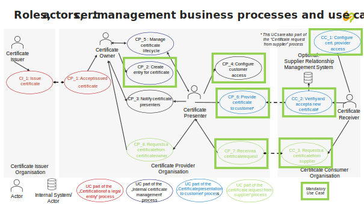
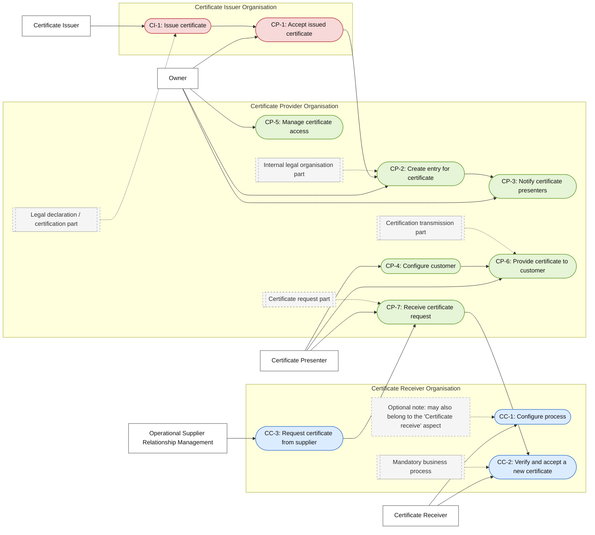
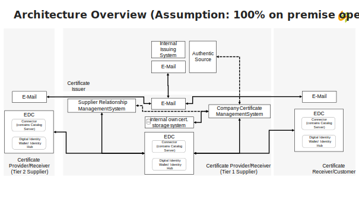

Welcome to the **Company Certificate Management (CCM) KIT Adoption View**. This view provides business value, strategic benefits, and use cases for business stakeholders and decision-makers.

:::info Target Audience
Business Managers, Product Owners, Solution Architects, Industry Experts, and Decision Makers.
:::

Today, suppliers must repeatedly upload certificates to multiple portals, a process that is inefficient and error-prone. The certificate management
software solution in Catena-X manages the certification process for business partner companies, ensuring all partners have valid, up-to-date certificates—such as compliance,
quality, or regulatory documents—before business transactions. It streamlines the business process on all sides by allowing companies to upload certificates once and share
them with multiple customers, automating, tracking, and documenting the certificate lifecycle to support compliance, risk management, and auditability.

---

## Vision & Mission

### Vision

To provide a seamless, efficient, and secure certificate management solution that empowers companies to participate in digital supply chains with confidence and compliance.

### Mission

Enable businesses to manage, validate, and share certificates effortlessly, bridging gaps between supplier and OEM systems, and enhancing visibility in the automotive market.

### Purpose

The software solution described in "CX-0135 Business Partner Company Certificate Management" is designed to manage the certification process of business partner companies.
Its main goal is to ensure all business partners (suppliers, vendors, etc.) have valid, up-to-date certificates (compliance, quality, regulatory) before engaging in business transactions.
The solution automates, tracks, and documents the lifecycle of certificates, supporting compliance, risk management, and auditability.

---

## Business Processes and use case model

### Roles

#### Organization Roles

- **Certificate Issuer** – Accredited legal entity that issues a company certificate to another legal entity according to the governance defined for the specific type of certificate.
- **Certificate Provider** – Legal entity that owns the company certificate and that enables to transfer or presents the certificate data to a certificate consumer.
- **Certificate Consumer** – Legal entity that needs the certificate data and therefore expects that the data are delivered or that requests and gets the data.
- **Business Application Provider** – Legal entity that offers a software application that supports the business processes of the other roles.

#### Actors

Actors are defined to provide insights in internal organizational constraints for the CCM application providers. Actors help CCM application providers to develop better tools.

- **Certificate Owner** – Employee of a department (e.g. quality management department) responsible within an organizational unit for accepting certificates from the certificate issuer,
  for storing the certificate and enabling access to the data within the organizational unit.
- **Certificate Presenter** – Employee of a department (e.g. sales department) responsible within an organizational unit for submitting own certificates to external business partners or
  enabling access to company certificates for business partners.
- **Certificate Receiver** – Employee of an organizational unit (e.g. purchasing department) within an organization that acts as a relying party for company certificates.

## Business Processes and Use Cases

The following business processes and the described use cases within the business processes should be implemented in the certificate issuer, provider, consumer organizations. Not all the
use cases need to be supported by the CCM tool provided by the application provider. Some of the processes and use cases currently are implemented by company policies and existing tools (e.g. e-Mail).
The business process and use case model is described to transfer knowledge from potential customers to CCM application provider organizations.


*Roles, certificate management business processes and the use cases associated to the business processes*



### Certification of a Legal Entity

This business process starts when a legal entity decides to receive a new or an updated version of a company certificate from an attestation provider. The process includes all the interactions between
the certificate owner and the certificate issuer organizations. The process ends when a new version of the certificate is issued, accepted and stored.

:::note
The use cases associated to this process are **CI_1: Issue certificate** and **CP_1: Accept issued certificate**.
:::

### Internal Certificate Management

This business process starts after a new certificate has been received from the certificate issuer and accepted by the certificate owner.

The process includes all the required steps to get an overview of the owned certificates and their lifecycle status. Based on this status, required actions are derived and performed. Entries for certificates
are created based on existing *.pdf versions. Certificate presenters are notified that new entries were created. Certificate presenters configure access rights for external customers or business partners.

The process ends when the access rights are configured.

:::note
The use cases associated to this process are: **CP_2: Create entry for certificate**, **CP_3: Notify certificate presenter**, **CP_4: Configure customer access**, **CP_5: Manage certificate lifecycle**.
:::

### Certificate Presentation to Customers

This business process starts when a certificate presenter:

a) has been notified by the certificate owner that a new certificate instance is available, or
b) has received a certificate request from a customer, or
c) has concluded from the certificate lifecycle overview that a certificate has to be presented.

:::note
An additional prerequisite for the use case start is that the certificate consumer organization has performed the use case “CC_1: Configure certificate provider access”
:::

The process includes all the activities and interactions required to transfer the certificate data from the certificate provider organization to the certificate consumer organization. The business process ends
when the certificate transfer was accepted by the certificate consumer organization, and the certificate data are transferred to the internal systems (e.g. supplier relationship management system) of the certificate consumer.

The use cases associated to this process are:

**TBD… the list will be added after the use case model:**

### Certificate Request from Supplier

This business process starts when a certificate requester (e.g. purchase department) of a certificate consumer organization has detected that a certificate provider (e.g. supplier) company certificate is missing.

The process includes all the activities and interactions required to transfer the certificate data from the certificate provider to the certificate consumer. The business process ends when the certificate transfer was accepted by the
certificate requester, and the certificate data are transferred to the internal systems (e.g. supplier relationship management system).

The use cases associated to this process are:

**TBD… the list will be added after the use case model was reviewed:**

### Use Case Model

#### Actors

The actors are certificate owner, certificate presenter and certificate requester. They are defined and described in the roles section.

#### Use Cases

##### Certificate Issuer Use Cases

**CI_1: Issue certificate:**

The use case starts after an organization has passed an audit. The use case includes all the steps required to transfer a certificate to the certificate owner organization and to receive the confirmation that the certificate was received
and accepted by the certificate owner.

The next use case in the process is CP_1 performed by the certificate owner.

:::note
The support of this use case by the standard and CCM applications is optional.
:::

##### Certificate Provider Use Cases

**CP_1: Accept issued certificate:**

The use case starts when the certificate owner is notified that a new certificate instance is received from the certificate issuer organization. The certificate owner verifies the certificate data and notifies the certificate issuer
organization that he has received the certificate, and the certificate is accepted. If the certificate contains errors, then the certificate owner rejects the certificate and requests a correct certificate from the certificate issuer.

The use case ends when the certificate issuer has received an acceptance notification from the certificate owner.

:::note
The support of this use case by the standard and CCM applications is optional.
:::

**CP_2: Create entry for certificate:**

The use case starts when new or existing certificates are available only in *.pdf format. The certificate owner enters all the data related to the existing certificate in the CCM tool and stores the new entry.

:::note
The support of this use case by the standard and CCM applications is mandatory.
:::

**CP_3: Notify certificate presenter:**

The use case starts after a new certificate was stored in the CCM tool. The certificate owner notifies the employees working in the certificate presenter's role that a new certificate instance is available.

:::note
The support of this use case by the standard and the CCM applications is optional.
:::

**CP_4: Configure customer access:**

The use case starts after the certificate presenter was notified that a new certificate instance is available. The certificate presenters configure external visibility and access to the certificate by entering unique identifiers (e.g. BPNL)
representing the legal entity of their customers or business partners for each certificate type. If the certificate is publicly available, then no entries are required. If the certificate needs to be exchanged according to a bilateral contract,
corresponding contract information needs to be configured.

After the use case ends the new certificate can be provided automatically (without user interaction) on request from the certificate consumer.

:::note
The support of this use case by the standard and the CCM applications is mandatory.
:::

**CP_5: Manage certificate lifecycle:**

The use case starts when the certificate owner or the certificate presenter want to analyze the current status of the owned certificate and to derive required certificate management actions.

The CCM application provides a sortable tabellar overview of all the certificates and their most important attributes.

The information displayed should allow a certificate owner to analyze and perform the following main certificate management actions:

- Identify missing certificates
- Creation of new certificate data entries based on existing *.pdf versions of owned certificates
- (Optional:) Acceptance of received certificates from certificate issuer and notification of the certificate presenter that a new certificate instance is available
- Expiration tracking for all certificates and the derived actions (deletion, request of a new instance from the certificate issuer (optional),…)

The information displayed should allow a certificate presenter to analyze and perform the following main certificate management actions:

- Identify new certificate types and start to configure certificate consumer organization access
- Expiration tracking to identify certificates that need to be transferred to certificate consumer organizations (e.g. customers)
- Identification and handling of certificates that were not accepted by certificate receivers due to errors
- (Optional) Handling of certificate request received from certificate receivers (e.g. customers)
- The support of this use case by the standard and the CCM applications is mandatory.

**CP_6: Provide certificate to customer:**

The use case can start after customer access is configured. The certificate presenter selects for each certificate the certificate consumers legal entity to which the certificate entry should be transferred.

The transfer can be performed by

a) pushing respective presenting the certificate data to the certificate consumer organisation
b) notifying the certificate consumer organization that a new certificate is available and by automatically providing the data on request of the certificate consumer organization.

The use case ends after the data are transferred to the customer.

The next use case in the process is cc_2 performed by the certificate receiver.

:::note
The support of this use case by the standard and the CCM applications is mandatory.
:::

**CP_7: Receive a certificate request:**

The use case starts when a certificate provider organization has received a request for a new type of certificate or a new instance of a certificate that was not delivered. The certificate
receiver has specified the requested certificate instance by providing the attributes that allows the identification of the missing certificate instance (e.g. type, site,…)

The certificate presenter manages the request according to the internal tools (e-Mail, CCM application,…) and lifecycle status of the requested certificate (not available, already issued but not presented,…).
He is responsible for initiating all internal actions that need to be performed before he can present the requested certificates.

The use case ends when the certificate presenter has : a) presented the missing certificate or b) has initiated internal activities required to get the missing certificate.

:::note
The support of this use case by the standard and CCM applications is optional.
:::

**CP_8: Request a certificate from certificate owner:**

The use case starts after the use case “CP_7_ Receive a certificate request” has ended due to the fact that internal activities are required before a requested certificate can be presented
to the certificate consumer organization.

If the requested certificate is not included in the CCM application, then the certificate provider contacts the employee working in the certificate owner role and they agree to corrective actions required
to make the missing certificate available in the CCM application.

If the requested certificate is included in the CCM tool but can not be transferred, then the certificate presenter configures the CCM tool correctly and transfers the data.

The use case ends if a) the certificate is transferred to the certificate consumer organization or b) with the agreement to initiate additional actions to include the certificate in the CCM application.

:::note
The support of this use case by the standard and the CCM applications is optional.
:::

##### Certificate Consumer Use Cases

**CC_1 Configure certificate provider access:**

The use case starts when a certificate consumer organisation wants to receive certificate presentations from another organization (e.g. a supplier).

The certificate receiver configures the company certificate management software and the underlying backend software to allow push transfer of certificate data from his business partners (e.g. suppliers) according to
existing bilateral contracts and the Catena-x governance framework.

After the use case ends a new certificate can be presented automatically (without user interaction) by the certificate provider organization.

:::note
The support of this use case by the standard and the CCM applications is mandatory.
:::

**CC_2: Verify and accept a new certificate:**

The use case starts when a new certificate or a notification that a new certificate is available has been received by a certificate consuming organization.

The certificate receiver checks the received certificate. The performed checks depend on the trust level of the received certificate data and are defined by internal policies of the consuming organization.
For certificates with the highest trust level (e.g. issued as verifiable attestations by the certificate issuer) the software backend can verify automatically: a) data integrity, b) the authenticity (issuer identity),
c) holder identity, d) certificate validity and  e) revocation status.
For certificates with lower trust level additional checks have to be performed. The transferred data are checked against the *.pdf file created by the certificate issuer.
The scope of the certificate (included sites, etc.) still must be verified manually independent from the trust level.

The verification checks can be performed in the CCM application together with the EDC and the included business wallet or after the transfer into internal systems with support of the internal systems.
After successful verification the certificate receiver marks the received certificate as accepted and notifies the certificate consumer organization.

The use case ends after the verified certificate data are available in the internal system used to manage the supplier certificates.

:::note
The support of this use case by the standard and the CCM applications is mandatory.
:::

**CC_3: Request a certificate from supplier:**

The use case starts when the certificate receiver discovers or is notified that a supplier certificate is missing or no longer valid.

The certificate receiver requests the missing certificate from the certificate provider organization and provides the data required to identify the missing certificate.
The use case software support and the flow of events depends on the internal systems used by the organizations. The following software systems can be involved: a) e-Mail system, b) internal certificate storage system
c) EDC with the included Digital Identity Wallet d) Supplier Relationship Management System e) future EU Business Wallets TBD ... Reference to architecture configurations should be added.

The use case ends when the certificate provider organization has received the certificate request or the missing certificate was transferred via the pull mechanism to the certificate receiver organization.

:::note
The support of this use case by the standard and the CCM applications is mandatory.
:::

TBD ... Proposal for a diagram that should be added to the Architecture section of this document.


*Architecture Overview (Assumption: 100% on premise operation)*

## Trust Levels

:::info

- **HINT**: In the current Data Model (Rel. 26.03) there are still 4 trust levels (none, low, high, trusted).
- New Trust Level Concept will be released with 26.XX.
- Aim was to reduce complexity from 4 to 3 Trust Levels.
- Feedback is always welcome.

:::

### Trust Levels Overview

:::note
Each trust level builds upon the previous one
:::

#### Low Trust Level (Unverified)

- **Verification Status**: None
- **Process**:
  - The data provider submits a PDF certificate and the corresponding structured data using the Catena-X data model.
  - No app needed – certificate payload can be shared via standard EDC flow.
  - No verification or validation is performed at this level.
- **Purpose**: Basic data availability

#### Medium Trust Level (Self-Verified or Third-Party Validated)

- **Verification Status**: Self-declared or externally validated
- **Process**:
  - The data provider submits a PDF certificate and the corresponding structured data using a Catena-X certified business application.
  - One or more of the following optional validation mechanisms may be applied to enhance trust:
    - **OCR-based validation**: The system uses OCR to scan the PDF and compare it with the structured data. If the data matches, it's accepted. If discrepancies are found, a human must correct them to ensure consistency.
    - **Third-party verification via external databases or services**: The certificate data is cross-checked via API or other services with external databases that also hold the certificate. This adds an extra layer of trust by confirming the certificate's validity through another source. Examples: NQC, Ariba.
- **Purpose**: Enhanced trust through at least one optional validation mechanism

#### High Trust Level (Issuer-Verified)

- **Verification Status**: Verified via trusted industry interface
- **Process**:
  - The data provider submits a PDF certificate and the corresponding structured data using a Catena-X certified business application.
  - An interface (API or SSI) to an issuing authority (e.g., Issuer: TÜV, IATF, ENX) is used to validate the certificate directly.
  - OCR is optional – may be used to simplify data entry but is not required for verification.
- **Purpose**: High trust through validation based on the data of an issuing authority

## Semantic Models

### BusinessPartnerCertificate

- **Purpose**: To define a common semantic representation for business-partner certificates (company certificates) exchanged in the Catena-X ecosystem. By using this standard aspect model, different participants (data providers and consumers) can exchange certificate data interoperably and with agreed semantics — which supports automation, trust, and data sovereignty.
- **Scope**: The model attaches to a Business Partner Number – Legal Entity (BPNL) and represents all relevant information about certificates issued to that entity. It includes:
  - Certificate metadata (type, name, validity period).
  - Issuer information.
  - Identification of legal entities, sites and valid addresses covered.
  - Metadata describing the original physical certificate.
  - This structure enables companies to share certification information as a digital, interoperable asset rather than unstructured files like PDFs.

#### Model Identification & Licensing

- **Semantic Identifier**: `urn:samm:io.catenax.business_partner_certificate:3.1.0`
- **License**: Creative Commons Attribution 4.0 (CC-BY-4.0)
- **Source**: Part of the Catena-X semantic model library maintained under the Eclipse Tractus-X project.
- Technically, the model is defined using the semantic modeling language SAMM (Semantic Aspect Meta Model).
- **GitHub**: [sldt-semantic-models/io.catenax.business_partner_certificate/3.1.0](https://github.com/eclipse-tractusx/sldt-semantic-models/tree/main/io.catenax.business_partner_certificate/3.1.0)

#### Example JSON Payload

```json
{
  "businessPartnerNumber": "BPNL00000003AYRE",
  "enclosedSites": [
    {
      "areaOfApplication": "Development, Marketing und Sales and also Procurement for interior components",
      "enclosedSiteBpn": "BPNS00000003AYRE"
    }
  ],
  "registrationNumber": "12 198 54182 TMS",
  "uploader": "BPNL00000003AYRE",
  "document": {
    "documentID": "UUID--123456789",
    "creationDate": "2024-08-23T13:19:00.280+02:00",
    "contentType": "application/pdf",
    "contentBase64": "iVBORw0KGgoAAdsfwerTETEfdgd"
  },
  "validator": {
    "validatorName": "Data service provider X",
    "validatorBpn": "BPNL00000007YREZ"
  },
  "validUntil": "2026-01-24",
  "validFrom": "2023-01-25",
  "trustLevel": "none",
  "type": {
    "certificateVersion": "2015",
    "certificateType": "ISO9001"
  },
  "areaOfApplication": "Development, Marketing und Sales and also Procurement for interior components",
  "issuer": {
    "issuerName": "TÜV",
    "issuerBpn": "BPNL133631123120"
  }
}
```

## Standards

| Standard    | Description                                     |
|-------------|-------------------------------------------------|
| **CX-0135** | Business Partner Company Certificate Management |

## References

| Standard    | Description                   |
|-------------|-------------------------------|
| CX-0003:1.1 | SAMM Aspect Meta Model        |
| CX-0010:2.0 | Business Partner Number       |
| CX-0151     | Industry Core: Basics v.1.0.0 |
| CX-0001:1.0 | EDC Discovery API             |
| CX-0018     | Dataspace Connectivity        |

## NOTICE

This work is licensed under the [CC-BY-4.0](https://creativecommons.org/licenses/by/4.0/legalcode).

- SPDX-License-Identifier: CC-BY-4.0
- SPDX-FileCopyrightText: 2026 BASF SE
- SPDX-FileCopyrightText: 2026 Bayerische Motoren Werke Aktiengesellschaft (BMW AG)
- SPDX-FileCopyrightText: 2026 Cofinity-X GmbH
- SPDX-FileCopyrightText: 2026 Data Space Solutions GmbH
- SPDX-FileCopyrightText: 2026 DCCS GmbH
- SPDX-FileCopyrightText: 2026 Mercedes Benz AG
- SPDX-FileCopyrightText: 2026 Robert Bosch Manufacturing Solutions GmbH
- SPDX-FileCopyrightText: 2026 SAP SE
- SPDX-FileCopyrightText: 2026 sovity GmbH
- SPDX-FileCopyrightText: 2026 T-Systems International GmbH
- SPDX-FileCopyrightText: 2026 Volkswagen AG
- SPDX-FileCopyrightText: 2026 ZF Friedrichshafen AG
- SPDX-FileCopyrightText: 2026 Contributors to the Eclipse Foundation
- Source URL: [https://github.com/eclipse-tractusx/eclipse-tractusx.github.io](https://github.com/eclipse-tractusx/eclipse-tractusx.github.io)
