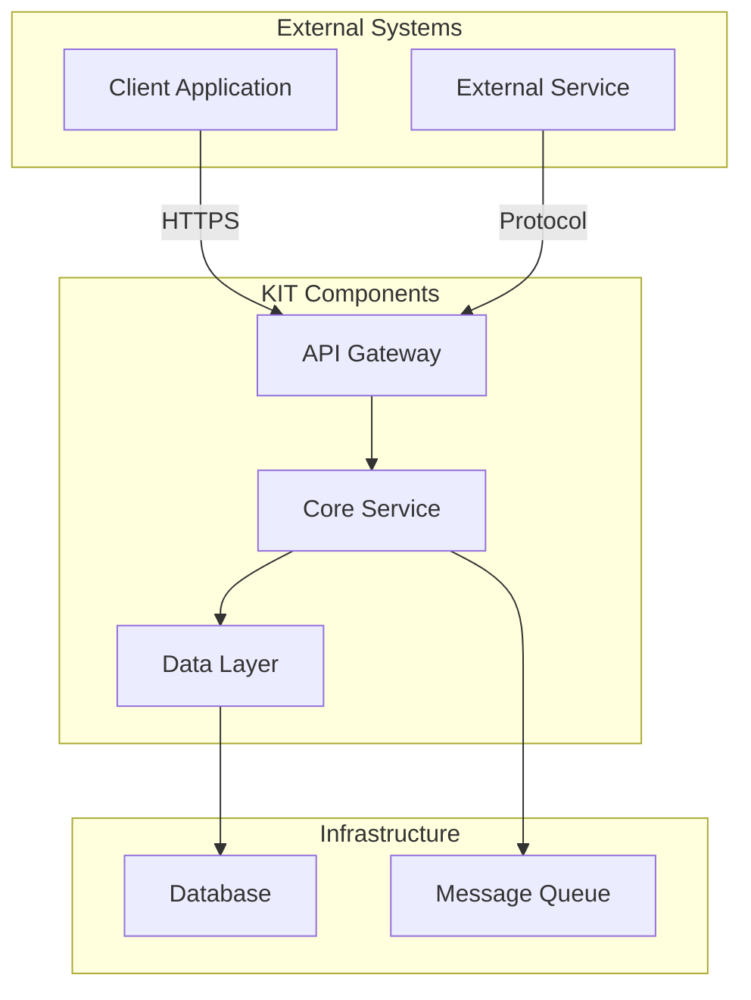

## Architecture Overview

### System Architecture

[High-level architecture diagram and explanation]

### Architecture Principles

1. **Modularity**: Loosely coupled components
2. **Scalability**: Horizontal scaling support
3. **Security**: End-to-end encryption
4. **Interoperability**: Standards-based APIs
5. **Observability**: Built-in monitoring and logging

## NOTICE

This work is licensed under the [CC-BY-4.0](https://creativecommons.org/licenses/by/4.0/legalcode).

- SPDX-License-Identifier: CC-BY-4.0
- SPDX-FileCopyrightText: [YYYY] [YOUR_COMPANY]
- SPDX-FileCopyrightText: [YYYY] Contributors to the Eclipse Foundation
- Source URL: [https://github.com/eclipse-tractusx/eclipse-tractusx.github.io](https://github.com/eclipse-tractusx/eclipse-tractusx.github.io)
