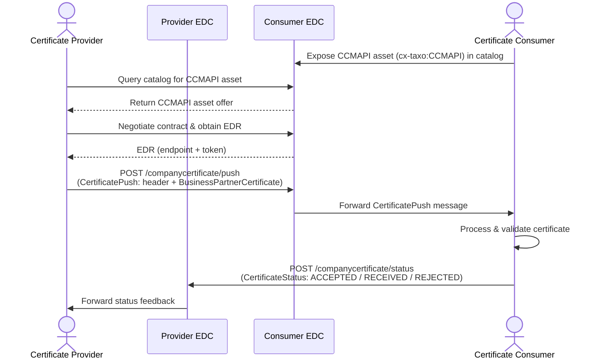
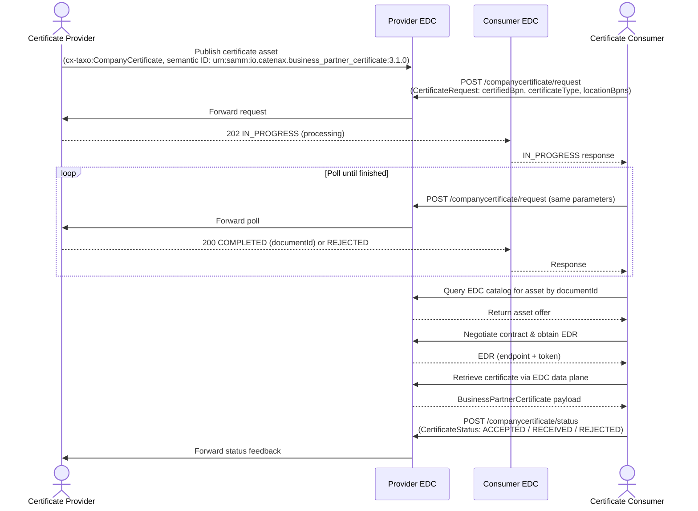

import Kit3DLogo from '@site/src/components/2.0/Kit3DLogo';

<Kit3DLogo kitId="ccm" />

## Contents

| Page | Description |
|---|---|
| [Architecture Overview](architecture.md) | System architecture, PUSH/PULL mechanism diagrams, and usage guide for the CCM API. |
| [CCM API Guide](ccm-api-guide.md) | Notification schemas, endpoint specifications, header models, and JSON payload examples for all CCMAPI endpoints. |
| [Requirements](development-view.md) | Functional and non-functional requirements, quality attributes, and integration considerations. |

## Business Architecture and APIs

### Architecture

The Architecture Overview diagram explains the assumptions made in the use case descriptions. It is important to note, that the value of a CCM-Tool increases significantly if it can be integrated via APIs with existing tools
(e.g. Supplier Relationship Management,…)

Architecture Overview (Assumption: 100% on premise operation)

The CCM system is a modular, scalable architecture supporting integration with ERP, CRM, and document management systems. It includes a dashboard for monitoring certificate status and pending actions.

**Key architectural qualities:**

- **Integration**: Standard APIs or connectors for integration with external systems. Support for importing/exporting data in standard formats (CSV, XML).
- **Security**: Data encryption at rest and in transit. Strict access controls to sensitive certificate data. Compliance with data protection regulations (e.g., GDPR).
- **Scalability**: Ability to handle a large number of business partners and certificates. Support for future integration with additional systems or modules.
- **Reliability & Availability**: High system uptime, backup, and disaster recovery mechanisms.
- **Performance**: Fast response times for certificate lookups and workflow actions. Efficient batch processing for notifications and reporting.
- **Usability**: Intuitive user interface for business and technical users. Multilingual support as required.
- **Auditability**: Comprehensive logging of all user actions and system events. Tamper-proof audit trails for compliance verification.
- **Maintainability**: Modular architecture for easy updates and enhancements. Clear documentation for system configuration and operation.

### API Endpoints and Resources

- Company Certificate Request
- Company Certificate Push
- Company Certificate Status (Accepted / Received / Rejected)
- Company Certificate Available
- Error Handling

## Company Certificate Management API (CCMAPI) – Usage Guide

This section explains how to use the Company Certificate Management API (CCMAPI) defined in CX-0135, based on the OpenAPI specification.

The CCMAPI supports two main interaction patterns between Certificate Provider and Certificate Consumer:

- **PUSH mechanism** – Provider actively sends certificates.
- **PULL mechanism** – Consumer actively requests or retrieves certificates.

Additionally, CCMAPI defines notification messages to coordinate these interactions.

---

## PUSH Mechanism

In the PUSH mechanism, the Certificate Provider initiates the transfer of a certificate to the Certificate Consumer via the endpoint `/companycertificate/push`.

### High-Level Flow

1. Certificate Consumer exposes a CCMAPI notification API asset (type `cx-taxo:CCMAPI`) in its EDC catalog.
2. Certificate Provider negotiates a contract for this CCMAPI asset in the Consumer's EDC and obtains an EDR.
3. Using the EDR, the Certificate Provider calls `/companycertificate/push` with a `CertificatePush` message:

    - The header identifies sender, receiver, context, message and feedback URL.
    - The content contains the `BusinessPartnerCertificate` payload (as defined by the semantic model `urn:samm:io.catenax.business_partner_certificate:3.1.0`).

4. Consumer processes the certificate and may send feedback via `/companycertificate/status`.

### PUSH Sequence Diagram

### Key Points

- **PUSH is Provider-driven**: Provider decides when and for which locations a certificate is sent.
- The field `senderFeedbackUrl` in the header tells the Consumer which EDC DSP endpoint to use for feedback notifications.
- The certificate content includes `documentID` (as defined in the aspect model) and all relevant certificate details and enclosed sites/addresses.

---

## PULL Mechanism

In the PULL mechanism, the Certificate Consumer initiates the retrieval of certificates from the Certificate Provider.

There are two complementary parts:

- **Request notification via CCMAPI** – Consumer asks Provider for a certificate for a specific legal entity and (optionally) locations.
- **EDC catalog lookup and data pull** – Consumer looks up the certificate asset in the Provider's EDC catalog and retrieves the actual certificate data.

### High-Level Flow

1. Provider creates certificate assets in its EDC catalog:

    - Subject `cx-taxo:CompanyCertificate` and type `cx-taxo:Submodel`.
    - Semantic ID `urn:samm:io.catenax.business_partner_certificate:3.1.0`.
    - Properties such as `certificateType` and `enclosedSites` set according to the model.

2. Consumer optionally sends a request via `/companycertificate/request` to indicate which certificate is desired.
3. Provider processes the request and returns either:

    - `IN_PROGRESS` – processing continues asynchronously.
    - `COMPLETED` – including the `documentId` (EDC asset ID of the certificate).
    - `REJECTED` – including one or more errors.

4. For long-running processing, the Consumer polls the same `/companycertificate/request` endpoint again (with a new message but the same business parameters) until a `COMPLETED` or `REJECTED` response is returned. The Provider never initiates a callback for request state changes.
5. After `COMPLETED`, Consumer uses the `documentId` to search the Provider's EDC catalog and retrieves the certificate via the EDC data plane.
6. Consumer may send feedback about reception, acceptance or rejection via `/companycertificate/status`.

### PULL Sequence Diagram

### Key Points

- **PULL is Consumer-driven**: Consumer asks for the certificate when needed.
- The `documentId` in the CCMAPI messages refers to the EDC asset ID of the certificate (except inside the pushed certificate payload, where `documentID` refers to the certificate document itself).
- Certificate assets are identified in EDC by the combination of subject, certificate type and enclosed sites.

---

For the full endpoint reference, notification schemas, and JSON payload examples, see the [CCM API Guide](ccm-api-guide.md).

## NOTICE

This work is licensed under the [CC-BY-4.0](https://creativecommons.org/licenses/by/4.0/legalcode).

- SPDX-License-Identifier: CC-BY-4.0
- SPDX-FileCopyrightText: 2026 BASF SE
- SPDX-FileCopyrightText: 2026 Bayerische Motoren Werke Aktiengesellschaft (BMW AG)
- SPDX-FileCopyrightText: 2026 Cofinity-X GmbH
- SPDX-FileCopyrightText: 2026 Data Space Solutions GmbH
- SPDX-FileCopyrightText: 2026 DCCS GmbH
- SPDX-FileCopyrightText: 2026 Mercedes Benz AG
- SPDX-FileCopyrightText: 2026 Robert Bosch Manufacturing Solutions GmbH
- SPDX-FileCopyrightText: 2026 SAP SE
- SPDX-FileCopyrightText: 2026 sovity GmbH
- SPDX-FileCopyrightText: 2026 T-Systems International GmbH
- SPDX-FileCopyrightText: 2026 Volkswagen AG
- SPDX-FileCopyrightText: 2026 ZF Friedrichshafen AG
- SPDX-FileCopyrightText: 2026 Contributors to the Eclipse Foundation
- Source URL: [https://github.com/eclipse-tractusx/eclipse-tractusx.github.io](https://github.com/eclipse-tractusx/eclipse-tractusx.github.io)
