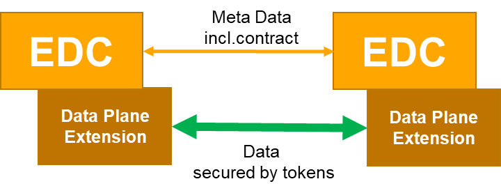

The Connector KIT describes the basic infrastructure that is used for any cross-enterprise data exchange within
Catena-X to ensure security and data sovereignty. The infrastructure is based on the
[Dataspace Protocol][dsp-url] and [Self-Sovereign Identities][self-sovereign-identity-url] as basic mechanisms to
achieve the targeted goals.

## Vision & Mission

### Vision

Sharing data along the automotive supply chain adds great value for every participant. The key to such collaboration is
trust between the involved partners and a clear scope that defines under which conditions and for which purposes
transfered data may be used at the receiving partner of the transaction. These prerequisistes are needed to create
trust in data sharing usecases that enable the necessary means to, e.g. fulfill regulatory requirements, or increase
process efficiency within the supply chain.

### Mission

Collaboration needs trust. Within Catena-X trust is built on open standards and technologies that transparently provide
features to find needed data, to agree on the usage of the data in a legally binding way and to finally get the
technical means to access the data.

The Connector KIT provides all necessary information and technology references to perform trustful data exchange within
Catena-X. It bundles the interaction patterns, relevant standards, APIs, and reference implementations for developers.

## Important terms and definitions

Before going into details, this section describes some basic terms and defines them. The idea is, to define a common
understanding of important terms which are used throughout the KIT, so that misunderstandings are minimized.

- Dataspace: The overall term for the principles with which data transfer is organized within Catena-X. The technical
  details of those principles are the scope of this KIT.
- Data Provider: A data provider in Catena-X is a company, that owns data and offers that data to others to use it.
- Data Consumer: A data consumer is in Catena-X a company, that consumes data offered by a provider.
- Dataspace participant: A company acting as data provider or data consumer or both
- Connector: Is the common term for a technical component that is formally named (dataspace) participant agent. It
  provides central features needed to act as data provider or consumer within the Catena-X dataspace.

## Basic values and principles

The data exchange in Catena-X follows a set of values and derived principles that drive the interaction patterns. In
detail, they are:

- Decentralization: The data transfer from a data provider to a consumer is a peer-to-peer activity which does not
  involve third parties. This comes with two major goals:
  - The data transfer cannot be observed outside of the two acting companies.
  - Data transfer activities are not blocked by outages of central services.
- Scalability: The management efforts for dataspace participants for maintaining connections to all connected
  dataspace participants and the overall efforts to support a basically unlimited number of participants are
  within reasonable limits.
- Data Sovereignty: Data providers have full control over who has access to the offered data and under which conditions
  the data might be used. On the other hand side, data consumers have full knowledge over the conditions data is
  available in advance, so they can decide to use an offer or not.
- Interoperability: The data transfer is standardized in a way, that allows a data consumer to identify
  - which type of data is offered and what to expect semantically as content of the data,
  - how the data is transfered, i.e., which protocols resp. which APIs to use,
  - under which conditions the data can be used.

## Concept

The principle concept followed in Catana-X to achieve the targeted goals is the concept of a dataspace which is based
on the existence of a connector. A connector provides the technical implementation of the dataspace principles which
are based on standardized protocols and assets maintained by the [Eclipse Dataspace Working Group][edwg-url].

In detail, the relevant assets are:

- Dataspace Protocol (DSP): The DSP is a specified protocol for the interaction of a data consumer with a data provider
  in order to find data offering, get access to the data and managing the data transfer. In Catena-X, the protocol is
  used with its HTTP binding, i.e., the requests and responses defined in the DSP are translated to REST APIs which
  are used for the communication.
- Identity: The DSP is requiring defined identities for dataspace participants. For Catena-X, there are bascially two
  relevant identifier which represent identity. A Business Partner Number for an legal entity (BPNL) represents an
  unique identifier which represents in a legally binding fashion the company acting as dataspace participant. For
  technical reasons, a second identifier is needed based on the [Decentralized Identifier (DID)][did-url] standard.
  This identifier type, especially the used WEB-DID method allows to connect metadata like public keys or central
  service references to the DID by providing that information in a DID document. This is hosted by a participant and
  the retrieval of the document can be done locally based on information in the DID.
- Verifiable Credentials: The identity and the acceptance of general terms and conditions for the participation in
  Catena-X of a dataspace participant are expressed in the form of a verifiable credential. A verifiable credential
  is basically a digitally signed credential which allows a participant to proof the availability of a certain fact
  like the mentioned identifier and acceptance of terms and conditions in a tamper-resistance way. Verifiable
  credentials are typically issues by a central authority but managed by the owner of the credential in a wallet.
  Just like a person who manages a passport issued by the government of his country in his purse.
- Decentralized Claims Protocol (DCP): The protocol used within Catena-X to allow a providers connector to access the
  wallet of a consumer in order to retrieve relevant verfiable credentials. This is needed to authenticate the
  consumer, i.e., to enable the provider to identify the consumer and to check prerequisites necessary to grant
  access to the data offered.
- Policies: A data offering by a data provider always comes with a contract proposal, i.e., a set of conditions
  under which the data offered can be accessed. These conditions are expressed in the form of
  [ODRL policies][odrl-url]. ODRL is a formal language to express such policies, so it is the simple technical
  mechanism to formulate legally binding conditions for the data usage. In Catena-X, there is a formal description
  of defined policy constraints, so that the usage of a certain constraint is backed by a legal information of the
  concrete meaning of the constraint.
- Discovery: Based on the identifiers, especially the DID of a data provider, Catena-X defines a decentral discovery
  mechanism that allows to identify endpoints of connectors in order to initiate data transfer use cases. The
  discovery mechanism uses the DID document to provide information on connector endpoints again in a decentral
  manner.

The described technologies are complete to initiate and conduct a data transfer. The prerequisite needed to get
started is, that a data consumer knows the identifiers of the data provider, both the BPNL and the DID. As a
consequence, Catena-X defines additional mechanisms that allow to retrieve these informations. These mechanisms
are out-of-scope of the Connector KIT. We refer to the [business partner KIT][BPDM-url] for further informations.

### Reasoning of the usage of the dataspace concept

There are established interaction patterns in the internet, which have already proven their applicability to many
different use cases in todays typical interactions. An important technology in this regard is OAuth2 which is the
de-facto standard for authentication and authorization within the internet. It needs good arguments to motivate,
why for the data transfer scenarios targeted at within Catena-X a new technology needs to be established.

The rationale behind the need for a new technology is basically driven from the above principles that are required
for data transfer scenarios. Major advantages of the dataspace technologies are:

- It does not require any technical relationship prior to the execution of the data transfer scenario. The only
  information that is needed at a data consumer are the identifiers of the data provider which can be retrieved
  by central dataspace services. From there on, everything is within the scope of the dataspace technology.
  Especially, there is no need to exchange metadata like the endpoints to access the data or the semantics of
  data access.

  Although dataspaces do not get rid of some central discovery mechanisms, alternative solutions either require
  substantially more centralization, e.g., an central identity provider that contradicts the decentralization
  principle, or they require an amount of upfront peer-to-peer information exchange, that limits the scalability
  to a non-acceptable level as each data transfer partner needs to be managed and, e.g., secrets like passwords
  need to be exchanged on a regular basis. The dataspace technology on the contrary solves those issues
  out-of-the-box without a lot of effort needed on data provider as well as consumer side.
- Embedded in the whole procedure of gaining access is an explicit definition and acknowledgement of the terms
  and conditions under which the data is available and how it can be used. There is a clear trace to those
  conditions which allows to answer questions around data sovereignty and compliance easily with locally
  avaible information.

  The technology allows to use a wide range of terms and conditions, starting in the simple case by just checking
  certain verifiable credentials to prove the identity of the data consumer. A slightly more complex case is well
  suited in supply chain use cases which dominate the Catena-X use cases today. In such situations, the data transfer
  is driven by a contract about the delivery of real world goods from a supplier to a customer. This contract
  regulates the data transfer needs, so that the policy used for the data offers in the connector can simply refer
  to that contract. On the complex sides, the Catena-X policy framework allows to express a whole range of
  constraints that can be used to specify a detailed contract that applies to the data transfer. It is all driven
  by the need of a provider of a data offer and the use case which might need to specify additional conditions.
  The flexibility is there.
- The applied pattern for authentication and authorization is applicable to a whole range of different technologies,
  standardzing the pure protocol for gaining access to a data offer. E.g., the technology supports standard HTTP
  REST api access control using tokens. In this case the end result, a token does not really divert from the way
  OAuth2 handles the access to a resource server. But the connector can also handle other ways of interaction, like
  push scenarios, where data is pushed from the provider to the consumer in a one time fashion or as a stream of
  data. The technical means, like a bucket to store a pushed object has to be provided or a technology to receive
  a constant stream of information, but the overall mechanism to get access and to manage the data transfer is
  standardized within the mechanisms of the Dataspace Protocol.

In general, the dataspace technology supports in a favorable way the principles described above as general targets
of Catena-X.

- Dencentralization: As mentioned, as soon as the identifierts of the data provider are known, the whole process does
  not require any interaction with a central service. The few remaining accesses to central services are specified in
  a way, that bascially no conrete interest in certain information can be deducted from those requests
- Scalability: Due to the decentral nature, there is no bottleneck or single-point of failure in the system. In
  addition, there is no need to exchange information between partners or to maintain a relationship. Everything is
  based on the identities and any data transfer can be iniated anytime with only knowledge about the identities of
  the involved parties
- Data Sovereignty: With the mechanisms of verifiable credentials and policies, the data provider has all the
  required mechanisms in place to ensure, that he provides data to identifiable entities and with clear conditions.
  There is full control over the data transfers conditions and partners as required by the described value
- Interoperability: The basic infrastructure defines foundations for the general interoperability of data transfer
  within Catena-X. Be aware, that this is limited to
  - finding data offerings,
  - understanding the conditions under which data is available
  - getting access to them,
  - getting information on the transfer protocol used to transport the data.

Further mechanisms to ensure interoperability have to be defined in the specific use cases, as, e.g., the semantics
of data models exchanged are out-of-scope for this KIT.

## Use Case

The connector framework is basically an enabler for all kinds of use cases. By supporting all kind of different
transfer technologies, there is no real limit concerning the support of different use cases. What the gain is
a reliable framework to ensure the principles targeted at by Catena-X. That is the reason why all use cases from
the Catena-X universe are required to use the connector technology in order to facilitate the data exchange scenarios
of the use case.

## Business Architecture

The Dataspace Protocol basically defines three levels of interaction:

1. Catalog Request:
   The catalog request provides to the consumer a list of availabe data offerings that are available. The catalog
   thereby is a DCAT catalog that provides a list of Datasets. A dataset describes a concrete data offer with relevant
   metadata, like the type of data, transfer type, api type and most important the usage policy under which the data is
   offered for usage. The Dataset also provides a link to the endpoint which allows to start the contract negotiation.

   The catalog only contains data offers which are accessible by the requesting data consumer. When defining Datasets,
   the data provider in addition to the usage policy has to define an access policy, which is basically a filter
   applied by the provider connector during the creation of the catalog. The access policy, e.g., can limit access to
   a defined set of data consumers, so that others do not even see the Dataset in the provided catalog.

2. Contract Negotiation:
   Access to a Data offer is provided via a contract, which is basically an agreed usage policy. In Catena-X this
   agreement of a policy is a legally binding contract.

   The necessary information needed to start a negotiation is provided in the catalog. This includes the endpoint to
   call for initiating the negotiation and the usage policy that is the contract proposal of the data consumer for
   data access. Based on this request, the contract negotiation process is started, which is in DSP an asynchronous
   process, so the data consumer has to check frequently, whether the process is finished. As in Catena-X this is
   fully automated, the time to finish is typically not long. The concrete state machine, the negotiation passes
   through is described in the [DSP spec][dsp-url].

   Be aware, that in Catena-X the usage policy in the catalog associated to a data offer has to be used literally. As
   of today, DSP features concerning policy negotiation are disabled and the consumer only has the choice to accept the
   proposed usage policy or to not negotiate for the offer.

3. When the contract is finalized, the data is accessible. To finally do the transfer, the consumer has to initiate
   a transfer process. A main purpose of the transfer process is to provide access information, so that the data
   transfer is actually executed. For that, it has to be generally distinguished between PULL and PUSH transfers.

   - In a PULL transfer, the consumer is the active part, i.e., he is initiating a request and receives the data
     as response. The typical example for this is requesting a REST API. In this case, initiating a transfer process
     results in the return of (EDR)?

   - In a PUSH transfer, ...

- General sequence of actions:
  - Identifier research
  -
- General architecture, Connector vs. Connector, Wallet, STS token factory, app, BDRS
- DSP levels catalog, negotiation, transfer
- Data Set design
- Policy design
-
-
-  i.e., control plane vs. data plane
-

The [EDC][edc-url] as a connector implements a framework agreement for sovereign, cross-organizational data exchange.
The International Data Spaces Standard (IDS) and relevant principles in connection with [GAIA-X][gaiax-url] were
implemented. The connector is designed to be extensible to support alternative protocols and to be integrated into
different ecosystems.

The objective is to set up a decentralized software component on the part of the respective partner, which bundles the
skills required to participate in a Data Space and enables peer-to-peer connections between participants.
The focus here is particularly on the data sovereignty of the independent companies.
The functionality required for this is bundled in the open-source project "Eclipse Dataspace Connector", to which
members of the Eclipse Foundation contribute.

The main difference between the EDC and the previous connectors of the [IDSA][idsa-url] is the separation of the
communication into a channel for the metadata and one for the actual data exchange. The channel for the data supports
various transmission protocols via so-called data plane extensions. The metadata is transmitted directly via the EDC
interface, while the actual data exchange then takes place via the appropriate channel extension. In this way, a highly
scalable data exchange is made possible.

The architecture of the EDC combines various services that are necessary for the above principles:

- An interface to the Identity Provider service, currently [IDSA][idsa-url]'s [Identity And Trust Protocol][iatp-url]
  communicating with the [Managed identity Wallet][miw-url]. This central service provides the identity and the
  corresponding authentication of the participants in the data exchange. (There is no authorization at this point).
  Decentralized solutions will also be supported in the future.
- The provision of possible offers (contract offering) which, on the one hand, stipulates the data offered and the
  associated terms of use (policies) in corresponding contracts.
- An interface for manual selection of data and associated contract offers.
- The actual data transfer via the data plane extension
- The connection of software systems on the customer and provider side

## Additional Resources

### Tutorial & Whitepapers

- There is a extensive tutorial on setting up and using an EDC in the context of the Catena-X dataspace in
  the [Tutorials](https://eclipse-tractusx.github.io/docs/tutorials/e2e)
  section of this website.
- To find out more about the role of the Enablement Services (of which the Connector is one),
  the [Whitepaper "Enablement
  Services 101"](https://catena-x.net/fileadmin/_online_media_/231006_Whitepaper_EnablementServices.pdf) provides a very
  digestible high-level overview.

### Catena-X Standards

The Connector KIT builds on the [Catena-X Standards][Catena-X-Standards-url]. Every data consumer and provider in
Catena-X is required to comply with these standards. The [EDC][edc-url] builds on the following standards:

- [CX - 0018 Eclipse Data Space Connector (EDC)][CX0018]
- [CX - 0049 DID Document Schema][CX0049]
- [CX - 0050 Framework Agreement Credential][CX0050]
- [CX - 0051 Summary Credential][CX0051]

### Terminology

The shown picture illustrates only a generic view of the EDC's Domain Model and is not intended to show all aspects of
the implementation. Most of the Domain-Model-Elements are represented by separate APIs. Please check
the [Management API Walkthrough](https://github.com/eclipse-tractusx/tractusx-edc/tree/main/docs)
in the tractusx-edc repository for more a reference on usage of the API.

#### Extensions

There are different extenions for the Connector, e.g. for the Data Plane. This enables various transfer modes like
httpData or via blob-storage.

#### Data Plane

The Data Plane handles several forms of actual data exchange by utilizing various extensions.

#### Control Plane

The Control Plane handles meta data exchange with other components and Connectors, as well as transfer of access tokens

#### Data Assets

Data Sources (databases, files, cache information, etc.) are connected to the Connector and are represented by Data
Assets. For each asset, a [`DataAddress`](#data-address) needs to be resolvable.

#### Data address

A data address is a pointer into the physical storage location where an asset will be stored.

#### Policy Definition

A standardized set of policies can be used to define actions regarding access to and usage of assets. These actions can
be limited further by constraints (temporal or spatial) and duties ("e.g. deletion of the data after 30 days").

#### Contract Definition

By combining [`Assets`](#data-assets) and Policies, Contracts for data offerings are defined. These Contracts need to be
accepted by consuming participants (Connectors) for the data exchange to take place.

#### Contract offer

The contract offer is a representation of the [`ContractDefinition`](#contract-definition) for a specific consumer and
serves as protocol for a data transfer object (DTO) for a particular contract negotiation. If a data consumer wants to
conclude a binding data exchange contract based on the terms of a Data Offer, the data consumer can communicate such
desire to the data provider by referencing to a specific Data Offer. This constitutes a binding offer by the data
consumer. For now, the data consumer only has the option to accept all terms of a Data Offer (or not). The Data Exchange
Process does not yet provide for the data consumer to make an offer that deviates from the terms of a Data Offer as set
by the data provider.

#### Contract negotiation

A `ContractNegotiation` captures the current state of the negotiation of a contract (`ContractOffer` ->
`ContractAgreement`) between two parties. This process is inherently asynchronous.

#### Contract agreement

A contract agreement represents the agreed-upon terms of access and usage of an asset's data between two data space
participants, including a start and an end date and further relevant information.

#### Transfer process

After a successful contract negotiation, `DataRequests` can be sent from the consumer connector to the provider
connector to initiate the data transfer. It references the requested [`Asset`](#data-assets)
and [`ContractAgreement`](#contract-agreement) as well as information about the [data destination](#data-address).

Similar to the `ContractNegotiation`, this object captures the current state of a data transfer. This process is
inherently asynchronous, so the `TransferProcess` objects are stored in a backing data store (`TransferProcessStore`).

## Notice

This work is licensed under the [CC-BY-4.0](https://creativecommons.org/licenses/by/4.0/legalcode).

- SPDX-License-Identifier: CC-BY-4.0
- SPDX-FileCopyrightText: 2024 Contributors of the Eclipse Foundation
- Source
  URL: [https://github.com/eclipse-tractusx/eclipse-tractusx.github.io](https://github.com/eclipse-tractusx/eclipse-tractusx.github.io)

[edc-url]: https://github.com/eclipse-edc/Connector

[edwg-url]: https://tbd

[did-url]: https://tbd

[odrl-url]: https://tbd

[dsp-url]: https://docs.internationaldataspaces.org/ids-knowledgebase/v/dataspace-protocol/overview/readme

[gaiax-url]: https://www.data-infrastructure.eu/GAIAX/Navigation/EN/Home/home.html

[idsa-url]: https://internationaldataspaces.org/

[miw-url]: https://github.com/eclipse-tractusx/managed-identity-wallet

[traceability-url]: https://eclipse-tractusx.github.io/docs-kits/next/kits/traceability-kit/adoption-view

[sustainability-url]: https://eclipse-tractusx.github.io/docs-kits/next/kits/Circularity_KIT/page-adoption-view

[self-sovereign-identity-url]: https://tbd

[BPDM-url]: https://eclipse-tractusx.github.io/docs-kits/next/kits/business-partner-kit/adoption-view

[DCM-url]: https://eclipse-tractusx.github.io/docs-kits/next/kits/demand-and-capacity-management-kit/adoption-view/overview

[PURIS-url]: https://github.com/eclipse-tractusx/puris

[digital-product-pass-url]:https://github.com/eclipse-tractusx/digital-product-pass

[iatp-url]: https://github.com/eclipse-tractusx/identity-trust

[Catena-X-Standards-url]:https://catena-x.net/de/standard-library

[CX0018]:https://catena-x.net/fileadmin/user_upload/Standard-Bibliothek/Update_September23/CX-0018-EclipseDataConnector_EDC_-v.2.0.1.pdf

[CX0049]:https://catena-x.net/fileadmin/user_upload/Standard-Bibliothek/Update_September23/CX-0049-DIDDocument-v.1.0.0.pdf

[CX0050]:https://catena-x.net/fileadmin/user_upload/Standard-Bibliothek/Update_September23/CX-0050-FrameworkAgreementCredential-v.1.0.0.pdf

[CX0051]:https://catena-x.net/fileadmin/user_upload/Standard-Bibliothek/Update_September23/CX-0051-SummaryCredential-v.1.0.0.pdf
