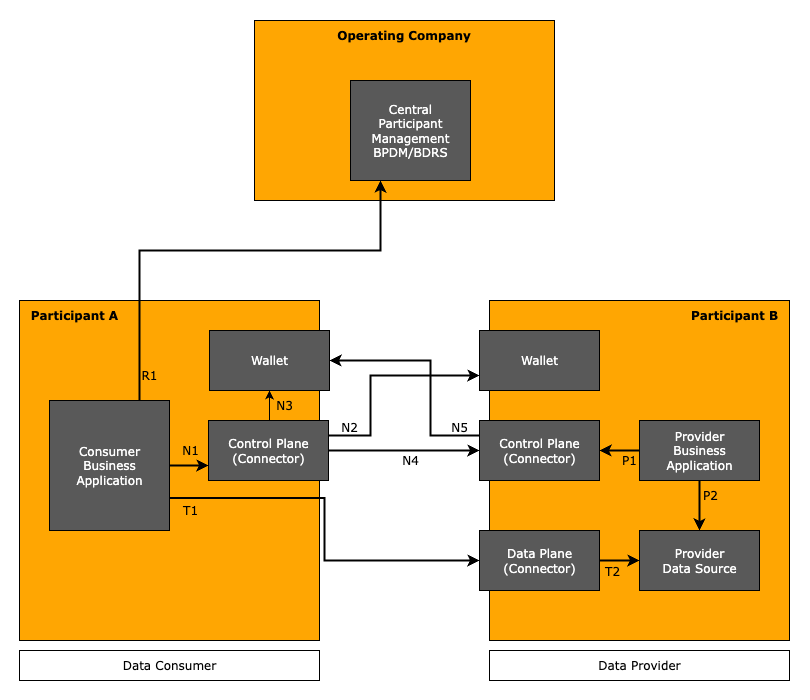

The Connector KIT describes the basic infrastructure that is used for any cross-enterprise data exchange within Catena-X. The infrastructure is based on the [Dataspaces][idsa-url] and [Self-Sovereign Identities][self-sovereign-identity-url] as basic mechanisms to achieve the targeted goals.

## Vision & Mission

### Vision

Sharing data along the automotive supply chain adds great value for every participant. The key to such collaboration is trust between the involved partners and a clear scope that defines under which conditions and for which purposes transfered data may be used at the receiving partner of the transaction. These prerequisistes are needed to create trust in data sharing use cases which are defined to fulfill regulatory requirements, or to increase process efficiency within the supply chain.

### Mission

Collaboration needs trust. Within Catena-X trust is built on open standards and technologies that transparently provide features to find data, to agree on the usage of the data in a legally binding way and to provide technical means for accessing the data.

The Connector KIT provides all necessary information and technology references to perform trustful data exchange within Catena-X. It bundles the interaction patterns, relevant standards, APIs, and reference implementations for developers.

## Important terms and definitions

Before going into details, some basic terms need to be described as they are used throughout the KIT.

- Dataspace: The overall term for the principles with which data transfer is organized within Catena-X. The technical details of those principles are the scope of this KIT. It is based on concepts developed by the [IDSA][idsa-url].
- Data Provider: A data provider in Catena-X is a company, that owns data and offers that data to others.
- Data Consumer: A data consumer in Catena-X is a company, that consumes data offered by a data provider.
- Dataspace participant: A company acting as data provider or data consumer or both.
- Connector: Is the common term for a technical component that is formally named (dataspace) participant agent, see [CX-0018][Catena-X-Standards-url] for reference. It provides central features needed to act as data provider or consumer within the Catena-X dataspace.

## Basic values and principles

The data exchange in Catena-X follows a set of values and derived principles that drive the interaction patterns. In detail, they are:

- Decentralization: The data transfer from a data provider to a consumer is a peer-to-peer activity which does not need the involvement of third parties. This comes with two major goals:
  - The data transfer cannot be observed outside of the two acting companies.
  - Data transfer activities are not blocked by outages of central services.
- Scalability: The management efforts for dataspace participants for maintaining connections to all connected dataspace participants and the overall efforts to support a basically unlimited number of participants in the dataspace are within reasonable limits.
- Data Sovereignty: Data providers have full control over who has access to the offered data and under which conditions the data might be used. On the other hand side, data consumers have full knowledge over the conditions data is available in advance, so they can decide to use an offer or not.
- Interoperability: The data transfer is standardized in a way, that allows a data consumer to identify
  - which type of data is offered and what to expect semantically as content of the data,
  - how the data is transfered, i.e., which protocols resp. which APIs to use for accessing it,
  - under which conditions the data can be used.

## Concept

The basic concept followed in Catana-X to achieve the targeted goals is the use of dataspace technology which is based on the existence of a connector. A connector provides the technical implementation of the dataspace principles using standardized protocols and assets maintained by the [Eclipse Dataspace Working Group][edwg-url]. The assets are based on concepts created by the [IDSA][idsa-url] and are in accordance to principles of [Gaia-X][gaiax-url].

In detail, the relevant assets are:

- [Dataspace Protocol (DSP)][dsp-url]: The DSP is a specified protocol for the interaction of a data consumer with a data provider in order to find data offerings, get access to the data and managing the data transfer. In Catena-X, the protocol is used with its HTTP binding, i.e., the requests and responses defined in the DSP are translated to REST API endpoints.
- Identity: The DSP requires trustworthy identities for dataspace participants. For Catena-X, there are bascially two relevant identifier which represent identity. A *Business Partner Number* for a legal entity (BPNL) represents an unique identifier for a company in a legally binding fashion. For technical reasons, a second identifier is needed based on the [*Decentralized Identifier* (DID)][did-url] standard. This identifier type, especially the used WEB-DID method allows to connect metadata like public keys or central service references to the company by providing the information in a DID document. This is hosted by a participant and the endpoint address for retrieval of the document is derived from the (WEB-)DID only.
- Verifiable Credentials: The identity and the acceptance of general terms and conditions for the participation in Catena-X are expressed in the form of a verifiable credential. A verifiable credential is basically a digitally signed data structure which allows a participant to proof the availability of a certain fact like the participants identity or the acceptance of terms and conditions in a tamper-resistant way. Verifiable credentials are typically issued by a central authority but managed by the owner of the credential in a wallet. Just like a person who manages a passport issued by the government of his country in his purse.
- [Decentralized Claims Protocol (DCP)][dcp-url]: The protocol used within Catena-X to allow a providers connector to access the wallet of a consumer in order to retrieve relevant verifiable credentials. This is needed to authenticate the consumer, i.e., to enable the provider to identify the consumer and to check prerequisites necessary to grant access to the offered data.
- Policies: A data offering by a data provider always comes with a contract proposal, i.e., a set of conditions under which the data can be accessed. These conditions are expressed in the form of [*Open Digital Rights Language* (ODRL)][odrl-url] policies. In Catena-X, there is a formal specification of a set of policy constraints which provide the legal definition to clarify the meaning of the constraint when used in a data transfer contract. See the extra page on [policies][policy-url] for a deeper insight into how policies are used within Catena-X.
- Discovery: Based on the DID of a data provider, Catena-X defines a decentral discovery mechanism that allows to identify endpoints of connectors in order to initiate data transfer use cases. The discovery mechanism uses the DID document to provide information on connector endpoints again in a decentral manner.

The described technologies are complete to initiate and conduct data transfers. The prerequisite needed to get started are the knowledge of the identifiers of the data provider, both the BPNL and the DID. As a consequence, Catena-X defines additional mechanisms that allow to retrieve these informations. These mechanisms are out-of-scope for the Connector KIT. We refer to the [business partner KIT][BPDM-url] for further informations.

### Reasoning of the usage of the dataspace concept

There are established interaction patterns in the internet, which have already proven their applicability in many different use cases of typical interactions. An important technology in this regard is OAuth2 which is the de-facto standard for authentication and authorization. It needs good arguments to motivate, why for the data transfer scenarios targeted at within Catena-X a new technology is needed.

The rationale behind the need for using dataspace technology is basically driven from the underlying principles described above. Major advantages of the dataspace technologies are:

- It does not require any technical relationship prior to the execution of the data transfer scenario. The only information needed by a data consumer are the identifiers of the data provider which can be retrieved by central dataspace services. From there on, everything is within the scope of the dataspace technology. Especially, there is no need to exchange metadata like the endpoints to access the data or the semantics of data access.

  Although dataspaces do not get rid of some central discovery mechanisms, alternative solutions either require substantially more centralization, e.g., a central identity provider that contradicts the decentralization principle, or they require an amount of upfront peer-to-peer information exchange, that limits the scalability to a non-acceptable level as each data transfer partner needs to be managed and, e.g., secrets like passwords need to be exchanged on a regular basis. The dataspace technology on the contrary solves those issues out-of-the-box without a lot of effort needed on data provider as well as consumer side.

- Embedded in the whole procedure of gaining access is an explicit definition and acknowledgement of the terms and conditions under which the data is available and how it can be used. There is a clear trace to those conditions which allows to answer questions around data sovereignty and compliance easily with locally available information.

  The technology allows to use a wide range of terms and conditions, starting in the simple case by just checking certain verifiable credentials to prove the identity of the data consumer. A slightly more complex case is well suited in supply chain use cases which represent the dominant pattern adopted in Catena-X today. In such situations, the data transfer is driven by a contract about the delivery of real world goods from a supplier to a customer. This contract typically regulates the data transfer needs as well, so that the policy used for the data offers in the connector can simply refer to that contract. On the complex sides, the Catena-X policy framework allows to express a whole range of constraints that can be used to specify a detailed contract that applies to the data transfer. It is all driven by the need of a provider of a data offer and the use case with their potential need to specify additional conditions. The flexibility is there and transparent for dataspace participants.

- The applied pattern for authentication and authorization is applicable to a whole range of different technologies, standardzing the pure protocol for gaining access to a data offer. E.g., the technology supports standard REST API access control using tokens. In this case the end result, a token does not really divert from the way OAuth2 handles the access to a resource server. But the connector can also handle other ways of interaction, like push scenarios, where data is pushed from the provider to the consumer in a one time fashion or as a stream of data. The technical means, like a bucket to store a pushed object or a technology to receive a constant stream of information has to be provided, but the overall mechanism to get access and to manage the data transfer is standardized within the mechanisms of the Dataspace Protocol.

In general, the dataspace technology supports in a favorable way the principles described above as general targets of Catena-X.

- Dencentralization: As mentioned, as soon as the identifierts of the data provider are known, the whole process does not require any interaction with a central service. The few remaining accesses to central services are specified in a way, that bascially no conrete interest in certain information can be deducted from those requests.
- Scalability: Due to the decentral nature, there is no bottleneck or single-point of failure in the system. In addition, there is no need to exchange information between partners or to maintain a relationship. Everything is based on the identities and any data transfer can be iniated anytime with only knowledge about the identities of the involved parties.
- Data Sovereignty: With the mechanisms of verifiable credentials and policies, the data provider has all the required mechanisms in place to ensure, that data is provided only to identified entities and with clear conditions.
- Interoperability: The basic infrastructure defines foundations for the general interoperability of data transfer within Catena-X. Be aware, that this is limited to
  - finding data offerings,
  - understanding the conditions under which data is available
  - getting access to them,
  - getting information on the transfer protocol used to transport the data.

  Further mechanisms to ensure interoperability have to be defined in the specific use cases, as, e.g., the semantics of data models exchanged are out-of-scope for this KIT.

## Use Case

The connector framework is basically an enabler for all kinds of use cases. By supporting different transfer technologies, there is no real limit concerning the support of different transfer requirements. The gain is a reliable framework that ensures the principles targeted at by Catena-X. That is the reason why all use cases defined by Catena-X are required to use the connector technology in order to facilitate the data exchange scenarios of the use case.

## Business Architecture

The general interaction pattern is driven by the Dataspace Protocol which defines three levels of interaction:

1. Catalog Request:
   The catalog request provides to the consumer a list of availabe data offerings. The catalog thereby is a [DCAT catalog][dcat-url] that provides a list of *Datasets*. A dataset describes a concrete data offer with relevant metadata, like the type of data, transfer technology, api type and most important the *Usage Policy* under which the data is offered for usage. The dataset also provides a link to the endpoint which allows to start the contract negotiation.

   The catalog only contains data offers which are accessible by the requesting data consumer. When defining data offers, the data provider in addition to the usage policy has to define an *Access Policy*, which is basically a filter applied by the provider connector during the creation of the catalog. The access policy typically limits access to a defined dataset, so that only legitimate consumers can see the data offer in the provided catalog.

2. Contract Negotiation:
   Access to a data offer is provided via a contract, which is basically an agreed usage policy. In Catena-X this agreement of a policy is a legally binding contract.

   The necessary information needed to start a negotiation is provided in a dataset. This includes the endpoint to call for initiating the negotiation and the usage policy that is the contract proposal of the data consumer for data access. Based on this request, the contract negotiation process is started, which is in DSP an asynchronous process, so the data consumer has to check frequently, whether the process has finished. The concrete state machine, the negotiation passes through is described in the [DSP spec][dsp-url].

   The usage policy in a dataset has to be used literally. As of today, DSP features concerning policy negotiation are disabled and the consumer only has the choice to accept the proposed usage policy or to not negotiate for the offer.

3. When the contract is finalized, the data is accessible. To finally do the transfer, the consumer has to initiate a transfer process. The main purpose of the transfer process is to provide access information, so that the data transfer can actually be executed. For that, it has to be distinguished between *Pull* and *Push* transfers.

   - In a pull transfer, the consumer is the active part, i.e., he is initiating a request and receives the data as response. The typical example for this is using a REST API. In this case, initiating a transfer process results in the return of a data structure called Endpoint Data Reference (EDR). It contains all necessary information to access the intended resource server, i.e., the endpoint url and the necessary access token. In the Tractus-X connector, the EDR contains refresh information, i.e., the endpoint url and the refresh token to renew the access token if expired.

   - In a push transfer, initiating the transfer ends with the provider to be actively pushing data to a consumer owned data sink. This can be a storage service of a cloud provider or a REST API to which data is send via, e.g., a post request. To enable the provider to send the data, the access information, i.e., the endpoint url of the sink and the access credentials have to be provided by the consumer in the transfer process request.

     Push transfers are by default a one time transfer, i.e., a transfer process is initiated, the provider pushes the contracted data to the sink and finalizes the transfer process. An additional transfer mechanism to be established soon is an infinite push, i.e., the transfer process is not terminated and the provider sends new data elements as soon as they are created until the process is stopped manually or by expiry of the contract.

The interactions described are implemented by the *Control Plane* of a connector. That is the service that is typically associated with the idea of a connector. After the transfer process is started, a second service, the *Data Plane* is responsible for the data transfer, i.e., it mediates between the consuming service and the providing service to get the data transfered. The data plane is a transfer technology specific implementation that connects an existing transfer technology to the concepts of the dataspace concept to allow the initiation of a transfer process.

### Important Terms

#### Contract Definition

A *Contract Definition* is the data offer at it is managed by a data provider. The contract definition has three major
parts:

- The technical data source that provides the data, often called *Asset*. This consists of a description of the type of data, e.g., the data model with a version indicator, the way to access the data, e.g., a REST API reference or an object reference to push to a cloud storage, and additional metadata that is needed by a consumer to identify the type of data and the way to access it technically.
- The usage policy that specifies the conditions under which the data can be used.
- For internal usage, the contract definition refers to an access policy. The access policy specifies the visibility of the contract definition, i.e., the conditions that have to be met to provide the definition in a catalog requested by a certain data consumer.

#### Contract Offer

The *Contract Offer* is a representation of the [contract definition](#contract-definition) for a specific consumer and serves as basis for a particular contract negotiation. It is created in a catalog request by the data provider. The data provider iterates over all contract definitions, checks the visibility by applying the access policy, and, if the definition is accessible for the data consumer, creates the data offer, i.e., instantiates the definition to an unique one time offer, that a consumer can negotiate for. The contract offer is represented as a dataset in the catalog following the [DCAT][dcat-url] specification.

If a data consumer wants to conclude a binding data exchange contract based on the terms of a contract offer, the data consumer can initiate the negotiation process using the exact information given in the contract offer. For now, the data consumer only has the option to accept all terms of a contract offer. The contract negotiation process does not provide the option to make a counter offer that deviates from the terms of the contract offer given by the data provider.

#### Catalog

A *Catalog* is an aggregation of contract offer objects expressed as [DCAT][dcat-url] datasets. It is the result of a catalog request and lists all offers a particular data consumer is able to negotiate for.

#### Contract Negotiation

A *Contract Negotiation* is the process in which a contract offer a data consumer applies for is transformed into a contract agreement that is the confirmed contract between the two parties. This process is inherently asynchronous. It is built by a state machine which is passed through during the process.

#### Contract Agreement

A *Contract Agreement* represents the agreed-upon terms of access of offered data between the data provider and the data consumer. Contract agreements are long living objects, the typical validity period of a contract agreement is one year and it can be used as often as possible during that time frame.

#### Transfer Process

After a successful contract agreement, a *Transfer Process* can be started from the consumer connector to initiate a data transfer based on a contract agreement. A transfer process is represented by a state machine as well. It is asynchronous by nature, i.e., once started it can be used multiple times to execute a transfer of data from provider to consumer. It can be terminated manually or suspended and resumed at any time. Some transfer types like one-time push terminate the process automatically. Transfer processes can be started as long as a contract assigment has not expired.

The transfer process carries access information between consumer and provider. Depending on the direction of the data transfer, push or pull, access credentials, like tokens need to be sent, so that the active part can transfer the data from the data source to the data sink.

### Interaction Overview

The following figure shows the involved services and the basic interaction between the services.

The figure shows the interaction between a consumer *Participant A* and a provider *Participant B*. In the following, the different interactions are described in detail.

The first interaction is done on the provider side, by preparing the data and creating the contract definition to offer the data to potential consumers.

- P1: Manage the offered data offers and policies. Build contract definitions by combining offered data with an usage and an access policy.
- P2: Provide the data according to the offered contract definitions, e.g., operate a resource server like a *Digital Twin Registry* and fill it with the mapping data between digital twins and the connected sub models.

With these steps, data is available and offered in a way that it can be found by consumers and access can be negotiated. The *Provider Business Application* is a service that allows to manage provided data, e.g., manually or for larger setups, by an automation that, driven by data created in an internal IT system, executes all necessary registrations and data transformations to prepare the new data for retrieval by a consumer.

The data transfer is initiated at the consumer. If the consumer does not have the necessary details, to initiate the transfer, he has to check some centrally operated services (step R1), that provide him with the necessary identifiers (BPNL and DID) to initiate the decentral data transfer. The central services work in a way, that it is impossible to track the concrete interest in a company, e.g., the mentioned *BDRS* (BPN-DID Resolution Service) provides a list of all known mappings between BPNLs and DIDs. It is a local mechanism in the consumer connector to identify the concrete mapping needed in a certain situation.

Based on the identifiers, the data transfer can be negotiated. This is done with the following steps:

- N1: The *Consumer Business Application* requests a step as defined in the Dataspace Protocol to be executed by the *Control Plane* of the consumer connector.
- N2: The *Control Plane* downloads the DID document typically stored in the *Identity Wallet* of the provider. It uses the information in the DID to identify the URL under which the document is accessible. In the current Catena-X dataspace, the DID document is cached in the central *Portal*. This is a historical legacy to be overcome in one of the ecosystem releases.
  The whole step can be omited if the DID document is already cached.
- N3: To initiate a DSP request, the consumer *Control Plane* has to provide an access token, that allows the providers *Control Plane* to retrieve verifiable credentials in order to check whether the request is valid and all prerequisites are met. This token is provided by the *Identity Wallet* of the consumer.
- N4: The consumer *Control Plane* executes the intended DSP request by callig the corresponding DSP endpoint at the provider *Control Plane*. With the request, the consumer sends the token retrieved in step N3.
- N5: The provider *Control Plane* retrieves the verifiable credentials necessary to validate the legitimacy of the request by calling the *Identity Wallet* of the consumer using the token created in step N3. The control plane gets access to the credentials and checks their validity. In addition, the control plane checks other conditions and if successful executes the request and provides an appropriate response to the consumer control plane.

The steps N1 to N5 are bascially the same for every DSP call, be it to request the catalog, to initiate a contract negotiation or to start of a transfer request. The Consumer Business Application executes the required DSP requests in the appropriate order basing the next request on data received in the previous request. In the day-to-day business situations, the dominating action on DSP level is the management of transfer requests, as the catalog retrieval and the contract negotiation are only necessary, if access to a new data offering is required. If the concept is applied efficiently, such requests are the exception, as most data can be retrieved using existing contracts.

The final step is the concrete data transfer, after the *Transfer Process* is started. The figure shows the standard pull case, where the *Consumer Business Application* has received an access token which is used to access the provided resource. In the current setup, the access is controlled by the *Data Plane* of the provider, i.e., the data plane service acts as a proxy that receives the request (step T1) and forwards it to the actual *Data Source* (step T2). On the way back, the data is again forwarded by the *Data Plane* to the calling *Business Application*.

In the push case, the transfer is immediately executed when a *Transfer Process* is started on DSP level. The *Control Plane* of the provider initiates the data transfer by providing the request to the *Data Plane*. The Data Plane uses the given access information to copy the requested data object from the data source to the consumer given data sink. In the finite case, it terminates the *Transfer Process*. The new infinite push transfer keeps the *Transfer Process* open and, initiated by the availability of new data executes another push of the new data object to the consumer provided data sink.

#### Reference Implementation

Eclipse Tractus-X provides a reference implementation of a connector in the repository [tractusx-edc][tractusx-edc-url]. The reference implementation provides a full fledged implementation of the described features and principles, ready to be used in productive environments. The implementation is based on the [Eclipse Dataspace Components connector][edc-url] implementation, which is by itself a reference implementation for the specifications provided by the [EDWG][edwg-url].

The reference implementation offers a non-standardized API for a dataspace participant to manage the operated connector. More information on how the reference implementation can be used in your environment are given in the [development-view][dev-view-url].

### Contract Definition Design

An important aspect for an efficient usage of the dataspace technology is the design of contract definitions. Due to the longevity of contract agreements and the overhead implied by catalog requests and contract negotiations, it makes sense to create data offers which provide not only one data point. In general, it should not be necessary to negotiate for the same type of data more than once.

The aspect of contract definition design is discussed in an [extra page][asset-url] of the adotion view.

### Discovery of Connectors

Catena-X provides a decentral discovery mechanism based on the DID and the possibility to download a DID document that contains, besides other things, references to typed service endpoints. The DID document is managed by the wallet and allows to add the necessary metadata by an API. The document is a digitally signed data structure that can be retrieved from anyone without authentication needs.

The DID document refers to one or multiple connector endpoints. Each connector visible to consumers is referenced by an own entry in the service section of the DID document.

The referenced endpoint is actually pointing to a specific version metadata endpoint in a connector that provides information on supported DSP versions. As for backward compatibility, a connector must be capable to communicate with multiople version of the DSP, this intermediate step is necessary to identify the correct DSP endpoint family. This implies, that a connector provides a certain DSP protocol version as separate subtree of its REST API endpoint tree.

With the information retrieved from the version metadata endpoint, the consumer can build the final endpoint address to execute a DSP request, e.g., a catalog request. The reference implementation will provide a support endpoint that executes the whole delivery process and the selection of the right version endpoint, so that a consumer using the connector to go through the DSP protocol cycle does not need to do path calculations on its own.

For technical details on this process, please refer to the [development view][dev-view-url] which will guide you to the details of the interactions.

## Additional Resources

### Tutorial & Whitepapers

- There is a extensive tutorial on setting up and using an EDC in the context of the Catena-X dataspace in the [Tutorials][tutorial-url] section of this website.

### Catena-X Standards

The Connector KIT builds on the [Catena-X Standards][Catena-X-Standards-url]. Every data consumer and provider in Catena-X is required to comply with these standards. The described concepts in this KIT are defined in these standards:

- [CX-0018 Eclipse Data Space Connector (EDC)][Catena-X-Standards-url]
- [CX-0049 DID Document Schema][Catena-X-Standards-url]
- [CX-0050 Catenea-X Specific Credential][Catena-X-Standards-url]
- [CX-0152 Policy Constraints For Data Exchange][Catena-X-Standards-url]

## Notice

This work is licensed under the [CC-BY-4.0](https://creativecommons.org/licenses/by/4.0/legalcode).

- SPDX-License-Identifier: CC-BY-4.0
- SPDX-FileCopyrightText: 2024 Contributors of the Eclipse Foundation
- SPDX-FileCopyrightText: 2025 Cofinity-X GmbH
- Source URL: [https://github.com/eclipse-tractusx/eclipse-tractusx.github.io/blob/main/docs-kits/kits/connector-kit/adoption-view/adoption-view.md](https://github.com/eclipse-tractusx/eclipse-tractusx.github.io/blob/main/docs-kits/kits/connector-kit/adoption-view/adoption-view.md)
- Images: [https://github.com/eclipse-tractusx/eclipse-tractusx.github.io/blob/main/docs-kits/kits/connector-kit/adoption-view/assets](https://github.com/eclipse-tractusx/eclipse-tractusx.github.io/blob/main/docs-kits/kits/connector-kit/adoption-view/assets)

[edc-url]: https://eclipse-edc.github.io

[edwg-url]: https://dataspace.eclipse.org

[did-url]: https://www.w3.org/TR/did-1.0

[odrl-url]: https://www.w3.org/TR/odrl-model

[tutorial-url]: https://eclipse-tractusx.github.io/docs/tutorials/e2e

[policy-url]: policies-in-catena.md

[asset-url]: asset-design.md

[tractusx-edc-url]: https://github.com/eclipse-tractusx/tractusx-edc

[dev-view-url]: ../software-development-view/architecture.md

[dcat-url]: https://www.w3.org/TR/vocab-dcat-3

[dsp-url]: https://github.com/eclipse-dataspace-protocol-base/DataspaceProtocol

[gaiax-url]: https://www.data-infrastructure.eu/GAIAX/Navigation/EN/Home/home.html

[idsa-url]: https://internationaldataspaces.org/

[self-sovereign-identity-url]: https://en.wikipedia.org/wiki/Self-sovereign_identity

[BPDM-url]: https://eclipse-tractusx.github.io/docs-kits/next/kits/business-partner-kit/adoption-view

[dcp-url]: https://github.com/eclipse-dataspace-dcp/decentralized-claims-protocol

[Catena-X-Standards-url]: https://catenax-ev.github.io/docs/standards/overview
