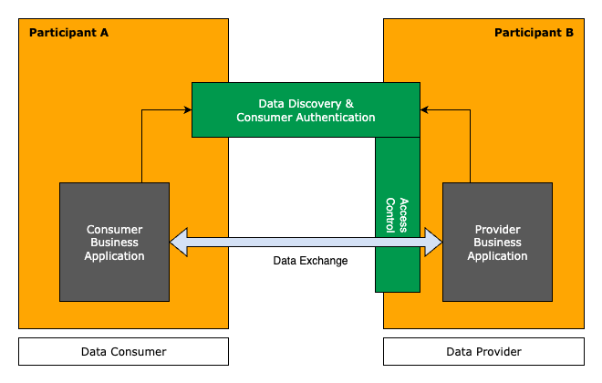

The Connector KIT describes the basic infrastructure to be used for cross-enterprise data exchange. The infrastructure
is based on [Dataspaces][idsa-url] and [Self-Sovereign Identity][self-sovereign-identity-url] as basic mechanisms to
achieve the targeted goals.

The technology described by this KIT is generally applicable for the described use cases. Throughout the KIT, examples
are shown from Catena-X as one implementing dataspace using the technology.

## Vision & Mission

### Vision

Sharing data along a supply chain adds great value for every participant. A wide range of use cases support efficiency
in engineering, production and logistics. A prerequisite of the support of the transfer use cases is trust between the
involved partners and a clear scope on which data is transfered and under which conditions it can be used. The
technologies described in the Connector KIT provide exactly that framework that allows trustworthy exchange within a supply chain.

### Mission

Data transfer between companies needs trust. But what exactly does trust mean? From a data provider side, it requires
that data is only given to authenticated consumers under defined conditions for the usage of the data. From a
consumer side, the data used has to be trustworthy, i.e., the source of the data is trusted and the semantics of the
data transferred is defined. For both sides, it is important to allow easy integration into existing IT landscapes
and the usage of a wide variety of technologies to meet the diverse transfer needs.

Although there are established solutions on the internet for transferring and streaming data, the chosen dataspace
technology provides features that exceed the capabilities of those solutions, as will be described in the upcoming
sections.

The mission of the Connector KIT is to provide all necessary information and technology references to perform
trustful data exchange within a dataspace. It bundles the interaction patterns, relevant standards, APIs, and
reference implementations for developers. The green boxes in the diagram below show what is in scope of this KIT.

## Important terms and definitions

Before going into details, some basic terms need to be described as they are used throughout the KIT.

- Dataspace: The overall term for the principles with which data transfer is organized within an ecosystem. The
  technical details of those principles are the scope of this KIT. It is based on concepts developed by the
  [IDSA][idsa-url].
- Data Provider: A data provider is a company, that owns data and offers that data to others.
- Data Consumer: A data consumer is a company, that consumes data offered by a data provider.
- Dataspace participant: A company acting as data provider or data consumer or both.
- Connector: Is the common term for a technical component that is formally named (dataspace) participant agent, see
  [DSP][dsp-url] for reference. It provides central features needed to act as data provider or consumer within a
  dataspace.

## Basic values and principles

The data exchange in dataspaces based on the technologies of this KIT follows a set of values and derived principles
that drive the interaction patterns. In detail, they are:

- Decentralization: The data transfer from a data provider to a consumer is a peer-to-peer activity which does not
  require the involvement of third parties like a central authority. This comes with two major goals:
  - The data transfer cannot be observed outside of the two acting companies, especially the data is directly
    transfered between the two parties.
  - Data transfer activities are not blocked by outages of central services.
- Scalability: Efforts from an individual dataspace participant to maintain connections to relevant participants as
  well as the overall effort to support a dataspace with a virtually unlimited number of participants are both within
  reasonable limits.
- Data Sovereignty: Data providers have full control over who has access to the offered data and under which conditions
  the data may be used. Data consumers have full knowledge over the conditions, resp. policies under which data is
  available before committing to use an offer. The data transfer is preceded by a formal acceptance of the conditions
  of the transfer by both parties.
- Interoperability: The data transfer is standardized in a way, that allows a data consumer to identify
  - which type of data is offered and what to expect semantically as content of the data,
  - how the data is transfered, i.e., which protocols resp. which APIs to use for accessing it,
  - under which conditions the data can be used.

## Basic Concepts used for Dataspace Connectivity

The technologies described by this KIT achieves the targeted goals by providing the concept of a connector that
implements standardized protocols and assets maintained by the [Eclipse Dataspace Working Group][edwg-url]. These
assets are based on concepts created by the [IDSA][idsa-url] and are in accordance to principles of
[Gaia-X][gaiax-url].

In detail, the relevant assets are:

- [Dataspace Protocol (DSP)][dsp-url]: The DSP is a specified protocol for the interaction of a data consumer with a
  data provider in order to find data offerings, get access to the data and managing the data transfer. In the context
  of this KIT, the protocol is used with its HTTP binding, i.e., the requests and responses defined in the DSP are
  translated to REST API endpoints.

- Identity: The DSP requires trustworthy identities for dataspace participants. For the interaction between
  participants, the connector uses [*Decentralized Identifiers*][did-url] (DID). A DID is a globally unique identifier
  that is associated with a participant. As a paticipant can have more than one DID a dedicated DID is required for
  interacting in a defined dataspace.

  Within this KIT the [WEB-DID][did-web-url] method is used which allows the associated company to publish metadata,
  like service endpoints or public keys in a DID document. The DID document can be accessed simply through knowledge
  of the DID. DIDs, and especially the availability of required metadata in the DID document enable the targeted
  dentralization goal.

  > **Catena-X:** In Catena-X, there is another relevant identifier used to identify a dataspace participant. With
  the *Business Partner Number* (BPNL), a globally unique and legally binding identifier is used, that is persistent,
  i.e., that can be used to store contract relevant data indefinitely. The identifier is also used to express
  conditions for data transfers like visibility of data offers or limitations concerning consumption.

- Verifiable Credentials: Verifiable Credentials (VCs) are the digital equivalent to physical, printed and signed
  certificates. They proof in a tamper-resistant way a set of claims to be valid for the holder as attested by the
  issuer of the VC. In a dataspace, VCs are used to provide proof aspects like membership in a dataspace or more
  general, an authority approved identity of a participant.

  > **Catena-X:** In Catena-X three different VCs are created for each participant: one attesting the membership
  in the Catena-X dataspace, one for the identity of a dataspace participant by providing a claim that associates the
  BPNL to the holder of the VC, and attesting the acceptance of the framework agreement stating general terms and
  conditions for data transfers.

- [Self-Sovereign Identity (SSI)][self-sovereign-identity-url]: SSI is an approach to digital identity that gives
  the owner of the identity control over the information used to prove this identity to services and applications
  across the web. It makes use of *Verifiable Credentials* which are stored in an owned wallet and provided directly to
  the data provider in authentication scenarios proving the identity without involving any third party. The data
  provider can verify the authenticity of the request by checking the validity through a trusted signature used
  by the VCs issuer during creation.

  The following diagram shows the general interaction pattern of a SSI solution.

- [Decentralized Claims Protocol (DCP)][dcp-url]: The protocol used for exchanging verifiable credentials in a
  dataspace supported by this KIT. It allows a provider's connector to access the consumer's wallet to retrieve
  relevant verifiable credentials. This is needed to authenticate the consumer, i.e., to enable the provider to
  identify the consumer and to check prerequisites necessary to grant access to the offered data.

- Policies: A data offering by a data provider always comes with a contract proposal, i.e., a set of conditions under
  which the data can be accessed. These conditions are expressed in the form of
  [*Open Digital Rights Language* (ODRL)][odrl-url] policies. See the extra page on [policies][policy-url] for a deeper
  insight into how policies are used within a dataspace

  > **Catena-X:** In Catena-X, there is a formal specification of a set of policy constraints which provide the legal
  definition to clarify the meaning of the constraint when used in a data transfer contract. A contract in Catena-X
  is a legally binding contract that is build out of the general terms and conditions, or precise the Framework
  Agreement and a set of text fragments which represent the policy constraints chosen for the concrete contract
  instance.

- Discovery: Based on the DID of a data provider, dataspaces supported by this KIT use a decentral discovery
  mechanism that allows to identify connector services in order to initiate data transfer use cases. The discovery
  mechanism uses the DID document to provide information on connector endpoints in a decentral manner.

The described technologies are complete to initiate and conduct data transfers. The only prerequisite is knowledge of
the data provider's identifier. A dataspace has to define additional means to find these identities based, e.g., on
the name of a targeted company.

> **Catena-X:** In Catena-X, in addition to the DID, typically also the BPNL is required. In the service map defined
by Catena-X, there are additional mechanisms defined that allow to retrieve identifiers from different source data,
e.g. the name of a company. These mechanisms are out-of-scope for the Connector KIT. Check the
[business partner KIT][bpdm-url] for further information.

### Reasoning of the usage of the dataspace concept

There are established interaction patterns in the internet, which have already proven their applicability in many
different use cases of typical interactions. An important technology in this regard is OAuth2 which is the de-facto
standard for authentication and authorization. Not sticking to such well-established standards, but instead using a
new technology for data transfer scenarios requires solid justification.

The rationale behind the need for using dataspace technology is basically driven from the underlying principles
described above. So let's look at how the dataspace technology supports favorably the achievement of those principles:

#### Decentralization

With the knowledge of the transfer partner's identity, the whole process does only involve peer-to-peer interactions.
This is achieved mainly with the usage of the DID mechanism which allows to publish information on technical systems
involved in the data transfer on the data provider side. Based on this, there is a completely decentral, automatable
mechanism established, that allows data offer discovery, transparent display of data consumption conditions and a
straight forward way of authentication and authorization based on the Self-Sovereign Identity mechanism.

#### Scalability

A major driver of scalability is the decentral nature of data transfer. This prevents bottlenecks or
single-point-of-failures in the system.

Another pillar of scalability is the management of data exchange partners. Common approaches typically require either
a central system, like a central Identity Provider that centralizes identity management, or in a decentral approach
an n:m relationship in managing identities between the partners. I.e., every partner has to exchange in advance and
with every other partner bilaterally information like available service endpoints and access credentials which is a
major effort.

Using the Self-Sovereign Identity mechanism, these efforts are reduced to an one time issuance of the required
*Verifiable Credentials*. Data transfer activities then do not require any authentication information exchange in
advance.

The dataspace technology handles peer-to-peer transactions throughout the whole data transfer. This includes
identification of data offerings, semantics of the data transfer and content, authentication and authorization to
gain access, or the concrete policies under which the data consumer can use the data.

An important aspect of a dataspace as described in this KIT is the fact, that data transfer is an event that is
executed between two legal entities and not dependent on certain users or employees of the different participants. The
contractual background is based on the contracts between the companies and no further specific access right management
is needed, e.g., to maintain concrete users who might access the data. This allows a smoothless interaction over time,
as the involved personnel might change without impacting the transfer connections used.

#### Data Sovereignty

The main vehicle for data sovereignty are the policies associated to a data transfer. They ensure that the terms and
conditions for the usage of the data are clear. As they are part of the authentication process, these conditions
are transparent and from a provider side can be individualized to different partners. This enables maximum control on
the provisioning and the usage of the data.

A second important mechanism is the usage of verifiable credentials. They provide a proof of conditions held by a
consumer as approved by a trusted authority.

Policies support a wide range of terms and conditions. In a simple case, they can express the check of a set of
verifiable credentials to prove the identity of the data consumer. A slightly more complex case is well suited for
supply chains. In such situations, the data transfer is driven by a pre-existing contract about the delivery of real
world goods from a supplier to a customer. This contract typically regulates the data transfer needs, so that the
policy used for the data offers in the connector can simply refer to that contract. More complex cases allow to
express a whole range of constraints that can be used to specify a detailed contract that applies to the data transfer.

#### Interoperability

Interoperability cannot be ensured by the concepts in the scope of this KIT alone. But the described infrastructure
features enable interoperability on use case levels by providing general means to organize the data transfer. These
features support

- finding data offerings,
- understanding the semantics of the transfer protocol used and the data provided,
- agreeing on the policies under which data is available,
- and, finally, gaining access to the data

All these features are provided by the dataspace technology out-of-the-box.

Important to note is, that the applied pattern for initiating data transfers is applicable to a whole range of
different technologies. E.g., it is possible to use standard REST API access control using tokens. In this case the end
result can not be distinguished from the way OAuth2 handles the access to a resource server.

But the connector can also handle other ways of interaction, like push scenarios, where data is actively pushed from the
provider to the consumer in a one time fashion or as a stream of data. The technical means, like a cloud storage or a
technology to receive a constant stream of information has to be provided, but the overall mechanism to get access and
to manage the data transfer is standardized within the mechanisms of the Dataspace Protocol.

## Use Case

The connector framework is basically an enabler for all kinds of use cases. By supporting different transfer
technologies, there is no real limit concerning the support of different transfer requirements. The gain is a
reliable framework that ensures the principles targeted at by dataspaces supported by this KIT.

> **Catena-X:** That is the reason why all use cases defined by Catena-X are required to use the connector technology
in order to facilitate the data exchange scenarios of the use case.

## Business Architecture

The dataspace protocol suggests a *Connector*, which implements the state machines and interactions patterns
specified in the protocol. The dataspace protocol specification separates the dataspace functionality into two
distinguished concepts the *Control Plane*, which is a static component implementation of the specified protocol
interactions, and a *Data Plane*, which is more a virtual concept and describes the concrete data transfer using
a suitable protocol for the type of data involved. Typical transfer types are standard HTTP Rest API access,
transferring binary large objects, or continuous data streaming. Each of those is represented by a service
implementation that has to fulfil technical requirements to be usable as a Data Plane in a dataspace. More details
on this are described in the [architecture description][dev-view-url] within the software-development view.

The Dataspace Protocol defines three levels of interaction within the Control Plane to fulfil the above described
functionalities:

1. Catalog Request:
   The catalog request provides to the consumer a list of available data offerings. The catalog thereby is a
   [DCAT catalog][dcat-url] that provides a list of so-called *Datasets*. A dataset describes a concrete data offer
   with relevant metadata, like the type of data, transfer technology, api type and the *Usage Policy* also known as
   *Contract Policy* under which the data is offered for usage. The dataset provides a starting point to initiate
   the contract negotiation.

   The catalog only contains data offers which are accessible by the requesting data consumer. When defining data
   offers, the data provider in addition to the usage policy has to define an *Access Policy*, which is basically a
   filter applied by the provider connector during the creation of the catalog. The access policy typically limits
   access to a defined dataset, so that only legitimate consumers can see the data offer in the provided catalog.

2. Contract Negotiation:
   Access to a data offer is provided via a contract, which is basically an agreed upon usage policy.

   The necessary information needed to start a negotiation is provided in a dataset. This includes the endpoint to
   call for initiating the negotiation and the usage policy that is the contract proposal for the data consumer to
   gain access. Based on this information, a consumer starts the contract negotiation process by calling the
   corresponding endpoint. In DSP, this is an asynchronous process.

   > **Catena-X:** In Catena-X, the usage policy in a dataset has to be used literally when initiating a contract
   negotiation. As of today, DSP features concerning policy negotiation are disabled and the consumer only has the
   choice to accept the proposed usage policy or to not negotiate for the offer.

3. Transfer Process:
   When the contract is agreed, the data is accessible. To initiate the data transfer, the consumer has to create a
   transfer process. The main purpose of the transfer process is to provide access information, so that the data
   transfer can actually be executed. For that, it has to be distinguished between *Pull* and *Push* transfers.

   - In a pull transfer, the consumer is the active part, i.e., he is initiating a request and receives the data as
     response. The typical example for this is using a REST API. In this case, initiating a transfer process results
     in the return of a data structure called Endpoint Data Reference (EDR). It contains all necessary information to
     access the intended resource server, i.e., the endpoint url and the necessary access token. In the Tractus-X
     connector, the EDR contains refresh information, i.e., the endpoint url and the refresh token to renew the
     access token if expired.

   - In a push transfer, initiating the transfer ends with the provider to be actively pushing data to a consumer
     owned data sink. This can be a cloud storage service or a REST API to which data is send via, e.g., a post request.
     To enable the provider to send the data, the access information, i.e., the endpoint url of the sink and the access
     credentials have to be provided by the consumer in the transfer process request.

After the transfer process is started, the data plane is responsible for the data transfer, i.e., it mediates between
the consuming service and the providing service to get the data transfered. The data plane is a transfer technology
specific implementation that connects an existing technology to the concepts of the dataspace concept. The technology
specific information on data endpoints used and access information needed are part of the transfer process creation.

### Definition of central terms used within the described processes

#### Contract Definition

A *Contract Definition* is the data offer as it is managed by a data provider. The contract definition has three major
parts:

- The technical data source that provides the data, often called *Asset*. This consists of a description of the type
  of data, e.g., the data model with a version indicator, the way to access the data, e.g., a REST API reference or
  an object reference to push to a cloud storage, and additional metadata that is needed by a consumer to identify
  the type of data and the way to access it technically.
- The usage policy that specifies the conditions under which the data can be used.
- For internal usage, the contract definition refers to an access policy. The access policy specifies the visibility
  of the contract definition, i.e., the conditions that have to be met to provide the definition in a catalog
  requested by a certain data consumer.

#### Contract Offer

The *Contract Offer* is a representation of the [contract definition](#contract-definition) for a specific consumer
and serves as basis for a particular contract negotiation. It is created in a catalog request by the data provider.
The data provider iterates over all contract definitions, checks the visibility by applying the access policy, and,
if applicable, creates the contract offer, by instantiating the definition to an unique one time offer, that a consumer
can negotiate for. The contract offer is represented as a *Dataset* in the catalog following the [DCAT][dcat-url]
specification.

#### Catalog

A *Catalog* is an aggregation of contract offer objects expressed as [DCAT][dcat-url] datasets. It is the result of a
catalog request and lists all offers a particular data consumer is able to negotiate for.

#### Contract Negotiation

A *Contract Negotiation* is the process in which a contract offer requested by a data consumer for negotiation is
transformed into a contract agreement that is the confirmed contract between the two parties. This process is inherently
asynchronous. It is built by a state machine which is passed through during the process.

#### Contract Agreement

A *Contract Agreement* represents the agreed-upon terms of access of offered data between the data provider and the
data consumer. Contract agreements are long living objects, the typical validity period of a contract agreement is
one year and it can be used as often as necessary during that time frame.

#### Transfer Process

After a successful contract agreement, a *Transfer Process* can be started from the consumer connector to initiate a
data transfer based on a contract agreement. A transfer process is represented by a state machine as well. Once started
it can be used multiple times to execute a transfer of data from provider to consumer. It can be terminated manually or
automatically, depending on the transfer type and aspects like expiry of access information. Transfer processes can be
started as long as a contract assigment has not expired.

The transfer process carries access information between consumer and provider. Depending on the direction of the data
transfer, push or pull, access credentials, like tokens need to be sent, so that the active part can transfer the
data from the data source to the data sink.

#### Reference Implementation

Eclipse Tractus-X provides a reference implementation of a connector in the repository
[tractusx-edc][tractusx-edc-url]. The reference implementation provides a full fledged implementation of the
described features and principles, ready to be used in productive environments. The implementation is based on the
[Eclipse Dataspace Components connector][edc-url] implementation, which is by itself a reference implementation for
the specifications provided by the [EDWG][edwg-url].

The reference implementation offers a non-standardized API for a dataspace participant to manage the operated
connector. More information on how the reference implementation can be used in your environment are given in the
[development-view][dev-view-url].

### Contract Definition Design

An important aspect for an efficient usage of the dataspace technology is the design of contract definitions. Due to
the longevity of contract agreements and the overhead implied by catalog requests and contract negotiations, it makes
sense to create data offers which provide not only one data point. In general, it should not be necessary to
negotiate for the same type of data more than once.

The aspect of contract definition design is discussed in an [extra page][asset-url] of the adoption view.

### Discovery of Connectors

Catena-X provides a decentral discovery mechanism where all offered connector endpoints are contained in a
participant's DID document. A DID document is public and can be accessed by anyone who has knowledge of the
corresponding DID.

## Additional Resources

### Tutorial & Whitepapers

- There is a extensive tutorial on setting up and using an EDC in the context of the Catena-X dataspace in the
  [Tutorials][tutorial-url] section of this website.

### Relevant Catena-X Standards

The Connector KIT describes in a general way the principles which are followed, e.g. in the Catena-X dataspace. The
technology described together with the reference implmentation fulfill the requirements as imposed by the
[Catena-X Standards][cx-standards-url]. Every data consumer and provider in Catena-X is required to comply with these
standards. Relevant standards are:

- [CX-0018 Eclipse Data Space Connector (EDC)][cx-standards-url]
- [CX-0049 DID Document Schema][cx-standards-url]
- [CX-0050 Catenea-X Specific Credential][cx-standards-url]
- [CX-0152 Policy Constraints For Data Exchange][cx-standards-url]

## Notice

This work is licensed under the [CC-BY-4.0](https://creativecommons.org/licenses/by/4.0/legalcode).

- SPDX-License-Identifier: CC-BY-4.0
- SPDX-FileCopyrightText: 2024 Contributors of the Eclipse Foundation
- SPDX-FileCopyrightText: 2025 Cofinity-X GmbH
- Source URL: [https://github.com/eclipse-tractusx/eclipse-tractusx.github.io/blob/main/docs-kits/kits/connector-kit/adoption-view/adoption-view.md](https://github.com/eclipse-tractusx/eclipse-tractusx.github.io/blob/main/docs-kits/kits/connector-kit/adoption-view/adoption-view.md)
- Images: [https://github.com/eclipse-tractusx/eclipse-tractusx.github.io/blob/main/docs-kits/kits/connector-kit/adoption-view/assets](https://github.com/eclipse-tractusx/eclipse-tractusx.github.io/blob/main/docs-kits/kits/connector-kit/adoption-view/assets)

[asset-url]: asset-design.md

[bpdm-url]: https://eclipse-tractusx.github.io/docs-kits/next/kits/business-partner-kit/adoption-view

[cx-standards-url]: https://catenax-ev.github.io/docs/standards/overview

[dcat-url]: https://www.w3.org/TR/vocab-dcat-3

[dcp-url]: https://github.com/eclipse-dataspace-dcp/decentralized-claims-protocol

[dev-view-url]: ../software-development-view/architecture.md

[dsp-url]: https://github.com/eclipse-dataspace-protocol-base/DataspaceProtocol

[did-url]: https://www.w3.org/TR/did-1.0

[did-web-url]: https://w3c-ccg.github.io/did-method-web

[edc-url]: https://eclipse-edc.github.io

[edwg-url]: https://dataspace.eclipse.org

[gaiax-url]: https://www.data-infrastructure.eu/GAIAX/Navigation/EN/Home/home.html

[idsa-url]: https://internationaldataspaces.org/

[odrl-url]: https://www.w3.org/TR/odrl-model

[policy-url]: policies-in-catena.md

[self-sovereign-identity-url]: https://en.wikipedia.org/wiki/Self-sovereign_identity

[tractusx-edc-url]: https://github.com/eclipse-tractusx/tractusx-edc

[tutorial-url]: https://eclipse-tractusx.github.io/docs/tutorials/e2e
