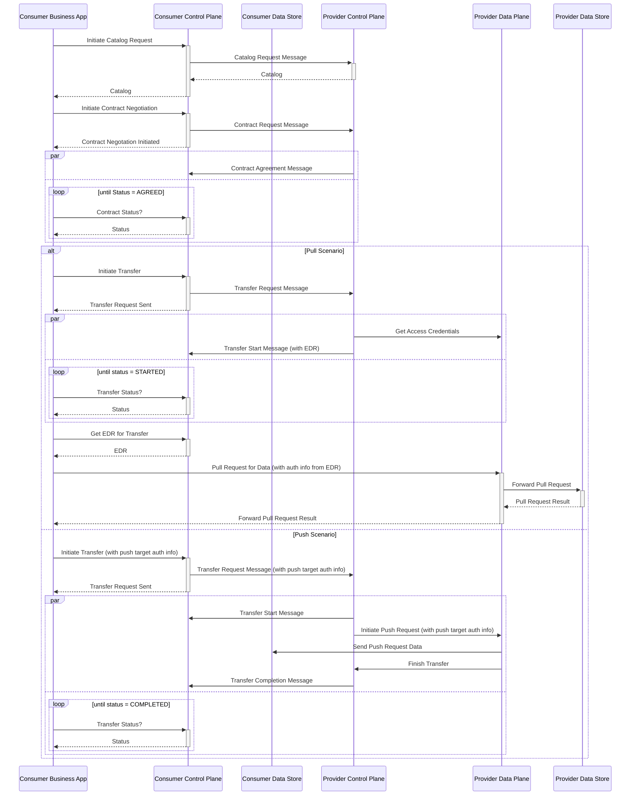

## Overview

The dataspace protocol suggests a *Connector*, which implements the state machines and interactions patterns
specified in the protocol. The protocol suggests the separation into two distinguished concepts the *Control Plane*,
which implements the protocol interactions, basically implementing the connector, and a *Data Plane*, which is a
virtual concept that realizes the data transfer with a specific transfer protocol. The control plane as such is a
static concept which can be implemented and used in multiple transfer scenarios. The data plane is a general name
for any technology used to execute the transfer of data. It is provided in multiple facets in order to implement
different data transfer types, like standard http rest api access, transferring binary large objects, or
continuous data streaming.

Note: There is a specific concept called *Dataplane Signalling* [][] which is a basic api that defines the necessary
interactions between the control and the data plane. Each data plane following this concept has to implement this api
in order to have a standardized information exchange. Currently, Dataplane Signalling is a specification derived in the
[Eclipse Dataspace Components project][edc-url], but it is a candidate for further specification in the
[Eclipse Dataspace Working Group][edwg-url].

The following sequence diagram shows the general interaction patterns of the control plane and data plane, explained afterwards in more detail.



The general interaction pattern is driven by the Dataspace Protocol which defines three levels of interaction:

1. Catalog Request:
   The catalog request provides to the consumer a list of available data offerings. The catalog thereby is a
   [DCAT catalog][dcat-url] that provides a list of *Datasets* which again provides at least one *Distribution* object
   representing a specific transfer technology usable to retrieve the data.

   The catalog request is synchronous and returns with the catalog in the response.

2. Contract Negotiation:
   Access to a data offer is provided via a contract, which is basically an agreed upon usage policy.

   A contract negotiation is an asynchronous process, initiated by a data consumer using a *Contract Request* message.
   The request is processed by the data provider connector and later by the data consumer connector. The process
   terminates when both connectors reach the state *Verified* which shows a successful negotiation process or reach
   the state *Terminated* which indicates issues and the contract negotiation failed. After the contract has reached
   state *Verified*, the contract is established and *Transfer Processes can be initiated.

   The necessary information needed to start a negotiation is provided in a dataset. This includes the endpoint to
   call for initiating the negotiation and the usage policy that is the contract proposal for the data consumer to
   gain access. Based on this information, a consumer starts the contract negotiation process by calling the
   corresponding endpoint.

   >> **Catena-X**: In Catena-X, the usage policy in a dataset has to be used literally when initiating a contract
   negotiation.

3. Transfer Process:
   To initiate a transfer, a *Transfer Process* needs to be created. Again, this is an asynchronous process that is
   started by a *Transfer Request* message sent by the consumer connector. The provider connector answers with a
   *Transfer Start* message, which synchronizes the transfer process state so that both connectors see the process
   in status *Started*. Depending on the transfer direction, one of the exchanged message is used to transfer the
   access information, so that the active part can transfer the data to the correct sink.

   A transfer process can be suspended or completed which is represented by a corresponding state. In case of an error
   the state is transitioned to state *Terminated*. A suspended transfer process can be resumed, during suspension, no
   access to the data is possible.

   Push transfers are by default a one time transfer, i.e., a transfer process is initiated, the provider pushes
   the contracted data to the sink and completes the transfer process. An additional transfer mechanism available
   in the latest release is a non-finite push, i.e., the transfer process is not terminated and the provider sends
   new data elements as soon as they are created until the process is stopped manually or by expiry of the access
   information.

After the transfer process is started, the data plane is responsible for the data transfer, i.e., it mediates between
the consuming service and the providing service to get the data transfered. The data plane is a transfer technology
specific implementation that connects an existing technology to the concepts of the dataspace concept. The technology
specific information on data endpoints used and access information needed are part of the transfer process creation.

### Interaction Overview

The following figure shows the involved services and the basic interaction between the services in this case in a Pull
scenario.


The figure shows the interaction between a consumer *Participant A* and a provider *Participant B*. In the following,
the different interactions are described in detail.

The first interaction is done on the provider side, by preparing the data and creating the contract definition to
offer the data to potential consumers.

- P1: Manage the data offers and policies. Build contract definitions by combining offered data with an usage and an
  access policy.

- P2: Provide the data according to the offered contract definitions and in the transfer type technology used, e.g.,
  operate a resource server like a *Digital Twin Registry*.

With these steps, data is available and offered in a way that it can be found by consumers and access can be
negotiated. The *Provider Business Application* is a service that allows to manage provided data, e.g., manually or
for larger setups, by automation of translating data created in an internal IT system into the required data structures.

The data transfer is initiated at the consumer. If the consumer does not have the necessary details, to initiate the
transfer, he has to check some centrally operated services (step R1), that provide him with the necessary identifiers
to initiate the decentral data transfer.

>> **Catena-X**: In the case of Catena-X the identifiers are the BPNL and the DID. The *Central Participant Management*
is provided by a service called *BDRS* (BPN-DID Resolution Service). It is implemented in a way that it is impossible
to track the concrete interest in a company. In case of the BDRS this is ensured by returning a list of all known mappings
between BPNLs and DIDs. It is a local mechanism in the consumer connector to identify the concrete mapping needed in a
certain situation. In addition, in Catena-X the *Business Partner Data Management* (BPDM) provides a management
infrastructure, that allows to search for companies by name and other properties in order to retrieve a BPNL which builds
the basis for interactions in the dataspace.

Based on the identifiers, the data transfer can be negotiated. This is done with the following steps:

- N1: The *Consumer Business Application* executes a request as defined in the Dataspace Protocol to be executed by the
  *Control Plane* of the consumer connector.

- N2: The *Control Plane* resolves the provider's DID to access the corresponding DID document. Since Catena-X uses
  the [DID:WEB][did-web-url] method, the control plane uses the URL in the DID to identify the endpoint at which the
  DID document is hosted.

  The DID document contains a *service* section which contains references to connector endpoints which are used in
  subsequent steps of the interaction.

  The whole step can be omited if the DID document and correspondingly the endpoints are already known to the consumer.

- N3: To initiate a DSP request, the consumer *Control Plane* has to provide an access token, that allows the
  providers *Control Plane* to retrieve verifiable credentials in order to check whether the request is valid and all
  prerequisites are met. This token is provided by the consumer's *Wallet*.

- N4: The consumer *Control Plane* executes the intended DSP request by calling the corresponding DSP endpoint at the
  provider *Control Plane*. With the request, the consumer sends the token retrieved in step N3.

  Depending on connector implementations involved, there might be the need to identify the DSP protocol version to be
  used by the interaction. For that, the consumer typically has to identify the version supported by the provider
  connector and then to use the latest version supported on both sides.

- N5: The provider *Control Plane* retrieves the verifiable presentation (containing the relevant verifiable
  credentials) necessary to validate the legitimacy of the request by calling the consumer's *Wallet* of the consumer
  using the token created in step N3. The control plane gets access to the credentials and checks their validity. In
  addition, the control plane checks whether all other conditions like further policy constraints are met and if
  successful executes the request and provides an appropriate response to the consumer control plane.

The steps N1 to N5 are bascially the same for every DSP call, be it to request the catalog, to initiate a contract
negotiation or to start of a transfer request. The *Consumer Business Application* executes the required DSP requests
in the appropriate order basing the next request on data received in the previous request. In the day-to-day business
situations, the dominating action on DSP level is the management of transfer requests, as the catalog retrieval and
the contract negotiation are only necessary, if access to a new data offering is required. If the concept is applied
efficiently, such requests are the exception, as most data can be retrieved using existing contracts.

The final step is the concrete data transfer, after the *Transfer Process* is started. The figure shows the standard
pull case, where the *Consumer Business Application* has received an access token which is used to access the
provided resource. In the current setup, the access is controlled by the *Data Plane* of the provider, i.e., the data
plane service acts as a proxy that receives the request (step T1) and forwards it to the actual *Data Source* (step
T2). On the way back, the data is again forwarded by the *Data Plane* to the calling *Business Application*.

In the push case, the transfer is immediately executed when a *Transfer Process* is started on DSP level. The
*Control Plane* of the provider initiates the data transfer by providing the request to the *Data Plane*. The Data
Plane uses the given access information to copy the requested data object from the data source to the consumer given
data sink. In the finite case, it terminates the *Transfer Process*. The new infinite push transfer keeps the
*Transfer Process* open and, initiated by the availability of new data, executes another push of the new data object
to the consumer provided data sink.

### Discovery of Connectors

The discovery of connectors is organized in a decentral manner. It is executed in step N2 above by retrieving the DID
document of the provider. A DID document is public and can be accessed by anyone who has knowledge of the corresponding
DID.

The DID document has the following structure. For the discovery, the *service* section is relevant, as it contains one
or multiple *DataService* entries that point to a specific endpoint of a connector. As the connector described in this
KIT supports in general multiple versions, this feature of the DSP spec has been selected to be used for discovery. An
entry has this structure:

```json
{
  ...
  "service": [
    {
      "@context": [
        "https://w3id.org/dspace/2025/1/context.jsonld",
        "https://www.w3.org/ns/did/v1"
      ],
      "type": "DataService",
      "serviceEndpoint": "https://subdomain.provider-domain.com/subpath/.well-known/dspace-version",
      "id": "did:web:provider-domain.com#dsp-agent-1"
    },
    ...
  ],
  ...
}
```

The referenced endpoint is actually pointing to a specific version metadata endpoint in a connector that provides
information on supported DSP versions. As for backward compatibility, a connector must be capable to communicate with
multiple version of the DSP. Accessing this version metadata endpoint allows the consumer connector to determine the
supported DSP versions as mentioned in step N4 above. Based on this information the connector can decide on the version
to be used for the interaction with the provider connector.

An implicaton that comes with this version management is that a connector has to provide a certain DSP protocol version
as separate subtree of its REST API endpoint tree.

With the information retrieved from the version metadata endpoint, the consumer can build the final endpoint address
to execute a DSP request, e.g., a catalog request.

## Notice

This work is licensed under the [CC-BY-4.0](https://creativecommons.org/licenses/by/4.0/legalcode).

- SPDX-License-Identifier: CC-BY-4.0
- SPDX-FileCopyrightText: 2024 Contributors of the Eclipse Foundation
- SPDX-FileCopyrightText: 2025 Cofinity-X GmbH
- Source
  URL: [https://github.com/eclipse-tractusx/eclipse-tractusx.github.io](https://github.com/eclipse-tractusx/eclipse-tractusx.github.io)
