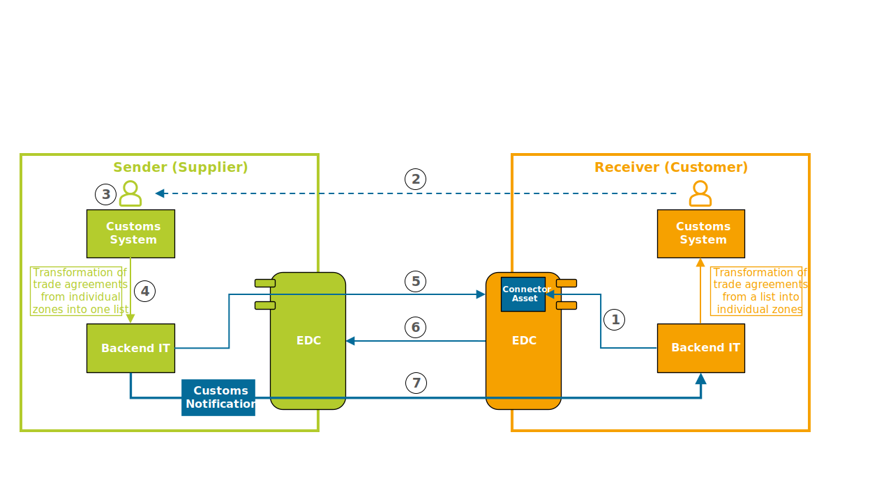
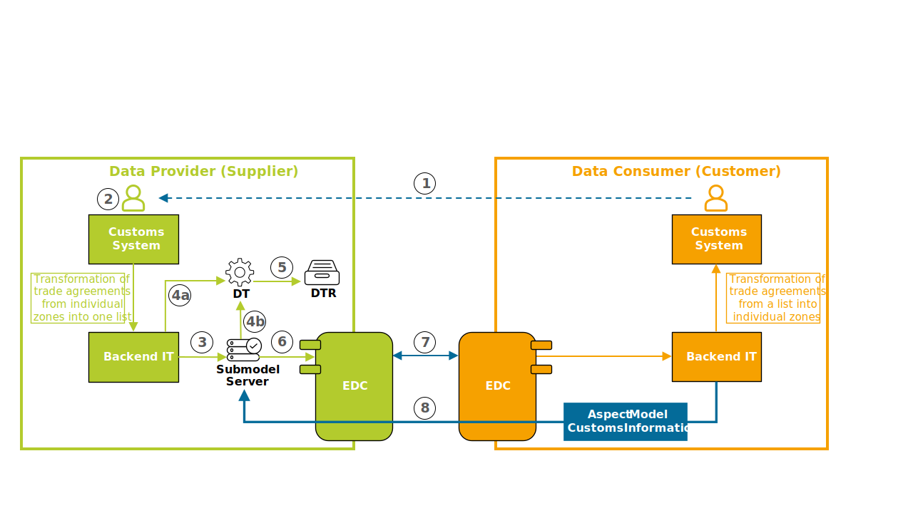

## Vision & Mission

### Vision

The transport path of parts, batches or vehicles includes the terms of customs. Goods that are given preference at customs, receive preferential tariff rates, which are generally lower or even zero. Therefore, a long-term supplier's declaration for the goods is necessary. By defining a standardized data model for this long-term supplier's declarations, exchanging customs data and in the long run calculating the preference status becomes consistent. By standardizing and digitalizing the data exchange, the Customs KIT defines the basis of a more efficient customs process and finally ensures a robust calculation result.

### Mission

The foundation of the industry core is used and combined with elements of the Customs KIT to ensure that all relevant customs information like origin information, trade relations and contact information are considered. Key value of transferring customs information is to obtain the long-term supplier's declaration. The Customs KIT describes two ways of exchanging customs information. The pull of customs information by using digital twins based on the industry core and push of customs information by using the standardized message-based data exchange within Catena-X. With this customs information it is possible to determine the preference status, the basis to decide on the customs preferences. The overall objective of the following definition is the reduction of non-digital data exchange in the process of obtaining the long-term supplier's declaration. By standardizing the data exchange within the customs process the Customs KIT contributes to enlarge the digital way of representing the value chain of parts, batches and vehicles.

## Today’s Challenge & Business Value

### Today’s Challenge

A challenging process is necessary to fulfill the requirements of customs preferences. In some areas data exchange still takes place in non-digital form, by sending physical documents. The resulting manual and redundant data entry as well as transfer in the respective portals by suppliers and customers is extremely time-consuming and increases the risk of input errors. To avoid this costly process, some companies even ignore potential customs preferences. In most cases, there is no standardized interface available, that’s why proprietary interfaces are used instead, which makes interoperability between different systems much more difficult.

### Business Value

Establishing a standardized interface between all tier levels is crucial to achieve interoperability and compatibility between different systems and applications. To enlarge the digital data exchange, a consistent format is used that works both in push and in pull mode. This is realized via a standardized data model and the use of digital twins and EDCs (Eclipse Data Connectors) as a mandatory technical component for secure data exchange in a Catena-X network. By reducing manual effort for suppliers and customers and applying a consistent preference calculation, efficiency increases. A standardized approach furthermore leads to a full utilization of tariff reduction or exemption under free trade and preference agreements, which can result in significant competitive advantages.

## Use Case

In a preference agreement, customs privileges (preferences) are agreed upon. This means that an import into a country with such an agreement has been concluded can be customs-free or at least customs-reduced. However, the goods must meet certain origin rules that are specified in the preference agreement. For evaluating the preference status, companies are creating a preference calculation. This is a central calculation method to determine whether exported goods have the right for a preference (preference entitlement). The aim of doing a preference calculation is tariff reduction or exemption in the receiving country within the scope of free trade and preference agreements. Depending on the customs rate, the preferential origin can lead to a competitive advantage, as higher sales prices can be offset in this way. In addition, foreign customers often require preferential origin.

To demonstrate that the goods meet these origin rules, the proof of preferential origin must be presented during the import. A proof is provided by a supplier's declaration. This is a declaration in which a supplier makes statements regarding the preferential origin of the goods supplied. In a supplier's declaration for goods with preferential origin status the preferential origin country of the goods must be certified. This certificate guarantees a recipient the origin of a product in accordance with a specific preference rule and serves as the only possible evidence for an exporter to apply for or issue a proof of preferential origin. Supplier's declarations for a single consignment of goods are also called individual supplier's declarations. Long-term supplier's declarations, on the other hand, are one-time declarations that are valid for deliveries over a longer period. They therefore cover consignments of similar goods over a certain period. The requirement for issuing a long-term supplier's declarations is that the origin of the goods is secured during the entire period of validity.

Every company divides the trade agreements into different and individual zones. To standardize the customs information this classification is resolved in the aspect model “customsInformation” and consolidated into a single piece of information. After receiving the data, the consumer must do an individual transformation to assign the trade agreements back to the self-defined zones.

## Data exchange of customs information

### Push of customs notification

1. The receiver (customer) must provide a connector asset for notifications in the Eclipse Data Connector (EDC).
2. The receiver (customer) sends a request to the sender (supplier) with a list of part numbers to ask for preference master data.
  a. Proceeding as usual by email, post, etc.
  b. Using a “request notification” based on the Notification API
3. The sender (supplier) accepts the request depending on the type of the transmission of the request.
4. The sender (supplier) creates a customs notification to send preference information.
5. The sender (supplier) initiates a contract negotiation to get a contract agreement.
6. A contract negotiation takes place between the sender (supplier) and the receiver (customer) by using their Eclipse Data Connectors (EDC).
7. After a successful contract negotiation, the sender (supplier) sends the customs notification via a HTTP POST request to the receiver (customer) via the dataplane endpoint from the contract agreement.



### Pull of customs information

1. The Data Consumer (customer) sends a request to the Data Provider (supplier) with a list of part numbers to ask for preference master data.
  a. Proceeding as usual by email, post, etc.
  b. Using a “request notification” based on the Notification API
2. The Data Provider (supplier) accepts the request depending on the type of the transmission of the request.
3. The Data Provider (supplier) creates an aspect model “customsInformation” and saves it at the Submodel Server if it does not already exist.
4. The Data Provider (supplier) creates a digital twin for each requested part if it does not already exist (a) and adds the Submodel Descriptor for the created aspect model to the digital twin (b).
5. The Data Provider (supplier) registers a new created digital twin to the decentral twin registry (DTR).
6. The Data Provider (supplier) creates a contract definition consisting of the asset and policy and takes it to the Eclipse Data Connector (EDC).
7. The Data Consumer (customer) initiates a contract negotiation to get a contract agreement. A contract negotiation takes place between the Data Provider (supplier) and the Data Consumer (customer) by using their Eclipse Data Connectors (EDC).
8. After a successful contract negotiation, the Data Consumer (customer) pulls the aspect model “customsInformation” (json) from the Submodel Server of the Data Provider (supplier).



## Signature

When exchanging data, confirmation of the transmitted data is required at a personal level. This means that it must be clearly defined which person has provided this data, which position this person occupies in the company and supplemented by contact information such as telephone number and email. Confirmation can be provided in different ways, for example by authorizing a user account for a portal with a user and password or by signing a document when the data is handed over.
In order to fulfil this personal confirmation requirement for data exchange via Catena-X, a digital solution is required that is equivalent to a signature and is accepted by customs authorities. One possibility would be the use of a digital signature. The use case is currently reviewing existing solutions in Catena-X and discussing them with the customs authorities.

## Aspect Model

Aspect models are mostly easy to create by transforming a company's internal data into the target aspect model. Transformations are mostly straightforward in these cases. If necessary, special steps in creating aspect models are mentioned in the corresponding sections.

In the following section, all aspect models that are part of Customs KIT are documented.

### CustomsInformation

CustomsInformation contains all customs-related information for a long-term supplier's declaration for a part. Long-term supplier's declarations (LLE) are one-off declarations that are valid for deliveries over a longer period of time, provided that the delivered goods are expected to have the same origin status.

Aspect model in GitHub:

- [Version 1.0.0](https://github.com/eclipse-tractusx/sldt-semantic-models/blob/main/io.catenax.customs_information/1.0.0/CustomsInformation.ttl)

```json
{
  "catenaXId" : "580d3adf-1981-44a0-a214-13d6ceed9379",
  "customsInformation" : [ {
    "confirmationDate" : "2024-03-27",
    "validFrom" : "2024-03-20",
    "type" : "AnnualRequest",
    "originInformation" : {
      "tradeRelation" : "EU-MX",
      "tracedWorth" : {
        "value" : 300.45,
        "currency" : "EUR"
      },
      "contactInformation" : {
        "contactPerson" : "Max Mustermann",
        "phoneNumber" : "+49 89 123456",
        "email" : "max.mustermann@ziel.de",
        "jobTitle" : "executive position"
      },
      "commercialCountryOfOrigin" : "DE",
      "originOfManufacturing" : {
        "longitude" : 13.214907205727538,
        "latitude" : 59.351212217399095
      },
      "federalState" : "BW",
      "preferredStatus" : "Y-Certified"
    },
    "status" : "Not-Completed"
  } ]
}
```

## Notice

This work is licensed under the [CC-BY-4.0](https://creativecommons.org/licenses/by/4.0/legalcode).

- SPDX-License-Identifier: CC-BY-4.0
- SPDX-FileCopyrightText: 2025, Bayerische Motoren Werke Aktiengesellschaft (BMW AG)
- SPDX-FileCopyrightText: 2025, Mercedes Benz AG
- SPDX-FileCopyrightText: 2025, msg systems AG
- SPDX-FileCopyrightText: 2025, ZF Friedrichshafen AG
- SPDX-FileCopyrightText: 2025, Contributors to the Eclipse Foundation
