## Vision & Mission

### Vision

Our vision is to transition from parts-based quality management on a bilateral level between suppliers and customers, to a data-based approach across the OEM-Tier n value creation chains. This transition aims to enable a network approach for producing and ensuring product quality in a **Live Quality Loop**.

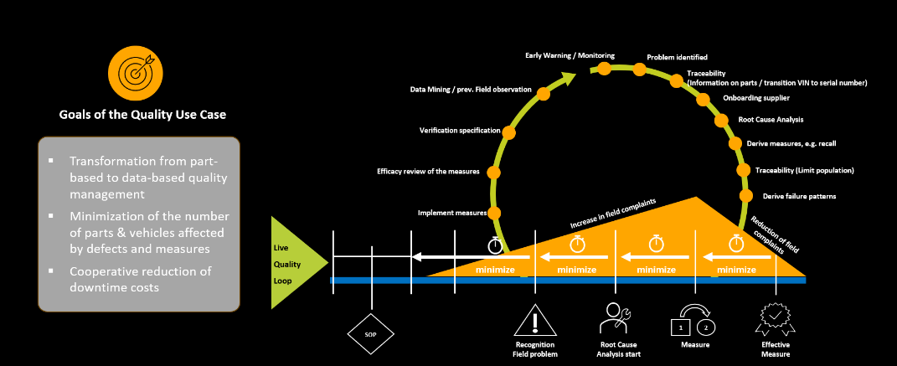

The Quality KIT enables OEM and supplier as **data provider** and **consumer** to exchange and analyze existing data across company boundaries on, e.g., a weekly basis, securely and easily. By merging the OEM's field quality data with the supplier's product information, a new level of transparency is achieved, leading to earlier failure detection, faster cooperation between partners, and accelerated root cause analysis. The goal is to minimize the number of parts and vehicles that require corrective actions.

Additionally, this KIT enables the **quality app provider** to deliver solutions for quality data analysis, including traceability and notification functionalities.

### Mission

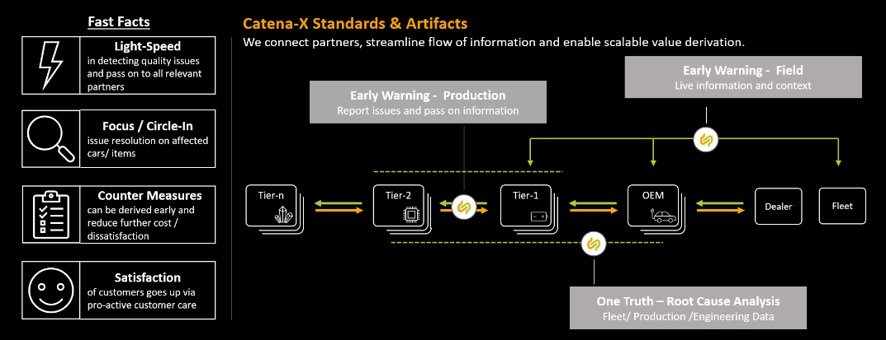
The mission of the Quality KIT is to provide the necessary standards, aspect models, technical data pipeline specifications, and business logics to establish a sovereign exchange of quality-related data along the OEM-Tier n chain. This is based on the following principles:

- We bring together data from suppliers and vehicle manufacturers (often called Original Equipment Manufacturers or in short OEM).
- Data exchange between data provider and consumer complies with the Catena-X network's data sovereignty.
- Data exchange following a standardized pipeline and data models within a data ecosystem enables each partner to use the applications of their choice for data analysis features, like Early Warning and Root Cause Analysis.
- Early Warning Notification enables the partners to exchange information about potential anomalies they detected and to trigger their subsequent joint evaluation.
- Failure Pattern exchange enables the partners to have a common understanding of a specific anomaly. As part of the lessons learned, these patterns help to identify known anomalies more quickly in the field.
- Analysis methods and algorithms that are realized in the quality applications are not part of any standardization. It is desirable that different tools deliver different view angles to support Root Cause hypothesis creation. Therefore, specialization of analysis tools is valuable.

In sum, this KIT enables quality management to significantly **increase speed** in detecting and resolving quality problems and reach a **new level of transparency** and traceability.

### Customer Journey

With the Quality KIT, we support the Catena-X customer journey for our adopters and solution providers. The basis for data-driven quality work is the exchange of data between two Catena-X companies - in most cases  one vehilce manufacturer(OEM) and one supplier. The necessary data is exchanged as files or via http REST interface in JSON format.

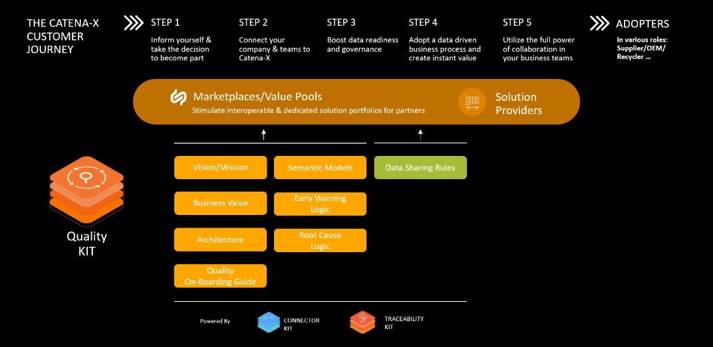

## Business Value

The "Quality-KIT" provides guidelines and standards, such as semantic models and data exchange processes, which help companies create a reliable and sovereign data exchange system with their partners. This reduces cost and effort needed to integrate data-driven quality processes into their operations and IT systems. In addition, every partner company can use only one preferred solution for data-based quality analyses instead of data provider-specific platforms.

Additionally, providers of quality applications can also lower their setup costs and explore new markets by offering specialized analytical tools.

## Use Case

### Status Quo / Today's challenge

In today’s global and complex collaboration models, quality does not emerge as the sum of the quality contributions of the individual partners in the value chain of OEM and suppliers, but through the networking of the partners involved.

The existing conventional bilateral working models do not account for this. There is no operative network in the industry, with a substantial coverage of elements of the value chains, that provides the necessary means for collaborative quality management with all involved partners.

From a Quality Management perspective, the main challenge within the automotive industry is to define and implement inter-organizational end-to-end data chains across the whole automotive partner chain, to empower data-driven quality use cases.

Main challenges to ensure a trustful and scalable cooperation are:

- Trustful and sovereign data exchange mechanism including:
  - Legal contracts and access/usage policy framework along the complete data chain.
  - Standardized data pipeline.
  - Aligned standard data exchange, e.g., file format and transfer.
- Standardized data models.

### Benefits

| Advantages                                                                                        | For OEM | For n-Tier supplier |
|---------------------------------------------------------------------------------------------------|---------|---------------------|
| Availability of daily updated field data for monitoring the own component in real operation       |         |      X              |
| Linking OEM and supplier data for cross-supply chain quality analysis                             |   X     |      X              |
| Reduction of analysis capacities along the automotive value chain by preventive field observation |   X     |      X              |
| Reduction of the NTF (no trouble found) at the customer and supplier                              |   X     |      X              |
| Significant reduction in time to detect an abnormality                                            |   X     |      X              |
| Fulfillment of required response times from authorities                                           |   X     |                     |
| Creation of transparency and options for new warranty models                                      |   X     |      X              |

#### OEM and Tier-1 suppliers

This Quality KIT from Catena-X enables companies to realize trustful and sovereign data exchange among partners, utilizing the data in a cooperative way for Early Warning of unknown/new issues and monitoring the effectiveness of counter measures for known quality issues. Root causes can be analyzed and understood much faster, due to the exact problem scope can be defined more accurately by checking the connected data sets. This leads to an earlier and focused counter measure. In sum, companies can realize economic benefit by reduction of warranty costs, while at the same time increasing end customer satisfaction due to a reduction of products & vehicles involved in quality issues.

#### Small and Medium-sized Enterprises (SME)

The defined standards, like data models and data exchange pipelines, enforce a flexible and low-barrier approach to integrate quality use cases and features according to SME needs. An easy access to analytic capabilities or transparent analytic results from partner companies will lead to an economic benefit from warranty costs reduction, via faster and more focused activities related to problem solving.

#### Solution Provider

Solution providers have the potential to scale customer groups via platform effects and the standardization of data models and their exchange. This additional market potential can be accessed via the marketplace and the shared service network.

##### Example: Benefits of using early warning and root cause analyses in active field monitoring of a vehicle component

OEM A and supplier B agree to carry out quality analyses with field data from the OEM and production data from the supplier, based on Catena-X Use Case Quality Methodology (ref. Live Quality Loop) and with Catena-X-certified tools. For this purpose, a quality case includes a component and the related data is agreed between both partner companies. After technical and organizational onboarding and agreed data exchange, the collaborative analyses setup is available and data-driven quality work can start.

In general, both partners carry out continuous monitoring of the vehicle as system (OEM focus) and its components (supplier focus) using the common database. This allows, for example, error messages in the vehicle, repairs and claims to be monitored and anomalies are immediately visible.

In our example, an engine component flags various error codes (DTCs = Diagnosis Trouble Codes) to the vehicle via the Engine Control Unit. In case of connected vehicle data transfer, after a few days a steadily upward DTC trend is visible in the Catena-X certified data analysis tool. With Catena-X Tooling, this is immediately recognized, although no increasing workshop visits and repairs are yet visible in the warranty data. An employee of a partner immediately notices this and shares this observation with the joint team. At the same time, the employee begins to clarify through initial analyses whether the DTC trend is a real issue or a data artifact. With this confirmation, the issue carries the risk of increasing repair cases and that a recall may be necessary.

The joint team decides to carry out a root cause analysis together. Various hypotheses about the cause of the fault are examined: running times are compared, software levels, environmental conditions at the time when the fault occurred, etc. The cause of the fault is a diagnostic algorithm modified in a software update, which results in the abnormal DTC appearing more often in the field at hot temperatures. It appears that vehicles are involved that were built or reflashed at dealers with a newer software version.

As a jointly defined corrective measure between OEM and supplier, a modified algorithm will be integrated into the next regular software update. This starts as soon as possible in vehicle production and vehicles with the faulty software version receive a software update the next time they visit the workshop. For this purpose, repair shops are informed that the displayed error (DTC) for a particular software version is a software problem and does not require any repair. This minimizes costs by avoiding unnecessary repairs.

The affected component continues to be monitored regularly. After a few months, there is a decrease in the conspicuous DTC corresponding to the reduction in the number of vehicles in the field with the faulty software version (proof of effectiveness of the corrective measure adopted).

**Conclusion:**

The example impressively shows that with the Catena-X methodology (Live Quality Loop), quality problems can be identified earlier, the causes of faults can be found quicker, corrective measures can be carried out in a more targeted manner and the affected vehicles can be narrowed down more precisely. There are similar examples of the conversion of production parameters at the supplier or design errors in the design of vehicle components.

In the following figures **five quality improvement scenarios** based on the Live Quality Loop are presented, together with the concrete **benefit** in the meaning of, e.g., saved time or reduced number of affected products and vehicles.

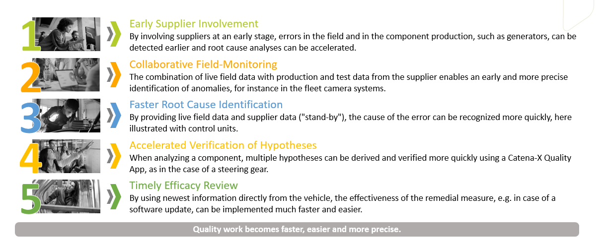

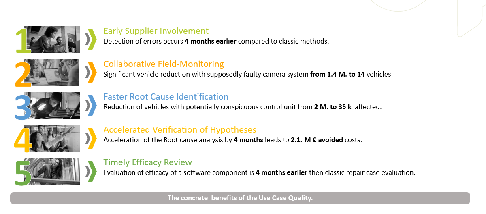

You can find more detailed information for all five scenarios in the figures below.

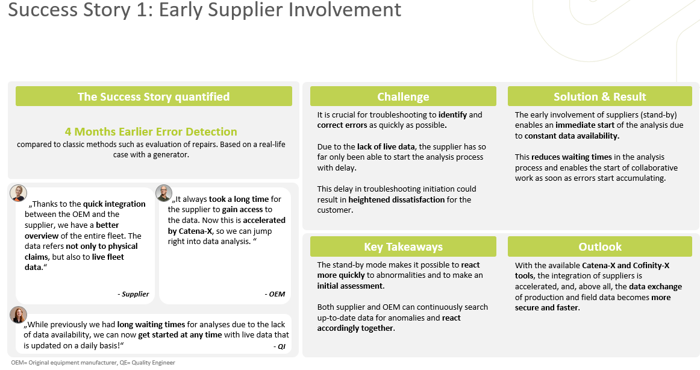

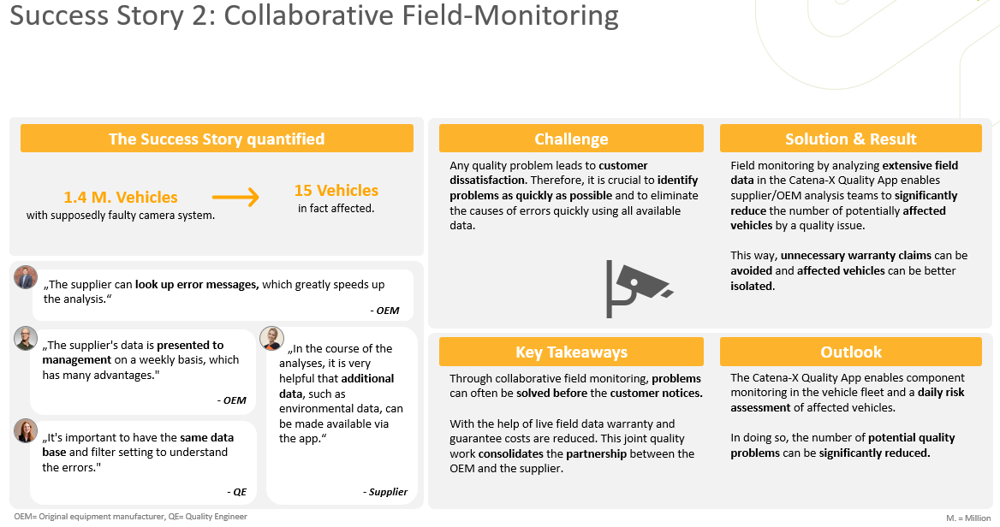

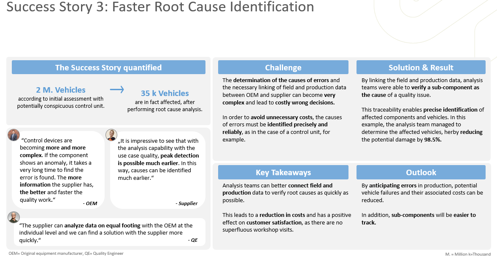

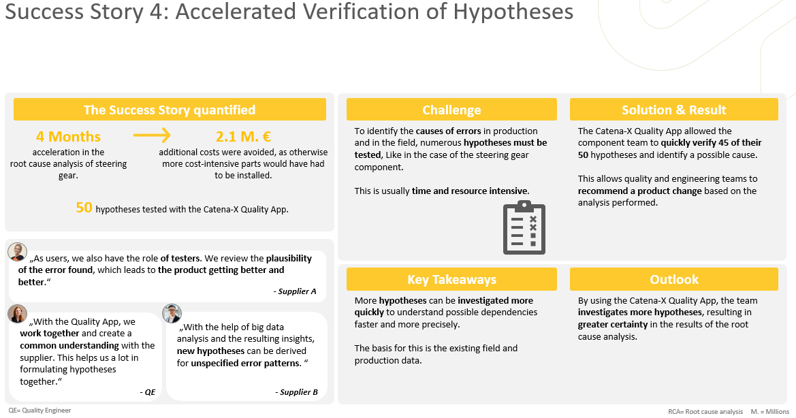

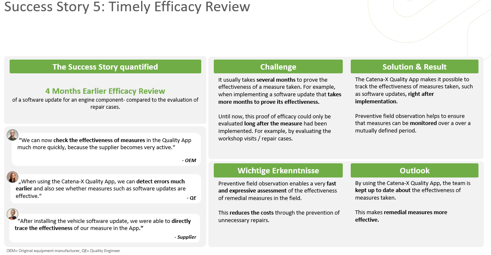

## Tutorials

The following **Onboarding Guide** is based on experiences gained during the initiation of real Quality pilots and the transfer to serial operation. Remark: For more details about the specified IT infrastructure, take a look at the **Architecture Overview** below and the description of how to exchange data in the [**Operation View**](../../kits/data-driven-quality-management-kit/operation-view.md)**.**

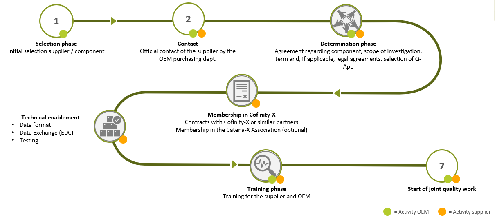

The following topics should be considered for a **successful onboarding**:

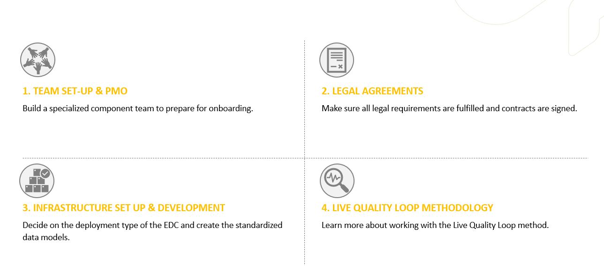

The "Do's & Don'ts" for the **Team Setup** and **PMO**:

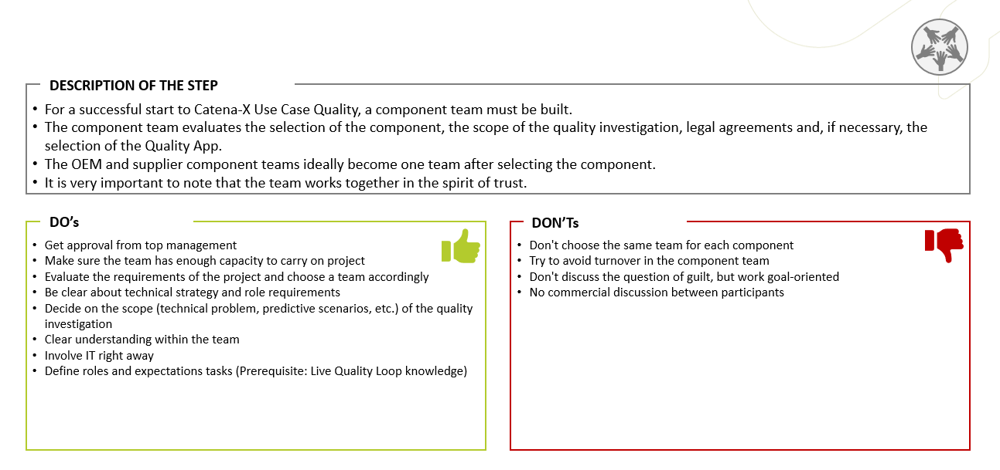

The "Do's & Don'ts" for the **Legal Agreement**:

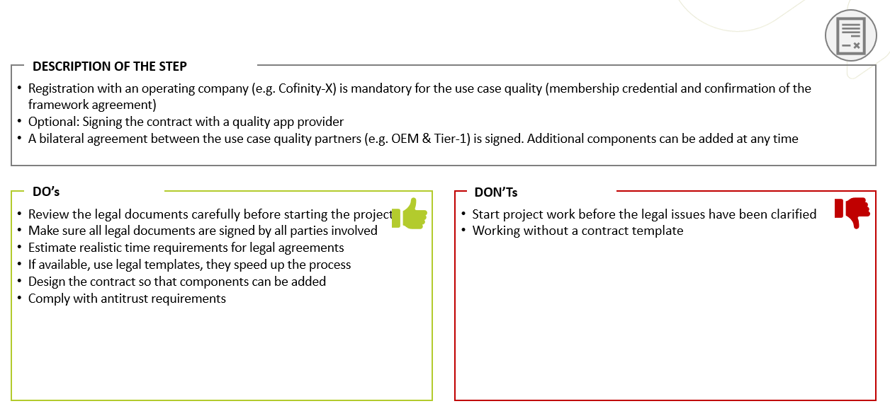

The "Do's & Don'ts" for the **infrastructure** setup and development:

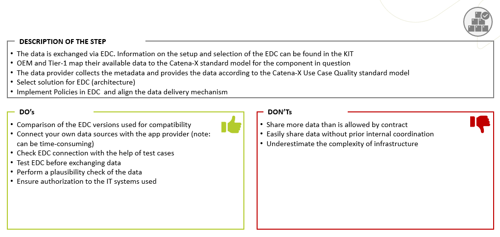

The "Do's & Don'ts" for working with the Live Quality Loop **Methodology**:

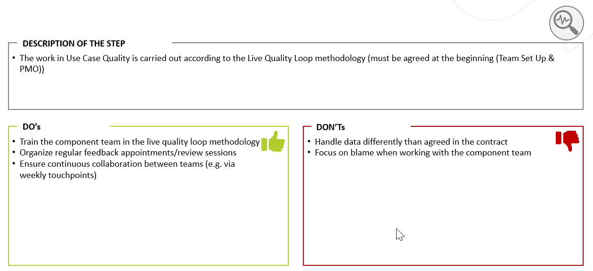

The following videos give an overview of the vision of the Quality Use Case.

First, follow this link to get an overview about how Quality Management is improved by Catena-X:
<iframe width="100%" height="350" src="https://www.youtube.com/embed/WMixoRvzWP8" title="YouTube video player" frameborder="0" allow="accelerometer; autoplay; clipboard-write; encrypted-media; gyroscope; picture-in-picture; web-share" allowfullscreen></iframe>

Hear what the consortia partners within the Use Case Quality state about the options for quality improvement with Catena-X - [Statements from the consortia partners]:
<iframe width="100%" height="350" src="https://www.youtube.com/embed/T-Xh_LzXXbg" title="YouTube video player" frameborder="0" allow="accelerometer; autoplay; clipboard-write; encrypted-media; gyroscope; picture-in-picture; web-share" allowfullscreen></iframe>

## Semantic Models

A semantic data model defines the structure how data can be exchanged between different Catena-X companies. Depending on the quality case, the amount of exchanged data is different. That's why the here mentioned semantic data models are quite big with many properties to transport the necessary information. Although, only a minimum set of properties is mandatory to give you a high degree of freedom in using the data models.

### Structure/hierarchy of data models

Depending on your quality case, you need different kinds of data. The semantic modelling of data-driven quality management defined one model per data type: One model for claims, one model for vehicle's diagnostic data and so on. To retrieve all data from different data models that belong to one quality case, we introduced QualityTask. A QualityTask contains the description of the quality case and a unique identifier. This identifier is the property **qualityTaskId** and must be **unique within Catena-X dataspace**.

Next picture shows the hierarchy of data models and how the different data can be linked together:

#### Quality Task

Quality Task(qTask) describes the quality case - the why two companies are working together. It has a unique identifier **qualityTaskId** that must be **unique within Catena-X dataspace**. In addition, a flag tells what should be done with
exchanged data after a qTask is closed. Recommendation is to transfer qTask data in Apache-Parquet format via file-based data transfer.
A qTask can be created by every Catena-X company.

Github Link to semantic data
model: [Quality Task](https://github.com/eclipse-tractusx/sldt-semantic-models/tree/main/io.catenax.quality_task)

#### Quality Task Attachment

Quality Task Attachment is an optional data model that gives the ability to share additional like pictures. It is basically a ZIP file that conatins a descriptive file with qualityTaskId and description of the coantaining + the files themself. Quality Task Attachment data is transfer as ZIP file via file-based data transfer. A Quality Task Attachment can be created by every Catena-X company.

Github Link to semantic data
model: [Quality Task Attachment](https://github.com/eclipse-tractusx/sldt-semantic-models/tree/main/io.catenax.quality_task_attachment)

#### Early Warning Notification

Early Warning Notifications are intended exchange messages between supplier and OEM, for example detected anomalies during inspection of the quality case. The content of the Early Warning Notification contains qualityTaskId, a textual description of the detected anomaly, and fileter settings that describe the potentially affected population. It can also have a reference to additional data that can be provided as Quality Task Attachment. An Early Warning Notification can be created by every Catena-X company.

Github Link to semantic data model: [Early Warning Notification](https://github.com/eclipse-tractusx/sldt-semantic-models/tree/main/io.catenax.early_warning_notification)

#### Failure Pattern

A Failure Pattern is a set of filter criteria that describes the reason for a quality case. This could be for example if a specific Digital Trouble Code (DTC) is set + a list of vehicle models + a list of countries where these vehicles are operated + a production range of these vehicles. If all filter criteria are met a certain quality problem may occur within a population of vehicles. Failure Patterns can be exchanged using Early Notification mechanism or just as JSON data using http-based data exchange. A Failure Pattern can be created by every Catena-X company.

Github Link to semantic data model: [Failure Pattern](https://github.com/eclipse-tractusx/sldt-semantic-models/tree/main/io.catenax.failure_pattern)

#### 8D Report

An 8D Report is a standardized document that is used widely in automotive quality management to systematically resolve problems. It is based on the 8D method which is a structured, eight-step problem describing and solving approach.  8D Report must contain the qualityTaskId. The data for 8D Report are exchanged as JSON data using http-based data exchange. An 8D Report can can be created by every Catena-X company.

Github Link to semantic data model: [8D Report](https://github.com/eclipse-tractusx/sldt-semantic-models/tree/main/io.catenax.report_8d)

Have a look into [Software Operation View](./software-operation-view.md) to know how this works in detail.

#### Fleet Vehicles

Fleet Vehicles data model describes the vehicle as it was built and sold to the customer - which equipment was installed in the vehicle, which engines are installed (single engine or hybrid with different engine types). All entities and properties are constant over the lifetime of the vehicle.
Fleet Vehicles data is provided by vehicle manufacturer(OEM).

Github Link to semantic data model: [Fleet Vehicles](https://github.com/eclipse-tractusx/sldt-semantic-models/tree/a2a01f445091188a647c42cced589f071fa2990d/io.catenax.fleet.vehicles)

#### Fleet Diagnostic Data

Fleet diagnostic data describes digital trouble codes (DTCs) inside a fleet of vehicles. Diagnostic data comes from multiple vehicles
that are affected by the same QualityTask. Fleet Diagnostic data is provided by vehicle manufacturer(OEM).

Github Link to semantic data
model: [Fleet Diagnostic](https://github.com/eclipse-tractusx/sldt-semantic-models/tree/main/io.catenax.fleet.diagnostic_data)

#### Fleet Claim Data

Customer complaints that are linked to one QualityTask. A customer complaint can result in replacing a potentially faulty part.
Fleet Claim data is provided by vehicle manufacturer(OEM).

Github Link to semantic data
model: [Fleet Claim](https://github.com/eclipse-tractusx/sldt-semantic-models/tree/main/io.catenax.fleet.claim_data)

#### Manufactured Parts Quality Information

Manufactured Parts Quality Information is a collection of quality-relevant paramters for multiple produced parts that are involved in one QualityTask.
Manufactured Parts Quality Information is provided by the component manufacturer/supplier.

Github Link to semantic data model: [Manufactured Parts Quality Information](https://github.com/eclipse-tractusx/sldt-semantic-models/tree/main/io.catenax.manufactured_parts_quality_information)

#### Parts Analyses

This data model contains parts analyses of parts which are involved in one QualityTask.
Parts Analyses data is provided by the component manufacturer/supplier.

Github Link to semantic data
model: [Parts Analyses](https://github.com/eclipse-tractusx/sldt-semantic-models/tree/main/io.catenax.parts_analyses)

## Logic & Schema

### Business Logic

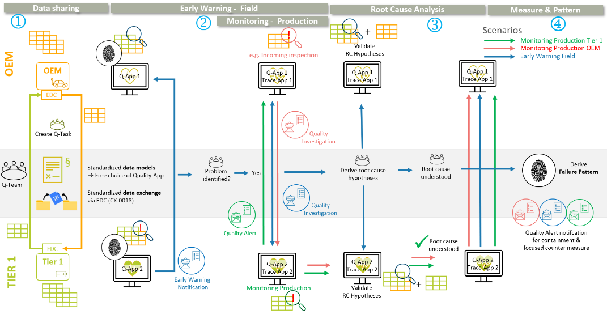

To describe the procedure for a data-based quality cooperation between an OEM and his Tier 1 supplier, the following user journey with different scenarios is presented. It has to be mentioned that the semantic data models for supplier are specified to be feasible along the supply chain and not only for OEM and Tier 1. This user journey includes the following steps:

#### 1. Quality cooperation and Data Sharing agreement

In the first step, the data-based quality cooperation has to be agreed to by the partner companies. This includes the definition of the products in focus, the purpose of the analyses as well as the data entities that have to be provided by both partners. The specification in the semantic data models defines the technical frame for this alignment. It is up to the data provider to decide whether or not to share a specific data entity with the partner. Based on the cooperation spec, the data sharing agreement and contracts have to be signed in compliance with the framework, as described in the chapter **Business Process**.

#### 2. Early issue detection (Early Warning Field and Monitoring Production)

**Early Warning** in the **Field**: An early warning system for issues in a vehicle fleet enables the earliest possible detection of quality problems in products in vehicles after delivery. Vehicle data from the OEM is used for the analysis, in particular fault codes that are stored in ECUs and read out during a workshop visit or frequently "over the air". Increases in product-specific fault codes across the vehicle population provide a reliable indicator of quality problems much earlier than through parts replacement and analysis.

**Monitoring** in the **Production** focuses on early detection in the production of products. Various practical scenarios have been developed and the corresponding technical requirements specified. If, for example, a supplier discovers that a delivered product has a quality defect, the customer can be informed by a Quality Alert notification, see chapter Notifications concept within the Quality KIT. The functionality of traceability (Catena-X Use Case Traceability) in the supply chain makes it possible to trace in which vehicle or follow-up product the affected components are installed. Remedial measures can thus be applied specifically to a limited quantity.

#### 3. Root Cause Analysis and Problem Solving

If a problem is detected by early warning in the field or by monitoring of the production, a data-based **Root Cause Analysis** is started. The aim is to derive hypotheses regarding the cause and the complete effect chain out of the shared database of the OEM and supplier and to verify them together. With the Catena-X network functions, this transparency can be achieved much faster.

#### 4. Implement measure and derive failure pattern

If the root cause and the complete failure effect chain is analyzed and understood faster, countermeasures can be implemented much earlier to avoid issues. If the root cause and the failure effect chain is analyzed and reconstructed based on data, it might be possible to derive a specific so-called failure pattern that enables to differentiate vehicles and products that are affected by a failure and those without failure. For more information, please refer to the chapter **Failure Pattern**.

### Notifications concept within the Quality KIT

Notifications within the Quality KIT are used to inform a partner company about a detected anomaly or failure and initiate further analysis steps or actions.

There are three types of notifications relating to different steps in the user journey:

1. Early Warning: This notification is used in the context of an Early Warning project to inform the partner company about an anomaly that was detected in the exchanged data. This data anomaly may or may not originate from an actual problem and, therefore, subsequently both partners will jointly review and evaluate the situation to decide if further actions need to be taken, e.g., issuing a Quality Investigation notification (see 2. below) and/or starting an 8D process. In contrast to Quality Investigation or Quality Alert notifications, the payload of an Early Warning notification is represented as a Data Model and, therefore, can be added to the shared data pool for the Early Warning project.

2. Quality Investigation: This notification is sent from the OEM / Tier n-1 to a supplier and indicates a problem or failure of parts delivered by the supplier. The problem may be detected by the OEM / Tier n-1, e.g., during incoming goods inspection or end of line test. The specification for this notification is shared with the [Traceability KIT](https://eclipse-tractusx.github.io/docs-kits/next/kits/traceability-kit/Architecture%20View%20Traceability%20Kit#quality-investigations--quality-alerts).

3. Quality Alert: This notification is sent from the supplier to an OEM / Tier n-1 and indicates a problem or failure of parts delivered by the supplier. The problem may be detected by the supplier, e.g., end of line test or via a notification from another customer. The specification for this notification is shared with the [Traceability KIT](https://eclipse-tractusx.github.io/docs-kits/next/kits/traceability-kit/Architecture%20View%20Traceability%20Kit#quality-investigations--quality-alerts).

Quality Notifications follow following concepts:

- They leverage the common notification header specification ([Shared Message Header](https://github.com/eclipse-tractusx/sldt-semantic-models/tree/main/io.catenax.shared.message_header)) and only differ in the content of the payload.

- They follow the same process model from *creation* to *sending* to *acknowledgement* to *acceptance/rejection* to *closure* (see [Traceability KIT](https://eclipse-tractusx.github.io/docs-kits/next/kits/traceability-kit/Architecture%20View%20Traceability%20Kit#notification-state-model) for further detail).

- They leverage the same API for sending the notification messages (see [Traceability KIT](https://eclipse-tractusx.github.io/docs-kits/next/kits/traceability-kit/Architecture%20View%20Traceability%20Kit#processes-for-sending-updating-and-resolving-quality-notifications) and the [Notification API Specification](https://catenax-ev.github.io/docs/standards/CX-0125-TraceabilityUseCase#41-quality-notification-api--1) for further detail).

The payload format for these notifications is to a large extend common between Early Warning notification and version 2.0 of the Quality Investigation/Alert notifications.

### Failure Pattern logic

Failure Patterns play a crucial role in the automotive industry, enhancing the reliability of vehicles and fostering collaboration between Original Equipment Manufacturers (OEMs) and their suppliers.

Failure Patterns are defined filter settings that can automatically list potentially critical individual records within a population. The output of a Failure Pattern is the quantity of a population in which this pattern is identified, depending on the subset of data considered.

Critical individual records represent a system, subsystem, or component that deviates from the manufacturers or customer’s specifications. Failure Patterns reveal reproducible patterns observed during failure analysis across a population of systems. These patterns can provide insights into specific causes and mechanisms.

They enable more targeted field monitoring for early warnings, more efficient root cause analysis, and evidence of the effectiveness of specific actions. During the quality control cycle, the Failure Pattern can be iteratively adjusted to focus on critical components until the root cause analysis identifies the causative population.

**Lessons learned with Failure Pattern**:

Failure patterns can be stored arbitrarily and exchanged with partners to cooperatively address critical issues efficiently. They can also be applied to other, even future vehicle fields, allowing for the rapid and effective identification of known damage mechanisms across entire populations. Based on this foundation, future familiar error patterns can be discovered almost in real time and immediately addressed within the context of lessons learned. The resulting knowledge database provides significant value to the involved partners in terms of the reliability of complex systems and subsystems. It prevents loss of experience, accelerates response times, and offers substantial benefits to companies.

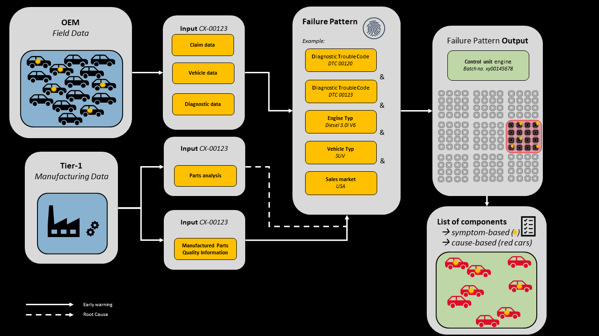

Failure Patterns are defined filter settings that relate to aspects of the Catena-X Standard CX-0123. This semantic model, which utilizes Boolean operators and links different variables within a dataset or in dependence on a logically connected dataset, serves to identify, assess, and provide evidence of effectiveness for critical system states within a population.

*For example:*

Within a population, a user can narrow down a specific fault entry to a particular vehicle model with a specific engine configuration and within a specific market segment (e.g., Diagnostic Trouble Code: “DTC00120” & “DTC 00123” & Engine Type: “Diesel 3.0l V6” & Sales market: “USA”). The user can then inform their partner about the anomaly in terms of “Early Warning.” Together, based on the available information, they can identify the root cause of the error (e.g., “Control unit engine Batch no. xy00145678”). The Failure Pattern can be adjusted as needed to apply the predefined corrective measures effectively, allowing for swift validation of success. Additionally, the Failure Pattern can generate a component list that clearly lists the affected parts.

Failure patterns are divided into the following categories for better understanding:

- *Symptom-Based Patterns:* These primarily serve to identify critical vehicles or systems with symptoms, where the root cause is still unknown but potential criticality can be discerned. For example: Diagnostic Trouble Codes (DTCs) such as “DTC00120” and “DTC 00123,” Engine Type: “Diesel 3.0L V6,” and Sales Market: “USA.”
- *Cause-Based Patterns:* These are used to identify vehicles or systems where the causal relationship between criticality and conditions is known or where the root cause has been identified through a root cause analysis. For instance: “Control unit engine Batch no. xy00145678” 12.

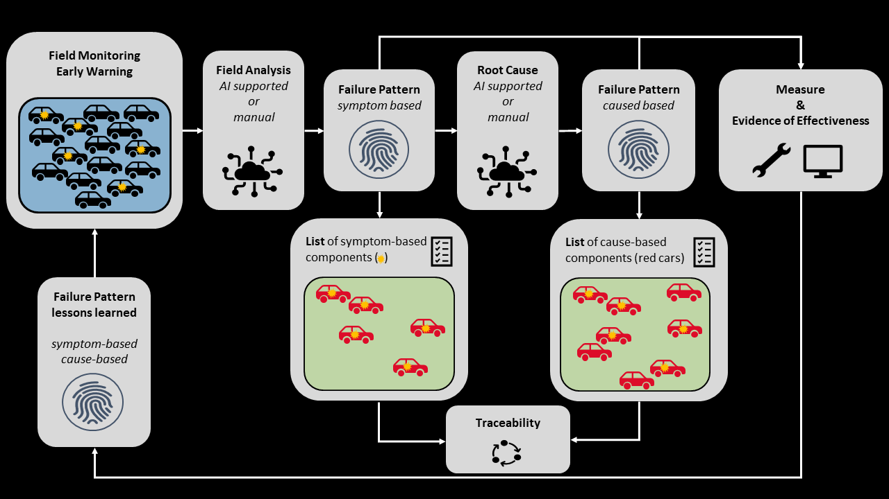

The 'field monitoring' oversees the vehicle population for critical system conditions. Once criticality is identified, the critical population is generically described using failure patterns. These failure patterns can be determined either manually or with the assistance of artificial intelligence. Simultaneously, in the context of "early warnings", partners are informed about anomalies to collaboratively assess criticality within the framework of a root cause analysis. Initially, the population can only be narrowed down based on symptoms. Once the root cause analysis is completed and the cause is identified, the population can be described based on its underlying causes. Mitigation measures and proof of effectiveness can be precisely monitored through the failure patterns in near real-time. However, in the overall view of the population, evidence of effectiveness is achievable only through a symptom-based filter. Conversely, measures can also be monitored using a cause-based pattern.

The insights gained from these failure patterns can be applied to any future populations within the context of lessons learned, allowing for rapid identification of known error patterns and targeted intervention.

From the failure patterns, relevant population lists can be extracted, uniquely identifying and naming the affected systems. Tracking critical components and subcomponents using UC-Traceability enables a targeted quality process chain in line with Catena-X.

### Architecture Overview

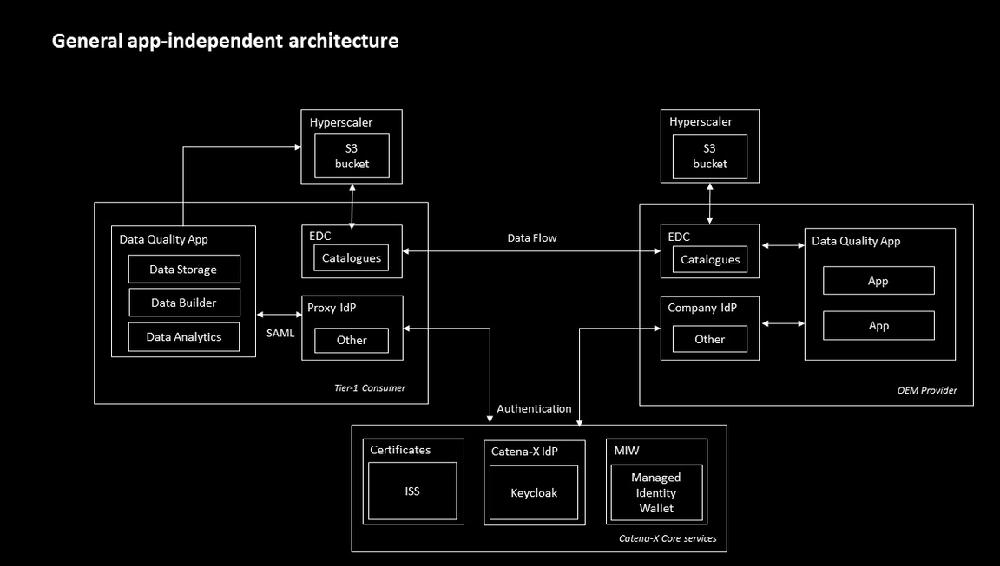

The Tier-1 receives data on vehicle master data, existing claims and DTCs. Once the data is received, the Tier-1 supplier analyzes the data to detect patterns based on which DTCs and claims can be explained. The data is shared and consumed as assets via the companies' EDC, while the authorization is managed via the shared services of the consortia.

#### Quality Components

| **Subsystem**     | **Description**                                                                                                                                                                                                                                                                                                                                                                                                                                                                                                 |
|-------------------|-----------------------------------------------------------------------------------------------------------------------------------------------------------------------------------------------------------------------------------------------------------------------------------------------------------------------------------------------------------------------------------------------------------------------------------------------------------------------------------------------------------------|
| Data Provisioning | This component provides a company's data to the Catena-X network by transforming it into the Catena-X format and publishing it. In Catena-X, data must be provided to the network based on existing standards from the other Kits. One example that can be used is the Connector KIT that builds a component based on the IDS protocol, e.g. the Connector of the Eclipse Dataspace Components (EDC). The data format used for Quality data is based on the aspects (Sub-)models published in the Semantic Hub. |
| Internal Systems  | Existing internal systems of a Catena-X partner which provide data to Quality components. - For Data Provisioning: The data provided to Catena-X via the EDC should be fetched from a partner's internal system. e.g. quality claims, defect code collection system.                                                                                                                                                                                                                                            |
| Quality App       | Enables analyses and visualization of available data (own and from data provider). Due to the standardization of the shared data, each partner company is able to use their preferred Quality App. Thus, the alignment on a common tooling within one joint quality team is possible but not a prerequisite.                                                                                                                                                                                                      |

#### Catena-X Core Services

| **Subsystem**                      | **Description**                                                                                                                                                                                                                                                                                                                                                                                                                                                           |
|------------------------------------|---------------------------------------------------------------------------------------------------------------------------------------------------------------------------------------------------------------------------------------------------------------------------------------------------------------------------------------------------------------------------------------------------------------------------------------------------------------------------|
| Eclipse Dataspace Components (EDC) | The Connector of the Eclipse Dataspace Components provides a framework for sovereign, inter-organizational data exchange. It will implement the International Data Spaces standard (IDS) as well as relevant protocols associated with GAIA-X. The connector is designed in an extensible way in order to support alternative protocols and integrate in various ecosystems. [Repository of the Catena-X specific EDC](https://github.com/eclipse-tractusx/tractusx-edc). |
| SSI → MIW                          | The Self-Sovereign Identity is also a lifelong identity (when credentials are created and the MIW is not reachable), the other verifiers should be able to check and validate existing valid credentials from distributed databases, directory or DLT. The MIW (also called "Custodian") provides a private/public key pair and related DID for a legal entity along with the onboarding.                                                                                |
| Discovery Service                  | The EDC / dataspace discovery interface is a CX network public available endpoint which can get used to retrieve EDC endpoints and the related BPNs, as well as search for endpoints via the BPN.                                                                                                                                                                                                                                                                         |

## Business Process

To realize a data-driven quality cooperation according to the Quality Kit all steps of the **Business Logic**, like data provisioning, consuming as well as utilization and analysis of the provided data by the involved partner companies, are realized in compliance with the [Catena-X Data Governance Framework](https://catena-x.net/en/catena-x-introduce-implement/governance-framework-for-data-space-operations). Under this link you can find the latest version of the framework regulations as download. The documents are separated in the following levels:

**Data Space Level**: Reference to **10 Golden Rules** of Catena-X.

**Use Case Level**: Reference to the latest version of the Use Case Quality specific framework.

**Data Offering** and **Usage Level** are defined by bilateral aligned policies and contracts between the cooperating partner companies. A template for a usage policy on bilateral level can be found in CX-0018.

## Standards

Our relevant standards can be downloaded from the
official [Catena-X Standard Library:](https://catenax-ev.github.io/docs/standards/overview)

- [CX - 0018 Eclipse Data Space Connector EDC](https://catenax-ev.github.io/docs/next/standards/CX-0018-DataspaceConnectivity)

- [CX - 0123 Use Case Quality Standard](https://catenax-ev.github.io/docs/next/standards/CX-0123-QualityUseCaseStandard)

## Notice

This work is licensed under the [CC-BY-4.0](https://creativecommons.org/licenses/by/4.0/legalcode).

- SPDX-License-Identifier: CC-BY-4.0
- SPDX-FileCopyrightText: 2023, 2024, 2025 ZF Friedrichshafen AG
- SPDX-FileCopyrightText: 2023, 2024, 2025 Robert Bosch GmbH
- SPDX-FileCopyrightText: 2023, 2024, 2025 Bayerische Motoren Werke Aktiengesellschaft (BMW AG)
- SPDX-FileCopyrightText: 2023, 2024, 2025 SAP SE
- SPDX-FileCopyrightText: 2023, 2024, 2025 Siemens AG
- SPDX-FileCopyrightText: 2023, 2024,2025 Volkswagen AG
- SPDX-FileCopyrightText: 2025 DENSO AUTOMOTIVE Deutschland GmbH
- SPDX-FileCopyrightText: 2025 WITTE Automotive GmbH
- SPDX-FileCopyrightText: 2025 Schaeffler Technologies AG & Co. KG
- SPDX-FileCopyrightText: 2025 PRS Technologie Gesellschaft mbH
- SPDX-FileCopyrightText: 2025 Ford Werke GmbH
