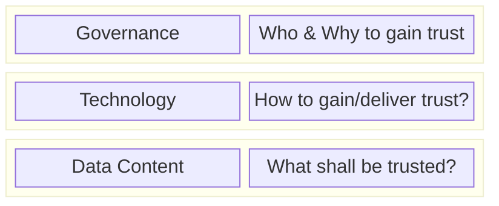
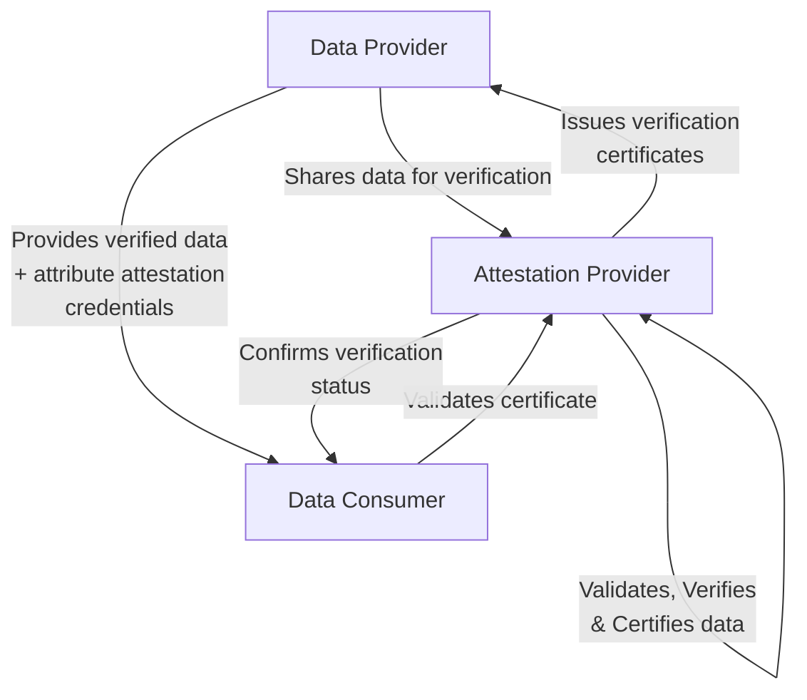

## Adoption View

### Vision & Mission

#### Vision

One core objective of data ecosystems is to enable secure data exchange between the participants within the ecosystem.
While the network can deliver trust in the participants, trust in the data is still required.
For that technical approaches are required.
This KIT shall enable data transfer, where data consumer can trust in their consumed data through third parties within the network as well as defined verification and validation procedures.

#### Mission

This KIT aims to define solutions used in Eclipse Tractus-X to generate trust in the data consumed within the network.

The Product Carbon Footprint (PCF), Digital Product Passport (DPP) and Company Certificate Management (CCM) use cases, are the first lighthouse examples, which Verifiable Credentials can be applied as technology for creating "signed documents"/ "attestation statements". This attestations can be done for complete aspect models or for some selective set of attributes.

It is important to note that the data exchange of this "attestation statements" secured by Verifiable Credentials is done via the technology defined in the [Connector KIT](../connector-kit/adoption-view/adoption-view.md) and managed/discoverable via [Digital Twins](../digital-twin-kit/adoption-view.md), like any aspect models which is not verifiable and implements the [Industry Core KIT](../industry-core-kit/adoption-view.mdx).

It shall deliver recommendation for gaining trust on three level:

For that definition of various terms such as verification and validation within the data ecosystem, data models used to describe data, initiatives already addressing trust as well as technical solutions to verify and validate data.
Additionally, a template for different rulebooks to gain trust in specific use case is defined.

#### Customer Journey

### Business Value & Benefits

#### Todays challenges

#### Business Case: Ensuring Verifiability in Product and Sustainability Information

Customers, investors, and regulators increasingly depend on accurate product and sustainability information to make informed decisions regarding climate action and sustainable practices. Regulatory frameworks such as the Ecodesign for Sustainable Products Regulation (ESPR) mandate that elements of the forthcoming Digital Product Passport — such as unique identifiers and data carriers (e.g., QR codes) — must be verifiable, however details are still subject to further standards and delegated acts.
Verifiability is critical for providing auditable, trustworthy evidence that supports sustainability claims and disclosures. It enables the authentication of key attributes, including product types, origin, manufacturing facilities, and associated business entities.

To facilitate data sharing across supply chains, interoperable ecosystems — such as data spaces — are being developed. These rely on standardized data models and exchange formats.

In addition, there are specific *business requirements towards interoperability* outside a given data space to ensure seamless data exchange across different networks and initiatives.
By using Verifiable Credentials, *interoperability with other ecosystems* that adopt the same standard is ensured. For example, Catena-X data can be exchanged across networks while maintaining data sovereignty. This is achieved by presenting Verifiable Credential data in other networks using Verifiable Presentations. Importantly, the *verification metadata* does not need to be stored in a centralized system—it travels decentrally with the data. As a result, any consumer with internet access and a functioning identity wallet can verify the authenticity and issuer of the data.

Moreover, a *snapshot of product attributes* can be taken without revealing the original content, allowing Attestation Providers to store a copy of the data without infringing on data sovereignty. This approach supports secure and privacy-preserving verification processes.

Cryptographic verification of digital credentials, such as identities and certificates, is essential for automating secure and reliable data transfers. This ensures that sustainability information remains trustworthy and tamper-proof throughout its lifecycle.

Non-compliance with sustainability reporting requirements can result in significant consequences, including financial penalties and reputational harm, particularly if supplier claims are found to be inaccurate or misleading. To mitigate these risks, buyers increasingly seek tools and methodologies that allow them to verify the sustainability disclosures of their suppliers. Without confidence in the reported data, stakeholders may question the credibility of a company’s sustainability efforts.
Enhancing the variability of product and sustainability information supports businesses in streamlining reporting and due diligence processes. For downstream industries, this translates into more frequent and better-informed decisions, driven by improved transparency and comparability of products and economic actors.

The *core business processes* supported by verifiable certifications can be summarized as follows:

##### 1. Regulatory Compliance: Adhering to legal and regulatory sustainability requirements

##### 2. Evidence Collection and Reporting: Documenting and reporting data to substantiate product claims based on both quantitative and qualitative conformity criteria

##### 3. Risk Monitoring: Proactively identifying and managing supply chain risks to support strategic planning and operational resilience

Given the labor-intensive nature of these processes, there is a strong economic incentive across the supply chain to adopt solutions that enable gradual automation, thereby improving efficiency and reducing operational burdens.

---

### Roles

In the Data Trust & Security KIT there are three main roles:

- **Data Provider**: Responsible for storing and providing the data (verifiable or not) to data consumers via an Eclipse Tractus-X dataspace (ex. Catena-X, etc).
- **Attestation Provider**: This should serve as an additional entity capable of confirming the authenticity of data through validation and verification. However, the primary responsibility for the data must remain with the data provider
- **Data Consumer**: Responsible for consuming data from a data provider and triggering the "check" to know if the data received is "verifiable".

### Trust Layers

### Layer 1: Governance

#### Attestation Providers

**What are Attestation Providers?**

Attestation Providers are independent organizations that verify and certify data within an Eclipse Tractus-X network (like Catena-X, etc). Think of them as trusted auditors who check that data is accurate, compliant, and trustworthy before it's shared between companies.

They must have a verified identity and verifiable role attestation, which is awarded by a governance body. In this way the chain of trust can be automatically verified using the what is defined in the Technology Layer.

**Who can act as governance/attestation bodies?**

Attestation providers and governance bodies can be [industry-specific](https://catenax-ev.github.io/docs/next/operating-model/why-introduction) or cross-industry, as currently developed by the [Manufacturing-X Initiative](https://www.plattform-i40.de/IP/Navigation/EN/Manufacturing-X/Manufacturing-X.html).

It is important that the root of trust is traceable from the attestation providers identity/role until the governance body via a chain of trust. In this way the data consumers can verify that the trust which was wrapped around the data by the attestation provider, was correctly delegated from governance body at a specific date, for a limited scope and period of time.

### Layer 2: Technology

Detailed Information regarding the technology can be seen at [Software Development view](./software-development-view/overview.md)

The main objective of the technology is to provide, verifiable proof for Aspect Model claims or selected attributes from an Aspect Model.

It covers aspects like `JSON-LD @context` generation from `JSON Schemas` generated from the SAMM Meta Models, Verifiable Credential schemas and structure, digital twin integration and clear examples for different examples.

:::info

Disclaimer: For the moment this KIT does not details the implementations of any Trusted Lists, Dataspace Role Credentials & Revocation Lists.

:::

### Layer 3: Data Content

For the data content, a rule book is necessary to be written with the specification for each attribute in a Data Model. In this KIT a [Rulebook Template](./documentation/rulebook-template.md) is provided for the data content to be specified.

Additional information can be provided in the rulebook to enable and support the Attestation Providers in their task of content validation, certification and verification.

#### Rulebooks

Examples of existing rulebooks are the following:

| Name | Link |
|--|--|
| Catena-X PCF Verification Framework v1.0 | [go to rulebook](https://catenax-ev.github.io/assets/files/CX-NFR-PCF_TFS-verification_v.1.0-9c745192bc2871adda513e4b7a22bab2.pdf) |
| Catena-X PCF Rulebook v3.1 | [go to rulebook](https://catenax-ev.github.io/assets/files/CX-NFR-PCF-Rulebook_v.3.1-7737a1471bd658b49a1685aaa65d5ebe.pdf) |
| Digital Product Passport Rulebook v1.0 | Comming soon |

Additonally standards can also be used to validate calculation methodology, data content plausibility.

## Standards & Specifications

The Data Trust & Security KIT is built upon established industry standards and specifications to ensure interoperability, security, and compliance within the Catena-X ecosystem.

### W3C Standards

| Standard | Version | Reference |
|----------|---------|-----------|
| **Verifiable Credentials Data Model** | 2.0 | [W3C VC Data Model 2.0](https://www.w3.org/TR/vc-data-model-2.0/) |
| **Decentralized Identifiers (DIDs)** | 1.0 |  [W3C DID Core](https://www.w3.org/TR/did-core/) |
| **DID Web Method** | - |  [W3C DID Web](https://w3c-ccg.github.io/did-method-web/) |
| **JSON-LD** | 1.1 | [W3C JSON-LD](https://www.w3.org/TR/json-ld11/) |

:::info

[W3C VC Data Model 2.0](https://www.w3.org/TR/vc-data-model-2.0/) are used in order to keep the interoperability with other [UNTP protocol](https://spec-untp-fbb45f.opensource.unicc.org/docs/about/) and [eIDas 2.0](https://eidas.ec.europa.eu/) in the near future.

:::

### Catena-X Standards

For complete documentation of all Catena-X standards, visit the [Catena-X Standards Overview](https://catenax-ev.github.io/docs/standards/overview).

This are the relevant standards for this KIT:

| ID | Name | Link |
| -- | ---- | ---- |
| CX-0002 | Digital Twins in Catena-X v2.2.0 | [go to standard](https://catenax-ev.github.io/docs/next/standards/CX-0002-DigitalTwinsInCatenaX) |
| CX-0018 | Dataspace Connectivity v.4.0.0 | [go to standard](https://catenax-ev.github.io/docs/next/standards/CX-0018-DataspaceConnectivity) |
| CX-0049 | DID Document v2.1.0 | [go to standard](https://catenax-ev.github.io/docs/next/standards/CX-0049-DIDDocumentSchema) |
| CX-0135 | Business Partner Company Certificate Management v2.2.0 | [go to standard](https://catenax-ev.github.io/docs/standards/CX-0135-CompanyCertificateManagement) |
| CX-0136 | Use Case PCF 2.0.1 | [go to standard](https://catenax-ev.github.io/docs/standards/CX-0136-UseCasePCF) |
| CX-0143 | Use Case Circular Economy - Digital Product Passport Standard 1.0.1 | [go to standard](https://catenax-ev.github.io/docs/standards/CX-0143-UseCaseCircularEconomyDigitalProductPassportStandard/introduction) |
| CX-0149 | Verified Company Identity v1.0.0 | [go to standard](https://catenax-ev.github.io/docs/next/standards/CX-0149-Dataspaceidentityandidentification) |

:::caution

Disclaimer:

In Catena-X wallet standard [CX-0149](https://catenax-ev.github.io/docs/next/standards/CX-0149-Dataspaceidentityandidentification) only required the VC standards version [W3C VC Data Model 1.1](https://www.w3.org/TR/vc-data-model-1.1/) is not compatible with the VC standard version [W3C VC Data Model 2.0](https://www.w3.org/TR/vc-data-model-2.0/). However since the data is exchange through data provider Connector Dataplane like any other aspect model, therefore are no incompatibilities during data exchange, only during the issuance, if the wallet does not support yet [W3C VC Data Model 2.0](https://www.w3.org/TR/vc-data-model-2.0/).

:::

## Reference Implementations

### Digital Product Pass Verification Add-on

The Digital Product Pass Reference Implementation has a concept and implementation for the Certification and Verification of the Data Trust & Security KIT.

This Data Certification/Verification Framework aims to create a second layer of trust over the EDC data exchanges between consumers and data providers. It enables auditors to verify specific attributes or complete aspect models for data providers and allowing consumers to retrieve and verify the "validity" of the verification done. Using a simple wallet, a Data Provider is able to certify its attributes or the complete semantic models from Eclipse Tractus-X and include it in a Verifiable Credential, which can then be verified on the Data Consumer side.

The concept is the First Aspect Model Verification/Certification Concept in Tractus-X. It aims to provide a "lighthouse" for any other aspect model verification/certification that MUST be done in Tractus-X using SAMM Aspect Models. It provides a generic concept for Attribute Verification/Certification by external/internal auditors, and also provides a Self-Attestation option for Data Providers to certify their data while still maintaining data sovereignty at all costs. By using the EDC connector for the data exchanges the concept uses the current Tractus-X Architecture:

[eclipse-tractusx/digital-product-pass/dpp-verification](https://github.com/eclipse-tractusx/digital-product-pass/blob/d48d7b67d742f4177bd6272b93897a9346a38819/dpp-verification/README.md)

More Information can be found in the [DPP Verification Success Story](./success-stories/dpp-verification-success-story.mdx).

## NOTICE

This work is licensed under the [CC-BY-4.0](https://creativecommons.org/licenses/by/4.0/legalcode).

- SPDX-License-Identifier: CC-BY-4.0
- SPDX-FileCopyrightText: 2025 Contributors to the Eclipse Foundation
- SPDX-FileCopyrightText: 2025 Fujitsu Limited
- SPDX-FileCopyrightText: 2025 Robert Bosch GmbH
- SPDX-FileCopyrightText: 2025 Spherity GmbH
- SPDX-FileCopyrightText: 2025 Schaeffler AG
- SPDX-FileCopyrightText: 2025 SIEMENS AG
- SPDX-FileCopyrightText: 2025 Fraunhofer-Gesellschaft zur Foerderung der angewandten Forschung e.V. (represented by Fraunhofer IPK)
- SPDX-FileCopyrightText: 2025 CGI Deutschland B.V. & Co. KG
- SPDX-FileCopyrightText: 2025 TÜV Süd AG
- SPDX-FileCopyrightText: 2025 BASF SE
- SPDX-FileCopyrightText: 2025 Cofinity-X GmbH
- SPDX-FileCopyrightText: 2025 Henkel AG & Co. KGaA
- Source URL: [https://github.com/eclipse-tractusx/eclipse-tractusx.github.io](https://github.com/eclipse-tractusx/eclipse-tractusx.github.io)
