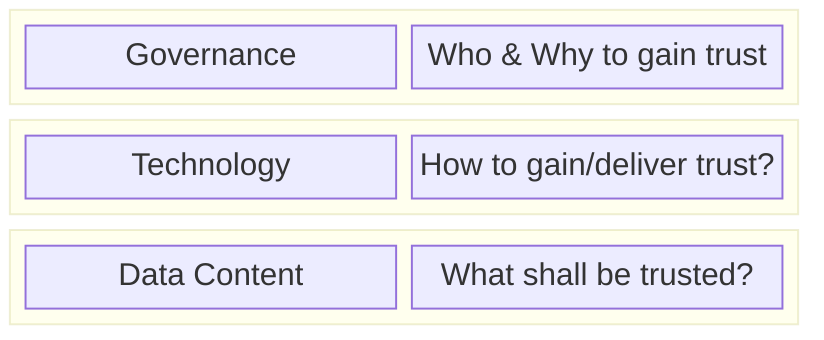

## Adoption View

### Vision & Mission

#### Vision

One core objective of data ecosystems is to enable secure data exchange between the participants within the ecosystem.
While the network can deliver trust in the participants, trust in the data is still required.
For that technical approaches are required.
This KIT shall enable data transfer, where data consumer can trust in their consumed data through third parties within the network as well as defined verification and validation procedures.

#### Mission

This KIT aims to define solutions used in Eclipse Tractus-X to generate trust in the data consumed within the network.

It shall deliver recommendation for gaining trust on three level:

For that definition of various terms such as verification and validation within the data ecosystem, data models used to describe data, initiatives already adressing trust as well as technical solutions to verify and validate data.
Additionally, a template for different rulebooks to gain trust in specific use case is defined.

#### Customer Journey

### Business Value & Benefits

#### Todays challenges

#### Business Case: Ensuring Verifiability in Product and Sustainability Information

Customers, investors, and regulators increasingly depend on accurate product and sustainability information to make informed decisions regarding climate action and sustainable practices. Regulatory frameworks such as the Ecodesign for Sustainable Products Regulation (ESPR) mandate that elements of the forthcoming Digital Product Passport — such as unique identifiers and data carriers (e.g., QR codes) — must be verifiable, however details are still subject to further standards and delegated acts.
Verifiability is critical for providing auditable, trustworthy evidence that supports sustainability claims and disclosures. It enables the authentication of key attributes, including product types, origin, manufacturing facilities, and associated business entities.

To facilitate data sharing across supply chains, interoperable ecosystems — such as data spaces — are being developed. These rely on standardized data models and exchange formats. 

In addition, there are specific *business requirements towards interoperability* outside a given data space to ensure seamless data exchange across different networks and initiatives.
By using Verifiable Credentials, *interoperability with other ecosystems* that adopt the same standard is ensured. For example, Catena-X data can be exchanged across networks while maintaining data sovereignty. This is achieved by presenting Verifiable Credential data in other networks using Verifiable Presentations. Importantly, the *verification metadata* does not need to be stored in a centralized system—it travels decentrally with the data. As a result, any consumer with internet access and a functioning identity wallet can verify the authenticity and issuer of the data.

Moreover, a *snapshot of product attributes* can be taken without revealing the original content, allowing data auditors to store a copy of the data without infringing on data sovereignty. This approach supports secure and privacy-preserving verification processes.

Cryptographic verification of digital credentials, such as identities and certificates, is essential for automating secure and reliable data transfers. This ensures that sustainability information remains trustworthy and tamper-proof throughout its lifecycle.

Non-compliance with sustainability reporting requirements can result in significant consequences, including financial penalties and reputational harm, particularly if supplier claims are found to be inaccurate or misleading. To mitigate these risks, buyers increasingly seek tools and methodologies that allow them to verify the sustainability disclosures of their suppliers. Without confidence in the reported data, stakeholders may question the credibility of a company’s sustainability efforts.
Enhancing the verifiability of product and sustainability information supports businesses in streamlining reporting and due diligence processes. For downstream industries, this translates into more frequent and better-informed decisions, driven by improved transparency and comparability of products and economic actors.

The *core business processes* supported by verifiable certifications can be summarized as follows:

##### 1. Regulatory Compliance: Adhering to legal and regulatory sustainability requirements.

##### 2. Evidence Collection and Reporting: Documenting and reporting data to substantiate product claims based on both quantitative and qualitative conformity criteria.

##### 3. Risk Monitoring: Proactively identifying and managing supply chain risks to support strategic planning and operational resilience.

Given the labor-intensive nature of these processes, there is a strong economic incentive across the supply chain to adopt solutions that enable gradual automation, thereby improving efficiency and reducing operational burdens.

---

### Trust Layers

#### Layer 1: Governance

#### Who is allowed to be appointed for "PCF Verification", "DPP Verification"

##### How the verification is done?

-> Roles and Responsibilities (similar to e.g., example use cases scenarios in traceability and circular economy)

##### Revocation of credentials, how is that done?

-> see above

#### Interoperability with multiple initiatives (UNTP, Battery Pass EU, Gaia-X, etc.)

### Layer 2: Technology

Detailed Information regarding the technology can be seen at [Software Development view](./software-development-view/software-development-view.md)

#### We do we need to do it digitally?

#### Why verifiable credentials (W3C)?

#### Where are existing trusted lists (synergies from other initiatives)

#### Specify that we use the Connector KIT (for private interface) and for public interface could be used another way (B2C topic)

### Layer 3: Data Content

#### Rulebooks Explanation why we need a "rulebook". -> can be also standards.

#### Certified Data Credential & Certified Snapshot Credential (when are they used and for what)

-> elaborate in more detail on the use case scenarios behind the first DPP slide deck. Essentially, add the written story to the pictures in the slides.

### Notice

This work is licensed under the [CC-BY-4.0](https://creativecommons.org/licenses/by/4.0/legalcode).

- SPDX-License-Identifier: CC-BY-4.0
- SPDX-FileCopyrightText:
