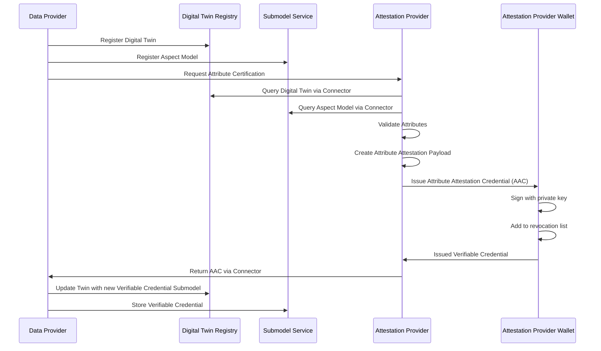
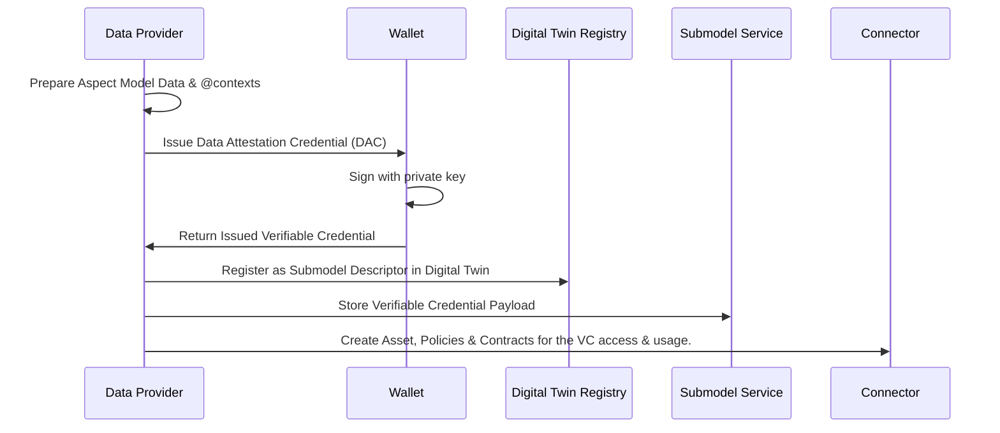
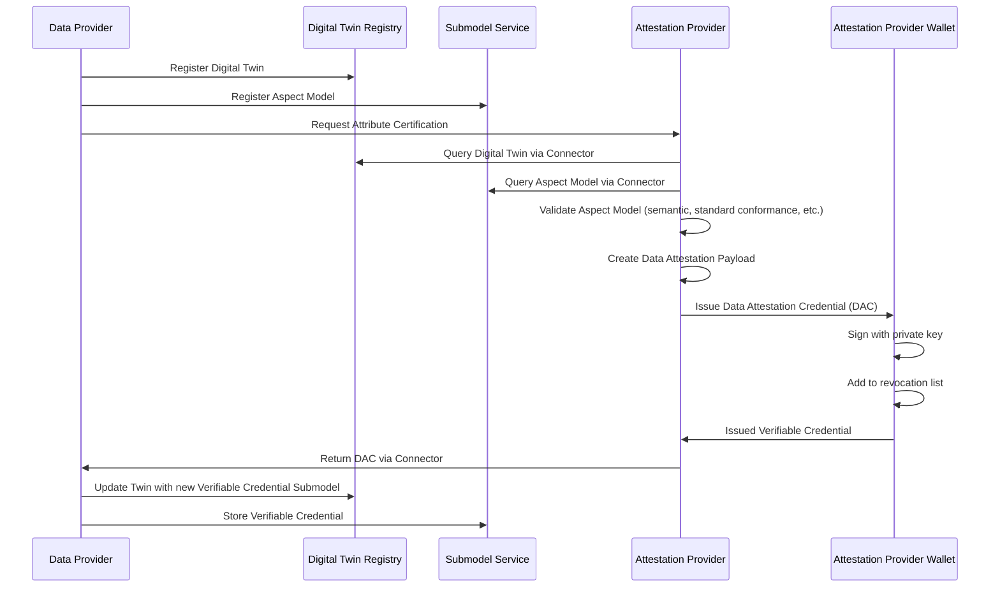

## Connecting with Your Digital Twins

### Using Certificates as Digital Twin Components

One of the most powerful features of the Data Trust & Security KIT is that you can attach verifiable credentials directly to your digital twins. This means when someone looks up a product or component in your Digital Twin Registry (DTR), they can immediately see the trust certificates associated with it.

Think of it like attaching a quality certificate to a physical product, except this is digital and cryptographically secured. The implementation follows **[Digital Twin KIT](../../digital-twin-kit/adoption-view.md)** specification for registry integration and **[W3C Verifiable Credentials](https://www.w3.org/TR/vc-data-model-2.0/)** format for the credential structure.

#### How It Works in Practice

When you register a digital twin, you can include submodels as verifiable credentials. Here's what this looks like technically:

#### Data Attestation Certificate as Submodel Example

Here’s an example of how a data attestation credential might look as a submodel:

```json
{
  "endpoints": [
      {
          "interface": "SUBMODEL-3.0",
          "protocolInformation": {
              "href": "https://<edc.dataplane>/api/public/data/urn:uuid:a377ff49-6bde-4215-8d38-b8f02c991a35/credential",
              "endpointProtocol": "HTTP",
              "endpointProtocolVersion": ["1.1"],
              "subprotocol": "DSP",
              "subprotocolBody": "id=urn:uuid:3e4a5957-f226-478a-ab18-79ced49d6195;dspEndpoint=https://edc.controlplane/api/v1/dsp",
              "subprotocolBodyEncoding": "plain",
              "securityAttributes": [
                  {
                      "type": "NONE",
                      "key": "NONE", 
                      "value": "NONE"
                  }
              ]
          }
      }
  ],
  "idShort": "pcfDataAttestation",
  "id": "urn:uuid:a377ff49-6bde-4215-8d38-b8f02c991a35",
  "semanticId": {
      "type": "ExternalReference",
      "keys": [
          {
              "type": "Entity",
              "value": "https://www.w3.org/ns/credentials/v2"
          },
          {
              "type": "DataElement", 
              "value": "https://raw.githubusercontent.com/eclipse-tractusx/tractusx-profiles/refs/heads/main/tx/credentials/schema/context/dac/v1/DataAttestationCredential.jsonld"
          },
          {
              "type": "Submodel",
              "value": "urn:samm:io.catenax.pcf:7.0.0#Pcf"
          },
          {
              "type": "Operation",
              "value": "https://w3c.github.io/vc-jws-2020/contexts/v1/"
          }
      ]
  },
  "description": [
      {
          "language": "en",
          "text": "Verifiable Data Attestation Submodel"
      }
  ],
  "displayName": []
}
```

:::caution

At the moment, this is technically supported but is not fully compliant with the [Submodel Service Specification V3.0 READ Profile SSP-003](https://app.swaggerhub.com/apis/Plattform_i40/SubmodelServiceSpecification/V3.0_SSP-003) API specification standard from the [IDTA](https://industrialdigitaltwin.org/en/). Verifiable Credentials submodels are currently not compatible with the [AASX format](https://github.com/eclipse-aaspe/package-explorer), therefore is specified in the `href` endpoint the path `/credential` to avoid conflicts. This path needs to be supported by a special submodel service, for example a blob storage or a wallet.

The only requirements is that it must be correctly referenced as an asset at the Connector, and then being linked, via the `assetid` in the `subprotocolBody` attribute at the submodel descriptor as described above.

:::

For semantic identification, in order for an application to know that this is a verifiable credential submodel or not, the `semanticId` must specify from top to down the different metadata abstraction levels. Which describe the `type` of data which will be retrieved via the Connector dataplane:

- Which **version** of verifiable credential in the `Entity` key.
- Which **type** of verifiable credential in the `DataElement` key.
- Which **aspect model** is fully or partially embedded in the verifiable credential using the standard `Submodel` key
- Which **signature type** is used on this verifiable credential in the `Operation` Key

Below more details can be found.

### Semantic ID Configuration

For different submodels, different semantic ID structures are used to identify various aspects and content types:

| Type | Description | Example |
|------|-------------|---------|
| `Entity` | Highest abstraction level indicating credential format | `https://www.w3.org/ns/credentials/v2` |
| `DataElement` | Type of verifiable credential/presentation indicated with the uri | `https://raw.githubusercontent.com/eclipse-tractusx/tractusx-profiles/refs/heads/main/tx/credentials/schema/context/dac/v1/DataAttestationCredential.jsonld` |
| `Submodel` | Aspect model type and structure reference | `urn:samm:io.catenax.pcf:7.0.0#Pcf` |  
| `Operation` | Signature type context for verification | `https://w3c.github.io/vc-jws-2020/contexts/v1/` |

:::info

Currently is not defined where to do the hosting JSON-LD @context for the base credentials and the semantic models.

For the moment the base credentials are available at this location [eclipse-tractusx/tractusx-profiles/tx/dac/v1/DataAttestationCredential](https://raw.githubusercontent.com/eclipse-tractusx/tractusx-profiles/refs/heads/main/tx/credentials/schema/context/dac/v1/DataAttestationCredential.jsonld) and [eclipse-tractusx/tractusx-profiles/tx/aac/v1/AttributeAttestationCredential](https://raw.githubusercontent.com/eclipse-tractusx/tractusx-profiles/refs/heads/main/tx/credentials/schema/context/aac/v1/AttributeAttestationCredential.jsonld).

For the semantic models JSON-LD @contexts are currently stored in [sldt-semantic-models](https://github.com/eclipse-tractusx/sldt-semantic-models) repository at the `gen` folder of the [`PCF v7.0.0`](https://github.com/eclipse-tractusx/sldt-semantic-models/blob/main/io.catenax.pcf/7.0.0/gen/Pcf-context.jsonld), [`DPP v6.0.0`](https://github.com/eclipse-tractusx/sldt-semantic-models/blob/main/io.catenax.generic.digital_product_passport/6.0.0/gen/DigitalProductPassport-context.jsonld) and [`CCM 3.1.0`](https://github.com/eclipse-tractusx/sldt-semantic-models/blob/main/io.catenax.business_partner_certificate/3.1.0/gen/BusinessPartnerCertificate-context.jsonld) models.

More models JSON-LD @contexts can be generated in the future, and also self-hosted. The only condition is that they MUST be available for the public internet and reachable by data consumers.

:::

### Future Work

In the **target state** it should be resolved with some type of **W3C redirection** uri like `https://w3id.org/tractusx/dac/v1/` and `https://w3id.org/tractusx/aac/v1/` for the base credentials

And for the semantic models it could look like this for example (for Catena-X models): `https://w3id.org/catenax/vocab/io.catenax.pcf/7.0.0/`.

## Attestation Processes

Let's analyze what role is the Digital Twin playing in the attestation and verifiable credential creation process:

### Attribute Attestation Creation Process

The attribute certification process enables third-party auditors to verify specific attributes within aspect models:



### Self-Issued Data Attestation Credential Creation Process

Data providers can self-issue their data by embedding their data into verifiable credentials, and providing this data, at a Digital Twin as any aspect model.



### Third Party Data Attestation Credential Creation Process

In this case the verifiable credential would not be issued by the **Data Provider** but it would be done by the **Attestation Provider**.

This process is similar to the [Attribute Credential Creation](#attribute-attestation-creation-process), the difference is that the "certification" is done for the complete aspect model payload:



## NOTICE

This work is licensed under the [CC-BY-4.0](https://creativecommons.org/licenses/by/4.0/legalcode).

- SPDX-License-Identifier: CC-BY-4.0
- SPDX-FileCopyrightText: 2025 Contributors to the Eclipse Foundation
- SPDX-FileCopyrightText: 2025 Fujitsu Limited
- SPDX-FileCopyrightText: 2025 Robert Bosch GmbH
- SPDX-FileCopyrightText: 2025 Spherity GmbH
- SPDX-FileCopyrightText: 2025 Schaeffler AG
- SPDX-FileCopyrightText: 2025 SIEMENS AG
- SPDX-FileCopyrightText: 2025 Fraunhofer-Gesellschaft zur Foerderung der angewandten Forschung e.V. (represented by Fraunhofer IPK)
- SPDX-FileCopyrightText: 2025 CGI Deutschland B.V. & Co. KG
- SPDX-FileCopyrightText: 2025 TÜV SÜD Auto Service GmbH
- SPDX-FileCopyrightText: 2025 BASF SE
- SPDX-FileCopyrightText: 2025 Deloitte GmbH
- SPDX-FileCopyrightText: 2025 BMW AG
- SPDX-FileCopyrightText: 2025 Cofinity-X GmbH
- SPDX-FileCopyrightText: 2025 Henkel AG & Co. KGaA
- Source URL: [https://github.com/eclipse-tractusx/eclipse-tractusx.github.io](https://github.com/eclipse-tractusx/eclipse-tractusx.github.io)
