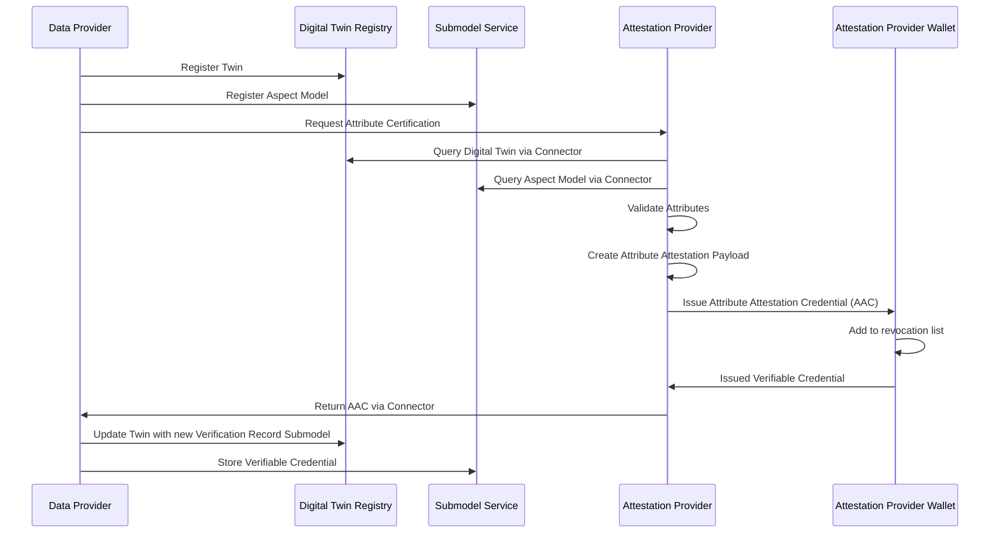
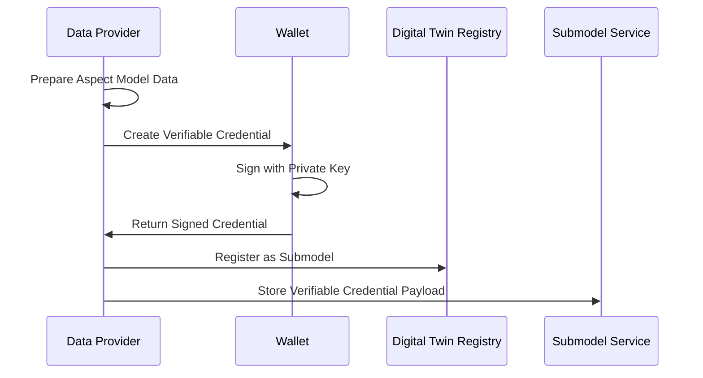

## Connecting with Your Digital Twins

### Using Certificates as Digital Twin Components

One of the most powerful features of the Data Trust & Security KIT is that you can attach verifiable credentials directly to your digital twins. This means when someone looks up a product or component in your Digital Twin Registry, they can immediately see the trust certificates associated with it.

Think of it like attaching a quality certificate to a physical product, except this is digital and cryptographically secured. The implementation follows **[Catena-X CX-0002 Digital Twins](https://catenax-ev.github.io/docs/standards/CX-0002-DigitalTwinsInCatenaX)** standard for registry integration and **[W3C Verifiable Credentials](https://www.w3.org/TR/vc-data-model-2.0/)** format for the credential structure.

#### How It Works in Practice

When you register a digital twin, you can include submodels that contain verifiable credentials. Here's what this looks like technically:

#### Data Attestation Certificate as Submodel

Here’s an example of how a data attestation credential might look as a submodel:

```json
{
  "endpoints": [
      {
          "interface": "SUBMODEL-3.0",
          "protocolInformation": {
              "href": "https://<edc.dataplane>/api/public/data/urn:uuid:a377ff49-6bde-4215-8d38-b8f02c991a35/credential",
              "endpointProtocol": "HTTP",
              "endpointProtocolVersion": ["1.1"],
              "subprotocol": "DSP",
              "subprotocolBody": "id=urn:uuid:3e4a5957-f226-478a-ab18-79ced49d6195;dspEndpoint=https://edc.controlplane/api/v1/dsp",
              "subprotocolBodyEncoding": "plain",
              "securityAttributes": [
                  {
                      "type": "NONE",
                      "key": "NONE", 
                      "value": "NONE"
                  }
              ]
          }
      }
  ],
  "idShort": "pcfDataAttestation",
  "id": "urn:uuid:a377ff49-6bde-4215-8d38-b8f02c991a35",
  "semanticId": {
      "type": "ExternalReference",
      "keys": [
          {
              "type": "Entity",
              "value": "https://www.w3.org/ns/credentials/v2"
          },
          {
              "type": "DataElement", 
              "value": "https://raw.githubusercontent.com/eclipse-tractusx/tractusx-profiles/refs/heads/main/tx/credentials/schema/context/dac/v1/DataAttestationCredential.jsonld"
          },
          {
              "type": "Submodel",
              "value": "urn:samm:io.catenax.pcf:7.0.0#Pcf"
          },
          {
              "type": "Operation",
              "value": "https://w3c.github.io/vc-jws-2020/contexts/v1/"
          }
      ]
  },
  "description": [
      {
          "language": "en",
          "text": "Verifiable Data Attestation Submodel"
      }
  ],
  "displayName": []
}
```

### Semantic ID Configuration

For different submodels, different semantic ID structures are used to identify various aspects and content types:

| Type | Description | Example |
|------|-------------|---------|
| `Entity` | Highest abstraction level indicating credential format | `https://www.w3.org/ns/credentials/v2` |
| `DataElement` | Type of verifiable credential/presentation indicated with the uri | `https://raw.githubusercontent.com/eclipse-tractusx/tractusx-profiles/refs/heads/main/tx/credentials/schema/context/dac/v1/DataAttestationCredential.jsonld` |
| `Submodel` | Aspect model type and structure reference | `urn:samm:io.catenax.pcf:7.0.0#Pcf` |  
| `Operation` | Signature type context for verification | `https://w3c.github.io/vc-jws-2020/contexts/v1/` |

## Certification Processes

### Attribute Certification Process

The attribute certification process enables third-party auditors to verify specific attributes within aspect models:



### Self-Attestation Process

Data providers can self-attest their data by creating signed verifiable credentials:



## NOTICE

This work is licensed under the [CC-BY-4.0](https://creativecommons.org/licenses/by/4.0/legalcode).

- SPDX-License-Identifier: CC-BY-4.0
- SPDX-FileCopyrightText: 2025 Contributors to the Eclipse Foundation
- SPDX-FileCopyrightText: 2025 Fujitsu Limited
- SPDX-FileCopyrightText: 2025 Robert Bosch GmbH
- SPDX-FileCopyrightText: 2025 Spherity GmbH
- SPDX-FileCopyrightText: 2025 Schaeffler AG
- SPDX-FileCopyrightText: 2025 SIEMENS AG
- SPDX-FileCopyrightText: 2025 Fraunhofer-Gesellschaft zur Foerderung der angewandten Forschung e.V. (represented by Fraunhofer IPK)
- SPDX-FileCopyrightText: 2025 CGI Deutschland B.V. & Co. KG
- SPDX-FileCopyrightText: 2025 TÜV SÜD Auto Service GmbH
- SPDX-FileCopyrightText: 2025 BASF SE
- SPDX-FileCopyrightText: 2025 Deloitte GmbH
- SPDX-FileCopyrightText: 2025 BMW AG
- SPDX-FileCopyrightText: 2025 Cofinity-X GmbH
- SPDX-FileCopyrightText: 2025 Henkel AG & Co. KGaA
- Source URL: [https://github.com/eclipse-tractusx/eclipse-tractusx.github.io](https://github.com/eclipse-tractusx/eclipse-tractusx.github.io)
