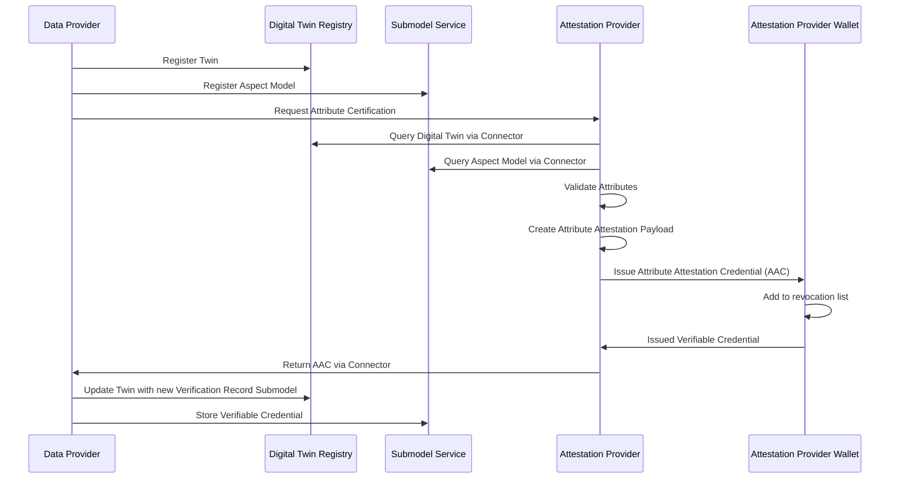
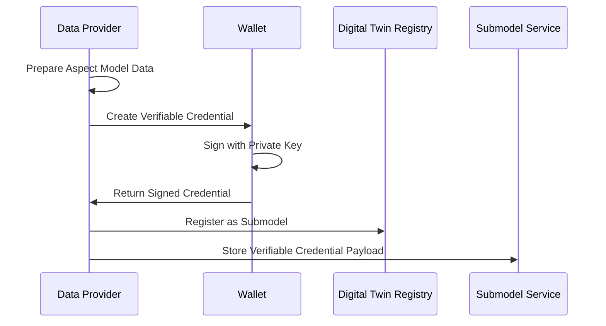
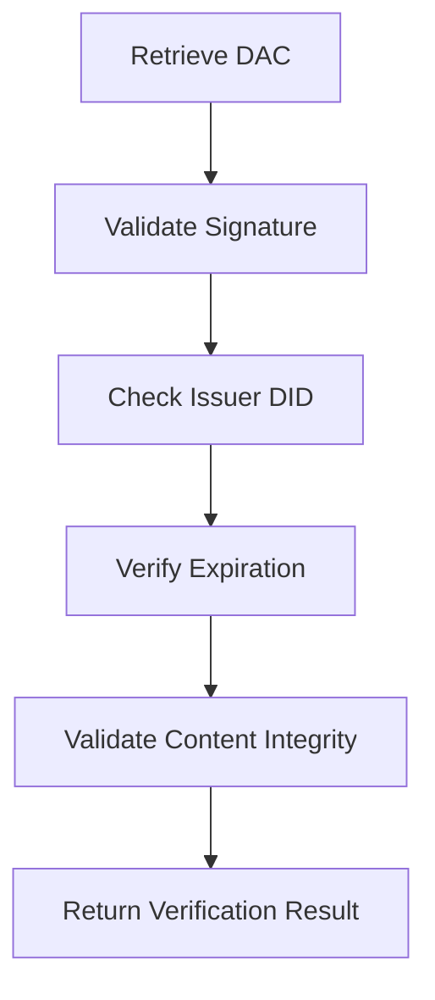
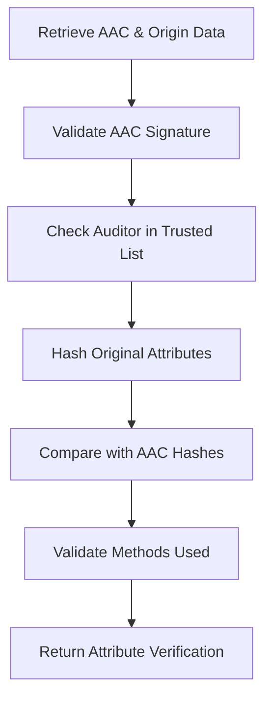
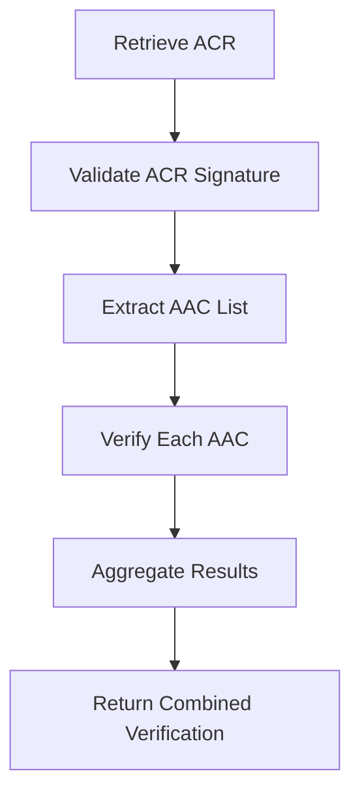

## Connecting with Your Digital Twins

### Using Certificates as Digital Twin Components

One of the most powerful features of the Data Trust & Security KIT is that you can attach verifiable credentials directly to your digital twins. This means when someone looks up a product or component in your Digital Twin Registry, they can immediately see the trust certificates associated with it.

Think of it like attaching a quality certificate to a physical product, except this is digital and cryptographically secured.

#### How It Works in Practice

When you register a digital twin, you can include submodels that contain verifiable credentials. Here's what this looks like technically:

#### Data Attestation Certificate as Submodel

Here’s an example of how a data attestation credential might look as a submodel:

```json
{
  "endpoints": [
      {
          "interface": "SUBMODEL-3.0",
          "protocolInformation": {
              "href": "https://<edc.dataplane>/api/public/data/urn:uuid:a377ff49-6bde-4215-8d38-b8f02c991a35/credential",
              "endpointProtocol": "HTTP",
              "endpointProtocolVersion": ["1.1"],
              "subprotocol": "DSP",
              "subprotocolBody": "id=urn:uuid:3e4a5957-f226-478a-ab18-79ced49d6195;dspEndpoint=https://edc.controlplane/api/v1/dsp",
              "subprotocolBodyEncoding": "plain",
              "securityAttributes": [
                  {
                      "type": "NONE",
                      "key": "NONE", 
                      "value": "NONE"
                  }
              ]
          }
      }
  ],
  "idShort": "pcfDataAttestation",
  "id": "urn:uuid:a377ff49-6bde-4215-8d38-b8f02c991a35",
  "semanticId": {
      "type": "ExternalReference",
      "keys": [
          {
              "type": "Entity",
              "value": "https://www.w3.org/ns/credentials/v2"
          },
          {
              "type": "DataElement", 
              "value": "urn:samm:io.catenax.certificate.dac:1.0.0#DataAttestationCredential"
          },
          {
              "type": "Submodel",
              "value": "urn:samm:io.catenax.pcf:7.0.0#Pcf"
          },
          {
              "type": "Operation",
              "value": "https://w3c.github.io/vc-jws-2020/contexts/v1/"
          }
      ]
  },
  "description": [
      {
          "language": "en",
          "text": "Verifiable Data Attestation Submodel"
      }
  ],
  "displayName": []
}
```

### Semantic ID Configuration

For different submodels, different semantic ID structures are used to identify various aspects and content types:

| Type | Description | Example |
|------|-------------|---------|
| `Entity` | Highest abstraction level indicating credential format | `https://www.w3.org/ns/credentials/v2` |
| `DataElement` | Type of verifiable credential/presentation | `urn:samm:io.catenax.certificate.dac:1.0.0#DataAttestationCertificate` |
| `Submodel` | Aspect model type and structure reference | `urn:samm:io.catenax.pcf:7.0.0#Pcf` |  
| `Operation` | Signature type context for verification | `https://w3c.github.io/vc-jws-2020/contexts/v1/` |

## Certification Processes

### Attribute Certification Process

The attribute certification process enables third-party auditors to verify specific attributes within aspect models:



### Self-Attestation Process

Data providers can self-attest their data by creating signed verifiable credentials:



### Complete Certification Process

The complete certification process combines self-attestation with third-party attribute verification:

1. **Data Provider** creates self-signed Data Attestation Credential (DAC)
2. **Attestation Provider** verifies specific attributes and creates Attribute Attestation Credentials (AAC)
3. **Data Provider** aggregates all certifications in an Attribute Certification Record (ACR)
4. **Data Consumer** can verify both self-attestation and third-party certifications

## Verification Methods

### Data Attestation Credential Verification

Complete data verification using self-signed credentials:



### Attribute Attestation Credential Verification

Attribute-level verification using selective disclosure:



### Batch Verification

For scenarios with multiple credentials:



### Verification Implementation Example

Here's a practical example showing how to implement credential verification with trusted list and revocation checking (in Python):

```python
import asyncio
import json
from typing import Dict, Any, Optional
from dataclasses import dataclass
from enum import Enum

@dataclass
class VerificationResult:
    is_valid: bool
    reason: str
    details: Optional[Dict[str, Any]] = None
    trusted_issuer: Optional[Dict[str, Any]] = None
    revocation_status: Optional[Dict[str, Any]] = None

@dataclass
class TrustedIssuerStatus:
    is_valid: bool
    reason: str
    issuer: Optional[Dict[str, Any]] = None
    public_key: Optional[str] = None
    accreditation_level: Optional[str] = None

@dataclass
class RevocationStatus:
    is_revoked: bool
    reason: str
    list_url: Optional[str] = None
    index: Optional[int] = None

class CredentialVerifier:
    def __init__(self, config: Dict[str, Any]):
        self.config = config
    
    async def verify_credential(self, credential: Dict[str, Any]) -> VerificationResult:
        try:
            # 1. Extract issuer DID from credential
            issuer_did = credential.get("issuer")
            if not issuer_did:
                return VerificationResult(
                    is_valid=False,
                    reason="No issuer DID found in credential"
                )
            
            # 2. Trusted List Validation - MANDATORY
            trusted_status = await self.check_trusted_list(issuer_did)
            if not trusted_status.is_valid:
                return VerificationResult(
                    is_valid=False,
                    reason=f"Issuer {issuer_did} not found in trusted list or inactive",
                    details=trusted_status.__dict__
                )
            
            # 3. Revocation Status Check - MANDATORY
            revocation_status = await self.check_revocation_status(credential)
            if revocation_status.is_revoked:
                return VerificationResult(
                    is_valid=False,
                    reason="Credential is revoked",
                    details=revocation_status.__dict__
                )
            
            # 4. Cryptographic Signature Verification
            signature_valid = await self.verify_signature(credential, trusted_status.public_key)
            if not signature_valid:
                return VerificationResult(
                    is_valid=False,
                    reason="Invalid cryptographic signature"
                )
            
            # 5. Schema and Structure Validation
            schema_valid = await self.validate_schema(credential)
            if not schema_valid:
                return VerificationResult(
                    is_valid=False,
                    reason="Credential schema validation failed"
                )
            
            return VerificationResult(
                is_valid=True,
                reason="Credential verification successful",
                trusted_issuer=trusted_status.__dict__,
                revocation_status=revocation_status.__dict__
            )
            
        except Exception as error:
            return VerificationResult(
                is_valid=False,
                reason=f"Verification error: {str(error)}"
            )
    
    async def check_trusted_list(self, issuer_did: str) -> TrustedIssuerStatus:
        trusted_list = await self.fetch_trusted_list()
        
        # Find issuer in trusted list
        issuer = None
        for trusted_issuer in trusted_list.get("issuers", []):
            if trusted_issuer.get("did") == issuer_did:
                issuer = trusted_issuer
                break
        
        if not issuer:
            return TrustedIssuerStatus(
                is_valid=False,
                reason="Issuer not in trusted list"
            )
        
        if issuer.get("status") != "ACTIVE":
            return TrustedIssuerStatus(
                is_valid=False,
                reason=f"Issuer status: {issuer.get('status')}"
            )
        
        return TrustedIssuerStatus(
            is_valid=True,
            reason="Issuer validated successfully",
            issuer=issuer,
            public_key=issuer.get("publicKey"),
            accreditation_level=issuer.get("accreditationLevel")
        )
    
    async def check_revocation_status(self, credential: Dict[str, Any]) -> RevocationStatus:
        credential_status = credential.get("credentialStatus")
        
        if not credential_status:
            # Policy decision: require revocation status or allow without it
            if self.config.get("requireRevocationStatus", False):
                return RevocationStatus(
                    is_revoked=True,
                    reason="No revocation status provided"
                )
            else:
                return RevocationStatus(
                    is_revoked=False,
                    reason="No revocation status check required"
                )
        
        revocation_list = await self.fetch_revocation_list(
            credential_status.get("revocationListCredential")
        )
        
        index = int(credential_status.get("revocationListIndex", 0))
        is_revoked = self.check_bitstring_index(
            revocation_list.get("credentialSubject", {}).get("encodedList", ""),
            index
        )
        
        return RevocationStatus(
            is_revoked=is_revoked,
            reason="Credential found in revocation list" if is_revoked else "Credential not revoked",
            list_url=credential_status.get("revocationListCredential"),
            index=index
        )
    
    async def fetch_trusted_list(self) -> Dict[str, Any]:
        """Fetch trusted issuer list from configured endpoint"""
        # Implementation would fetch from actual trusted list endpoint
        # This is a placeholder for the actual implementation
        return {"issuers": []}
    
    async def fetch_revocation_list(self, url: str) -> Dict[str, Any]:
        """Fetch revocation list from specified URL"""
        # Implementation would fetch from actual revocation list URL
        # This is a placeholder for the actual implementation
        return {"credentialSubject": {"encodedList": ""}}
    
    async def verify_signature(self, credential: Dict[str, Any], public_key: str) -> bool:
        """Verify cryptographic signature of the credential"""
        # Implementation would perform actual signature verification
        # This is a placeholder for the actual cryptographic verification
        return True
    
    async def validate_schema(self, credential: Dict[str, Any]) -> bool:
        """Validate credential against expected JSON-LD schema"""
        # Implementation would perform actual schema validation
        # This is a placeholder for the actual schema validation
        return True
    
    def check_bitstring_index(self, encoded_list: str, index: int) -> bool:
        """Check if credential index is marked as revoked in bitstring"""
        # Implementation would decode the bitstring and check the specific index
        # This is a placeholder for the actual bitstring checking
        return False

# Usage example
async def main():
    config = {
        "requireRevocationStatus": True,
        "trustedListUrl": "https://catena-x.net/trusted-list",
        "cacheTimeout": 300
    }
    
    verifier = CredentialVerifier(config)
    
    # Example credential to verify
    credential = {
        "issuer": "did:web:issuer.example.com:BPNL00000000W3BS",
        "credentialStatus": {
            "revocationListCredential": "https://issuer.example.com/revocation-list/2024/credentials.json",
            "revocationListIndex": "42"
        }
        # ... other credential fields
    }
    
    result = await verifier.verify_credential(credential)
    print(f"Verification result: {result}")

if __name__ == "__main__":
    asyncio.run(main())
```

This implementation demonstrates the mandatory integration of trusted list validation and revocation checking in the verification process, as required for secure credential verification.

## NOTICE

This work is licensed under the [CC-BY-4.0](https://creativecommons.org/licenses/by/4.0/legalcode).

- SPDX-License-Identifier: CC-BY-4.0
- SPDX-FileCopyrightText: 2025 Contributors to the Eclipse Foundation
- Source URL: [https://github.com/eclipse-tractusx/eclipse-tractusx.github.io](https://github.com/eclipse-tractusx/eclipse-tractusx.github.io)
