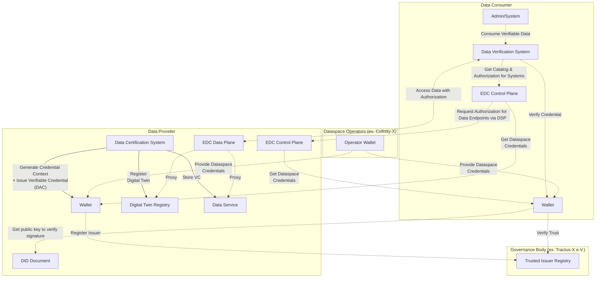

## Introduction

### What This Guide Is About

The Data Trust & Security KIT helps you build systems that can verify and trust data in an Eclipse Tractus-X network (like Catena-X). Think of it as a toolkit that ensures the data your company shares and receives is authentic, accurate, and trustworthy.

In today's world, you can't just accept data at face value - especially when it comes to sustainability, compliance, and supply chain information. This guide shows you how to implement verification mechanisms so that when someone shares carbon footprint data, battery information, or supply chain details, you can be confident it's legitimate.

### Standards Foundation

This KIT is built on established industry standards to ensure interoperability and compliance:

**W3C Standards:**

- **[Verifiable Credentials Data Model 2.0](https://www.w3.org/TR/vc-data-model-2.0/)** - Core framework for tamper-evident digital certificates
- **[JSON Web Signature 2020](https://w3c.github.io/vc-jws-2020/)** - Cryptographic signatures for JSON-LD documents
- **[Decentralized Identifiers (DIDs)](https://www.w3.org/TR/did-core/)** - Decentralized identity resolution

**Catena-X Standards:**

- **[CX-0002 Digital Twins](https://catenax-ev.github.io/docs/standards/CX-0002-DigitalTwinsInCatenaX)** - Asset registry integration
- **[CX-0029 PCF Rulebook](https://catenax-ev.github.io/docs/standards/overview)** - Product Carbon Footprint verification requirements

We'll walk you through everything you need to know: from setting up verification services and managing digital certificates, to integrating with existing Tractus-X components like the Eclipse Dataspace Components (EDC) Connector and Digital Twin Registry.

This KIT builds on proven technology from the [Digital Product Pass Verification Framework](https://github.com/eclipse-tractusx/digital-product-pass/blob/d48d7b67d742f4177bd6272b93897a9346a38819/dpp-verification/README.md), which has already shown how to verify data at both individual attribute and complete dataset levels.

## What You'll Find in This Guide

This guide is organized into practical sections that take you from basic concepts to full implementation:

1. **[Verifiable Credentials](./verifiable-credentials)** - The digital certificate technology that makes verification possible
2. **[Digital Twins & Storage](./integration-implementation)** - Practical steps to integrate with Digital Twins and existing systems and where to store the credentials.
3. **[Trust Verification](./trust-verification)** - How to build systems that can verify data authenticity
4. **[Security & Deployment](./security-deployment)** - How to deploy securely and follow best practices
5. **[API Specifications](./api-specifications)** - The REST APIs you'll use to integrate trust services into your applications

### Architecture Overview

Here's how the Data Trust & Security KIT fits into the larger Tractus-X ecosystem:



## Key Components

### The Trusted Issuer List - Who Can You Trust?

Think of the trusted issuer list as a phone book of organizations that are qualified to verify data. Just like you wouldn't trust medical advice from someone without a medical license, you shouldn't trust data verification from unqualified organizations.

The trusted list is maintained by governance bodies (like the Catena-X Association) and tells you:

- Which organizations can verify specific types of data (carbon footprints, battery information, etc.)
- Whether they're currently active or have been suspended
- What their qualifications and scope of expertise are

Each use case has its own list of qualified verifiers. For example, verifying carbon footprint data requires different expertise than verifying battery safety information.

#### What Goes Into the Trusted List

The trusted list uses a standardized format that machines can understand and process automatically:

```json
{
   "@context": [
     "https://www.w3.org/ns/odrl.jsonld",
     {
         "cx-policy": "https://w3id.org/catenax/policy/",
         "cx-trusted-list": "https://w3id.com/tractus-x/trusted-list/"
     }
   ],
   "type": "TrustedList",
   "owner": {
      "name": "Tractus-X Automotive Network e.V.",
      "@id": "did:web:catena-x.net"
    },
   "version": "1.0.0",
   "lastUpdated": "2024-01-15T10:30:00Z",
   "trustedIssuers": [
     {
        "type": "cx-policy:framework.generic:1",
        "status": "active",
        "name": "TÜV SÜD",
        "@id": "did:web:tuv-sud.de",
        "accreditationScope": [
          "data-quality-verification",
          "compliance-certification",
          "technical-standards-validation"
        ],
        "validFrom": "2024-01-01T00:00:00Z",
        "validUntil": "2025-12-31T23:59:59Z",
        "revocationEndpoint": "https://tuv-sud.de/revocation-list/2024/credentials.json"
     },
     {
        "type": "cx-policy:pcf.base:1",
        "status": "active", 
        "name": "Certification Authority Example",
        "@id": "did:web:cert-authority.example.com",
        "accreditationScope": [
          "carbon-footprint-verification",
          "sustainability-metrics"
        ],
        "validFrom": "2024-01-01T00:00:00Z",
        "validUntil": "2025-12-31T23:59:59Z",
        "revocationEndpoint": "https://cert-authority.example.com/revocation-list/2024/credentials.json"
     }
   ]
}
```

#### How the Trusted List Works

The trusted list implementation provides these key capabilities:

- **Specialized by Use Case** - Different lists for different types of data verification (carbon footprints, battery passports, etc.)
- **Real-time Updates** - Status can change in real-time if an organization loses accreditation or gets suspended
- **Multiple Trust Levels** - Some organizations might be qualified for basic verification, others for more complex assessments
- **Revocation Integration** - Links to systems that track whether specific certificates have been cancelled
- **Machine Readable** - Uses standardized formats so software can automatically check trust status

#### Verifier Status Levels

Each trusted verifier can have one of these statuses:

| Status | Description | Verification Impact |
|--------|-------------|-------------------|
| `active` | Issuer is currently trusted and can issue valid credentials | Credentials are accepted for verification |
| `suspended` | Issuer is temporarily suspended from issuing new credentials | Existing credentials remain valid, new ones rejected |
| `revoked` | Issuer's trust has been permanently revoked | All credentials from this issuer are rejected |
| `expired` | Issuer's accreditation period has ended | Credentials issued within validity period may still be valid |

## How Data Trust Actually Works

The Data Trust & Security KIT creates a comprehensive system for establishing and verifying trust in data within an Eclipse Tractus-X network (like Catena-X). Think of it as a multi-step verification process that ensures data integrity from source to consumer.

### What You Need Before You Start

Before you can implement data trust features, you need these foundational components:

| Component | Description | Repository/Standard | CX Standard |
|-----------|-------------|---------------------|-------------|
| Digital Twin Registry | Registry for digital twin metadata and endpoints | eclipse-tractusx/sldt-digital-twin-registry | CX-0002 |
| Eclipse Dataspace Components (EDC) Connector | Data exchange infrastructure | eclipse-tractusx/tractusx-edc | CX-0018 |
| Wallet Service | SSI wallet for credential management | eclipse-tractusx/identity-hub | CX-0049 |
| Operator Wallet | SSI wallet for credential issuance | eclipse-tractusx/ssi-credential-issuer | CX-0049 |
| Trusted List Service | Management of accredited issuers | To be defined | Future CX Standard |

### How Trust Gets Established

Trust doesn't just happen - it's built through a systematic process involving multiple parties:

#### Phase 1: Getting Organizations Qualified as Verifiers

Before anyone can verify data, they need to prove they're qualified:

1. **Application** - Organizations apply to become trusted verifiers
2. **Compliance Check** - Experts review their qualifications and processes
3. **Approval** - If they meet the standards, they're added to the trusted list
4. **Ongoing Reviews** - Regular checks ensure they maintain their qualifications

#### Phase 2: Creating Verified Certificates

Once qualified, verifiers can create digital certificates for data:

1. **Data Review** - Verifiers examine the data for accuracy and completeness
2. **Certificate Creation** - They generate digital certificates using standard formats
3. **Digital Signing** - Certificates get cryptographically signed to prevent tampering
4. **Publication** - Certificates are made available through secure channels

#### Phase 3: Verifying Data When You Receive It

When you receive data with certificates, you need to verify everything is legitimate:

1. **Get the Certificate** - Retrieve the digital certificate from the data provider or Digital Twin Registry
2. **Check the Verifier** - Make sure the organization that issued the certificate is on the trusted list and is still active
3. **Verify the Signature** - Use cryptographic methods to confirm the certificate hasn't been tampered with
4. **Check for Revocation** - Ensure the certificate hasn't been cancelled or revoked
5. **Validate the Format** - Confirm the certificate follows the correct structure and standards
6. **Make Your Decision** - Based on all these checks, decide whether to trust the data

**Important**: All these verification steps are mandatory. Skipping any step could mean accepting fraudulent or tampered data.

## Building Your Implementation

### The Big Picture

The Data Trust & Security KIT gives you a flexible framework for adding data verification to your Tractus-X applications. The beauty of this system is that it works across different types of data and use cases while keeping your data secure and under your control.

Think of it as building a second layer of trust on top of your existing data exchanges. You're already sharing data through an Eclipse Tractus-X network (like Catena-X) - now you can add cryptographic proof that this data is authentic and hasn't been tampered with.

The system uses proven technology called Verifiable Credentials (a W3C standard) combined with digital wallets and cryptographic signatures. When a data provider creates a certificate, they sign it with their private key. When you receive the data, you can verify it using their public key - just like how HTTPS certificates work on websites.

### The Technical Components

Your trust framework needs several components working together:

## Getting Started - Your Implementation Roadmap

Ready to add data trust to your application? Here's a practical step-by-step approach:

1. **Read the Documentation** - Start with the detailed guides linked at the top of this page to understand the concepts and technical details

2. **Set Up Your Infrastructure** - Make sure you have the required Tractus-X components running:
   - Eclipse Dataspace Components (EDC) Connector for data exchange
   - Digital Twin Registry for metadata management  
   - Wallet services for managing digital identities and credentials

3. **Integrate the Trust APIs** - Use our REST APIs to add verification capabilities to your applications

4. **Configure Security** - Follow our security guidelines to deploy safely in your environment

5. **Test With Sample Data** - Start with our example credentials and test data to make sure everything works

6. **Deploy and Monitor** - Roll out your trust verification services and integrate them with your data flows

Each section in this guide provides detailed technical information, code examples, and integration patterns to help you succeed.

## Real-World Example: Digital Product Pass Verification

### How It Works in Practice

The Digital Product Pass project has already implemented the concepts from this Data Trust & Security KIT, giving you a real example of how everything works together.

This implementation creates a trust layer on top of normal data exchanges between companies. Here's what it does:

- **Enables Auditor Verification** - Independent auditors can verify specific data attributes or complete datasets
- **Provides Consumer Validation** - Data consumers can check whether the verification is legitimate
- **Maintains Data Sovereignty** - Companies keep control of their data while still enabling verification
- **Uses Standard Technology** - Built on Verifiable Credentials and existing Catena-X infrastructure

The system is designed to be a template that other use cases can follow. Whether you're working with carbon footprints, battery passports, or any other type of data, you can use the same verification patterns.

**Key Innovation**: The system offers both third-party verification (by external auditors) and self-attestation (where companies certify their own data), giving you flexibility based on your trust requirements.

Since it uses the Eclipse Dataspace Components (EDC) Connector for data exchange, it fits seamlessly into the existing Catrna-X architecture without requiring major changes to how data flows between companies.

**Learn More**: You can find detailed information about this implementation in the [Digital Product Pass Verification Success Story](../success-stories/dpp-verification-success-story.md).

**Complete Documentation**: The complete implementation is available at [eclipse-tractusx/digital-product-pass/dpp-verification](https://github.com/eclipse-tractusx/digital-product-pass/blob/d48d7b67d742f4177bd6272b93897a9346a38819/dpp-verification/README.md)

## NOTICE

This work is licensed under the [CC-BY-4.0](https://creativecommons.org/licenses/by/4.0/legalcode).

- SPDX-License-Identifier: CC-BY-4.0
- SPDX-FileCopyrightText: 2025 Contributors to the Eclipse Foundation
- Source URL: [https://github.com/eclipse-tractusx/eclipse-tractusx.github.io](https://github.com/eclipse-tractusx/eclipse-tractusx.github.io)
