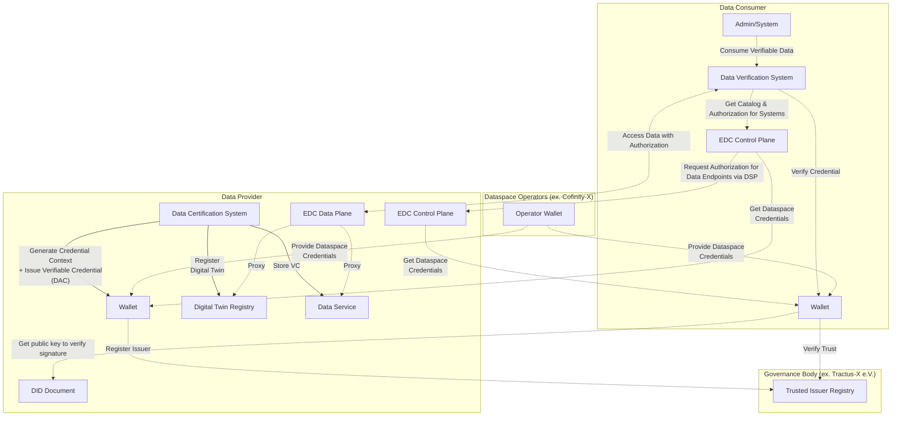

## Introduction

### What This Guide Is About

The Data Trust & Security KIT helps you build systems that can verify and trust data in an Eclipse Tractus-X network (like Catena-X). Think of it as a toolkit that ensures the data your company shares and receives is authentic, accurate, and trustworthy.

In today's world, you can't just accept data at face value - especially when it comes to sustainability, compliance, and supply chain information. This guide shows you how to implement verification mechanisms so that when someone shares carbon footprint data, battery information, or supply chain details, you can be confident it's legitimate.

### Standards Foundation

This KIT is built on established industry standards to ensure interoperability and compliance:

### Architecture Overview

Here's how the Data Trust & Security KIT fits into the larger Tractus-X ecosystem:

## Real-World Example: Digital Product Pass Verification

### How It Works in Practice

The Digital Product Pass project has already implemented the concepts from this Data Trust & Security KIT, giving you a real example of how everything works together.

This implementation creates a trust layer on top of normal data exchanges between companies. Here's what it does:

- **Enables Auditor Verification** - Independent auditors can verify specific data attributes or complete datasets
- **Provides Consumer Validation** - Data consumers can check whether the verification is legitimate
- **Maintains Data Sovereignty** - Companies keep control of their data while still enabling verification
- **Uses Standard Technology** - Built on Verifiable Credentials and existing Catena-X infrastructure

The system is designed to be a template that other use cases can follow. Whether you're working with carbon footprints, battery passports, or any other type of data, you can use the same verification patterns.

**Key Innovation**: The system offers both third-party verification (by external auditors) and self-attestation (where companies certify their own data), giving you flexibility based on your trust requirements.

Since it uses the Eclipse Dataspace Components (EDC) Connector for data exchange, it fits seamlessly into the existing Catena-X architecture without requiring major changes to how data flows between companies.

**Learn More**: You can find detailed information about this implementation in the [Digital Product Pass Verification Success Story](../success-stories/dpp-verification-success-story.mdx).

**Complete Documentation**: The complete implementation is available at [eclipse-tractusx/digital-product-pass/dpp-verification](https://github.com/eclipse-tractusx/digital-product-pass/blob/d48d7b67d742f4177bd6272b93897a9346a38819/dpp-verification/README.md)

## NOTICE

This work is licensed under the [CC-BY-4.0](https://creativecommons.org/licenses/by/4.0/legalcode).

- SPDX-License-Identifier: CC-BY-4.0
- SPDX-FileCopyrightText: 2025 Contributors to the Eclipse Foundation
- Source URL: [https://github.com/eclipse-tractusx/eclipse-tractusx.github.io](https://github.com/eclipse-tractusx/eclipse-tractusx.github.io)
