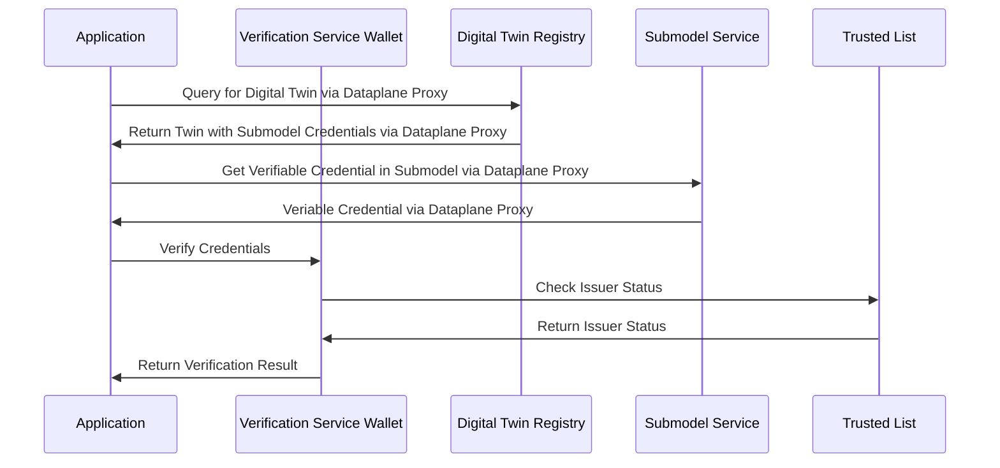

## Security Guidelines

### Cryptographic Standards

The Data Trust & Security KIT relies on proven cryptographic methods that comply with industry standards:

#### W3C Specifications

- **[W3C Verifiable Credentials](https://www.w3.org/TR/vc-data-model-2.0/)** - Secure credential format and verification procedures
- **[W3C JSON Web Signature 2020](https://w3c.github.io/vc-jws-2020/)** - Cryptographic signature standards for JSON-LD documents
- **[W3C DID Core](https://www.w3.org/TR/did-core/)** - Decentralized identifier security requirements

#### Cryptographic Implementation

- **Digital Signatures**: Uses Ed25519 and RSA to keep credentials secure
- **Key Management**: Keys are generated, stored, and rotated securely
- **Hash Functions**: SHA3-512 helps verify data integrity
- **Encryption**: AES-256 protects sensitive information

#### Catena-X Compliance

- **[CX-0006 Registration](https://catenax-ev.github.io/docs/standards/overview)** - Identity verification and onboarding security

### Privacy Protection

Privacy is built into the KIT from the start:

- **Selective Disclosure**: Only the necessary credential attributes are revealed
- **Zero-Knowledge Proofs**: You can verify data without exposing the details
- **Data Minimization**: Only collect and process what’s needed
- **Consent Management**: Users have clear control over data processing

### Threat Modeling

Here’s how the KIT tackles key security threats:

| Threat | Mitigation | Implementation |
|--------|------------|----------------|
| Credential Forgery | Cryptographic signatures | Digital signature verification |
| Man-in-the-Middle | TLS encryption | HTTPS enforcement |
| Replay Attacks | Timestamp validation | Credential expiration checks |
| Key Compromise | Key rotation | Regular key updates |
| Revocation Bypass | Revocation checking | Real-time status verification |

## Deployment Patterns

### Centralized Deployment

In a centralized approach:

- **Governance Entity** manages the trusted list
- **Core Service Providers** host verification services
- **Simplified Management** with single point of control
- **Suitable for** initial deployments and smaller networks

## Integration Guidelines

### Integration with Digital Twin Registry

The KIT integrates seamlessly with Digital Twin Registry:



## Supported Signature Types

The Data Trust & Security KIT supports multiple cryptographic signature types:

### Ed25519Signature2020 **Recommended**

Fast, secure, and modern. Perfect for new implementations.

- **Security**: Excellent, quantum-resistant
- **Performance**: Fastest (50k+ operations/sec)
- **Key Size**: 32 bytes

```json
{
    "proof": {
        "type": "Ed25519Signature2020",
        "created": "2024-01-15T10:30:00Z",
        "verificationMethod": "did:web:issuer.example.com#key-1",
        "proofPurpose": "assertionMethod",
        "proofValue": "z5vDVKmhQKyiPj4E2fNvRFDqJ9..."
    }
}
```

### JsonWebSignature2020 **Enterprise**

Industry standard JWT format. Great for enterprise integration.

- **Security**: Very good, depends on algorithm
- **Performance**: Good, flexible algorithms
- **Compatibility**: Works with existing JWT systems

```json
{
    "proof": {
        "type": "JsonWebSignature2020",
        "created": "2024-01-15T10:30:00Z",
        "verificationMethod": "did:web:issuer.example.com#key-1",
        "proofPurpose": "assertionMethod",
        "jws": "eyJ0eXAiOiAidmMrbGQiLCAiYjY0IjogZmFsc2UsICJjcnYi..."
    }
}
```

### BbsBlsSignature2020 **Privacy**

Enables selective disclosure and zero-knowledge proofs.

- **Security**: Excellent for privacy
- **Performance**: Slower, specialized use
- **Use Case**: When you need to hide some data while proving others

```json
{
    "proof": {
        "type": "BbsBlsSignature2020",
        "created": "2024-01-15T10:30:00Z",
        "verificationMethod": "did:web:issuer.example.com#key-1",
        "proofPurpose": "assertionMethod",
        "proofValue": "lAjGJkMNBU49r..."
    }
}
```

### RsaSignature2018 **Legacy Only**

Only use for legacy system compatibility.

- **Security**: Acceptable with 3072+ bit keys
- **Performance**: Slow, large signatures
- **Quantum**: Vulnerable to future quantum attacks

```json
{
    "proof": {
        "type": "RsaSignature2018",
        "created": "2024-01-15T10:30:00Z",
        "verificationMethod": "did:web:issuer.example.com#key-1",
        "proofPurpose": "assertionMethod",
        "signatureValue": "AN1rKvtNZEJzb..."
    }
}
```

#### Quick Selection Guide

| Use Case | Choose This | Why |
|----------|-------------|-----|
| New system | Ed25519Signature2020 | Best performance + security |
| Enterprise integration | JsonWebSignature2020 | JWT compatibility |
| Privacy-sensitive data | BbsBlsSignature2020 | Selective disclosure |
| Legacy system | RsaSignature2018 | Only if required |

#### Security Considerations by Signature Type

##### Quantum Computing Threat Timeline

- **Current (2024-2030)**: All signature types provide adequate security
- **Near-term (2030-2040)**: RSA and ECDSA become vulnerable, Ed25519 weakened
- **Long-term (2040+)**: Post-quantum signatures required for critical applications

##### Performance Comparison (operations per second)

1. **Ed25519Signature2020**: ~50,000 signatures/sec, ~20,000 verifications/sec
2. **JsonWebSignature2020 (Ed25519)**: ~45,000 signatures/sec, ~18,000 verifications/sec
3. **EcdsaSecp256k1Signature2019**: ~10,000 signatures/sec, ~5,000 verifications/sec
4. **RsaSignature2018 (2048-bit)**: ~1,000 signatures/sec, ~30,000 verifications/sec
5. **BbsBlsSignature2020**: ~500 signatures/sec, ~200 verifications/sec

##### Key Management Requirements

- **Ed25519/JsonWebSignature2020**: Standard key generation and storage
- **RSA**: Requires larger key storage and more complex key generation
- **BBS+**: Requires specialized cryptographic libraries and key management
- **ECDSA**: Standard elliptic curve key management practices

## Implementation Guidelines

### Recommended Requirements

- All implementations SHALL support Ed25519Signature2020
- All implementations SHALL support JsonWebSignature2020 with Ed25519
- Signature verification SHALL validate the signature type against trusted issuer capabilities
- Key rotation SHALL be supported for all signature types

### Recommended Practices

- Use Ed25519Signature2020 as the default for new implementations
- Implement JsonWebSignature2020 for enterprise integration scenarios
- Consider BbsBlsSignature2020 for privacy-sensitive use cases
- Plan for post-quantum signature migration by 2035

### Deprecated/Discouraged

- RSA signatures below 3072-bit key size
- SHA-1 based signatures (use SHA3-512 minimum)
- Custom or proprietary signature schemes
- Signature types without proper W3C or IETF standardization

## Best Practices

### For Attestation Providers

- **Regular Key Rotation**: Implement automated key rotation schedules
- **Data Validation**: Thoroughly validate data before credential issuance
- **Revocation Management**: Maintain up-to-date revocation lists
- **Compliance Monitoring**: Regular self-audits against accreditation requirements

### For Data Consumers

- **Always Check Revocation**: Never skip revocation status checks
- **Validate Issuer Status**: Ensure issuer is currently trusted
- **Implement Caching**: Cache verification results appropriately
- **Error Handling**: Graceful handling of verification failures

### For Data Providers

- **Security First**: Prioritize security in all implementation decisions
- **Standard Compliance**: Adhere to established W3C and Catena-X standards
- **Monitoring & Logging**: Comprehensive monitoring and audit logging
- **Documentation**: Maintain clear documentation for all integrations

## NOTICE

This work is licensed under the [CC-BY-4.0](https://creativecommons.org/licenses/by/4.0/legalcode).

- SPDX-License-Identifier: CC-BY-4.0
- SPDX-FileCopyrightText: 2025 Contributors to the Eclipse Foundation
- Source URL: [https://github.com/eclipse-tractusx/eclipse-tractusx.github.io](https://github.com/eclipse-tractusx/eclipse-tractusx.github.io)
