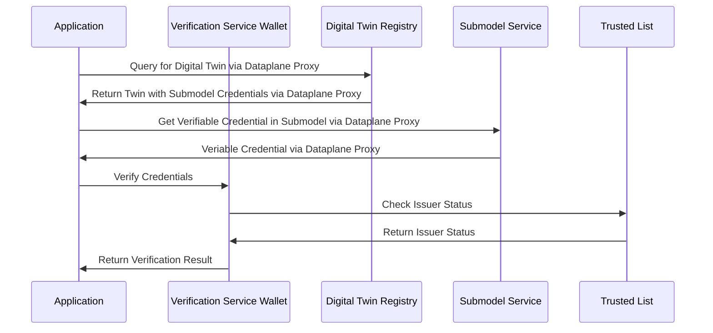

## Security Considerations

### Cryptographic Standards

The Data Trust & Security KIT uses industry-standard cryptographic approaches:

- **Digital Signatures**: Ed25519 and RSA signatures for credential integrity
- **Key Management**: Secure key generation, storage, and rotation procedures
- **Hash Functions**: SHA3-512 for data integrity verification
- **Encryption**: AES-256 for sensitive data protection

### Privacy Protection

Privacy considerations are integral to the KIT design:

- **Selective Disclosure**: Support for revealing only necessary credential attributes
- **Zero-Knowledge Proofs**: Enable verification without revealing underlying data
- **Data Minimization**: Limit data collection and processing to necessary minimum
- **Consent Management**: Clear consent mechanisms for data processing

### Threat Modeling

Key security threats addressed:

| Threat | Mitigation | Implementation |
|--------|------------|----------------|
| Credential Forgery | Cryptographic signatures | Digital signature verification |
| Man-in-the-Middle | TLS encryption | HTTPS enforcement |
| Replay Attacks | Timestamp validation | Credential expiration checks |
| Key Compromise | Key rotation | Regular key updates |
| Revocation Bypass | Revocation checking | Real-time status verification |

## Deployment Patterns

### Centralized Deployment

In a centralized approach:

- **Governance Entity** manages the trusted list
- **Core Service Providers** host verification services
- **Simplified Management** with single point of control
- **Suitable for** initial deployments and smaller networks

## Integration Guidelines

### Integration with Digital Twin Registry

The KIT integrates seamlessly with Digital Twin Registry:

## Best Practices

### For Issuers

- **Regular Key Rotation**: Implement automated key rotation schedules
- **Data Validation**: Thoroughly validate data before credential issuance
- **Revocation Management**: Maintain up-to-date revocation lists
- **Compliance Monitoring**: Regular self-audits against accreditation requirements

### For Verifiers

- **Always Check Revocation**: Never skip revocation status checks
- **Validate Issuer Status**: Ensure issuer is currently trusted
- **Implement Caching**: Cache verification results appropriately
- **Error Handling**: Graceful handling of verification failures

### For Implementers

- **Security First**: Prioritize security in all implementation decisions
- **Standard Compliance**: Adhere to established W3C and Catena-X standards
- **Monitoring & Logging**: Comprehensive monitoring and audit logging
- **Documentation**: Maintain clear documentation for all integrations

## NOTICE

This work is licensed under the [CC-BY-4.0](https://creativecommons.org/licenses/by/4.0/legalcode).

- SPDX-License-Identifier: CC-BY-4.0

- SPDX-FileCopyrightText: 2025 Contributors to the Eclipse Foundation

- Source URL: [https://github.com/eclipse-tractusx/eclipse-tractusx.github.io](https://github.com/eclipse-tractusx/eclipse-tractusx.github.io