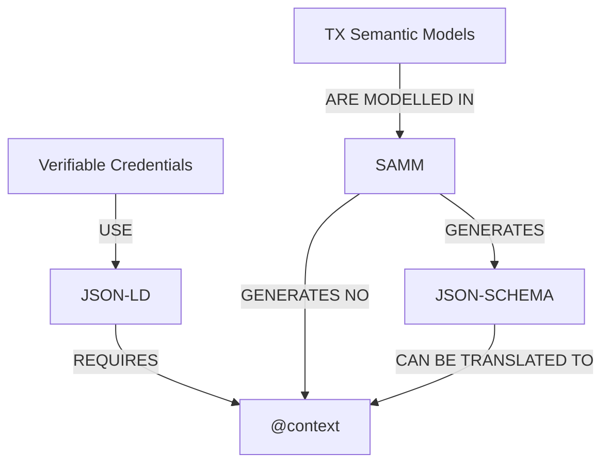
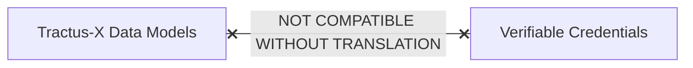
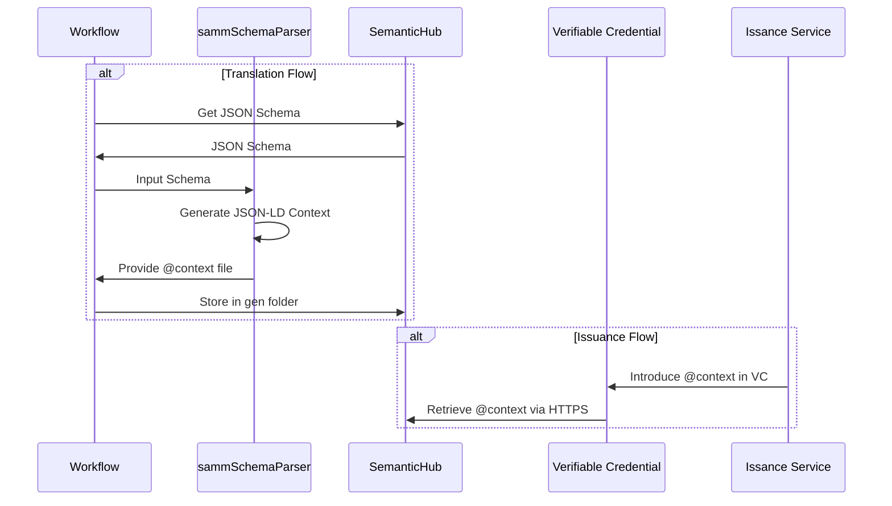

## Enabling SAMM Standardized Aspect Models with Verifiable Credentials

In order to enable the Eclipse Tractus-X Semantic Models to be used in Verifiable Credentials there is the need to generate JSON-LD "@context" for the data format.

Therefore, for making these two technologies compatible, it is necessary to make a translation from the standard JSON Schemas to the JSON-LD "@context" for the desired aspect models.

## Creating the @context

The solution is to create automatic translation between these standards:

This diagram shows the current incompatibility:



The reality is:



### The Translation Solution

We solve this by automatically converting SAMM JSON schemas into JSON-LD contexts:


This tool acts as a translator, taking the data validation rules from SAMM and converting them into the semantic context that Verifiable Credentials need.

## The Translation Tool

Here's the technical implementation that makes this translation possible:

```python
import traceback
import logging
from utilities.operators import op
import copy

logger = logging.getLogger('staging')

class sammSchemaParser:
    def __init__(self):
        self.baseSchema = {}
        self.rootRef = "#"
        self.refKey = "$ref"
        self.pathSep = "#/"
        self.actualPathSep = "/-/"
        self.refPathSep = "/"
        self.propertiesKey = "properties"
        self.itemKey = "items"
        self.schemaPrefix = "schema"
        self.aspectPrefix = "aspect"
        self.contextPrefix = "@context"
        self.recursionDepth = 2
        self.depht = 0
        self.initialJsonLd = {
            "@version": 1.1,
            self.schemaPrefix: "https://schema.org/"
        }
        self.contextTemplate = {
            "@version": 1.1,
            "id": "@id",
            "type": "@type"
        }

    def schema_to_jsonld(self, semanticId, schema, aspectPrefix="aspect"):
        try:
            self.baseSchema = schema.copy()
            parts = semanticId.split(self.rootRef)
            if len(parts) < 2 or not parts[1]:
                raise Exception("Invalid semantic id, missing the model reference!")
            if aspectPrefix:
                self.aspectPrefix = aspectPrefix

            node = self.create_node(schema)
            if not node:
                raise Exception("It was not possible to generated the json-ld!")

            ctx = self.initialJsonLd.copy()
            semanticPath, aspectName = parts
            ctx[self.aspectPrefix] = semanticPath + self.rootRef
            node["@id"] = f"{self.aspectPrefix}:{aspectName}"
            ctx[aspectName] = node
            if "description" in schema:
                ctx[aspectName].setdefault("@context", {})["@definition"] = schema["description"]
            return {"@context": ctx}
        except:
            traceback.print_exc()
            raise Exception("It was not possible to create jsonld schema")

    def expand_node(self, ref, actualref, key=None):
        try:
            if not ref: return None
            node = self.get_schema_ref(ref, actualref)
            if not node: return None
            return self.create_node(node, actualref=self.actualPathSep.join([actualref, ref]), key=key)
        except:
            traceback.print_exc()
            logger.error("It was not possible to get schema reference")
            return None

    def create_node(self, property, actualref="", key=None):
        try:
            if not property or "type" not in property: return None
            node = self.create_simple_node(property, key)
            if not node: return None

            if property["type"] == "object":
                return self.create_object_node(property, node, actualref)
            if property["type"] == "array":
                return self.create_array_node(property, node, actualref)
            return self.create_value_node(property, node)
        except:
            traceback.print_exc()
            logger.error("It was not possible to create the node")
            return None

    def create_value_node(self, property, node):
        try:
            if "type" not in property: return None
            node["@type"] = f"{self.schemaPrefix}:{property['type']}"
            return node
        except:
            traceback.print_exc()
            logger.error("It was not possible to create value node")
            return None

    def create_object_node(self, property, node, actualref):
        try:
            if self.propertiesKey not in property: return None
            node[self.contextPrefix] = self.create_properties_context(property[self.propertiesKey], actualref)
            return node
        except:
            traceback.print_exc()
            logger.error("It was not possible to create object node")
            return None

    def create_array_node(self, property, node, actualref):
        try:
            if self.itemKey not in property: return None
            item = property[self.itemKey]
            node["@container"] = "@list"
            if isinstance(item, list): return node
            if self.refKey not in item:
                return self.create_value_node(item, node)
            node[self.contextPrefix] = self.create_item_context(item, actualref)
            return node
        except:
            traceback.print_exc()
            logger.error("It was not possible to create the array node")
            return None

    def filter_key(self, key):
        return key.replace("@", "").replace(" ", "-")

    def create_properties_context(self, properties, actualref):
        try:
            if not isinstance(properties, dict) or not properties: return None
            context = self.contextTemplate.copy()
            for propKey, prop in properties.items():
                key = self.filter_key(propKey)
                node = self.create_node_property(key, prop, actualref)
                if node: context[key] = node
            return context
        except:
            traceback.print_exc()
            logger.error("It was not possible to create properties context")
            return None

    def create_item_context(self, item, actualref):
        try:
            if not item: return None
            context = self.contextTemplate.copy()
            node = self.expand_node(item[self.refKey], actualref)
            if not node: return None
            context.update(node)
            if "description" in item:
                context.setdefault("@context", {})["@definition"] = item["description"]
            return context
        except:
            traceback.print_exc()
            logger.error("It was not possible to create the item context")
            return None

    def create_node_property(self, key, node, actualref):
        try:
            if not key or not node or self.refKey not in node: return None
            propNode = self.expand_node(node[self.refKey], actualref, key)
            if not propNode: return None
            if "description" in node:
                propNode.setdefault("@context", {})["@definition"] = node["description"]
            return propNode
        except:
            traceback.print_exc()
            logger.error("It was not possible to create node property")
            return None

    def create_simple_node(self, property, key=None):
        try:
            if not property: return None
            node = {"@id": f"{self.aspectPrefix}:{key}"} if key else {}
            if "description" in property:
                node.setdefault("@context", {})["@definition"] = property["description"]
            return node
        except:
            traceback.print_exc()
            logger.error("It was not possible to create the simple node")
            return None

    def get_schema_ref(self, ref, actualref):
        try:
            if not isinstance(ref, str): return None
            if ref in actualref:
                if self.depht >= self.recursionDepth:
                    logger.warning(f"[WARNING] Infinite recursion detected: ref[{ref}], refPath[{actualref}]")
                    self.depht = 0
                    return None
                self.depht += 1
            path = ref.removeprefix(self.pathSep)
            return op.get_attribute(self.baseSchema, path, self.refPathSep)
        except:
            traceback.print_exc()
            logger.error("It was not possible to get schema reference")
            return None
```

## Implementation Examples

### PCF Context Generation Example

Here's how the `sammSchemaParser` generates a JSON-LD context for a Product Carbon Footprint (PCF) semantic model:

```python
# Example usage for PCF semantic model
parser = sammSchemaParser()

# SAMM semantic ID for PCF model
semantic_id = "urn:samm:io.catenax.pcf:7.0.0#Pcf"

# JSON Schema generated by SAMM
pcf_schema = {
    "type": "object",
    "properties": {
        "specVersion": {
            "type": "string",
            "description": "Version of the specification"
        },
        "companyIds": {
            "type": "array",
            "items": {"type": "string"},
            "description": "Company identifiers"
        },
        "pcf": {
            "$ref": "#/definitions/PcfDetails",
            "description": "Product Carbon Footprint details"
        }
    },
    "definitions": {
        "PcfDetails": {
            "type": "object",
            "properties": {
                "pcfExcludingBiogenic": {
                    "type": "number",
                    "description": "PCF excluding biogenic emissions"
                },
                "fossilGhgEmissions": {
                    "type": "number",
                    "description": "Fossil GHG emissions"
                }
            }
        }
    }
}

# Generate JSON-LD context
context = parser.schema_to_jsonld(semantic_id, pcf_schema)
```

### Generated JSON-LD Context

The parser would generate the following JSON-LD context:

```json
{
    "@context": {
        "@version": 1.1,
        "schema": "https://schema.org/",
        "aspect": "urn:samm:io.catenax.pcf:7.0.0#",
        "id": "@id",
        "type": "@type",
        "Pcf": {
            "@id": "aspect:Pcf",
            "@context": {
                "@version": 1.1,
                "id": "@id",
                "type": "@type",
                "specVersion": {
                    "@id": "aspect:specVersion",
                    "@type": "schema:string",
                    "@context": {
                        "@definition": "Version of the specification"
                    }
                },
                "companyIds": {
                    "@id": "aspect:companyIds",
                    "@container": "@list",
                    "@context": {
                        "@version": 1.1,
                        "id": "@id",
                        "type": "@type",
                        "@type": "schema:string"
                    }
                },
                "pcf": {
                    "@id": "aspect:pcf",
                    "@context": {
                        "@version": 1.1,
                        "id": "@id",
                        "type": "@type",
                        "pcfExcludingBiogenic": {
                            "@id": "aspect:pcfExcludingBiogenic",
                            "@type": "schema:number",
                            "@context": {
                                "@definition": "PCF excluding biogenic emissions"
                            }
                        },
                        "fossilGhgEmissions": {
                            "@id": "aspect:fossilGhgEmissions",
                            "@type": "schema:number",
                            "@context": {
                                "@definition": "Fossil GHG emissions"
                            }
                        }
                    }
                }
            }
        }
    }
}
```

## Integration with Verifiable Credentials

### Context Integration Process

Once the JSON-LD context is generated, it can be integrated into verifiable credentials:

1. **Context Generation**: Use `sammSchemaParser` to convert SAMM JSON Schema to JSON-LD context
2. **Context Hosting**: Host the generated context at a stable URL (Eclipse Tractus-X models must be stored in the [eclipse-tractusx/sldt-semantic-models](https://github.com/eclipse-tractusx/sldt-semantic-models) repository and be available in raw format for the public internet)
3. **Credential Creation**: Reference the hosted context in verifiable credentials for it to be verified.
4. **Semantic Validation**: Expand the verifiable credential JSON-LD document, to reveal inconsistencies with the semantics.

### Example Verifiable Credential with Generated Context

```json
{
    "@context": [
        "https://www.w3.org/ns/credentials/v2",
        "https://w3c.github.io/vc-jws-2020/contexts/v1/",
        "https://raw.githubusercontent.com/eclipse-tractusx/sldt-semantic-models/main/io.catenax.pcf/7.0.0/gen/Pcf-context.jsonld"
    ],
    "type": [
        "VerifiableCredential",
        "DataAttestationCredential",
        "Pcf"
    ],
    "semanticId": "urn:samm:io.catenax.pcf:7.0.0#Pcf",
    "credentialSubject": {
        "Pcf": {
            "specVersion": "urn:io.catenax.pcf:datamodel:version:7.0.0",
            "companyIds": ["https://example.com/company1"],
            "pcf": {
                "pcfExcludingBiogenic": 2.5,
                "fossilGhgEmissions": 1.8
            }
        }
    },
    "issuer": "did:web:company.example.com",
    "validFrom": "2024-01-15T10:30:00Z",
    "validUntil": "2025-01-15T10:30:00Z",
    "proof": {
        "type": "Ed25519Signature2020",
        "created": "2024-01-15T10:30:00Z",
        "verificationMethod": "did:web:company.example.com#key-1",
        "proofPurpose": "assertionMethod",
        "proofValue": "z5vDVKmhQKyiPj..."
    }
}
```

## Semantic Validation Process

### Validation Workflow

The semantic validation process follows these steps:



## NOTICE

This work is licensed under the [CC-BY-4.0](https://creativecommons.org/licenses/by/4.0/legalcode).

- SPDX-License-Identifier: CC-BY-4.0
- SPDX-FileCopyrightText: 2025 Contributors to the Eclipse Foundation
- Source URL: [https://github.com/eclipse-tractusx/eclipse-tractusx.github.io](https://github.com/eclipse-tractusx/eclipse-tractusx.github.io)
