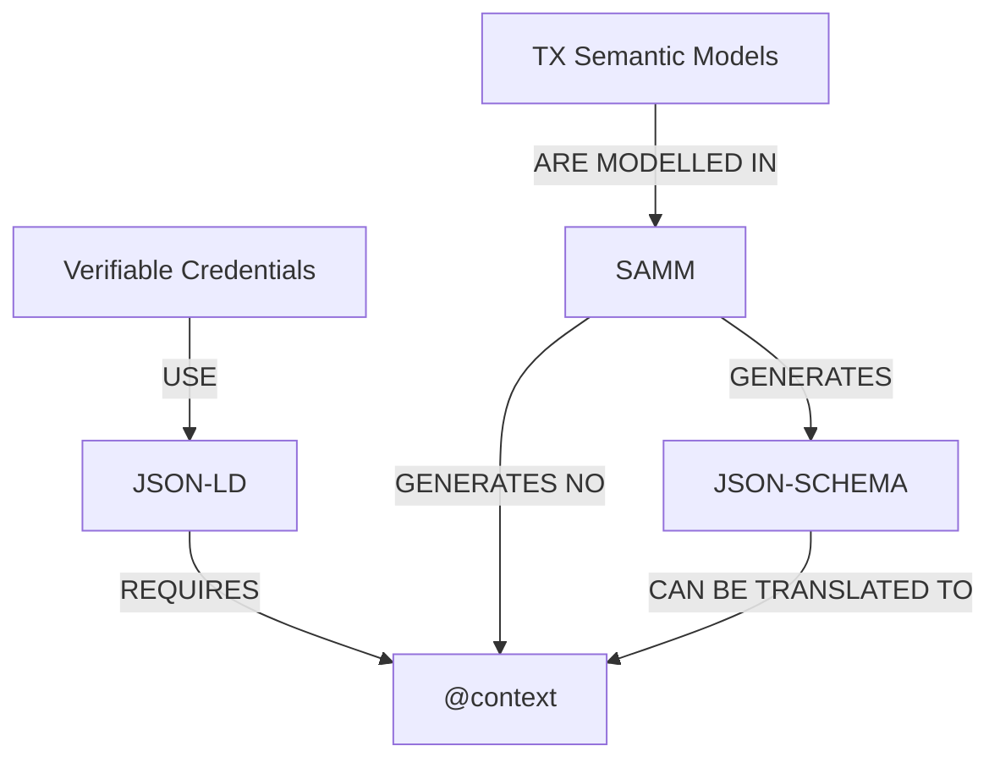
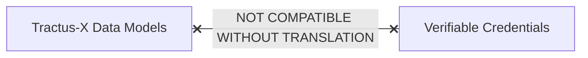
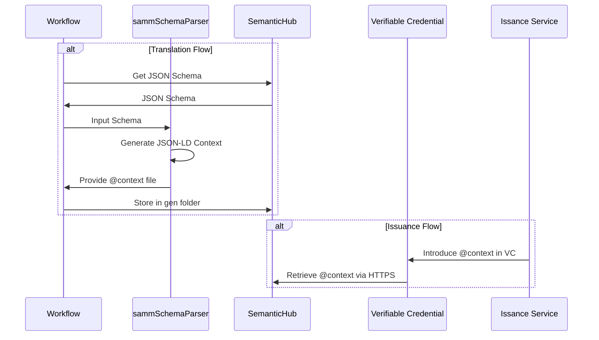

## Enabling SAMM Standardized Aspect Models with Verifiable Credentials

In order to enable the Eclipse Tractus-X Semantic Models to be used in Verifiable Credentials there is the need to generate JSON-LD "@context" for the data format.

Therefore, for making these two technologies compatible, it is necessary to make a translation from the standard JSON Schemas to the JSON-LD "@context" for the desired aspect models.

## Creating the @context

The solution is to create automatic translation between these standards:

This diagram shows the current incompatibility:



The reality is:



### The Translation Solution

We solve this by automatically converting SAMM JSON schemas into JSON-LD contexts:


This tool acts as a translator, taking the data validation rules from SAMM and converting them into the semantic context that Verifiable Credentials need.

## The Translation Tool

A SAMM JSON Schema to JSON-LD Context translator is available at the [Eclipse Tractus-X SDK](https://github.com/eclipse-tractusx/tractusx-sdk/tree/main) and can be used in the following way:

In a terminal run this:

```shell
pip install tractusx_sdk
```

Now create a script that executes this:

```python

import json
from tractusx_sdk.extensions.semantics import SammSchemaContextTranslator

translator = SammSchemaContextTranslator()

result = translator.schema_to_jsonld(semantic_id="urn:samm:io.catenax.pcf:7.0.0#Pcf")
output_file = "pcf_jsonld_context.json"
with open(output_file, 'w') as f:
    json.dump(result, f, indent=2)

```

:::info
Please note that the JSON Schema will be automatically fetched from `https://raw.githubusercontent.com/eclipse-tractusx/sldt-semantic-models/main/` to the respective semantic id JSON schema generated in the `gen` folder from each model.

It can be changed by other introducing the `json schema` like this

```python
result = translator.schema_to_jsonld(schema={...}, semantic_id="urn:samm:io.catenax.pcf:7.0.0#Pcf")
```

or by introducing another `source url` to retrieve the models according to the SAMM namespace structure:

```python
result = translator.schema_to_jsonld(link_core="https://...", semantic_id="urn:samm:io.catenax.pcf:7.0.0#Pcf")
```

:::

Visit the [tractusx-sdk extensions source code](https://github.com/eclipse-tractusx/tractusx-sdk/blob/main/src/tractusx_sdk/extensions/semantics/schema_to_context_translator.py) to learn more.

## Implementation Examples

### PCF Context Generation Example

Here's how the `sammSchemaParser` generates a JSON-LD context for a Product Carbon Footprint (PCF) semantic model:

```python
# Example usage for PCF semantic model
parser = sammSchemaParser()

# SAMM semantic ID for PCF model
semantic_id = "urn:samm:io.catenax.pcf:7.0.0#Pcf"

# JSON Schema generated by SAMM
pcf_schema = {
    "type": "object",
    "properties": {
        "specVersion": {
            "type": "string",
            "description": "Version of the specification"
        },
        "companyIds": {
            "type": "array",
            "items": {"type": "string"},
            "description": "Company identifiers"
        },
        "pcf": {
            "$ref": "#/definitions/PcfDetails",
            "description": "Product Carbon Footprint details"
        }
    },
    "definitions": {
        "PcfDetails": {
            "type": "object",
            "properties": {
                "pcfExcludingBiogenic": {
                    "type": "number",
                    "description": "PCF excluding biogenic emissions"
                },
                "fossilGhgEmissions": {
                    "type": "number",
                    "description": "Fossil GHG emissions"
                }
            }
        }
    }
}

# Generate JSON-LD context
context = parser.schema_to_jsonld(semantic_id, pcf_schema)
```

### Generated JSON-LD Context

The parser would generate the following JSON-LD context:

```json
{
    "@context": {
        "@version": 1.1,
        "schema": "https://schema.org/",
        "aspect": "urn:samm:io.catenax.pcf:7.0.0#",
        "id": "@id",
        "type": "@type",
        "Pcf": {
            "@id": "aspect:Pcf",
            "@context": {
                "@version": 1.1,
                "id": "@id",
                "type": "@type",
                "specVersion": {
                    "@id": "aspect:specVersion",
                    "@type": "schema:string",
                    "@context": {
                        "@definition": "Version of the specification"
                    }
                },
                "companyIds": {
                    "@id": "aspect:companyIds",
                    "@container": "@list",
                    "@context": {
                        "@version": 1.1,
                        "id": "@id",
                        "type": "@type",
                        "@type": "schema:string"
                    }
                },
                "pcf": {
                    "@id": "aspect:pcf",
                    "@context": {
                        "@version": 1.1,
                        "id": "@id",
                        "type": "@type",
                        "pcfExcludingBiogenic": {
                            "@id": "aspect:pcfExcludingBiogenic",
                            "@type": "schema:number",
                            "@context": {
                                "@definition": "PCF excluding biogenic emissions"
                            }
                        },
                        "fossilGhgEmissions": {
                            "@id": "aspect:fossilGhgEmissions",
                            "@type": "schema:number",
                            "@context": {
                                "@definition": "Fossil GHG emissions"
                            }
                        }
                    }
                }
            }
        }
    }
}
```

## Integration with Verifiable Credentials

### Context Integration Process

Once the JSON-LD context is generated, it can be integrated into verifiable credentials:

1. **Context Generation**: Use `sammSchemaParser` to convert SAMM JSON Schema to JSON-LD context
2. **Context Hosting**: Host the generated context at a stable URL (Eclipse Tractus-X models must be stored in the [eclipse-tractusx/sldt-semantic-models](https://github.com/eclipse-tractusx/sldt-semantic-models) repository and be available in raw format for the public internet)
3. **Credential Creation**: Reference the hosted context in verifiable credentials for it to be verified.
4. **Semantic Validation**: Expand the verifiable credential JSON-LD document, to reveal inconsistencies with the semantics.

### Example Verifiable Credential with Generated Context

```json
{
    "@context": [
        "https://www.w3.org/ns/credentials/v2",
        "https://w3c.github.io/vc-jws-2020/contexts/v1/",
        "https://raw.githubusercontent.com/eclipse-tractusx/sldt-semantic-models/main/io.catenax.pcf/7.0.0/gen/Pcf-context.jsonld"
    ],
    "type": [
        "VerifiableCredential",
        "DataAttestationCredential",
        "Pcf"
    ],
    "credentialSubject": {
        "@type": "urn:samm:io.catenax.pcf:7.0.0#Pcf",
        "specVersion": "urn:io.catenax.pcf:datamodel:version:7.0.0",
        "companyIds": ["https://example.com/company1"],
        "pcf": {
            "pcfExcludingBiogenic": 2.5,
            "fossilGhgEmissions": 1.8
        }
    },
    "issuer": "did:web:company.example.com",
    "validFrom": "2024-01-15T10:30:00Z",
    "validUntil": "2025-01-15T10:30:00Z",
    "proof": {
        "type": "Ed25519Signature2020",
        "created": "2024-01-15T10:30:00Z",
        "verificationMethod": "did:web:company.example.com#key-1",
        "proofPurpose": "assertionMethod",
        "proofValue": "z5vDVKmhQKyiPj..."
    }
}
```

## Semantic Validation Process

### Validation Workflow

The semantic validation process follows these steps:



## @context Examples

### Data Attestation Credential @context

It can also be found here:

[https://raw.githubusercontent.com/eclipse-tractusx/tractusx-profiles/refs/heads/main/tx/credentials/schema/context/dac/v1/DataAttestationCredential.jsonld](https://raw.githubusercontent.com/eclipse-tractusx/tractusx-profiles/refs/heads/main/tx/credentials/schema/context/dac/v1/DataAttestationCredential.jsonld)

<details>
<summary>Open to see the Data Attestation Credential @context in v1.0.0</summary>

```json
{
  "@context": {
    "@version": 1.1,
    "schema": "https://schema.org/",
    "aspect": "https://github.com/eclipse-tractusx/tractusx-profiles/blob/main/cx/credentials/schema/context/dac/v1/DataAttestationCredential.jsonld#",
    "DataAttestationCredential": {
      "@context": {
        "@version": 1.1,
        "id": "@id",
        "type": "@type",
        "validationMethod": {
          "@id": "aspect:validationMethod",
          "@context": {
            "@version": 1.1,
            "id": "@id",
            "type": "@type",
            "@context": {
              "@version": 1.1,
              "id": {
                "@id": "aspect:id",
                "@context": {
                  "@definition": "Mandatory: Unique identifier for the validation method."
                },
                "@type": "schema:string"
              },
              "type": {
                "@id": "aspect:type",
                "@context": {
                  "@definition": "Mandatory: The type of validation method used for data attestation."
                },
                "@type": "schema:string"
              },
              "label": {
                "@id": "aspect:label",
                "@context": {
                  "@definition": "Mandatory: Human-readable label for the validation method."
                },
                "@type": "schema:string"
              },
              "uri": {
                "@id": "aspect:uri",
                "@context": {
                  "@definition": "Mandatory: URI pointing to the validation method documentation or specification."
                },
                "@type": "schema:string"
              },
              "complianceCriteria": {
                "@id": "aspect:complianceCriteria",
                "@context": {
                  "@version": 1.1,
                  "id": "@id",
                  "type": "@type",
                  "@context": {
                    "@version": 1.1,
                    "id": "@id",
                    "type": {
                      "@id": "aspect:type",
                      "@context": {
                        "@definition": "Mandatory: The type of compliance criterion used for validation."
                      },
                      "@type": "schema:string"
                    },
                    "value": {
                      "@id": "aspect:value",
                      "@context": {
                        "@definition": "Mandatory: The value of the compliance criterion."
                      },
                      "@type": "schema:string"
                    }
                  },
                  "@definition": "Mandatory: Set of compliance criteria for the validation method."
                },
                "@container": "@list"
              }
            },
            "@definition": "Array of validation methods used for data verification and attestation in Data Attestation Credential (DAC)."
          },
          "@container": "@list"
        },
        "@definition": "A Data Attestation Credential (DAC) represents validation methods and compliance criteria used for data verification and attestation"
      },
      "@id": "aspect:DataAttestationCredential"
    }
  }
}
```

</details>

### PCF @context

Can be also found here: 

[https://raw.githubusercontent.com/eclipse-tractusx/sldt-semantic-models/refs/heads/main/io.catenax.pcf/7.0.0/gen/Pcf-context.jsonld](https://raw.githubusercontent.com/eclipse-tractusx/sldt-semantic-models/refs/heads/main/io.catenax.pcf/7.0.0/gen/Pcf-context.jsonld)

<details>
<summary>Open to see the Product Carbon Footprint v7.0.0 @context</summary>

```json
{
  "@context": {
    "@version": 1.1,
    "schema": "https://schema.org/",
    "Pcf": "urn:samm:io.catenax.pcf:7.0.0#",
    "specVersion": {
      "@id": "Pcf:specVersion",
      "@context": {
        "@definition": "Mandatory: Version of the product footprint data specification as defined in the Catena-X PCF Rulebook (Version 3.0.0) in accordance with the technical specifications for PCF Data Exchange (Version 2.0.0) from the WBCSD (World Business Council for Sustainable Development)/ PACT initiative.",
        "@samm-urn": "urn:samm:io.catenax.pcf:7.0.0#specVersion"
      },
      "@type": "schema:string"
    },
    "partialFullPcf": {
      "@id": "Pcf:partialFullPcf",
      "@context": {
        "@definition": "Mandatory: Indicator for partial or full PCF (Product Carbon Footprint) declaration as specified in the Catena-X PCF Rulebook (Version 3.0.0).",
        "@samm-urn": "urn:samm:io.catenax.pcf:7.0.0#partialFullPcf"
      },
      "@type": "schema:string"
    },
    "precedingPfIds": {
      "@id": "Pcf:precedingPfIds",
      "@context": {
        "@version": 1.1,
        "id": "@id",
        "type": "@type",
        "@context": {
          "@version": 1.1,
          "id": {
            "@id": "Pcf:id",
            "@context": {
              "@definition": "Mandatory: The product footprint identifier as specified in the Catena-X PCF Rulebook (Version 3.0.0) in accordance with the technical specifications for PCF Data Exchange (Version 2.0.0) from the WBCSD (World Business Council for Sustainable Development)/ PACT initiative.",
              "@samm-urn": "urn:samm:io.catenax.pcf:7.0.0#id"
            },
            "@type": "schema:string"
          },
          "type": "@type"
        },
        "@definition": "Optional: Set of preceding PCF (Product Carbon Footprint) identifiers without duplicates as specified in the Catena-X PCF Rulebook (Version 3.0.0) in accordance with the WBCSD (World Business Council for Sustainable Development) Pathfinder framework and the technical specifications for PCF Data Exchange (Version 2.0.0) from the WBCSD/ PACT initiative. Declared as \"optional\" in WBCSD, needs to be covered by application.",
        "@samm-urn": "urn:samm:io.catenax.pcf:7.0.0#precedingPfIds"
      },
      "@container": "@list"
    },
    "version": {
      "@id": "Pcf:version",
      "@context": {
        "@definition": "Mandatory: Version of the product (carbon) footprint as specified in the Catena-X PCF Rulebook (Version 3.0.0) in accordance with the technical specifications for PCF Data Exchange (Version 2.0.0) from the WBCSD (World Business Council for Sustainable Development)/ PACT initiative. In Catena-X for example set to \"0\" per default.",
        "@samm-urn": "urn:samm:io.catenax.pcf:7.0.0#version"
      },
      "@type": "schema:number"
    },
    "created": {
      "@id": "Pcf:created",
      "@context": {
        "@definition": "Mandatory: Timestamp of the creation of the Product (Carbon) Footprint as specified in the Catena-X PCF Rulebook (Version 3.0.0) in accordance with the technical specifications for PCF Data Exchange (Version 2.0.0) from the WBCSD (World Business Council for Sustainable Development)/ PACT initiative.",
        "@samm-urn": "urn:samm:io.catenax.pcf:7.0.0#created"
      },
      "@type": "schema:string"
    },
    "extWBCSD_pfStatus": {
      "@id": "Pcf:extWBCSD_pfStatus",
      "@context": {
        "@definition": "Mandatory: Status indicator of a product (carbon) footprint as specified in the technical specifications for PCF Data Exchange (Version 2.0.0) from the WBCSD (World Business Council for Sustainable Development)/ PACT initiative. WBCSD specific extension, in Catena-X for example set to \"Active\" per default.",
        "@samm-urn": "urn:samm:io.catenax.pcf:7.0.0#status"
      },
      "@type": "schema:string"
    },
    "validityPeriodStart": {
      "@id": "Pcf:validityPeriodStart",
      "@context": {
        "@definition": "Optional: Start of interval during which the product (carbon) footprint is declared as valid as specified in the Catena-X PCF Rulebook (Version 3.0.0) in accordance with the technical specifications for PCF Data Exchange (Version 2.0.0) from the WBCSD (World Business Council for Sustainable Development)/ PACT initiative. If specified, the validity period start must be equal to or greater than the reference period end.",
        "@samm-urn": "urn:samm:io.catenax.pcf:7.0.0#validityPeriodStart"
      },
      "@type": "schema:string"
    },
    "validityPeriodEnd": {
      "@id": "Pcf:validityPeriodEnd",
      "@context": {
        "@definition": "Optional: End of interval during which the product (carbon) footprint is declared as valid as specified in the Catena-X PCF Rulebook (Version 3.0.0) in accordance with the technical specifications for PCF Data Exchange (Version 2.0.0) from the WBCSD (World Business Council for Sustainable Development)/ PACT initiative.",
        "@samm-urn": "urn:samm:io.catenax.pcf:7.0.0#validityPeriodEnd"
      },
      "@type": "schema:string"
    },
    "comment": {
      "@id": "Pcf:comment",
      "@context": {
        "@definition": "Optional: Additional information and instructions related to the calculation of the product (carbon) footprint as specified in the Catena-X PCF Rulebook (Version 3.0.0) in accordance with the technical specifications for PCF Data Exchange (Version 2.0.0) from the WBCSD (World Business Council for Sustainable Development)/ PACT initiative.",
        "@samm-urn": "urn:samm:io.catenax.pcf:7.0.0#comment"
      },
      "@type": "schema:string"
    },
    "companyName": {
      "@id": "Pcf:companyName",
      "@context": {
        "@definition": "Mandatory: Name of the product (carbon) footprint data owner as specified in the Catena-X PCF Rulebook (Version 3.0.0) in accordance with the technical specifications for PCF Data Exchange (Version 2.0.0) from the WBCSD (World Business Council for Sustainable Development)/ PACT initiative.",
        "@samm-urn": "urn:samm:io.catenax.pcf:7.0.0#companyName"
      },
      "@type": "schema:string"
    },
    "companyIds": {
      "@id": "Pcf:companyIds",
      "@context": {
        "@definition": "Mandatory: Non-empty set of Uniform Resource Names (URN). Each value is supposed to uniquely identify the product (carbon) footprint data owner as specified in the Catena-X PCF Rulebook (Version 3.0.0) in accordance with the technical specifications for PCF Data Exchange (Version 2.1.0) from the WBCSD (World Business Council for Sustainable Development)/ PACT initiative. For Catena-X Industry Core compliance the set of URNs must contain at least the Business Partner Number Legal Entity (BPNL) in the specified format urn:bpn:id:BPNL[a-zA-Z0-9]{12}.\u00a0",
        "@samm-urn": "urn:samm:io.catenax.pcf:7.0.0#companyIds"
      },
      "@container": "@list",
      "@type": "schema:string"
    },
    "productDescription": {
      "@id": "Pcf:productDescription",
      "@context": {
        "@definition": "Optional: Free-form description of the product as specified in the Catena-X PCF Rulebook (Version 3.0.0) in accordance with the technical specifications for PCF Data Exchange (Version 2.0.0) from the WBCSD (World Business Council for Sustainable Development)/ PACT initiative.",
        "@samm-urn": "urn:samm:io.catenax.pcf:7.0.0#productDescription"
      },
      "@type": "schema:string"
    },
    "productIds": {
      "@id": "Pcf:productIds",
      "@context": {
        "@definition": "Mandatory: Non-empty set of product identifiers. Each value is supposed to uniquely identify the product as specified in the Catena-X PCF Rulebook (Version 3.0.0) in accordance with the technical specifications for PCF Data Exchange (Version 2.1.0) from the WBCSD (World Business Council for Sustainable Development)/ PACT initiative. In Catena-X productId corresponds with Industry Core manufacturerPartId.",
        "@samm-urn": "urn:samm:io.catenax.pcf:7.0.0#productIds"
      },
      "@container": "@list",
      "@type": "schema:string"
    },
    "extWBCSD_productCodeCpc": {
      "@id": "Pcf:extWBCSD_productCodeCpc",
      "@context": {
        "@definition": "Mandatory: UN (United Nations) Product Classification Code (CPC - Central Classification Code) of a given product as specified the technical specifications for PCF Data Exchange (Version 2.0.0) from the WBCSD (World Business Council for Sustainable Development)/ PACT initiative. WBCSD specific extension, which will probably be declared as \"optional\" in a later WBCSD specification version. In Catena-X for example specified with default value \"011-99000\".",
        "@samm-urn": "urn:samm:io.catenax.pcf:7.0.0#productCategoryCpc"
      },
      "@type": "schema:string"
    },
    "productName": {
      "@id": "Pcf:productName",
      "@context": {
        "@definition": "Mandatory: Non-empty trade name of a product as specified in the Catena-X PCF Rulebook (Version 3.0.0) in accordance with the technical specifications for PCF Data Exchange (Version 2.1.0) from the WBCSD (World Business Council for Sustainable Development)/ PACT initiative. In Catena-X productNameCompany corresponds with Industry Core nameAtManufacturer.\u00a0",
        "@samm-urn": "urn:samm:io.catenax.pcf:7.0.0#productNameCompany"
      },
      "@type": "schema:string"
    },
    "pcfLegalStatement": {
      "@id": "Pcf:pcfLegalStatement",
      "@context": {
        "@definition": "Optional: Option for legal statement/ disclaimer as specified in the Catena-X PCF Rulebook (Version 3.0.0).",
        "@samm-urn": "urn:samm:io.catenax.pcf:7.0.0#pcfLegalStatement"
      },
      "@type": "schema:string"
    },
    "@definition": "A Product (Carbon) Footprint represents the carbon footprint of a product with values as specified in the Catena-X PCF Rulebook (Version 3.0.0) in accordance with the WBCSD (World Business Council for Sustainable Development) Pathfinder framework and the technical specifications for PCF Data Exchange (Version 2.0.0) from the WBCSD/ PACT initiative.",
    "@samm-urn": "urn:samm:io.catenax.pcf:7.0.0#Pcf"
  }
}
```

</details>

### Digital Product Passport @context

Can be also found here: 

[https://raw.githubusercontent.com/eclipse-tractusx/sldt-semantic-models/refs/heads/main/io.catenax.generic.digital_product_passport/6.0.0/gen/DigitalProductPassport-context.jsonld](https://raw.githubusercontent.com/eclipse-tractusx/sldt-semantic-models/refs/heads/main/io.catenax.generic.digital_product_passport/6.0.0/gen/DigitalProductPassport-context.jsonld)

<details>
<summary>Open to see the Digital Product Passport v6.0.0 @context</summary>

```json
{
  "@context": {
    "@version": 1.1,
    "schema": "https://schema.org/",
    "DigitalProductPassport": "urn:samm:io.catenax.generic.digital_product_passport:6.0.0#",
    "metadata": {
      "@id": "DigitalProductPassport:metadata",
      "@context": {
        "@version": 1.1,
        "id": "@id",
        "type": "@type",
        "version": {
          "@id": "DigitalProductPassport:version",
          "@context": {
            "@definition": "The current version of the product passport. The possibility of modification/ updating the product passport needs to include versioning of the dataset. This attribute is an internal versioning from the passport issuer. This attribute is mentioned in the ESPR provisional agreement from January 9th, 2024 Article 8:\n(1) [...] The information in the product passport shall be accurate, complete, and up to date.",
            "@samm-urn": "urn:samm:io.catenax.generic.digital_product_passport:6.0.0#version"
          },
          "@type": "schema:string"
        },
        "status": {
          "@id": "DigitalProductPassport:status",
          "@context": {
            "@definition": "The current status of the product passport declared through either: draft, approved, invalid or expired.",
            "@samm-urn": "urn:samm:io.catenax.generic.digital_product_passport:6.0.0#status"
          },
          "@type": "schema:string"
        },
        "expirationDate": {
          "@id": "DigitalProductPassport:expirationDate",
          "@context": {
            "@definition": "The timestamp in the format (yyyy-mm-dd) for the product passport until when it is available or a comment describing this period. This attribute is mentioned in the ESPR provisional agreement from January 9th, 2024 Article 8:\n(2) (h) the period during which the product passport is to remain available, which shall correspond to at least the expected lifetime of a specific product.",
            "@samm-urn": "urn:samm:io.catenax.generic.digital_product_passport:6.0.0#expirationDate"
          },
          "@type": "schema:string"
        },
        "issueDate": {
          "@id": "DigitalProductPassport:issueDate",
          "@context": {
            "@definition": "The timestamp in the format (yyyy-mm-dd) since when the product passport is available.",
            "@samm-urn": "urn:samm:io.catenax.generic.digital_product_passport:6.0.0#issueDate"
          },
          "@type": "schema:string"
        },
        "economicOperatorId": {
          "@id": "DigitalProductPassport:economicOperatorId",
          "@context": {
            "@definition": "The identification of the owner/economic operator of the passport. Proposed, according to ISO 15459, is the CIN (company identification code). Other identification numbers like the tax identification number, value added tax identification number, commercial register number and the like are also valid entries. In the Catena-X network, the BPNL is used for the identification of companies and the information stored like contact information and addresses. This attribute is mentioned in the ESPR proposal from March 30th, 2022 Annex III:\n(k) the [...] unique operator identifier code of the economic operator established in the Union responsible for carrying out the tasks set out in Article 4 of Regulation (EU) 2019/1020, or Article 15 of Regulation (EU) on general product safety, or similar tasks pursuant to other EU legislation applicable to the product.",
            "@samm-urn": "urn:samm:io.catenax.generic.digital_product_passport:6.0.0#economicOperatorId"
          },
          "@type": "schema:string"
        },
        "passportIdentifier": {
          "@id": "DigitalProductPassport:passportIdentifier",
          "@context": {
            "@definition": "The identifier of the product passport, which is an uuidv4.",
            "@samm-urn": "urn:samm:io.catenax.generic.digital_product_passport:6.0.0#passportIdentifier"
          },
          "@type": "schema:string"
        },
        "predecessor": {
          "@id": "DigitalProductPassport:predecessor",
          "@context": {
            "@definition": "Identification of the preceding product passport. If there is no preceding passport, input a dummy value. This attribute is mentioned in the ESPR provisional agreement from January 9th, 2024 Article 8:\n(2)(g) [...] Any new product passport shall be linked to the product passport or passports of the original product whenever appropriate.",
            "@samm-urn": "urn:samm:io.catenax.generic.digital_product_passport:6.0.0#predecessor"
          },
          "@type": "schema:string"
        },
        "backupReference": {
          "@id": "DigitalProductPassport:backupReference",
          "@context": {
            "@definition": "A reference to the data backup of the passport. This mandatory attribute will be further defined in the future. This attribute is mentioned in the ESPR provisional agreement from January 9th, 2024 Annex III:\n(kb) the reference of the certified independent third-party product passport service provider hosting the back-up copy of the product passport.\nArticle 10 also mentions:\n(c) the data included in the product passport shall be stored by the economic operator responsible for its creation or by certified independent third-party product passport service providers authorised to act on their behalf.",
            "@samm-urn": "urn:samm:io.catenax.generic.digital_product_passport:6.0.0#backupReference"
          },
          "@type": "schema:string"
        },
        "registrationIdentifier": {
          "@id": "DigitalProductPassport:registrationIdentifier",
          "@context": {
            "@definition": "Identifier in the respective registry. This will be further defined in the future. This attribute is mentioned in the ESPR provisional agreement from January 9th, 2024 in Article 12:\nBy [2 years from entering into force of this Regulation], the Commission shall set up and manage a digital registry (\"the registry\") storing in a secure manner at least the unique product identifier, the unique operator identifier, the unique facility identifiers. In case of products intended to be placed under the customs procedure 'release for free circulation', the registry shall also store the product commodity code. The registry shall also store the batteries' unique identifiers referred to in Article 77(3) of Regulation (EU) 2023/1542.",
            "@samm-urn": "urn:samm:io.catenax.generic.digital_product_passport:6.0.0#registrationIdentifier"
          },
          "@type": "schema:string"
        },
        "lastModification": {
          "@id": "DigitalProductPassport:lastModification",
          "@context": {
            "@definition": "Date of the latest modification.",
            "@samm-urn": "urn:samm:io.catenax.generic.digital_product_passport:6.0.0#lastModification"
          },
          "@type": "schema:string"
        },
        "language": {
          "@id": "DigitalProductPassport:language",
          "@context": {
            "@definition": "Specific language in which the passport content is created. Language code is based on the ISO 639-1.",
            "@samm-urn": "urn:samm:io.catenax.generic.digital_product_passport:6.0.0#language"
          },
          "@type": "schema:string"
        },
        "@definition": "Metadata of the product passport. These are mentioned in the ESPR proposal from March 30th, 2022 and some changed by the provisional agreement from January 9th, 2024.",
        "@samm-urn": "urn:samm:io.catenax.generic.digital_product_passport:6.0.0#metadata"
      }
    },
    "identification": {
      "@id": "DigitalProductPassport:identification",
      "@context": {
        "@version": 1.1,
        "id": "@id",
        "type": {
          "@id": "DigitalProductPassport:type",
          "@context": {
            "@version": 1.1,
            "id": "@id",
            "type": "@type",
            "manufacturerPartId": {
              "@id": "DigitalProductPassport:manufacturerPartId",
              "@context": {
                "@definition": "Part ID as assigned by the manufacturer of the part. The part ID identifies the part in the manufacturer`s dataspace. The part ID references a specific version of a part. The version number must be included in the part ID if it is available. The part ID does not reference a specific instance of a part and must not be confused with the serial number.",
                "@samm-urn": "urn:samm:io.catenax.part_type_information:1.0.0#manufacturerPartId"
              },
              "@type": "schema:string"
            },
            "nameAtManufacturer": {
              "@id": "DigitalProductPassport:nameAtManufacturer",
              "@context": {
                "@definition": "Name of the part as assigned by the manufacturer.",
                "@samm-urn": "urn:samm:io.catenax.part_type_information:1.0.0#nameAtManufacturer"
              },
              "@type": "schema:string"
            },
            "@definition": "Identifier on the level of a part model or type. Identifier for a serial part if available. This is mentioned in the ESPR provisional agreement from January 9th, 2024 Recital (27):\n[...] A 'model' usually means a version of a product of which all units share the same technical characteristics relevant for the ecodesign requirements and the same model identifier [...].",
            "@samm-urn": "urn:samm:io.catenax.generic.digital_product_passport:6.0.0#partTypeInformation"
          }
        },
        "serial": {
          "@id": "DigitalProductPassport:serial",
          "@context": {
            "@version": 1.1,
            "id": "@id",
            "type": "@type",
            "@context": {
              "@version": 1.1,
              "id": "@id",
              "type": "@type",
              "key": {
                "@id": "DigitalProductPassport:key",
                "@context": {
                  "@definition": "The key of a local identifier. ",
                  "@samm-urn": "urn:samm:io.catenax.serial_part:3.0.0#key"
                },
                "@type": "schema:string"
              },
              "value": {
                "@id": "DigitalProductPassport:value",
                "@context": {
                  "@definition": "The value of an identifier.",
                  "@samm-urn": "urn:samm:io.catenax.serial_part:3.0.0#value"
                },
                "@type": "schema:string"
              }
            },
            "@definition": "Identifier for a serial part if available. This is mentioned in the ESPR provisional agreement from January 9th, 2024 Recital (27):\n[...] an 'item' usually means a single unit of a model.",
            "@samm-urn": "urn:samm:io.catenax.generic.digital_product_passport:6.0.0#serialInformation"
          },
          "@container": "@list"
        },
        "batch": {
          "@id": "DigitalProductPassport:batch",
          "@context": {
            "@version": 1.1,
            "id": "@id",
            "type": "@type",
            "@context": {
              "@version": 1.1,
              "id": "@id",
              "type": "@type",
              "key": {
                "@id": "DigitalProductPassport:key",
                "@context": {
                  "@definition": "The key of a local identifier.",
                  "@samm-urn": "urn:samm:io.catenax.batch:3.0.0#key"
                },
                "@type": "schema:string"
              },
              "value": {
                "@id": "DigitalProductPassport:value",
                "@context": {
                  "@definition": "The value of an identifier.",
                  "@samm-urn": "urn:samm:io.catenax.batch:3.0.0#value"
                },
                "@type": "schema:string"
              }
            },
            "@definition": "Identifier for a batch part if available. Identifier for a serial part if available. This is mentioned in the ESPR provisional agreement from January 9th, 2024 Recital (27):\n[...] a 'batch' usually means a subset of a specific model composed of all products produced in a specific manufacturing plant at a specific moment in time [...].",
            "@samm-urn": "urn:samm:io.catenax.generic.digital_product_passport:6.0.0#batchInformation"
          },
          "@container": "@list"
        },
        "codes": {
          "@id": "DigitalProductPassport:codes",
          "@context": {
            "@version": 1.1,
            "id": "@id",
            "type": "@type",
            "@context": {
              "@version": 1.1,
              "id": "@id",
              "type": "@type",
              "key": {
                "@id": "DigitalProductPassport:key",
                "@context": {
                  "@definition": "The code key for the identification of the product. Examples are GTIN, hash, DID, ISBN, TARIC. This attribute is mentioned in the ESPR proposal from March 30th, 2022 ANNEX III:\n(b) the unique product identifier at the level indicated in the applicable delegated act adopted pursuant to Article 4;\n(c) the Global Trade Identification Number as provided for in standard ISO/IEC 15459-6 or equivalent of products or their parts;\n(d) relevant commodity codes, such as a TARIC code as defined in Council Regulation (EEC) No 2658/87.",
                  "@samm-urn": "urn:samm:io.catenax.generic.digital_product_passport:6.0.0#codeKey"
                },
                "@type": "schema:string"
              },
              "value": {
                "@id": "DigitalProductPassport:value",
                "@context": {
                  "@definition": "The code value for the identification of the product in regard to the chosen code name.",
                  "@samm-urn": "urn:samm:io.catenax.generic.digital_product_passport:6.0.0#codeValue"
                },
                "@type": "schema:string"
              }
            },
            "@definition": "Codes for identification.",
            "@samm-urn": "urn:samm:io.catenax.generic.digital_product_passport:6.0.0#codes"
          },
          "@container": "@list"
        },
        "dataCarrier": {
          "@id": "DigitalProductPassport:dataCarrier",
          "@context": {
            "@version": 1.1,
            "id": "@id",
            "type": "@type",
            "carrierType": {
              "@id": "DigitalProductPassport:carrierType",
              "@context": {
                "@definition": "The type of data carrier such as a QR code on the product. This attribute is mentioned in the ESPR proposal from March 30th, 2022 Article 8:\n(2) (b) the types of data carrier to be used.",
                "@samm-urn": "urn:samm:io.catenax.generic.digital_product_passport:6.0.0#carrierType"
              },
              "@type": "schema:string"
            },
            "carrierLayout": {
              "@id": "DigitalProductPassport:carrierLayout",
              "@context": {
                "@definition": "The positioning of data carrier on the product. This attribute is mentioned in the ESPR proposal from March 30th, 2022 Article 8:\n(2) (c) the layout in which the data carrier shall be presented and its positioning.",
                "@samm-urn": "urn:samm:io.catenax.generic.digital_product_passport:6.0.0#carrierLayout"
              },
              "@type": "schema:string"
            },
            "@definition": "The type and layout of the data carrier on the product. These are mentioned in the ESPR proposal from March 30th, 2022 Article 8:\n(b) the types of data carrier to be used;\n(c) the layout in which the data carrier shall be presented and its positioning;\nArticle 2 defines:\n(30) 'data carrier' means a linear bar code symbol, a two-dimensional symbol or other automatic identification data capture medium that can be read by a device.",
            "@samm-urn": "urn:samm:io.catenax.generic.digital_product_passport:6.0.0#dataCarrier"
          }
        },
        "classification": {
          "@id": "DigitalProductPassport:classification",
          "@context": {
            "@version": 1.1,
            "id": "@id",
            "type": "@type",
            "@context": {
              "@version": 1.1,
              "id": "@id",
              "type": "@type",
              "classificationStandard": {
                "@id": "DigitalProductPassport:classificationStandard",
                "@context": {
                  "@definition": "Identified classification standards that align to the Catena-X needs.",
                  "@samm-urn": "urn:samm:io.catenax.shared.part_classification:1.0.0#classificationStandard"
                },
                "@type": "schema:string"
              },
              "classificationID": {
                "@id": "DigitalProductPassport:classificationID",
                "@context": {
                  "@definition": "The classification ID of the part type according to the corresponding standard definition mentioned in the key value pair.",
                  "@samm-urn": "urn:samm:io.catenax.shared.part_classification:1.0.0#classificationID"
                },
                "@type": "schema:string"
              },
              "classificationDescription": {
                "@id": "DigitalProductPassport:classificationDescription",
                "@context": {
                  "@definition": "Optional property describing the classification standard.",
                  "@samm-urn": "urn:samm:io.catenax.shared.part_classification:1.0.0#classificationDescription"
                },
                "@type": "schema:string"
              }
            },
            "@definition": "Property describing the classification of a part.",
            "@samm-urn": "urn:samm:io.catenax.shared.part_classification:1.0.0#partClassification"
          },
          "@container": "@list"
        },
        "@definition": "Identification information of the product, especially identifiers and codes. These are mentioned in the ESPR provisional agreement from January 9th, 2024 ANNEX III:\n(b) the unique product identifier at the level indicated in the applicable delegated act adopted pursuant to Article 4.\nAdditionally in Article 9 regarding general requirements for the product passport is stated that:\nA product passport shall meet the following conditions:\n(a) it shall be connected through a data carrier to a persistent unique product identifier;\n(e) the information included in the product passport shall refer to the product model, batch, or item as specified in the delegated act adopted pursuant to Article 4.\nArticle 2 Definitions: \n(31) 'unique product identifier' means a unique string of characters for the identification of products that also enables a web link to the product passport;\nRecital (27): A 'model' usually means a version of a product of which all units share the same technical characteristics relevant for the ecodesign requirements and the same model identifier, a 'batch' usually means a subset of a specific model composed of all products produced in a specific manufacturing plant at a specific moment in time and an 'item' usually means a single unit of a model.",
        "@samm-urn": "urn:samm:io.catenax.generic.digital_product_passport:6.0.0#identification"
      }
    },
    "operation": {
      "@id": "DigitalProductPassport:operation",
      "@context": {
        "@version": 1.1,
        "id": "@id",
        "type": "@type",
        "manufacturer": {
          "@id": "DigitalProductPassport:manufacturer",
          "@context": {
            "@version": 1.1,
            "id": "@id",
            "type": "@type",
            "facility": {
              "@id": "DigitalProductPassport:facility",
              "@context": {
                "@version": 1.1,
                "id": "@id",
                "type": "@type",
                "@context": {
                  "@version": 1.1,
                  "id": "@id",
                  "type": "@type",
                  "facility": {
                    "@id": "DigitalProductPassport:facility",
                    "@context": {
                      "@definition": "The identifier used for a location. This attribute is mentioned in the ESPR provisional agreement from January 9th 2024 Annex III:\n(i) unique facility identifiers;\nArticle 2 Definitions: (33) 'unique facility identifier' means a unique string of characters for the identification of locations or buildings involved in the value chain of a product or used by actors involved in the value chain of a product.",
                      "@samm-urn": "urn:samm:io.catenax.generic.digital_product_passport:6.0.0#facility"
                    },
                    "@type": "schema:string"
                  }
                },
                "@definition": "The identifier used for a location.  In the CATENA-X use case, the BPNA can be stated. This attribute is mentioned in the ESPR provisional agreement from January 9th 2024 Annex III:\n(i) unique facility identifiers;\nArticle 2 Definitions: (33) 'unique facility identifier' means a unique string of characters for the identification of locations or buildings involved in the value chain of a product or used by actors involved in the value chain of a product.",
                "@samm-urn": "urn:samm:io.catenax.generic.digital_product_passport:6.0.0#facilityIdentification"
              },
              "@container": "@list"
            },
            "manufacturer": {
              "@id": "DigitalProductPassport:manufacturer",
              "@context": {
                "@definition": "The main manufacturer, if different from the passport owner, represented by an identification number. In the Catena-X use case, the BPNL can be stated. This attribute is mentioned in the ESPR provisional agreement from January 9th 2024 Annex III:\n(h) unique operator identifiers other than that of the manufacturer;\n(k) the name, contact details and unique operator identifier code of the economic operator established in the Union responsible for carrying out the tasks set out in Article 4 of Regulation (EU) 2019/1020, or Article 15 of Regulation (EU) [.../...] on general product safety, or similar tasks pursuant to other EU legislation applicable to the product.",
                "@samm-urn": "urn:samm:io.catenax.generic.digital_product_passport:6.0.0#manufacturerIdentification"
              },
              "@type": "schema:string"
            },
            "manufacturingDate": {
              "@id": "DigitalProductPassport:manufacturingDate",
              "@context": {
                "@definition": "The timestamp in the format (yyyy-mm-dd) of the manufacturing date as the final step in production process (e.g. final quality check, ready-for-shipment event).",
                "@samm-urn": "urn:samm:io.catenax.generic.digital_product_passport:6.0.0#manufacturingDate"
              },
              "@type": "schema:string"
            },
            "@definition": "Manufacturing information of the product. In the CATENA-X use case, the BPNL and BPNA can be stated. These attributes are mentioned in the ESPR provisional agreement from January 9th 2024 Annex III:\n(h) unique operator identifiers other than that of the manufacturer;\n(k) the name, contact details and unique operator identifier code of the economic operator established in the Union responsible for carrying out the tasks set out in Article 4 of Regulation (EU) 2019/1020, or Article 15 of Regulation (EU) [.../...] on general product safety, or similar tasks pursuant to other EU legislation applicable to the product.",
            "@samm-urn": "urn:samm:io.catenax.generic.digital_product_passport:6.0.0#manufacturer"
          }
        },
        "import": {
          "@id": "DigitalProductPassport:import",
          "@context": {
            "@version": 1.1,
            "id": "@id",
            "type": "@type",
            "content": {
              "@id": "DigitalProductPassport:content",
              "@context": {
                "@version": 1.1,
                "id": {
                  "@id": "DigitalProductPassport:id",
                  "@context": {
                    "@definition": "The importer of the product, if different from the owner of the passport. In the Catena-X network, the BPNL is used for the identification of companies and the information stored for this like contact information and addresses.\nThis attribute is mentioned in the ESPR provisional agreement from January 9th, 2024  Annex III:\n(j) information related to the importer, including the information referred to in Article 23(3) and its EORI number;\nArticle 23 states:\n(3) Importers shall, for products covered by a delegated act adopted pursuant to Article 4, indicate their name, registered trade name or registered trade mark and the postal address and electronic means of communication, where they can be contacted:  (a) on the public part of the product passport, when applicable, and\n(b) on the product or, where this is not possible, on the packaging, or in a document accompanying the product.",
                    "@samm-urn": "urn:samm:io.catenax.generic.digital_product_passport:6.0.0#importerIdentification"
                  },
                  "@type": "schema:string"
                },
                "type": "@type",
                "eori": {
                  "@id": "DigitalProductPassport:eori",
                  "@context": {
                    "@definition": "An economic operator established in the customs territory of the Union needs, for customs purposes, an EORI number. EORI stands for economic operators registration and identification number. In this case, the importer's EORI must be provided. This attribute is mentioned in the ESPR proposal from March 30th, 2022 Annex III:\n(j) information related to the importer, including the information referred to in Article 23(3) and its EORI number.",
                    "@samm-urn": "urn:samm:io.catenax.generic.digital_product_passport:6.0.0#eori"
                  },
                  "@type": "schema:string"
                },
                "@definition": "Information regarding the importer of the product, if different from the owner of the passport. This attribute is mentioned in the ESPR provisional agreement from January 9th, 2024 Annex III:\n(j) information related to the importer, including the information referred to in Article 23(3) and its EORI number;\nArticle 23 states:\n(3) Importers shall, for products covered by a delegated act adopted pursuant to Article 4, indicate their name, registered trade name or registered trade mark and the postal address and electronic means of communication, where they can be contacted:  (a) on the public part of the product passport, when applicable, and\n(b) on the product or, where this is not possible, on the packaging, or in a document accompanying the product.",
                "@samm-urn": "urn:samm:io.catenax.generic.digital_product_passport:6.0.0#importer"
              }
            },
            "applicable": {
              "@id": "DigitalProductPassport:applicable",
              "@context": {
                "@definition": "Check whether the connected attributes are applicable to the product. If it is not applicable (false), dummy data can be delivered.",
                "@samm-urn": "urn:samm:io.catenax.generic.digital_product_passport:6.0.0#applicable"
              },
              "@type": "schema:boolean"
            },
            "@definition": "Importer details such as the identification.",
            "@samm-urn": "urn:samm:io.catenax.generic.digital_product_passport:6.0.0#import"
          }
        },
        "other": {
          "@id": "DigitalProductPassport:other",
          "@context": {
            "@version": 1.1,
            "id": {
              "@id": "DigitalProductPassport:id",
              "@context": {
                "@definition": "Identifier of the other operator. This can be a BPN.",
                "@samm-urn": "urn:samm:io.catenax.generic.digital_product_passport:6.0.0#otherOperatorId"
              },
              "@type": "schema:string"
            },
            "type": "@type",
            "role": {
              "@id": "DigitalProductPassport:role",
              "@context": {
                "@definition": "Role of the other operator.",
                "@samm-urn": "urn:samm:io.catenax.generic.digital_product_passport:6.0.0#otherOperatorRole"
              },
              "@type": "schema:string"
            },
            "@definition": "Other operators relevant for the product.",
            "@samm-urn": "urn:samm:io.catenax.generic.digital_product_passport:6.0.0#otherOperators"
          }
        },
        "@definition": "Operational information of the product.",
        "@samm-urn": "urn:samm:io.catenax.generic.digital_product_passport:6.0.0#operation"
      }
    },
    "handling": {
      "@id": "DigitalProductPassport:handling",
      "@context": {
        "@version": 1.1,
        "id": "@id",
        "type": "@type",
        "content": {
          "@id": "DigitalProductPassport:content",
          "@context": {
            "@version": 1.1,
            "id": "@id",
            "type": "@type",
            "producer": {
              "@id": "DigitalProductPassport:producer",
              "@context": {
                "@version": 1.1,
                "id": "@id",
                "type": "@type",
                "@context": {
                  "@version": 1.1,
                  "id": {
                    "@id": "DigitalProductPassport:id",
                    "@context": {
                      "@definition": "The identifier of a spare part producer of the product. In the Catena-X network, the BPNL is used for the identification of companies and the information stored for this like contact information and addresses.",
                      "@samm-urn": "urn:samm:io.catenax.generic.digital_product_passport:6.0.0#sourcesIdentification"
                    },
                    "@type": "schema:string"
                  },
                  "type": "@type"
                },
                "@definition": "Sources of possible spare parts.",
                "@samm-urn": "urn:samm:io.catenax.generic.digital_product_passport:6.0.0#sparePartSources"
              },
              "@container": "@list"
            },
            "sparePart": {
              "@id": "DigitalProductPassport:sparePart",
              "@context": {
                "@version": 1.1,
                "id": "@id",
                "type": "@type",
                "@context": {
                  "@version": 1.1,
                  "id": "@id",
                  "type": "@type",
                  "manufacturerPartId": {
                    "@id": "DigitalProductPassport:manufacturerPartId",
                    "@context": {
                      "@definition": "Part ID as assigned by the manufacturer of the part. The part ID identifies the part in the manufacturer`s dataspace. The part ID references a specific version of a part. The version number must be included in the part ID if it is available. The part ID does not reference a specific instance of a part and must not be confused with the serial number.",
                      "@samm-urn": "urn:samm:io.catenax.part_type_information:1.0.0#manufacturerPartId"
                    },
                    "@type": "schema:string"
                  },
                  "nameAtManufacturer": {
                    "@id": "DigitalProductPassport:nameAtManufacturer",
                    "@context": {
                      "@definition": "Name of the part as assigned by the manufacturer.",
                      "@samm-urn": "urn:samm:io.catenax.part_type_information:1.0.0#nameAtManufacturer"
                    },
                    "@type": "schema:string"
                  }
                },
                "@definition": "Possible spare parts of the product.",
                "@samm-urn": "urn:samm:io.catenax.generic.digital_product_passport:6.0.0#sparePart"
              },
              "@container": "@list"
            },
            "@definition": "The list of spare parts available for the product from various suppliers.",
            "@samm-urn": "urn:samm:io.catenax.generic.digital_product_passport:6.0.0#spareParts"
          }
        },
        "applicable": {
          "@id": "DigitalProductPassport:applicable",
          "@context": {
            "@definition": "Check whether the connected attributes are applicable to the product. If it is not applicable (false), dummy data can be delivered.",
            "@samm-urn": "urn:samm:io.catenax.generic.digital_product_passport:6.0.0#applicable"
          },
          "@type": "schema:boolean"
        },
        "@definition": "Properties connected with the handling of the product.",
        "@samm-urn": "urn:samm:io.catenax.generic.digital_product_passport:6.0.0#handling"
      }
    },
    "characteristics": {
      "@id": "DigitalProductPassport:characteristics",
      "@context": {
        "@version": 1.1,
        "id": "@id",
        "type": "@type",
        "lifespan": {
          "@id": "DigitalProductPassport:lifespan",
          "@context": {
            "@version": 1.1,
            "id": "@id",
            "type": "@type",
            "@context": {
              "@version": 1.1,
              "id": "@id",
              "type": "@type",
              "unit": {
                "@id": "DigitalProductPassport:unit",
                "@context": {
                  "@definition": "The unit of the respective lifespan expressed through the possible units day, month, cycle, year and runningOrOperatingHour.",
                  "@samm-urn": "urn:samm:io.catenax.generic.digital_product_passport:6.0.0#lifeUnit"
                },
                "@type": "schema:string"
              },
              "value": {
                "@id": "DigitalProductPassport:value",
                "@context": {
                  "@definition": "The value as an integer for the respective lifespan.",
                  "@samm-urn": "urn:samm:io.catenax.generic.digital_product_passport:6.0.0#lifeValue"
                },
                "@type": "schema:number"
              },
              "key": {
                "@id": "DigitalProductPassport:key",
                "@context": {
                  "@definition": "The type of lifespan represented with the values guaranteed lifetime, technical lifetime and mean time between failures. This attribute is mentioned in the ESPR proposal from March 30th, 2022 ANNEX I:\n(a) durability and reliability of the product or its components as expressed through the product's guaranteed lifetime, technical lifetime [or] mean time between failures [...].",
                  "@samm-urn": "urn:samm:io.catenax.generic.digital_product_passport:6.0.0#lifeType"
                },
                "@type": "schema:string"
              }
            },
            "@definition": "The type of lifespan represented with the values guaranteed lifetime, technical lifetime and mean time between failures. Both can be described through the attributes: type, which defines the type such as guaranteed lifetime or technical lifetime, the unit for the lifetime, and the value represented by an integer. These attributes are mentioned in the ESPR proposal from March 30th, 2022 ANNEX I:\n(a) durability and reliability of the product or its components as expressed through the products guaranteed lifetime, technical lifetime [or] mean time between failures [...].",
            "@samm-urn": "urn:samm:io.catenax.generic.digital_product_passport:6.0.0#lifespan"
          },
          "@container": "@list"
        },
        "physicalDimension": {
          "@id": "DigitalProductPassport:physicalDimension",
          "@context": {
            "@version": 1.1,
            "id": "@id",
            "type": "@type",
            "width": {
              "@id": "DigitalProductPassport:width",
              "@context": {
                "@version": 1.1,
                "id": "@id",
                "type": "@type",
                "value": {
                  "@id": "DigitalProductPassport:value",
                  "@context": {
                    "@definition": "The quantity value associated with the unit.",
                    "@samm-urn": "urn:samm:io.catenax.shared.quantity:2.0.0#quantityValue"
                  },
                  "@type": "schema:number"
                },
                "unit": {
                  "@id": "DigitalProductPassport:unit",
                  "@context": {
                    "@definition": "The unit of a linear attribute.",
                    "@samm-urn": "urn:samm:io.catenax.shared.quantity:2.0.0#linearUnit"
                  },
                  "@type": "schema:string"
                },
                "@definition": "The width of the item measured in a specific linear unit which can be declared in the corresponding unit attribute.",
                "@samm-urn": "urn:samm:io.catenax.generic.digital_product_passport:6.0.0#width"
              }
            },
            "length": {
              "@id": "DigitalProductPassport:length",
              "@context": {
                "@version": 1.1,
                "id": "@id",
                "type": "@type",
                "value": {
                  "@id": "DigitalProductPassport:value",
                  "@context": {
                    "@definition": "The quantity value associated with the unit.",
                    "@samm-urn": "urn:samm:io.catenax.shared.quantity:2.0.0#quantityValue"
                  },
                  "@type": "schema:number"
                },
                "unit": {
                  "@id": "DigitalProductPassport:unit",
                  "@context": {
                    "@definition": "The unit of a linear attribute.",
                    "@samm-urn": "urn:samm:io.catenax.shared.quantity:2.0.0#linearUnit"
                  },
                  "@type": "schema:string"
                },
                "@definition": "The length of the item measured in a specific linear unit which can be declared in the corresponding unit attribute.",
                "@samm-urn": "urn:samm:io.catenax.generic.digital_product_passport:6.0.0#length"
              }
            },
            "diameter": {
              "@id": "DigitalProductPassport:diameter",
              "@context": {
                "@version": 1.1,
                "id": "@id",
                "type": "@type",
                "value": {
                  "@id": "DigitalProductPassport:value",
                  "@context": {
                    "@definition": "The quantity value associated with the unit.",
                    "@samm-urn": "urn:samm:io.catenax.shared.quantity:2.0.0#quantityValue"
                  },
                  "@type": "schema:number"
                },
                "unit": {
                  "@id": "DigitalProductPassport:unit",
                  "@context": {
                    "@definition": "The unit of a linear attribute.",
                    "@samm-urn": "urn:samm:io.catenax.shared.quantity:2.0.0#linearUnit"
                  },
                  "@type": "schema:string"
                },
                "@definition": "The diameter of the item, if applicable, measured in a specific linear unit which can be declared in the corresponding unit attribute.",
                "@samm-urn": "urn:samm:io.catenax.generic.digital_product_passport:6.0.0#diameter"
              }
            },
            "height": {
              "@id": "DigitalProductPassport:height",
              "@context": {
                "@version": 1.1,
                "id": "@id",
                "type": "@type",
                "value": {
                  "@id": "DigitalProductPassport:value",
                  "@context": {
                    "@definition": "The quantity value associated with the unit.",
                    "@samm-urn": "urn:samm:io.catenax.shared.quantity:2.0.0#quantityValue"
                  },
                  "@type": "schema:number"
                },
                "unit": {
                  "@id": "DigitalProductPassport:unit",
                  "@context": {
                    "@definition": "The unit of a linear attribute.",
                    "@samm-urn": "urn:samm:io.catenax.shared.quantity:2.0.0#linearUnit"
                  },
                  "@type": "schema:string"
                },
                "@definition": "The height of the item measured in a specific linear unit which can be declared in the corresponding unit attribute.",
                "@samm-urn": "urn:samm:io.catenax.generic.digital_product_passport:6.0.0#height"
              }
            },
            "grossWeight": {
              "@id": "DigitalProductPassport:grossWeight",
              "@context": {
                "@version": 1.1,
                "id": "@id",
                "type": "@type",
                "value": {
                  "@id": "DigitalProductPassport:value",
                  "@context": {
                    "@definition": "The quantity value associated with the unit.",
                    "@samm-urn": "urn:samm:io.catenax.shared.quantity:2.0.0#quantityValue"
                  },
                  "@type": "schema:number"
                },
                "unit": {
                  "@id": "DigitalProductPassport:unit",
                  "@context": {
                    "@definition": "The unit of a mass related attribute.",
                    "@samm-urn": "urn:samm:io.catenax.shared.quantity:2.0.0#massUnit"
                  },
                  "@type": "schema:string"
                },
                "@definition": "The gross weight of the item measured in a specific mass unit which can be declared in the corresponding unit attribute. Gross weight refers to the total weight of a product, including the weight of the packaging. This attribute is mentioned in the ESPR proposal from March 30th, 2022 Article 7:\n(2) (b) (i) information on the performance of the product in relation to the product parameters referred to in Annex I;\nAnnex I (i) weight and volume of the product and its packaging, and the product-to-packaging ratio.",
                "@samm-urn": "urn:samm:io.catenax.generic.digital_product_passport:6.0.0#grossWeight"
              }
            },
            "grossVolume": {
              "@id": "DigitalProductPassport:grossVolume",
              "@context": {
                "@version": 1.1,
                "id": "@id",
                "type": "@type",
                "value": {
                  "@id": "DigitalProductPassport:value",
                  "@context": {
                    "@definition": "The quantity value associated with the unit.",
                    "@samm-urn": "urn:samm:io.catenax.shared.quantity:2.0.0#quantityValue"
                  },
                  "@type": "schema:number"
                },
                "unit": {
                  "@id": "DigitalProductPassport:unit",
                  "@context": {
                    "@definition": "The unit of a volume related attribute.",
                    "@samm-urn": "urn:samm:io.catenax.shared.quantity:2.0.0#volumeUnit"
                  },
                  "@type": "schema:string"
                },
                "@definition": "The gross volume of the item, if possible, measured in a specific capacity unit which can be declared in the corresponding unit attribute. If there is no separate packing, the volume of the product shall be given. Gross volume refers to the total volume of a product, including the volume of the packaging. This attribute is mentioned in the ESPR proposal from March 30th, 2022 Article 7:\n(2) (b) (i) information on the performance of the product in relation to the product parameters referred to in Annex I;\nAnnex I (i) weight and volume of the product and its packaging, and the product-to-packaging ratio.",
                "@samm-urn": "urn:samm:io.catenax.generic.digital_product_passport:6.0.0#grossVolume"
              }
            },
            "weight": {
              "@id": "DigitalProductPassport:weight",
              "@context": {
                "@version": 1.1,
                "id": "@id",
                "type": "@type",
                "value": {
                  "@id": "DigitalProductPassport:value",
                  "@context": {
                    "@definition": "The quantity value associated with the unit.",
                    "@samm-urn": "urn:samm:io.catenax.shared.quantity:2.0.0#quantityValue"
                  },
                  "@type": "schema:number"
                },
                "unit": {
                  "@id": "DigitalProductPassport:unit",
                  "@context": {
                    "@definition": "The unit of a mass related attribute.",
                    "@samm-urn": "urn:samm:io.catenax.shared.quantity:2.0.0#massUnit"
                  },
                  "@type": "schema:string"
                },
                "@definition": "Weight of the product measured in a specific mass unit which can be declared in the corresponding unit attribute.  This attribute is mentioned in the ESPR proposal from March 30th, 2022 Article 7:\n(2) (b) (i) information on the performance of the product in relation to the product parameters referred to in Annex I;\nAnnex I (i) weight and volume of the product [...].",
                "@samm-urn": "urn:samm:io.catenax.generic.digital_product_passport:6.0.0#weight"
              }
            },
            "volume": {
              "@id": "DigitalProductPassport:volume",
              "@context": {
                "@version": 1.1,
                "id": "@id",
                "type": "@type",
                "value": {
                  "@id": "DigitalProductPassport:value",
                  "@context": {
                    "@definition": "The quantity value associated with the unit.",
                    "@samm-urn": "urn:samm:io.catenax.shared.quantity:2.0.0#quantityValue"
                  },
                  "@type": "schema:number"
                },
                "unit": {
                  "@id": "DigitalProductPassport:unit",
                  "@context": {
                    "@definition": "The unit of a volume related attribute.",
                    "@samm-urn": "urn:samm:io.catenax.shared.quantity:2.0.0#volumeUnit"
                  },
                  "@type": "schema:string"
                },
                "@definition": "Volume of the product, if possible, measured in a specific capacity unit which can be declared in the corresponding unit attribute. This attribute is mentioned in the ESPR proposal from March 30th, 2022 Article 7:\n(2) (b) (i) information on the performance of the product in relation to the product parameters referred to in Annex I;\nAnnex I (i) weight and volume of the product [...].",
                "@samm-urn": "urn:samm:io.catenax.generic.digital_product_passport:6.0.0#volume"
              }
            },
            "@definition": "Physical dimensions are properties  associated with physical quantities for purposes of classification or differentiation. These attributes are mentioned in the ESPR provisional agreement from January 9th, Article 7:\n(2) (b) (i) information on the performance of the product in relation to one or more of the product parameters referred to in Annex I;\nAnnex I (i) weight and volume of the product and its packaging, and the product-to-packaging ratio.",
            "@samm-urn": "urn:samm:io.catenax.generic.digital_product_passport:6.0.0#physicalDimension"
          }
        },
        "physicalState": {
          "@id": "DigitalProductPassport:physicalState",
          "@context": {
            "@definition": "The physical state of the item. There are four states of matter solid, liquid, gas and plasma which can be chosen from an enumeration.",
            "@samm-urn": "urn:samm:io.catenax.generic.digital_product_passport:6.0.0#physicalState"
          },
          "@type": "schema:string"
        },
        "generalPerformanceClass": {
          "@id": "DigitalProductPassport:generalPerformanceClass",
          "@context": {
            "@definition": "The performance class of the product. This attribute is mentioned ESPR provisional agreement from January 9th, 2024 Article 7:\n4. When establishing the information requirements referred to in paragraph 2, point (b), point (i), the Commission shall, as appropriate in view of the specificity of the product group, determine classes of performance. Classes of performance may be based on single parameters, on aggregated scores, in absolute terms or in any other form that enables potential customers to choose the best performing products. Those classes of performance shall correspond to significant improvements in performance levels. Where classes of performance are based on parameters in relation to which performance requirements are established, they shall use as the minimum level the minimum performance required at the time when the classes of performance start to apply.\nDefinition:\n'class of performance': means a range of performance levels in relation to one or more product parameters referred to in Annex I, based on a common methodology for the product or product group, ordered into successive steps to allow for product differentiation.",
            "@samm-urn": "urn:samm:io.catenax.generic.digital_product_passport:6.0.0#generalPerformanceClass"
          },
          "@type": "schema:string"
        },
        "@definition": "Defines specific characteristics of a product.",
        "@samm-urn": "urn:samm:io.catenax.generic.digital_product_passport:6.0.0#characteristics"
      }
    },
    "commercial": {
      "@id": "DigitalProductPassport:commercial",
      "@context": {
        "@version": 1.1,
        "id": "@id",
        "type": "@type",
        "placedOnMarket": {
          "@id": "DigitalProductPassport:placedOnMarket",
          "@context": {
            "@definition": "The timestamp in the format (yyyy-mm-dd) with or without time zone when the product was put in the market.",
            "@samm-urn": "urn:samm:io.catenax.generic.digital_product_passport:6.0.0#placedOnMarket"
          },
          "@type": "schema:string"
        },
        "purpose": {
          "@id": "DigitalProductPassport:purpose",
          "@context": {
            "@definition": "One or more intended industry/industries of the product described by the digital product passport. If exchanged via Catena-X, 'automotive ' is a must choice included in the list.",
            "@samm-urn": "urn:samm:io.catenax.generic.digital_product_passport:6.0.0#purpose"
          },
          "@container": "@list",
          "@type": "schema:string"
        },
        "purchaseOrder": {
          "@id": "DigitalProductPassport:purchaseOrder",
          "@context": {
            "@definition": "A unique identifier assigned to the order of the product for tracking purposes between supplier and customer.",
            "@samm-urn": "urn:samm:io.catenax.generic.digital_product_passport:6.0.0#purchaseOrder"
          },
          "@type": "schema:string"
        },
        "recallInformation": {
          "@id": "DigitalProductPassport:recallInformation",
          "@context": {
            "@version": 1.1,
            "id": "@id",
            "type": "@type",
            "applicable": {
              "@id": "DigitalProductPassport:applicable",
              "@context": {
                "@definition": "Check whether the connected attributes are applicable to the product. If it is not applicable (false), dummy data can be delivered.",
                "@samm-urn": "urn:samm:io.catenax.generic.digital_product_passport:6.0.0#applicable"
              },
              "@type": "schema:boolean"
            },
            "recallInformationDocumentation": {
              "@id": "DigitalProductPassport:recallInformationDocumentation",
              "@context": {
                "@version": 1.1,
                "id": "@id",
                "type": "@type",
                "@context": {
                  "@version": 1.1,
                  "id": "@id",
                  "type": "@type",
                  "content": {
                    "@id": "DigitalProductPassport:content",
                    "@context": {
                      "@definition": "The content of the document e.g a link.",
                      "@samm-urn": "urn:samm:io.catenax.generic.digital_product_passport:6.0.0#content"
                    },
                    "@type": "schema:string"
                  },
                  "contentType": {
                    "@id": "DigitalProductPassport:contentType",
                    "@context": {
                      "@definition": "The type of content which can be expected in the \"content\" property. Examples are a link, restricted link, pdf, excel, etc.",
                      "@samm-urn": "urn:samm:io.catenax.generic.digital_product_passport:6.0.0#contentType"
                    },
                    "@type": "schema:string"
                  },
                  "header": {
                    "@id": "DigitalProductPassport:header",
                    "@context": {
                      "@definition": "The header as a short description of the document with a maximum of 100 characters.",
                      "@samm-urn": "urn:samm:io.catenax.generic.digital_product_passport:6.0.0#header"
                    },
                    "@type": "schema:string"
                  }
                },
                "@definition": "Documentation of the recall information of the product.",
                "@samm-urn": "urn:samm:io.catenax.generic.digital_product_passport:6.0.0#recallInformationDocumentation"
              },
              "@container": "@list"
            },
            "@definition": "Information regarding the recall of the product.\nRegulation (EU) 2023/988 of the European Parliament and of the Council of 10 May 2023 on general product safety, amending Regulation (EU) No 1025/2012 of the European Parliament and of the Council and Directive (EU) 2020/1828 of the European Parliament and the Council, and repealing Directive 2001/95/EC of the European Parliament and of the Council and Council Directive 87/357/EEC\n\nArticle 9 (Obligations of manufacturers)\n8.   Where a manufacturer considers or has reason to believe, on the basis of the information in that manufacturer\u2019s possession, that a product which it has placed on the market is a dangerous product, the manufacturer shall immediately:\n(a) take the corrective measures necessary to bring in an effective manner the product into conformity, including a withdrawal or recall, as appropriate;\n(b) inform consumers thereof, in accordance with Article 35 or 36, or both; and\n(c) inform, through the Safety Business Gateway, the market surveillance authorities of the Member States in which the product has been made available on the market thereof.\nFor the purposes of points (b) and (c) of the first subparagraph, the manufacturer shall give details, in particular, of the risk to the health and safety of consumers and of any corrective measure already taken, and, if available, of the quantity, by Member State, of products still circulating on the market.",
            "@samm-urn": "urn:samm:io.catenax.generic.digital_product_passport:6.0.0#recallInformation"
          }
        },
        "@definition": "Commercial information of the product.",
        "@samm-urn": "urn:samm:io.catenax.generic.digital_product_passport:6.0.0#commercial"
      }
    },
    "materials": {
      "@id": "DigitalProductPassport:materials",
      "@context": {
        "@version": 1.1,
        "id": "@id",
        "type": "@type",
        "substancesOfConcern": {
          "@id": "DigitalProductPassport:substancesOfConcern",
          "@context": {
            "@version": 1.1,
            "id": "@id",
            "type": "@type",
            "applicable": {
              "@id": "DigitalProductPassport:applicable",
              "@context": {
                "@definition": "Check whether the connected attributes are applicable to the product. If it is not applicable (false), dummy data can be delivered.",
                "@samm-urn": "urn:samm:io.catenax.generic.digital_product_passport:6.0.0#applicable"
              },
              "@type": "schema:boolean"
            },
            "content": {
              "@id": "DigitalProductPassport:content",
              "@context": {
                "@version": 1.1,
                "id": "@id",
                "type": "@type",
                "@context": {
                  "@version": 1.1,
                  "id": {
                    "@id": "DigitalProductPassport:id",
                    "@context": {
                      "@version": 1.1,
                      "id": "@id",
                      "type": "@type",
                      "@context": {
                        "@version": 1.1,
                        "id": {
                          "@id": "DigitalProductPassport:id",
                          "@context": {
                            "@definition": "The substance identification, in accordance with the specification in the attribute for the list type.",
                            "@samm-urn": "urn:samm:io.catenax.generic.digital_product_passport:6.0.0#chemicalId"
                          },
                          "@type": "schema:string"
                        },
                        "type": {
                          "@id": "DigitalProductPassport:type",
                          "@context": {
                            "@definition": "The type of standard used for the identification of the substances. Selected can be for example CAS, IUPAC or EC.",
                            "@samm-urn": "urn:samm:io.catenax.generic.digital_product_passport:6.0.0#listTypeId"
                          },
                          "@type": "schema:string"
                        },
                        "name": {
                          "@id": "DigitalProductPassport:name",
                          "@context": {
                            "@definition": "The name of the material which is present in the product.",
                            "@samm-urn": "urn:samm:io.catenax.generic.digital_product_passport:6.0.0#chemicalName"
                          },
                          "@type": "schema:string"
                        }
                      },
                      "@definition": "The chemical material name and identification, in accordance with the specification in the attribute for the list type. Preference is given to the IUPAC name. This attribute is mentioned in the ESPR provisional agreement from January 9th, 2024 Article 7:\n(5) (a) the name of the substances of concern present in the product, as follows:\n - name(s) in the International Union of Pure and Applied Chemistry (IUPAC) nomenclature, or another international name when IUPAC name is not available; \n- other names (usual name, trade name, abbreviation);\n- European Community (EC) number, as indicated in the European Inventory of Existing Commercial Chemical Substances (EINECS), the European List of Notified Chemical Substances (ELINCS) or the No Longer Polymer (NLP) list or assigned by the European Chemicals Agency (ECHA), if available;\n- the Chemical Abstract Service (CAS) name(s) and number(s), if available; .",
                      "@samm-urn": "urn:samm:io.catenax.generic.digital_product_passport:6.0.0#materialIdentification"
                    },
                    "@container": "@list"
                  },
                  "type": "@type",
                  "location": {
                    "@id": "DigitalProductPassport:location",
                    "@context": {
                      "@definition": "The location of the substances of concern within the product. This attribute is mentioned in the ESPR proposal from March 30th, 2022 Article 7:\n(5) (b) the location of the substances of concern within the product.",
                      "@samm-urn": "urn:samm:io.catenax.generic.digital_product_passport:6.0.0#location"
                    },
                    "@type": "schema:string"
                  },
                  "unit": {
                    "@id": "DigitalProductPassport:unit",
                    "@context": {
                      "@definition": "The unit of concentration chosen from an enumeration: mass percent, volume percent, parts per thousand, parts per million, parts per billion and  parts per trillion.",
                      "@samm-urn": "urn:samm:io.catenax.generic.digital_product_passport:6.0.0#materialUnit"
                    },
                    "@type": "schema:string"
                  },
                  "concentration": {
                    "@id": "DigitalProductPassport:concentration",
                    "@context": {
                      "@definition": "Concentration of the material at the level of the product. This attribute is specially mentioned for substances of concern mentioned in the ESPR proposal from March 30th, 2022 Article 7:\n(5) (c) the concentration, maximum concentration or concentration range of the substances of concern, at the level of the product [...].\nOther substances are mentioned for the purpose of recycling in the ESPR provisional agreement from January 9th, 2024 Annex I:\n(d) design for recycling, ease and quality of recycling as expressed through: use of easily recyclable materials, safe, easy and non-destructive access to recyclable components and materials or components and materials containing hazardous substances and material composition and homogeneity, possibility for high-purity sorting, number of materials and components used, use of standard components, use of component and material coding standards for the identification of components and materials, number and complexity of processes and tools needed, ease of nondestructive disassembly and re-assembly, conditions for access to product data, conditions for access to or use of hardware and software needed.\n",
                      "@samm-urn": "urn:samm:io.catenax.generic.digital_product_passport:6.0.0#concentration"
                    },
                    "@type": "schema:number"
                  },
                  "exemption": {
                    "@id": "DigitalProductPassport:exemption",
                    "@context": {
                      "@definition": "Exemptions to the substance of concern. This attribute is mentioned in the ESPR provisional agreement from January 9th, 2024 Article 7:\n(5) (c) provide duly justified exemptions for substances of concern or information elements from the information requirements referred to in the first subparagraph based on the technical feasibility or relevance of tracking substances of concern, the existence of analytical methods to detect and quantify them, the need to protect confidential business information or in other duly justified cases. Substances of concern within the meaning of Article 2(28), point a), shall not be exempted if they are present in products, their relevant components or spare parts in a concentration above 0,1 % weight by weight.",
                      "@samm-urn": "urn:samm:io.catenax.generic.digital_product_passport:6.0.0#exemption"
                    },
                    "@type": "schema:string"
                  },
                  "hazardClassification": {
                    "@id": "DigitalProductPassport:hazardClassification",
                    "@context": {
                      "@version": 1.1,
                      "id": "@id",
                      "type": "@type",
                      "category": {
                        "@id": "DigitalProductPassport:category",
                        "@context": {
                          "@definition": "The hazard category of the substance of concern. Defined in Article 2 of Regulation (EC) No 1272/2008 of the European Parliament and of the Council of 16 December 2008 on classification, labelling and packaging of substances and mixtures, amending and repealing Directives 67/548/EEC and 1999/45/EC, and amending Regulation (EC) No 1907/2006:\n2. 'hazard category' means the division of criteria within each hazard class, specifying hazard severity.",
                          "@samm-urn": "urn:samm:io.catenax.generic.digital_product_passport:6.0.0#hazardCategory"
                        },
                        "@type": "schema:string"
                      },
                      "class": {
                        "@id": "DigitalProductPassport:class",
                        "@context": {
                          "@definition": "The hazard class of the substance of concern. Defined in Article 2 of Regulation (EC) No 1272/2008 of the European Parliament and of the Council of 16 December 2008 on classification, labelling and packaging of substances and mixtures, amending and repealing Directives 67/548/EEC and 1999/45/EC, and amending Regulation (EC) No 1907/2006:\n1. 'hazard class' means the nature of the physical, health or environmental hazard.",
                          "@samm-urn": "urn:samm:io.catenax.generic.digital_product_passport:6.0.0#hazardClass"
                        },
                        "@type": "schema:string"
                      },
                      "statement": {
                        "@id": "DigitalProductPassport:statement",
                        "@context": {
                          "@definition": "The hazard statement of the substance of concern. Defined in Article 2 of Regulation (EC) No 1272/2008 of the European Parliament and of the Council of 16 December 2008 on classification, labelling and packaging of substances and mixtures, amending and repealing Directives 67/548/EEC and 1999/45/EC, and amending Regulation (EC) No 1907/2006:\n5. 'hazard statement' means a phrase assigned to a hazard class and category that describes the nature of the hazards of a hazardous substance or mixture, including, where appropriate, the degree of hazard.",
                          "@samm-urn": "urn:samm:io.catenax.generic.digital_product_passport:6.0.0#hazardStatement"
                        },
                        "@type": "schema:string"
                      },
                      "@definition": "The specification of the hazard class. This attribute is mentioned in the ESPR provisional agreement from January 9th, 2024 Annex I:\n(f) use of substances, and in particular the use of substances of concern, on their own, as constituents of substances or in mixtures, during the production process of products, or leading to their presence in products, including once these products become waste, and their impacts on human health and the environment;\nFurther defined is this by Regulation (EC) No 1272/2008 of the European Parliament and of the Council of 16 December 2008 on classification, labelling and packaging of substances and mixtures, amending and repealing Directives 67/548/EEC and 1999/45/EC, and amending Regulation (EC) No 1907/2006.\nDefined in Article 2:\n1. 'hazard class' means the nature of the physical, health or environmental hazard;\n2. 'hazard category' means the division of criteria within each hazard class, specifying hazard severity;\n5. 'hazard statement' means a phrase assigned to a hazard class and category that describes the nature of the hazards of a hazardous substance or mixture, including, where appropriate, the degree of hazard;",
                      "@samm-urn": "urn:samm:io.catenax.generic.digital_product_passport:6.0.0#hazardClassification"
                    }
                  },
                  "concentrationRange": {
                    "@id": "DigitalProductPassport:concentrationRange",
                    "@context": {
                      "@version": 1.1,
                      "id": "@id",
                      "type": "@type",
                      "@context": {
                        "@version": 1.1,
                        "id": "@id",
                        "type": "@type",
                        "min": {
                          "@id": "DigitalProductPassport:min",
                          "@context": {
                            "@definition": "The minimum concentration of the substance of concern at the level of the product. This attribute is mentioned in the ESPR proposal from March 30th, 2022 Article 7:\n(5) (c) [...] concentration range of the substances of concern, at the level of the product [...].",
                            "@samm-urn": "urn:samm:io.catenax.generic.digital_product_passport:6.0.0#minConcentration"
                          },
                          "@type": "schema:number"
                        },
                        "max": {
                          "@id": "DigitalProductPassport:max",
                          "@context": {
                            "@definition": "The maximum concentration of the substance of concern at the level of the product. This attribute is mentioned in the ESPR proposal from March 30th, 2022 Article 7:\n(5) (c) the concentration, maximum concentration or concentration range of the substances of concern, at the level of the product [...].",
                            "@samm-urn": "urn:samm:io.catenax.generic.digital_product_passport:6.0.0#maxConcentration"
                          },
                          "@type": "schema:number"
                        }
                      },
                      "@definition": "The concentration range for the substance of concern. This attribute is mentioned in the ESPR proposal from March 30th, 2022 Article 7:\n(5) (c) [...] concentration range of the substances of concern, at the level of the product [...].",
                      "@samm-urn": "urn:samm:io.catenax.generic.digital_product_passport:6.0.0#concentrationRange"
                    },
                    "@container": "@list"
                  },
                  "documentation": {
                    "@id": "DigitalProductPassport:documentation",
                    "@context": {
                      "@version": 1.1,
                      "id": "@id",
                      "type": "@type",
                      "@context": {
                        "@version": 1.1,
                        "id": "@id",
                        "type": "@type",
                        "content": {
                          "@id": "DigitalProductPassport:content",
                          "@context": {
                            "@definition": "The content of the document e.g a link.",
                            "@samm-urn": "urn:samm:io.catenax.generic.digital_product_passport:6.0.0#content"
                          },
                          "@type": "schema:string"
                        },
                        "contentType": {
                          "@id": "DigitalProductPassport:contentType",
                          "@context": {
                            "@definition": "The type of content which can be expected in the \"content\" property. Examples are a link, restricted link, pdf, excel, etc.",
                            "@samm-urn": "urn:samm:io.catenax.generic.digital_product_passport:6.0.0#contentType"
                          },
                          "@type": "schema:string"
                        },
                        "header": {
                          "@id": "DigitalProductPassport:header",
                          "@context": {
                            "@definition": "The header as a short description of the document with a maximum of 100 characters.",
                            "@samm-urn": "urn:samm:io.catenax.generic.digital_product_passport:6.0.0#header"
                          },
                          "@type": "schema:string"
                        }
                      },
                      "@definition": "Documentation accompanying the material.",
                      "@samm-urn": "urn:samm:io.catenax.generic.digital_product_passport:6.0.0#documentation"
                    },
                    "@container": "@list"
                  }
                },
                "@definition": "Information regarding substances of concern in the product. Attributes are among others substance names, ids, concentration, location and hazard class. This is mentioned in the ESPR provisional agreement from January 9th, 2024 Article 7:\n(5) (a) the name of the substances of concern present in the product, as follows:\n- name(s) in the International Union of Pure and Applied Chemistry (IUPAC) nomenclature, or another international name when IUPAC name is not available; \n- other names (usual name, trade name, abbreviation);\n- European Community (EC) number, as indicated in the European Inventory of Existing Commercial Chemical Substances (EINECS), the European List of Notified Chemical Substances (ELINCS) or the No Longer Polymer (NLP) list or assigned by the European Chemicals Agency (ECHA), if available;\n- the Chemical Abstract Service (CAS) name(s) and number(s), if available;\n(5) (b) the location of the substances of concern within the product.\n(5) (c) the concentration, maximum concentration or concentration range of the substances of concern, at the level of the product its relevant components, or spare parts;\n(d) relevant instructions for the safe use of the product;\n(e) information relevant for disassembly, preparation for reuse, reuse, recycling and the environmentally sound management of the product at the end of its life.\nAnd in the next paragraph:\n(c) provide duly justified exemptions for substances of concern or information elements from the information requirements referred to in the first subparagraph.",
                "@samm-urn": "urn:samm:io.catenax.generic.digital_product_passport:6.0.0#substanceOfConcern"
              },
              "@container": "@list"
            },
            "@definition": "Information regarding substances of concern in the product. The ESPR provisional agreement from January 9th, 2024 defines:\n(52) 'hazardous substance' means a substance classified as hazardous pursuant to Article 3 of Regulation (EC) No 1272/2008.",
            "@samm-urn": "urn:samm:io.catenax.generic.digital_product_passport:6.0.0#substancesOfConcern"
          }
        },
        "materialComposition": {
          "@id": "DigitalProductPassport:materialComposition",
          "@context": {
            "@version": 1.1,
            "id": "@id",
            "type": "@type",
            "applicable": {
              "@id": "DigitalProductPassport:applicable",
              "@context": {
                "@definition": "Check whether the connected attributes are applicable to the product. If it is not applicable (false), dummy data can be delivered.",
                "@samm-urn": "urn:samm:io.catenax.generic.digital_product_passport:6.0.0#applicable"
              },
              "@type": "schema:boolean"
            },
            "content": {
              "@id": "DigitalProductPassport:content",
              "@context": {
                "@version": 1.1,
                "id": "@id",
                "type": "@type",
                "@context": {
                  "@version": 1.1,
                  "id": {
                    "@id": "DigitalProductPassport:id",
                    "@context": {
                      "@version": 1.1,
                      "id": "@id",
                      "type": "@type",
                      "@context": {
                        "@version": 1.1,
                        "id": {
                          "@id": "DigitalProductPassport:id",
                          "@context": {
                            "@definition": "The substance identification, in accordance with the specification in the attribute for the list type.",
                            "@samm-urn": "urn:samm:io.catenax.generic.digital_product_passport:6.0.0#chemicalId"
                          },
                          "@type": "schema:string"
                        },
                        "type": {
                          "@id": "DigitalProductPassport:type",
                          "@context": {
                            "@definition": "The type of standard used for the identification of the substances. Selected can be for example CAS, IUPAC or EC.",
                            "@samm-urn": "urn:samm:io.catenax.generic.digital_product_passport:6.0.0#listTypeId"
                          },
                          "@type": "schema:string"
                        },
                        "name": {
                          "@id": "DigitalProductPassport:name",
                          "@context": {
                            "@definition": "The name of the material which is present in the product.",
                            "@samm-urn": "urn:samm:io.catenax.generic.digital_product_passport:6.0.0#chemicalName"
                          },
                          "@type": "schema:string"
                        }
                      },
                      "@definition": "The chemical material name and identification, in accordance with the specification in the attribute for the list type. Preference is given to the IUPAC name. This attribute is mentioned in the ESPR provisional agreement from January 9th, 2024 Article 7:\n(5) (a) the name of the substances of concern present in the product, as follows:\n - name(s) in the International Union of Pure and Applied Chemistry (IUPAC) nomenclature, or another international name when IUPAC name is not available; \n- other names (usual name, trade name, abbreviation);\n- European Community (EC) number, as indicated in the European Inventory of Existing Commercial Chemical Substances (EINECS), the European List of Notified Chemical Substances (ELINCS) or the No Longer Polymer (NLP) list or assigned by the European Chemicals Agency (ECHA), if available;\n- the Chemical Abstract Service (CAS) name(s) and number(s), if available; .",
                      "@samm-urn": "urn:samm:io.catenax.generic.digital_product_passport:6.0.0#materialIdentification"
                    },
                    "@container": "@list"
                  },
                  "type": "@type",
                  "recycled": {
                    "@id": "DigitalProductPassport:recycled",
                    "@context": {
                      "@definition": "The share of the material, which is recovered recycled content from the product. This attribute is mentioned in the ESPR provisional agreement from January 9th, 2024 Annex I:\n(h) use or content of recycled materials and recovery of materials, including critical raw materials;",
                      "@samm-urn": "urn:samm:io.catenax.generic.digital_product_passport:6.0.0#recycled"
                    },
                    "@type": "schema:number"
                  },
                  "renewable": {
                    "@id": "DigitalProductPassport:renewable",
                    "@context": {
                      "@definition": "The share of the material, which is from a renewable resource that can be replenished. Renewable resources are those that can be reproduced by physical, chemical, or mechanical processes. These are the kind of resources that can be regenerated throughout time. Forest wood, for example, can be grown through reforestation. This attribute is mentioned in the ESPR provisional agreement from January 9th, 2024 Annex I:\n(ha) use or content of sustainable renewable materials;\n",
                      "@samm-urn": "urn:samm:io.catenax.generic.digital_product_passport:6.0.0#renewable"
                    },
                    "@type": "schema:number"
                  },
                  "unit": {
                    "@id": "DigitalProductPassport:unit",
                    "@context": {
                      "@definition": "The unit of concentration chosen from an enumeration: mass percent, volume percent, parts per thousand, parts per million, parts per billion and  parts per trillion.",
                      "@samm-urn": "urn:samm:io.catenax.generic.digital_product_passport:6.0.0#materialUnit"
                    },
                    "@type": "schema:string"
                  },
                  "critical": {
                    "@id": "DigitalProductPassport:critical",
                    "@context": {
                      "@definition": "A flag, if the material is a critical raw material. This attribute is mentioned in the ESPR provisional agreement from January 9th, 2024 Annex I:\n(h) use or content of recycled materials and recovery of materials, including critical raw materials;\nIn Annex II of the connected proposal Act of Critical Raw Materials, a list of critical raw materials can be found.",
                      "@samm-urn": "urn:samm:io.catenax.generic.digital_product_passport:6.0.0#critical"
                    },
                    "@type": "schema:boolean"
                  },
                  "concentration": {
                    "@id": "DigitalProductPassport:concentration",
                    "@context": {
                      "@definition": "Concentration of the material at the level of the product. This attribute is specially mentioned for substances of concern mentioned in the ESPR proposal from March 30th, 2022 Article 7:\n(5) (c) the concentration, maximum concentration or concentration range of the substances of concern, at the level of the product [...].\nOther substances are mentioned for the purpose of recycling in the ESPR provisional agreement from January 9th, 2024 Annex I:\n(d) design for recycling, ease and quality of recycling as expressed through: use of easily recyclable materials, safe, easy and non-destructive access to recyclable components and materials or components and materials containing hazardous substances and material composition and homogeneity, possibility for high-purity sorting, number of materials and components used, use of standard components, use of component and material coding standards for the identification of components and materials, number and complexity of processes and tools needed, ease of nondestructive disassembly and re-assembly, conditions for access to product data, conditions for access to or use of hardware and software needed.\n",
                      "@samm-urn": "urn:samm:io.catenax.generic.digital_product_passport:6.0.0#concentration"
                    },
                    "@type": "schema:number"
                  },
                  "documentation": {
                    "@id": "DigitalProductPassport:documentation",
                    "@context": {
                      "@version": 1.1,
                      "id": "@id",
                      "type": "@type",
                      "@context": {
                        "@version": 1.1,
                        "id": "@id",
                        "type": "@type",
                        "content": {
                          "@id": "DigitalProductPassport:content",
                          "@context": {
                            "@definition": "The content of the document e.g a link.",
                            "@samm-urn": "urn:samm:io.catenax.generic.digital_product_passport:6.0.0#content"
                          },
                          "@type": "schema:string"
                        },
                        "contentType": {
                          "@id": "DigitalProductPassport:contentType",
                          "@context": {
                            "@definition": "The type of content which can be expected in the \"content\" property. Examples are a link, restricted link, pdf, excel, etc.",
                            "@samm-urn": "urn:samm:io.catenax.generic.digital_product_passport:6.0.0#contentType"
                          },
                          "@type": "schema:string"
                        },
                        "header": {
                          "@id": "DigitalProductPassport:header",
                          "@context": {
                            "@definition": "The header as a short description of the document with a maximum of 100 characters.",
                            "@samm-urn": "urn:samm:io.catenax.generic.digital_product_passport:6.0.0#header"
                          },
                          "@type": "schema:string"
                        }
                      },
                      "@definition": "Documentation accompanying the material.",
                      "@samm-urn": "urn:samm:io.catenax.generic.digital_product_passport:6.0.0#documentation"
                    },
                    "@container": "@list"
                  }
                },
                "@definition": "Information on different materials in the product.",
                "@samm-urn": "urn:samm:io.catenax.generic.digital_product_passport:6.0.0#chemicalMaterial"
              },
              "@container": "@list"
            },
            "@definition": "Material composition of the product with information on recycled and renewable materials.",
            "@samm-urn": "urn:samm:io.catenax.generic.digital_product_passport:6.0.0#materialComposition"
          }
        },
        "@definition": "Properties which are relevant for the materials of the product.",
        "@samm-urn": "urn:samm:io.catenax.generic.digital_product_passport:6.0.0#materials"
      }
    },
    "sustainability": {
      "@id": "DigitalProductPassport:sustainability",
      "@context": {
        "@version": 1.1,
        "id": "@id",
        "type": "@type",
        "status": {
          "@id": "DigitalProductPassport:status",
          "@context": {
            "@definition": "The status of the product (original, repurposed, re-used, remanufactured or waste) to indicated, whether it is a used product. This attribute is mentioned in the ESPR proposal from March 30th, 2022 Annex I:\n(j) incorporation of used components.",
            "@samm-urn": "urn:samm:io.catenax.generic.digital_product_passport:6.0.0#state"
          },
          "@type": "schema:string"
        },
        "productFootprint": {
          "@id": "DigitalProductPassport:productFootprint",
          "@context": {
            "@version": 1.1,
            "id": "@id",
            "type": "@type",
            "environmental": {
              "@id": "DigitalProductPassport:environmental",
              "@context": {
                "@version": 1.1,
                "id": "@id",
                "type": "@type",
                "@context": {
                  "@version": 1.1,
                  "id": "@id",
                  "type": {
                    "@id": "DigitalProductPassport:type",
                    "@context": {
                      "@definition": "The type of the environmental footprint of the product. This could be one of the environmental impact categories. This attribute is mentioned in the ESPR provisional agreement from January 9th 2024 Article 7:\n(2)(b)(i) information on the performance of the product in relation to one or more of the product parameters referred to in Annex I, including a scoring of reparability or durability, carbon footprint or environmental footprint;\nAnnex I:\n(l) the environmental footprint of the product, expressed as a quantification, in accordance with the applicable delegated act, of a product's life cycle environmental impacts, whether in relation to one or more environmental impact categories or an aggregated set of impact categories.\n(m) the carbon footprint of the product;\n(ma) the material footprint of the product.",
                      "@samm-urn": "urn:samm:io.catenax.generic.digital_product_passport:6.0.0#footprintType"
                    },
                    "@type": "schema:string"
                  },
                  "value": {
                    "@id": "DigitalProductPassport:value",
                    "@context": {
                      "@definition": "The value of the footprint of the product. This attribute is mentioned in the ESPR proposal from March 30th, 2022 Annex I:\n(l) the environmental footprint of the product, expressed as a quantification, in accordance with the applicable delegated act, of a product's life cycle environmental impacts, whether in relation to one or more environmental impact categories or an aggregated set of impact categories;\n(m) the carbon footprint of the product;\n(ma) the material footprint of the product.\n",
                      "@samm-urn": "urn:samm:io.catenax.generic.digital_product_passport:6.0.0#footprintValue"
                    },
                    "@type": "schema:number"
                  },
                  "rulebook": {
                    "@id": "DigitalProductPassport:rulebook",
                    "@context": {
                      "@version": 1.1,
                      "id": "@id",
                      "type": "@type",
                      "@context": {
                        "@version": 1.1,
                        "id": "@id",
                        "type": "@type",
                        "content": {
                          "@id": "DigitalProductPassport:content",
                          "@context": {
                            "@definition": "The content of the document e.g a link.",
                            "@samm-urn": "urn:samm:io.catenax.generic.digital_product_passport:6.0.0#content"
                          },
                          "@type": "schema:string"
                        },
                        "contentType": {
                          "@id": "DigitalProductPassport:contentType",
                          "@context": {
                            "@definition": "The type of content which can be expected in the \"content\" property. Examples are a link, restricted link, pdf, excel, etc.",
                            "@samm-urn": "urn:samm:io.catenax.generic.digital_product_passport:6.0.0#contentType"
                          },
                          "@type": "schema:string"
                        },
                        "header": {
                          "@id": "DigitalProductPassport:header",
                          "@context": {
                            "@definition": "The header as a short description of the document with a maximum of 100 characters.",
                            "@samm-urn": "urn:samm:io.catenax.generic.digital_product_passport:6.0.0#header"
                          },
                          "@type": "schema:string"
                        }
                      },
                      "@definition": "The applied rulebook for the environmental footprint of the product.",
                      "@samm-urn": "urn:samm:io.catenax.generic.digital_product_passport:6.0.0#footprintRulebook"
                    },
                    "@container": "@list"
                  },
                  "lifecycle": {
                    "@id": "DigitalProductPassport:lifecycle",
                    "@context": {
                      "@definition": "The lifecycle stage, to which the environmental footprint corresponds. These could be for example \"raw material acquisition and pre-processing\", \"main product production\", \"distribution\" or \"end of life and recycling\".",
                      "@samm-urn": "urn:samm:io.catenax.generic.digital_product_passport:6.0.0#footprintLifecycle"
                    },
                    "@type": "schema:string"
                  },
                  "unit": {
                    "@id": "DigitalProductPassport:unit",
                    "@context": {
                      "@definition": "The unit of measurement of the environmental impact category. For each impact category a specific unit is used. If an aggregation is used, utilize the normalization and weighting methods used in the referenced rulebook.",
                      "@samm-urn": "urn:samm:io.catenax.generic.digital_product_passport:6.0.0#footprintUnit"
                    },
                    "@type": "schema:string"
                  },
                  "performanceClass": {
                    "@id": "DigitalProductPassport:performanceClass",
                    "@context": {
                      "@definition": "The performance classification of the footprint.",
                      "@samm-urn": "urn:samm:io.catenax.generic.digital_product_passport:6.0.0#performanceClass"
                    },
                    "@type": "schema:string"
                  },
                  "manufacturingPlant": {
                    "@id": "DigitalProductPassport:manufacturingPlant",
                    "@context": {
                      "@version": 1.1,
                      "id": "@id",
                      "type": "@type",
                      "@context": {
                        "@version": 1.1,
                        "id": "@id",
                        "type": "@type",
                        "facility": {
                          "@id": "DigitalProductPassport:facility",
                          "@context": {
                            "@definition": "The identifier used for a location. This attribute is mentioned in the ESPR provisional agreement from January 9th 2024 Annex III:\n(i) unique facility identifiers;\nArticle 2 Definitions: (33) 'unique facility identifier' means a unique string of characters for the identification of locations or buildings involved in the value chain of a product or used by actors involved in the value chain of a product.",
                            "@samm-urn": "urn:samm:io.catenax.generic.digital_product_passport:6.0.0#facility"
                          },
                          "@type": "schema:string"
                        }
                      },
                      "@definition": "The manufacturing plant of the footprint in the specific lifecycle phase.",
                      "@samm-urn": "urn:samm:io.catenax.generic.digital_product_passport:6.0.0#manufacturingPlant"
                    },
                    "@container": "@list"
                  },
                  "declaration": {
                    "@id": "DigitalProductPassport:declaration",
                    "@context": {
                      "@version": 1.1,
                      "id": "@id",
                      "type": "@type",
                      "@context": {
                        "@version": 1.1,
                        "id": "@id",
                        "type": "@type",
                        "content": {
                          "@id": "DigitalProductPassport:content",
                          "@context": {
                            "@definition": "The content of the document e.g a link.",
                            "@samm-urn": "urn:samm:io.catenax.generic.digital_product_passport:6.0.0#content"
                          },
                          "@type": "schema:string"
                        },
                        "contentType": {
                          "@id": "DigitalProductPassport:contentType",
                          "@context": {
                            "@definition": "The type of content which can be expected in the \"content\" property. Examples are a link, restricted link, pdf, excel, etc.",
                            "@samm-urn": "urn:samm:io.catenax.generic.digital_product_passport:6.0.0#contentType"
                          },
                          "@type": "schema:string"
                        },
                        "header": {
                          "@id": "DigitalProductPassport:header",
                          "@context": {
                            "@definition": "The header as a short description of the document with a maximum of 100 characters.",
                            "@samm-urn": "urn:samm:io.catenax.generic.digital_product_passport:6.0.0#header"
                          },
                          "@type": "schema:string"
                        }
                      },
                      "@definition": "The footprint declaration in the format of a link ",
                      "@samm-urn": "urn:samm:io.catenax.generic.digital_product_passport:6.0.0#declaration"
                    },
                    "@container": "@list"
                  }
                },
                "@definition": "The environmental footprint of the product. This attribute is mentioned in the ESPR provisional agreement from January 9th, 2024 Annex I:\nThe following parameters shall, as appropriate, and where necessary supplemented by others, be used, individually or combined, as a basis for improving the product aspects referred to in Article 5(1):\n(l) the environmental footprint of the product, expressed as a quantification, in accordance with the applicable delegated act, of a product's life cycle environmental impacts, whether in relation to one or more environmental impact categories or an aggregated set of impact categories.\nand Article 7:\n(2)(b)(i) information on the performance of the product in relation to one or more of the product parameters referred to in Annex I, including a scoring of reparability or durability, carbon footprint or environmental footprint;\nand defined by Article 2:\n(23) 'environmental footprint' means a quantification of product environmental impacts throughout its life cycle, whether in relation to a single environmental impact category or an aggregated set of impact categories based on the Product Environmental Footprint method or other scientific methods developed by international organisations and widely tested in collaboration with different industry sectors and adopted or implemented by the Commission in other Union legislation;\n(24) 'Product Environmental Footprint method' means the life cycle assessment method to quantify the environmental impacts of products established by Recommendation (EU) 2021/2279.",
                "@samm-urn": "urn:samm:io.catenax.generic.digital_product_passport:6.0.0#environmentalFootprint"
              },
              "@container": "@list"
            },
            "carbon": {
              "@id": "DigitalProductPassport:carbon",
              "@context": {
                "@version": 1.1,
                "id": "@id",
                "type": "@type",
                "@context": {
                  "@version": 1.1,
                  "id": "@id",
                  "type": {
                    "@id": "DigitalProductPassport:type",
                    "@context": {
                      "@definition": "The type of the environmental footprint of the product. This could be one of the environmental impact categories. This attribute is mentioned in the ESPR provisional agreement from January 9th 2024 Article 7:\n(2)(b)(i) information on the performance of the product in relation to one or more of the product parameters referred to in Annex I, including a scoring of reparability or durability, carbon footprint or environmental footprint;\nAnnex I:\n(l) the environmental footprint of the product, expressed as a quantification, in accordance with the applicable delegated act, of a product's life cycle environmental impacts, whether in relation to one or more environmental impact categories or an aggregated set of impact categories.\n(m) the carbon footprint of the product;\n(ma) the material footprint of the product.",
                      "@samm-urn": "urn:samm:io.catenax.generic.digital_product_passport:6.0.0#footprintType"
                    },
                    "@type": "schema:string"
                  },
                  "value": {
                    "@id": "DigitalProductPassport:value",
                    "@context": {
                      "@definition": "The value of the footprint of the product. This attribute is mentioned in the ESPR proposal from March 30th, 2022 Annex I:\n(l) the environmental footprint of the product, expressed as a quantification, in accordance with the applicable delegated act, of a product's life cycle environmental impacts, whether in relation to one or more environmental impact categories or an aggregated set of impact categories;\n(m) the carbon footprint of the product;\n(ma) the material footprint of the product.\n",
                      "@samm-urn": "urn:samm:io.catenax.generic.digital_product_passport:6.0.0#footprintValue"
                    },
                    "@type": "schema:number"
                  },
                  "rulebook": {
                    "@id": "DigitalProductPassport:rulebook",
                    "@context": {
                      "@version": 1.1,
                      "id": "@id",
                      "type": "@type",
                      "@context": {
                        "@version": 1.1,
                        "id": "@id",
                        "type": "@type",
                        "content": {
                          "@id": "DigitalProductPassport:content",
                          "@context": {
                            "@definition": "The content of the document e.g a link.",
                            "@samm-urn": "urn:samm:io.catenax.generic.digital_product_passport:6.0.0#content"
                          },
                          "@type": "schema:string"
                        },
                        "contentType": {
                          "@id": "DigitalProductPassport:contentType",
                          "@context": {
                            "@definition": "The type of content which can be expected in the \"content\" property. Examples are a link, restricted link, pdf, excel, etc.",
                            "@samm-urn": "urn:samm:io.catenax.generic.digital_product_passport:6.0.0#contentType"
                          },
                          "@type": "schema:string"
                        },
                        "header": {
                          "@id": "DigitalProductPassport:header",
                          "@context": {
                            "@definition": "The header as a short description of the document with a maximum of 100 characters.",
                            "@samm-urn": "urn:samm:io.catenax.generic.digital_product_passport:6.0.0#header"
                          },
                          "@type": "schema:string"
                        }
                      },
                      "@definition": "The applied rulebook for the environmental footprint of the product.",
                      "@samm-urn": "urn:samm:io.catenax.generic.digital_product_passport:6.0.0#footprintRulebook"
                    },
                    "@container": "@list"
                  },
                  "lifecycle": {
                    "@id": "DigitalProductPassport:lifecycle",
                    "@context": {
                      "@definition": "The lifecycle stage, to which the environmental footprint corresponds. These could be for example \"raw material acquisition and pre-processing\", \"main product production\", \"distribution\" or \"end of life and recycling\".",
                      "@samm-urn": "urn:samm:io.catenax.generic.digital_product_passport:6.0.0#footprintLifecycle"
                    },
                    "@type": "schema:string"
                  },
                  "unit": {
                    "@id": "DigitalProductPassport:unit",
                    "@context": {
                      "@definition": "The unit of measurement of the environmental impact category. For each impact category a specific unit is used. If an aggregation is used, utilize the normalization and weighting methods used in the referenced rulebook.",
                      "@samm-urn": "urn:samm:io.catenax.generic.digital_product_passport:6.0.0#footprintUnit"
                    },
                    "@type": "schema:string"
                  },
                  "performanceClass": {
                    "@id": "DigitalProductPassport:performanceClass",
                    "@context": {
                      "@definition": "The performance classification of the footprint.",
                      "@samm-urn": "urn:samm:io.catenax.generic.digital_product_passport:6.0.0#performanceClass"
                    },
                    "@type": "schema:string"
                  },
                  "manufacturingPlant": {
                    "@id": "DigitalProductPassport:manufacturingPlant",
                    "@context": {
                      "@version": 1.1,
                      "id": "@id",
                      "type": "@type",
                      "@context": {
                        "@version": 1.1,
                        "id": "@id",
                        "type": "@type",
                        "facility": {
                          "@id": "DigitalProductPassport:facility",
                          "@context": {
                            "@definition": "The identifier used for a location. This attribute is mentioned in the ESPR provisional agreement from January 9th 2024 Annex III:\n(i) unique facility identifiers;\nArticle 2 Definitions: (33) 'unique facility identifier' means a unique string of characters for the identification of locations or buildings involved in the value chain of a product or used by actors involved in the value chain of a product.",
                            "@samm-urn": "urn:samm:io.catenax.generic.digital_product_passport:6.0.0#facility"
                          },
                          "@type": "schema:string"
                        }
                      },
                      "@definition": "The manufacturing plant of the footprint in the specific lifecycle phase.",
                      "@samm-urn": "urn:samm:io.catenax.generic.digital_product_passport:6.0.0#manufacturingPlant"
                    },
                    "@container": "@list"
                  },
                  "declaration": {
                    "@id": "DigitalProductPassport:declaration",
                    "@context": {
                      "@version": 1.1,
                      "id": "@id",
                      "type": "@type",
                      "@context": {
                        "@version": 1.1,
                        "id": "@id",
                        "type": "@type",
                        "content": {
                          "@id": "DigitalProductPassport:content",
                          "@context": {
                            "@definition": "The content of the document e.g a link.",
                            "@samm-urn": "urn:samm:io.catenax.generic.digital_product_passport:6.0.0#content"
                          },
                          "@type": "schema:string"
                        },
                        "contentType": {
                          "@id": "DigitalProductPassport:contentType",
                          "@context": {
                            "@definition": "The type of content which can be expected in the \"content\" property. Examples are a link, restricted link, pdf, excel, etc.",
                            "@samm-urn": "urn:samm:io.catenax.generic.digital_product_passport:6.0.0#contentType"
                          },
                          "@type": "schema:string"
                        },
                        "header": {
                          "@id": "DigitalProductPassport:header",
                          "@context": {
                            "@definition": "The header as a short description of the document with a maximum of 100 characters.",
                            "@samm-urn": "urn:samm:io.catenax.generic.digital_product_passport:6.0.0#header"
                          },
                          "@type": "schema:string"
                        }
                      },
                      "@definition": "The footprint declaration in the format of a link ",
                      "@samm-urn": "urn:samm:io.catenax.generic.digital_product_passport:6.0.0#declaration"
                    },
                    "@container": "@list"
                  }
                },
                "@definition": "The carbon footprint of the product. This is mentioned in the ESPR provisional agreement from January 9th, 2024 Annex I:\nThe following parameters shall, as appropriate, and where necessary supplemented by others, be used, individually or combined, as a basis for improving the product aspects referred to in Article 5(1):\n(m) the carbon footprint of the product;\nand Article 7:\n(2)(b)(i) information on the performance of the product in relation to one or more of the product parameters referred to in Annex I, including a scoring of reparability or durability, carbon footprint or environmental footprint;\nand defined by Article 2:\n(25) 'carbon footprint' means the sum of greenhouse gas (GHG) emissions and GHG removals in a product system, expressed as CO2 equivalents and based on a life cycle assessment using the single impact category of climate change.",
                "@samm-urn": "urn:samm:io.catenax.generic.digital_product_passport:6.0.0#carbonFootprint"
              },
              "@container": "@list"
            },
            "material": {
              "@id": "DigitalProductPassport:material",
              "@context": {
                "@version": 1.1,
                "id": "@id",
                "type": "@type",
                "@context": {
                  "@version": 1.1,
                  "id": "@id",
                  "type": {
                    "@id": "DigitalProductPassport:type",
                    "@context": {
                      "@definition": "The type of the environmental footprint of the product. This could be one of the environmental impact categories. This attribute is mentioned in the ESPR provisional agreement from January 9th 2024 Article 7:\n(2)(b)(i) information on the performance of the product in relation to one or more of the product parameters referred to in Annex I, including a scoring of reparability or durability, carbon footprint or environmental footprint;\nAnnex I:\n(l) the environmental footprint of the product, expressed as a quantification, in accordance with the applicable delegated act, of a product's life cycle environmental impacts, whether in relation to one or more environmental impact categories or an aggregated set of impact categories.\n(m) the carbon footprint of the product;\n(ma) the material footprint of the product.",
                      "@samm-urn": "urn:samm:io.catenax.generic.digital_product_passport:6.0.0#footprintType"
                    },
                    "@type": "schema:string"
                  },
                  "value": {
                    "@id": "DigitalProductPassport:value",
                    "@context": {
                      "@definition": "The value of the footprint of the product. This attribute is mentioned in the ESPR proposal from March 30th, 2022 Annex I:\n(l) the environmental footprint of the product, expressed as a quantification, in accordance with the applicable delegated act, of a product's life cycle environmental impacts, whether in relation to one or more environmental impact categories or an aggregated set of impact categories;\n(m) the carbon footprint of the product;\n(ma) the material footprint of the product.\n",
                      "@samm-urn": "urn:samm:io.catenax.generic.digital_product_passport:6.0.0#footprintValue"
                    },
                    "@type": "schema:number"
                  },
                  "rulebook": {
                    "@id": "DigitalProductPassport:rulebook",
                    "@context": {
                      "@version": 1.1,
                      "id": "@id",
                      "type": "@type",
                      "@context": {
                        "@version": 1.1,
                        "id": "@id",
                        "type": "@type",
                        "content": {
                          "@id": "DigitalProductPassport:content",
                          "@context": {
                            "@definition": "The content of the document e.g a link.",
                            "@samm-urn": "urn:samm:io.catenax.generic.digital_product_passport:6.0.0#content"
                          },
                          "@type": "schema:string"
                        },
                        "contentType": {
                          "@id": "DigitalProductPassport:contentType",
                          "@context": {
                            "@definition": "The type of content which can be expected in the \"content\" property. Examples are a link, restricted link, pdf, excel, etc.",
                            "@samm-urn": "urn:samm:io.catenax.generic.digital_product_passport:6.0.0#contentType"
                          },
                          "@type": "schema:string"
                        },
                        "header": {
                          "@id": "DigitalProductPassport:header",
                          "@context": {
                            "@definition": "The header as a short description of the document with a maximum of 100 characters.",
                            "@samm-urn": "urn:samm:io.catenax.generic.digital_product_passport:6.0.0#header"
                          },
                          "@type": "schema:string"
                        }
                      },
                      "@definition": "The applied rulebook for the environmental footprint of the product.",
                      "@samm-urn": "urn:samm:io.catenax.generic.digital_product_passport:6.0.0#footprintRulebook"
                    },
                    "@container": "@list"
                  },
                  "lifecycle": {
                    "@id": "DigitalProductPassport:lifecycle",
                    "@context": {
                      "@definition": "The lifecycle stage, to which the environmental footprint corresponds. These could be for example \"raw material acquisition and pre-processing\", \"main product production\", \"distribution\" or \"end of life and recycling\".",
                      "@samm-urn": "urn:samm:io.catenax.generic.digital_product_passport:6.0.0#footprintLifecycle"
                    },
                    "@type": "schema:string"
                  },
                  "unit": {
                    "@id": "DigitalProductPassport:unit",
                    "@context": {
                      "@definition": "The unit of measurement of the environmental impact category. For each impact category a specific unit is used. If an aggregation is used, utilize the normalization and weighting methods used in the referenced rulebook.",
                      "@samm-urn": "urn:samm:io.catenax.generic.digital_product_passport:6.0.0#footprintUnit"
                    },
                    "@type": "schema:string"
                  },
                  "performanceClass": {
                    "@id": "DigitalProductPassport:performanceClass",
                    "@context": {
                      "@definition": "The performance classification of the footprint.",
                      "@samm-urn": "urn:samm:io.catenax.generic.digital_product_passport:6.0.0#performanceClass"
                    },
                    "@type": "schema:string"
                  },
                  "manufacturingPlant": {
                    "@id": "DigitalProductPassport:manufacturingPlant",
                    "@context": {
                      "@version": 1.1,
                      "id": "@id",
                      "type": "@type",
                      "@context": {
                        "@version": 1.1,
                        "id": "@id",
                        "type": "@type",
                        "facility": {
                          "@id": "DigitalProductPassport:facility",
                          "@context": {
                            "@definition": "The identifier used for a location. This attribute is mentioned in the ESPR provisional agreement from January 9th 2024 Annex III:\n(i) unique facility identifiers;\nArticle 2 Definitions: (33) 'unique facility identifier' means a unique string of characters for the identification of locations or buildings involved in the value chain of a product or used by actors involved in the value chain of a product.",
                            "@samm-urn": "urn:samm:io.catenax.generic.digital_product_passport:6.0.0#facility"
                          },
                          "@type": "schema:string"
                        }
                      },
                      "@definition": "The manufacturing plant of the footprint in the specific lifecycle phase.",
                      "@samm-urn": "urn:samm:io.catenax.generic.digital_product_passport:6.0.0#manufacturingPlant"
                    },
                    "@container": "@list"
                  },
                  "declaration": {
                    "@id": "DigitalProductPassport:declaration",
                    "@context": {
                      "@version": 1.1,
                      "id": "@id",
                      "type": "@type",
                      "@context": {
                        "@version": 1.1,
                        "id": "@id",
                        "type": "@type",
                        "content": {
                          "@id": "DigitalProductPassport:content",
                          "@context": {
                            "@definition": "The content of the document e.g a link.",
                            "@samm-urn": "urn:samm:io.catenax.generic.digital_product_passport:6.0.0#content"
                          },
                          "@type": "schema:string"
                        },
                        "contentType": {
                          "@id": "DigitalProductPassport:contentType",
                          "@context": {
                            "@definition": "The type of content which can be expected in the \"content\" property. Examples are a link, restricted link, pdf, excel, etc.",
                            "@samm-urn": "urn:samm:io.catenax.generic.digital_product_passport:6.0.0#contentType"
                          },
                          "@type": "schema:string"
                        },
                        "header": {
                          "@id": "DigitalProductPassport:header",
                          "@context": {
                            "@definition": "The header as a short description of the document with a maximum of 100 characters.",
                            "@samm-urn": "urn:samm:io.catenax.generic.digital_product_passport:6.0.0#header"
                          },
                          "@type": "schema:string"
                        }
                      },
                      "@definition": "The footprint declaration in the format of a link ",
                      "@samm-urn": "urn:samm:io.catenax.generic.digital_product_passport:6.0.0#declaration"
                    },
                    "@container": "@list"
                  }
                },
                "@definition": "The material footprint of the product. This is mentioned in the ESPR provisional agreement from January 9th, 2024 Annex I:\n(ma) the material footprint of the product;\nand defined by Article 2:\n(25a) 'material footprint' refers to the total amount of raw materials extracted to meet final consumption demands.",
                "@samm-urn": "urn:samm:io.catenax.generic.digital_product_passport:6.0.0#materialFootprint"
              },
              "@container": "@list"
            },
            "@definition": "The carbon and environmental footprint or material footprint of the product. These attributes are mentioned in the ESPR provisional agreement from January 9th 2024 Annex I:\n(l) the environmental footprint of the product, expressed as a quantification, in accordance with the applicable delegated act, of a product's life cycle environmental impacts, whether in relation to one or more environmental impact categories or an aggregated set of impact categories;\n(m) the carbon footprint of the product;\n(ma) the material footprint of the product;\nAll are defined by Article 2:\n(23) 'environmental footprint' means a quantification of product environmental impacts throughout its life cycle, whether in relation to a single environmental impact category or an aggregated set of impact categories based on the Product Environmental Footprint method or other scientific methods developed by international organisations and widely tested in collaboration with different industry sectors and adopted or implemented by the Commission in other Union \nlegislation;\n(25) 'carbon footprint' means the sum of greenhouse gas (GHG) emissions and GHG removals in a product system, expressed as CO2 equivalents and based on a life cycle assessment using the single impact category of climate change.\n(25a) 'material footprint' refers to the total amount of raw materials extracted to meet final consumption demands;",
            "@samm-urn": "urn:samm:io.catenax.generic.digital_product_passport:6.0.0#productFootprint"
          }
        },
        "reparabilityScore": {
          "@id": "DigitalProductPassport:reparabilityScore",
          "@context": {
            "@definition": "The reparability score. This attribute is mentioned ESPR provisional agreement from January 9th, 2024 Article 7:\n(b) as appropriate, also require products to be accompanied by:\n(i) information on the performance of the product in relation to one or more of the product parameters referred to in Annex I, including a scoring of reparability or durability [...].",
            "@samm-urn": "urn:samm:io.catenax.generic.digital_product_passport:6.0.0#reparabilityScore"
          },
          "@type": "schema:string"
        },
        "durabilityScore": {
          "@id": "DigitalProductPassport:durabilityScore",
          "@context": {
            "@definition": "The durability score. This attribute is mentioned ESPR provisional agreement from January 9th, 2024 Article 7:\n(b) as appropriate, also require products to be accompanied by:\n(i) information on the performance of the product in relation to one or more of the product parameters referred to in Annex I, including a scoring of reparability or durability [...].",
            "@samm-urn": "urn:samm:io.catenax.generic.digital_product_passport:6.0.0#durabilityScore"
          },
          "@type": "schema:string"
        },
        "@definition": "Sustainability related attributes.",
        "@samm-urn": "urn:samm:io.catenax.generic.digital_product_passport:6.0.0#sustainability"
      }
    },
    "sources": {
      "@id": "DigitalProductPassport:sources",
      "@context": {
        "@version": 1.1,
        "id": "@id",
        "type": "@type",
        "@context": {
          "@version": 1.1,
          "id": "@id",
          "type": {
            "@id": "DigitalProductPassport:type",
            "@context": {
              "@definition": "The type of content which can be expected in the \"content\" property. Examples are a link, restricted link, pdf, excel, etc.",
              "@samm-urn": "urn:samm:io.catenax.generic.digital_product_passport:6.0.0#contentType"
            },
            "@type": "schema:string"
          },
          "content": {
            "@id": "DigitalProductPassport:content",
            "@context": {
              "@definition": "The content of the document e.g a link.",
              "@samm-urn": "urn:samm:io.catenax.generic.digital_product_passport:6.0.0#content"
            },
            "@type": "schema:string"
          },
          "category": {
            "@id": "DigitalProductPassport:category",
            "@context": {
              "@definition": "The category in which the document can be sorted. These are mentioned in the ESPR proposal from March 30th, 2022 ANNEX III:\n(e) compliance documentation and information required under this Regulation or other Union law applicable to the product, such as the declaration of conformity, technical documentation or conformity certificates;\nANNEX IV states additional information regarding the content of the technical documentation\nFurther information on documents are mentioned in the proposal from March 30th, 2022 ANNEX III:\n(f) user manuals, instructions, warnings or safety information, as required by other Union legislation applicable to the product.\nAdditionally requirements are mentioned in Article 21:\n(7) Manufacturers shall ensure that that a product covered by a delegated act adopted pursuant to Article 4 is accompanied by instructions that enable consumers and other end-users to safely assemble, install, operate, store, maintain, repair and dispose of the product in a language that can be easily understood by consumers and other end-users, as determined by the Member State concerned. Such instructions shall be clear, understandable and legible and include at least the information specified in the delegated acts adopted pursuant to Article 4 and pursuant to Article 7(2)(b), point (ii).\nArticle 7 states additionally:\n(2) (b) (ii) information for consumers and other end-users on how to install, use, maintain and repair the product in order to minimize its impact on the environment and to ensure optimum durability, as well as on how to return or dispose of the product at end-of-life;\n(2) (b) (iii) information for treatment facilities on disassembly, recycling, or disposal at end-of-life;\n(2) (b) (iv) other information that may influence the way the product is handled by parties other than the manufacturer in order to improve performance in relation to product parameters referred to in Annex I.\n(5) (d) relevant instructions for the safe use of the product.",
              "@samm-urn": "urn:samm:io.catenax.generic.digital_product_passport:6.0.0#category"
            },
            "@type": "schema:string"
          },
          "header": {
            "@id": "DigitalProductPassport:header",
            "@context": {
              "@definition": "The header as a short description of the document with a maximum of 100 characters.",
              "@samm-urn": "urn:samm:io.catenax.generic.digital_product_passport:6.0.0#header"
            },
            "@type": "schema:string"
          }
        },
        "@definition": "Documents that are mandatory if applicable for the product. These are mentioned in the ESPR provisional agreement from January 9th, 2024 ANNEX III:\n(e) compliance documentation and information required under this Regulation or other Union law applicable to the product, such as the declaration of conformity, technical documentation or conformity certificates;\n(f) user manuals, instructions, warnings or safety information, as required by other Union legislation applicable to the product.\nAdditionally requirements are mentioned in Article 21:\n7. Manufacturers shall ensure that a product covered by a delegated act adopted pursuant to Article 4 is accompanied by instructions in digital format that enable customers and other relevant actors to assemble, install, operate, store, maintain, repair and dispose of the product in a language that can be easily understood, as determined by the Member State concerned. Such instructions shall be clear, understandable and legible and include at least the information set out in Article 7(2), point (b), point (ii) specified in the delegated acts adopted pursuant to Article 4.\nArticle 7 states additionally:\n(ii) information for customers and other actors on how to install, use, maintain and repair the product, in order to minimise its impact on the environment and to ensure optimum durability, on how to install third-party operating systems where relevant, as well as on collection for refurbishment or remanufacture, and on how to return or handle the product at the end of its life;\n(2) (b) (iii) information for treatment facilities on disassembly, reuse, refurbishment, recycling, or disposal at end-of-life;\n(2) (b) (iv) other information that may influence sustainable product choices for customers and the way the product is handled by parties other than the manufacturer in order to facilitate appropriate use, value retaining operations and correct treatment at end-of-life.\n(5) (d) relevant instructions for the safe use of the product.\n(5) (e) information relevant for disassembly, preparation for reuse, reuse, recycling and the environmentally sound management of the product at the end of its life.\nAnnex I:\n(b) [...] availability of repair and maintenance instructions, number of materials and components used, use of standard components,[...] number and complexity of processes and whether specialised toolsare needed, ease of non-destructive disassembly and re-assembly, conditions for access to product data, conditions for access to or use of hardware and software needed;\n(c) ease of upgrading, re-use, remanufacturing and refurbishment as expressed through: [...] number and complexity of processes and tools needed, ease of non-destructive disassembly and re-assembly, conditions for access to product data, conditions for access to or use of hardware and software needed, conditions of access to test protocols or not commonly available testing equipment, availability of guarantees specific to remanufactured or refurbished products, conditions for access to or use of technologies protected by intellectual property rights, modularity;\n(d) design for recycling, ease and quality of recycling as expressed through: use of easily recyclable materials, safe, easy and non-destructive access to recyclable components and materials or components and materials containing hazardous substances and material composition and homogeneity, possibility for high-purity sorting, [...] number and complexity of processes and tools needed, ease of nondestructive disassembly and re-assembly, conditions for access to product data, conditions for access to or use of hardware and software needed;\n(q) functional performance and conditions for use including as expressed through ability in performing its intended use, precautions of use, skills required, compatibility with other products or systems.\nAdditionally to consider are guidelines and instructions regarding the proper management and disposal of packaging materials after use. This can include instructions for separation, reuse, and recycling.",
        "@samm-urn": "urn:samm:io.catenax.generic.digital_product_passport:6.0.0#sources"
      },
      "@container": "@list"
    },
    "additionalData": {
      "@id": "DigitalProductPassport:additionalData",
      "@context": {
        "@version": 1.1,
        "id": "@id",
        "type": "@type",
        "@context": {
          "@version": 1.1,
          "id": "@id",
          "type": {
            "@id": "DigitalProductPassport:type",
            "@context": {
              "@version": 1.1,
              "id": "@id",
              "type": "@type",
              "typeUnit": {
                "@id": "DigitalProductPassport:typeUnit",
                "@context": {
                  "@definition": "Choose a unit type from the unit catalog, or if the property \"children\" is filled, leave empty.",
                  "@samm-urn": "urn:samm:io.catenax.generic.digital_product_passport:6.0.0#typeUnit"
                },
                "@type": "schema:string"
              },
              "dataType": {
                "@id": "DigitalProductPassport:dataType",
                "@context": {
                  "@definition": "Data type that describe the content of the attributes children and data. In case \"object\" is selected in the enumeration, the children field will be used in the AdditionalDataEntity instead of the \"data\" property. If it is an other type, the content will be specified in \"data\" as a string.",
                  "@samm-urn": "urn:samm:io.catenax.generic.digital_product_passport:6.0.0#dataType"
                },
                "@type": "schema:string"
              },
              "@definition": "The complex description of the type.",
              "@samm-urn": "urn:samm:io.catenax.generic.digital_product_passport:6.0.0#type"
            }
          },
          "label": {
            "@id": "DigitalProductPassport:label",
            "@context": {
              "@definition": "The human readable name of the attribute.",
              "@samm-urn": "urn:samm:io.catenax.generic.digital_product_passport:6.0.0#label"
            },
            "@type": "schema:string"
          },
          "description": {
            "@id": "DigitalProductPassport:description",
            "@context": {
              "@definition": "The description of the attribute context.",
              "@samm-urn": "urn:samm:io.catenax.generic.digital_product_passport:6.0.0#description"
            },
            "@type": "schema:string"
          },
          "data": {
            "@id": "DigitalProductPassport:data",
            "@context": {
              "@definition": "The content from the attribute which is a depended of the data type and typeUnit.",
              "@samm-urn": "urn:samm:io.catenax.generic.digital_product_passport:6.0.0#data"
            },
            "@type": "schema:string"
          },
          "children": {
            "@id": "DigitalProductPassport:children",
            "@context": {
              "@version": 1.1,
              "id": "@id",
              "type": "@type",
              "@context": {
                "@version": 1.1,
                "id": "@id",
                "type": {
                  "@id": "DigitalProductPassport:type",
                  "@context": {
                    "@version": 1.1,
                    "id": "@id",
                    "type": "@type",
                    "typeUnit": {
                      "@id": "DigitalProductPassport:typeUnit",
                      "@context": {
                        "@definition": "Choose a unit type from the unit catalog, or if the property \"children\" is filled, leave empty.",
                        "@samm-urn": "urn:samm:io.catenax.generic.digital_product_passport:6.0.0#typeUnit"
                      },
                      "@type": "schema:string"
                    },
                    "dataType": {
                      "@id": "DigitalProductPassport:dataType",
                      "@context": {
                        "@definition": "Data type that describe the content of the attributes children and data. In case \"object\" is selected in the enumeration, the children field will be used in the AdditionalDataEntity instead of the \"data\" property. If it is an other type, the content will be specified in \"data\" as a string.",
                        "@samm-urn": "urn:samm:io.catenax.generic.digital_product_passport:6.0.0#dataType"
                      },
                      "@type": "schema:string"
                    },
                    "@definition": "The complex description of the type.",
                    "@samm-urn": "urn:samm:io.catenax.generic.digital_product_passport:6.0.0#type"
                  }
                },
                "label": {
                  "@id": "DigitalProductPassport:label",
                  "@context": {
                    "@definition": "The human readable name of the attribute.",
                    "@samm-urn": "urn:samm:io.catenax.generic.digital_product_passport:6.0.0#label"
                  },
                  "@type": "schema:string"
                },
                "description": {
                  "@id": "DigitalProductPassport:description",
                  "@context": {
                    "@definition": "The description of the attribute context.",
                    "@samm-urn": "urn:samm:io.catenax.generic.digital_product_passport:6.0.0#description"
                  },
                  "@type": "schema:string"
                },
                "data": {
                  "@id": "DigitalProductPassport:data",
                  "@context": {
                    "@definition": "The content from the attribute which is a depended of the data type and typeUnit.",
                    "@samm-urn": "urn:samm:io.catenax.generic.digital_product_passport:6.0.0#data"
                  },
                  "@type": "schema:string"
                }
              },
              "@definition": "Children of the hierarchy.",
              "@samm-urn": "urn:samm:io.catenax.generic.digital_product_passport:6.0.0#children"
            },
            "@container": "@list"
          }
        },
        "@definition": "Data in form of open fields which need to be transferred in addition. The regulation is still under development and may change in the future. To accommodate this, additional data allows the option to include additional data required by future changes to the regulation. In addition, the DPP can be easily updated and adapted to the new requirements. \nThe ESPR provisional agreement from January 9th, 2024 Article 9 mentions:\n2. Where other Union legislation requires or allows the inclusion of specific information in the product passport, that information may be included in the product passport pursuant to the applicable delegated act adopted pursuant to Article 4.",
        "@samm-urn": "urn:samm:io.catenax.generic.digital_product_passport:6.0.0#additionalData"
      },
      "@container": "@list"
    },
    "@definition": "The Digital Product Passport (DPP) allows to share process and product-related information amongst supply chain businesses, authorities and consumers. The DPP allows for efficient information flows following best practices; and the possibility of accompanying the measures under this Regulation with mitigating measures so that impacts are expected to remain proportionate for SMEs.This is expected to increase transparency, both for supply chain businesses and for the general public, and increase efficiencies in terms of information transfer to support the data exchange between economic actors in integrating circularity in product design and manufacturing.\nIn particular, it is likely to help facilitate and streamline the monitoring and enforcement of the regulation carried out by EU and Member State authorities. It is also likely to provide a market-intelligence tool that may be used for revising and refining obligations in the future.\nThe DPP includes data about components, materials and chemical substances, information on reparability, spare parts, environmental impact and professional disposal for a product.\nThe data model will be updated, as newer versions of the regulation will be published.\nThe main basis is provided by the document \"Proposal for a REGULATION OF THE EUROPEAN PARLIAMENT AND OF THE COUNCIL establishing a framework for setting ecodesign requirements for sustainable products and repealing Directive 2009/125/EC\" from March 30th, 2022. The latest version of the document was the provisional agreement between the EU Council and the Parliament from January 9th, 2024. The text is informal, but the content of the final regulation was agreed between these two institutions.\nThe Title of Ecodesign Regulation has been changed to: Proposal for a REGULATION OF THE EUROPEAN PARLIAMENT AND OF THE COUNCIL establishing a framework for setting ecodesign requirements for sustainable products, amending Regulation (EU) 2023/1542 and repealing Directive 2009/125/EC.",
    "@samm-urn": "urn:samm:io.catenax.generic.digital_product_passport:6.0.0#DigitalProductPassport"
  }
}
```

</details>

## NOTICE

This work is licensed under the [CC-BY-4.0](https://creativecommons.org/licenses/by/4.0/legalcode).

- SPDX-License-Identifier: CC-BY-4.0
- SPDX-FileCopyrightText: 2025 Contributors to the Eclipse Foundation
- Source URL: [https://github.com/eclipse-tractusx/eclipse-tractusx.github.io](https://github.com/eclipse-tractusx/eclipse-tractusx.github.io)
