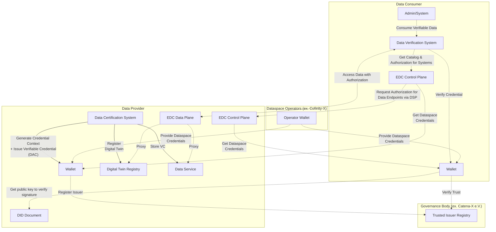

## Introduction

### General Development Information

The Data Trust & Security KIT provides developers with essential resources to implement robust data verification and trust mechanisms within the Catena-X network. This KIT enables organizations to establish, maintain, and verify the authenticity and integrity of data exchanged through the ecosystem.

The developer view offers comprehensive guidance on integrating data attestation services, implementing verifiable credentials, managing trusted issuer lists, and establishing secure data verification processes. This documentation covers various aspects from API endpoints utilization to data model implementation and deployment within the Catena-X Data Space.

## Documentation Overview

This comprehensive guide is organized into the following sections:

- **[API Specifications](./api-specifications)** - REST APIs, endpoints, and integration details for trust management services
- **[Security & Deployment](./security-deployment)** - Security considerations, deployment patterns, and best practices  
- **[Verifiable Credentials](./verifiable-credentials)** - Implementation architecture and credential framework
- **[Trust Verification](./trust-verification)** - Trust verification service and technical specifications
- **[Integration & Implementation](./integration-implementation)** - Digital Twin integration, certification processes, and implementation roadmap

### Architecture Overview

The following figure illustrates how the Data Trust & Security KIT components are embedded within the overall Eclipse Tractus-X architecture:



## Core Components

### Attestation Service Provider Trusted List

The trusted list of issuers should be maintained by a Governance Entity (e.g., Catena-X Association) and can be hosted by the Core Service Providers. However, its ongoing curation and updates will require input from domain experts across relevant industries to ensure accuracy and relevance.

It should provide for each use case a list of accredited issuers.

Based on certain rules defined by each use case, a company will be allowed to be included in this trusted list.
This set of rules will be defined in an Accreditation Rulebook.

#### Trusted List Structure

The trusted list follows a standardized JSON-LD structure that enables semantic understanding and automated processing:

```json
{
   "@context": [
     "https://www.w3.org/ns/odrl.jsonld",
     {
         "cx-policy": "https://w3id.org/catenax/policy/",
         "cx-trusted-list": "https://w3id.com/catena-x/trusted-list/"
     }
   ],
   "type": "TrustedList",
   "owner": {
      "name": "Catena-X Automotive Network e.V.",
      "@id": "did:web:catena-x.net"
    },
   "version": "1.0.0",
   "lastUpdated": "2024-01-15T10:30:00Z",
   "trustedIssuers": [
     {
        "type": "cx-policy:framework.generic:1",
        "status": "active",
        "name": "TÜV SÜD",
        "@id": "did:web:tuv-sud.de",
        "accreditationScope": [
          "data-quality-verification",
          "compliance-certification",
          "technical-standards-validation"
        ],
        "validFrom": "2024-01-01T00:00:00Z",
        "validUntil": "2025-12-31T23:59:59Z",
        "revocationEndpoint": "https://tuv-sud.de/revocation-list/2024/credentials.json"
     },
     {
        "type": "cx-policy:pcf.base:1",
        "status": "active", 
        "name": "Certification Authority Example",
        "@id": "did:web:cert-authority.example.com",
        "accreditationScope": [
          "carbon-footprint-verification",
          "sustainability-metrics"
        ],
        "validFrom": "2024-01-01T00:00:00Z",
        "validUntil": "2025-12-31T23:59:59Z",
        "revocationEndpoint": "https://cert-authority.example.com/revocation-list/2024/credentials.json"
     }
   ]
}
```

#### Trusted List Features

The trusted list implementation provides the following capabilities:

- **Use Case Specificity**: Maintains separate issuer lists for different use cases and data types
- **Accreditation Tracking**: Records accreditation status, scope, and validity periods  
- **Dynamic Updates**: Supports real-time updates to issuer status and capabilities
- **Multi-level Trust**: Enables different trust levels based on accreditation scope
- **Revocation Integration**: Links to revocation endpoints for each trusted issuer
- **Semantic Interoperability**: Uses JSON-LD for machine-readable trust relationships

#### Issuer Status Management

Each trusted issuer can have one of the following statuses:

| Status | Description | Verification Impact |
|--------|-------------|-------------------|
| `active` | Issuer is currently trusted and can issue valid credentials | Credentials are accepted for verification |
| `suspended` | Issuer is temporarily suspended from issuing new credentials | Existing credentials remain valid, new ones rejected |
| `revoked` | Issuer's trust has been permanently revoked | All credentials from this issuer are rejected |
| `expired` | Issuer's accreditation period has ended | Credentials issued within validity period may still be valid |

## Data Trust Flow

The Data Trust & Security KIT enables a comprehensive flow for establishing and verifying data trust within the Catena-X network. This process involves multiple participants and follows a standardized approach to ensure data integrity and authenticity.

### Prerequisites

Before implementing the Data Trust & Security KIT, the following components and services need to be available:

| Component | Description | Repository/Standard | CX Standard |
|-----------|-------------|---------------------|-------------|
| Digital Twin Registry | Registry for digital twin metadata and endpoints | eclipse-tractusx/sldt-digital-twin-registry | CX-0002 |
| Eclipse Dataspace Connector (EDC) | Data exchange infrastructure | eclipse-tractusx/tractusx-edc | CX-0018 |
| Wallet Service | SSI wallet for credential management | eclipse-tractusx/identity-hub | CX-0049 |
| Operator Wallet | SSI wallet for credential issuance | eclipse-tractusx/ssi-credential-issuer | CX-0049 |
| Trusted List Service | Management of accredited issuers | To be defined | Future CX Standard |

### Trust Establishment Process

The trust establishment process follows these key phases:

#### 1. Issuer Accreditation Phase

Organizations seeking to become trusted issuers must:

1. **Apply for Accreditation**: Submit application to governance entity
2. **Compliance Verification**: Undergo audit against accreditation rulebook
3. **Inclusion in Trusted List**: Upon successful verification, inclusion in the trusted issuer list
4. **Ongoing Monitoring**: Regular compliance checks and status updates

#### 2. Certificate Issuance Phase

Accredited issuers can create verifiable credentials:

1. **Data Validation**: Verify the accuracy and completeness of data to be certified
2. **Credential Creation**: Generate verifiable credential with appropriate schemas
3. **Digital Signing**: Apply cryptographic signatures using issuer's private keys
4. **Publication**: Make credentials available through appropriate channels

#### 3. Verification Phase

Data consumers must verify credentials through comprehensive validation that includes trusted list and revocation checking:

1. **Credential Retrieval**: Obtain verifiable credentials from data providers or Digital Twin Registry
2. **Trusted List Validation**:
   - Verify issuer DID is present in the trusted issuer list
   - Check issuer status is "ACTIVE" and not "SUSPENDED" or "REVOKED"
   - Validate issuer accreditation levels match required trust requirements
   - Confirm issuer's supported credential types include the presented credential
3. **Signature Verification**:
   - Validate cryptographic signatures using issuer's public key
   - Verify signature integrity and authenticity
   - Check signature algorithm compatibility
4. **Revocation Status Check**:
   - Query revocation list endpoint from trusted issuer configuration
   - Verify credential ID is not present in active revocation lists
   - Check revocation list freshness and validity period
   - Handle revocation list unavailability according to policy
5. **Schema and Structure Validation**:
   - Validate credential structure against expected JSON-LD schema
   - Verify required fields and data types
   - Check credential context and vocabulary compliance
6. **Trust Decision**: Make informed decision based on all verification results

**Critical Note**: Both trusted list validation and revocation checking are mandatory steps in the verification process. Failure in either check should result in credential rejection unless explicitly overridden by organizational policy.

## Implementation Architecture

### Overview

The Data Trust & Security KIT provides a comprehensive framework for implementing data verification and trust mechanisms within the Catena-X network. The architecture is designed to be generic and adaptable across various use cases and data formats while maintaining data sovereignty and security.

This implementation concept establishes an assertive second layer of trust over the actual peer-to-peer data exchanges within the Catena-X network. Building upon the existing SSI (Self-Sovereign Identity) technology already in place, this framework enables data providers to create self-signed documents confirming information placed into aspect models, and gives data auditors the possibility to certify specific attributes from standardized data structures.

The technology consists of creating Signed Documents (Verification Statements) using Verifiable Credentials 2.0 technology - a JSON-LD structure standardized by the W3C Consortium for Web 3.0 data trust and identity assurance. Using JSON Web Signatures (JWS) and wallet components connected to Catena-X and identified by unique Business Partner Numbers (BPN), data issuers and auditors can sign using their Ed25519 private keys while data consumers can access public keys by resolving the DID contained in the signature proof.

### System Components

The trust framework consists of several key components that work together to establish, maintain, and verify data integrity:

### Trust Registry

A centralized registry that maintains lists of accredited issuers and verification authorities. This registry enables:

- Management of trusted issuer lists per use case
- Accreditation status tracking
- Revocation list management
- Policy enforcement

### Verification Service

A service component that handles the verification of verifiable credentials and attestations:

- Cryptographic signature validation
- Trusted list checking
- Revocation status verification
- Schema compliance validation

### Wallet Integration

Integration with SSI wallets for credential management:

- Credential issuance capabilities
- Private key management
- DID resolution services
- Credential storage and retrieval

### Digital Twin Integration

Seamless integration with Digital Twin Registry:

- Verifiable credentials as submodels
- Automated credential discovery
- Metadata management
- Trust status indication

## Getting Started

To implement the Data Trust & Security KIT in your application, follow these steps:

1. **Review the detailed documentation** in the linked sections above
2. **Set up the required infrastructure** (EDC, Digital Twin Registry, Wallet services)
3. **Implement API integrations** using the provided specifications
4. **Configure security and deployment** according to your environment
5. **Test verifiable credentials** implementation with sample data
6. **Deploy trust verification** services and integrate with your data flows

For specific implementation details, code examples, and integration patterns, refer to the comprehensive documentation sections linked at the beginning of this guide.

## NOTICE

This work is licensed under the [CC-BY-4.0](https://creativecommons.org/licenses/by/4.0/legalcode).

- SPDX-License-Identifier: CC-BY-4.0

- SPDX-FileCopyrightText: 2025 Contributors to the Eclipse Foundation

- Source URL: [https://github.com/eclipse-tractusx/eclipse-tractusx.github.io](https://github.com/eclipse-tractusx/eclipse-tractusx.github.io)
