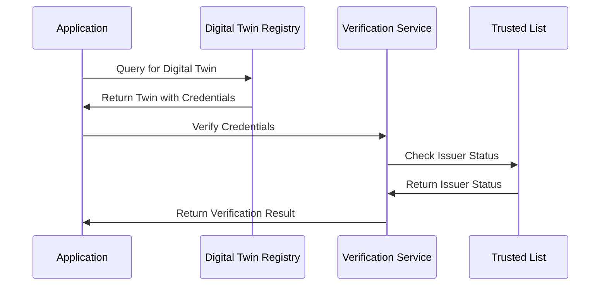
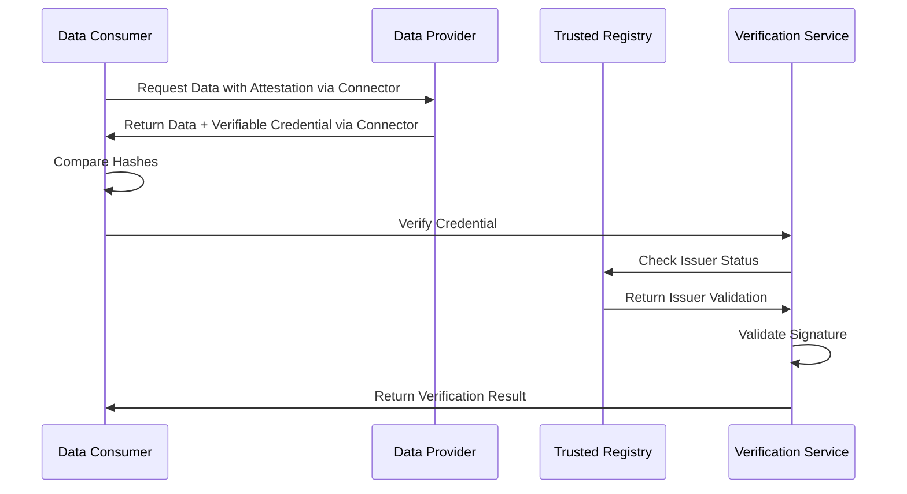
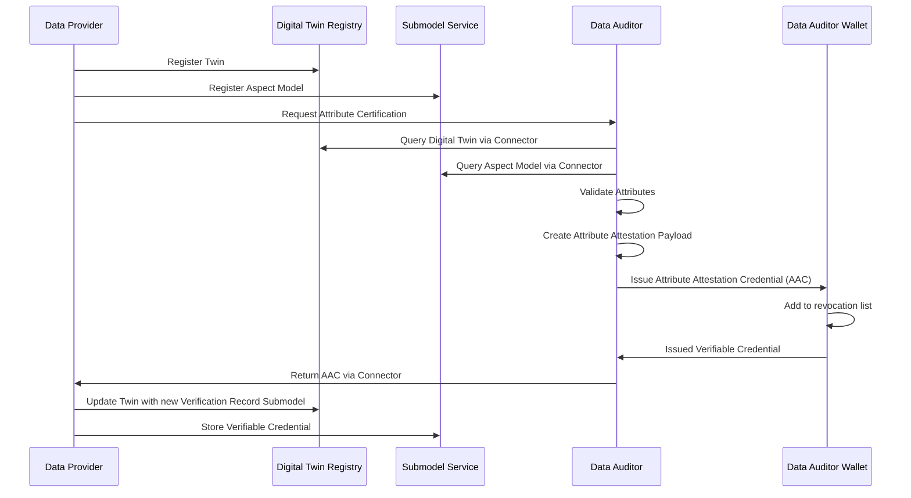
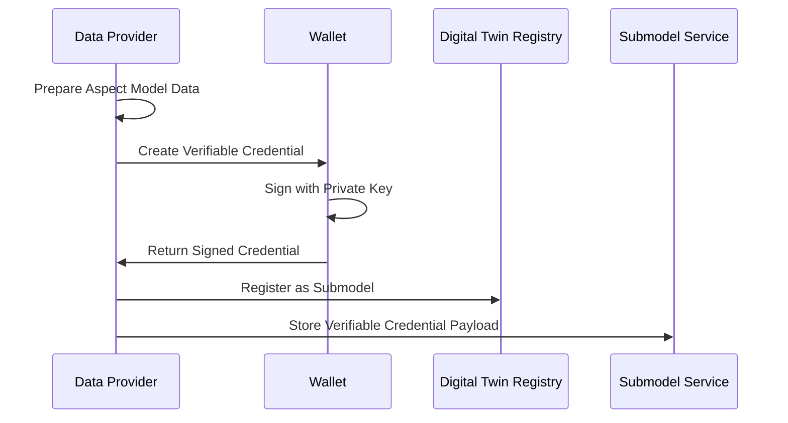
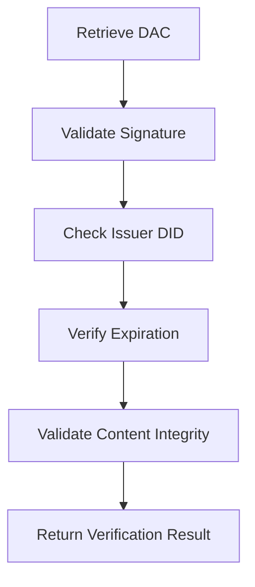
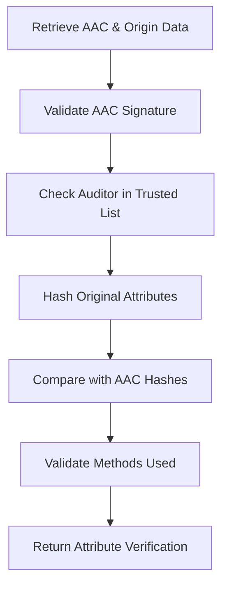
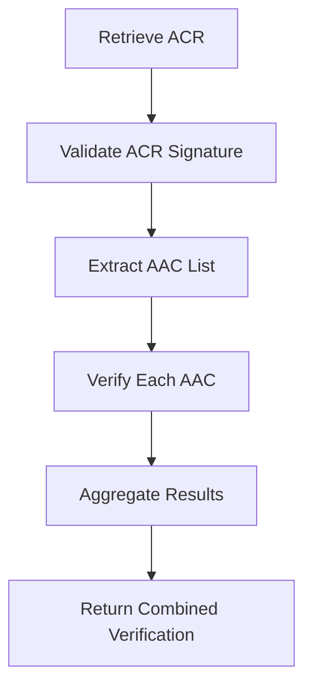

## Introduction

### General Development Information

The Data Trust & Security KIT provides developers with essential resources to implement robust data verification and trust mechanisms within the Catena-X network. This KIT enables organizations to establish, maintain, and verify the authenticity and integrity of data exchanged through the ecosystem.

The developer view offers comprehensive guidance on integrating data attestation services, implementing verifiable credentials, managing trusted issuer lists, and establishing secure data verification processes. This documentation covers various aspects from API endpoints utilization to data model implementation and deployment within the Catena-X Data Space.

### Architecture Overview

The following figure illustrates how the Data Trust & Security KIT components are embedded within the overall Eclipse Tractus-X architecture:

```mermaid
graph TB
    %% Data Consumer Side
    subgraph DC["Data Consumer"]
        Admin1["Admin/System"] 
        DVC["Data Verification System"]
        EDC1["EDC Control Plane"]
        Wallet1["Wallet"]
    end
    
    %% Data Provider Side  
    subgraph DP["Data Provider"]
        Admin2["Data Certification System"]
        EDC2["EDC Control Plane"]
        EDCDP2["EDC Data Plane"]
        Wallet2["Wallet"]
        DTR["Digital Twin Registry"]
        DS["Data Service"]
        DID["DID Document"]
    end

    subgraph COF["Dataspace Operators (ex. Cofinity-X)"]
        OpWallet["Operator Wallet"]
    end

    subgraph CX["Governance Body (ex. Catena-X e.V.)"]
        TIR["Trusted Issuer Registry"]
    end

    %% Data Consumer Flows
    Admin1 -.->|"Consume Verifiable Data"| DVC
    DVC -.->|"Verify Credential"| Wallet1
    DVC -.->|"Get Catalog & Authorization for Systems"| EDC1
    EDC1 -.->|"Get Dataspace<br/>Credentials"| Wallet2
    
    %% Data Provider Flows
    Admin2 -->|"Register<br/>Digital Twin"| DTR
    Admin2 -->|"Store VC"| DS
    Admin2 -->|"Generate Credential Context<br/>+ Issue Verifiable Credential<br/>(DAC)"| Wallet2
    EDCDP2 -.->|"Proxy"| DTR
    EDCDP2 -.->|"Proxy"| DS
    EDC2 -.->|"Get Dataspace<br/>Credentials"| Wallet1
    
    %% Cross-Provider Communication
    EDC1 -.->|"Request Authorization for Data Endpoints via DSP"| EDC2
    DVC <-.->|"Access Data with Authorization"| EDCDP2


    %% Wallet and Registry Connections
    Wallet1 -.->|"Verify Trust"| TIR
    Wallet2 -.->|"Register Issuer"| TIR
    OpWallet -.->|"Provide Dataspace<br/>Credentials"| Wallet1
    OpWallet -.->|"Provide Dataspace<br/>Credentials"| Wallet2
    Wallet1 -.->|"Get public key to verify signature"| DID
````

## Core Components

### Attestation Service Provider Trusted List

The trusted list of issuers should be maintained by a Governance Entity (e.g., Catena-X Association) and can be hosted by the Core Service Providers. However, its ongoing curation and updates will require input from domain experts across relevant industries to ensure accuracy and relevance.

It should provide for each use case a list of accredited issuers.

Based on certain rules defined by each use case, a company will be allowed to be included in this trusted list.
This set of rules will be defined in an Accreditation Rulebook.

#### Trusted List Structure

The trusted list follows a standardized JSON-LD structure that enables semantic understanding and automated processing:

```json
{
   "@context": [
     "https://www.w3.org/ns/odrl.jsonld",
     {
         "cx-policy": "https://w3id.org/catenax/policy/",
         "cx-trusted-list": "https://w3id.com/catena-x/trusted-list/"
     }
   ],
   "type": "TrustedList",
   "owner": {
      "name": "Catena-X Automotive Network e.V.",
      "@id": "did:web:catena-x.net"
    },
   "version": "1.0.0",
   "lastUpdated": "2024-01-15T10:30:00Z",
   "trustedIssuers": [
     {
        "type": "cx-policy:framework.generic:1",
        "status": "active",
        "name": "TÜV SÜD",
        "@id": "did:web:tuv-sud.de",
        "accreditationScope": [
          "data-quality-verification",
          "compliance-certification",
          "technical-standards-validation"
        ],
        "validFrom": "2024-01-01T00:00:00Z",
        "validUntil": "2025-12-31T23:59:59Z",
        "revocationEndpoint": "https://tuv-sud.de/revocation-list/2024/credentials.json"
     },
     {
        "type": "cx-policy:pcf.base:1",
        "status": "active", 
        "name": "Certification Authority Example",
        "@id": "did:web:cert-authority.example.com",
        "accreditationScope": [
          "carbon-footprint-verification",
          "sustainability-metrics"
        ],
        "validFrom": "2024-01-01T00:00:00Z",
        "validUntil": "2025-12-31T23:59:59Z",
        "revocationEndpoint": "https://cert-authority.example.com/revocation-list/2024/credentials.json"
     }
   ]
}
```

#### Trusted List Features

The trusted list implementation provides the following capabilities:

- **Use Case Specificity**: Maintains separate issuer lists for different use cases and data types
- **Accreditation Tracking**: Records accreditation status, scope, and validity periods  
- **Dynamic Updates**: Supports real-time updates to issuer status and capabilities
- **Multi-level Trust**: Enables different trust levels based on accreditation scope
- **Revocation Integration**: Links to revocation endpoints for each trusted issuer
- **Semantic Interoperability**: Uses JSON-LD for machine-readable trust relationships

#### Issuer Status Management

Each trusted issuer can have one of the following statuses:

| Status | Description | Verification Impact |
|--------|-------------|-------------------|
| `active` | Issuer is currently trusted and can issue valid credentials | Credentials are accepted for verification |
| `suspended` | Issuer is temporarily suspended from issuing new credentials | Existing credentials remain valid, new ones rejected |
| `revoked` | Issuer's trust has been permanently revoked | All credentials from this issuer are rejected |
| `expired` | Issuer's accreditation period has ended | Credentials issued within validity period may still be valid |

## Data Trust Flow

The Data Trust & Security KIT enables a comprehensive flow for establishing and verifying data trust within the Catena-X network. This process involves multiple participants and follows a standardized approach to ensure data integrity and authenticity.

### Prerequisites

Before implementing the Data Trust & Security KIT, the following components and services need to be available:

| Component | Description | Repository/Standard | CX Standard |
|-----------|-------------|---------------------|-------------|
| Digital Twin Registry | Registry for digital twin metadata and endpoints | eclipse-tractusx/sldt-digital-twin-registry | CX-0002 |
| Eclipse Dataspace Connector (EDC) | Data exchange infrastructure | eclipse-tractusx/tractusx-edc | CX-0018 |
| Wallet Service | SSI wallet for credential management | eclipse-tractusx/identity-hub | CX-0049 |
| Operator Wallet | SSI wallet for credential issuance | eclipse-tractusx/ssi-credential-issuer | CX-0049 |
| Trusted List Service | Management of accredited issuers | To be defined | Future CX Standard |

### Trust Establishment Process

The trust establishment process follows these key phases:

#### 1. Issuer Accreditation Phase

Organizations seeking to become trusted issuers must:

1. **Apply for Accreditation**: Submit application to governance entity
2. **Compliance Verification**: Undergo audit against accreditation rulebook
3. **Inclusion in Trusted List**: Upon successful verification, inclusion in the trusted issuer list
4. **Ongoing Monitoring**: Regular compliance checks and status updates

#### 2. Certificate Issuance Phase

Accredited issuers can create verifiable credentials:

1. **Data Validation**: Verify the accuracy and completeness of data to be certified
2. **Credential Creation**: Generate verifiable credential with appropriate schemas
3. **Digital Signing**: Apply cryptographic signatures using issuer's private keys
4. **Publication**: Make credentials available through appropriate channels

#### 3. Verification Phase

Data consumers must verify credentials through comprehensive validation that includes trusted list and revocation checking:

1. **Credential Retrieval**: Obtain verifiable credentials from data providers or Digital Twin Registry
2. **Trusted List Validation**:
   - Verify issuer DID is present in the trusted issuer list
   - Check issuer status is "ACTIVE" and not "SUSPENDED" or "REVOKED"
   - Validate issuer accreditation levels match required trust requirements
   - Confirm issuer's supported credential types include the presented credential
3. **Signature Verification**:
   - Validate cryptographic signatures using issuer's public key
   - Verify signature integrity and authenticity
   - Check signature algorithm compatibility
4. **Revocation Status Check**:
   - Query revocation list endpoint from trusted issuer configuration
   - Verify credential ID is not present in active revocation lists
   - Check revocation list freshness and validity period
   - Handle revocation list unavailability according to policy
5. **Schema and Structure Validation**:
   - Validate credential structure against expected JSON-LD schema
   - Verify required fields and data types
   - Check credential context and vocabulary compliance
6. **Trust Decision**: Make informed decision based on all verification results

**Critical Note**: Both trusted list validation and revocation checking are mandatory steps in the verification process. Failure in either check should result in credential rejection unless explicitly overridden by organizational policy.

## API Specifications

### Core APIs

The Data Trust & Security KIT provides several REST APIs for different aspects of trust management:

#### Trusted List API

**Base Path**: `/api/v1/trusted-list`

| Endpoint | Method | Description | Parameters |
|----------|--------|-------------|------------|
| `/issuers` | GET | Retrieve list of trusted issuers | `useCase`, `status` |
| `/issuers/{did}` | GET | Get specific issuer details | `did` (path) |
| `/issuers/{did}/verify` | POST | Verify issuer credentials | `did` (path), credential (body) |

#### Verification API

**Base Path**: `/api/v1/verification`

| Endpoint | Method | Description | Parameters |
|----------|--------|-------------|------------|
| `/credentials/verify` | POST | Verify verifiable credential | credential (body) |
| `/credentials/status` | GET | Check credential revocation status | `credentialId` |
| `/batch/verify` | POST | Batch verify multiple credentials | credentials array (body) |

#### Certificate Issuance API

**Base Path**: `/api/v1/certificates`

| Endpoint | Method | Description | Parameters |
|----------|--------|-------------|------------|
| `/issue` | POST | Issue new verifiable credential | credential data (body) |
| `/revoke` | POST | Revoke existing credential | `credentialId`, reason |
| `/status/{id}` | GET | Get certificate status | `id` (path) |

### API Security

All APIs implement security measures aligned with Catena-X standards:

- **Authorization**: Role and BPN-based access control
- **Rate Limiting**: API rate limits to prevent abuse
- **Input Validation**: Comprehensive input sanitization and validation
- **Audit Logging**: Complete audit trail of all operations

## Reference Implementations

### Documentation and Repositories

The following resources provide comprehensive implementation guidance:

- **Specification Documents**: Detailed technical specifications for each component
- **Reference Architecture**: Complete architectural diagrams and component interactions
- **Sample Implementations**: Working code examples in multiple programming languages
- **Integration Guides**: Step-by-step integration instructions

### Sample Data Models

#### Verifiable Credential Schema Example

```json
{
  "$schema": "https://json-schema.org/draft/2020-12/schema",
  "type": "object",
  "properties": {
    "@context": {
      "type": "array",
      "items": {
        "type": "string"
      }
    },
    "type": {
      "type": "array",
      "items": {
        "type": "string"
      }
    },
    "credentialSubject": {
      "type": "object"
    },
    "issuer": {
      "type": "string",
      "format": "uri"
    },
    "issuanceDate": {
      "type": "string",
      "format": "date-time"
    },
    "expirationDate": {
      "type": "string",
      "format": "date-time"
    },
    "proof": {
      "type": "object"
    }
  },
  "required": ["@context", "type", "credentialSubject", "issuer", "issuanceDate", "proof"]
}
```

## Security Considerations

### Cryptographic Standards

The Data Trust & Security KIT uses industry-standard cryptographic approaches:

- **Digital Signatures**: Ed25519 and RSA signatures for credential integrity
- **Key Management**: Secure key generation, storage, and rotation procedures
- **Hash Functions**: SHA-256 for data integrity verification
- **Encryption**: AES-256 for sensitive data protection

### Privacy Protection

Privacy considerations are integral to the KIT design:

- **Selective Disclosure**: Support for revealing only necessary credential attributes
- **Zero-Knowledge Proofs**: Enable verification without revealing underlying data
- **Data Minimization**: Limit data collection and processing to necessary minimum
- **Consent Management**: Clear consent mechanisms for data processing

### Threat Modeling

Key security threats addressed:

| Threat | Mitigation | Implementation |
|--------|------------|----------------|
| Credential Forgery | Cryptographic signatures | Digital signature verification |
| Man-in-the-Middle | TLS encryption | HTTPS enforcement |
| Replay Attacks | Timestamp validation | Credential expiration checks |
| Key Compromise | Key rotation | Regular key updates |
| Revocation Bypass | Revocation checking | Real-time status verification |

## Deployment Patterns

### Centralized Deployment

In a centralized approach:

- **Governance Entity** manages the trusted list
- **Core Service Providers** host verification services
- **Simplified Management** with single point of control
- **Suitable for** initial deployments and smaller networks

### Federated Deployment

In a federated approach:

- **Multiple Governance Entities** manage domain-specific trusted lists
- **Distributed Verification** across multiple service providers
- **Enhanced Resilience** through redundancy
- **Suitable for** large-scale, multi-domain deployments

### Hybrid Deployment

Combining centralized and federated approaches:

- **Core Services** centrally managed
- **Domain-Specific Extensions** federally managed
- **Flexible Scaling** based on network growth
- **Suitable for** evolving network requirements

## Integration Guidelines

### Integration with Digital Twin Registry

The KIT integrates seamlessly with Digital Twin Registry:



### Integration with EDC

The KIT works alongside Eclipse Dataspace Connector:

1. **Policy Enforcement**: Use verification results for access control decisions
2. **Contract Negotiation**: Include trust requirements in data contracts
3. **Data Transfer**: Verify credentials before data exchange
4. **Audit Trail**: Log all verification activities

## Best Practices

### For Issuers

- **Regular Key Rotation**: Implement automated key rotation schedules
- **Data Validation**: Thoroughly validate data before credential issuance
- **Revocation Management**: Maintain up-to-date revocation lists
- **Compliance Monitoring**: Regular self-audits against accreditation requirements

### For Verifiers

- **Always Check Revocation**: Never skip revocation status checks
- **Validate Issuer Status**: Ensure issuer is currently trusted
- **Implement Caching**: Cache verification results appropriately
- **Error Handling**: Graceful handling of verification failures

### For Implementers

- **Security First**: Prioritize security in all implementation decisions
- **Standard Compliance**: Adhere to established W3C and Catena-X standards
- **Monitoring & Logging**: Comprehensive monitoring and audit logging
- **Documentation**: Maintain clear documentation for all integrations

## Implementation Architecture

### Overview

The Data Trust & Security KIT provides a comprehensive framework for implementing data verification and trust mechanisms within the Catena-X network. The architecture is designed to be generic and adaptable across various use cases and data formats while maintaining data sovereignty and security.

This implementation concept establishes an assertive second layer of trust over the actual peer-to-peer data exchanges within the Catena-X network. Building upon the existing SSI (Self-Sovereign Identity) technology already in place, this framework enables data providers to create self-signed documents confirming information placed into aspect models, and gives data auditors the possibility to certify specific attributes from standardized data structures.

The technology consists of creating Signed Documents (Verification Statements) using Verifiable Credentials 2.0 technology - a JSON-LD structure standardized by the W3C Consortium for Web 3.0 data trust and identity assurance. Using JSON Web Signatures (JWS) and wallet components connected to Catena-X and identified by unique Business Partner Numbers (BPN), data issuers and auditors can sign using their Ed25519 private keys while data consumers can access public keys by resolving the DID contained in the signature proof.

### System Components

The trust framework consists of several key components that work together to establish, maintain, and verify data integrity:

#### Trust Registry

A centralized registry that maintains lists of accredited issuers and verification authorities. This registry enables:

- Management of trusted issuer lists per use case
- Accreditation status tracking
- Revocation list management
- Policy enforcement

#### Verification Service

A service component that handles the verification of verifiable credentials and attestations:

- Signature verification using DID resolution
- Credential status checking (revocation, expiration)
- Trust chain validation
- Policy compliance verification

#### Attestation Engine

The core component responsible for generating and managing data attestations:

- Verifiable credential generation
- Attribute-level certification
- Complete data certification
- Selective disclosure support

### Verification Statement Types

The Data Trust & Security KIT implements two primary types of verification statements to accommodate different trust and verification requirements:

#### Complete Data Verification Statement

Self-signed document containing the complete data from an aspect model payload. This provides:

- Full data integrity verification
- Complete traceability and version control
- Self-attestation capability for data providers
- Comprehensive audit trail

#### Partial Data Verification Statement  

Attribute-level certified document containing one or more attributes from the complete data verification statement or from a plain JSON aspect model payload. This enables:

- Selective disclosure of verified attributes
- Third-party auditor certification
- Granular trust establishment
- Privacy-preserving verification

### Trust Establishment Process

The Data Trust & Security KIT implements a multi-layered trust establishment process that ensures data integrity and authenticity across all participants in the network.

#### Phase 1: Issuer Accreditation

Organizations seeking to become trusted data attesters must undergo an accreditation process:

1. **Application Submission**: Submit accreditation request with supporting documentation
2. **Compliance Assessment**: Undergo audit against defined accreditation criteria
3. **Technical Evaluation**: Demonstrate technical capability to issue verifiable credentials
4. **Inclusion Decision**: Upon successful evaluation, inclusion in trusted issuer registry
5. **Ongoing Monitoring**: Regular compliance checks and status updates

#### Phase 2: Data Attestation

Accredited issuers can create verifiable attestations for data:

1. **Data Validation**: Verify accuracy and compliance of data against standards
2. **Credential Generation**: Create verifiable credentials with appropriate schemas
3. **Digital Signing**: Apply cryptographic signatures using issuer's private keys
4. **Publication**: Make credentials available through appropriate channels
5. **Status Management**: Maintain credential lifecycle and revocation capabilities

#### Phase 3: Verification Process

Data consumers can verify attestations through comprehensive verification:

1. **Credential Retrieval**: Obtain verifiable credentials from data providers
2. **Issuer Validation**: Verify issuer is in trusted registry and status is active
3. **Signature Verification**: Validate cryptographic signatures and proof integrity
4. **Revocation Check**: Confirm credential has not been revoked or expired
5. **Policy Compliance**: Ensure compliance with applicable policies and standards
6. **Trust Decision**: Make informed decisions based on verification results

## Verifiable Credential Framework

The Data Trust & Security KIT implements a comprehensive verifiable credential framework based on W3C standards, adapted for Catena-X requirements.

### Credential Types

The framework defines three main types of verifiable credentials:

| Credential Type | Issuer | Content | Use Case |
|----------------|--------|---------|----------|
| **Data Attestation Credential (DAC)** | Data Provider | Complete aspect model payload with signature | Self-attestation and complete data verification |
| **Attribute Attestation Credential (AAC)** | Data Auditor | Selected attributes with validation methods | Third-party attribute certification |
| **Attribute Certification Record (ACR)** | Data Provider | Collection of AACs as verifiable presentation | Aggregated attribute certifications |

### Data Attestation Credentials

Complete data attestation credentials contain the full data payload with cryptographic proof of authenticity:

```json
{
    "@context": [
        "https://www.w3.org/ns/credentials/v2",
        "https://w3c.github.io/vc-jws-2020/contexts/v1/",
        "https://w3id.org/security/data-integrity/v2",
        "https://raw.githubusercontent.com/eclipse-tractusx/sldt-semantic-models/refs/heads/main/io.catenax.certificate.dac/1.0.0/gen/Dac-context.jsonld",
        "https://raw.githubusercontent.com/eclipse-tractusx/sldt-semantic-models/refs/heads/main/io.catenax.pcf/7.0.0/gen/Pcf-context.jsonld"
    ],
    "type": [
        "VerifiableCredential",
        "DataAttestationCertificate",
        "Pcf"
    ],
    "semanticId": "urn:samm:io.catenax.pcf:7.0.0#Pcf",
    "credentialSubject": {
        "Pcf": {
            "specVersion": "urn:io.catenax.pcf:datamodel:version:7.0.0",
            "companyIds": ["telnet://192.0.2.16:80/", "ftp://ftp.is.co.za/rfc/rfc1808.txt", "http://www.ietf.org/rfc/rfc2396.txt"],
            "extWBCSD_productCodeCpc": "011-99000",
            "created": "2022-05-22T21:47:32Z",
            "companyName": "My Corp",
            "extWBCSD_pfStatus": "Active",
            "version": 0,
            "productName": "My Product Name",
            "pcf": {
                "biogenicCarbonEmissionsOtherThanCO2": 1.0,
                "distributionStagePcfExcludingBiogenic": 1.5,
                "biogenicCarbonWithdrawal": 0.0,
                "distributionStageBiogenicCarbonEmissionsOtherThanCO2": 1.0,
                "extWBCSD_allocationRulesDescription": "In accordance with Catena-X PCF Rulebook",
                "exemptedEmissionsDescription": "No exemption",
                "distributionStageFossilGhgEmissions": 0.5,
                "exemptedEmissionsPercent": 0.0,
                "geographyCountrySubdivision": "US-NY",
                "extTFS_luGhgEmissions": 0.3,
                "distributionStageBiogenicCarbonWithdrawal": 0.0,
                "pcfIncludingBiogenic": 1.0,
                "aircraftGhgEmissions": 0.0,
                "productMassPerDeclaredUnit": 0.456,
                "productOrSectorSpecificRules": [{
                    "extWBCSD_operator": "PEF",
                    "productOrSectorSpecificRules": [{
                        "ruleName": "urn:tfs-initiative.com:PCR:The Product Carbon Footprint Guideline for the Chemical Industry:version:v2.0"
                    }],
                    "extWBCSD_otherOperatorName": "NSF"
                }],
                "extTFS_allocationWasteIncineration": "cut-off",
                "pcfExcludingBiogenic": 2.0,
                "referencePeriodEnd": "2022-12-31T23:59:59Z",
                "extWBCSD_characterizationFactors": "AR5",
                "secondaryEmissionFactorSources": [{
                    "secondaryEmissionFactorSource": "ecoinvent 3.8"
                }],
                "unitaryProductAmount": 1000.0,
                "declaredUnit": "liter",
                "referencePeriodStart": "2022-01-01T00:00:01Z",
                "geographyRegionOrSubregion": "Africa",
                "fossilGhgEmissions": 0.5,
                "distributionStageAircraftGhgEmissions": 0.0,
                "boundaryProcessesDescription": "Electricity consumption included as an input in the production phase",
                "geographyCountry": "DE",
                "extWBCSD_packagingGhgEmissions": 0,
                "dlucGhgEmissions": 0.4,
                "carbonContentTotal": 2.5,
                "extTFS_distributionStageLuGhgEmissions": 1.1,
                "primaryDataShare": 56.12,
                "dataQualityRating": {
                    "completenessDQR": 2.0,
                    "technologicalDQR": 2.0,
                    "geographicalDQR": 2.0,
                    "temporalDQR": 2.0,
                    "reliabilityDQR": 2.0,
                    "coveragePercent": 100
                },
                "extWBCSD_packagingEmissionsIncluded": true,
                "extWBCSD_fossilCarbonContent": 0.1,
                "crossSectoralStandardsUsed": [{
                    "crossSectoralStandard": "ISO Standard 14067"
                }],
                "extTFS_distributionStageDlucGhgEmissions": 1.0,
                "distributionStagePcfIncludingBiogenic": 0.0,
                "carbonContentBiogenic": 0.0
        },
        "partialFullPcf": "Cradle-to-gate",
        "productIds": ["http://www.wikipedia.org", "ftp://ftp.is.co.za/rfc/rfc1808.txt"],
        "validityPeriodStart": "2022-01-01T00:00:01Z",
        "comment": "Additional explanatory information not reflected by other attributes",
        "id": "3893bb5d-da16-4dc1-9185-11d97476c254",
        "validityPeriodEnd": "2022-12-31T23:59:59Z",
        "pcfLegalStatement": "This PCF (Product Carbon Footprint) is for information purposes only. It is based upon the standards mentioned above.",
        "productDescription": "Ethanol, 95% solution",
        "precedingPfIds": [{
            "id": "3893bb5d-da16-4dc1-9185-11d97476c254"
        }]
    },
    "id": "urn:uuid:certificate-123-456-789",
    "issuer": "did:web:tuv-sud.de",
    "validFrom": "2024-01-15T10:30:00Z",
    "validUntil": "2025-01-15T10:30:00Z",
    "credentialStatus": {
        "id": "https://tuv-sud.de/revocation-list/2024/credentials.json#42",
        "type": "RevocationList2020Status",
        "revocationListIndex": "42",
        "revocationListCredential": "https://tuv-sud.de/revocation-list/2024/credentials.json"
    },
    "proof": {
        "type": "JsonWebSignature2020",
        "proofPurpose": "assertionMethod",
        "verificationMethod": "did:web:tuv-sud.de#key-1",
        "created": "2024-01-15T10:30:00Z",
        "jws": "eyJ0eXAiOiAidmMrbGQiLCAiYjY..."
    }
}
```

### Attribute Attestation Credentials

Selective attribute attestation enables verification of specific data elements without exposing the complete dataset:

```json
{
  "@context": [
      "https://www.w3.org/ns/credentials/v2",
      "https://w3c.github.io/vc-jws-2020/contexts/v1/",
      "https://w3id.org/security/data-integrity/v2",
      "https://raw.githubusercontent.com/eclipse-tractusx/digital-product-pass/main/dpp-verification/schemas/AAC/1.0.0/certifiedSnapshotCredential.jsonld",
      "https://raw.githubusercontent.com/eclipse-tractusx/digital-product-pass/main/dpp-verification/schemas/dpp/5.0.0/digitalProductPass.jsonld"
  ],
  "type": [
      "VerifiableCredential",
      "CertifiedSnapshotCredential",
      "Pcf"
  ],
  "credentialSubject": {
      "attributes": [
          {
              "validationMethod": [
                  {
                      "@type": "Standard",
                      "label": "Catena-X PCF Rulebook Standard",
                      "@id": "CX-0029",
                      "uri": "https://catena-x.net/fileadmin/user_upload/Standard-Bibliothek/Update_September23/CX-0029-ProductCarbonFootprintRulebook-v2.0.0.pdf",
                      "compliance": "100%"
                  }
              ],
              "@id": "pcf.biogenicCarbonEmissionsOtherThanCO2",
              "digestMultibase": "0b3402a678ec2788804994fb2df9faf66eecbdde26553e320a8d4a154f53d840d2a32245998c38f885f01137c9fcf123f3752fc841508dc771fa6faaee689b73"
          }
      ]
  },
  "origin": {
      "digestMultibase": "c118df3b7bf603a86bd79f03c692153bdb4212ab80d49c12154c92415ae83d6d59187d9ba5af9c4e40208f7d7b1d4c727de78cfbe51e768aae743723ee197374",
      "semanticId": "urn:samm:io.catenax.pcf:7.0.0#Pcf",
      "@id": "did:web:dpp-test-system.com:BPNL000000000000:api:public:urn%3Auuid%3Acd1c0904-27e2-4ae2-8751-5c8c8e4b6812",
      "@type": "application/vc+ld+json"
  },
  "id": "urn:uuid:281a8b98-933c-4d80-ad86-721f1adbe5b3",
  "issuer": "did:web:tuv-sud.de",
  "validFrom": "2024-07-10T15:08:13Z",
  "validUntil": "2024-12-25T15:08:13Z",
  "proof": {
      "type": "JsonWebSignature2020",
      "proofPurpose": "assertionMethod",
      "verificationMethod": "did:web:did:web:tuv-sud.de#N4bTDb14GEnCvwZdFRqK5lwL4nje3bB5Y4nvb01VBKA",
      "created": "2024-07-10T15:08:13Z",
      "jws": "eyJ0eXAiOiAidmMrbGQiLCAiYjY0IjogZmFsc2UsICJjcnYiOiAiRWQyNTUxOSJ9......"
  }
}
```

## Trust Verification Service

The trust verification service provides comprehensive verification capabilities for all types of verifiable credentials and attestations.

### Verification Capabilities

- **Signature Verification**: Cryptographic validation of credential signatures
- **Issuer Authentication**: Verification against trusted issuer registry
- **Revocation Checking**: Real-time status verification of credentials
- **Policy Compliance**: Validation against applicable policies and standards
- **Selective Disclosure**: Support for attribute-level verification without full data exposure

### Verification Workflow



## Technical Specifications

### Cryptographic Standards

The Data Trust & Security KIT uses industry-standard cryptographic approaches based on the W3C Verifiable Credentials specification:

#### Digital Signatures

- **Ed25519**: Primary signature algorithm for credential integrity
- **JsonWebSignature2020**: W3C standardized signature format
- **Key Management**: Secure key generation, storage, and rotation procedures

#### Signature Structure

The signature header must follow the W3C standard for JSON Web Signatures 2020:

```json
{
  "typ": "vc+ld",
  "b64": false,
  "alg": "HS256",
  "crv": "Ed25519",
  "crit": ["b64"]
}
```

#### DID Web Integration

All issuers must be identifiable through DID Web resolution with Business Partner Number integration:

```text
did:web:<<WALLET-URI>>
```

Example: `did:web:data-provider-wallet.catena-x.net`

#### Supported Signature Types

The Data Trust & Security KIT supports multiple cryptographic signature types, each with different security characteristics and use cases:

##### Ed25519Signature2020

**Security Level**: ***** (Highest Recommended)

- **Algorithm**: Ed25519 elliptic curve cryptography
- **Key Size**: 256-bit (32 bytes)
- **Signature Size**: 512-bit (64 bytes)
- **Performance**: Excellent - fastest signature generation and verification
- **Quantum Resistance**: Moderate resistance to quantum attacks
- **Use Case**: Recommended for all new implementations

**Advantages:**

- High performance with small signature size
- Strong security properties
- Deterministic signatures (no randomness required)
- Resistance to side-channel attacks

**JSON Structure:**

```json
{
    "proof": {
        "type": "Ed25519Signature2020",
        "created": "2024-01-15T10:30:00Z",
        "verificationMethod": "did:web:issuer.example.com#key-1",
        "proofPurpose": "assertionMethod",
        "proofValue": "z5vDVKmhQKyiPj4E2fNvRFDqJ9..."
    }
}
```

##### JsonWebSignature2020

**Security Level**: **** (Highly Recommended)

- **Algorithm**: Supports multiple algorithms (RS256, ES256, Ed25519)
- **Key Size**: Variable (depends on algorithm)
- **Signature Size**: Variable (depends on algorithm)
- **Performance**: Good - flexible implementation options
- **Quantum Resistance**: Depends on underlying algorithm
- **Use Case**: Recommended for interoperability with existing JWT infrastructure

**Advantages:**

- Industry standard JSON Web Signature format
- Supports multiple cryptographic algorithms
- Wide ecosystem support and tooling
- Backward compatibility with JWT systems

**JSON Structure:**

```json
{
    "proof": {
        "type": "JsonWebSignature2020",
        "created": "2024-01-15T10:30:00Z",
        "verificationMethod": "did:web:issuer.example.com#key-1",
        "proofPurpose": "assertionMethod",
        "jws": "eyJ0eXAiOiAidmMrbGQiLCAiYjY0IjogZmFsc2UsICJjcnYi..."
    }
}
```

##### RsaSignature2018

**Security Level**: *** (Acceptable with Caveats)

- **Algorithm**: RSA with PKCS#1 v1.5 or PSS padding
- **Key Size**: Minimum 2048-bit (recommended 3072-bit or 4096-bit)
- **Signature Size**: Same as key size
- **Performance**: Slower than elliptic curve alternatives
- **Quantum Resistance**: Vulnerable to quantum attacks
- **Use Case**: Legacy support only - not recommended for new implementations

**Advantages:**

- Well-established and widely understood
- Extensive tooling and library support
- Compatible with existing PKI infrastructure

**Disadvantages:**

- Large key and signature sizes
- Slower performance
- Vulnerable to quantum computing attacks
- Requires careful implementation to avoid vulnerabilities

**JSON Structure:**

```json
{
    "proof": {
        "type": "RsaSignature2018",
        "created": "2024-01-15T10:30:00Z",
        "verificationMethod": "did:web:issuer.example.com#key-1",
        "proofPurpose": "assertionMethod",
        "signatureValue": "AN1rKvtNZEJzb..."
    }
}
```

##### BbsBlsSignature2020

**Security Level**: ***** (Highest for Privacy-Preserving Applications)

- **Algorithm**: BBS+ signatures with BLS12-381 pairing
- **Key Size**: 96 bytes (public key)
- **Signature Size**: Variable (depends on disclosed attributes)
- **Performance**: Slower than traditional signatures
- **Quantum Resistance**: Moderate resistance
- **Use Case**: Recommended for selective disclosure and zero-knowledge proofs

**Advantages:**

- Enables selective disclosure without signature breaking
- Supports zero-knowledge proofs
- Privacy-preserving verification
- Unlinkable selective disclosure

**Disadvantages:**

- Complex implementation
- Slower performance
- Limited tooling ecosystem
- Requires specialized cryptographic libraries

**JSON Structure:**

```json
{
    "proof": {
        "type": "BbsBlsSignature2020",
        "created": "2024-01-15T10:30:00Z",
        "verificationMethod": "did:web:issuer.example.com#key-1",
        "proofPurpose": "assertionMethod",
        "proofValue": "lAjGJkMNBU49r..."
    }
}
```

#### Signature Type Recommendations

Based on security requirements and use cases, the following recommendations apply:

| Use Case | Primary Recommendation | Alternative | Reason |
|----------|----------------------|-------------|---------|
| **General Attestation** | Ed25519Signature2020 | JsonWebSignature2020 | Best performance and security balance |
| **Enterprise Integration** | JsonWebSignature2020 | Ed25519Signature2020 | JWT ecosystem compatibility |
| **Privacy-Preserving** | BbsBlsSignature2020 | Ed25519Signature2020 | Selective disclosure capabilities |
| **Legacy Systems** | RsaSignature2018 (3072-bit+) | JsonWebSignature2020 | Existing infrastructure support |

#### Security Considerations by Signature Type

**Quantum Computing Threat Timeline:**

- **Current (2024-2030)**: All signature types provide adequate security
- **Near-term (2030-2040)**: RSA and ECDSA become vulnerable, Ed25519 weakened
- **Long-term (2040+)**: Post-quantum signatures required for critical applications

**Performance Comparison (operations per second):**

1. **Ed25519Signature2020**: ~50,000 signatures/sec, ~20,000 verifications/sec
2. **JsonWebSignature2020 (Ed25519)**: ~45,000 signatures/sec, ~18,000 verifications/sec
3. **EcdsaSecp256k1Signature2019**: ~10,000 signatures/sec, ~5,000 verifications/sec
4. **RsaSignature2018 (2048-bit)**: ~1,000 signatures/sec, ~30,000 verifications/sec
5. **BbsBlsSignature2020**: ~500 signatures/sec, ~200 verifications/sec

**Key Management Requirements:**

- **Ed25519/JsonWebSignature2020**: Standard key generation and storage
- **RSA**: Requires larger key storage and more complex key generation
- **BBS+**: Requires specialized cryptographic libraries and key management
- **ECDSA**: Standard elliptic curve key management practices

#### Implementation Guidelines

**Mandatory Requirements:**

- All implementations MUST support Ed25519Signature2020
- All implementations MUST support JsonWebSignature2020 with Ed25519
- Signature verification MUST validate the signature type against trusted issuer capabilities
- Key rotation MUST be supported for all signature types

**Recommended Practices:**

- Use Ed25519Signature2020 as the default for new implementations
- Implement JsonWebSignature2020 for enterprise integration scenarios
- Consider BbsBlsSignature2020 for privacy-sensitive use cases
- Plan for post-quantum signature migration by 2035

**Deprecated/Discouraged:**

- RSA signatures below 3072-bit key size
- SHA-1 based signatures (use SHA-256 minimum)
- Custom or proprietary signature schemes
- Signature types without proper W3C or IETF standardization

### Revocation and Status Management

The KIT provides comprehensive credential lifecycle management including revocation and status tracking. Revocation configuration is critical for maintaining trust and must be properly integrated into the verification process.

#### Revocation List Configuration

The revocation configuration defines how revoked credentials are tracked and validated:

```json
{
    "revocationConfig": {
        "enabled": true,
        "checkPolicy": "MANDATORY",
        "fallbackPolicy": "REJECT",
        "cacheTimeout": 300,
        "retryAttempts": 3,
        "supportedTypes": [
            "RevocationList2020Status",
            "StatusList2021"
        ],
        "endpoints": {
            "primary": "https://revocation.catena-x.net/api/v1/status",
            "fallback": "https://backup-revocation.catena-x.net/api/v1/status"
        }
    }
}
```

#### Revocation List Structure

Credentials include revocation status information that verifiers must check:

```json
{
    "credentialStatus": {
        "id": "https://issuer.example.com/revocation-list/2024/credentials.json#42",
        "type": "RevocationList2020Status",
        "revocationListIndex": "42",
        "revocationListCredential": "https://issuer.example.com/revocation-list/2024/credentials.json"
    }
}
```

#### Revocation List Document

The actual revocation list contains bitstring representing revocation status:

```json
{
    "@context": [
        "https://www.w3.org/2018/credentials/v1",
        "https://w3id.org/vc/status-list/2021/v1"
    ],
    "id": "https://issuer.example.com/revocation-list/2024/credentials.json",
    "type": ["VerifiableCredential", "RevocationList2020Credential"],
    "issuer": "did:web:issuer.example.com:BPNL00000000W3BS",
    "issued": "2024-01-15T10:00:00Z",
    "credentialSubject": {
        "id": "https://issuer.example.com/revocation-list/2024/credentials.json#list",
        "type": "RevocationList2020",
        "encodedList": "H4sIAAAAAAAAA-3BAQ0AAACAkP6v7Q0NgAAAAAAAAAAAAAAAAAAAAIDXhZJH1QAAA"
    },
    "proof": {
        "type": "Ed25519Signature2020",
        "created": "2024-01-15T10:00:00Z",
        "verificationMethod": "did:web:issuer.example.com:BPNL00000000W3BS#key-1",
        "proofPurpose": "assertionMethod",
        "proofValue": "z5vDVKmhQKyiPj..."
    }
}
```

#### Revocation Verification Process

During credential verification, the following revocation checks must be performed:

1. **Extract Revocation Information**: Parse credentialStatus from the verifiable credential
2. **Fetch Revocation List**: Retrieve the revocation list document from the specified URL
3. **Verify List Integrity**: Validate the revocation list's cryptographic signature
4. **Check Revocation Status**: Decode the bitstring and check the specific index
5. **Handle Errors**: Apply fallback policies if revocation list is unavailable
6. **Cache Management**: Cache revocation lists according to configured timeout

#### Error Handling Policies

Configure how to handle revocation check failures:

- **MANDATORY**: Reject credentials if revocation check fails
- **OPTIONAL**: Allow credentials but log warnings
- **CACHED**: Use cached revocation status if fresh list unavailable
- **REJECT**: Default rejection for any revocation-related errors

#### Integration with Trusted Lists

Revocation endpoints are configured within trusted issuer entries:

```json
{
    "issuers": [{
        "did": "did:web:issuer.example.com:BPNL00000000W3BS",
        "revocationEndpoint": "https://issuer.example.com/revocation-api/v1",
        "revocationListUrl": "https://issuer.example.com/revocation-list/2024/credentials.json",
        "revocationCheckRequired": true
    }]
}
```

### Context Definition

For every use case semantic model, a JSON-LD context is required so that verifiable credentials can specify attributes in their content. Context definitions should be hosted in the [eclipse-tractusx/sldt-semantic-models](https://github.com/eclipse-tractusx/sldt-semantic-models) repository under the `gen` folder.

## Digital Twin Integration

### Verifiable Credentials as Digital Twin Submodels

The Data Trust & Security KIT integrates seamlessly with the Digital Twin Registry by representing verifiable credentials as submodels:

#### Data Attestation Certificate as Submodel

```json
{
  "endpoints": [
      {
          "interface": "SUBMODEL-3.0",
          "protocolInformation": {
              "href": "https://<edc.dataplane>/api/public/data/urn:uuid:a377ff49-6bde-4215-8d38-b8f02c991a35/credential",
              "endpointProtocol": "HTTP",
              "endpointProtocolVersion": ["1.1"],
              "subprotocol": "DSP",
              "subprotocolBody": "id=urn:uuid:3e4a5957-f226-478a-ab18-79ced49d6195;dspEndpoint=https://edc.controlplane/api/v1/dsp",
              "subprotocolBodyEncoding": "plain",
              "securityAttributes": [
                  {
                      "type": "NONE",
                      "key": "NONE", 
                      "value": "NONE"
                  }
              ]
          }
      }
  ],
  "idShort": "pcfDataAttestation",
  "id": "urn:uuid:a377ff49-6bde-4215-8d38-b8f02c991a35",
  "semanticId": {
      "type": "ExternalReference",
      "keys": [
          {
              "type": "Entity",
              "value": "https://www.w3.org/ns/credentials/v2"
          },
          {
              "type": "DataElement", 
              "value": "urn:samm:io.catenax.certificate.dac:1.0.0#DataAttestationCertificate"
          },
          {
              "type": "Submodel",
              "value": "urn:samm:io.catenax.pcf:7.0.0#Pcf"
          },
          {
              "type": "Operation",
              "value": "https://w3c.github.io/vc-jws-2020/contexts/v1/"
          }
      ]
  },
  "description": [
      {
          "language": "en",
          "text": "Verifiable Data Attestation Submodel"
      }
  ],
  "displayName": []
}
```

### Semantic ID Configuration

For different submodels, different semantic ID structures are used to identify various aspects and content types:

| Type | Description | Example |
|------|-------------|---------|
| `Entity` | Highest abstraction level indicating credential format | `https://www.w3.org/ns/credentials/v2` |
| `DataElement` | Type of verifiable credential/presentation | `urn:samm:io.catenax.certificate.dac:1.0.0#DataAttestationCertificate` |
| `Submodel` | Aspect model type and structure reference | `urn:samm:io.catenax.pcf:7.0.0#Pcf` |  
| `Operation` | Signature type context for verification | `https://w3c.github.io/vc-jws-2020/contexts/v1/` |

## Certification Processes

### Attribute Certification Process

The attribute certification process enables third-party auditors to verify specific attributes within aspect models:



### Self-Attestation Process

Data providers can self-attest their data by creating signed verifiable credentials:



### Complete Certification Process

The complete certification process combines self-attestation with third-party attribute verification:

1. **Data Provider** creates self-signed Data Attestation Credential (DAC)
2. **Data Auditor** verifies specific attributes and creates Attribute Attestation Credentials (AAC)
3. **Data Provider** aggregates all certifications in an Attribute Certification Record (ACR)
4. **Data Consumer** can verify both self-attestation and third-party certifications

## Verification Methods

### Data Attestation Credential Verification

Complete data verification using self-signed credentials:



### Attribute Attestation Credential Verification

Attribute-level verification using selective disclosure:



### Batch Verification

For scenarios with multiple credentials:



## Integration Patterns

### EDC Integration

The Data Trust & Security KIT integrates with Eclipse Dataspace Connector for secure data exchange:

- **Policy Enforcement**: Use verification results for access control decisions
- **Contract Negotiation**: Include trust requirements in data contracts
- **Data Transfer**: Verify credentials before data exchange
- **Audit Trail**: Log all verification activities


### Wallet Integration

Integration with SSI wallets for credential management:

- **Credential Issuance**: Support for various wallet implementations
- **Key Management**: Secure private key handling
- **DID Resolution**: Automatic public key retrieval

## Implementation Best Practices

### For Data Providers

- **Regular Key Rotation**: Implement automated key rotation schedules
- **Data Validation**: Thoroughly validate data before credential issuance
- **Metadata Management**: Maintain comprehensive metadata for all attestations
- **Compliance Monitoring**: Regular self-audits against applicable standards

### For Data Auditors

- **Validation Standards**: Use recognized industry standards for validation
- **Documentation**: Maintain detailed records of validation methods
- **Revocation Management**: Timely revocation of invalid credentials
- **Accreditation Maintenance**: Keep accreditation status current

### For Data Consumers

- **Always Verify**: Never skip verification checks for critical decisions
- **Multi-source Validation**: Consider multiple attestations when available
- **Error Handling**: Implement graceful handling of verification failures
- **Caching Strategy**: Implement appropriate caching for verification results

### For Implementers

- **Security First**: Prioritize security in all implementation decisions
- **Standard Compliance**: Adhere to W3C and Catena-X standards
- **Monitoring & Logging**: Comprehensive monitoring and audit logging
- **Documentation**: Maintain clear documentation for all integrations
- **Testing**: Thorough testing of all verification scenarios

### Verification Implementation Example

Here's a practical example showing how to implement credential verification with trusted list and revocation checking (in Python):

```python
import asyncio
import json
from typing import Dict, Any, Optional
from dataclasses import dataclass
from enum import Enum

@dataclass
class VerificationResult:
    is_valid: bool
    reason: str
    details: Optional[Dict[str, Any]] = None
    trusted_issuer: Optional[Dict[str, Any]] = None
    revocation_status: Optional[Dict[str, Any]] = None

@dataclass
class TrustedIssuerStatus:
    is_valid: bool
    reason: str
    issuer: Optional[Dict[str, Any]] = None
    public_key: Optional[str] = None
    accreditation_level: Optional[str] = None

@dataclass
class RevocationStatus:
    is_revoked: bool
    reason: str
    list_url: Optional[str] = None
    index: Optional[int] = None

class CredentialVerifier:
    def __init__(self, config: Dict[str, Any]):
        self.config = config
    
    async def verify_credential(self, credential: Dict[str, Any]) -> VerificationResult:
        try:
            # 1. Extract issuer DID from credential
            issuer_did = credential.get("issuer")
            if not issuer_did:
                return VerificationResult(
                    is_valid=False,
                    reason="No issuer DID found in credential"
                )
            
            # 2. Trusted List Validation - MANDATORY
            trusted_status = await self.check_trusted_list(issuer_did)
            if not trusted_status.is_valid:
                return VerificationResult(
                    is_valid=False,
                    reason=f"Issuer {issuer_did} not found in trusted list or inactive",
                    details=trusted_status.__dict__
                )
            
            # 3. Revocation Status Check - MANDATORY
            revocation_status = await self.check_revocation_status(credential)
            if revocation_status.is_revoked:
                return VerificationResult(
                    is_valid=False,
                    reason="Credential is revoked",
                    details=revocation_status.__dict__
                )
            
            # 4. Cryptographic Signature Verification
            signature_valid = await self.verify_signature(credential, trusted_status.public_key)
            if not signature_valid:
                return VerificationResult(
                    is_valid=False,
                    reason="Invalid cryptographic signature"
                )
            
            # 5. Schema and Structure Validation
            schema_valid = await self.validate_schema(credential)
            if not schema_valid:
                return VerificationResult(
                    is_valid=False,
                    reason="Credential schema validation failed"
                )
            
            return VerificationResult(
                is_valid=True,
                reason="Credential verification successful",
                trusted_issuer=trusted_status.__dict__,
                revocation_status=revocation_status.__dict__
            )
            
        except Exception as error:
            return VerificationResult(
                is_valid=False,
                reason=f"Verification error: {str(error)}"
            )
    
    async def check_trusted_list(self, issuer_did: str) -> TrustedIssuerStatus:
        trusted_list = await self.fetch_trusted_list()
        
        # Find issuer in trusted list
        issuer = None
        for trusted_issuer in trusted_list.get("issuers", []):
            if trusted_issuer.get("did") == issuer_did:
                issuer = trusted_issuer
                break
        
        if not issuer:
            return TrustedIssuerStatus(
                is_valid=False,
                reason="Issuer not in trusted list"
            )
        
        if issuer.get("status") != "ACTIVE":
            return TrustedIssuerStatus(
                is_valid=False,
                reason=f"Issuer status: {issuer.get('status')}"
            )
        
        return TrustedIssuerStatus(
            is_valid=True,
            reason="Issuer validated successfully",
            issuer=issuer,
            public_key=issuer.get("publicKey"),
            accreditation_level=issuer.get("accreditationLevel")
        )
    
    async def check_revocation_status(self, credential: Dict[str, Any]) -> RevocationStatus:
        credential_status = credential.get("credentialStatus")
        
        if not credential_status:
            # Policy decision: require revocation status or allow without it
            if self.config.get("requireRevocationStatus", False):
                return RevocationStatus(
                    is_revoked=True,
                    reason="No revocation status provided"
                )
            else:
                return RevocationStatus(
                    is_revoked=False,
                    reason="No revocation status check required"
                )
        
        revocation_list = await self.fetch_revocation_list(
            credential_status.get("revocationListCredential")
        )
        
        index = int(credential_status.get("revocationListIndex", 0))
        is_revoked = self.check_bitstring_index(
            revocation_list.get("credentialSubject", {}).get("encodedList", ""),
            index
        )
        
        return RevocationStatus(
            is_revoked=is_revoked,
            reason="Credential found in revocation list" if is_revoked else "Credential not revoked",
            list_url=credential_status.get("revocationListCredential"),
            index=index
        )
    
    async def fetch_trusted_list(self) -> Dict[str, Any]:
        """Fetch trusted issuer list from configured endpoint"""
        # Implementation would fetch from actual trusted list endpoint
        # This is a placeholder for the actual implementation
        return {"issuers": []}
    
    async def fetch_revocation_list(self, url: str) -> Dict[str, Any]:
        """Fetch revocation list from specified URL"""
        # Implementation would fetch from actual revocation list URL
        # This is a placeholder for the actual implementation
        return {"credentialSubject": {"encodedList": ""}}
    
    async def verify_signature(self, credential: Dict[str, Any], public_key: str) -> bool:
        """Verify cryptographic signature of the credential"""
        # Implementation would perform actual signature verification
        # This is a placeholder for the actual cryptographic verification
        return True
    
    async def validate_schema(self, credential: Dict[str, Any]) -> bool:
        """Validate credential against expected JSON-LD schema"""
        # Implementation would perform actual schema validation
        # This is a placeholder for the actual schema validation
        return True
    
    def check_bitstring_index(self, encoded_list: str, index: int) -> bool:
        """Check if credential index is marked as revoked in bitstring"""
        # Implementation would decode the bitstring and check the specific index
        # This is a placeholder for the actual bitstring checking
        return False

# Usage example
async def main():
    config = {
        "requireRevocationStatus": True,
        "trustedListUrl": "https://catena-x.net/trusted-list",
        "cacheTimeout": 300
    }
    
    verifier = CredentialVerifier(config)
    
    # Example credential to verify
    credential = {
        "issuer": "did:web:issuer.example.com:BPNL00000000W3BS",
        "credentialStatus": {
            "revocationListCredential": "https://issuer.example.com/revocation-list/2024/credentials.json",
            "revocationListIndex": "42"
        }
        # ... other credential fields
    }
    
    result = await verifier.verify_credential(credential)
    print(f"Verification result: {result}")

if __name__ == "__main__":
    asyncio.run(main())
```

This implementation demonstrates the mandatory integration of trusted list validation and revocation checking in the verification process, as required for secure credential verification.

## Implementation Roadmap

### Phase 1: Foundation

- Basic verifiable credential support
- Simple wallet integration
- Core verification APIs
- Digital twin submodel registration

### Phase 2: Enhancement

- Attribute-level certification
- Trusted issuer registry
- Revocation list management
- Advanced verification workflows

### Phase 3: Scale

- Multi-use case support
- Federation capabilities
- Performance optimization
- Advanced analytics and reporting

## NOTICE

This work is licensed under the [CC-BY-4.0](https://creativecommons.org/licenses/by/4.0/legalcode).

- SPDX-License-Identifier: CC-BY-4.0

- SPDX-FileCopyrightText: 2025 Contributors to the Eclipse Foundation

- Source URL: [https://github.com/eclipse-tractusx/eclipse-tractusx.github.io](https://github.com/eclipse-tractusx/eclipse-tractusx.github.io)
