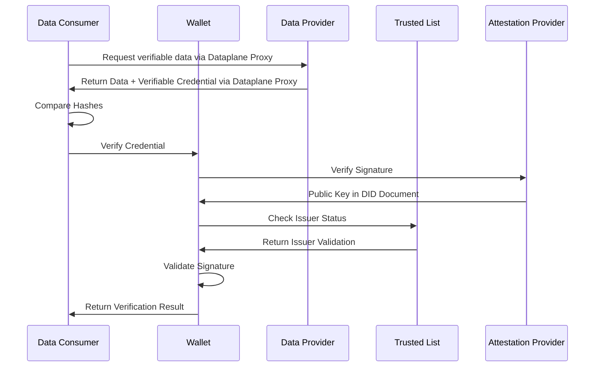

## Building Your Trust Verification System

### What This Service Does

The trust verification service is the heart of your data trust system. It's what actually checks whether the digital certificates you receive are legitimate and trustworthy. Think of it as an automated security guard that examines every piece of verification documentation before allowing data into your systems.

When you receive data with certificates from other organizations, this service performs all the complex technical checks needed to determine if you can trust that data. It handles everything from cryptographic signature validation to checking trusted issuer lists.

### How Verification Works Step-by-Step

Here's what happens when you verify data:



## Technical Details You Need to Know

### The Cryptography Behind Trust

The Data Trust & Security KIT uses proven cryptographic methods based on World Wide Web Consortium (W3C) standards. Don't worry if you're not a cryptography expert - the important thing is that these are battle-tested approaches used across the internet.

#### Digital Signatures - Your Trust Foundation

Digital signatures work like handwritten signatures, but much more secure:

- **Ed25519** - This is our primary signature algorithm. It's fast, secure, and widely supported
- **JsonWebSignature2020** - This is the standardized format we use, ensuring compatibility across different systems
- **Key Management** - We provide secure procedures for generating, storing, and rotating the cryptographic keys

#### What a Signature Looks Like

Every digital signature includes a header that tells verification systems how to process it:

```json
{
  "typ": "vc+ld",
  "b64": false,
  "alg": "HS256",
  "crv": "Ed25519",
  "crit": ["b64"]
}
```

#### DID Web Integration

All issuers must be identifiable through DID Web resolution with Business Partner Number integration:

```text
did:web:<<WALLET-URI>>:<path>
```

Example: `did:web:attestation-provider.com:path:to:did`

### Revocation and Status Management

The KIT provides comprehensive credential lifecycle management including revocation and status tracking. Revocation configuration is critical for maintaining trust and must be properly integrated into the verification process.

#### Revocation List Configuration

The revocation configuration defines how revoked credentials are tracked and validated:

```json
{
    "revocationConfig": {
        "enabled": true,
        "checkPolicy": "MANDATORY",
        "fallbackPolicy": "REJECT",
        "cacheTimeout": 300,
        "retryAttempts": 3,
        "supportedTypes": [
            "RevocationList2020Status",
            "StatusList2021"
        ],
        "endpoints": {
            "primary": "https://revocation.catena-x.net/api/v1/status",
            "fallback": "https://backup-revocation.catena-x.net/api/v1/status"
        }
    }
}
```

#### Revocation List Structure

Credentials include revocation status information that verifiers must check:

```json
{
    "credentialStatus": {
        "id": "https://issuer.example.com/revocation-list/2024/credentials.json#42",
        "type": "RevocationList2020Status",
        "revocationListIndex": "42",
        "revocationListCredential": "https://issuer.example.com/revocation-list/2024/credentials.json"
    }
}
```

#### Revocation List Document

The actual revocation list contains bitstring representing revocation status:

```json
{
    "@context": [
        "https://www.w3.org/2018/credentials/v1",
        "https://w3id.org/vc/status-list/2021/v1"
    ],
    "id": "https://issuer.example.com/revocation-list/2024/credentials.json",
    "type": ["VerifiableCredential", "RevocationList2020Credential"],
    "issuer": "did:web:issuer.example.com:BPNL00000000W3BS",
    "issued": "2024-01-15T10:00:00Z",
    "credentialSubject": {
        "id": "https://issuer.example.com/revocation-list/2024/credentials.json#list",
        "type": "RevocationList2020",
        "encodedList": "H4sIAAAAAAAAA-3BAQ0AAACAkP6v7Q0NgAAAAAAAAAAAAAAAAAAAAIDXhZJH1QAAA"
    },
    "proof": {
        "type": "Ed25519Signature2020",
        "created": "2024-01-15T10:00:00Z",
        "verificationMethod": "did:web:issuer.example.com:BPNL00000000W3BS#key-1",
        "proofPurpose": "assertionMethod",
        "proofValue": "z5vDVKmhQKyiPj..."
    }
}
```

#### Revocation Verification Process

During credential verification, the following revocation checks must be performed:

1. **Extract Revocation Information**: Parse credentialStatus from the verifiable credential
2. **Fetch Revocation List**: Retrieve the revocation list document from the specified URL
3. **Verify List Integrity**: Validate the revocation list's cryptographic signature
4. **Check Revocation Status**: Decode the bitstring and check the specific index
5. **Handle Errors**: Apply fallback policies if revocation list is unavailable
6. **Cache Management**: Cache revocation lists according to configured timeout

#### Error Handling Policies

Configure how to handle revocation check failures:

- **MANDATORY**: Reject credentials if revocation check fails
- **OPTIONAL**: Allow credentials but log warnings
- **CACHED**: Use cached revocation status if fresh list unavailable
- **REJECT**: Default rejection for any revocation-related errors

#### Integration with Trusted Lists

Revocation endpoints are configured within trusted issuer entries:

```json
{
    "issuers": [{
        "did": "did:web:issuer.example.com:BPNL00000000W3BS",
        "revocationEndpoint": "https://issuer.example.com/revocation-api/v1",
        "revocationListUrl": "https://issuer.example.com/revocation-list/2024/credentials.json",
        "revocationCheckRequired": true
    }]
}
```

### Context Definition

For every use case semantic model, a JSON-LD context is required so that verifiable credentials can specify attributes in their content. Context definitions should be hosted in the [eclipse-tractusx/sldt-semantic-models](https://github.com/eclipse-tractusx/sldt-semantic-models) repository under the `gen` folder.

## NOTICE

This work is licensed under the [CC-BY-4.0](https://creativecommons.org/licenses/by/4.0/legalcode).

- SPDX-License-Identifier: CC-BY-4.0
- SPDX-FileCopyrightText: 2025 Contributors to the Eclipse Foundation
- Source URL: [https://github.com/eclipse-tractusx/eclipse-tractusx.github.io](https://github.com/eclipse-tractusx/eclipse-tractusx.github.io)
