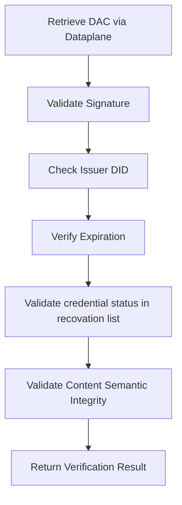
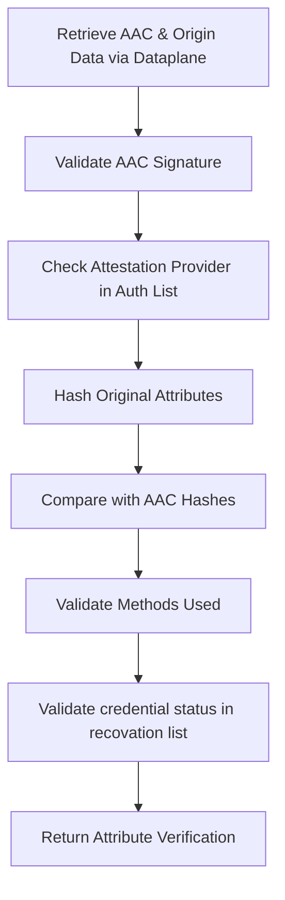

## Types of Digital Certificates

The framework provides different types of certificates for different verification needs:

| Certificate Type | Who Creates It | What It Contains | When You'd Use It |
|------------------|----------------|------------------|-------------------|
| **[Data Attestation Credential (DAC)](#data-attestation-credentials-dac)** | Data Provider or Attestation Provider | Complete dataset with signature | When you want to self-certify your entire dataset or ask the complete data endpoints to be certified |
| **[Attribute Attestation Credential (AAC)](#attribute-attestation-credentials-aac)** | Attestation Provider | Specific data attributes with validation | When you need third-party verification of specific values |
| **[Attribute Attestation Credential with Selective Disclosure (AAC-SD)](#attribute-attestation-credential-aac-with-selective-diclosure)** | Attestation Provider | Verified attributes without revealing original values | When you need verification but want to keep data private |

### Data Attestation Credential (DAC) - Certifying Your Complete Data

Placing aspect models which are in JSON format is easy. The only challenge is to maintain the context at all times. Therefore, for each data model we should generate a JSON-LD "@context" so that the aspect model can be embedded inside the verifiable credential.

For more information on how to generate the JSON-LD "@context" from a JSON Schema, look at the [semantic verification page](semantic-verification.md)

:::info
Substitute the `<aspectModelKey>` with your SemanticId aspect model key, for example, for PCF the following semantic id is given: `urn:samm:io.catenax.pcf:7.0.0#Pcf`, then `urn:samm:<semanticPrefix>:<version>#<aspectModelKey>`, so it would be:

`<semanticPrefix>` = `io.catenax.pcf`

`<version>` = `7.0.0`

`<aspectModelKey>` = `Pcf`

In this way it can be reusable for any aspect model.
:::

```json
{
    "@context": [
        "https://www.w3.org/ns/credentials/v2",
        "https://w3c.github.io/vc-jws-2020/contexts/v1/",
        "https://w3id.org/security/data-integrity/v2",
        "https://raw.githubusercontent.com/eclipse-tractusx/sldt-semantic-models/refs/heads/main/io.catenax.certificate.dac/1.0.0/gen/Dac-context.jsonld",
        "https://raw.githubusercontent.com/eclipse-tractusx/sldt-semantic-models/refs/heads/main/<semanticPrefix>/<version>/gen/<aspectModelKey>-context.jsonld"
    ],
    "type": [
        "VerifiableCredential",
        "DataAttestationCredential",
        "<aspectModelKey>"
    ],
    "semanticId": "urn:samm:<semanticPrefix>:<version>#<aspectModelKey>",
    "credentialSubject": {
        "<aspectModelKey>": <Your Aspect Model JSON Payload Here>,
    },
    "id": "urn:uuid:certificate-123-456-789",
    "issuer": "did:web:tuv-sud.de",
    "validFrom": "2024-01-15T10:30:00Z",
    "validUntil": "2025-01-15T10:30:00Z",
    "validationMethod": [
      {
        "@type": "<validation method type: Ex: Standard>",
        "label": "<standard name: Ex: Catena-X PCF Rulebook>",
        "@id": "<standard number: Ex: CX-0029>",
        "uri": "https://catenax-ev.github.io/docs/standards/overview",
        "complianceCriteria": [
          {
            "@type": "Standard Compliance",
            "@value": "100%"
          },
          {
            "@type": "Verification Level",
            "@value": "3"
          },
          {
            "@type": "Primary Data Share",
            "@value": "80%"
          },
          {...}
        ]
      }
    ],
    "credentialStatus": {
        "id": "https://tuv-sud.de/revocation-list/2024/credentials.json#42",
        "type": "RevocationList2020Status",
        "revocationListIndex": "42",
        "revocationListCredential": "https://tuv-sud.de/revocation-list/2024/credentials.json"
    },
    "proof": {
        "type": "JsonWebSignature2020",
        "proofPurpose": "assertionMethod",
        "verificationMethod": "did:web:tuv-sud.de#key-1",
        "created": "2024-01-15T10:30:00Z",
        "jws": "eyJ0eXAiOiAidmMrbGQiLCAiYjY..."
    }
}
```

<details>
<summary>Example of a DAC for PCF for the Catena-X Rulebook</summary>

```json
{
    "@context": [
        "https://www.w3.org/ns/credentials/v2",
        "https://w3c.github.io/vc-jws-2020/contexts/v1/",
        "https://w3id.org/security/data-integrity/v2",
        "https://raw.githubusercontent.com/eclipse-tractusx/sldt-semantic-models/refs/heads/main/io.catenax.certificate.dac/1.0.0/gen/Dac-context.jsonld",
        "https://raw.githubusercontent.com/eclipse-tractusx/sldt-semantic-models/refs/heads/main/io.catenax.pcf/7.0.0/gen/Pcf-context.jsonld"
    ],
    "type": [
        "VerifiableCredential",
        "DataAttestationCredential",
        "Pcf"
    ],
    "semanticId": "urn:samm:io.catenax.pcf:7.0.0#Pcf",
    "credentialSubject": {
        "Pcf": {
            "specVersion": "urn:io.catenax.pcf:datamodel:version:7.0.0",
            "companyIds": ["telnet://192.0.2.16:80/", "ftp://ftp.is.co.za/rfc/rfc1808.txt", "http://www.ietf.org/rfc/rfc2396.txt"],
            "extWBCSD_productCodeCpc": "011-99000",
            "created": "2022-05-22T21:47:32Z",
            "companyName": "My Corp",
            "extWBCSD_pfStatus": "Active",
            "version": 0,
            "productName": "My Product Name",
            "pcf": {
                "biogenicCarbonEmissionsOtherThanCO2": 1.0,
                "distributionStagePcfExcludingBiogenic": 1.5,
                "biogenicCarbonWithdrawal": 0.0,
                "distributionStageBiogenicCarbonEmissionsOtherThanCO2": 1.0,
                "extWBCSD_allocationRulesDescription": "In accordance with Catena-X PCF Rulebook",
                "exemptedEmissionsDescription": "No exemption",
                "distributionStageFossilGhgEmissions": 0.5,
                "exemptedEmissionsPercent": 0.0,
                "geographyCountrySubdivision": "US-NY",
                "extTFS_luGhgEmissions": 0.3,
                "distributionStageBiogenicCarbonWithdrawal": 0.0,
                "pcfIncludingBiogenic": 1.0,
                "aircraftGhgEmissions": 0.0,
                "productMassPerDeclaredUnit": 0.456,
                "productOrSectorSpecificRules": [{
                    "extWBCSD_operator": "PEF",
                    "productOrSectorSpecificRules": [{
                        "ruleName": "urn:tfs-initiative.com:PCR:The Product Carbon Footprint Guideline for the Chemical Industry:version:v2.0"
                    }],
                    "extWBCSD_otherOperatorName": "NSF"
                }],
                "extTFS_allocationWasteIncineration": "cut-off",
                "pcfExcludingBiogenic": 2.0,
                "referencePeriodEnd": "2022-12-31T23:59:59Z",
                "extWBCSD_characterizationFactors": "AR5",
                "secondaryEmissionFactorSources": [{
                    "secondaryEmissionFactorSource": "ecoinvent 3.8"
                }],
                "unitaryProductAmount": 1000.0,
                "declaredUnit": "liter",
                "referencePeriodStart": "2022-01-01T00:00:01Z",
                "geographyRegionOrSubregion": "Africa",
                "fossilGhgEmissions": 0.5,
                "distributionStageAircraftGhgEmissions": 0.0,
                "boundaryProcessesDescription": "Electricity consumption included as an input in the production phase",
                "geographyCountry": "DE",
                "extWBCSD_packagingGhgEmissions": 0,
                "dlucGhgEmissions": 0.4,
                "carbonContentTotal": 2.5,
                "extTFS_distributionStageLuGhgEmissions": 1.1,
                "primaryDataShare": 56.12,
                "dataQualityRating": {
                    "completenessDQR": 2.0,
                    "technologicalDQR": 2.0,
                    "geographicalDQR": 2.0,
                    "temporalDQR": 2.0,
                    "reliabilityDQR": 2.0,
                    "coveragePercent": 100
                },
                "extWBCSD_packagingEmissionsIncluded": true,
                "extWBCSD_fossilCarbonContent": 0.1,
                "crossSectoralStandardsUsed": [{
                    "crossSectoralStandard": "ISO Standard 14067"
                }],
                "extTFS_distributionStageDlucGhgEmissions": 1.0,
                "distributionStagePcfIncludingBiogenic": 0.0,
                "carbonContentBiogenic": 0.0
            }
        },
        "partialFullPcf": "Cradle-to-gate",
        "productIds": ["http://www.wikipedia.org", "ftp://ftp.is.co.za/rfc/rfc1808.txt"],
        "validityPeriodStart": "2022-01-01T00:00:01Z",
        "comment": "Additional explanatory information not reflected by other attributes",
        "id": "3893bb5d-da16-4dc1-9185-11d97476c254",
        "validityPeriodEnd": "2022-12-31T23:59:59Z",
        "pcfLegalStatement": "This PCF (Product Carbon Footprint) is for information purposes only. It is based upon the standards mentioned above.",
        "productDescription": "Ethanol, 95% solution",
        "precedingPfIds": [{
            "id": "3893bb5d-da16-4dc1-9185-11d97476c254"
        }]
    },
    "id": "urn:uuid:certificate-123-456-789",
    "issuer": "did:web:tuv-sud.de",
    "validFrom": "2024-01-15T10:30:00Z",
    "validUntil": "2025-01-15T10:30:00Z",
    "validationMethod": [
      {
        "@type": "Standard",
        "label": "Catena-X PCF Rulebook Standard",
        "@id": "CX-0029",
        "uri": "https://catena-x.net/fileadmin/user_upload/Standard-Bibliothek/Update_September23/CX-0029-ProductCarbonFootprintRulebook-v2.0.0.pdf",
        "complianceCriteria": [
          {
            "@type": "Standard Compliance",
            "@value": "100%"
          },
          {
            "@type": "Verification Level",
            "@value": "3"
          },
          {
            "@type": "Primary Data Share",
            "@value": "80%"
          }
        ]
      }
    ],
    "credentialStatus": {
        "id": "https://tuv-sud.de/revocation-list/2024/credentials.json#42",
        "type": "RevocationList2020Status",
        "revocationListIndex": "42",
        "revocationListCredential": "https://tuv-sud.de/revocation-list/2024/credentials.json"
    },
    "proof": {
        "type": "JsonWebSignature2020",
        "proofPurpose": "assertionMethod",
        "verificationMethod": "did:web:tuv-sud.de#key-1",
        "created": "2024-01-15T10:30:00Z",
        "jws": "eyJ0eXAiOiAidmMrbGQiLCAiYjY..."
    }
}
```

</details>

### Attribute Attestation Credential (AAC)

In case the original data is not verifiable, or only a part of this data wants to be validated. Specific attributes can be selected from the original data source and provided in a verifiable credential.

This will enable for the Attestation Providers to indicate to each individual attributes which "validation methods" were used to assure that this attribute is "valid" and against what.

```json
{
  "@context": [
      "https://www.w3.org/ns/credentials/v2",
      "https://w3c.github.io/vc-jws-2020/contexts/v1/",
      "https://w3id.org/security/data-integrity/v2",
      "https://raw.githubusercontent.com/eclipse-tractusx/sldt-semantic-models/refs/heads/main/io.catenax.certificate.aac/1.0.0/gen/Aac-context.jsonld",
      "https://raw.githubusercontent.com/eclipse-tractusx/sldt-semantic-models/refs/heads/main/io.catenax.pcf/7.0.0/gen/Pcf-context.jsonld"
  ],
  "type": [
      "VerifiableCredential",
      "AttributeAttestationCredential",
      "Pcf"
  ],
  "credentialSubject": {
      "attributes": [
          {
              "validationMethod": [
                  {
                      "@type": "Standard",
                      "label": "Catena-X PCF Rulebook Standard",
                      "@id": "CX-0029",
                      "uri": "https://catena-x.net/fileadmin/user_upload/Standard-Bibliothek/Update_September23/CX-0029-ProductCarbonFootprintRulebook-v2.0.0.pdf",
                      "complianceCriteria": [
                        {
                          "@type": "Standard Compliance",
                          "@value": "100%"
                        },
                        {
                          "@type": "Verification Level",
                          "@value": "3"
                        },
                        {
                          "@type": "Primary Data Share",
                          "@value": "80%"
                        }
                      ]
                  }
              ],
              "@id": "pcf.biogenicCarbonEmissionsOtherThanCO2",
              "digestMultibase": "0b3402a678ec2788804994fb2df9faf66eecbdde26553e320a8d4a154f53d840d2a32245998c38f885f01137c9fcf123f3752fc841508dc771fa6faaee689b73",
              "revealedValue": 0.5,
              "unit": "kg CO2 equivalent"
          }
      ]
  },
  "origin": {
      "digestMultibase": "c118df3b7bf603a86bd79f03c692153bdb4212ab80d49c12154c92415ae83d6d59187d9ba5af9c4e40208f7d7b1d4c727de78cfbe51e768aae743723ee197374",
      "semanticId": "urn:samm:io.catenax.pcf:7.0.0#Pcf",
      "@id": "did:web:dpp-test-system.com:BPNL000000000000:api:public:urn%3Auuid%3Acd1c0904-27e2-4ae2-8751-5c8c8e4b6812",
      "@type": "application/vc+ld+json"
  },
  "id": "urn:uuid:281a8b98-933c-4d80-ad86-721f1adbe5b3",
  "issuer": "did:web:tuv-sud.de",
  "validFrom": "2024-07-10T15:08:13Z",
  "validUntil": "2024-12-25T15:08:13Z",
  "proof": {
      "type": "JsonWebSignature2020",
      "proofPurpose": "assertionMethod",
      "verificationMethod": "did:web:did:web:tuv-sud.de#N4bTDb14GEnCvwZdFRqK5lwL4nje3bB5Y4nvb01VBKA",
      "created": "2024-07-10T15:08:13Z",
      "jws": "eyJ0eXAiOiAidmMrbGQiLCAiYjY0IjogZmFsc2UsICJjcnYiOiAiRWQyNTUxOSJ9......"
  }
}
```

### Attribute Attestation Credential with Selective Disclosure (AAC-SD)

Selective disclosure allows use to place partial elements from a verifiable credential and present it to another party.

Imagine you have this part of aspect data (verifiable or not):

#### Original Complete Dataset (Private)

```json
{
  "credentialSubject": {
    "Pcf": {
      "specVersion": "urn:io.catenax.pcf:datamodel:version:7.0.0",
      "companyIds": ["telnet://192.0.2.16:80/", "ftp://ftp.is.co.za/rfc/rfc1808.txt", "http://www.ietf.org/rfc/rfc2396.txt"],
      "extWBCSD_productCodeCpc": "011-99000",
      "created": "2022-05-22T21:47:32Z",
      "companyName": "Acme Manufacturing Corp",
      "extWBCSD_pfStatus": "Active",
      "version": 0,
      "productName": "High-Performance Steel Alloy",
      "pcf": {
        "biogenicCarbonEmissionsOtherThanCO2": 1.0,
        "distributionStagePcfExcludingBiogenic": 1.5,
        "biogenicCarbonWithdrawal": 0.0,
        "distributionStageBiogenicCarbonEmissionsOtherThanCO2": 1.0,
        "extWBCSD_allocationRulesDescription": "In accordance with Catena-X PCF Rulebook",
        "exemptedEmissionsDescription": "No exemption",
        "distributionStageFossilGhgEmissions": 0.5,
        "exemptedEmissionsPercent": 0.0,
        "geographyCountrySubdivision": "US-NY",
        "extTFS_luGhgEmissions": 0.3,
        "distributionStageBiogenicCarbonWithdrawal": 0.0,
        "pcfIncludingBiogenic": 1.0,
        "aircraftGhgEmissions": 0.0,
        "productMassPerDeclaredUnit": 0.456,
        "productOrSectorSpecificRules": [{
          "extWBCSD_operator": "PEF",
          "productOrSectorSpecificRules": [{
            "ruleName": "urn:tfs-initiative.com:PCR:The Product Carbon Footprint Guideline for the Chemical Industry:version:v2.0"
          }],
          "extWBCSD_otherOperatorName": "NSF"
        }],
        "extTFS_allocationWasteIncineration": "cut-off",
        "pcfExcludingBiogenic": 2.0,
        "referencePeriodEnd": "2022-12-31T23:59:59Z",
        "extWBCSD_characterizationFactors": "AR5",
        "secondaryEmissionFactorSources": [{
          "secondaryEmissionFactorSource": "ecoinvent 3.8"
        }],
        "unitaryProductAmount": 1000.0,
        "declaredUnit": "liter",
        "referencePeriodStart": "2022-01-01T00:00:01Z",
        "geographyRegionOrSubregion": "Africa",
        "fossilGhgEmissions": 0.5,
        "distributionStageAircraftGhgEmissions": 0.0,
        "boundaryProcessesDescription": "Electricity consumption included as an input in the production phase",
        "geographyCountry": "DE",
        "extWBCSD_packagingGhgEmissions": 0,
        "dlucGhgEmissions": 0.4,
        "carbonContentTotal": 2.5,
        "extTFS_distributionStageLuGhgEmissions": 1.1,
        "primaryDataShare": 56.12,
        "dataQualityRating": {
          "completenessDQR": 2.0,
          "technologicalDQR": 2.0,
          "geographicalDQR": 2.0,
          "temporalDQR": 2.0,
          "reliabilityDQR": 2.0,
          "coveragePercent": 100
        },
        "extWBCSD_packagingEmissionsIncluded": true,
        "extWBCSD_fossilCarbonContent": 0.1,
        "crossSectoralStandardsUsed": [{
          "crossSectoralStandard": "ISO Standard 14067"
        }],
        "extTFS_distributionStageDlucGhgEmissions": 1.0,
        "distributionStagePcfIncludingBiogenic": 0.0,
        "carbonContentBiogenic": 0.0
      },
      "partialFullPcf": "Cradle-to-gate",
      "productIds": ["http://www.wikipedia.org", "ftp://ftp.is.co.za/rfc/rfc1808.txt"],
      "validityPeriodStart": "2022-01-01T00:00:01Z",
      "comment": "Additional explanatory information not reflected by other attributes",
      "id": "3893bb5d-da16-4dc1-9185-11d97476c254",
      "validityPeriodEnd": "2022-12-31T23:59:59Z",
      "pcfLegalStatement": "This PCF (Product Carbon Footprint) is for information purposes only. It is based upon the standards mentioned above.",
      "productDescription": "Ethanol, 95% solution",
      "precedingPfIds": [{
        "id": "3893bb5d-da16-4dc1-9185-11d97476c254"
      }],
      "productionCost": "$45.50",
      "profitMargin": "18.2%",
      "supplierDetails": {
        "primarySupplier": "Steel Solutions Ltd",
        "backupSupplier": "Industrial Materials Inc",
        "contractTerms": "confidential"
      }
    }
  }
}
```

#### Selective Disclosure AAC (Public)

But you want just to let some attributes get certified and be displayed public, example the `pcf.fossilGhgEmissions` attribute and the `pcf.pcfExcludingBiogenic` which could be required for regulations, and could be validated with the PCF rulebook from Catena-X.

Now imagine that in the same time, if a data consumer would be able to retrieve your private data but wants to get a certification that it is correct.

It would be possible by revealing the values which you want to reveal, and hide the ones you want to hide like this. This could even be shared outside a data space, and could be mathematically verified without the need to know the original data values.

```json
{
  "@context": [
    "https://www.w3.org/ns/credentials/v2",
    "https://w3c.github.io/vc-jws-2020/contexts/v1/",
    "https://w3id.org/security/data-integrity/v2",
    "https://raw.githubusercontent.com/eclipse-tractusx/sldt-semantic-models/refs/heads/main/io.catenax.certificate.aac/1.0.0/gen/Aac-context.jsonld",
    "https://raw.githubusercontent.com/eclipse-tractusx/sldt-semantic-models/refs/heads/main/io.catenax.pcf/7.0.0/gen/Pcf-context.jsonld"
  ],
  "type": [
    "VerifiableCredential",
    "AttributeAttestationCredential",
    "Pcf"
  ],
  "credentialSubject": {
    "attributes": [
      {
        "validationMethod": [
          {
            "@type": "Standard",
            "label": "ISO 14067:2018 Carbon Footprint Standard",
            "@id": "ISO-14067",
            "uri": "https://www.iso.org/standard/71206.html",
            "complianceCriteria": [
              {
                "@type": "Standard Compliance",
                "@value": "100%"
              },
              {
                "@type": "Verification Level",
                "@value": "3"
              },
              {
                "@type": "Primary Data Share",
                "@value": "80%"
              }
            ]
          }
        ],
        "@id": "pcf.pcfExcludingBiogenic",
        "digestMultibase": "z3k2a8f7b9c1d2e3f4a5b6c7d8e9f0a1b2c3d4e5f6a7b8c9d0e1f2a3b4c5d6e7f8a9b0c1d2e3f4a5b6c7d8e9f0a1",
        "revealedValue": 2.0,
        "unit": "kg CO2 equivalent"
      },
      {
        "validationMethod": [
          {
            "@type": "Standard",
            "label": "ISO 14067:2018 Carbon Footprint Standard",
            "@id": "ISO-14067",
            "uri": "https://www.iso.org/standard/71206.html",
            "complianceCriteria": [
              {
                "@type": "Standard Compliance",
                "@value": "100%"
              }
            ]
          }
        ],
        "@id": "pcf.fossilGhgEmissions",
        "digestMultibase": "z8b1c2d3e4f5a6b7c8d9e0f1a2b3c4d5e6f7a8b9c0d1e2f3a4b5c6d7e8f9a0b1c2d3e4f5a6b7c8d9e0f1a2b3c4",
        "revealedValue": 0.5,
        "unit": "kg CO2 equivalent"
      }
    ],
    "hiddenAttributes": [
      {
        "@id": "companyName",
        "digestMultibase": "z9f2e1d0c9b8a7f6e5d4c3b2a1f0e9d8c7b6a5f4e3d2c1b0a9f8e7d6c5b4a3f2e1d0c9b8a7f6e5d4c3b2a1f0e9",
        "status": "hidden"
      },
      {
        "@id": "pcf.primaryDataShare",
        "digestMultibase": "z5d4c3b2a1f0e9d8c7b6a5f4e3d2c1b0a9f8e7d6c5b4a3f2e1d0c9b8a7f6e5d4c3b2a1f0e9d8c7b6a5f4e3d2c1",
        "status": "hidden"
      },
      {
        "@id": "pcf.dataQualityRating",
        "digestMultibase": "z1a2b3c4d5e6f7a8b9c0d1e2f3a4b5c6d7e8f9a0b1c2d3e4f5a6b7c8d9e0f1a2b3c4d5e6f7a8b9c0d1e2f3a4b5",
        "status": "hidden"
      },
      {
        "@id": "companyIds",
        "digestMultibase": "z7f6e5d4c3b2a1f0e9d8c7b6a5f4e3d2c1b0a9f8e7d6c5b4a3f2e1d0c9b8a7f6e5d4c3b2a1f0e9d8c7b6a5f4e3",
        "status": "hidden"
      }
    ]
  },
  "origin": {
    "digestMultibase": "zQmX8K2a7B9c1D2e3F4a5B6c7D8e9F0a1B2c3D4e5F6a7B8c9D0e1F2a3B4c5D6e7F8a9B0c1D2e3F4a5B6c7D8e9F0",
    "semanticId": "urn:samm:io.catenax.pcf:7.0.0#Pcf",
    "@id": "did:web:acme-manufacturing.com:BPNL000000000123:api:public:urn%3Auuid%3A12345678-1234-5678-9abc-123456789012",
    "@type": "application/vc+ld+json"
  },
  "id": "urn:uuid:selective-disclosure-example-aac-456789",
  "issuer": "did:web:green-cert-auditors.com",
  "validFrom": "2024-07-15T09:00:00Z",
  "validUntil": "2025-07-15T09:00:00Z",
  "proof": {
    "type": "BbsBlsSignature2020",
    "proofPurpose": "assertionMethod",
    "verificationMethod": "did:web:green-cert-auditors.com#bbs-key-1",
    "created": "2024-07-15T09:00:00Z",
    "proofValue": "kAr7QCkTL67CqOFuPD3YBqKkd4DXCbp5kQGBa8NPT1bSJ...",
    "nonce": "lEixQKDQvRecCifKl789TQj+Ii6YWDLSwn3AxR0VpPJ..."
  }
}
```

#### Selective Disclosure Analysis

##### *What Gets Revealed

| Attribute | Value | Justification |
|-----------|-------|---------------|
| `pcf.pcfExcludingBiogenic` | 2.0 kg CO2 eq | Required for regulatory compliance reporting |
| `pcf.fossilGhgEmissions` | 0.5 kg CO2 eq | Necessary for carbon accounting verification |

##### What Stays Private

| Attribute | Reason for Privacy |
|-----------|-------------------|
| `companyName` | Business identity protection |
| `pcf.primaryDataShare` | Data quality metrics that could reveal business processes |
| `pcf.dataQualityRating` | Internal quality assessments that could be competitively sensitive |
| `companyIds` | Business identifiers that could enable correlation attacks |

## Discovery & Retrieval

It is important to note that this verifiable credentials are exchange via Connector following the [Connector KIT](../../connector-kit/adoption-view/adoption-view.md) specification.

This Verifiable Credentials can be connected to a Digital Twin, in the same way as the original unverified data was located.

In this way the verified data can also be discovered and managed together with its part.

It follows the specifications from the existing [Digital Twin](../../digital-twin-kit/adoption-view.md) + some extra specification to reference that the data format which is retrieved is not a plain submodel, but a verifiable credential.

More information is added in the [digital twins](digital-twins.md) section of this KIT.

## Verification Processes

Once the credentials are retrieved via the control plane this are the process which can be followed to verify:

- Semantic Compliance
- Data Integrity
- Data Conformity against standards/regulations
- Issuance Status (revocation and expiration)
- Data Plausibility
- Version Control Verification (origin check)

All this different verifications advantages can be doen

### Data Attestation Credential Verification

Complete data verification using self-signed credentials:



### Attribute Attestation Credential Verification

Attribute-level verification using selective disclosure:



## NOTICE

This work is licensed under the [CC-BY-4.0](https://creativecommons.org/licenses/by/4.0/legalcode).

- SPDX-License-Identifier: CC-BY-4.0
- SPDX-FileCopyrightText: 2025 Contributors to the Eclipse Foundation
- Source URL: [https://github.com/eclipse-tractusx/eclipse-tractusx.github.io](https://github.com/eclipse-tractusx/eclipse-tractusx.github.io)
