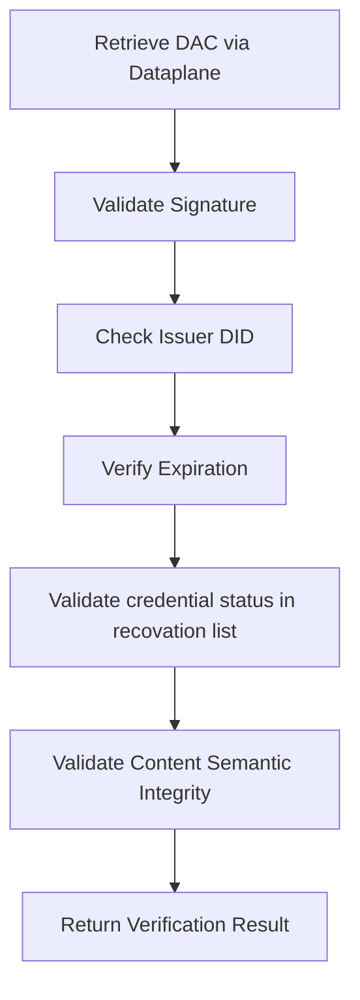
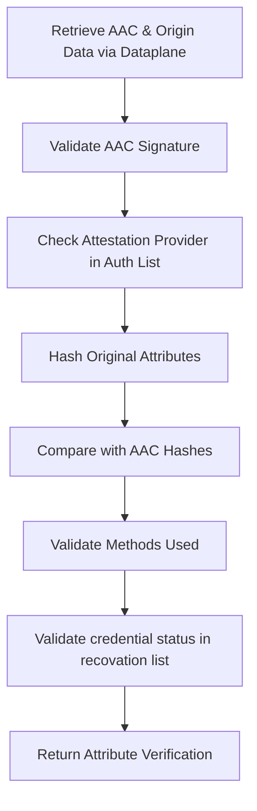

## Types of Verifiable Certificates

The framework provides different types of certificates for different verification needs:

| Certificate Type | Who Creates It | What It Contains | When You'd Use It |
|------------------|----------------|------------------|-------------------|
| **[Data Attestation Credential (DAC)](#data-attestation-credential-dac)** | Data Provider or Attestation Provider | Complete aspect model is included in a verifiable credentials and signed | When the data integrity wants to be assured for a specific Aspect Model JSON Payload, or when a complete Aspect Model wants to be "certified/validated" |
| **[Attribute Attestation Credential (AAC)](#attribute-attestation-credential-aac)** | Attestation Provider | Certify/Validate attributes from an existing Aspect Model JSON Payload, which can be verified (DAC) or not. | When you need third-party verification of specific values from a specific aspect model.|
| **[Attribute Attestation Credential with Selective Disclosure (AAC-SD)](#attribute-attestation-credential-with-selective-disclosure-aac-sd)** | Attestation Provider | Same as the AAC but with the possibility of hiding certain attributes, which can be "verified" only if the private data is accessible by the consumer. | This type of credential can be used to share specif c sets of data with the public world, outside of a dataspace, maintaining data at the dataspace level private. |

### Data Attestation Credential (DAC)

Placing aspect models which are in JSON format is easy. The only challenge is to maintain the context at all times. Therefore, for each data model we should generate a JSON-LD "@context" so that the aspect model can be embedded inside the verifiable credential.

For more information on how to generate the JSON-LD "@context" from a JSON Schema, look at the [semantic verification page](semantic-verification.md)

:::info
Substitute the `<aspectModelKey>` with your SemanticId aspect model key, for example, for PCF the following semantic id is given: `urn:samm:io.catenax.pcf:7.0.0#Pcf`, then `urn:samm:<semanticPrefix>:<version>#<aspectModelKey>`, so it would be:

`<semanticPrefix>` = `io.catenax.pcf`

`<version>` = `7.0.0`

`<aspectModelKey>` = `Pcf`

The `@id` is a unique identifier for your aspect model data, it can be a did, or an uuid4.

The `@type` is the `semanticId` from the data included in the verifiable credential.

The aspect model data can be just included inside of the verifiable credential.

In this way it can be reusable for any aspect model.
:::

```json
{
    "@context": [
        "https://www.w3.org/ns/credentials/v2",
        "https://w3c.github.io/vc-jws-2020/contexts/v1/",
        "https://w3id.org/security/data-integrity/v2",
        "https://raw.githubusercontent.com/eclipse-tractusx/tractusx-profiles/refs/heads/main/tx/credentials/schema/context/dac/v1/DataAttestationCredential.jsonld",
        "https://raw.githubusercontent.com/eclipse-tractusx/sldt-semantic-models/refs/heads/main/<semanticPrefix>/<version>/gen/<aspectModelKey>-context.jsonld"
    ],
    "type": [
        "VerifiableCredential",
        "DataAttestationCredential",
        "<aspectModelKey>"
    ],
    "credentialSubject": {
        "@id": "urn:uuid:bc3bc4db-7167-4600-aa55-77f5929eb270",
        "@type": "urn:samm:<semanticPrefix>:<version>#<aspectModelKey>",
        <Your Aspect Model JSON Payload Here>,
    },
    "id": "urn:uuid:certificate-123-456-789",
    "issuer": "did:web:tuv-sud.de",
    "validFrom": "2024-01-15T10:30:00Z",
    "validUntil": "2025-01-15T10:30:00Z",
    "validationMethod": [
      {
        "@type": "<validation method type: Ex: Standard>",
        "label": "<standard name: Ex: Catena-X PCF Rulebook>",
        "@id": "<standard number: Ex: CX-0029>",
        "uri": "https://catenax-ev.github.io/docs/standards/overview",
        "complianceCriteria": [
          {
            "@type": "Standard Compliance",
            "value": "100%"
          },
          {
            "@type": "Verification Level",
            "value": "3"
          },
          {
            "@type": "Primary Data Share",
            "value": "80%"
          },
          {...}
        ]
      }
    ],
    "credentialStatus": {
      "id": "https://tuv-sud.de/revocation-list/2024/credentials.json#42",
      "type": "BitstringStatusListEntry",
      "statusPurpose": "revocation",
      "statusListIndex": "42",
      "statusListCredential": "https://tuv-sud.de/revocation-list/2024/credentials.json"
    },
    "proof": {
        "type": "JsonWebSignature2020",
        "proofPurpose": "assertionMethod",
        "verificationMethod": "did:web:tuv-sud.de#key-1",
        "created": "2024-01-15T10:30:00Z",
        "jws": "eyJ0eXAiOiAidmMrbGQiLCAiYjY..."
    }
}
```

<details>
<summary>Example of a DAC for PCF for the Catena-X Rulebook</summary>

```json
{
    "@context": [
        "https://www.w3.org/ns/credentials/v2",
        "https://w3c.github.io/vc-jws-2020/contexts/v1/",
        "https://w3id.org/security/data-integrity/v2",
        "https://raw.githubusercontent.com/eclipse-tractusx/tractusx-profiles/refs/heads/main/tx/credentials/schema/context/dac/v1/DataAttestationCredential.jsonld",
        "https://raw.githubusercontent.com/eclipse-tractusx/sldt-semantic-models/refs/heads/main/io.catenax.pcf/7.0.0/gen/Pcf-context.jsonld"
    ],
    "type": [
        "VerifiableCredential",
        "DataAttestationCredential",
        "Pcf"
    ],
    "credentialSubject": {
      "@type": "urn:samm:io.catenax.pcf:7.0.0#Pcf",
      "specVersion": "urn:io.catenax.pcf:datamodel:version:7.0.0",
      "companyIds": ["telnet://192.0.2.16:80/", "ftp://ftp.is.co.za/rfc/rfc1808.txt", "http://www.ietf.org/rfc/rfc2396.txt"],
      "extWBCSD_productCodeCpc": "011-99000",
      "created": "2022-05-22T21:47:32Z",
      "companyName": "My Corp",
      "extWBCSD_pfStatus": "Active",
      "version": 0,
      "productName": "My Product Name",
      "pcf": {
          "biogenicCarbonEmissionsOtherThanCO2": 1.0,
          "distributionStagePcfExcludingBiogenic": 1.5,
          "biogenicCarbonWithdrawal": 0.0,
          "distributionStageBiogenicCarbonEmissionsOtherThanCO2": 1.0,
          "extWBCSD_allocationRulesDescription": "In accordance with Catena-X PCF Rulebook",
          "exemptedEmissionsDescription": "No exemption",
          "distributionStageFossilGhgEmissions": 0.5,
          "exemptedEmissionsPercent": 0.0,
          "geographyCountrySubdivision": "US-NY",
          "extTFS_luGhgEmissions": 0.3,
          "distributionStageBiogenicCarbonWithdrawal": 0.0,
          "pcfIncludingBiogenic": 1.0,
          "aircraftGhgEmissions": 0.0,
          "productMassPerDeclaredUnit": 0.456,
          "productOrSectorSpecificRules": [{
              "extWBCSD_operator": "PEF",
              "productOrSectorSpecificRules": [{
                  "ruleName": "urn:tfs-initiative.com:PCR:The Product Carbon Footprint Guideline for the Chemical Industry:version:v2.0"
              }],
              "extWBCSD_otherOperatorName": "NSF"
          }],
          "extTFS_allocationWasteIncineration": "cut-off",
          "pcfExcludingBiogenic": 2.0,
          "referencePeriodEnd": "2022-12-31T23:59:59Z",
          "extWBCSD_characterizationFactors": "AR5",
          "secondaryEmissionFactorSources": [{
              "secondaryEmissionFactorSource": "ecoinvent 3.8"
          }],
          "unitaryProductAmount": 1000.0,
          "declaredUnit": "liter",
          "referencePeriodStart": "2022-01-01T00:00:01Z",
          "geographyRegionOrSubregion": "Africa",
          "fossilGhgEmissions": 0.5,
          "distributionStageAircraftGhgEmissions": 0.0,
          "boundaryProcessesDescription": "Electricity consumption included as an input in the production phase",
          "geographyCountry": "DE",
          "extWBCSD_packagingGhgEmissions": 0,
          "dlucGhgEmissions": 0.4,
          "carbonContentTotal": 2.5,
          "extTFS_distributionStageLuGhgEmissions": 1.1,
          "primaryDataShare": 56.12,
          "dataQualityRating": {
              "completenessDQR": 2.0,
              "technologicalDQR": 2.0,
              "geographicalDQR": 2.0,
              "temporalDQR": 2.0,
              "reliabilityDQR": 2.0,
              "coveragePercent": 100
          },
          "extWBCSD_packagingEmissionsIncluded": true,
          "extWBCSD_fossilCarbonContent": 0.1,
          "crossSectoralStandardsUsed": [{
              "crossSectoralStandard": "ISO Standard 14067"
          }],
          "extTFS_distributionStageDlucGhgEmissions": 1.0,
          "distributionStagePcfIncludingBiogenic": 0.0,
          "carbonContentBiogenic": 0.0
      },
      "partialFullPcf": "Cradle-to-gate",
      "productIds": ["http://www.wikipedia.org", "ftp://ftp.is.co.za/rfc/rfc1808.txt"],
      "validityPeriodStart": "2022-01-01T00:00:01Z",
      "comment": "Additional explanatory information not reflected by other attributes",
      "id": "3893bb5d-da16-4dc1-9185-11d97476c254",
      "validityPeriodEnd": "2022-12-31T23:59:59Z",
      "pcfLegalStatement": "This PCF (Product Carbon Footprint) is for information purposes only. It is based upon the standards mentioned above.",
      "productDescription": "Ethanol, 95% solution",
      "precedingPfIds": [{
          "id": "3893bb5d-da16-4dc1-9185-11d97476c254"
      }]
    },
    "@id": "urn:uuid:certificate-123-456-789",
    "issuer": "did:web:tuv-sud.de",
    "validFrom": "2024-01-15T10:30:00Z",
    "validUntil": "2025-01-15T10:30:00Z",
    "validationMethod": [
      {
        "@type": "Standard",
        "label": "Catena-X PCF Rulebook Standard",
        "@id": "CX-0029",
        "uri": "https://catena-x.net/fileadmin/user_upload/Standard-Bibliothek/Update_September23/CX-0029-ProductCarbonFootprintRulebook-v2.0.0.pdf",
        "complianceCriteria": [
          {
            "@type": "Standard Compliance",
            "value": "100%"
          },
          {
            "@type": "Verification Level",
            "value": "3"
          },
          {
            "@type": "Primary Data Share",
            "value": "80%"
          }
        ]
      }
    ],
    "credentialStatus": {
      "id": "https://tuv-sud.de/revocation-list/2024/credentials.json#42",
      "type": "BitstringStatusListEntry",
      "statusPurpose": "revocation",
      "statusListIndex": "42",
      "statusListCredential": "https://tuv-sud.de/revocation-list/2024/credentials.json"
    },
    "proof": {
        "type": "JsonWebSignature2020",
        "proofPurpose": "assertionMethod",
        "verificationMethod": "did:web:tuv-sud.de#key-1",
        "created": "2024-01-15T10:30:00Z",
        "jws": "eyJ0eXAiOiAidmMrbGQiLCAiYjY..."
    }
}
```

</details>

<details>
<summary>Example of a DAC for DPP for the Catena-X DPP Rulebook</summary>

```json
{
    "@context": [
        "https://www.w3.org/ns/credentials/v2",
        "https://w3c.github.io/vc-jws-2020/contexts/v1/",
        "https://w3id.org/security/data-integrity/v2",
        "https://raw.githubusercontent.com/eclipse-tractusx/tractusx-profiles/refs/heads/main/tx/credentials/schema/context/dac/v1/DataAttestationCredential.jsonld",
        "https://raw.githubusercontent.com/eclipse-tractusx/sldt-semantic-models/refs/heads/main/io.catenax.pcf/7.0.0/gen/DigitalProductPassport-context.jsonld"
    ],
    "type": [
        "VerifiableCredential",
        "DataAttestationCredential",
        "DigitalProductPassport"
    ],
    "credentialSubject": {
      "@type": "urn:samm:io.catenax.generic.digital_product_passport:6.0.0#DigitalProductPassport",
      "metadata" : {
        "backupReference" : "https://dummy.link",
        "registrationIdentifier" : "https://dummy.link/ID8283746239078",
        "economicOperatorId" : "BPNL0123456789ZZ",
        "lastModification" : "2000-01-01",
        "language" : "EN",
        "predecessor" : "urn:uuid:00000000-0000-0000-0000-000000000000",
        "issueDate" : "2000-01-01",
        "version" : "1.0.0",
        "passportIdentifier" : "urn:uuid:550e8400-e29b-41d4-a716-446655440000",
        "status" : "draft",
        "expirationDate" : "2030-01-01"
      },
      "characteristics" : {
        "generalPerformanceClass" : "A",
        "physicalState" : "solid",
        "physicalDimension" : {
          "volume" : {
            "value" : 20.0,
            "unit" : "unit:cubicMetre"
          },
          "grossWeight" : {
            "value" : 20.0,
            "unit" : "unit:gram"
          },
          "diameter" : {
            "value" : 20.0,
            "unit" : "unit:millimetre"
          },
          "grossVolume" : {
            "value" : 20.0,
            "unit" : "unit:cubicMetre"
          },
          "width" : {
            "value" : 20.0,
            "unit" : "unit:millimetre"
          },
          "length" : {
            "value" : 20.0,
            "unit" : "unit:millimetre"
          },
          "weight" : {
            "value" : 20.0,
            "unit" : "unit:gram"
          },
          "height" : {
            "value" : 20.0,
            "unit" : "unit:millimetre"
          }
        },
        "lifespan" : [ {
          "value" : 36,
          "unit" : "unit:day",
          "key" : "guaranteed lifetime"
        } ]
      },
      "commercial" : {
        "placedOnMarket" : "2000-01-01",
        "purchaseOrder" : "eOMtThyhVNLWUZNRcBaQKxI",
        "purpose" : [ "automotive" ],
        "recallInformation" : {
          "recallInformationDocumentation" : [ {
            "contentType" : "URL",
            "header" : "Example Document XYZ",
            "content" : "https://dummy.link"
          } ],
          "applicable" : true
        }
      },
      "identification" : {
        "batch" : [ {
          "value" : "BID12345678",
          "key" : "batchId"
        } ],
        "codes" : [ {
          "value" : "8703 24 10 00",
          "key" : "TARIC"
        } ],
        "type" : {
          "manufacturerPartId" : "123-0.740-3434-A",
          "nameAtManufacturer" : "Mirror left"
        },
        "classification" : [ {
          "classificationStandard" : "GIN 20510-21513",
          "classificationID" : "1004712",
          "classificationDescription" : "Generic standard for classification of parts in the automotive industry."
        } ],
        "serial" : [ {
          "value" : "SN12345678",
          "key" : "partInstanceId"
        } ],
        "dataCarrier" : {
          "carrierType" : "QR",
          "carrierLayout" : "upper-left side"
        }
      },
      "sources" : [ {
        "header" : "Example Document XYZ",
        "category" : "Product Specifications",
        "type" : "URL",
        "content" : "https://dummy.link"
      } ],
      "materials" : {
        "substancesOfConcern" : {
          "applicable" : true,
          "content" : [ {
            "unit" : "unit:partPerMillion",
            "hazardClassification" : {
              "category" : "category 1A",
              "statement" : "Causes severe skin burns and eye damage.",
              "class" : "Skin corrosion"
            },
            "documentation" : [ {
              "contentType" : "URL",
              "header" : "Example Document XYZ",
              "content" : "https://dummy.link"
            } ],
            "concentrationRange" : [ {
              "max" : 2.6,
              "min" : 2.1
            } ],
            "location" : "Housing",
            "concentration" : 5.3,
            "exemption" : "shall not apply to product x containing not more than 1,5 ml of liquid",
            "id" : [ {
              "type" : "CAS",
              "name" : "phenolphthalein",
              "id" : "201-004-7"
            } ]
          } ]
        },
        "materialComposition" : {
          "applicable" : true,
          "content" : [ {
            "unit" : "unit:partPerMillion",
            "recycled" : 12.5,
            "critical" : true,
            "renewable" : 23.5,
            "documentation" : [ {
              "contentType" : "URL",
              "header" : "Example Document XYZ",
              "content" : "https://dummy.link"
            } ],
            "concentration" : 5.3,
            "id" : [ {
              "type" : "CAS",
              "name" : "phenolphthalein",
              "id" : "201-004-7"
            } ]
          } ]
        }
      },
      "handling" : {
        "applicable" : true,
        "content" : {
          "producer" : [ {
            "id" : "BPNL0123456789ZZ"
          } ],
          "sparePart" : [ {
            "manufacturerPartId" : "123-0.740-3434-A",
            "nameAtManufacturer" : "Mirror left"
          } ]
        }
      },
      "additionalData" : [ {
        "description" : "Description of an attribute",
        "label" : "Maximum permitted battery power",
        "type" : {
          "typeUnit" : "unit:volume",
          "dataType" : "array"
        },
        "data" : "23",
        "children" : [ {
          "description" : "Description of an attribute",
          "label" : "Maximum permitted battery power",
          "type" : {
            "typeUnit" : "unit:volume",
            "dataType" : "array"
          },
          "data" : "23"
        } ]
      } ],
      "operation" : {
        "import" : {
          "applicable" : true,
          "content" : {
            "eori" : "GB123456789000",
            "id" : "BPNL0123456789ZZ"
          }
        },
        "other" : {
          "id" : "BPNL0123456789XX",
          "role" : "distributor"
        },
        "manufacturer" : {
          "facility" : [ {
            "facility" : "BPNA1234567890AA"
          } ],
          "manufacturingDate" : "2000-01-31",
          "manufacturer" : "BPNLjMlbqpptGjBL"
        }
      },
      "sustainability" : {
        "reparabilityScore" : "B",
        "productFootprint" : {
          "material" : [ {
            "lifecycle" : "main product production",
            "rulebook" : [ {
              "contentType" : "URL",
              "header" : "Example Document XYZ",
              "content" : "https://dummy.link"
            } ],
            "unit" : "kg CO2 / kWh",
            "performanceClass" : "A",
            "manufacturingPlant" : [ {
              "facility" : "BPNA1234567890AA"
            } ],
            "type" : "Climate Change Total",
            "value" : 12.678,
            "declaration" : [ {
              "contentType" : "URL",
              "header" : "Example Document XYZ",
              "content" : "https://dummy.link"
            } ]
          } ],
          "carbon" : [ {
            "lifecycle" : "main product production",
            "rulebook" : [ {
              "contentType" : "URL",
              "header" : "Example Document XYZ",
              "content" : "https://dummy.link"
            } ],
            "unit" : "kg CO2 / kWh",
            "performanceClass" : "A",
            "manufacturingPlant" : [ {
              "facility" : "BPNA1234567890AA"
            } ],
            "type" : "Climate Change Total",
            "value" : 12.678,
            "declaration" : [ {
              "contentType" : "URL",
              "header" : "Example Document XYZ",
              "content" : "https://dummy.link"
            } ]
          } ],
          "environmental" : [ {
            "lifecycle" : "main product production",
            "rulebook" : [ {
              "contentType" : "URL",
              "header" : "Example Document XYZ",
              "content" : "https://dummy.link"
            } ],
            "unit" : "kg CO2 / kWh",
            "performanceClass" : "A",
            "manufacturingPlant" : [ {
              "facility" : "BPNA1234567890AA"
            } ],
            "type" : "Climate Change Total",
            "value" : 12.678,
            "declaration" : [ {
              "contentType" : "URL",
              "header" : "Example Document XYZ",
              "content" : "https://dummy.link"
            } ]
          } ]
        },
        "status" : "original",
        "durabilityScore" : "A"
      }
    },
    "@id": "urn:uuid:certificate-123-456-789",
    "issuer": "did:web:tuv-sud.de",
    "validFrom": "2024-01-15T10:30:00Z",
    "validUntil": "2025-01-15T10:30:00Z",
    "validationMethod": [
      {
        "@type": "Standard",
        "label": "Catena-X DPP Rulebook Standard",
        "@id": "CX-0143",
        "uri": "https://catenax-ev.github.io/docs/standards/CX-0143-UseCaseCircularEconomyDigitalProductPassportStandard/CX-0143-SEM",
        "complianceCriteria": [
          {
            "@type": "Standard Compliance",
            "value": "100%"
          },
          {
            "@type": "Primary Data Share",
            "value": "80%"
          }
        ]
      }
    ],
    "credentialStatus": {
      "id": "https://tuv-sud.de/revocation-list/2024/credentials.json#42",
      "type": "BitstringStatusListEntry",
      "statusPurpose": "revocation",
      "statusListIndex": "42",
      "statusListCredential": "https://tuv-sud.de/revocation-list/2024/credentials.json"
    },
    "proof": {
        "type": "JsonWebSignature2020",
        "proofPurpose": "assertionMethod",
        "verificationMethod": "did:web:tuv-sud.de#key-1",
        "created": "2024-01-15T10:30:00Z",
        "jws": "eyJ0eXAiOiAidmMrbGQiLCAiYjY..."
    }
}
```

</details>

#### Example without hosted @context

The reason why @contexts are hosted is so that they can be reused in multiple verifiable credentials to define the semantic structure of the data content.

The consumer by using a JSON-LD playground or library is able to expand the JSON-LD to a parsable file.

For that the context much match the semantics from the content.

This is an example of a verifiable credential without a hosted @context:

<details>

<summary>Example of a DAC for PCF without hosted @context</summary>

```json
{
  "@context": [
    "https://www.w3.org/ns/credentials/v2",
    "https://w3id.org/security/data-integrity/v2",
    {
      "@context": {
        "@version": 1.1,
        "schema": "https://schema.org/",
        "dac-aspect": "https://github.com/eclipse-tractusx/tractusx-profiles/blob/main/tx/credentials/schema/context/dac/v1/DataAttestationCredential.jsonld#",
        "DataAttestationCredential": {
          "@id": "dac-aspect:DataAttestationCredential",
          "@type": "@id"
        },
        "validationMethod": {
          "@id": "dac-aspect:validationMethod",
          "@context": {
            "@version": 1.1,
            "id": "@id",
            "type": "@type",
            "@context": {
              "@version": 1.1,
              "id": {
                "@id": "dac-aspect:id",
                "@context": {
                  "@definition": "Mandatory: Unique identifier for the validation method."
                },
                "@type": "schema:string"
              },
              "type": {
                "@id": "dac-aspect:type",
                "@context": {
                  "@definition": "Mandatory: The type of validation method used for data attestation."
                },
                "@type": "schema:string"
              },
              "label": {
                "@id": "dac-aspect:label",
                "@context": {
                  "@definition": "Mandatory: Human-readable label for the validation method."
                },
                "@type": "schema:string"
              },
              "uri": {
                "@id": "dac-aspect:uri",
                "@context": {
                  "@definition": "Mandatory: URI pointing to the validation method documentation or specification."
                },
                "@type": "schema:string"
              },
              "complianceCriteria": {
                "@id": "dac-aspect:complianceCriteria",
                "@context": {
                  "@version": 1.1,
                  "id": "@id",
                  "type": "@type",
                  "@context": {
                    "@version": 1.1,
                    "id": "@id",
                    "type": {
                      "@id": "dac-aspect:type",
                      "@context": {
                        "@definition": "Mandatory: The type of compliance criterion used for validation."
                      },
                      "@type": "schema:string"
                    },
                    "value": {
                      "@id": "dac-aspect:value",
                      "@context": {
                        "@definition": "Mandatory: The value of the compliance criterion."
                      },
                      "@type": "schema:string"
                    }
                  },
                  "@definition": "Mandatory: Set of compliance criteria for the validation method."
                },
                "@container": "@list"
              }
            },
            "@definition": "Array of validation methods used for data verification and attestation in Data Attestation Credential (DAC)."
          },
          "@container": "@list"
        },
        "@definition": "A Data Attestation Credential (DAC) represents validation methods and compliance criteria used for data verification and attestation"
      }
    },
    {
      "@context": {
        "@version": 1.1,
        "schema": "https://schema.org/",
        "pcf-aspect": "urn:samm:io.catenax.pcf:7.0.0#",
        "Pcf": {
          "@id": "pcf-aspect:Pcf",
          "@type": "@id"
        },
        "specVersion": {
          "@id": "pcf-aspect:specVersion",
          "@context": {
            "@definition": "Mandatory: Version of the product footprint data specification as defined in the Catena-X PCF Rulebook (Version 3.0.0) in accordance with the technical specifications for PCF Data Exchange (Version 2.0.0) from the WBCSD (World Business Council for Sustainable Development)/ PACT initiative.",
            "@samm-urn": "urn:samm:io.catenax.pcf:7.0.0#specVersion"
          },
          "@type": "schema:string"
        },
        "partialFullPcf": {
          "@id": "pcf-aspect:partialFullPcf",
          "@context": {
            "@definition": "Mandatory: Indicator for partial or full PCF (Product Carbon Footprint) declaration as specified in the Catena-X PCF Rulebook (Version 3.0.0).",
            "@samm-urn": "urn:samm:io.catenax.pcf:7.0.0#partialFullPcf"
          },
          "@type": "schema:string"
        },
        "precedingPfIds": {
          "@id": "pcf-aspect:precedingPfIds",
          "@context": {
            "@version": 1.1,
            "id": "@id",
            "type": "@type",
            "@context": {
              "@version": 1.1,
              "id": {
                "@id": "pcf-aspect:id",
                "@context": {
                  "@definition": "Mandatory: The product footprint identifier as specified in the Catena-X PCF Rulebook (Version 3.0.0) in accordance with the technical specifications for PCF Data Exchange (Version 2.0.0) from the WBCSD (World Business Council for Sustainable Development)/ PACT initiative.",
                  "@samm-urn": "urn:samm:io.catenax.pcf:7.0.0#id"
                },
                "@type": "schema:string"
              },
              "type": "@type"
            },
            "@definition": "Optional: Set of preceding PCF (Product Carbon Footprint) identifiers without duplicates as specified in the Catena-X PCF Rulebook (Version 3.0.0) in accordance with the WBCSD (World Business Council for Sustainable Development) Pathfinder framework and the technical specifications for PCF Data Exchange (Version 2.0.0) from the WBCSD/ PACT initiative. Declared as \"optional\" in WBCSD, needs to be covered by application.",
            "@samm-urn": "urn:samm:io.catenax.pcf:7.0.0#precedingPfIds"
          },
          "@container": "@list"
        },
        "version": {
          "@id": "pcf-aspect:version",
          "@context": {
            "@definition": "Mandatory: Version of the product (carbon) footprint as specified in the Catena-X PCF Rulebook (Version 3.0.0) in accordance with the technical specifications for PCF Data Exchange (Version 2.0.0) from the WBCSD (World Business Council for Sustainable Development)/ PACT initiative. In Catena-X for example set to \"0\" per default.",
            "@samm-urn": "urn:samm:io.catenax.pcf:7.0.0#version"
          },
          "@type": "schema:number"
        },
        "created": {
          "@id": "pcf-aspect:created",
          "@context": {
            "@definition": "Mandatory: Timestamp of the creation of the Product (Carbon) Footprint as specified in the Catena-X PCF Rulebook (Version 3.0.0) in accordance with the technical specifications for PCF Data Exchange (Version 2.0.0) from the WBCSD (World Business Council for Sustainable Development)/ PACT initiative.",
            "@samm-urn": "urn:samm:io.catenax.pcf:7.0.0#created"
          },
          "@type": "schema:string"
        },
        "extWBCSD_pfStatus": {
          "@id": "pcf-aspect:extWBCSD_pfStatus",
          "@context": {
            "@definition": "Mandatory: Status indicator of a product (carbon) footprint as specified in the technical specifications for PCF Data Exchange (Version 2.0.0) from the WBCSD (World Business Council for Sustainable Development)/ PACT initiative. WBCSD specific extension, in Catena-X for example set to \"Active\" per default.",
            "@samm-urn": "urn:samm:io.catenax.pcf:7.0.0#status"
          },
          "@type": "schema:string"
        },
        "validityPeriodStart": {
          "@id": "pcf-aspect:validityPeriodStart",
          "@context": {
            "@definition": "Optional: Start of interval during which the product (carbon) footprint is declared as valid as specified in the Catena-X PCF Rulebook (Version 3.0.0) in accordance with the technical specifications for PCF Data Exchange (Version 2.0.0) from the WBCSD (World Business Council for Sustainable Development)/ PACT initiative. If specified, the validity period start must be equal to or greater than the reference period end.",
            "@samm-urn": "urn:samm:io.catenax.pcf:7.0.0#validityPeriodStart"
          },
          "@type": "schema:string"
        },
        "validityPeriodEnd": {
          "@id": "pcf-aspect:validityPeriodEnd",
          "@context": {
            "@definition": "Optional: End of interval during which the product (carbon) footprint is declared as valid as specified in the Catena-X PCF Rulebook (Version 3.0.0) in accordance with the technical specifications for PCF Data Exchange (Version 2.0.0) from the WBCSD (World Business Council for Sustainable Development)/ PACT initiative.",
            "@samm-urn": "urn:samm:io.catenax.pcf:7.0.0#validityPeriodEnd"
          },
          "@type": "schema:string"
        },
        "comment": {
          "@id": "pcf-aspect:comment",
          "@context": {
            "@definition": "Optional: Additional information and instructions related to the calculation of the product (carbon) footprint as specified in the Catena-X PCF Rulebook (Version 3.0.0) in accordance with the technical specifications for PCF Data Exchange (Version 2.0.0) from the WBCSD (World Business Council for Sustainable Development)/ PACT initiative.",
            "@samm-urn": "urn:samm:io.catenax.pcf:7.0.0#comment"
          },
          "@type": "schema:string"
        },
        "companyName": {
          "@id": "pcf-aspect:companyName",
          "@context": {
            "@definition": "Mandatory: Name of the product (carbon) footprint data owner as specified in the Catena-X PCF Rulebook (Version 3.0.0) in accordance with the technical specifications for PCF Data Exchange (Version 2.0.0) from the WBCSD (World Business Council for Sustainable Development)/ PACT initiative.",
            "@samm-urn": "urn:samm:io.catenax.pcf:7.0.0#companyName"
          },
          "@type": "schema:string"
        },
        "companyIds": {
          "@id": "pcf-aspect:companyIds",
          "@context": {
            "@definition": "Mandatory: Non-empty set of Uniform Resource Names (URN). Each value is supposed to uniquely identify the product (carbon) footprint data owner as specified in the Catena-X PCF Rulebook (Version 3.0.0) in accordance with the technical specifications for PCF Data Exchange (Version 2.1.0) from the WBCSD (World Business Council for Sustainable Development)/ PACT initiative. For Catena-X Industry Core compliance the set of URNs must contain at least the Business Partner Number Legal Entity (BPNL) in the specified format urn:bpn:id:BPNL[a-zA-Z0-9]{12}.\u00a0",
            "@samm-urn": "urn:samm:io.catenax.pcf:7.0.0#companyIds"
          },
          "@container": "@list",
          "@type": "schema:string"
        },
        "productDescription": {
          "@id": "pcf-aspect:productDescription",
          "@context": {
            "@definition": "Optional: Free-form description of the product as specified in the Catena-X PCF Rulebook (Version 3.0.0) in accordance with the technical specifications for PCF Data Exchange (Version 2.0.0) from the WBCSD (World Business Council for Sustainable Development)/ PACT initiative.",
            "@samm-urn": "urn:samm:io.catenax.pcf:7.0.0#productDescription"
          },
          "@type": "schema:string"
        },
        "productIds": {
          "@id": "pcf-aspect:productIds",
          "@context": {
            "@definition": "Mandatory: Non-empty set of product identifiers. Each value is supposed to uniquely identify the product as specified in the Catena-X PCF Rulebook (Version 3.0.0) in accordance with the technical specifications for PCF Data Exchange (Version 2.1.0) from the WBCSD (World Business Council for Sustainable Development)/ PACT initiative. In Catena-X productId corresponds with Industry Core manufacturerPartId.",
            "@samm-urn": "urn:samm:io.catenax.pcf:7.0.0#productIds"
          },
          "@container": "@list",
          "@type": "schema:string"
        },
        "extWBCSD_productCodeCpc": {
          "@id": "pcf-aspect:extWBCSD_productCodeCpc",
          "@context": {
            "@definition": "Mandatory: UN (United Nations) Product Classification Code (CPC - Central Classification Code) of a given product as specified the technical specifications for PCF Data Exchange (Version 2.0.0) from the WBCSD (World Business Council for Sustainable Development)/ PACT initiative. WBCSD specific extension, which will probably be declared as \"optional\" in a later WBCSD specification version. In Catena-X for example specified with default value \"011-99000\".",
            "@samm-urn": "urn:samm:io.catenax.pcf:7.0.0#productCategoryCpc"
          },
          "@type": "schema:string"
        },
        "productName": {
          "@id": "pcf-aspect:productName",
          "@context": {
            "@definition": "Mandatory: Non-empty trade name of a product as specified in the Catena-X PCF Rulebook (Version 3.0.0) in accordance with the technical specifications for PCF Data Exchange (Version 2.1.0) from the WBCSD (World Business Council for Sustainable Development)/ PACT initiative. In Catena-X productNameCompany corresponds with Industry Core nameAtManufacturer.\u00a0",
            "@samm-urn": "urn:samm:io.catenax.pcf:7.0.0#productNameCompany"
          },
          "@type": "schema:string"
        },
        "pcf": {
          "@id": "pcf-aspect:pcf",
          "@context": {
            "@version": 1.1,
            "id": "@id",
            "type": "@type",
            "declaredUnit": {
              "@id": "pcf-aspect:declaredUnit",
              "@context": {
                "@definition": "Mandatory: Unit of analysis of a product in context of the PCF (product carbon footprint) as specified in the Catena-X PCF Rulebook (Version 3.0.0) in accordance with the technical specifications for PCF Data Exchange (Version 2.0.0) from the WBCSD (World Business Council for Sustainable Development)/ PACT initiative. In Catena-X for example list of valid units includes \"piece\".",
                "@samm-urn": "urn:samm:io.catenax.pcf:7.0.0#declaredUnit"
              },
              "@type": "schema:string"
            },
            "unitaryProductAmount": {
              "@id": "pcf-aspect:unitaryProductAmount",
              "@context": {
                "@definition": "Mandatory: Amount of units contained within a product in context of the PCF (Product Carbon Footprint) as specified in the Catena-X PCF Rulebook (Version 3.0.0) in accordance with the technical specifications for PCF Data Exchange (Version 2.0.0) from the WBCSD (World Business Council for Sustainable Development)/ PACT initiative.",
                "@samm-urn": "urn:samm:io.catenax.pcf:7.0.0#unitaryProductAmount"
              },
              "@type": "schema:number"
            },
            "productMassPerDeclaredUnit": {
              "@id": "pcf-aspect:productMassPerDeclaredUnit",
              "@context": {
                "@definition": "Mandatory: Mass of a product per declared unit (net, unpackaged) in context of the PCF (Product Carbon Footprint) as specified in the Catena-X PCF Rulebook (Version 3.0.0).",
                "@samm-urn": "urn:samm:io.catenax.pcf:7.0.0#productMassPerDeclaredUnit"
              },
              "@type": "schema:number"
            },
            "exemptedEmissionsPercent": {
              "@id": "pcf-aspect:exemptedEmissionsPercent",
              "@context": {
                "@definition": "Mandatory: Applied cut-off percentage of emissions excluded from PCF (Product Carbon Footprint).\nFor accordance with Catena-X PCF Rulebook (Version 3.0.0) <3%.",
                "@samm-urn": "urn:samm:io.catenax.pcf:7.0.0#exemptedEmissionsPercent"
              },
              "@type": "schema:number"
            },
            "exemptedEmissionsDescription": {
              "@id": "pcf-aspect:exemptedEmissionsDescription",
              "@context": {
                "@definition": "Optional: Rationale behind exclusion of specific PCF (Product Carbon Footprint) emissions as specified in the Catena-X PCF Rulebook (Version 3.0.0) in accordance with the technical specifications for PCF Data Exchange (Version 2.0.0) from the WBCSD (World Business Council for Sustainable Development)/ PACT initiative.",
                "@samm-urn": "urn:samm:io.catenax.pcf:7.0.0#exemptedEmissionsDescription"
              },
              "@type": "schema:string"
            },
            "boundaryProcessesDescription": {
              "@id": "pcf-aspect:boundaryProcessesDescription",
              "@context": {
                "@definition": "Optional: Processes attributable to each lifecycle stage as specified in the Catena-X PCF Rulebook (Version 3.0.0) in accordance with the technical specifications for PCF Data Exchange (Version 2.0.0) from the WBCSD (World Business Council for Sustainable Development)/ PACT initiative.",
                "@samm-urn": "urn:samm:io.catenax.pcf:7.0.0#boundaryProcessesDescription"
              },
              "@type": "schema:string"
            },
            "geographyCountrySubdivision": {
              "@id": "pcf-aspect:geographyCountrySubdivision",
              "@context": {
                "@definition": "Optional: Subdivision of a country which must be an ISO 3166-2 subdivision code as specified in the Catena-X PCF Rulebook (Version 3.0.0) in accordance with the technical specifications for PCF Data Exchange (Version 2.0.0) from the WBCSD (World Business Council for Sustainable Development)/ PACT initiative.",
                "@samm-urn": "urn:samm:io.catenax.pcf:7.0.0#geographyCountrySubdivision"
              },
              "@type": "schema:string"
            },
            "geographyCountry": {
              "@id": "pcf-aspect:geographyCountry",
              "@context": {
                "@definition": "Optional: Two letter country code that must conform to data type ISO 3166CC as specified in the Catena-X PCF Rulebook (Version 3.0.0) in accordance with the technical specifications for PCF Data Exchange (Version 2.0.0) from the WBCSD (World Business Council for Sustainable Development)/ PACT initiative.",
                "@samm-urn": "urn:samm:io.catenax.pcf:7.0.0#geographyCountry"
              },
              "@type": "schema:string"
            },
            "geographyRegionOrSubregion": {
              "@id": "pcf-aspect:geographyRegionOrSubregion",
              "@context": {
                "@definition": "Mandatory: Region according to list as specified in the Catena-X PCF Rulebook (Version 3.0.0) in accordance with the technical specifications for PCF Data Exchange (Version 2.0.0) from the WBCSD (World Business Council for Sustainable Development)/ PACT initiative.",
                "@samm-urn": "urn:samm:io.catenax.pcf:7.0.0#geographyRegionOrSubregion"
              },
              "@type": "schema:string"
            },
            "referencePeriodStart": {
              "@id": "pcf-aspect:referencePeriodStart",
              "@context": {
                "@definition": "Mandatory: Start of time boundary for which a PCF (Product Carbon Footprint) value is considered to be representative as specified in the Catena-X PCF Rulebook (Version 3.0.0) in accordance with the technical specifications for PCF Data Exchange (Version 2.0.0) from the WBCSD (World Business Council for Sustainable Development)/ PACT initiative.",
                "@samm-urn": "urn:samm:io.catenax.pcf:7.0.0#referencePeriodStart"
              },
              "@type": "schema:string"
            },
            "referencePeriodEnd": {
              "@id": "pcf-aspect:referencePeriodEnd",
              "@context": {
                "@definition": "Mandatory: End of time boundary for which a PCF (Product Carbon Footprint) value is considered to be representative as specified in the Catena-X PCF Rulebook (Version 3.0.0) in accordance with the technical specifications for PCF Data Exchange (Version 2.0.0) from the WBCSD (World Business Council for Sustainable Development)/ PACT initiative.",
                "@samm-urn": "urn:samm:io.catenax.pcf:7.0.0#referencePeriodEnd"
              },
              "@type": "schema:string"
            },
            "crossSectoralStandardsUsed": {
              "@id": "pcf-aspect:crossSectoralStandardsUsed",
              "@context": {
                "@version": 1.1,
                "id": "@id",
                "type": "@type",
                "@context": {
                  "@version": 1.1,
                  "id": "@id",
                  "type": "@type",
                  "crossSectoralStandard": {
                    "@id": "pcf-aspect:crossSectoralStandard",
                    "@context": {
                      "@definition": "Mandatory: Discloses a cross-sectoral standard applied for calculating or allocating GHG (Greenhouse Gas) emissions as specified in the Catena-X PCF Rulebook (Version 3.0.0) in accordance with the technical specifications for PCF Data Exchange (Version 2.0.0) from the WBCSD (World Business Council for Sustainable Development)/ PACT initiative.",
                      "@samm-urn": "urn:samm:io.catenax.pcf:7.0.0#crossSectoralStandard"
                    },
                    "@type": "schema:string"
                  }
                },
                "@definition": "Mandatory: Discloses the cross-sectoral standards applied for calculating or allocating GHG (Greenhouse Gas) emissions as specified in the Catena-X PCF Rulebook (Version 3.0.0) in accordance with the technical specifications for PCF Data Exchange (Version 2.0.0) from the WBCSD (World Business Council for Sustainable Development)/ PACT initiative.",
                "@samm-urn": "urn:samm:io.catenax.pcf:7.0.0#crossSectoralStandardsUsed"
              },
              "@container": "@list"
            },
            "productOrSectorSpecificRules": {
              "@id": "pcf-aspect:productOrSectorSpecificRules",
              "@context": {
                "@version": 1.1,
                "id": "@id",
                "type": "@type",
                "@context": {
                  "@version": 1.1,
                  "id": "@id",
                  "type": "@type",
                  "extWBCSD_operator": {
                    "@id": "pcf-aspect:extWBCSD_operator",
                    "@context": {
                      "@definition": "Mandatory: Operator of PCR (Product Category Rule)/ PSR (Product Specific Rule) as specified in the technical specifications for PCF Data Exchange (Version 2.0.0) from the WBCSD (World Business Council for Sustainable Development)/ PACT initiative. WBCSD specific extension, in Catena-X for example must always be \"Other\".",
                      "@samm-urn": "urn:samm:io.catenax.pcf:7.0.0#operator"
                    },
                    "@type": "schema:string"
                  },
                  "productOrSectorSpecificRules": {
                    "@id": "pcf-aspect:productOrSectorSpecificRules",
                    "@context": {
                      "@version": 1.1,
                      "id": "@id",
                      "type": "@type",
                      "@context": {
                        "@version": 1.1,
                        "id": "@id",
                        "type": "@type",
                        "ruleName": {
                          "@id": "pcf-aspect:ruleName",
                          "@context": {
                            "@definition": "Name of a rule applied by a specific operator as specified in the Catena-X PCF Rulebook (Version 3.0.0) in accordance with the technical specifications for PCF Data Exchange (Version 2.0.0) from the WBCSD (World Business Council for Sustainable Development)/ PACT initiative.",
                            "@samm-urn": "urn:samm:io.catenax.pcf:7.0.0#ruleName"
                          },
                          "@type": "schema:string"
                        }
                      },
                      "@definition": "Mandatory: Product-specific or sector-specific set of rules used for calculating or allocating GHG (Greenhouse Gas) emissions applied from the specified operator as specified in the Catena-X PCF Rulebook (Version 3.0.0) in accordance with the technical specifications for PCF Data Exchange (Version 2.0.0) from the WBCSD (World Business Council for Sustainable Development)/ PACT initiative.",
                      "@samm-urn": "urn:samm:io.catenax.pcf:7.0.0#ruleNames"
                    },
                    "@container": "@list"
                  },
                  "extWBCSD_otherOperatorName": {
                    "@id": "pcf-aspect:extWBCSD_otherOperatorName",
                    "@context": {
                      "@definition": "Optional: Other operator of PCR (Product Category Rule)/ PSR (Product Specific Rule) as specified in the technical specifications for PCF Data Exchange (Version 2.0.0) from the WBCSD (World Business Council for Sustainable Development)/ PACT initiative. WBCSD specific extension, in Catena-X for example specified by a default value.",
                      "@samm-urn": "urn:samm:io.catenax.pcf:7.0.0#otherOperatorName"
                    },
                    "@type": "schema:string"
                  }
                },
                "@definition": "Mandatory: Product or sector specific rules applied for calculating or allocating GHG (Greenhouse Gas) emissions, e.g. PCRs (Product Category Rules), including operators or publishers and according rule names as specified in the Catena-X PCF Rulebook (Version 3.0.0) in accordance with the technical specifications for PCF Data Exchange (Version 2.0.0) from the WBCSD (World Business Council for Sustainable Development)/ PACT initiative.",
                "@samm-urn": "urn:samm:io.catenax.pcf:7.0.0#productOrSectorSpecificRules"
              },
              "@container": "@list"
            },
            "extWBCSD_characterizationFactors": {
              "@id": "pcf-aspect:extWBCSD_characterizationFactors",
              "@context": {
                "@definition": "Mandatory: IPCC (Intergovernmental Panel on Climate Change) version of the GWP (Global Warming Potential) characterization factors used for calculating the PCF (Product Carbon Footprint) as specified in the technical specifications for PCF Data Exchange (Version 2.0.0) from the WBCSD (World Business Council for Sustainable Development)/ PACT initiative. WBCSD specific extension, in Catena-X for example specified by default with value \\\"AR6\\\". Default value can be overwritten.",
                "@samm-urn": "urn:samm:io.catenax.pcf:7.0.0#characterizationFactors"
              },
              "@type": "schema:string"
            },
            "extWBCSD_allocationRulesDescription": {
              "@id": "pcf-aspect:extWBCSD_allocationRulesDescription",
              "@context": {
                "@definition": "Optional: Allocation rules used and underlying reasoning in context of a product carbon footprint as specified in the technical specifications for PCF Data Exchange (Version 2.0.0) from the WBCSD (World Business Council for Sustainable Development)/ PACT initiative. WBCSD specific extension, in Catena-X for example specified by default with value \"In accordance with Catena-X PCF Rulebook (Version 3.0.0)\".",
                "@samm-urn": "urn:samm:io.catenax.pcf:7.0.0#allocationRulesDescription"
              },
              "@type": "schema:string"
            },
            "extTFS_allocationWasteIncineration": {
              "@id": "pcf-aspect:extTFS_allocationWasteIncineration",
              "@context": {
                "@definition": "Mandatory: Allocation approach used for waste incineration with energy recovery as specified by the TFS (Together For Sustainability) initiative. In Catena-X for example must be specified by value \"cut-off\".",
                "@samm-urn": "urn:samm:io.catenax.pcf:7.0.0#allocationWasteIncineration"
              },
              "@type": "schema:string"
            },
            "primaryDataShare": {
              "@id": "pcf-aspect:primaryDataShare",
              "@context": {
                "@definition": "Mandatory starting 2025: Share of primary data in percent as specified in the Catena-X PCF Rulebook (Version 3.0.0) in accordance with the technical specifications for PCF Data Exchange (Version 2.0.0) from the WBCSD (World Business Council for Sustainable Development)/ PACT initiative.",
                "@samm-urn": "urn:samm:io.catenax.pcf:7.0.0#primaryDataShare"
              },
              "@type": "schema:number"
            },
            "secondaryEmissionFactorSources": {
              "@id": "pcf-aspect:secondaryEmissionFactorSources",
              "@context": {
                "@version": 1.1,
                "id": "@id",
                "type": "@type",
                "@context": {
                  "@version": 1.1,
                  "id": "@id",
                  "type": "@type",
                  "secondaryEmissionFactorSource": {
                    "@id": "pcf-aspect:secondaryEmissionFactorSource",
                    "@context": {
                      "@definition": "Mandatory: Emission factor data source used to calculate a product carbon footprint as specified in the Catena-X PCF Rulebook (Version 3.0.0) in accordance with the technical specifications for PCF Data Exchange (Version 2.0.0) from the WBCSD (World Business Council for Sustainable Development)/ PACT initiative.",
                      "@samm-urn": "urn:samm:io.catenax.pcf:7.0.0#emissionFactorDS"
                    },
                    "@type": "schema:string"
                  }
                },
                "@definition": "Mandatory: Emission factors used for the PCF (Product Carbon Footprint) calculation as specified in the Catena-X PCF Rulebook (Version 3.0.0) in accordance with the technical specifications for PCF Data Exchange (Version 2.0.0) from the WBCSD (World Business Council for Sustainable Development)/ PACT initiative.",
                "@samm-urn": "urn:samm:io.catenax.pcf:7.0.0#secondaryEmissionFactorSources"
              },
              "@container": "@list"
            },
            "dataQualityRating": {
              "@id": "pcf-aspect:dataQualityRating",
              "@context": {
                "@version": 1.1,
                "id": "@id",
                "type": "@type",
                "coveragePercent": {
                  "@id": "pcf-aspect:coveragePercent",
                  "@context": {
                    "@definition": "Mandatory starting 2025: Percentage of PCF (Product Carbon Footprint) included in the data quality assessment based on the >5% emissions threshold as specified in the Catena-X PCF Rulebook (Version 3.0.0) in accordance with the technical specifications for PCF Data Exchange (Version 2.0.0) from the WBCSD (World Business Council for Sustainable Development)/ PACT initiative. In Catena-X for example set to \"100\" per default.",
                    "@samm-urn": "urn:samm:io.catenax.pcf:7.0.0#coveragePercent"
                  },
                  "@type": "schema:number"
                },
                "technologicalDQR": {
                  "@id": "pcf-aspect:technologicalDQR",
                  "@context": {
                    "@definition": "Optional: Technological representativeness of the sources used for PCF (Product Carbon Footprint) calculation based on weighted average of all inputs representing >5% of PCF emissions. Specified in the Catena-X PCF Rulebook (Version 3.0.0) in accordance with the technical specifications for PCF Data Exchange (Version 2.0.0) from the WBCSD (World Business Council for Sustainable Development)/ PACT initiative.",
                    "@samm-urn": "urn:samm:io.catenax.pcf:7.0.0#technologicalDQR"
                  },
                  "@type": "schema:number"
                },
                "temporalDQR": {
                  "@id": "pcf-aspect:temporalDQR",
                  "@context": {
                    "@definition": "Optional: Temporal representativeness of the sources used for PCF (Product Carbon Footprint) calculation based on weighted average of all inputs representing >5% of PCF emissions. Specified in the Catena-X PCF Rulebook (Version 3.0.0) in accordance with the technical specifications for PCF Data Exchange (Version 2.0.0) from the WBCSD (World Business Council for Sustainable Development)/ PACT initiative.",
                    "@samm-urn": "urn:samm:io.catenax.pcf:7.0.0#temporalDQR"
                  },
                  "@type": "schema:number"
                },
                "geographicalDQR": {
                  "@id": "pcf-aspect:geographicalDQR",
                  "@context": {
                    "@definition": "Optional: Geographical representativeness of the sources used for PCF (Product Carbon Footprint) calculation based on weighted average of all inputs representing >5% of PCF emissions. Specified in the Catena-X PCF Rulebook (Version 3.0.0) in accordance with the technical specifications for PCF Data Exchange (Version 2.0.0) from the WBCSD (World Business Council for Sustainable Development)/ PACT initiative.",
                    "@samm-urn": "urn:samm:io.catenax.pcf:7.0.0#geographicalDQR"
                  },
                  "@type": "schema:number"
                },
                "completenessDQR": {
                  "@id": "pcf-aspect:completenessDQR",
                  "@context": {
                    "@definition": "Optional: Completeness of the data collected for PCF (Product Carbon Footprint) calculation based on weighted average of all inputs representing >5% of PCF emissions. Specified in the Catena-X PCF Rulebook (Version 3.0.0) in accordance with the technical specifications for PCF Data Exchange (Version 2.0.0) from the WBCSD (World Business Council for Sustainable Development)/ PACT initiative.",
                    "@samm-urn": "urn:samm:io.catenax.pcf:7.0.0#completenessDQR"
                  },
                  "@type": "schema:number"
                },
                "reliabilityDQR": {
                  "@id": "pcf-aspect:reliabilityDQR",
                  "@context": {
                    "@definition": "Optional: Reliability of the data collected for PCF (Product Carbon Footprint) calculation based on weighted average of all inputs representing >5% of PCF emissions. Specified in the Catena-X PCF Rulebook (Version 3.0.0) in accordance with the technical specifications for PCF Data Exchange (Version 2.0.0) from the WBCSD (World Business Council for Sustainable Development)/ PACT initiative.",
                    "@samm-urn": "urn:samm:io.catenax.pcf:7.0.0#reliabilityDQR"
                  },
                  "@type": "schema:number"
                },
                "@definition": "Mandatory starting 2025: Quantitative data quality indicators of a PCF (Product Carbon Footprint) as specified in the Catena-X PCF Rulebook (Version 3.0.0) in accordance with the technical specifications for PCF Data Exchange (Version 2.0.0) from the WBCSD (World Business Council for Sustainable Development)/ PACT initiative.",
                "@samm-urn": "urn:samm:io.catenax.pcf:7.0.0#dqi"
              }
            },
            "extWBCSD_packagingEmissionsIncluded": {
              "@id": "pcf-aspect:extWBCSD_packagingEmissionsIncluded",
              "@context": {
                "@definition": "Mandatory: The Catena-X PCF Rulebook requires to include packaging from a system boundary perspective. \"FALSE\" is only possible due to the application of the cut-off rule.\nFlag indicating whether packaging emissions are included in a PCF (Product Carbon Footprint) as specified in the technical specifications for PCF Data Exchange (Version 2.0.0) from the WBCSD (World Business Council for Sustainable Development)/ PACT initiative. WBCSD specific extension.",
                "@samm-urn": "urn:samm:io.catenax.pcf:7.0.0#packagingEmissionsIncluded"
              },
              "@type": "schema:boolean"
            },
            "pcfExcludingBiogenic": {
              "@id": "pcf-aspect:pcfExcludingBiogenic",
              "@context": {
                "@definition": "Mandatory: Product carbon footprint of a product excluding biogenic emissions as specified in the Catena-X PCF Rulebook (Version 3.0.0) in accordance with the technical specifications for PCF Data Exchange (Version 2.0.0) from the WBCSD (World Business Council for Sustainable Development)/ PACT initiative.",
                "@samm-urn": "urn:samm:io.catenax.pcf:7.0.0#pcfExcludingBiogenic"
              },
              "@type": "schema:number"
            },
            "pcfIncludingBiogenic": {
              "@id": "pcf-aspect:pcfIncludingBiogenic",
              "@context": {
                "@definition": "Mandatory starting 2025: Product carbon footprint of a product including biogenic emissions as specified in the Catena-X PCF Rulebook (Version 3.0.0) in accordance with the technical specifications for PCF Data Exchange (Version 2.0.0) from the WBCSD (World Business Council for Sustainable Development)/ PACT initiative. Optional value in current specification version but will be mandatory in future version.",
                "@samm-urn": "urn:samm:io.catenax.pcf:7.0.0#pcfIncludingBiogenic"
              },
              "@type": "schema:number"
            },
            "fossilGhgEmissions": {
              "@id": "pcf-aspect:fossilGhgEmissions",
              "@context": {
                "@definition": "Mandatory starting 2025: Emissions from combustion of fossil sources as specified in the Catena-X PCF Rulebook (Version 3.0.0) in accordance with the technical specifications for PCF Data Exchange (Version 2.0.0) from the WBCSD (World Business Council for Sustainable Development)/ PACT initiative. Identical to \"pcfExcludingBiogenic\", will be removed in later version.",
                "@samm-urn": "urn:samm:io.catenax.pcf:7.0.0#fossilGhgEmissions"
              },
              "@type": "schema:number"
            },
            "biogenicCarbonEmissionsOtherThanCO2": {
              "@id": "pcf-aspect:biogenicCarbonEmissionsOtherThanCO2",
              "@context": {
                "@definition": "Mandatory starting 2025: GWP (Global Warming Potential) of biogenic CO2e-emissions in production phase which contain only GHG (Greenhouse Gas) emissions other than CO2 - excludes biogenic CO2. For specification see Catena-X PCF Rulebook (Version 3.0.0).",
                "@samm-urn": "urn:samm:io.catenax.pcf:7.0.0#biogenicCarbonEmissionsOtherThanCO2"
              },
              "@type": "schema:number"
            },
            "biogenicCarbonWithdrawal": {
              "@id": "pcf-aspect:biogenicCarbonWithdrawal",
              "@context": {
                "@definition": "Mandatory starting 2025: Biogenic carbon content in the product converted to CO2e as specified in the Catena-X PCF Rulebook (Version 3.0.0) in accordance with the technical specifications for PCF Data Exchange (Version 2.1.0) from the WBCSD (World Business Council for Sustainable Development)/ PACT initiative.",
                "@samm-urn": "urn:samm:io.catenax.pcf:7.0.0#biogenicCarbonWithdrawal"
              },
              "@type": "schema:number"
            },
            "dlucGhgEmissions": {
              "@id": "pcf-aspect:dlucGhgEmissions",
              "@context": {
                "@definition": "Mandatory starting 2025: Direct land use change CO2e emissions in context of a product carbon footprint as specified in the Catena-X PCF Rulebook (Version 3.0.0) in accordance with the technical specifications for PCF Data Exchange (Version 2.0.0) from the WBCSD (World Business Council for Sustainable Development)/ PACT initiative.",
                "@samm-urn": "urn:samm:io.catenax.pcf:7.0.0#dlucGhgEmissions"
              },
              "@type": "schema:number"
            },
            "extTFS_luGhgEmissions": {
              "@id": "pcf-aspect:extTFS_luGhgEmissions",
              "@context": {
                "@definition": "Mandatory starting 2025: Land use CO2 emissions in context of a product carbon footprint as specified by the TFS (Together For Sustainability) initiative. TFS specific extension.",
                "@samm-urn": "urn:samm:io.catenax.pcf:7.0.0#luGhgEmissions"
              },
              "@type": "schema:number"
            },
            "aircraftGhgEmissions": {
              "@id": "pcf-aspect:aircraftGhgEmissions",
              "@context": {
                "@definition": "Mandatory starting 2025: GHG (Greenhouse Gas) emissions resulting from aircraft engine usage for the transport of the product as specified in the Catena-X PCF Rulebook (Version 3.0.0) in accordance with the technical specifications for PCF Data Exchange (Version 2.0.0) from the WBCSD (World Business Council for Sustainable Development)/ PACT initiative.",
                "@samm-urn": "urn:samm:io.catenax.pcf:7.0.0#aircraftGhgEmissions"
              },
              "@type": "schema:number"
            },
            "extWBCSD_packagingGhgEmissions": {
              "@id": "pcf-aspect:extWBCSD_packagingGhgEmissions",
              "@context": {
                "@definition": "Optional: Emissions resulting from the packaging of the product as specified in the technical specifications for PCF Data Exchange (Version 2.0.0) from the WBCSD (World Business Council for Sustainable Development)/ PACT initiative. WBCSD specific extension. In Catena-X not relevant to be reported separately.",
                "@samm-urn": "urn:samm:io.catenax.pcf:7.0.0#packagingGhgEmissions"
              },
              "@type": "schema:number"
            },
            "distributionStagePcfExcludingBiogenic": {
              "@id": "pcf-aspect:distributionStagePcfExcludingBiogenic",
              "@context": {
                "@definition": "Optional: Product carbon footprint for the distribution stage of a product excluding biogenic emissions as specified in the Catena-X PCF Rulebook (Version 3.0.0).",
                "@samm-urn": "urn:samm:io.catenax.pcf:7.0.0#distributionStagePcfExcludingBiogenic"
              },
              "@type": "schema:number"
            },
            "distributionStagePcfIncludingBiogenic": {
              "@id": "pcf-aspect:distributionStagePcfIncludingBiogenic",
              "@context": {
                "@definition": "Optional: Product carbon footprint for the distribution stage of a product including biogenic emissions as specified in the Catena-X PCF Rulebook (Version 3.0.0).",
                "@samm-urn": "urn:samm:io.catenax.pcf:7.0.0#distributionStagePcfIncludingBiogenic"
              },
              "@type": "schema:number"
            },
            "distributionStageFossilGhgEmissions": {
              "@id": "pcf-aspect:distributionStageFossilGhgEmissions",
              "@context": {
                "@definition": "Optional: Emissions from the combustion of fossil sources in the distribution stage as specified in the Catena-X PCF Rulebook (Version 3.0.0).",
                "@samm-urn": "urn:samm:io.catenax.pcf:7.0.0#distributionStageFossilGhgEmissions"
              },
              "@type": "schema:number"
            },
            "distributionStageBiogenicCarbonEmissionsOtherThanCO2": {
              "@id": "pcf-aspect:distributionStageBiogenicCarbonEmissionsOtherThanCO2",
              "@context": {
                "@definition": "Optional: GWP (Global Warming Potential) of biogenic CO2e-emissions in distribution phase which contain only GHG (Greenhouse Gas) emissions other than CO2 ? excludes biogenic CO2. For specification see Catena-X PCF Rulebook (Version 3.0.0).",
                "@samm-urn": "urn:samm:io.catenax.pcf:7.0.0#distributionStageBiogenicCarbonEmissionsOtherThanCO2"
              },
              "@type": "schema:number"
            },
            "distributionStageBiogenicCarbonWithdrawal": {
              "@id": "pcf-aspect:distributionStageBiogenicCarbonWithdrawal",
              "@context": {
                "@definition": "Optional: GWP (Global Warming Potential) of biogenic CO2-withdrawal in distribution stage (biogenic CO2 contained in the product) as specified in the Catena-X PCF Rulebook (Version 3.0.0).",
                "@samm-urn": "urn:samm:io.catenax.pcf:7.0.0#distributionStageBiogenicCarbonWithdrawal"
              },
              "@type": "schema:number"
            },
            "extTFS_distributionStageDlucGhgEmissions": {
              "@id": "pcf-aspect:extTFS_distributionStageDlucGhgEmissions",
              "@context": {
                "@definition": "Optional: Direct land use change CO2 emissions during distribution stage in context of a product carbon footprint as specified by the TFS (Together For Sustainability) initiative. TFS specific extension.",
                "@samm-urn": "urn:samm:io.catenax.pcf:7.0.0#distributionStageDlucGhgEmissions"
              },
              "@type": "schema:number"
            },
            "extTFS_distributionStageLuGhgEmissions": {
              "@id": "pcf-aspect:extTFS_distributionStageLuGhgEmissions",
              "@context": {
                "@definition": "Optional: Land use CO2 emissions in context of a product carbon footprint as specified by the TFS (Together For Sustainability) initiative. TFS specific extension.",
                "@samm-urn": "urn:samm:io.catenax.pcf:7.0.0#distributionStageLuGhgEmissions"
              },
              "@type": "schema:number"
            },
            "carbonContentTotal": {
              "@id": "pcf-aspect:carbonContentTotal",
              "@context": {
                "@definition": "Mandatory starting 2025: Total carbon content per declared unit in context of a product carbon footprint as specified in the Catena-X PCF Rulebook (Version 3.0.0).",
                "@samm-urn": "urn:samm:io.catenax.pcf:7.0.0#carbonContentTotal"
              },
              "@type": "schema:number"
            },
            "extWBCSD_fossilCarbonContent": {
              "@id": "pcf-aspect:extWBCSD_fossilCarbonContent",
              "@context": {
                "@definition": "Mandatory starting 2025: Fossil carbon amount embodied in a product as specified in the technical specifications for PCF Data Exchange (Version 2.1.0) from the WBCSD (World Business Council for Sustainable Development)/ PACT initiative. Must be calculated with kgC (kilogram Carbon) / declaredUnit equal to or greater zero; WBCSD specific extension, in Catena-X specified by a calculated value.",
                "@samm-urn": "urn:samm:io.catenax.pcf:7.0.0#fossilCarbonContent"
              },
              "@type": "schema:number"
            },
            "carbonContentBiogenic": {
              "@id": "pcf-aspect:carbonContentBiogenic",
              "@context": {
                "@definition": "Mandatory starting 2025: Biogenic carbon amount embodied in a product as specified in the Catena-X PCF Rulebook (Version 3.0.0) in accordance with the technical specifications for PCF Data Exchange (Version 2.1.0) from the WBCSD (World Business Council for Sustainable Development)/ PACT initiative. Must be calculated with kgC (kilogram Carbon) / declaredUnit equal to or greater zero.",
                "@samm-urn": "urn:samm:io.catenax.pcf:7.0.0#biogenicCarbonContent"
              },
              "@type": "schema:number"
            },
            "distributionStageAircraftGhgEmissions": {
              "@id": "pcf-aspect:distributionStageAircraftGhgEmissions",
              "@context": {
                "@definition": "Optional: GHG (Greenhouse Gas) emissions for the distribution stage resulting from aircraft engine usage for the transport of the product as specified in the Catena-X PCF Rulebook (Version 3.0.0) in accordance with the technical specifications for PCF Data Exchange (Version 2.0.0) from the WBCSD (World Business Council for Sustainable Development)/ PACT initiative.",
                "@samm-urn": "urn:samm:io.catenax.pcf:7.0.0#distributionStageAircraftGhgEmissions"
              },
              "@type": "schema:number"
            },
            "@definition": "A PCF (Product Carbon Footprint) represents the carbon footprint of a product and related data as specified in the Catena-X PCF Rulebook (Version 3.0.0) in accordance with the technical specifications for PCF Data Exchange (Version 2.0.0) from the WBCSD (World Business Council for Sustainable Development)/ PACT initiative.",
            "@samm-urn": "urn:samm:io.catenax.pcf:7.0.0#pcf"
          }
        },
        "pcfLegalStatement": {
          "@id": "pcf-aspect:pcfLegalStatement",
          "@context": {
            "@definition": "Optional: Option for legal statement/ disclaimer as specified in the Catena-X PCF Rulebook (Version 3.0.0).",
            "@samm-urn": "urn:samm:io.catenax.pcf:7.0.0#pcfLegalStatement"
          },
          "@type": "schema:string"
        },
        "@definition": "A Product (Carbon) Footprint represents the carbon footprint of a product with values as specified in the Catena-X PCF Rulebook (Version 3.0.0) in accordance with the WBCSD (World Business Council for Sustainable Development) Pathfinder framework and the technical specifications for PCF Data Exchange (Version 2.0.0) from the WBCSD/ PACT initiative.",
        "@samm-urn": "urn:samm:io.catenax.pcf:7.0.0#Pcf"
      }
    }
  ],
  "type": ["VerifiableCredential", "DataAttestationCredential", "urn:samm:io.catenax.pcf:7.0.0#Pcf"],
  "credentialSubject": {
    "@type": "urn:samm:io.catenax.pcf:7.0.0#Pcf",
    "specVersion": "urn:io.catenax.pcf:datamodel:version:7.0.0",
      "companyIds": ["telnet://192.0.2.16:80/", "ftp://ftp.is.co.za/rfc/rfc1808.txt", "http://www.ietf.org/rfc/rfc2396.txt"],
      "extWBCSD_productCodeCpc": "011-99000",
      "created": "2022-05-22T21:47:32Z",
      "companyName": "Acme Manufacturing Corp",
      "extWBCSD_pfStatus": "Active",
      "version": 0,
      "productName": "High-Performance Steel Alloy",
      "pcf": {
        "biogenicCarbonEmissionsOtherThanCO2": 1.0,
        "distributionStagePcfExcludingBiogenic": 1.5,
        "biogenicCarbonWithdrawal": 0.0,
        "distributionStageBiogenicCarbonEmissionsOtherThanCO2": 1.0,
        "extWBCSD_allocationRulesDescription": "In accordance with Catena-X PCF Rulebook",
        "exemptedEmissionsDescription": "No exemption",
        "distributionStageFossilGhgEmissions": 0.5,
        "exemptedEmissionsPercent": 0.0,
        "geographyCountrySubdivision": "US-NY",
        "extTFS_luGhgEmissions": 0.3,
        "distributionStageBiogenicCarbonWithdrawal": 0.0,
        "pcfIncludingBiogenic": 1.0,
        "aircraftGhgEmissions": 0.0,
        "productMassPerDeclaredUnit": 0.456,
        "productOrSectorSpecificRules": [{
          "extWBCSD_operator": "PEF",
          "productOrSectorSpecificRules": [{
            "ruleName": "urn:tfs-initiative.com:PCR:The Product Carbon Footprint Guideline for the Chemical Industry:version:v2.0"
          }],
          "extWBCSD_otherOperatorName": "NSF"
        }],
        "extTFS_allocationWasteIncineration": "cut-off",
        "pcfExcludingBiogenic": 2.0,
        "referencePeriodEnd": "2022-12-31T23:59:59Z",
        "extWBCSD_characterizationFactors": "AR5",
        "secondaryEmissionFactorSources": [{
          "secondaryEmissionFactorSource": "ecoinvent 3.8"
        }],
        "unitaryProductAmount": 1000.0,
        "declaredUnit": "liter",
        "referencePeriodStart": "2022-01-01T00:00:01Z",
        "geographyRegionOrSubregion": "Africa",
        "fossilGhgEmissions": 0.5,
        "distributionStageAircraftGhgEmissions": 0.0,
        "boundaryProcessesDescription": "Electricity consumption included as an input in the production phase",
        "geographyCountry": "DE",
        "extWBCSD_packagingGhgEmissions": 0,
        "dlucGhgEmissions": 0.4,
        "carbonContentTotal": 2.5,
        "extTFS_distributionStageLuGhgEmissions": 1.1,
        "primaryDataShare": 56.12,
        "dataQualityRating": {
          "completenessDQR": 2.0,
          "technologicalDQR": 2.0,
          "geographicalDQR": 2.0,
          "temporalDQR": 2.0,
          "reliabilityDQR": 2.0,
          "coveragePercent": 100
        },
        "extWBCSD_packagingEmissionsIncluded": true,
        "extWBCSD_fossilCarbonContent": 0.1,
        "crossSectoralStandardsUsed": [{
          "crossSectoralStandard": "ISO Standard 14067"
        }],
        "extTFS_distributionStageDlucGhgEmissions": 1.0,
        "distributionStagePcfIncludingBiogenic": 0.0,
        "carbonContentBiogenic": 0.0
      },
      "partialFullPcf": "Cradle-to-gate",
      "productIds": ["http://www.wikipedia.org", "ftp://ftp.is.co.za/rfc/rfc1808.txt"],
      "validityPeriodStart": "2022-01-01T00:00:01Z",
      "comment": "Additional explanatory information not reflected by other attributes",
      "id": "3893bb5d-da16-4dc1-9185-11d97476c254",
      "validityPeriodEnd": "2022-12-31T23:59:59Z",
      "pcfLegalStatement": "This PCF (Product Carbon Footprint) is for information purposes only. It is based upon the standards mentioned above.",
      "productDescription": "Ethanol, 95% solution",
      "precedingPfIds": [{
        "id": "3893bb5d-da16-4dc1-9185-11d97476c254"
      }],
      "productionCost": "$45.50",
      "profitMargin": "18.2%",
      "supplierDetails": {
        "primarySupplier": "Steel Solutions Ltd",
        "backupSupplier": "Industrial Materials Inc",
        "contractTerms": "confidential"
      }
  },
  "@id": "urn:uuid:certificate-123-456-789",
  "issuer": "did:web:tuv-sud.de",
  "validFrom": "2024-01-15T10:30:00Z",
  "validUntil": "2025-01-15T10:30:00Z",
  "validationMethod": [
      {
        "@type": "Standard",
        "label": "Catena-X PCF Rulebook Standard",
        "@id": "CX-0029",
        "uri": "https://catena-x.net/fileadmin/user_upload/Standard-Bibliothek/Update_September23/CX-0029-ProductCarbonFootprintRulebook-v2.0.0.pdf",
        "complianceCriteria": [
          {
            "@type": "Standard Compliance",
            "value": "100%"
          },
          {
            "@type": "Verification Level",
            "value": "3"
          },
          {
            "@type": "Primary Data Share",
            "value": "80%"
          }
        ]
     }
  ],
  "credentialStatus": {
    "id": "https://tuv-sud.de/revocation-list/2024/credentials.json#42",
    "type": "BitstringStatusListEntry",
    "statusPurpose": "revocation",
    "statusListIndex": "42",
    "statusListCredential": "https://tuv-sud.de/revocation-list/2024/credentials.json"
  },
  "proof": {
    "type": "JsonWebSignature2020",
    "proofPurpose": "assertionMethod",
    "verificationMethod": "did:web:tuv-sud.de#key-1",
    "created": "2024-01-15T10:30:00Z",
    "jws": "eyJ0eXAiOiAidmMrbGQiLCAiYjY..."
  }
}
```

</details>

Using the [json-ld playground](https://json-ld.org/playground) we are able to extract a uniformed JSON payload keys in their context:

<details>

<summary>Open to visualized the expanded JSON-LD</summary>

```json
[
  {
    "@id": "urn:uuid:certificate-123-456-789",
    "https://www.w3.org/2018/credentials#credentialStatus": [
      {
        "@id": "https://tuv-sud.de/revocation-list/2024/credentials.json#42",
        "https://www.w3.org/ns/credentials/status#statusListCredential": [
          {
            "@id": "https://tuv-sud.de/revocation-list/2024/credentials.json"
          }
        ],
        "https://www.w3.org/ns/credentials/status#statusListIndex": [
          {
            "@value": "42"
          }
        ],
        "https://www.w3.org/ns/credentials/status#statusPurpose": [
          {
            "@value": "revocation"
          }
        ],
        "@type": [
          "https://www.w3.org/ns/credentials/status#BitstringStatusListEntry"
        ]
      }
    ],
    "https://www.w3.org/2018/credentials#credentialSubject": [
      {
        "@type": [
          "urn:samm:io.catenax.pcf:7.0.0#Pcf"
        ],
        "urn:samm:io.catenax.pcf:7.0.0#comment": [
          {
            "@type": "https://schema.org/string",
            "@value": "Additional explanatory information not reflected by other attributes"
          }
        ],
        "urn:samm:io.catenax.pcf:7.0.0#companyIds": [
          {
            "@list": [
              {
                "@type": "https://schema.org/string",
                "@value": "telnet://192.0.2.16:80/"
              },
              {
                "@type": "https://schema.org/string",
                "@value": "ftp://ftp.is.co.za/rfc/rfc1808.txt"
              },
              {
                "@type": "https://schema.org/string",
                "@value": "http://www.ietf.org/rfc/rfc2396.txt"
              }
            ]
          }
        ],
        "urn:samm:io.catenax.pcf:7.0.0#companyName": [
          {
            "@type": "https://schema.org/string",
            "@value": "Acme Manufacturing Corp"
          }
        ],
        "urn:samm:io.catenax.pcf:7.0.0#created": [
          {
            "@type": "https://schema.org/string",
            "@value": "2022-05-22T21:47:32Z"
          }
        ],
        "urn:samm:io.catenax.pcf:7.0.0#extWBCSD_pfStatus": [
          {
            "@type": "https://schema.org/string",
            "@value": "Active"
          }
        ],
        "urn:samm:io.catenax.pcf:7.0.0#extWBCSD_productCodeCpc": [
          {
            "@type": "https://schema.org/string",
            "@value": "011-99000"
          }
        ],
        "@id": "3893bb5d-da16-4dc1-9185-11d97476c254",
        "urn:samm:io.catenax.pcf:7.0.0#partialFullPcf": [
          {
            "@type": "https://schema.org/string",
            "@value": "Cradle-to-gate"
          }
        ],
        "urn:samm:io.catenax.pcf:7.0.0#pcf": [
          {
            "urn:samm:io.catenax.pcf:7.0.0#aircraftGhgEmissions": [
              {
                "@type": "https://schema.org/number",
                "@value": 0
              }
            ],
            "urn:samm:io.catenax.pcf:7.0.0#biogenicCarbonEmissionsOtherThanCO2": [
              {
                "@type": "https://schema.org/number",
                "@value": 1
              }
            ],
            "urn:samm:io.catenax.pcf:7.0.0#biogenicCarbonWithdrawal": [
              {
                "@type": "https://schema.org/number",
                "@value": 0
              }
            ],
            "urn:samm:io.catenax.pcf:7.0.0#boundaryProcessesDescription": [
              {
                "@type": "https://schema.org/string",
                "@value": "Electricity consumption included as an input in the production phase"
              }
            ],
            "urn:samm:io.catenax.pcf:7.0.0#carbonContentBiogenic": [
              {
                "@type": "https://schema.org/number",
                "@value": 0
              }
            ],
            "urn:samm:io.catenax.pcf:7.0.0#carbonContentTotal": [
              {
                "@type": "https://schema.org/number",
                "@value": 2.5
              }
            ],
            "urn:samm:io.catenax.pcf:7.0.0#crossSectoralStandardsUsed": [
              {
                "@list": [
                  {
                    "urn:samm:io.catenax.pcf:7.0.0#crossSectoralStandard": [
                      {
                        "@type": "https://schema.org/string",
                        "@value": "ISO Standard 14067"
                      }
                    ]
                  }
                ]
              }
            ],
            "urn:samm:io.catenax.pcf:7.0.0#dataQualityRating": [
              {
                "urn:samm:io.catenax.pcf:7.0.0#completenessDQR": [
                  {
                    "@type": "https://schema.org/number",
                    "@value": 2
                  }
                ],
                "urn:samm:io.catenax.pcf:7.0.0#coveragePercent": [
                  {
                    "@type": "https://schema.org/number",
                    "@value": 100
                  }
                ],
                "urn:samm:io.catenax.pcf:7.0.0#geographicalDQR": [
                  {
                    "@type": "https://schema.org/number",
                    "@value": 2
                  }
                ],
                "urn:samm:io.catenax.pcf:7.0.0#reliabilityDQR": [
                  {
                    "@type": "https://schema.org/number",
                    "@value": 2
                  }
                ],
                "urn:samm:io.catenax.pcf:7.0.0#technologicalDQR": [
                  {
                    "@type": "https://schema.org/number",
                    "@value": 2
                  }
                ],
                "urn:samm:io.catenax.pcf:7.0.0#temporalDQR": [
                  {
                    "@type": "https://schema.org/number",
                    "@value": 2
                  }
                ]
              }
            ],
            "urn:samm:io.catenax.pcf:7.0.0#declaredUnit": [
              {
                "@type": "https://schema.org/string",
                "@value": "liter"
              }
            ],
            "urn:samm:io.catenax.pcf:7.0.0#distributionStageAircraftGhgEmissions": [
              {
                "@type": "https://schema.org/number",
                "@value": 0
              }
            ],
            "urn:samm:io.catenax.pcf:7.0.0#distributionStageBiogenicCarbonEmissionsOtherThanCO2": [
              {
                "@type": "https://schema.org/number",
                "@value": 1
              }
            ],
            "urn:samm:io.catenax.pcf:7.0.0#distributionStageBiogenicCarbonWithdrawal": [
              {
                "@type": "https://schema.org/number",
                "@value": 0
              }
            ],
            "urn:samm:io.catenax.pcf:7.0.0#distributionStageFossilGhgEmissions": [
              {
                "@type": "https://schema.org/number",
                "@value": 0.5
              }
            ],
            "urn:samm:io.catenax.pcf:7.0.0#distributionStagePcfExcludingBiogenic": [
              {
                "@type": "https://schema.org/number",
                "@value": 1.5
              }
            ],
            "urn:samm:io.catenax.pcf:7.0.0#distributionStagePcfIncludingBiogenic": [
              {
                "@type": "https://schema.org/number",
                "@value": 0
              }
            ],
            "urn:samm:io.catenax.pcf:7.0.0#dlucGhgEmissions": [
              {
                "@type": "https://schema.org/number",
                "@value": 0.4
              }
            ],
            "urn:samm:io.catenax.pcf:7.0.0#exemptedEmissionsDescription": [
              {
                "@type": "https://schema.org/string",
                "@value": "No exemption"
              }
            ],
            "urn:samm:io.catenax.pcf:7.0.0#exemptedEmissionsPercent": [
              {
                "@type": "https://schema.org/number",
                "@value": 0
              }
            ],
            "urn:samm:io.catenax.pcf:7.0.0#extTFS_allocationWasteIncineration": [
              {
                "@type": "https://schema.org/string",
                "@value": "cut-off"
              }
            ],
            "urn:samm:io.catenax.pcf:7.0.0#extTFS_distributionStageDlucGhgEmissions": [
              {
                "@type": "https://schema.org/number",
                "@value": 1
              }
            ],
            "urn:samm:io.catenax.pcf:7.0.0#extTFS_distributionStageLuGhgEmissions": [
              {
                "@type": "https://schema.org/number",
                "@value": 1.1
              }
            ],
            "urn:samm:io.catenax.pcf:7.0.0#extTFS_luGhgEmissions": [
              {
                "@type": "https://schema.org/number",
                "@value": 0.3
              }
            ],
            "urn:samm:io.catenax.pcf:7.0.0#extWBCSD_allocationRulesDescription": [
              {
                "@type": "https://schema.org/string",
                "@value": "In accordance with Catena-X PCF Rulebook"
              }
            ],
            "urn:samm:io.catenax.pcf:7.0.0#extWBCSD_characterizationFactors": [
              {
                "@type": "https://schema.org/string",
                "@value": "AR5"
              }
            ],
            "urn:samm:io.catenax.pcf:7.0.0#extWBCSD_fossilCarbonContent": [
              {
                "@type": "https://schema.org/number",
                "@value": 0.1
              }
            ],
            "urn:samm:io.catenax.pcf:7.0.0#extWBCSD_packagingEmissionsIncluded": [
              {
                "@type": "https://schema.org/boolean",
                "@value": true
              }
            ],
            "urn:samm:io.catenax.pcf:7.0.0#extWBCSD_packagingGhgEmissions": [
              {
                "@type": "https://schema.org/number",
                "@value": 0
              }
            ],
            "urn:samm:io.catenax.pcf:7.0.0#fossilGhgEmissions": [
              {
                "@type": "https://schema.org/number",
                "@value": 0.5
              }
            ],
            "urn:samm:io.catenax.pcf:7.0.0#geographyCountry": [
              {
                "@type": "https://schema.org/string",
                "@value": "DE"
              }
            ],
            "urn:samm:io.catenax.pcf:7.0.0#geographyCountrySubdivision": [
              {
                "@type": "https://schema.org/string",
                "@value": "US-NY"
              }
            ],
            "urn:samm:io.catenax.pcf:7.0.0#geographyRegionOrSubregion": [
              {
                "@type": "https://schema.org/string",
                "@value": "Africa"
              }
            ],
            "urn:samm:io.catenax.pcf:7.0.0#pcfExcludingBiogenic": [
              {
                "@type": "https://schema.org/number",
                "@value": 2
              }
            ],
            "urn:samm:io.catenax.pcf:7.0.0#pcfIncludingBiogenic": [
              {
                "@type": "https://schema.org/number",
                "@value": 1
              }
            ],
            "urn:samm:io.catenax.pcf:7.0.0#primaryDataShare": [
              {
                "@type": "https://schema.org/number",
                "@value": 56.12
              }
            ],
            "urn:samm:io.catenax.pcf:7.0.0#productMassPerDeclaredUnit": [
              {
                "@type": "https://schema.org/number",
                "@value": 0.456
              }
            ],
            "urn:samm:io.catenax.pcf:7.0.0#productOrSectorSpecificRules": [
              {
                "@list": [
                  {
                    "urn:samm:io.catenax.pcf:7.0.0#extWBCSD_operator": [
                      {
                        "@type": "https://schema.org/string",
                        "@value": "PEF"
                      }
                    ],
                    "urn:samm:io.catenax.pcf:7.0.0#extWBCSD_otherOperatorName": [
                      {
                        "@type": "https://schema.org/string",
                        "@value": "NSF"
                      }
                    ],
                    "urn:samm:io.catenax.pcf:7.0.0#productOrSectorSpecificRules": [
                      {
                        "@list": [
                          {
                            "urn:samm:io.catenax.pcf:7.0.0#ruleName": [
                              {
                                "@type": "https://schema.org/string",
                                "@value": "urn:tfs-initiative.com:PCR:The Product Carbon Footprint Guideline for the Chemical Industry:version:v2.0"
                              }
                            ]
                          }
                        ]
                      }
                    ]
                  }
                ]
              }
            ],
            "urn:samm:io.catenax.pcf:7.0.0#referencePeriodEnd": [
              {
                "@type": "https://schema.org/string",
                "@value": "2022-12-31T23:59:59Z"
              }
            ],
            "urn:samm:io.catenax.pcf:7.0.0#referencePeriodStart": [
              {
                "@type": "https://schema.org/string",
                "@value": "2022-01-01T00:00:01Z"
              }
            ],
            "urn:samm:io.catenax.pcf:7.0.0#secondaryEmissionFactorSources": [
              {
                "@list": [
                  {
                    "urn:samm:io.catenax.pcf:7.0.0#secondaryEmissionFactorSource": [
                      {
                        "@type": "https://schema.org/string",
                        "@value": "ecoinvent 3.8"
                      }
                    ]
                  }
                ]
              }
            ],
            "urn:samm:io.catenax.pcf:7.0.0#unitaryProductAmount": [
              {
                "@type": "https://schema.org/number",
                "@value": 1000
              }
            ]
          }
        ],
        "urn:samm:io.catenax.pcf:7.0.0#pcfLegalStatement": [
          {
            "@type": "https://schema.org/string",
            "@value": "This PCF (Product Carbon Footprint) is for information purposes only. It is based upon the standards mentioned above."
          }
        ],
        "urn:samm:io.catenax.pcf:7.0.0#precedingPfIds": [
          {
            "@list": [
              {
                "urn:samm:io.catenax.pcf:7.0.0#id": [
                  {
                    "@type": "https://schema.org/string",
                    "@value": "3893bb5d-da16-4dc1-9185-11d97476c254"
                  }
                ]
              }
            ]
          }
        ],
        "urn:samm:io.catenax.pcf:7.0.0#productDescription": [
          {
            "@type": "https://schema.org/string",
            "@value": "Ethanol, 95% solution"
          }
        ],
        "urn:samm:io.catenax.pcf:7.0.0#productIds": [
          {
            "@list": [
              {
                "@type": "https://schema.org/string",
                "@value": "http://www.wikipedia.org"
              },
              {
                "@type": "https://schema.org/string",
                "@value": "ftp://ftp.is.co.za/rfc/rfc1808.txt"
              }
            ]
          }
        ],
        "urn:samm:io.catenax.pcf:7.0.0#productName": [
          {
            "@type": "https://schema.org/string",
            "@value": "High-Performance Steel Alloy"
          }
        ],
        "urn:samm:io.catenax.pcf:7.0.0#specVersion": [
          {
            "@type": "https://schema.org/string",
            "@value": "urn:io.catenax.pcf:datamodel:version:7.0.0"
          }
        ],
        "urn:samm:io.catenax.pcf:7.0.0#validityPeriodEnd": [
          {
            "@type": "https://schema.org/string",
            "@value": "2022-12-31T23:59:59Z"
          }
        ],
        "urn:samm:io.catenax.pcf:7.0.0#validityPeriodStart": [
          {
            "@type": "https://schema.org/string",
            "@value": "2022-01-01T00:00:01Z"
          }
        ],
        "urn:samm:io.catenax.pcf:7.0.0#version": [
          {
            "@type": "https://schema.org/number",
            "@value": 0
          }
        ]
      }
    ],
    "https://www.w3.org/2018/credentials#issuer": [
      {
        "@id": "did:web:tuv-sud.de"
      }
    ],
    "https://w3id.org/security#proof": [
      {
        "@graph": [
          {
            "urn:samm:io.catenax.pcf:7.0.0#created": [
              {
                "@type": "https://schema.org/string",
                "@value": "2024-01-15T10:30:00Z"
              }
            ],
            "@type": [
              "JsonWebSignature2020"
            ]
          }
        ]
      }
    ],
    "@type": [
      "https://www.w3.org/2018/credentials#VerifiableCredential",
      "https://github.com/eclipse-tractusx/tractusx-profiles/blob/main/tx/credentials/schema/context/dac/v1/DataAttestationCredential.jsonld#DataAttestationCredential",
      "urn:samm:io.catenax.pcf:7.0.0#Pcf"
    ],
    "https://www.w3.org/2018/credentials#validFrom": [
      {
        "@type": "http://www.w3.org/2001/XMLSchema#dateTime",
        "@value": "2024-01-15T10:30:00Z"
      }
    ],
    "https://www.w3.org/2018/credentials#validUntil": [
      {
        "@type": "http://www.w3.org/2001/XMLSchema#dateTime",
        "@value": "2025-01-15T10:30:00Z"
      }
    ],
    "https://github.com/eclipse-tractusx/tractusx-profiles/blob/main/tx/credentials/schema/context/dac/v1/DataAttestationCredential.jsonld#validationMethod": [
      {
        "@list": [
          {
            "@id": "CX-0029",
            "@type": [
              "Standard"
            ],
            "https://github.com/eclipse-tractusx/tractusx-profiles/blob/main/tx/credentials/schema/context/dac/v1/DataAttestationCredential.jsonld#complianceCriteria": [
              {
                "@list": [
                  {
                    "@type": [
                      "Standard Compliance"
                    ],
                    "https://github.com/eclipse-tractusx/tractusx-profiles/blob/main/tx/credentials/schema/context/dac/v1/DataAttestationCredential.jsonld#value": [
                      {
                        "@type": "https://schema.org/string",
                        "@value": "100%"
                      }
                    ]
                  },
                  {
                    "@type": [
                      "Verification Level"
                    ],
                    "https://github.com/eclipse-tractusx/tractusx-profiles/blob/main/tx/credentials/schema/context/dac/v1/DataAttestationCredential.jsonld#value": [
                      {
                        "@type": "https://schema.org/string",
                        "@value": "3"
                      }
                    ]
                  },
                  {
                    "@type": [
                      "Primary Data Share"
                    ],
                    "https://github.com/eclipse-tractusx/tractusx-profiles/blob/main/tx/credentials/schema/context/dac/v1/DataAttestationCredential.jsonld#value": [
                      {
                        "@type": "https://schema.org/string",
                        "@value": "80%"
                      }
                    ]
                  }
                ]
              }
            ],
            "https://github.com/eclipse-tractusx/tractusx-profiles/blob/main/tx/credentials/schema/context/dac/v1/DataAttestationCredential.jsonld#label": [
              {
                "@type": "https://schema.org/string",
                "@value": "Catena-X PCF Rulebook Standard"
              }
            ],
            "https://github.com/eclipse-tractusx/tractusx-profiles/blob/main/tx/credentials/schema/context/dac/v1/DataAttestationCredential.jsonld#uri": [
              {
                "@type": "https://schema.org/string",
                "@value": "https://catena-x.net/fileadmin/user_upload/Standard-Bibliothek/Update_September23/CX-0029-ProductCarbonFootprintRulebook-v2.0.0.pdf"
              }
            ]
          }
        ]
      }
    ]
  }
]
```

</details>

For more information consult the [Semantic Verification](./semantic-verification.md) section, to learn how to generate this @contexts for the SAMM Aspect Models, and be able to include embed any stardardized SAMM model in a Verifiable Credential.

### Attribute Attestation Credential (AAC)

In case the original data is not verifiable, or only a part of this data wants to be validated. Specific attributes can be selected from the original data source and provided in a verifiable credential.

This will enable for the Attestation Providers to indicate to each individual attributes which "validation methods" were used to assure that this attribute is "valid" and against what.

```json
{
  "@context": [
      "https://www.w3.org/ns/credentials/v2",
      "https://w3c.github.io/vc-jws-2020/contexts/v1/",
      "https://w3id.org/security/data-integrity/v2",
      "https://raw.githubusercontent.com/eclipse-tractusx/tractusx-profiles/refs/heads/main/tx/credentials/schema/context/aac/v1/AttributeAttestationCredential.jsonld",
      "https://raw.githubusercontent.com/eclipse-tractusx/sldt-semantic-models/refs/heads/main/io.catenax.pcf/7.0.0/gen/Pcf-context.jsonld"
  ],
  "type": [
      "VerifiableCredential",
      "AttributeAttestationCredential",
      "Pcf"
  ],
  "credentialSubject": {
    "attributes": [
        {
          "validationMethod": [
              {
                  "@type": "Standard",
                  "label": "Catena-X PCF Rulebook Standard",
                  "@id": "CX-0029",
                  "uri": "https://catena-x.net/fileadmin/user_upload/Standard-Bibliothek/Update_September23/CX-0029-ProductCarbonFootprintRulebook-v2.0.0.pdf",
                  "complianceCriteria": [
                    {
                      "@type": "Standard Compliance",
                      "value": "100%"
                    },
                    {
                      "@type": "Verification Level",
                      "value": "3"
                    },
                    {
                      "@type": "Primary Data Share",
                      "value": "80%"
                    }
                  ]
              }
          ],
          "@id": "pcf.biogenicCarbonEmissionsOtherThanCO2",
          "digestMultibase": "0b3402a678ec2788804994fb2df9faf66eecbdde26553e320a8d4a154f53d840d2a32245998c38f885f01137c9fcf123f3752fc841508dc771fa6faaee689b73",
          "revealedValue": 0.5,
          "unit": "kg CO2 equivalent"
      }
    ]
  },
  "origin": {
      "digestMultibase": "c118df3b7bf603a86bd79f03c692153bdb4212ab80d49c12154c92415ae83d6d59187d9ba5af9c4e40208f7d7b1d4c727de78cfbe51e768aae743723ee197374",
      "semanticId": "urn:samm:io.catenax.pcf:7.0.0#Pcf",
      "@id": "did:web:dpp-test-system.com:BPNL000000000000:api:public:urn%3Auuid%3Acd1c0904-27e2-4ae2-8751-5c8c8e4b6812",
      "@type": "application/vc+ld+json"
  },
  "credentialStatus": {
      "id": "https://tuv-sud.de/revocation-list/2024/credentials.json#42",
      "type": "BitstringStatusListEntry",
      "statusPurpose": "revocation",
      "statusListIndex": "42",
      "statusListCredential": "https://tuv-sud.de/revocation-list/2024/credentials.json"
  },
  "id": "urn:uuid:281a8b98-933c-4d80-ad86-721f1adbe5b3",
  "issuer": "did:web:tuv-sud.de",
  "validFrom": "2024-07-10T15:08:13Z",
  "validUntil": "2024-12-25T15:08:13Z",
  "proof": {
      "type": "JsonWebSignature2020",
      "proofPurpose": "assertionMethod",
      "verificationMethod": "did:web:did:web:tuv-sud.de#N4bTDb14GEnCvwZdFRqK5lwL4nje3bB5Y4nvb01VBKA",
      "created": "2024-07-10T15:08:13Z",
      "jws": "eyJ0eXAiOiAidmMrbGQiLCAiYjY0IjogZmFsc2UsICJjcnYiOiAiRWQyNTUxOSJ9......"
  }
}
```

:::info

The field `revealedValue` its optional, and can be included in case the value want to be shown to the consumer.

:::

### Attribute Attestation Credential with Selective Disclosure (AAC-SD)

Selective disclosure allows use to place partial elements from a verifiable credential and present it to another party.

Imagine you have this part of aspect data (verifiable or not):

#### Original Complete Dataset (Private)

```json
{
  "credentialSubject": {
    "Pcf": {
      "specVersion": "urn:io.catenax.pcf:datamodel:version:7.0.0",
      "companyIds": ["telnet://192.0.2.16:80/", "ftp://ftp.is.co.za/rfc/rfc1808.txt", "http://www.ietf.org/rfc/rfc2396.txt"],
      "extWBCSD_productCodeCpc": "011-99000",
      "created": "2022-05-22T21:47:32Z",
      "companyName": "Acme Manufacturing Corp",
      "extWBCSD_pfStatus": "Active",
      "version": 0,
      "productName": "High-Performance Steel Alloy",
      "pcf": {
        "biogenicCarbonEmissionsOtherThanCO2": 1.0,
        "distributionStagePcfExcludingBiogenic": 1.5,
        "biogenicCarbonWithdrawal": 0.0,
        "distributionStageBiogenicCarbonEmissionsOtherThanCO2": 1.0,
        "extWBCSD_allocationRulesDescription": "In accordance with Catena-X PCF Rulebook",
        "exemptedEmissionsDescription": "No exemption",
        "distributionStageFossilGhgEmissions": 0.5,
        "exemptedEmissionsPercent": 0.0,
        "geographyCountrySubdivision": "US-NY",
        "extTFS_luGhgEmissions": 0.3,
        "distributionStageBiogenicCarbonWithdrawal": 0.0,
        "pcfIncludingBiogenic": 1.0,
        "aircraftGhgEmissions": 0.0,
        "productMassPerDeclaredUnit": 0.456,
        "productOrSectorSpecificRules": [{
          "extWBCSD_operator": "PEF",
          "productOrSectorSpecificRules": [{
            "ruleName": "urn:tfs-initiative.com:PCR:The Product Carbon Footprint Guideline for the Chemical Industry:version:v2.0"
          }],
          "extWBCSD_otherOperatorName": "NSF"
        }],
        "extTFS_allocationWasteIncineration": "cut-off",
        "pcfExcludingBiogenic": 2.0,
        "referencePeriodEnd": "2022-12-31T23:59:59Z",
        "extWBCSD_characterizationFactors": "AR5",
        "secondaryEmissionFactorSources": [{
          "secondaryEmissionFactorSource": "ecoinvent 3.8"
        }],
        "unitaryProductAmount": 1000.0,
        "declaredUnit": "liter",
        "referencePeriodStart": "2022-01-01T00:00:01Z",
        "geographyRegionOrSubregion": "Africa",
        "fossilGhgEmissions": 0.5,
        "distributionStageAircraftGhgEmissions": 0.0,
        "boundaryProcessesDescription": "Electricity consumption included as an input in the production phase",
        "geographyCountry": "DE",
        "extWBCSD_packagingGhgEmissions": 0,
        "dlucGhgEmissions": 0.4,
        "carbonContentTotal": 2.5,
        "extTFS_distributionStageLuGhgEmissions": 1.1,
        "primaryDataShare": 56.12,
        "dataQualityRating": {
          "completenessDQR": 2.0,
          "technologicalDQR": 2.0,
          "geographicalDQR": 2.0,
          "temporalDQR": 2.0,
          "reliabilityDQR": 2.0,
          "coveragePercent": 100
        },
        "extWBCSD_packagingEmissionsIncluded": true,
        "extWBCSD_fossilCarbonContent": 0.1,
        "crossSectoralStandardsUsed": [{
          "crossSectoralStandard": "ISO Standard 14067"
        }],
        "extTFS_distributionStageDlucGhgEmissions": 1.0,
        "distributionStagePcfIncludingBiogenic": 0.0,
        "carbonContentBiogenic": 0.0
      },
      "partialFullPcf": "Cradle-to-gate",
      "productIds": ["http://www.wikipedia.org", "ftp://ftp.is.co.za/rfc/rfc1808.txt"],
      "validityPeriodStart": "2022-01-01T00:00:01Z",
      "comment": "Additional explanatory information not reflected by other attributes",
      "id": "3893bb5d-da16-4dc1-9185-11d97476c254",
      "validityPeriodEnd": "2022-12-31T23:59:59Z",
      "pcfLegalStatement": "This PCF (Product Carbon Footprint) is for information purposes only. It is based upon the standards mentioned above.",
      "productDescription": "Ethanol, 95% solution",
      "precedingPfIds": [{
        "id": "3893bb5d-da16-4dc1-9185-11d97476c254"
      }],
      "productionCost": "$45.50",
      "profitMargin": "18.2%",
      "supplierDetails": {
        "primarySupplier": "Steel Solutions Ltd",
        "backupSupplier": "Industrial Materials Inc",
        "contractTerms": "confidential"
      }
    }
  }
}
```

#### Selective Disclosure AAC (Public)

But you want just to let some attributes get certified and be displayed public, example the `pcf.fossilGhgEmissions` attribute and the `pcf.pcfExcludingBiogenic` which could be required for regulations, and could be validated for example with the PCF rulebook from Catena-X.

Now imagine that in the same time, if a data consumer would be able to retrieve your private data but wants to get a certification that it is correct.

It would be possible by revealing the values which you want to reveal, and hide the ones you want to hide like this. This could even be shared outside a data space, and could be mathematically verified without the need to know the original data values.

```json
{
  "@context": [
    "https://www.w3.org/ns/credentials/v2",
    "https://w3id.org/security/data-integrity/v2",
    "https://w3id.org/security/bbs/v1",
    "https://raw.githubusercontent.com/eclipse-tractusx/tractusx-profiles/refs/heads/main/tx/credentials/schema/context/aac/v1/AttributeAttestationCredential.jsonld",
    "https://raw.githubusercontent.com/eclipse-tractusx/sldt-semantic-models/refs/heads/main/io.catenax.pcf/7.0.0/gen/Pcf-context.jsonld"
  ],
  "type": [
    "VerifiableCredential",
    "AttributeAttestationCredential",
    "Pcf"
  ],
  "credentialSubject": {
    "attributes": [
      {
        "validationMethod": [
          {
            "@type": "Standard",
            "label": "ISO 14067:2018 Carbon Footprint Standard",
            "@id": "ISO-14067",
            "uri": "https://www.iso.org/standard/71206.html",
            "complianceCriteria": [
              {
                "@type": "Standard Compliance",
                "value": "100%"
              },
              {
                "@type": "Verification Level",
                "value": "3"
              },
              {
                "@type": "Primary Data Share",
                "value": "80%"
              }
            ]
          }
        ],
        "@id": "pcf.pcfExcludingBiogenic",
        "digestMultibase": "z3k2a8f7b9c1d2e3f4a5b6c7d8e9f0a1b2c3d4e5f6a7b8c9d0e1f2a3b4c5d6e7f8a9b0c1d2e3f4a5b6c7d8e9f0a1",
        "revealedValue": 2.0,
        "unit": "kg CO2 equivalent"
      },
      {
        "validationMethod": [
          {
            "@type": "Standard",
            "label": "ISO 14067:2018 Carbon Footprint Standard",
            "@id": "ISO-14067",
            "uri": "https://www.iso.org/standard/71206.html",
            "complianceCriteria": [
              {
                "@type": "Standard Compliance",
                "value": "100%"
              }
            ]
          }
        ],
        "@id": "pcf.fossilGhgEmissions",
        "digestMultibase": "z8b1c2d3e4f5a6b7c8d9e0f1a2b3c4d5e6f7a8b9c0d1e2f3a4b5c6d7e8f9a0b1c2d3e4f5a6b7c8d9e0f1a2b3c4",
        "revealedValue": 0.5,
        "unit": "kg CO2 equivalent"
      }
    ],
    "hiddenAttributes": [
      {
        "@id": "companyName",
        "digestMultibase": "z9f2e1d0c9b8a7f6e5d4c3b2a1f0e9d8c7b6a5f4e3d2c1b0a9f8e7d6c5b4a3f2e1d0c9b8a7f6e5d4c3b2a1f0e9",
        "status": "hidden"
      },
      {
        "@id": "pcf.primaryDataShare",
        "digestMultibase": "z5d4c3b2a1f0e9d8c7b6a5f4e3d2c1b0a9f8e7d6c5b4a3f2e1d0c9b8a7f6e5d4c3b2a1f0e9d8c7b6a5f4e3d2c1",
        "status": "hidden"
      },
      {
        "@id": "pcf.dataQualityRating",
        "digestMultibase": "z1a2b3c4d5e6f7a8b9c0d1e2f3a4b5c6d7e8f9a0b1c2d3e4f5a6b7c8d9e0f1a2b3c4d5e6f7a8b9c0d1e2f3a4b5",
        "status": "hidden"
      },
      {
        "@id": "companyIds",
        "digestMultibase": "z7f6e5d4c3b2a1f0e9d8c7b6a5f4e3d2c1b0a9f8e7d6c5b4a3f2e1d0c9b8a7f6e5d4c3b2a1f0e9d8c7b6a5f4e3",
        "status": "hidden"
      }
    ]
  },
  "origin": {
    "digestMultibase": "zQmX8K2a7B9c1D2e3F4a5B6c7D8e9F0a1B2c3D4e5F6a7B8c9D0e1F2a3B4c5D6e7F8a9B0c1D2e3F4a5B6c7D8e9F0",
    "semanticId": "urn:samm:io.catenax.pcf:7.0.0#Pcf",
    "@id": "did:web:acme-manufacturing.com:BPNL000000000123:api:public:urn%3Auuid%3A12345678-1234-5678-9abc-123456789012",
    "@type": "application/vc+ld+json"
  },
  "credentialStatus": {
      "id": "https://tuv-sud.de/revocation-list/2024/credentials.json#42",
      "type": "BitstringStatusListEntry",
      "statusPurpose": "revocation",
      "statusListIndex": "42",
      "statusListCredential": "https://tuv-sud.de/revocation-list/2024/credentials.json"
  },
  "id": "urn:uuid:selective-disclosure-example-aac-456789",
  "issuer": "did:web:green-cert-auditors.com",
  "validFrom": "2024-07-15T09:00:00Z",
  "validUntil": "2025-07-15T09:00:00Z",
  "proof": {
    "type": "BbsBlsSignature2020",
    "proofPurpose": "assertionMethod",
    "verificationMethod": "did:web:green-cert-auditors.com#bbs-key-1",
    "created": "2024-07-15T09:00:00Z",
    "proofValue": "kAr7QCkTL67CqOFuPD3YBqKkd4DXCbp5kQGBa8NPT1bSJ...",
    "nonce": "lEixQKDQvRecCifKl789TQj+Ii6YWDLSwn3AxR0VpPJ..."
  }
}
```

#### Selective Disclosure Analysis

##### *What Gets Revealed

| Attribute | Value | Justification |
|-----------|-------|---------------|
| `pcf.pcfExcludingBiogenic` | 2.0 kg CO2 eq | Required for regulatory compliance reporting |
| `pcf.fossilGhgEmissions` | 0.5 kg CO2 eq | Necessary for carbon accounting verification |

##### What Stays Private

| Attribute | Reason for Privacy |
|-----------|-------------------|
| `companyName` | Business identity protection |
| `pcf.primaryDataShare` | Data quality metrics that could reveal business processes |
| `pcf.dataQualityRating` | Internal quality assessments that could be competitively sensitive |
| `companyIds` | Business identifiers that could enable correlation attacks |

## Discovery & Retrieval

It is important to note that this verifiable credentials are exchange via Connector following the [Connector KIT](../../connector-kit/adoption-view/adoption-view.md) specification.

This Verifiable Credentials can be connected to a Digital Twin, in the same way as the original unverified data was located.

In this way the verified data can also be discovered and managed together with its part.

It follows the specifications from the existing [Digital Twin](../../digital-twin-kit/adoption-view.md) + some extra specification to reference that the data format which is retrieved is not a plain submodel, but a verifiable credential.

More information is added in the [digital twins](digital-twins.md) section of this KIT.

## Verification Processes

Once the credentials are retrieved via the control plane this are the process which can be followed to verify:

- Semantic Compliance
- Data Integrity
- Data Conformity against standards/regulations
- Issuance Status (revocation and expiration)
- Data Plausibility
- Version Control Verification (origin check)

All this different verifications advantages can be doen

### Data Attestation Credential Verification

Complete data verification using self-signed credentials:



### Attribute Attestation Credential Verification

Attribute-level verification using selective disclosure:



## NOTICE

This work is licensed under the [CC-BY-4.0](https://creativecommons.org/licenses/by/4.0/legalcode).

- SPDX-License-Identifier: CC-BY-4.0
- SPDX-FileCopyrightText: 2025 Contributors to the Eclipse Foundation
- Source URL: [https://github.com/eclipse-tractusx/eclipse-tractusx.github.io](https://github.com/eclipse-tractusx/eclipse-tractusx.github.io)
