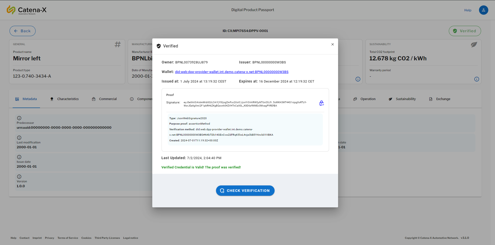
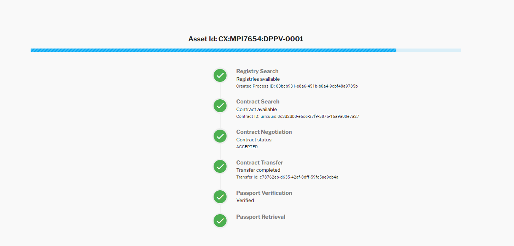
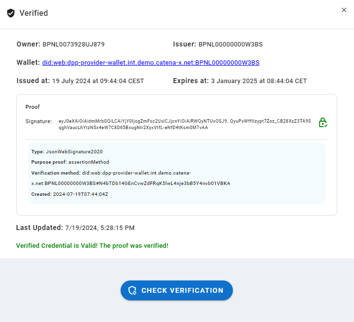

import styles from "../resources/styles.module.css";
import Logo from "../resources/success-stories/verification-logo.png";

    <h2>Digital Product Pass Verification Success Story</h2>
    

The Digital Product Passport Verification add-on is basically a concept for Certifying data in Tractus-X as an auditor (now called Attestation Provider), how to provider certify data enabling the verification as a data provider and how consumers verify this same data when retrieving them from their data providers.

The focus is on proving a process, artifacts and technologies, based on the existing SSI concept, aiming to enable Certification/Verification processes in Tractus-X using wallets.

The documentation from the Digital Product Pass Verification Add-on is available [here](https://github.com/eclipse-tractusx/digital-product-pass/tree/main/dpp-verification). The concept enables the verification of the Data in the Reference Implementation using a [simple wallet](https://github.com/eclipse-tractusx/digital-product-pass/tree/main/dpp-verification/simple-wallet), a functional wallet that can:

- Sign verifiable credentials with JsonWebSignature2020 proofs
- Verify verifiable credentials with JsonWebSignature2020 proofs
- Manage private and public keys, providing via DID Documents public keys in JsonWebKey2020 format

Additionally the simple wallet contains an extension for creating JSON-LD @contexts using Tractus-X SAMM Models Schemas. This allows the verifiable credentials with the semantic models to be valid JSON-LDs documents and enables the context of the existing and future modeled documents.

## Simple Wallet

Using this "basic" wallet for issuing and verifying the "Aspect Model" credentials (DPPs), it was able to demonstrate that the data exchange can be done using Connectors at an Eclipse Tractus-X Network like Catena-X, and be able to be verifiable using the W3C standards.

### Proof of concept

For the proof of concept two simple wallets were used at provider and consumer side. The simple wallet in the provider was used to issue the verifiable credential and then returned the signed credential, so it could be stored at a data service/submodel service. Also this credential was referenced then by the provider in the Digital Twin Registry deployed at their infrastructure.

Using the Catena-X Standards for the [Digital Product Passport (CX-0143)](https://catenax-ev.github.io/docs/standards/CX-0143-UseCaseCircularEconomyDigitalProductPassportStandard/introduction) the data consumer was able to find the digital twin and retrieve the submodel which was indicated to be verifiable, like specified [here](../software-development-view/integration-implementation.md) in this Data Trust & Security KIT.

After the consumer received the verifiable credential it used his simple wallet to verify the signature contained in the credential, and also validating the content (in case it was changed in transit).

Resolving the DID (contained in the verifiable credential) it was able to retrieve the DID Document from the provider simple wallet and verify the signature contained in the credential.

:::warning

No E2E proof of concept was executed between Data Consumer, Data Provider and Data Auditors (now called Attestation Provider) for attribute level certification using verifiable credentials.

However, the technology and the signatures used at the demonstrator are the same, so it also was implicit demonstrated that it would work.

The only thing that changes is the payload.
:::

### Verification Statement

At the consumer side (at the UI) it presented the Signature created by the simple wallet of the provider, which verification methods was used, the issuance date and the expiration date.

It included the "Issuer" (Attestation Provider) and the "Data Owner", which is the (Data Provider), in this way we can visualize who is the owner of the data and who has verified its authenticity.

The signature verification could be refreshed, so in case something is changing it can still be rechecked.

:::info
If the verification is done by attribute, this same information + the "Validation Methods" shall be displayed, showing the consumer on which level of compliance to against which standards it was "Verified".
:::

## NOTICE

This work is licensed under the [CC-BY-4.0](https://creativecommons.org/licenses/by/4.0/legalcode).

- SPDX-License-Identifier: CC-BY-4.0
- SPDX-FileCopyrightText: 2025 Contributors to the Eclipse Foundation
- Source URL: [https://github.com/eclipse-tractusx/eclipse-tractusx.github.io](https://github.com/eclipse-tractusx/eclipse-tractusx.github.io)
