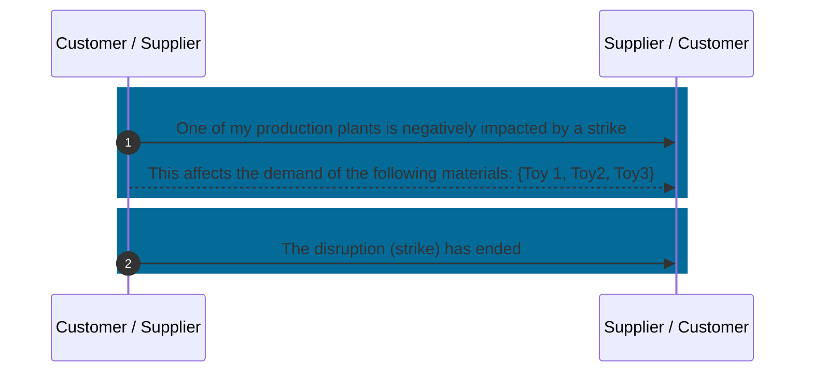

## Business Roles and Functions

Supply chain disruption notifications use their own aspect model and API. Supply chain disruption notifications are provided and consumed by both customer and supplier.

|Function / Role|Customer|Supplier|
|-|-|-|
|Inform business partner about disruption|X|X|
|Detail pre-existing disruption notification|X|X|
|Resolve disruption|X|X|

## Sequence Diagram

Figure: *Utilizing supply chain disruption notification*

For further details, please refer to [CX-0146 Supply Chain Disruption Notifications][StandardLibrary].

## Notice

This work is licensed under the [CC-BY-4.0](https://creativecommons.org/licenses/by/4.0/legalcode)

- SPDX-License-Identifier: CC-BY-4.0
- SPDX-FileCopyrightText: 2023 BASF SE
- SPDX-FileCopyrightText: 2023 Bayerische Motoren Werke Aktiengesellschaft (BMW AG)
- SPDX-FileCopyrightText: 2023 Fraunhofer-Gesellschaft zur Förderung der angewandten Forschung e.V (Fraunhofer)
- SPDX-FileCopyrightText: 2023 Henkel AG & Co.KGaA
- SPDX-FileCopyrightText: 2023 Mercedes Benz Group AG
- SPDX-FileCopyrightText: 2023 SAP SE
- SPDX-FileCopyrightText: 2023 SupplyOn AG
- SPDX-FileCopyrightText: 2023 Volkswagen AG
- SPDX-FileCopyrightText: 2023 ZF Friedrichshafen AG
- SPDX-FileCopyrightText: 2023 Contributors to the Eclipse Foundation

[StandardLibrary]: https://catenax-ev.github.io/docs/next/standards/CX-0146-SupplyChainDisruptionNotifications
