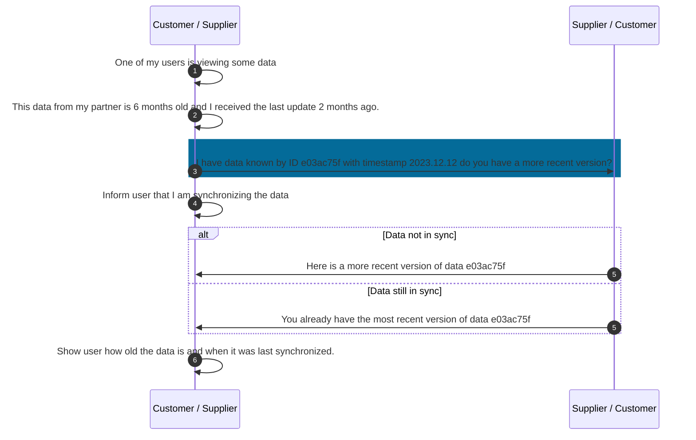

## Business Roles and Functions

Request for update uses its own aspect model and API. Request for update is provided and consumed by both customer and supplier.

|Function / Role|Customer|Supplier|
|-|-|-|
|Identify demand or capacity data that is not recent|X|X|
|Inform business partner about data that needs updating|X|X|
|Provide business partner with fresh data|X|X|
|Show users how fresh the data is |X|X|

## Sequence Diagram

Figure: *Utilizing request for update*

For further details, please refer to [CX-0128 Demand and Capacity Management Data Exchange][StandardLibrary].

## Notice

This work is licensed under the [CC-BY-4.0](https://creativecommons.org/licenses/by/4.0/legalcode)

- SPDX-License-Identifier: CC-BY-4.0
- SPDX-FileCopyrightText: 2023 BASF SE
- SPDX-FileCopyrightText: 2023 Bayerische Motoren Werke Aktiengesellschaft (BMW AG)
- SPDX-FileCopyrightText: 2023 Fraunhofer-Gesellschaft zur Förderung der angewandten Forschung e.V (Fraunhofer)
- SPDX-FileCopyrightText: 2023 Henkel AG & Co.KGaA
- SPDX-FileCopyrightText: 2023 Mercedes Benz Group AG
- SPDX-FileCopyrightText: 2023 SAP SE
- SPDX-FileCopyrightText: 2023 SupplyOn AG
- SPDX-FileCopyrightText: 2023 Volkswagen AG
- SPDX-FileCopyrightText: 2023 ZF Friedrichshafen AG
- SPDX-FileCopyrightText: 2023 Contributors to the Eclipse Foundation

[StandardLibrary]: https://catenax-ev.github.io/docs/next/standards/CX-0128-DemandandCapacityManagementDataExchange
