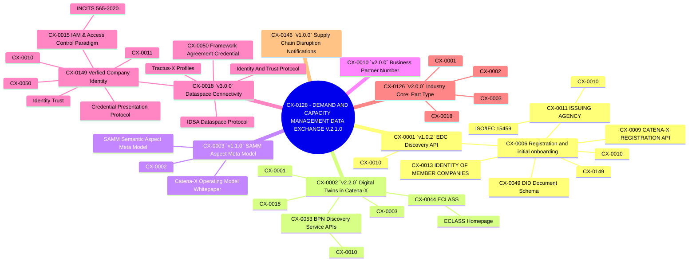

## Standard Dependencies

Designing an implementing an application that conforms to CX-0128 - DEMAND AND CAPACITY MANAGEMENT DATA EXCHANGE V.2.1.0, means not only conforming to CX-0128 but also to all standards that CX-0128 depends upon.

### Dependency Graph

In order to keep things orderly some restrictions to this graph apply:

- The first first mention of a standard is marked by using the standards name in addition to its ID (e.g. CX-0011 ISSUING AGENCY).
- Further mentions are denoted by using only the standards ID (e.g. CX-0011).
- To avoid visual loops, only the first mention of a standard is resolved further for standard dependencies.
- Catena-X standards can be identified by their ID (e.g. CX-0011).
- Non Catena-X standards are never resolved further.

Figure: *Dependencies*

## Notice

This work is licensed under the [CC-BY-4.0](https://creativecommons.org/licenses/by/4.0/legalcode)

- SPDX-License-Identifier: CC-BY-4.0
- SPDX-FileCopyrightText: 2023 BASF SE
- SPDX-FileCopyrightText: 2023 Bayerische Motoren Werke Aktiengesellschaft (BMW AG)
- SPDX-FileCopyrightText: 2023 Fraunhofer-Gesellschaft zur Förderung der angewandten Forschung e.V (Fraunhofer)
- SPDX-FileCopyrightText: 2023 Henkel AG & Co.KGaA
- SPDX-FileCopyrightText: 2023 Mercedes Benz Group AG
- SPDX-FileCopyrightText: 2023 SAP SE
- SPDX-FileCopyrightText: 2023 SupplyOn AG
- SPDX-FileCopyrightText: 2023 Volkswagen AG
- SPDX-FileCopyrightText: 2023 ZF Friedrichshafen AG
- SPDX-FileCopyrightText: 2023 Contributors to the Eclipse Foundation
