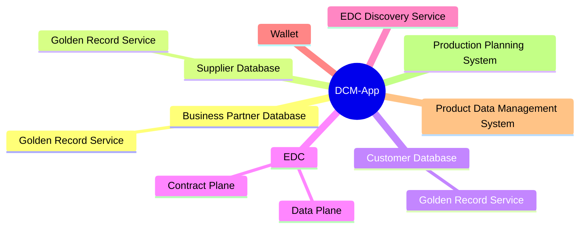

## Overview

## List of Potential Interfaces

|#|Interface|Data|Function| Comment |
|--|--|--|--|--|
|1 |Business Partner Database | | | Combines supplier and customer database |
|2 |Supplier Database | | |
|3 |Customer Database | | |
| 4| EDC data plane | Payloads (WeekBasedMaterialDemand, WeekBasedCapacityGroup, IdBasedREquestForUpdate, IdBasedComment, ...) | Gateway for exchanging data with the dataspace |
|5 | EDC contract plane | Assets, Policies, Contract Definitions | Offer API endpoints as Assets, Negotiate data exchange contracts, |
|6 |EDC Discovery Service | Connector Endpoint | Resolves BPNL into connector endpoints | Could be integrated into the supplier, customer or business partner database |
| 7| Product Data Management System | | Provides the DCM with data relating to materials, their structure and their demands / capacities |
|8| Production planning | | ||
| | Wallet| | |

## Notice

This work is licensed under the [CC-BY-4.0](https://creativecommons.org/licenses/by/4.0/legalcode)

- SPDX-License-Identifier: CC-BY-4.0
- SPDX-FileCopyrightText: 2025 Bayerische Motoren Werke Aktiengesellschaft (BMW AG)

[StandardLibrary]: https://catenax-ev.github.io/docs/next/standards/CX-0128-DemandandCapacityManagementDataExchange