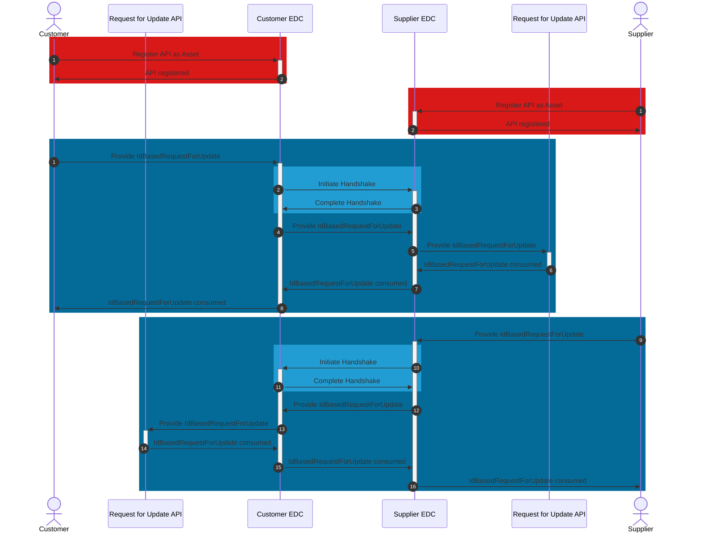

## IdBasedRequestForUpdate API

The RequestForUpdate API is owned and registered as an EDC asset by both customer and supplier. The corresponding business partner (supplier and customer) provides request for update data to the API via POST request.

### Roles and Functions

|Role / Function|API Owner|POST to API|
|-|-|-|
|Customer|X|X|
|Supplier|X|X|

### Data Exchange

Figure: *Exchanging IdBasedRequestForUpdate via API*

### Open API documentation

|API|Link|
|-|-|
|IdBasedRequestForUpdate|[Find here](https://eclipse-tractusx.github.io/api-hub/eclipse-tractusx.github.io/kit-dcm-IdBasedRequestForUpdate-openAPI-3.0.0/swagger-ui/)|

For further details, please refer to [CX-0128 Demand and Capacity Management Data Exchange][StandardLibrary].

## Notice

This work is licensed under the [CC-BY-4.0](https://creativecommons.org/licenses/by/4.0/legalcode)

- SPDX-License-Identifier: CC-BY-4.0
- SPDX-FileCopyrightText: 2023 BASF SE
- SPDX-FileCopyrightText: 2023 Bayerische Motoren Werke Aktiengesellschaft (BMW AG)
- SPDX-FileCopyrightText: 2023 Fraunhofer-Gesellschaft zur Förderung der angewandten Forschung e.V (Fraunhofer)
- SPDX-FileCopyrightText: 2023 Henkel AG & Co.KGaA
- SPDX-FileCopyrightText: 2023 Mercedes Benz Group AG
- SPDX-FileCopyrightText: 2023 SAP SE
- SPDX-FileCopyrightText: 2023 SupplyOn AG
- SPDX-FileCopyrightText: 2023 Volkswagen AG
- SPDX-FileCopyrightText: 2023 ZF Friedrichshafen AG
- SPDX-FileCopyrightText: 2023 Contributors to the Eclipse Foundation

[StandardLibrary]: https://catenax-ev.github.io/docs/next/standards/CX-0128-DemandandCapacityManagementDataExchange
