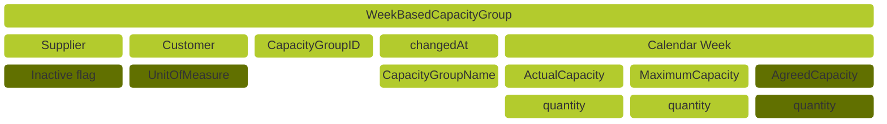

## Aspect Model "WeekBasedCapacityGroup"

Suppliers provide customers capacity data as `WeekBasedCapacityGroup` aspect models. Suppliers also link demand data to `WeekBasedCapacityGroup` aspect models.

### Roles and Rights

|Role / Right|Create|Change|Read|
|-|-|-|-|
|Customer|||X|
|Supplier|X|X|X|

### Structure of a WeekBasedCapacityGroup




Figure: *WeekBasedCapacityGroup structure*

### Example data

```json
{
  "unitOfMeasure" : "unit:piece",
  "linkedDemandSeries" : [ {
    "loadFactor" : 3.5,
    "materialNumberCustomer" : "MNR-7307-AU340474.002",
    "materialNumberSupplier" : "MNR-8101-ID146955.001",
    "customerLocation" : "{{CATENAX-CUSTOMER-BPNS}}",
    "demandCategory" : {
      "demandCategoryCode" : "0001"
    }
  } ],
  "linkedCapacityGroups" : [ "be4d8470-2de6-43d2-b5f8-2e5d3eebf3fd" ],
  "unitOfMeasureIsOmitted" : false,
  "capacityGroupIsInactive" : true,
  "demandVolatilityParameters" : {
    "rollingHorizonAlertThresholds" : [ {
      "sequenceNumber" : 1,
      "absoluteNegativeDeviation" : 100.0,
      "subhorizonLength" : 4,
      "relativeNegativeDeviation" : 0.3,
      "absolutePositiveDeviation" : 100.0,
      "relativePositiveDeviation" : 0.2
    } ],
    "measurementInterval" : 4,
    "startReferenceDateTime" : "2024-01-10T12:00:00.320Z"
  },
  "supplier" : "{{CATENAX-SUPPLIER-BPNL}}",
  "name" : "Spark Plugs on drilling machine for car model XYZ",
  "supplierLocations" : [ "{{CATENAX-SUPPLIER-BPNS}}" ],
  "capacities" : [ {
    "pointInTime" : "2022-08-01",
    "agreedCapacity" : 1800,
    "actualCapacity" : 1000,
    "maximumCapacity" : 2000,
    "deltaProductionResult" : 400
  } ],
  "changedAt" : "2023-03-10T12:27:11.320Z",
  "capacityGroupId" : "0157ba42-d2a8-4e28-8565-7b07830c1110",
  "customer" : "{{CATENAX-CUSTOMER-BPNL}}"
}
```

All file formats and serializations are derived from a RDF turtle file. It is the source for the Semantic Aspect Meta Model. You can access the RDF turtle file at the following URL:

```text
https://github.com/eclipse-tractusx/sldt-semantic-models/blob/main/io.catenax.week_based_capacity_group/3.0.0/WeekBasedCapacityGroup.ttl
```

For further details, please refer to [CX-0128 Demand and Capacity Management Data Exchange][StandardLibrary].

## Notice

This work is licensed under the [CC-BY-4.0](https://creativecommons.org/licenses/by/4.0/legalcode)

- SPDX-License-Identifier: CC-BY-4.0
- SPDX-FileCopyrightText: 2023 BASF SE
- SPDX-FileCopyrightText: 2023 Bayerische Motoren Werke Aktiengesellschaft (BMW AG)
- SPDX-FileCopyrightText: 2023 Fraunhofer-Gesellschaft zur Förderung der angewandten Forschung e.V (Fraunhofer)
- SPDX-FileCopyrightText: 2023 Henkel AG & Co.KGaA
- SPDX-FileCopyrightText: 2023 Mercedes Benz Group AG
- SPDX-FileCopyrightText: 2023 SAP SE
- SPDX-FileCopyrightText: 2023 SupplyOn AG
- SPDX-FileCopyrightText: 2023 Volkswagen AG
- SPDX-FileCopyrightText: 2023 ZF Friedrichshafen AG
- SPDX-FileCopyrightText: 2023 Contributors to the Eclipse Foundation

[StandardLibrary]: https://catenax-ev.github.io/docs/next/standards/CX-0128-DemandandCapacityManagementDataExchange
