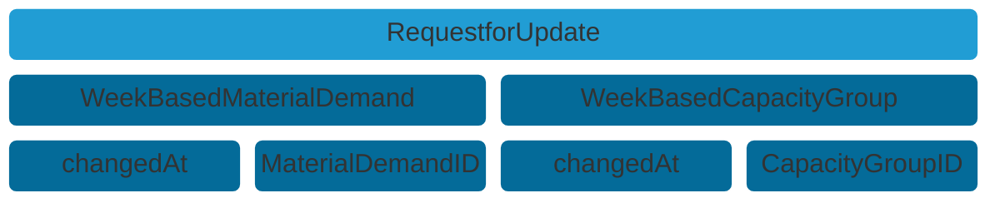

## Aspect Model "IdBasedRequestForUpdate"

Customer and suppliers provide each other `IdBasedRequestForUpdate` aspect models to facilitate and ensure data synchronicity. They only contain transitive information, meaning it is not required to store them, after a `IdBasedRequestForUpdate` has been correctly reacted to.

### Roles and Rights

|Role / Right|Create|Change|Read|
|-|-|-|-|
|Customer|X||X|
|Supplier|X||X|

### Structure of a IdBasedRequestForUpdate




Figure: *IdBasedRequestForUpdate structure*

### Example data

```json
{
  "weekBasedMaterialDemand" : [ {
    "materialDemandId" : "0157ba42-d2a8-4e28-8565-7b07830c3456",
    "changedAt" : "2023-03-10T12:27:11.320Z"
  } ],
  "weekBasedCapacityGroup" : [ {
    "capacityGroupId" : "0157ba42-d2a8-4e28-8565-7b07830c1110",
    "changedAt" : "2023-03-10T12:27:11.320Z"
  } ]
}
```

All file formats and serializations are derived from a RDF turtle file. It is the source for the Semantic Aspect Meta Model. You can access the RDF turtle file at the following URL:

```text
https://github.com/eclipse-tractusx/sldt-semantic-models/blob/main/io.catenax.id_based_request_for_update/3.0.0/IdBasedRequestForUpdate.ttl
```

For further details, please refer to [CX-0128 Demand and Capacity Management Data Exchange][StandardLibrary].

## Notice

This work is licensed under the [CC-BY-4.0](https://creativecommons.org/licenses/by/4.0/legalcode)

- SPDX-License-Identifier: CC-BY-4.0
- SPDX-FileCopyrightText: 2023 BASF SE
- SPDX-FileCopyrightText: 2023 Bayerische Motoren Werke Aktiengesellschaft (BMW AG)
- SPDX-FileCopyrightText: 2023 Fraunhofer-Gesellschaft zur Förderung der angewandten Forschung e.V (Fraunhofer)
- SPDX-FileCopyrightText: 2023 Henkel AG & Co.KGaA
- SPDX-FileCopyrightText: 2023 Mercedes Benz Group AG
- SPDX-FileCopyrightText: 2023 SAP SE
- SPDX-FileCopyrightText: 2023 SupplyOn AG
- SPDX-FileCopyrightText: 2023 Volkswagen AG
- SPDX-FileCopyrightText: 2023 ZF Friedrichshafen AG
- SPDX-FileCopyrightText: 2023 Contributors to the Eclipse Foundation

[StandardLibrary]: https://catenax-ev.github.io/docs/next/standards/CX-0128-DemandandCapacityManagementDataExchange
