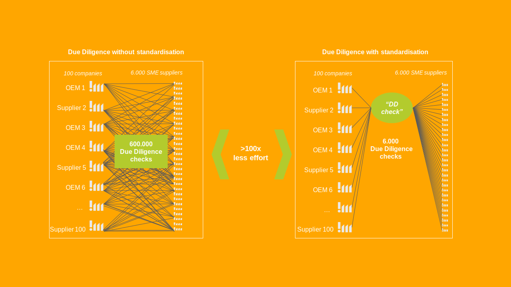
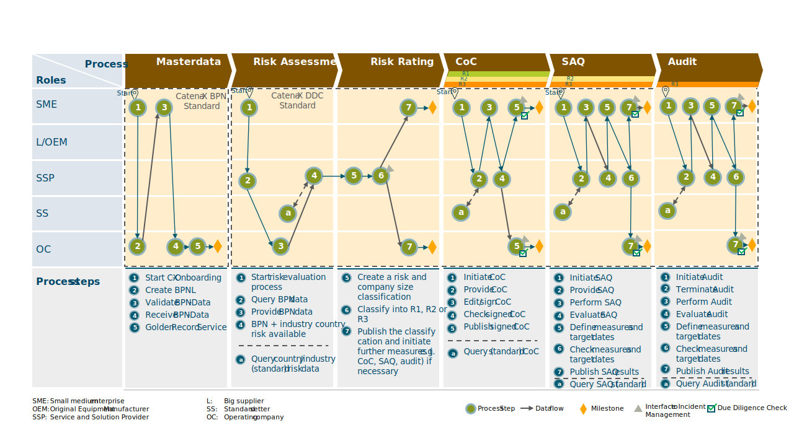

<!--
 *********************************************************************************
 * Copyright (c) 2026 Contributors to the Eclipse Foundation
 *
 * See the NOTICE file(s) distributed with this work for additional
 * information regarding copyright ownership.
 *
 * This program and the accompanying materials are made available under the
 * terms of the Apache License, Version 2.0 which is available at
 * https://www.apache.org/licenses/LICENSE-2.0.
 *
 * Unless required by applicable law or agreed to in writing, software
 * distributed under the License is distributed on an "AS IS" BASIS, WITHOUT
 * WARRANTIES OR CONDITIONS OF ANY KIND, either express or implied. See the
 * License for the specific language governing permissions and limitations
 * under the License.
 *
 * SPDX-License-Identifier: Apache-2.0
 ********************************************************************************/
-->

## Adoption View

import Kit3DLogo from '@site/src/components/2.0/Kit3DLogo';

<Kit3DLogo kitId="due-diligence" />

Welcome to the **Due Diligence Check (SME) KIT Adoption View**. This view provides business value, strategic benefits, and use cases for business stakeholders and decision-makers.

:::info Target Audience
Supply Chain Managers, Risk & Compliance Manager, Procurement Managers, Customer Relationship Managers, Technical Solution Providers, Audit Service Providers, SAQ Service Providers, COC Providers, Industry Experts, and Political Decision Makers.
:::

---

## Vision & Mission

### Vision

To establish a standardized, risk-based and interoperable Due Diligence Check within the Catena-X ecosystem that enables legally compliant, efficient and SME-sensitive implementation of CSDDD requirements across the automotive value chain, while fully preserving data sovereignty and competition compliance.

The vision is a harmonized industry framework in which:

- All participants rely on a shared country and sector-specific risk register.
- Risk-based decision trees determine when and how deeper analysis is required.
- Existing Due Diligence instruments (Code of Conduct, SAQ, audits) are comparable and interoperable.
- SMEs can perform a Due Diligence Check once and share it securely within the network.
- Regulatory expectations and practical feasibility are aligned through transparent governance.

### Mission

The Catena-X Expert Group “Due Diligence Check (SME)” aims to develop a Catena-X standard Due Diligence Check tailored to the needs of SMEs and aligned with CSDDD requirements.

The mission includes:

#### Standardization of Abstract Risk Analysis

Development and open publication of a country and sector risk register to provide a uniform basis for risk identification.

#### Implementation of a Structured Risk-Based Approach

Creation of a risk-based decision tree defining when concrete analysis (e.g., SAQs or audits) is required, ensuring proportionality and prioritization.

#### Integration and Interoperability of Due Diligence Instruments

Harmonized evaluation and integration of Codes of Conduct, self-assessment questionnaires and audits, enabling flexibility and comparability within instrument categories.

#### Development of a Catena-X compliant documentation

Definition of processes, data models and technical integration in line with Catena-X principles such as interoperability, modularity and data sovereignty, ensuring compatibility with the broader Catena-X ecosystem.

#### SME Protection and Proportionality

Ensuring that Due Diligence requirements are appropriate to company size, role and risk exposure, thereby creating a “protective shield” through standardization.

#### Governance and Regulatory Alignment

Establishment of a consultative Advisory Board to provide independent expertise on regulatory interpretation and implementation, without operational decision-making authority.

The initiative follows key principles:

- Technology openness and neutrality
- Interoperability and open interfaces
- Data sovereignty and security
- Transparency and public documentation
- Scalability and modularity
- Voluntariness and strict competition law compliance

Through this approach, Catena-X aims to transform Due Diligence from a fragmented, duplicative compliance exercise into a structured, collaborative and scalable industry framework that enhances regulatory effectiveness while strengthening responsible value chain management.

The initial Tier 1 focus provides a pragmatic entry point for implementation while establishing the foundational framework for future scaling. The standardized architecture is designed to enable extension towards deeper supply chain tiers and alignment with other X-initiatives as well as potential cross-industry interoperability in the field of Due Diligence.

## Use Case Context

### Industry Challenge

The automotive industry is one of the most complex and globally interconnected value chains. It spans multiple tiers, industries and regions, involving thousands of suppliers and sub-suppliers. In particular, small and medium-sized enterprises (SMEs) play a crucial role within this supplier landscape, as they form a significant share of the automotive value chain and are often deeply embedded across multiple tiers. In the European Union alone, SMEs account for a significant share of the automotive supply chain.

With the adoption of the Corporate Sustainability Due Diligence Directive (CSDDD), a new regulatory paradigm is emerging. Companies are required to identify, assess, prevent, mitigate and remediate adverse human rights and environmental impacts across their value chains. This significantly increases the need for structured, risk-based and documented Due Diligence processes.

The automotive industry is particularly affected due to:

- highly fragmented multi-tier supply chains
- global sourcing across varying country and sector risk levels
- increasing regulatory scrutiny at product and company level
- growing expectations from stakeholders (e.g. investors, customers, public authorities)

While large companies bear the primary legal responsibility under CSDDD, effective implementation requires close cooperation across the value chain. Due Diligence expectations therefore extend to suppliers at different tiers, who are requested to contribute relevant information and risk assessments within their sphere of influence. SMEs, although often not directly within the regulatory scope, are increasingly asked to respond to diverse and sometimes inconsistent requirements from multiple business partners.

This creates a structural imbalance: high regulatory expectations meet limited resources and capacities on the SME side.

A harmonized, interoperable and risk-based industry approach is therefore essential to ensure both regulatory compliance and economic viability across the automotive ecosystem.

In line with the proportionality principles reflected in the CSDDD and the evolving SME Shield provisions, Due Diligence measures must be risk-based and rely primarily on information reasonably available to companies. The CX Due Diligence Check is therefore designed to operationalize these principles by minimizing unnecessary data requests and avoiding disproportionate burdens on SMEs.

### The Solution

Today, Due Diligence implementation in the automotive supply chain is characterized by fragmentation and duplication.

Without standardization:

- Each company conducts its own abstract risk analysis.
- Sustainability questionnaires and audits are applied via different tool providers and often without a harmonized risk-based methodology.
- Different codes of conduct, self-assessment questionnaires (SAQs) and audit standards coexist without interoperability.
- SMEs must respond to multiple overlapping requests from different customers.
- The proportionality of Due Diligence requirements in relation to company size and risk exposure is often not sufficiently considered.

This leads to significant inefficiencies. In a network of large companies and SME suppliers, non-standardized approaches can result in hundreds of thousands of duplicated Due Diligence checks. Standardization can reduce this effort by more than a factor of 100 by enabling a single, shareable Due Diligence Check.

Beyond inefficiency, further structural challenges exist:

- Lack of a uniform country and sector risk basis
- Diverging interpretations of CSDDD requirements
- Limited comparability of Due Diligence instruments
- Missing integration of existing Due Diligence standards (Code of Conduct, SAQs, audits) towards a holistic Due Diligence Check
- Insufficient mechanisms for continuous reevaluation and incident management
- Legal and competition law sensitivities requiring strict governance

In addition, SMEs face organizational and financial constraints. They often serve customers from multiple industry sectors, each imposing different Due Diligence expectations. Without a harmonized framework, this complexity risks overburdening SMEs and undermining the effectiveness of regulatory objectives.

The industry therefore requires:

- A standardized abstract risk analysis
- A structured risk-based decision logic
- Interoperable integration of existing Due Diligence instruments
- SME-tailored proportionality mechanisms
- Interoperable integration of existing Due Diligence instruments
- SME-tailored proportionality mechanisms
- A governance structure ensuring regulatory alignment and competition compliance

---

## Business Value

From a business perspective, the CX Due Diligence Check (SME) KIT enables application and service providers to build interoperable solutions for legally required Due Diligence with the EU CSDDD in the automotive supply chain. SMEs represent a significant share of the supplier landscape and face limited resources while being confronted with heterogeneous customer requirements. The CX DDC initiative therefore aims at standardization and interoperability of Due Diligence elements and at enabling SMEs to perform a Due Diligence Check once and share it within the Catena-X network.

### One standardized Due Diligence Check (“do once, share many”)

A harmonized CX Due Diligence Check reduces duplicated assessments across customers and tool landscapes. In a typical network constellation, standardization can reduce the number of Due Diligence Checks significantly by enabling a single, shareable check. For service providers, this means fewer customer-specific variants and a scalable, repeatable product offering.

### Standardized risk intelligence via shared country & sector risk registers

The KIT establishes a uniform foundation for abstract risk analysis by providing a standardized country and sector risk register, including open publication and availability in the Catena-X context. Service providers can integrate this shared risk baseline into screening, onboarding, and monitoring solutions. Supply chain participants (e.g. OEMs and suppliers) can apply it directly within their Due Diligence processes, reducing the need for each company to conduct its own abstract risk analysis.

### Risk-based decision logic to trigger SAQs/audits only where needed

The KIT defines a standardized, risk-based approach that determines when sustainability questionnaires (SAQs) or audits should be applied, improving prioritization and proactivity. A decision tree and prioritization logic are explicit components of the concept. This enables service providers to implement modular, risk-triggered workflows (rather than blanket questionnaires), and it supports SME-sensitive proportionality by considering company size and risk exposure.

### Interoperability of existing Due Diligence instruments (CoC, SAQs, audits)

Instead of replacing existing instruments, the KIT creates an interoperability layer: multiple standardized questionnaires and audit standards can coexist with consistent coverage and comparability, enabling interoperability of SAQs and audits. The concrete risk analysis approach ensures consistent, risk-based evaluation through SAQs and audits, including comparability within instrument categories and implementation in the Catena-X landscape. Based on this evaluation, appropriate preventive and corrective measures can be defined and derived, including the application or adaptation of Codes of Conduct. This lowers integration effort for solution providers and helps avoid vendor lock-in.

### Trusted, Catena-X-compliant foundation for scalable marketplace solutions

The KIT is explicitly built on Catena-X principles that de-risk adoption and enable scalable offerings: technology openness and neutrality, interoperability, data sovereignty, openness and transparency (including rulebook publication), scalability and modularity (including adaptability beyond automotive), validity checkpoints, and voluntariness and competition compliance. In addition, the initiative foresees an advisory board that supports regulatory interpretation in an advisory (non-decision-making) role, strengthening credibility and implementation quality.

## User Journey

The automotive industry faces the challenge of scrutinizing complex, global supply chains for human rights and environmental risks in accordance with the Corporate Sustainability Due Diligence Directive (CSDDD). This necessitates structured, risk-based, and documented Due Diligence processes. The Catena-X Due Diligence Check offers a standardized, interoperable, and efficient solution that specifically reduces the burden for small and medium-sized enterprises (SMEs) and preserves data sovereignty. The process is divided into five main phases: Master Data Management, Risk Assessment and Classification, Code of Conduct (CoC) Signing, Self-Assessment Questionnaire (SAQ), and, if necessary, an Audit.

### 1. Master Data Management: The Foundation for Data Exchange

The first step in the Due Diligence Check is to establish a reliable data foundation within the Catena-X ecosystem. This begins with CX-Onboarding (1), initiated by the SME. Here, the company registers itself in the Catena-X network and establishes the technical prerequisites for secure data exchange. Subsequently, the Operating Company creates a Business Partner Number (BPNL) (2) for the SME. On the one hand, the SME is responsible for reviewing the BPN data (3) to ensure the accuracy and completeness of its master data. On the other hand, this validation process is supported by the Golden Record Service (5). It is planned to extend the BPN attributes (4) beyond the current address and country information of the respective contracting organization and related plant location. Future enhancements will include additional attributes such as company size (e.g., number of employees of the contracting organization to support SME identification) as well as information about the products manufactured or services offered. This will enable more precise sector classification (e.g., electronics, metal production, consulting services, logistics, etc.). After successful verification, the BPN data serves as a validated foundation for all subsequent process steps. This standardized master data management approach prevents fragmentation and duplication of company information, which currently represents significant sources of inefficiency.

### 2. Risk Assessment and Classification: A Risk-Based Approach

Following successful master data verification, the abstract risk analysis phase begins. In line with the principles of the CSDDD, this phase follows a structured risk-based approach. The risk process is initiated by the SME (1). The Service and Solution Provider (SSP) (2) first checks whether the BPN data is available to ensure clear assignment (3). Subsequently, the country and sector risk data are queried. The Standard Setter provides the country- and sector-specific risk data (a). These data are based on a shared, harmonized risk register that ensures the comparability and objectivity of the risk assessment. Once the BPN and country and sector risk data are available (4), the SSP creates a combined risk and company size classification (5). This classification considers both the inherent risk of the business sector and location, as well as the size of the SME, to ensure a proportional assessment. Based on this analysis, the company is assigned to one of three risk levels (6): R1 (low risk), R2 (medium risk), or R3 (high risk). The resulting classification is then published by the Operating Company and made visible to the SME (7). Depending on the assigned risk level and company size, further measures may be triggered (e.g., CoC, SAQ, Audit), which underscores Catena-X's structured risk-based decision logic. The process is not limited to proactive risk management during onboarding. It is also closely linked to the Expert Group “Due Diligence Governance” and its incident management use case. A verified incident can lead to a reassessment of the risk level, for example an escalation from R2 to R3, which may trigger an on-site audit and the implementation of corrective action plans.

### 3. Code of Conduct Signing: Adherence to Ethical Standards

A crucial component of Due Diligence is the commitment to common environmental and social standards. The SME initiates the Code of Conduct (CoC) signing process (1). Service and Solution Provider (2) provides the standardized CoC issued by the established Standard Setter (a), which defines the industry-harmonized environmental and social principles. The SME reviews and digitally signs the CoC (3) to formally document its commitment to these principles. The SSP reviews the signed CoC (4). The signing takes place securely within the Catena-X framework. After completion, the signed CoC is published by the Operating Company (5) and made visible to authorized partners in the network, ensuring transparency and traceability of the commitment. This standardized approach replaces the multitude of different Codes of Conduct that SMEs are currently required to review and sign. As with risk assessment and classification, this process is also linked to incident management. If an incident is reported and verified, it may trigger a reevaluation of the current Due Diligence status and, where necessary, additional corrective measures.

### 4. SAQ Completion: Self-Assessment as a Concrete Risk Filter

For companies classified as medium risk (e.g., R2), completion of a Self-Assessment Questionnaire (SAQ) is required. The SME initiates the SAQ process (1). The SSP, a dedicated role within the Catena-X ecosystem offering specialized services, provides (2) and operates the standardized SAQ defined and released by the Standard Setter (a). The SAQ is based on harmonized questionnaire standards tailored to the diverse structures and risk profiles of the automotive industry and aligned with the CSDDD framework. To ensure both flexibility and comparability within the network, different recognized SAQ standards may be applied. However, only those standards that meet defined minimum requirements set by this Expert Group are eligible for integration. These requirements include, in particular, adequate coverage of CSDDD-protected rights and environmental obligations, defined quality and governance criteria, and interoperability within the Catena-X architecture. Compliance with these requirements is assessed through a structured evaluation grid. The SME completes (3) and digitally signs the SAQ to provide a structured self-assessment of its sustainability performance and risk management practices. The SSP evaluates the filled out SAQ (4). Based on its responses and evaluation, the SME defines appropriate preventive measures (5) to address identified weaknesses or potential risks. The SSP evaluates the defined measures and target dates (6). The evaluated SAQ, including the defined preventive measures and corresponding target dates, is published by the Operating Company (7) and made visible to authorized partners within the network. This standardized SAQ approach reduces the administrative burden for SMEs, as it can be completed once and shared with multiple business partners. As with risk assessment and classification, this process is also linked to incident management. If an incident is reported and verified, it may trigger a reevaluation of the current Due Diligence status and, where necessary, additional corrective measures.

### 5. Audit Execution: In-Depth Review for High Risk

For companies classified as high risk (e.g., R3), an audit may be required. The SME initiates (1) the audit process. The SSP is responsible for planning (2) and conducting the audit together with the SME (3), thereby ensuring an independent and professional on-site review of the SME’s processes, controls, and practices (4). As with the SAQ, the audit framework is based on standards recognized by the Standard Setter (a). To enable flexibility while maintaining comparability, multiple established audit standards may be integrated, provided they meet the defined minimum requirements and are admitted through the evaluation grid. Following the audit, the SME defines appropriate measures (5) and develops a corrective action plan incl. target dates to address identified deficiencies, which is then reviewed by the SSP (6). The audit result, including key findings and the corrective action plan, is published by the Operating Company (7) and made visible to authorized partners within the Catena-X network, ensuring transparency and traceability. As with risk assessment and classification, this process is also linked to incident management. A reported and verified incident may trigger a reassessment of the company’s Due Diligence status and, where necessary, additional corrective measures.

### Conclusion

The Catena-X Due Diligence Check transforms the fragmented and inefficient Due Diligence practices in the automotive industry into a standardized, risk-based, and data-sovereign process. By utilizing common standards, data models, and a trustworthy infrastructure, it significantly relieves SMEs, increases efficiency for all participants, and ensures compliance with regulatory requirements. This lays the foundation for a more robust and sustainable supply chain in the automotive sector.

It should also be noted that risk assessments, CoCs, SAQs and audits are subject to a validity period and must be requalified after this period expires.

### Process description in BPMN

(WIP - Will be published at a later date. Planned: CX Release 2026.06)

## KIT Content Vision

The development of the KIT will take place throughout this year, with a strong focus on further expanding and refining its substantive content. In 2027, a first pilot implementation is planned to test and validate the approach in practice. We warmly welcome feedback and suggestions, as your input will help us prioritize topics, improve the content, and ensure practical relevance for all stakeholders. Please submit your feedback via this designated form [DDC KIT Feedback Form](https://forms.office.com/Pages/ResponsePage.aspx?id=bSzSGggvBU-guuF_bOiDgJKhZVObB0BBlH3UfbND6YFUNU8xUUc1T09PUDdKVkJVMzYwMzdKR1pNMS4u).

### Regulatory Framework and Due Diligence Principles

- Regulatory and Business Drivers
- Due Diligence as an Ongoing, Risk-Based Responsibility
- Chain of Activities and Core Elements of Due Diligence under CSDDD
- Relationship to Existing Frameworks and Standards

### Scope, application and system boundaries covered by this KIT

- Regulations considered
- Scope of application
- Topics out of scope

### Evidence and data requirements – business view

### How existing Catena-X KITS support Due Diligence

### Use Case Adoption

- SMART Objectives & KPIs
- Business Impact Analysis (Business Capabilities)

### DDC Solution

- Functional Architecture
- Data Flows
- API
- UI
- Non-Functional-Requirements

### Limitations & Call for Action

- Annex
- Glossary
- References
- Non-Functional-Requirements
- Link to related Catena-X KITS and Rulebooks

## NOTICE

This work is licensed under the [CC-BY-4.0](https://creativecommons.org/licenses/by/4.0/legalcode).

- SPDX-License-Identifier: CC-BY-4.0
- SPDX-FileCopyrightText: 2026 Contributors to the Eclipse Foundation
- Source URL: [https://github.com/eclipse-tractusx/eclipse-tractusx.github.io](https://github.com/eclipse-tractusx/eclipse-tractusx.github.io)
