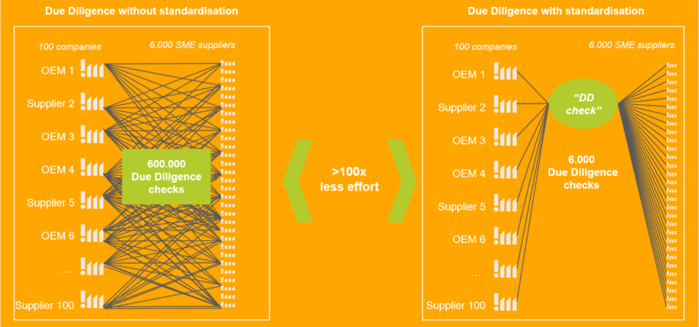

<!--
 ********************************************************************************* 
 * Copyright (c) 2025 Contributors to the Eclipse Foundation
 * 
 * See the NOTICE file(s) distributed with this work for additional
 * information regarding copyright ownership.
 * 
 * This program and the accompanying materials are made available under the
 * terms of the Apache License, Version 2.0 which is available at
 * https://www.apache.org/licenses/LICENSE-2.0.
 * 
 * Unless required by applicable law or agreed to in writing, software
 * distributed under the License is distributed on an "AS IS" BASIS, WITHOUT
 * WARRANTIES OR CONDITIONS OF ANY KIND, either express or implied. See the
 * License for the specific language governing permissions and limitations
 * under the License.
 * 
 * SPDX-License-Identifier: Apache-2.0
 ********************************************************************************/
-->

## Adoption View

Welcome to the **Due Diligence Check (SME) KIT Adoption View**. This view provides business value, strategic benefits, and use cases for business stakeholders and decision-makers.

:::info Target Audience
Supply Chain Managers, Risk & Compliance Manager, Procurement Managers, Customer Relationship Managers, Technical Solution Providers, Audit Service Providers, SAQ Service Providers, COC Providers, Industry Experts, and Political Decision Makers.
:::

---

## Use Case Context

### Industry Challenge

The automotive industry is one of the most complex and globally interconnected value chains. It spans multiple tiers, industries and regions, involving thousands of suppliers and sub-suppliers. In particular, small and medium-sized enterprises (SMEs) play a crucial role within this supplier landscape, as they form a significant share of the automotive value chain and are often deeply embedded across multiple tiers. In the European Union alone, SMEs account for a significant share of the automotive supply chain. 

With the adoption of the Corporate Sustainability Due Diligence Directive (CSDDD), a new regulatory paradigm is emerging. Companies are required to identify, assess, prevent, mitigate and remediate adverse human rights and environmental impacts across their value chains. This significantly increases the need for structured, risk-based and documented Due Diligence processes. 

The automotive industry is particularly affected due to: 

- highly fragmented multi-tier supply chains 

- global sourcing across varying country and sector risk levels 

- increasing regulatory scrutiny at product and company level 

- growing expectations from stakeholders (e.g. investors, customers, public authorities) 

While large companies bear the primary legal responsibility under CSDDD, effective implementation requires close cooperation across the value chain. Due Diligence expectations therefore extend to suppliers at different tiers, who are requested to contribute relevant information and risk assessments within their sphere of influence. SMEs, although often not directly within the regulatory scope, are increasingly asked to respond to diverse and sometimes inconsistent requirements from multiple business partners. 

This creates a structural imbalance: high regulatory expectations meet limited resources and capacities on the SME side. 

A harmonized, interoperable and risk-based industry approach is therefore essential to ensure both regulatory compliance and economic viability across the automotive ecosystem. 

In line with the proportionality principles reflected in the CSDDD and the evolving SME Shield provisions, Due Diligence measures must be risk-based and rely primarily on information reasonably available to companies. The CX Due Diligence Check is therefore designed to operationalize these principles by minimizing unnecessary data requests and avoiding disproportionate burdens on SMEs. 

### The Solution

Today, Due Diligence implementation in the automotive supply chain is characterized by fragmentation and duplication. 

Without standardization: 

- Each company conducts its own abstract risk analysis. 

- Sustainability questionnaires and audits are applied via different tool providers and often without a harmonized risk-based methodology. 

- Different codes of conduct, self-assessment questionnaires (SAQs) and audit standards coexist without interoperability. 

- SMEs must respond to multiple overlapping requests from different customers. 

- The proportionality of Due Diligence requirements in relation to company size and risk exposure is often not sufficiently considered. 

This leads to significant inefficiencies. In a network of large companies and SME suppliers, non-standardized approaches can result in hundreds of thousands of duplicated Due Diligence checks. Standardization can reduce this effort by more than a factor of 100 by enabling a single, shareable Due Diligence Check. 

Beyond inefficiency, further structural challenges exist: 

- Lack of a uniform country and sector risk basis 

- Diverging interpretations of CSDDD requirements 

- Limited comparability of Due Diligence instruments 

- Missing integration of existing Due Diligence standards (Code of Conduct, SAQs, audits) towards a holistic Due Diligence Check 

- Insufficient mechanisms for continuous reevaluation and incident management 

- Legal and competition law sensitivities requiring strict governance 

In addition, SMEs face organizational and financial constraints. They often serve customers from multiple industry sectors, each imposing different Due Diligence expectations. Without a harmonized framework, this complexity risks overburdening SMEs and undermining the effectiveness of regulatory objectives. 

The industry therefore requires: 

- A standardized abstract risk analysis 

- A structured risk-based decision logic 

- Interoperable integration of existing Due Diligence instruments 

- SME-tailored proportionality mechanisms 

- A governance structure ensuring regulatory alignment and competition compliance 

 

---

## Vision & Mission

### Vision

To establish a standardized, risk-based and interoperable Due Diligence Check within the Catena-X ecosystem that enables legally compliant, efficient and SME-sensitive implementation of CSDDD requirements across the automotive value chain, while fully preserving data sovereignty and competition compliance. 

The vision is a harmonized industry framework in which: 

- All participants rely on a shared country and sector-specific risk register. 

- Risk-based decision trees determine when and how deeper analysis is required. 

- Existing Due Diligence instruments (Code of Conduct, SAQ, audits) are comparable and interoperable. 

- SMEs can perform a Due Diligence Check once and share it securely within the network. 

- Regulatory expectations and practical feasibility are aligned through transparent governance. 

 
### Mission

The Catena-X Expert Group “Due Diligence Check (SME)” aims to develop a Catena-X standard Due Diligence Check tailored to the needs of SMEs and aligned with CSDDD requirements. 

The mission includes: 

#### Standardization of Abstract Risk Analysis 
Development and open publication of a country and sector risk register to provide a uniform basis for risk identification. 

#### Implementation of a Structured Risk-Based Approach 
Creation of a risk-based decision tree defining when concrete analysis (e.g., SAQs or audits) is required, ensuring proportionality and prioritization. 

#### Integration and Interoperability of Due Diligence Instruments 
Harmonized evaluation and integration of Codes of Conduct, self-assessment questionnaires and audits, enabling flexibility and comparability within instrument categories. 

#### Development of a Catena-X compliant documentation  
Definition of processes, data models and technical integration in line with Catena-X principles such as interoperability, modularity and data sovereignty, ensuring compatibility with the broader Catena-X ecosystem. 

#### SME Protection and Proportionality 
Ensuring that Due Diligence requirements are appropriate to company size, role and risk exposure, thereby creating a “protective shield” through standardization. 

#### Governance and Regulatory Alignment 
Establishment of a consultative Advisory Board to provide independent expertise on regulatory interpretation and implementation, without operational decision-making authority. 

The initiative follows key principles: 

- Technology openness and neutrality 

- Interoperability and open interfaces 

- Data sovereignty and security 

- Transparency and public documentation 

- Scalability and modularity 

- Voluntariness and strict competition law compliance 

Through this approach, Catena-X aims to transform Due Diligence from a fragmented, duplicative compliance exercise into a structured, collaborative and scalable industry framework that enhances regulatory effectiveness while strengthening responsible value chain management. 

The initial Tier 1 focus provides a pragmatic entry point for implementation while establishing the foundational framework for future scaling. The standardized architecture is designed to enable extension towards deeper supply chain tiers and alignment with other X-initiatives as well as potential cross-industry interoperability in the field of Due Diligence. 

---

## Business Value

From a business perspective, the CX Due Diligence Check (SME) KIT enables application and service providers to build interoperable solutions for legally required Due Diligence with the EU CSDDD in the automotive supply chain. SMEs represent a significant share of the supplier landscape and face limited resources while being confronted with heterogeneous customer requirements. The CX DDC initiative therefore aims at standardization and interoperability of Due Diligence elements and at enabling SMEs to perform a Due Diligence Check once and share it within the Catena-X network. 

### One standardized Due Diligence Check (“do once, share many”) 

A harmonized CX Due Diligence Check reduces duplicated assessments across customers and tool landscapes. In a typical network constellation, standardization can reduce the number of Due Diligence Checks significantly by enabling a single, shareable check. For service providers, this means fewer customer-specific variants and a scalable, repeatable product offering. 

### Standardized risk intelligence via shared country & sector risk registers 

The KIT establishes a uniform foundation for abstract risk analysis by providing a standardized country and sector risk register, including open publication and availability in the Catena-X context. Service providers can integrate this shared risk baseline into screening, onboarding, and monitoring solutions. Supply chain participants (e.g. OEMs and suppliers) can apply it directly within their Due Diligence processes, reducing the need for each company to conduct its own abstract risk analysis. 

### Risk-based decision logic to trigger SAQs/audits only where needed  

The KIT defines a standardized, risk-based approach that determines when sustainability questionnaires (SAQs) or audits should be applied, improving prioritization and proactivity. A decision tree and prioritization logic are explicit components of the concept. This enables service providers to implement modular, risk-triggered workflows (rather than blanket questionnaires), and it supports SME-sensitive proportionality by considering company size and risk exposure. 

### Interoperability of existing Due Diligence instruments (CoC, SAQs, audits) 

Instead of replacing existing instruments, the KIT creates an interoperability layer: multiple standardized questionnaires and audit standards can coexist with consistent coverage and comparability, enabling interoperability of SAQs and audits. The concrete risk analysis approach ensures consistent, risk-based evaluation through SAQs and audits, including comparability within instrument categories and implementation in the Catena-X landscape. Based on this evaluation, appropriate preventive and corrective measures can be defined and derived, including the application or adaptation of Codes of Conduct. This lowers integration effort for solution providers and helps avoid vendor lock-in. 

### Trusted, Catena-X-compliant foundation for scalable marketplace solutions 

The KIT is explicitly built on Catena-X principles that de-risk adoption and enable scalable offerings: technology openness and neutrality, interoperability, data sovereignty, openness and transparency (including rulebook publication), scalability and modularity (including adaptability beyond automotive), validity checkpoints, and voluntariness and competition compliance. In addition, the initiative foresees an advisory board that supports regulatory interpretation in an advisory (non-decision-making) role, strengthening credibility and implementation quality. 

## KIT Content Vision

The development of the KIT will take place throughout this year, with a strong focus on further expanding and refining its substantive content. In 2027, a first pilot implementation is planned to test and validate the approach in practice. We warmly welcome feedback and suggestions, as your input will help us prioritize topics, improve the content, and ensure practical relevance for all stakeholders. Please submit your feedback via the designated feedback form [LINK]. 
 
### Regulatory Framework and Due Diligence Principles 

#### Regulatory and Business Drivers 

#### Due Diligence as an Ongoing, Risk-Based Responsibility  

#### Chain of Activities and Core Elements of Due Diligence under CSDDD 

#### Relationship to Existing Frameworks and Standards 

### Scope, application and system boundaries covered by this KIT 

#### Regulations considered 

#### Scope of application 

#### Topics out of scope 

### User Journey 

#### Master Data Collection 

#### Abstract Risk Analysis based on sector/country  

#### Risk Based Approach  

#### Concrete Risk Analysis at the Business Partner Level and Definition of Appropriate Measures 

#### Process description in BPMN 

### Evidence and data requirements – business view 

### How existing Catena-X KITS support Due Diligence 

### Use Case Adoption 

#### SMART Objectives & KPIs 

#### Business Impact Analysis (Business Capabilities) 

### DDC Solution 

#### Functional Architecture 

#### Data Flows 

#### API 

#### UI 

#### Non-Functional-Requirements 

### Limitations & Call for Action 

#### Annex 

#### Glossary 

#### References  

#### Link to related Catena-X KITS and Rulebooks 

### CHANGE LOG
CX Release 26.03:  Initial MVP KIT 

## NOTICE

This work is licensed under the [CC-BY-4.0](https://creativecommons.org/licenses/by/4.0/legalcode).

- SPDX-License-Identifier: CC-BY-4.0
- SPDX-FileCopyrightText: [2026] Contributors to the Eclipse Foundation
- Source URL: [https://github.com/eclipse-tractusx/eclipse-tractusx.github.io](https://github.com/eclipse-tractusx/eclipse-tractusx.github.io)
