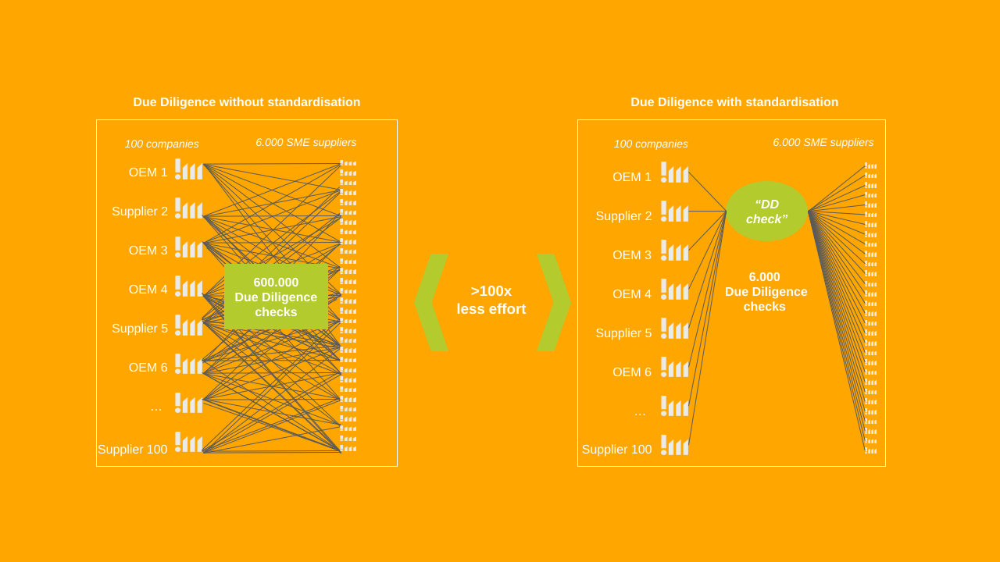
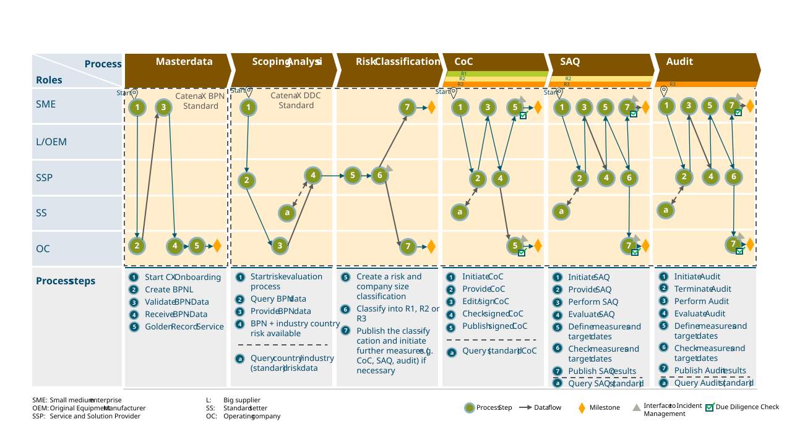

<!--
 *********************************************************************************
 * Copyright (c) 2026 Contributors to the Eclipse Foundation
 *
 * See the NOTICE file(s) distributed with this work for additional
 * information regarding copyright ownership.
 *
 * This program and the accompanying materials are made available under the
 * terms of the Apache License, Version 2.0 which is available at
 * https://www.apache.org/licenses/LICENSE-2.0.
 *
 * Unless required by applicable law or agreed to in writing, software
 * distributed under the License is distributed on an "AS IS" BASIS, WITHOUT
 * WARRANTIES OR CONDITIONS OF ANY KIND, either express or implied. See the
 * License for the specific language governing permissions and limitations
 * under the License.
 *
 * SPDX-License-Identifier: Apache-2.0
 ********************************************************************************/
-->

## Adoption View

import Kit3DLogo from '@site/src/components/2.0/Kit3DLogo';

<Kit3DLogo kitId="due-diligence" />

Welcome to the **Due Diligence Check (SME) KIT Adoption View**. This view provides business value, strategic benefits, and use cases for business stakeholders and decision-makers.

:::info Target Audience
Examples of relevant target groups include Supply Chain Managers, Risk & Compliance Managers, Procurement Managers, Customer Relationship Managers, Technical Solution Providers, Audit Service Providers, Self-Assessment Questionnaire (SAQ) Service Providers, Code of Conduct (COC) Providers, Industry Experts, Political Decision Makers, as well as other stakeholders involved in, supporting, or advising on corporate Due Diligence.
:::

---

## Vision & Mission

### Vision

To establish a standardized, risk-based and interoperable Due Diligence Check for companies participating in the Catena-X network that supports CSDDD-aligned, efficient and SME-sensitive Due Diligence across the automotive value chain, while enabling Due Diligence Check data and results to be generated once, securely shared and reused across multiple business relationships and compatible Catena-X solutions (“do once, share many”). In this context, interoperability means that standardized Due Diligence Check data and results can be exchanged, interpreted and reused across different participating companies and compatible solution providers without requiring the same information to be generated or assessed repeatedly. 

The vision is a harmonized industry framework in which:

- All participants rely on a shared country and sector-specific risk register. 
- A risk-based decision tree determines when and how deeper analysis is required.
- Existing Due Diligence instruments, such as Codes of Conduct (CoCs), Self-Assessment Questionnaires (SAQs) and Audits, are comparable and interoperable. 
- SMEs can perform a Due Diligence Check and securely share its results within the network, while allowing for reassessment when new or changed risk information requires it. 
- Regulatory expectations and practical feasibility are aligned through transparent governance. 

### Mission

The Catena-X Expert Group „Due Diligence Check (SME)“ develops a standardized Due Diligence framework within Catena-X that is tailored to the needs of SMEs and designed to support CSDDD-aligned Due Diligence. Although SMEs generally fall outside the direct scope of the CSDDD, they remain relevant to the due diligence processes of companies within its scope as participants in their value chains. 

The mission includes:

#### Standardization of Scoping Analysis  

Development and publication of a publicly accessible country and sector risk register to provide a uniform basis for the Scoping Analysis and the identification of general areas where adverse impacts are most likely to occur and to be most severe. 

#### Implementation of a Structured Risk-Based Approach 

Creation of a risk-based decision tree defining when further in-depth assessment may be triggered and which instruments (e.g., SAQs or Audits) may be appropriate, ensuring proportionality and prioritization. 

#### Integration and Interoperability of Due Diligence Instruments 

Harmonized evaluation and integration of relevant Due Diligence instruments, such as Codes of Conduct, Self-Assessment Questionnaires and Audits, enabling flexibility and comparability within respective instrument categories. 

#### Development of a Catena-X aligned documentation 

Definition of processes, data models and technical integration in line with Catena-X principles such as interoperability, modularity and data sovereignty, enabling different components to work together flexibly while allowing participants to retain control over their data and ensuring compatibility with the broader Catena-X ecosystem.  

#### SME Protection and Appropriate Requirements  

Ensuring that Due Diligence requirements are appropriate to company size, role and the level of potential adverse human rights and environmental impacts identified through the scoping analysis, thereby creating a “protective shield” through standardization. 

#### Governance and Regulatory Alignment 

Establishment of a consultative Advisory Board to provide independent expertise on regulatory interpretation and implementation, without operational decision-making authority. 

The initiative follows key principles: 

- Technology openness and neutrality 
- Interoperability and open interfaces 
- Data sovereignty and security 
- Transparency and public documentation 
- Scalability and modularity 
- Voluntariness and strict competition law compliance 

Through this approach, Catena-X aims to transform Due Diligence from a fragmented, duplicative compliance exercise into a structured, collaborative and scalable industry framework that enhances regulatory effectiveness while strengthening responsible value chain management. 

The initial Tier 1 focus provides a pragmatic entry point for implementation while establishing the foundational framework for future scaling. The standardized architecture is designed to enable extension towards deeper supply chain tiers and alignment with other X-initiatives, such as ESS Incident Management and Traceability, as well as potential cross-industry interoperability in the field of Due Diligence. 

## Use Case Context

### Industry Challenge

The automotive industry is one of the most complex and globally interconnected value chains. It spans multiple tiers, industries and regions, involving thousands of suppliers and sub-suppliers. In particular, small and medium-sized enterprises (SMEs) play a crucial role within this supplier landscape, as they form a significant share of the automotive value chain and are often deeply embedded across multiple tiers. 

With the adoption of the Corporate Sustainability Due Diligence Directive (CSDDD), a new regulatory paradigm has emerged. Companies within the scope of the CSDDD are required to identify and assess actual and potential adverse human rights and environmental impacts arising from their own operations, those of their subsidiaries and, where related to their chains of activities, those of their business partners, and to take appropriate measures to address such impacts. This significantly increases the need for structured, risk-based and documented Due Diligence processes. 

The automotive industry is particularly affected due to: 

- highly fragmented multi-tier supply chains 
- global sourcing across varying countries and sector risk levels 
- increasing regulatory scrutiny at the product and company level 
- growing expectations from stakeholders (e.g. public authorities, customers, investors)  )

While companies within the scope of the CSDDD bear the legal Due Diligence obligations, effective Due Diligence requires close cooperation across the value chain. Suppliers at different tiers may therefore be asked to provide relevant information and contribute to Scoping Analysis processes. SMEs, while generally outside the direct scope of the CSDDD, face multiple, overlapping, and sometimes inconsistent due diligence-related requests from different business partners.  

This creates a structural imbalance: high regulatory expectations meet limited resources and capacities on the SME side. 

A harmonized, interoperable and risk-based industry approach is therefore essential to ensure both regulatory compliance and economic viability across the automotive ecosystem. 

In line with the risk-based and proportionate approach of the CSDDD, including the SME-related safeguards introduced for information requests, the Scoping Analysis should rely on reasonably available information. Additional information from business partners should be requested in a targeted, necessary and proportionate manner as part of the In-Depth Assessment. The CX Due Diligence Check is designed to support these principles by minimizing unnecessary and duplicative data requests.  

### The Solution

Current Due Diligence practices in the automotive supply chain can involve fragmented, overlapping and duplicative requirements. Practical experience with the implementation of the German Supply Chain Due Diligence Act (LkSG) illustrates how differing approaches and information requirements can create additional complexity across the supply chain.  

Without a standardized approach: 

- Companies currently apply different approaches to conducting the Scoping Analysis and identifying general areas where adverse impacts are most likely to occur and to be most severe. Sustainability questionnaires and audits are applied via different tool providers and often without a harmonized risk-based methodology. 
- Different Codes of Conduct, Self-Assessment Questionnaires and Audit standards coexist without interoperability. 
- SMEs must respond to multiple overlapping requests from different business customers. 
- Due diligence requirements placed on SMEs do not always sufficiently account for their size, role in the value chain, and relevant Due Diligence risks. 

This leads to significant inefficiencies. In a network of large companies and SME suppliers, non-standardized approaches can result in hundreds of thousands of repeated Due Diligence checks. Standardization can reduce this effort by more than a factor of 100 by enabling a single, shareable Due Diligence Check. 

Beyond inefficiency, further structural challenges exist:

- Lack of a uniform country and sector risk basis
- Diverging interpretations of CSDDD requirements
- Limited comparability of Due Diligence instruments
- Missing integration of existing Due Diligence standards (Code of Conduct, SAQs, audits) towards a holistic Due Diligence Check
- Insufficient mechanisms for continuous reevaluation and incident management
- Legal and competition law sensitivities requiring strict governance

In addition, SMEs face organizational and financial constraints. They often serve customers from multiple industry sectors, each imposing different Due Diligence expectations. Without a In addition, SMEs face organizational and financial constraints. They often serve customers from multiple industry sectors, such as aerospace and mechanical engineering, each imposing different Due Diligence expectations. Without a harmonized framework, this complexity risks overburdening SMEs and undermining the effectiveness of regulatory objectives. 

The industry therefore requires:

- A standardized approach to Scoping Analysis 
- A structured risk-based decision logic 
- Interoperable integration of existing Due Diligence instruments 
- SME-tailored mechanisms 
- A governance structure ensuring regulatory alignment and competition compliance 

---

## Business Value

From a business perspective, the CX Due Diligence Check (SME) KIT enables application and service providers to build interoperable solutions supporting CSDDD-aligned Due Diligence processes in the automotive supply chain. SMEs represent a significant share of the supplier landscape and often operate with limited resources while facing heterogeneous requirements from their business customers, including OEMs and other companies purchasing their products or services. The CX DDC initiative therefore aims at standardization and interoperability of Due Diligence elements and at enabling SMEs to perform a Due Diligence Check and securely share and reuse the results across multiple business relationships.  

### Standardized Due Diligence Check – “do once, share many” 

A harmonized CX Due Diligence Check reduces duplicated assessments across customers and tool landscapes. In a typical network constellation, standardization can reduce the number of Due Diligence Checks significantly by enabling a single, shareable check. For service providers, this means fewer customer-specific variants and a scalable, repeatable product offering. 

### Standardized risk intelligence via shared country & sector risk registers 

The KIT establishes a uniform foundation for scoping analysis by providing a standardized country and sector risk register, including open publication and availability in the Catena-X context. Service providers can integrate this shared risk baseline into screening, onboarding, and monitoring solutions. Supply chain participants (e.g. OEMs and suppliers) can apply it directly within their Due Diligence processes, reducing the need for each company to conduct its own scoping analysis.  

### Risk-based decision logic to trigger SAQs/Audits only where needed 

The KIT defines a standardized, risk-based approach that determines when Self-Assessment Questionnaires or Audits should be applied, improving prioritization and proactivity in the in-depth assessment. A decision pathway and prioritization logic are explicit components of the concept. This enables service providers to implement modular, risk-triggered workflows (rather than blanket questionnaires), while supporting an SME-sensitive approach that considers company size and Due Diligence risk exposure. 

### Interoperability of existing Due Diligence instruments (CoC, SAQs, Audits) 

Instead of replacing existing instruments, the KIT creates an interoperability layer: multiple standardized questionnaires and audit standards can coexist with consistent coverage and comparability, enabling interoperability of SAQs and Audits. The in-depth assessment approach enables targeted, risk-based evaluation using appropriate instruments such as SAQs and Audits, including comparability within instrument categories and implementation in the Catena-X landscape. Based on this evaluation, appropriate preventive and corrective measures can be defined and derived, including the application or adaptation of Codes of Conduct. This lowers integration effort for solution providers and helps avoid vendor lock-in. 

### Trusted, Catena-X-compliant foundation for scalable marketplace solutions 

The KIT is explicitly built on Catena-X principles that reduce barriers to adoption and support scalable implementation. These include technology openness and neutrality, interoperability across compatible solutions, participant control over data sharing, transparent rules and governance, and a modular and scalable design that can adapt to different use cases and potentially other industries. The approach also incorporates defined validity and review mechanisms, voluntary participation, and alignment with competition law principles. In addition, the initiative foresees an advisory board that supports regulatory interpretation in a non-decision-making role, strengthening credibility and implementation quality. 

## User Journey

The automotive industry faces the challenge of scrutinizing complex, global supply chains for potential and actual adverse human rights and environmental impacts in accordance with the Corporate Sustainability Due Diligence Directive (CSDDD). This necessitates structured, risk-based, and documented Due Diligence processes. The Catena-X Due Diligence Check offers a standardized, interoperable, and efficient solution that specifically reduces the burden for small and medium-sized enterprises (SMEs) and preserves data sovereignty. The process is divided into five main phases: Master Data Management; Scoping Analysis and Risk Classification; determination of the applicable risk-based Due Diligence pathway; Code of Conduct (CoC) Signing; and, where triggered by the risk-based decision tree, further In-Depth Assessment through instruments such as SAQs or Audits. 

### 1. Master Data Management: The Foundation for Data Exchange

The first step in the Due Diligence Check is to establish a reliable data foundation within the Catena-X ecosystem. This begins with CX-Onboarding (1), initiated by the SME. Here, the company registers itself in the Catena-X network and establishes the technical prerequisites for secure data exchange. Subsequently, the Operating Company (OC) creates a Business Partner Number (BPNL) (2) for the SME. On the one hand, the SME is responsible for reviewing the BPN data (3) to ensure the accuracy and completeness of its master data. On the other hand, this validation process is supported by the Golden Record Service (5). It is planned to extend the BPN attributes (4) beyond the current address and country information of the respective contracting organization and related plant location. Future enhancements will include additional attributes such as company size (e.g., number of employees of the contracting organization to support SME identification) as well as information about the products manufactured or services offered. This will enable more precise sector classification (e.g., electronics, metal production, consulting services, logistics, etc.). This information can subsequently support risk-based and proportionate routing within the Due Diligence Check. After successful verification, the BPN data serves as a validated foundation for all subsequent process steps. This standardized master data management approach prevents fragmentation and duplication of company information, which currently represents significant sources of inefficiency. 

### 2. Scoping Analysis and Risk Classification: A Risk-Based Approach

Following successful master data verification, the scoping analysis begins. In line with Article 8 CSDDD, the Scoping Analysis is designed to identify general areas where adverse impacts are most likely to occur and to be most severe, based on reasonably available information. In line with the principles of the CSDDD, this phase follows a structured risk-based approach. The risk process is initiated by the SME (1). The Service and Solution Provider (SSP), which provides the technical solution for conducting the Due Diligence Check (2), first checks whether the BPN data is available to ensure clear assignment (3). Subsequently, the country and sector risk data are queried. The Standard Setter provides the country- and sector-specific risk data (a). These data are based on a shared, harmonized risk register that ensures the comparability and objectivity of the Scoping Analysis. Once the relevant BPN, country and sector risk data are available, the SSP creates a risk classification based on relevant geographic, sectoral and other applicable risk factors (5). Company size is considered separately within the subsequent decision logic to ensure proportionate information and assessment requirements. Based on the Scoping Analysis, the company is assigned to one of three potential risk exposure levels (6): R1 (low potential risk exposure), R2 (medium potential risk exposure), or R3 (high potential risk exposure). The resulting risk classification serves as the primary trigger for the subsequent Due Diligence pathway. Company size and relevant supplier context are subsequently considered as proportionality factors when determining the appropriate depth and scope of further assessment requirements. The resulting classification is then published by the Operating Company and made visible to the SME (7). Based on the identified potential risk exposure, and taking into account proportionality factors such as company size and relevant supplier context, the applicable Due Diligence pathway is determined. This may include a Code of Conduct and, where appropriate, further In-Depth Assessment measures such as SAQs or Audits. The process is not limited to proactive risk management during onboarding. It is also closely linked to the Expert Group “Due Diligence Governance” and its ESS Incident Management use case. A verified incident can lead to a reassessment of the risk level, for example an escalation from R2 to R3, which may trigger an on-site audit and the implementation of corrective action plans (CAPs). Reassessment may also be required when other relevant factors change, such as the SME’s location, sector classification, company information, or underlying country- and sector-specific risk data. 

### 3. Code of Conduct Signing: Adherence to Ethical Standards

A crucial component of Due Diligence is the commitment to common environmental and social norms. The SME initiates the Code of Conduct (CoC) signing process (1). Service and Solution Provider (2) provides the standardized CoC issued by the established Standard Setter (a), which defines the industry-harmonized environmental and social principles. The SME reviews and digitally signs the CoC (3) to formally document its commitment to these principles. The SSP reviews the signed CoC (4). The signing takes place securely within the Catena-X framework. After completion, the signed CoC is published by the Operating Company (5) and made visible to authorized partners in the network, ensuring transparency and traceability of the commitment. This standardized approach replaces the multitude of different Codes of Conduct that SMEs are currently required to review and sign. As with Scoping Analysis and Risk Classification, this process is also linked to ESS Incident Management. If an incident is reported and verified, it may trigger a reevaluation of the current Due Diligence status and, where necessary, additional corrective measures. 

### 4. SAQ Completion: Self-Assessment as an In-Depth Assessment Instrument

For companies classified as medium potential risk exposure (e.g., R2), the combination of risk level and company size determines whether and to what extent an SAQ is applied as part of the in-depth assessment. The SME initiates the SAQ process (1). The SSP, a dedicated role within the Catena-X ecosystem offering specialized services, provides (2) and operates the standardized SAQ defined and released by the Standard Setter (a). The SAQ is based on harmonized questionnaire standards tailored to the diverse structures and risk profiles of the automotive industry and aligned with the CSDDD framework. To ensure both flexibility and comparability within the network, different recognized SAQ standards may be applied. However, only those standards that meet defined minimum requirements set by this Expert Group are eligible for integration. These requirements include, in particular, adequate coverage of CSDDD-protected rights and environmental obligations, defined quality and governance criteria, and interoperability within the Catena-X architecture. Compliance with these requirements is assessed through a structured evaluation grid. The SME completes (3) and digitally signs the SAQ to provide a structured self-assessment of its sustainability performance and risk management practices. The SSP evaluates the filled out SAQ (4). Based on its responses and evaluation, the SME defines appropriate measures (5) to prevent or mitigate identified potential adverse impacts. The SSP evaluates the defined measures and target dates (6). The evaluated SAQ, including the defined preventive measures and corresponding target dates, is published by the Operating Company (7) and made visible to authorized partners within the network. This standardized SAQ approach reduces the administrative burden for SMEs, as it can be completed once and shared with multiple business partners. As with Scoping Analysis and Risk Classification, this process is also linked to ESS Incident Management. If an incident is reported and verified, it may trigger a reevaluation of the current Due Diligence status and, where necessary, additional corrective measures. 

### 5. Audit Execution: In-Depth Review for High RiskAudit Execution: In-Depth Assessment for High Risk Cases

For companies classified as high potential risk exposure (e.g., R3), the combination of risk level and company size determines whether an audit is applied and at what level of intensity. The SME initiates (1) the audit process. The SSP is responsible for planning (2) and conducting the audit together with the SME (3), thereby ensuring an independent and professional on-site review of the SME’s processes, controls, and practices (4). As with the SAQ, the audit framework is based on standards recognized by the Standard Setter (a). To enable flexibility while maintaining comparability, multiple established audit standards may be integrated, provided they meet the defined minimum requirements and are admitted through the evaluation grid. Following the audit, the SME defines appropriate measures (5) and develops a corrective action plan incl. target dates to address identified deficiencies, which is then reviewed by the SSP (6). The audit result, including key findings and the corrective action plan, is published by the Operating Company (7) and made visible to authorized partners within the Catena-X network, ensuring transparency and traceability. As with Scoping Analysis and Risk Classification, this process is also linked to ESS Incident Management. A reported and verified incident may trigger a reassessment of the company’s Due Diligence status and, where necessary, additional corrective measures. 

### Conclusion

The Catena-X Due Diligence Check transforms the fragmented and inefficient Due Diligence practices in the automotive industry into a standardized, risk-based, and data-sovereign process. By utilizing common standards, data models, and a trustworthy infrastructure, it significantly relieves SMEs, increases efficiency for all participants, and supports companies in implementing CSDDD-aligned Due Diligence processes.  At the same time, the structured and risk-based approach supports the identification and appropriate handling of potential and actual adverse human rights and environmental impacts across the value chain. This lays the foundation for a more robust, responsible and sustainable supply chain in the automotive sector. 

It should also be noted that Scoping Analyses, CoCs, SAQs and audits are subject to a validity period and must be requalified after this period expires. 

### Process description in BPMN

(WIP - Will be published at a later date. Planned: CX Release 2027.03)

## Glossary

### Actual Adverse Impact 

Adverse human rights or environmental impact that has already occurred. Under the CSDDD, companies are required to take appropriate measures to bring actual adverse impacts to an end or, where this is not immediately possible, to minimize their extent. Where a company has caused or jointly caused an actual adverse impact, it must also provide remediation. Source: European Parliament and Council (2024), Directive (EU) 2024/1760 on corporate sustainability due diligence (CSDDD), Art. 8, Art. 11 and Art. 12, Identification and assessment of actual and potential adverse impacts, Bringing actual adverse impacts to an end and Remediation of actual adverse impacts. 

### Adverse Impact 

negative effect on people, including their human rights, or on the environment. Under the CSDDD, the term encompasses both adverse human rights impacts and adverse environmental impacts as defined by the Directive. Adverse impacts can be actual, where they have already occurred, or potential, where they may occur. Source: Directive (EU) 2024/1760 (CSDDD), Article 3(1): “‘adverse impact’ means an adverse environmental impact or adverse human rights impact.” 

### Appropriate Measures 

Measures that are suitable and reasonably available to a company to effectively address adverse human rights and environmental impacts and achieve the objectives of due diligence. The measures should be proportionate to the severity and likelihood of the adverse impact and take into account the circumstances of the specific case, including the nature and extent of the impact and relevant risk factors. 

### Audit, Onsite-Assessment 

Independent verification of supplier practices (e.g. RBA-VAP, RSCI), mostly on-site or sometimes remote, often against recognised international standards. 

### Business Partner 

Entity that has a direct or indirect business relationship with a company in connection with its operations, products, or services. A direct business partner has a commercial agreement with the company or receives services from the company as specified under the CSDDD. An indirect business partner has no such direct commercial agreement but performs business operations related to the company’s operations, products, or services. 

### Business Partner Number (BPN) 

Unique identifier used within the Catena-X ecosystem to identify and reference business partners and their associated entities. It enables consistent identification and linking of business partner master data across the Catena-X data space and supports reliable data exchange between participants. 

### Business Partner Number Legal Entity (BPNL) 

Unique identifier assigned to a legal entity within the Catena-X ecosystem. It enables the unambiguous identification of the contracting organisation and the consistent linking of its master data. Within the CX DDC, the BPNL provides the identification and master data reference used for subsequent assessment and data exchange processes. 

### Catena-X ecosystem 

Open and collaborative data ecosystem for the automotive industry that connects companies, solution providers, and service partners across the entire automotive value chain. It enables secure, standardized, interoperable, and sovereign data exchange across multiple tiers of the supply chain, while allowing participants to retain control over their data. 

### Chain of activities 

CSDDD-specific term covering relevant activities of a company’s upstream and certain downstream business partners. Upstream activities include those related to the production of goods or provision of services, such as design, extraction, sourcing, manufacturing, transport, storage, and supply of raw materials, products or parts. Downstream activities include the distribution, transport, and storage of the company’s products where these activities are carried out for or on behalf of the company. 

### Code of Conduct (CoC) 

Set of principles and rules defined by a company to establish expected standards of responsible and ethical behaviour within the organization. It typically covers topics such as human rights and working conditions, environmental responsibility, business ethics, and compliance with applicable laws and regulations. 

### Corrective Action Plans (CAPs)  

Structured action plan defining measures, responsibilities, timelines, and follow-up activities to address identified deficiencies or actual adverse impacts, for example following an audit or other in-depth assessment. 

### Corrective Measures 

Measures taken in response to actual adverse human rights or environmental impacts with the aim of bringing them to an end or, where this is not immediately possible, minimising their extent. Depending on the circumstances, measures may include corrective action plans, operational or contractual changes, support for business partners, or other actions addressing the identified impact. Where applicable, remediation may additionally be required. 

### Data Sovereignty 

Principle that the data provider retains control over its data and decides what data is shared, with whom, for what purpose, and under which conditions. Catena-X enables sovereign data exchange without requiring companies to give up control over their data. 

### Due Diligence (DD) 

Continuous and iterative process through which companies identify and assess actual and potential adverse human rights and environmental impacts and take appropriate measures to prevent, mitigate, bring to an end, or minimise such impacts. Under the CSDDD, due diligence covers a company’s own operations, those of its subsidiaries and, where related to its chain of activities, those of its business partners. 

### Due Diligence Elements / Process 

Structured and ongoing process through which companies identify, assess and prioritise actual and potential adverse human rights and environmental impacts and take appropriate measures to prevent, mitigate, bring to an end, or remediate them. Under the CSDDD, the process also includes integrating due diligence into policies and risk management systems, meaningful stakeholder engagement, notification and complaints mechanisms, monitoring the effectiveness of measures, and public communication. 

### Due Diligence Instrument 

Practical methods and measures used by companies to support the implementation of due diligence, for example by identifying or assessing adverse impacts, supporting preventive or corrective action, or verifying relevant practices and information. Examples include Supplier Codes of Conduct, SAQs, audits, certifications, risk assessments, contractual requirements, grievance mechanisms, and corrective action plans. 

### Due Diligence Standards 

Recognised standards, schemes, or methodologies that establish common requirements, criteria, or procedures for conducting specific due diligence activities consistently. Examples include: 

SAQ Standards: SAQ Drive, SAQ EcoVadis, SAQ IntegrityNext, SAQ Sphera. 

Audit Standards: RBA-VAP, RSCI  

Certification Standards: ISO 14001 (environmental management), ISO 45001 (occupational health & safety).  

### Environmental Impact 

Effect that an organization has or could have on the natural environment, including living organisms, air, land, water, and ecosystems, as a result of its activities or business relationships. Such impacts may arise, for example, from the use of energy, land, water, and other natural resources. Environmental impacts can be actual or potential and positive or adverse. In the context of the CSDDD, due diligence focuses on adverse environmental impacts resulting from breaches of the environmental prohibitions and obligations covered by the Directive. 

### Evaluation Grid 

Structured assessment tool used to systematically evaluate and compare due diligence instruments of the same type, such as SAQs or audit programs, against a common set of criteria. It assesses instruments across five dimensions: Governance, Credibility, Coverage, Impact, and Logic & Transparency, which are further divided into topics, sub-topics, and assessment criteria. The Evaluation Grid provides the methodological basis for determining whether, for which purpose, and under which conditions an instrument may be accepted for in-depth assessment within the CX DDC. 

### Human Rights Impact 

Effect that an organization has or could have on individuals or groups and their human rights as a result of its activities or business relationships. Such impacts may arise, for example, from employment practices, working conditions in the supply chain, or the organization’s products and services. Human rights impacts can be actual or potential and positive or adverse. In the context of the CSDDD, due diligence focuses on adverse human rights impacts resulting from an abuse of internationally recognized human rights covered by the Directive. 

### Impact 

Effect that an organization has or could have on the economy, environment, and people, including their human rights, as a result of its activities or business relationships. Impacts can be actual or potential, positive or negative, direct or indirect, intended or unintended, short- or long-term, and reversible or irreversible. In the context of the CSDDD, due diligence focuses specifically on actual and potential adverse human rights and environmental impacts. 

### In-Depth Assessment 

Detailed assessment of prioritised operations, business partners, or other business relationships to identify and assess specific potential and actual adverse human rights and environmental impacts. It may draw on quantitative and qualitative information from sources such as supplier questionnaires, audits, independent reports, stakeholder engagement, grievance mechanisms, or other relevant assessments and provides the basis for determining appropriate measures to address identified impacts. 

### Interoperability 

Ability of different systems, applications, and services to connect, communicate, and exchange data seamlessly, regardless of their provider or origin. In Catena-X, interoperability is enabled through common standards, interfaces, semantic data models, and standardized data exchange mechanisms. 

### Modularity 

Principle of designing a system as a set of separate, self-contained components or modules that can be independently developed, replaced, combined, or extended without requiring major changes to the overall system. 

### Operating Company (OC) 

Organization that operates the operational environment and essential services of the Catena-X Data Space in accordance with Catena-X standards and principles. It enables companies to participate in the data space by providing and operating services such as registration and onboarding, identity and Business Partner Number (BPN) services, marketplaces for certified solutions, and infrastructure supporting secure and sovereign data exchange. 

### Original Equipment Manufacturer (OEM) 

Company that manufactures or assembles the final product and typically markets it under its own brand. In the automotive industry, an OEM is generally the vehicle manufacturer responsible for the final vehicle and its assembly. 

### Potential Adverse Impact 

Adverse human rights or environmental impact that has not yet occurred but may occur in the future as a result of a company’s own operations, those of its subsidiaries, or those of its business partners in its chain of activities. Under the CSDDD, companies are required to take appropriate measures to prevent potential adverse impacts or, where prevention is not possible or not immediately possible, to adequately mitigate them. 

### Preventive Measures 

Measures taken to prevent potential adverse human rights and environmental impacts or, where prevention is not possible or not immediately possible, to adequately mitigate them. Depending on the circumstances, such measures may include Supplier Codes of Conduct or contractual clauses setting human rights and environmental expectations and requirements for business partners, training and capacity building for employees or business partners, and participation in industry initiatives or collaborative approaches to address adverse impacts jointly. Other measures may include prevention action plans, investments, or adjustments to business processes and practices. 

### Protected Rights 

Human rights and environmental prohibitions and obligations covered by the CSDDD and referenced in its Annex. They provide the normative basis for determining which adverse human rights and environmental impacts are relevant under the Directive, including, for example, impacts related to forced labour, child labour, occupational health and safety, and certain environmental obligations. 

### Risk 

Likelihood that an adverse human rights or environmental impact may occur. In the German LkSG, “risk” is a central legal concept referring to situations in which there is a sufficient probability that a human rights-related or environmental obligation may be violated. In the CSDDD, due diligence focuses more directly on actual and potential adverse impacts. Risk factors are used to support the identification and assessment of where such adverse impacts are most likely to occur and to be most severe. 

### Risk Factors 

Characteristics or circumstances that indicate where adverse human rights or environmental impacts may be more likely to occur or more severe. Under the CSDDD, relevant risk factors include company-level, business-operation, geographic and contextual, product and service, and sectoral factors. They support the identification and assessment of actual and potential adverse impacts and help determine areas requiring further in-depth assessment. 

### Risk-Based Approach 

Approach under which due diligence efforts are prioritised according to the severity and, in the case of potential adverse impacts, likelihood of adverse human rights and environmental impacts. In the CX DDC, the potential exposure identified through the Scoping Analysis, together with relevant proportionality factors, determines the appropriate depth of further assessment. Higher exposure may require more intensive in-depth assessment, while lower exposure may require less extensive measures. 

### Risk-based Decision Tree 

Structured decision-making framework that operationalizes a risk-based approach by translating the results of an initial Scoping Analysis and relevant proportionality factors into a proportionate due diligence pathway. Depending on the identified potential exposure and factors such as company size and supplier context, the decision tree determines the appropriate type, scope, and depth of further assessment requirements (e.g. Codes of Conduct, SAQs or Audits). 

### Scalability 

Ability of a system, solution, or process to handle increasing or decreasing demands, such as a growing number of users, data volumes, transactions, or use cases, without requiring fundamental changes to its structure or significantly reducing its performance. 

### Scoping Analysis 

High-level assessment of a company’s operations and business relationships to identify general areas where adverse human rights and environmental impacts are most likely to occur and most severe. It typically considers relevant risk factors, such as geographic, sector, product, or business relationship factors, and serves to prioritise areas for further in-depth assessment. 

### Self Assessment Questionnaire (SAQ), Online-Assessment 

Structured forms completed by companies or business partners to disclose information about their human rights, environmental, and governance practices. They often include document reviews, e.g. checks of certificates (e.g. ISO 14001, ISO 45001), policies, or management system documents provided by company or business partner. 

### Service and Solution Provider (SSP) 

Organization or company that provides and operates a technical solution or application within the Catena-X ecosystem. In the Due Diligence Check, the SSP provides the technical solution for executing the process, retrieves and processes relevant data, applies the methodology and criteria defined by the Standard Setter to generate the relevant assessment or process results. 

### Small and medium-sized enterprise (SME) 

Enterprise that employs fewer than 250 persons and has an annual turnover not exceeding EUR 50 million and/or an annual balance sheet total not exceeding EUR 43 million, subject to the applicable EU rules on enterprise relationships. SMEs are generally not directly in scope of the CSDDD but may be affected as business partners in the chain of activities of companies within its scope. 

### SME Protection / Shield 

CX DDC concept describing safeguards intended to avoid disproportionate due diligence-related information and assessment requirements for SMEs. It reflects CSDDD principles requiring companies to take into account relevant circumstances and, in certain situations, to limit information requests to business partners to what is necessary. 

### Standard Setter 

Organization or institution that develops, defines, and maintains a standard or methodology by establishing common requirements, criteria, or procedures for a specific due diligence activity. Examples include RBA or RSCI for audit schemes, Drive Sustainability or EcoVadis for SAQ, and VDA for the VDA Business Partner Code of Conduct. A standard setter may also develop a common methodology for activities for which no established standard currently exists, such as a scoping analysis. 

### Standardization 

Activity of establishing, with regard to actual or potential problems, provisions for common and repeated use, aimed at the achievement of the optimum degree of order in a given context. 

### Supplier Code of Conduct (SCoC) 

Set of principles and requirements defined by a company that its suppliers and other business partners are expected to follow. It typically sets minimum expectations regarding human rights and working conditions, environmental protection, business ethics, and compliance with applicable laws and regulations and may require suppliers to communicate these expectations further within their own supply chains. 

### Supply Chain 

Network of organizations, activities, resources, and processes involved in sourcing, producing, and delivering products or services. It includes direct and indirect suppliers and other actors involved in providing the materials, components, products, or services required for a company’s operations and products. 

### Value Chain 

Broader concept covering the full range of activities, resources, and business relationships involved in creating and delivering a company’s products or services, from conception and sourcing through the company’s own operations to distribution, use, and end-of-life. It includes the company’s own activities as well as relevant upstream and downstream actors.  

## KIT Content Vision

The development of the KIT will take place throughout this year, with a strong focus on further expanding and refining its substantive content. In 2027, a first pilot implementation is planned to test and validate the approach in practice. We warmly welcome feedback and suggestions, as your input will help us prioritize topics, improve the content, and ensure practical relevance for all stakeholders. Please submit your feedback via this designated form [DDC KIT Feedback Form](https://forms.office.com/Pages/ResponsePage.aspx?id=bSzSGggvBU-guuF_bOiDgJKhZVObB0BBlH3UfbND6YFUNU8xUUc1T09PUDdKVkJVMzYwMzdKR1pNMS4u).

### Regulatory Framework and Due Diligence Principles

- Regulatory and Business Drivers
- Due Diligence as an Ongoing, Risk-Based Responsibility
- Chain of Activities and Core Elements of Due Diligence under CSDDD
- Relationship to Existing Frameworks and Standards

### Scope, application and system boundaries covered by this KIT

- Regulations considered
- Scope of application
- Topics out of scope

### Evidence and data requirements – business view

### How existing Catena-X KITS support Due Diligence

### Use Case Adoption

- SMART Objectives & KPIs
- Business Impact Analysis (Business Capabilities)

### DDC Solution

- Functional Architecture
- Data Flows
- API
- Non-Functional-Requirements

### Limitations & Call for Action

- Annex
- References
- Link to related Catena-X KITS and Rulebooks

## NOTICE

This work is licensed under the [CC-BY-4.0](https://creativecommons.org/licenses/by/4.0/legalcode).

- SPDX-License-Identifier: CC-BY-4.0
- SPDX-FileCopyrightText: 2026 Accenture
- SPDX-FileCopyrightText: 2026 BMW Group
- SPDX-FileCopyrightText: 2026 CarbonEase
- SPDX-FileCopyrightText: 2026 CATL
- SPDX-FileCopyrightText: 2026 DASU – Transferzentrum für Digitalisierung, Analytics & Data Science Ulm
- SPDX-FileCopyrightText: 2026 d-fine
- SPDX-FileCopyrightText: 2026 Dräxlmaier
- SPDX-FileCopyrightText: 2026 Drive Sustainability
- SPDX-FileCopyrightText: 2026 Ford
- SPDX-FileCopyrightText: 2026 Helpdesk on Business and Human Rights
- SPDX-FileCopyrightText: 2026 INOVIA Solutions
- SPDX-FileCopyrightText: 2026 Magna
- SPDX-FileCopyrightText: 2026 Mercedes-Benz
- SPDX-FileCopyrightText: 2026 Nanjing fuchuang big data industry development Co. Ltd
- SPDX-FileCopyrightText: 2026 Prewave
- SPDX-FileCopyrightText: 2026 Responsible Business Alliance (RBA)
- SPDX-FileCopyrightText: 2026 Responsible Supply Chain Initiative e.V. (RSCI)
- SPDX-FileCopyrightText: 2026 Schaeffler
- SPDX-FileCopyrightText: 2026 Silver Atena
- SPDX-FileCopyrightText: 2026 Der Mittelstandsverbund – ZGV
- SPDX-FileCopyrightText: 2026 TÜV SÜD
- SPDX-FileCopyrightText: 2026 Ulm University
- SPDX-FileCopyrightText: 2026 Verband der Automobilindustrie e.V. (VDA)
- SPDX-FileCopyrightText: 2026 Volkswagen
- SPDX-FileCopyrightText: 2026 Witte Automotive
- SPDX-FileCopyrightText: 2026 ZF
- SPDX-FileCopyrightText: 2026 Contributors to the Eclipse Foundation
- Source URL: [https://github.com/eclipse-tractusx/eclipse-tractusx.github.io](https://github.com/eclipse-tractusx/eclipse-tractusx.github.io)
