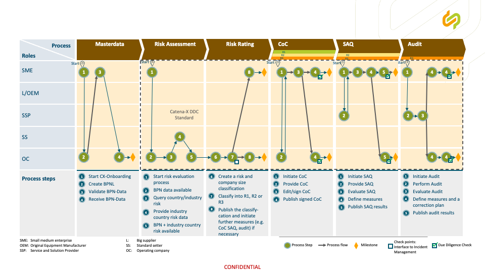

<!--
 *********************************************************************************
 * Copyright (c) 2025 Contributors to the Eclipse Foundation
 *
 * See the NOTICE file(s) distributed with this work for additional
 * information regarding copyright ownership.
 *
 * This program and the accompanying materials are made available under the
 * terms of the Apache License, Version 2.0 which is available at
 * https://www.apache.org/licenses/LICENSE-2.0.
 *
 * Unless required by applicable law or agreed to in writing, software
 * distributed under the License is distributed on an "AS IS" BASIS, WITHOUT
 * WARRANTIES OR CONDITIONS OF ANY KIND, either express or implied. See the
 * License for the specific language governing permissions and limitations
 * under the License.
 *
 * SPDX-License-Identifier: Apache-2.0
 ********************************************************************************/
-->

## Architecture View

## Architecture Overview

### Business Architecture

This section of the KIT describes the Business Architecture of the Due Diligence Check Use Case. It is documented from the perspective of business stakeholders, who wants to adopt the use case, so she can understand the impact on the business capabilities, processes and organisation of the use case adoptor. The Business Architecture also forms the requirements towards the application, data and infrastructure architecture.

#### User Journey

The User Journey provides a high level overview of the due diligence process in the supply chain that implements the Due Diligence Check.

The automotive industry faces the challenge of scrutinizing complex, global supply chains for human rights and environmental risks in accordance with the Corporate Sustainability Due Diligence Directive (CSDDD). This necessitates structured, risk-based, and documented due diligence processes. The Catena-X Due Diligence Check offers a standardized, interoperable, and efficient solution that specifically reduces the burden for small and medium-sized enterprises (SMEs) and preserves data sovereignty. The process is divided into five main phases: Master Data Management, Risk Assessment and Classification, Code of Conduct (CoC) Signing, Self-Assessment Questionnaire (SAQ), and, if necessary, an Audit.

##### Master Data Management: The Foundation for Data Exchange

The first step in the Due Diligence Check is to establish a reliable data foundation within the Catena-X ecosystem. This begins with CX-Onboarding, initiated by the SME. Here, the company registers itself in the Catena-X network and establishes the technical prerequisites for secure data exchange. Subsequently, the Operating Company creates a Business Partner Number (BPNL) for the SME. On the one hand, the SME is responsible for reviewing the BPN data to ensure the accuracy and completeness of its master data. On the other hand, this validation process is supported by the Golden Record Service. It is planned to extend the BPN attributes beyond the current address and country information of the respective contracting organization and related plant location. Future enhancements will include additional attributes such as company size (e.g., number of employees of the contracting organization to support SME identification) as well as information about the products manufactured or services offered. This will enable more precise sector classification (e.g., electronics, metal production, consulting services, logistics, etc.). After successful verification, the BPN data serves as a validated foundation for all subsequent process steps. This standardized master data management approach prevents fragmentation and duplication of company information, which currently represent significant sources of inefficiency.

##### Risk Assessment and Classification: A Risk-Based Approach

Following successful master data verification, the abstract risk analysis phase begins. In line with the principles of the CSDDD, this phase follows a structured risk-based approach. The risk process is initiated by the SME. The Operating Company first checks whether the BPN data is available to ensure clear assignment. Subsequently, the country and sector risk data are queried. The Standard Setter provides the country- and sector-specific risk data. These data are based on a shared, harmonized risk register that ensures the comparability and objectivity of the risk assessment. Once the BPN and country and sector risk data are available, the Operating Company creates a combined risk and company size classification. This classification considers both the inherent risk of the business sector and location, as well as the size of the SME, to ensure a proportional assessment. Based on this analysis, the company is assigned to one of three risk levels: R1 (low risk), R2 (medium risk), or R3 (high risk). The resulting classification is then published by the Operating Company and made visible to the SME. Depending on the assigned risk level and company size, further measures may be triggered (e.g., CoC, SAQ, Audit), which underscores Catena-X's structured risk-based decision logic. The process is not limited to proactive risk management during onboarding. It is also closely linked to the Expert Group “Due Diligence Governance” and its incident management use case. A verified incident can lead to a reassessment of the risk level, for example an escalation from R2 to R3, which may trigger an on-site audit and the implementation of corrective action plans.

##### Code of Conduct Signing: Adherence to Ethical Standards

A crucial component of due diligence is the commitment to common environmental and social standards. The SME initiates the Code of Conduct (CoC) signing process. The Operating Company provides the standardized CoC issued by the established Standard Setter, which defines the industry-harmonized environmental and social principles. The SME reviews and digitally signs the CoC to formally document its commitment to these principles. The signing takes place securely within the Catena-X framework. After completion, the signed CoC is published by the Operating Company and made visible to authorized partners in the network, ensuring transparency and traceability of the commitment. This standardized approach replaces the multitude of different Codes of Conduct that SMEs are currently required to review and sign. As with risk assessment and classification, this process is also linked to incident management. If an incident is reported and verified, it may trigger a reevaluation of the current due diligence status and, where necessary, additional corrective measures.

##### SAQ Completion: Self-Assessment as a Concrete Risk Filter

For companies classified as medium risk (e.g., R2), completion of a Self-Assessment Questionnaire (SAQ) is required. The SME initiates the SAQ process. The SSP (Service and Solution Provider), a dedicated role within the Catena-X ecosystem offering specialized services, provides and operates the standardized SAQ defined and released by the Standard Setter. The SAQ is based on harmonized questionnaire standards tailored to the diverse structures and risk profiles of the automotive industry and aligned with the CSDDD framework. To ensure both flexibility and comparability within the network, different recognized SAQ standards may be applied. However, only those standards that meet defined minimum requirements set by this Expert Group are eligible for integration. These requirements include, in particular, adequate coverage of CSDDD-protected rights and environmental obligations, defined quality and governance criteria, and interoperability within the Catena-X architecture. Compliance with these requirements is assessed through a structured evaluation grid. The SME completes and digitally signs the SAQ to provide a structured self-assessment of its sustainability performance and risk management practices. Based on its responses, the SME defines appropriate preventive measures to address identified weaknesses or potential risks. The evaluated SAQ, including the defined preventive measures and corresponding target dates, is published by the Operating Company and made visible to authorized partners within the network. This standardized SAQ approach reduces the administrative burden for SMEs, as it can be completed once and shared with multiple business partners. As with risk assessment and classification, this process is also linked to incident management. If an incident is reported and verified, it may trigger a reevaluation of the current due diligence status and, where necessary, additional corrective measures.

##### Audit Execution: In-Depth Review for High Risk

For companies classified as high risk (e.g., R3), an audit may be required. The SME initiates the audit process. The SSP (Service and Solution Provider) is responsible for planning and conducting the audit, thereby ensuring an independent and professional on-site review of the SME’s processes, controls, and practices. As with the SAQ, the audit framework is based on standards recognized by the Standard Setter. To enable flexibility while maintaining comparability, multiple established audit standards may be integrated, provided they meet the defined minimum requirements and are admitted through the evaluation grid. Following the audit, the SME defines appropriate measures and develops a corrective action plan to address identified deficiencies. The audit result, including key findings and the corrective action plan, is published by the Operating Company and made visible to authorized partners within the Catena-X network, ensuring transparency and traceability. As with risk assessment and classification, this process is also linked to incident management. A reported and verified incident may trigger a reassessment of the company’s due diligence status and, where necessary, additional corrective measures.

**Conclusion:**

The Catena-X Due Diligence Check transforms the fragmented and inefficient Due Diligence practices in the automotive industry into a standardized, risk-based, and data-sovereign process. By utilizing common standards, data models, and a trustworthy infrastructure, it significantly relieves SMEs, increases efficiency for all participants, and ensures compliance with regulatory requirements. This lays the foundation for a more robust and sustainable supply chain in the automotive sector.

It should also be noted that risk assessments, CoCs, SAQs and audits are subject to a validity period and must be requalified after this period expires.

## NOTICE

This work is licensed under the [CC-BY-4.0](https://creativecommons.org/licenses/by/4.0/legalcode).

- SPDX-License-Identifier: CC-BY-4.0
- SPDX-FileCopyrightText: [2026] Contributors to the Eclipse Foundation
- Source URL: [https://github.com/eclipse-tractusx/eclipse-tractusx.github.io](https://github.com/eclipse-tractusx/eclipse-tractusx.github.io)
