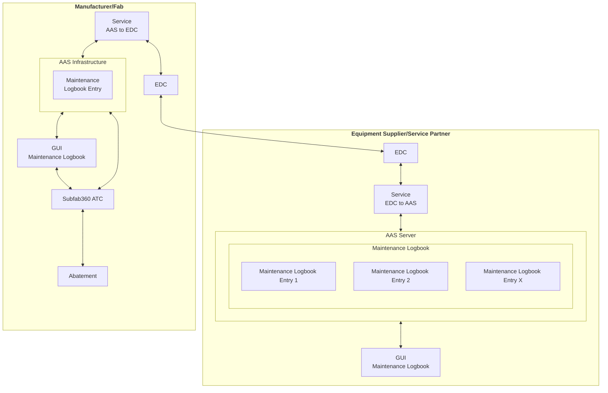
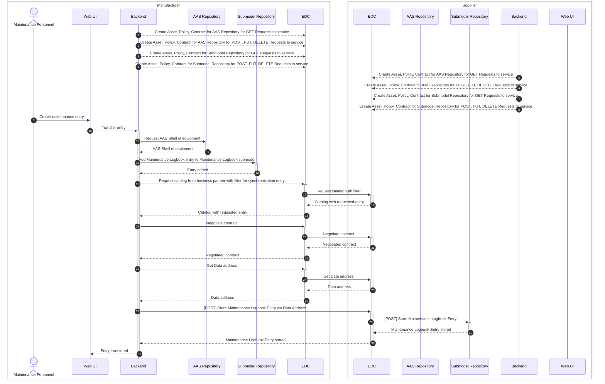

<!--
Copyright(c) 2026 Contributors to the Eclipse Foundation

See the NOTICE file(s) distributed with this work for additional
information regarding copyright ownership.

This work is made available under the terms of the
Creative Commons Attribution 4.0 International (CC-BY-4.0) license,
which is available at
https://creativecommons.org/licenses/by/4.0/legalcode.

SPDX-License-Identifier: CC-BY-4.0
-->

<!-- 
KIT LOGO START - Generated automatically from the configuration done in Kit Master Data
Replace <kit-id> with the id from your kit referenced in `data/kitsData.js`.
Do not remove!
This logo is only visible when compiled with Docusarus (final version of the hosted KIT)
-->

import Kit3DLogo from '@site/src/components/2.0/Kit3DLogo';

<Kit3DLogo kitId="exchange-maintenance-logbook" />

<!--
KIT LOGO END
-->

## Architecture Overview

<!-- High-level diagram of the technical approach. -->

<!--
TODO: Describe the technical architecture and key design decisions.
We recommend diagrams in drawio (need to be stored in SVG), or you can use mermaid or plant uml
As described in TRG 1.04: https://eclipse-tractusx.github.io/docs/release/trg-1/trg-1-04.
Explain which components are involved in the KIT data exchange or use case.
Keep the source code so it can be included in the final KIT version in Markdown.
-->

### State of the Art

Maintenance in a semiconductor factory is not uncommon. Due to the long process run times and the highly complex processes themselves, machines operate 24/7. A system failure can cause extreme delays in run times and result in a high rate of scrap.\
All information within the semiconductor system is classified as business-critical and therefore may not leave the company without authorization. This requires prior approval. This also applies to maintenance logs. These may contain process-critical information, particularly when they include machine data. Therefore, the exchange of maintenance logs is a critical process. However, the log is also important for the service provider, as it serves as the basis for their cost billing.

Currently, this process is carried out manually. A maintenance employee documents their work on paper during or after maintenance. Machine parameters may only be read and evaluated on-site and must not leave the company. The documentation is subsequently submitted to the maintenance supervisor for review and approval.

### Solution

The solution breaks up the paper-based structure described in [State of the Art](#state-of-the-art): the maintenance documentation is digitalised, but under the two guiding requirements of the use case - self-determined and secure. The component landscape shown below is deliberately mirrored: manufacturer/fab and equipment supplier/service partner operate the same building blocks, and the only connection between them runs through the two EDCs.

On the **manufacturer/fab** side, the abatement equipment is connected to the process control software `Subfab360 ATC`. The AAS infrastructure hosts the digital twin of that equipment: `DAS Environmental Expert GmbH`, as manufacturer of the abatements, provided the base AAS for the selected products with the submodel templates Nameplate, Technical Data and Handover Documentation; the Maintenance Logbook submodel is added on top of it and holds the maintenance logbook entries. The `GUI Maintenance Logbook`, developed by `algorismic GmbH`, is the entry point for the maintenance personnel. Because it is coupled to the process control software, machine parameters can be read directly from the equipment and taken over into an entry instead of being transcribed on paper - the parameters themselves stay inside the fab and only the released entry is shared. The service `AAS to EDC` exposes the AAS infrastructure as EDC assets, so that the connector remains the single controlled egress point of the company. `Robert Bosch Semiconductor Manufacturing Dresden GmbH` provided the internal infrastructure and the implementation of the AAS environment.

The **equipment supplier/service partner** side mirrors this setup: its EDC receives the entries, the service `EDC to AAS` writes them into its own AAS server, where the Maintenance Logbook keeps the received entries 1..X, and the same `GUI Maintenance Logbook` makes them available to the service partner - for example as the basis for cost billing. The supplier therefore never gains access to the fab's systems; it holds its own copy of exactly those entries that were released for it.

The key design decision is this mirroring instead of a shared or centrally hosted logbook: both parties keep their data in their own AAS environment, and every entry crosses the company border only as an explicit, contract-governed transfer between the two EDCs. The sequence of such a transfer is described in the next diagram.

 Both diagrams in this document are maintained as inline Mermaid source and rendered by Docusaurus using Mermaid 11.15.0; edit the fenced `mermaid` blocks and rebuild the site to regenerate them.

#### Sequence of a Maintenance Logbook Entry

The sequence diagram shows the exchange of a single maintenance logbook entry between the manufacturer (fab) and the equipment supplier/service partner. Both parties operate the same set of components - Web UI, backend, AAS Repository, Submodel Repository and an EDC - so the deployment is symmetric and independent of the role a company takes in the exchange.

**1. Provisioning (steps 1-8).** Before any exchange takes place, both backends register their AAS Repository and their Submodel Repository at their local EDC. Read access (GET) and write access (POST, PUT, DELETE) are published as separate assets, each with its own policy and contract definition. This separation is a deliberate design decision: a partner can be allowed to append a maintenance entry without being allowed to read the complete logbook of the equipment, and vice versa.

**2. Local recording (steps 9-14).** The maintenance personnel create the entry in the Web UI, which hands it over to the backend. The backend resolves the AAS shell of the equipment in the AAS Repository and appends the entry to the Maintenance Logbook submodel in its own Submodel Repository. The local record is written first and remains the leading copy; no process-critical data has left the company at this point.

**3. Sovereign transfer (steps 15-31).** Only afterwards the backend starts the Dataspace Protocol flow through its EDC: it requests the partner's catalog with a filter for the synchronization asset, negotiates the contract and retrieves the data address (EDR). Using this data address, the entry is pushed as a POST request through both connectors into the supplier's Submodel Repository, where it is stored in the mirrored Maintenance Logbook submodel. The confirmation is propagated back to the Web UI, so the maintenance personnel can see whether the transfer succeeded.

The result is a push-based mirror of the logbook: the supplier receives exactly those entries that have been released for them - the basis for their cost billing - while the manufacturer keeps the complete record. All traffic crossing the company border passes exclusively through the EDC under a negotiated contract, and no central third-party storage is involved. All repository calls use the IDTA API in version 3.2 (BaSyx implementation), see the following section.

## Application Programming Interfaces (API)

The use case communicates with the AAS Repository and Submodel Repository through version 3.2 of the IDTA Application Programming Interfaces, implemented using Eclipse BaSyx.

## Protocols

<!-- Provide a minimal code snippet or step-by-step guide. -->

| Name | Description | Link to Documentation |
| ---- | ----------- | ---------------------- |
| `ISO/IEC DIS 26450` | Eclipse Dataspace Protocol (DSP) | [https://www.iso.org/standard/93502.html](https://www.iso.org/standard/93502.html) |
| `Dataspace Protocol 2025-1` | Documentation for ISO/IEC DIS 26450 | [https://eclipse-dataspace-protocol-base.github.io/DataspaceProtocol](https://eclipse-dataspace-protocol-base.github.io/DataspaceProtocol) |
| `ISO/IEC DIS 26451` | Eclipse decentralized claims protocol | [https://www.iso.org/standard/93503.html](https://www.iso.org/standard/93503.html) |
| `Eclipse Decentralized Claims Protocol v1.0` | Documentation for ISO/IEC DIS 26451 | [https://eclipse-dataspace-dcp.github.io/decentralized-claims-protocol/v1.0.1/](https://eclipse-dataspace-dcp.github.io/decentralized-claims-protocol/v1.0.1/) |

## NOTICE

This work is licensed under the [CC-BY-4.0](https://creativecommons.org/licenses/by/4.0/legalcode).

- SPDX-License-Identifier: CC-BY-4.0
- SPDX-FileCopyrightText: 2026 University of Applied Sciences Dresden
- SPDX-FileCopyrightText: 2026 Robert Bosch Semiconductor Manufacturing Dresden GmbH
- SPDX-FileCopyrightText: 2026 DAS Environmental Expert GmbH
- SPDX-FileCopyrightText: 2026 algorismic gmbh
- SPDX-FileCopyrightText: 2026 Contributors to the Eclipse Foundation
- Source URL: [https://github.com/eclipse-tractusx/eclipse-tractusx.github.io](https://github.com/eclipse-tractusx/eclipse-tractusx.github.io)
