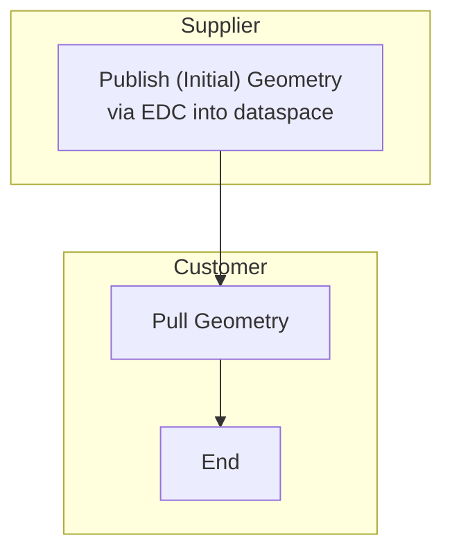

## Vision & Mission

### Vision

Our vision is to establish a seamless, secure, and efficient engineering platform within the Catena-X ecosystem. In a first step a collaborative platform for cross company requirements management that enables quick information access and multiple company collaboration via a standardized solution in the Catena-X dataspace, ...

### Mission

The Geometry Kit aims to ...

## Business Value & Benefits

### Business Value

The "Geometry-KIT" provides guidelines and standards, such as semantic models and data exchange processes, which help companies create a reliable and sovereign data exchange system with their partners.

This reduces cost and effort needed to integrate data-driven engineering processes into their operations and IT systems.

Since this KIT is built on the Industry Core KIT and will be closely connected to upcoming other KITSs within the Engineering Domain, investment and implementation costs to integrate requirement services are reduced.

### Todays Challenge

As product development becomes more and more cross-company, the ...

### Benefits for OEM, SME and Solution Provider

#### OEM and large automotive suppliers

The Geometry Kit presents a transformative solution for OEMs and large automotive suppliers, fundamentally optimizing their ...

#### SME

The Geometry Kit offers significant advantages for Small and Medium-sized Enterprises (SMEs), streamlining what can often be a complex and resource-intensive aspect of their operations. One of the most impactful benefits is the simplification of the ...

#### Solution Provider

Catena-X offers solution providers a variety of strategic advantages to leverage their innovation capabilities and strengthen their market position beyond the automotive industry. Here are some examples of how solution providers can benefit from Catena-X technology:

...

## Customer Journey

## User Journey

## Notice

This work is licensed under the [CC-BY-4.0](https://creativecommons.org/licenses/by/4.0/legalcode).

- SPDX-License-Identifier: CC-BY-4.0
- SPDX-FileCopyrightText: 2025 Dräxlmaier GmbH & Co. KG
- SPDX-FileCopyrightText: 2025 Schaeffler AG
- SPDX-FileCopyrightText: 2025 Mercedes Benz Group AG
- SPDX-FileCopyrightText: 2025 ZF Friedrichshafen AG
- SPDX-FileCopyrightText: 2025 Contributors to the Eclipse Foundation
