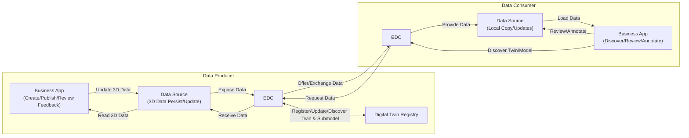
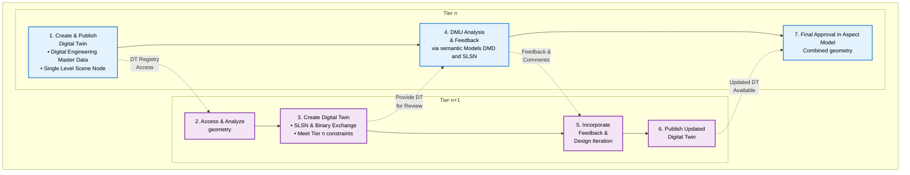

<!--
Copyright(c) 2025 Audi AG
Copyright(c) 2025 BMW Group
Copyright(c) 2025 DLR
Copyright(c) 2025 DRÄXLMAIER Group
Copyright(c) 2025 :em AG
Copyright(c) 2025 Mercedes-Benz AG
Copyright(c) 2025 Robert Bosch GmbH
Copyright(c) 2025 Schaeffler AG
Copyright(c) 2025 Threedy GmbH
Copyright(c) 2025 ZF Group
Copyright(c) 2025 Contributors to the Eclipse Foundation

See the NOTICE file(s) distributed with this work for additional
information regarding copyright ownership.

This work is made available under the terms of the
Creative Commons Attribution 4.0 International (CC-BY-4.0) license,
which is available at
https://creativecommons.org/licenses/by/4.0/legalcode.

SPDX-License-Identifier: CC-BY-4.0
-->

## Vision & Mission

### Vision

The vision of the **Geometry KIT** is to enable secure and sovereign exchange of engineering geometry information across the entire value chain and all n-tier levels in Catena-X. It focuses on making 3D assets—such as CAD models and their associated metadata from Data-Management-Systems — discoverable, accessible, and reusable for data-driven use cases without compromising data sovereignty.

The Kit provides a uniform, standards-based foundation for interoperability between Business Partners when sharing geometry information. It covers geometry and touching relevant standars such as Digital Master Engineering Data, ensuring that participants can build consistent, trusted engineering data chains throughout the lifecycle of products and components.

### Mission

The Geometry KIT bundles the necessary Catena-X standards, profiles, APIs, semantic models, and reference implementations to publish, discover, request, and consume geometry information in the dataspace. It provides clear guidance and tooling to map data from enterprise PLM/CAE systems into Catena-X-compliant representations and exchange files efficiently and securely.

By adopting existing Catena-X standards the Geometry KIT enables rapid implementation of multiple engineering use cases around geometry data exchange.

## Business Value & Benefits

### Business Value

The Geometry KIT enables companies to build secure, cross-company engineering collaboration use cases within Catena-X. By providing standardized models and interfaces for geometry data exchange, it reduces integration costs, accelerates development cycles, and improves data quality. Companies benefit from faster iterations, streamlined onboarding, and robust IP protection—leveraging Catena-X’s architecture to collaborate efficiently while maintaining data sovereignty.

### Todays Challenge

Companies face significant challenges when exchanging engineering-grade geometry data across organizational boundaries. Critical 3D and 2D CAD data is often locked away in isolated systems, accessible only to a few experts. Sharing geometry with partners typically requires manual exports, data conversions, or the use of static screenshots and lightweight viewer—processes that are time-consuming, error-prone, and result in loss of detail and context. These workarounds create data silos, slow down collaboration, and increase the risk of inconsistencies and downstream errors.

Security and intellectual property protection add further complexity: companies must ensure that sensitive design data is only accessible to authorized partners, while still enabling efficient collaboration. The lack of standardized, automated processes for geometry exchange leads to duplicated efforts, high integration costs, and limited ability to leverage geometry data throughout the product lifecycle. As a result, engineering teams struggle to keep data up-to-date, respond quickly to changes, and fully realize the value of their geometry assets in cross-company projects.

### Benefits for OEM, Suppliers and Solution Provider

#### OEM and suppliers

The Geometry KIT empowers OEMs and suppliers or any Tier in the supplychain to streamline cross-company engineering collaboration. By bundling key standards—such as the Geometry Standard, SingleLevelSceneNode, Digital Engineering Masterdata Standard, Binary Exchange, and the Digital Twin Standard — it enables essential use cases like DMU analysis to be implemented efficiently within Catena-X. Leveraging the Catena-X architecture, Catena-X participants can securely exchange geometry data and collaborate across company borders, with IP protection and data sovereignty ensured by the underlying Catena-X design. This reduces manual effort, accelerates design cycles, improves data consistency, and enables automated feedback loops and faster onboarding throughout the supply chain.

#### Solution Provider

By implementing and aligning their offerings with Catena-X, solution providers can position their products for secure, standards-based data exchange and connect to a growing network of participants within the Catena-X ecosystem. This alignment puts their solutions at the forefront of modern geometry data exchange, enabling seamless integration, interoperability, and access to new business opportunities across industries. Solution providers benefit from increased market relevance, the ability to address customer requirements for secure collaboration, and the potential to drive innovation in digital engineering workflows.

## Use Case

### Digital Mock-Up Analysis: A Cross-Company Collaboration Use Case

Digital Mock-Up (DMU) Analysis is a central use case in the design phase of physical products, where Tier n and Tier n+1 must collaborate closely to develop and adjust their products in line with requirements from both sides. During this phase, engineers regularly review, comment, and align on the current development status, communicating necessary changes and feedback iteratively. DMU Analysis enables teams to ensure the evolving product meets all requirements before physical prototypes are built.

At its core, DMU Analysis empowers engineers to perform essential digital engineering tasks on 3D models and assemblies - such as taking precise measurements, checking clearance, detecting clashes, assessing serviceability, comparing design variants, inspecting internal and external structures, and visualizing key properties or changes. These capabilities allow teams to validate fit, function, and compliance with requirements, identify potential issues early, and communicate findings clearly—all before any physical prototype is built.

This frequent, iterative exchange and review of engineering data between partners is the core collaboration scenario that the Geometry KIT enables, making secure, automated, and standards-based geometry data sharing possible across company boundaries.

```mermaid
flowchart
 subgraph OEM["Tier n (OEM)"]
        o_start(["Requirements established and aligned"])
        o_req(["Request new geometry"])
        o_provide(["Provide Geometry Digital Twin"])
        o_define(["Define Reference Coordinate System, Level of Detail and Level of Abstraction"])
        o_package[/"Digital Twin 1"/]
        o_assemble(["DMU Assembly: load master data, place geometry"])
        o_analysis(["DMU Checks: clash, clearance, serviceability"])
        o_gate{"Approve?"}
        o_release(["Release Geometry"])
        o_approval(("Approval"))
        o_feedback(["Structured Feedback"])
  end
 subgraph SUP["Tier n+1 (Supplier)"]
        s_create(["Create Geometry Representation"])
        s_provide(["Provide Geometry Digital Twin"])
        s_check(["Check Geometry Quality"])
        s_pack[/"Digital Twin 2"/]
        s_adjust(["Adjust Geometry Representation/Digital Twin"])
        s_review(["Internal Review"])
        s_pack2[/"Repackaged Digital Twin"/]
  end
    o_start --> o_req
    o_req --> o_define
    o_define --> o_provide
    o_provide --> o_package
    s_create --> s_check
    s_check --> s_provide
    s_provide --> s_pack
    s_pack --> o_assemble
    o_assemble --> o_analysis
    o_analysis --> o_gate
    o_gate -- OK --> o_release
    o_release --> o_approval
    o_gate -- NOK --> o_feedback
    o_feedback --> s_adjust
    s_adjust --> s_review
    s_review --> s_pack2
    s_pack2 --> o_assemble
    o_package --> s_create
     o_start:::terminal
     o_req:::activity
     o_provide:::activity
     o_define:::activity
     o_package:::artifact
     o_assemble:::activity
     o_analysis:::activity
     o_gate:::gateway
     o_release:::activity
     o_approval:::terminal
     o_feedback:::activity
     s_create:::activity
     s_check:::activity
     s_pack:::artifact
     s_adjust:::activity
     s_review:::activity
     s_pack2:::artifact
     s_provide:::activity
    classDef activity fill:#E3F2FD,stroke:#1E88E5,stroke-width:2, color:#000
    classDef gateway fill:#E8F5E9,stroke:#43A047,stroke-width:2, color:#000
    classDef checklist fill:#F3E5F5,stroke:#8E24AA,stroke-dasharray:2 2, color:#000
    classDef exchange fill:#FCE4EC, stroke:#D81B60, stroke-width:2, color:#000
    classDef terminal fill:#CFD8DC, stroke:#455A64, stroke-width:2, color:#000
    classDef artifact fill:#FFF3E0, stroke:#FB8C00, stroke-width:2, stroke-dasharray:3 3, color:#000
````

#### High-Level Scenario

In a typical DMU Analysis workflow, one partner *Tier n+1* (e.g. a supplier) creates or updates a 3D model and publishes it as a Digital Twin with geometry data into the Catena-X dataspace. Another partner *Tier n* (e.g. an OEM) finds, pulls, and reviews this geometry data in their own environment, performing analyses such as clash detection, assembly verification, and redlining and annotation feedback. The process is iterative: feedback is provided, updates are made, and the cycle repeats until the design is accepted—all while maintaining data sovereignty and security. (See User Journey section for more details.)

#### Practical Variants of DMU Analysis

While the core DMU Analysis workflow remains consistent, its practical application can take several forms depending on the engineering context, data sensitivity, and collaboration needs. The following common variants illustrate how the use case is adapted in real-world scenarios:

##### 1. Basic Build Room Analysis

In early design phases, engineers often need to ensure that a future part will fit within the available space of an assembly. For this purpose, it is common to exchange only simplified geometry—such as bounding boxes or build room-defining surfaces—rather than full detailed models. This approach enables rapid spatial checks and early alignment between partners, while minimizing the exposure of sensitive design details.

##### 2. Exchange of Different Levels of Detail

Not all collaboration requires the full geometric detail of a part or assembly. Depending on the phase of development and the sensitivity of the data, participants may choose to share reduced or simplified models (e.g., envelope geometry, de-featured shapes) to protect intellectual property or because such information is sufficient for the task at hand. Conversely, as the design matures and discussions move into detailed engineering, high-fidelity models with full precision may be exchanged to enable thorough analysis and validation.

##### 3. Exchange of Different File Formats

Because partners often use different CAD systems and engineering tools, DMU Analysis scenarios frequently require the exchange of geometry in multiple formats. Common standards include JT and STEP, but native formats from systems like CATIA, Creo, or NX may also be used. The Geometry KIT supports this diversity by enabling the secure, standards-based transfer of various file types, ensuring interoperability across company and system boundaries.

These variants demonstrate the flexibility of DMU Analysis within Catena-X: from lightweight, early-phase checks to detailed, high-precision collaboration, and across a range of data formats. By supporting these different formats, the Geometry KIT ensures that engineers and implementors can tailor their data exchange to the needs of each project phase—balancing efficiency, security, and technical requirements.

## User Journey

The following simplified diagram illustrates the circular, iterative flow of engineering collaboration and review for 3D geometry data in Catena-X:

```mermaid
flowchart TD
 subgraph Partner_1 ["Tier n+1"]
  A["Create/Update 3D Model"]
  D["Review Feedback & Update Model if Needed"]
 end

 subgraph Partner_2 ["Tier n"]
  B["Pull Geometry Data<br/>Review & Annotate (DMU, Bauraum, etc.)"]
  C["Accept / Request Changes / Comment"]
 end

 A --> B
 B --> C
 C --> D
 D -- "If changes required" --> A
 C -- "If accepted" --> E["Process Complete"]
```

**Description:**

1. Tier n (Supplier) creates or updates a 3D model and publishes it as a Digital Twin with geometry data via EDC into the Catena-X dataspace.
2. Tier n+1 (Customer/Partner) pulls the geometry data into their environment and performs review/analysis (e.g., DMU Analysis, Buildroom checks).
3. Tier n+1 annotates, comments, and either accepts the data or requests changes.
4. Tier n reviews the feedback and, if needed, updates the model and republishes a new Digital Twin.
5. The cycle repeats until the geometry is accepted, ensuring efficient, sovereign, and standards-based cross-company collaboration.

## System Overview: Data Flow Across Partners

The following diagram shows the main systems involved in the user journey, clearly differentiating between both partners. Each partner has its own data source, EDC, and business application. The Digital Twin Registry enables discovery and linkage across the ecosystem.



**Description:**

- Each partner has its own Data Source (for persisting and updating 3D data), EDC (for secure data exchange), and Business Application (for creation, review, and annotation).
- The Digital Twin Registry enables discovery and linkage of geometry data across partners.
- Data flows from Partner 1's app to their data source, is registered in the DTR, and exchanged via EDC to Partner 2, where it is consumed and reviewed in their own environment.

## Geometry understanding

The following section describes the difference in structure of the SingleLevelSceneNode and the BOM structure. It also makes clear how both work together. The SingleLevelSceneNode and SingleLevelBOM aspect models in Catena-X serve two complementary but clearly distinct purposes.

The SingleLevelSceneNode defines the geometric and spatial structure within a single digital twin. It organizes geometry data by describing how individual objects or assemblies are positioned, transformed, and related to one another inside that twin. Each SingleLevelSceneNode represents a geometric object or group of objects, identified by its own Catena-X ID. Through its child items, a scene node can reference other scene nodes, but only those that belong to the same digital twin (and therefore are provided by the same participant). These hierarchical relationships are purely spatial — they define how geometry is composed and arranged, not how different products or business entities are connected or how assebly throughout multiple participants work. The model also contains information such as transformation matrices, bounding volumes, and metadata that describe the geometry’s placement and extent. In essence, the SingleLevelSceneNode provides the internal geometry structure that can be used for visualization, simulation, or digital mock-up purposes.

The BOM structure, on the other hand, describes the logical and semantic product structure that spans multiple digital twins. Instead of focusing on geometry, it defines how different components — potentially originating from different business partners — are related in a product hierarchy. Each child item in the BOM points to the Catena-X ID of another digital twin, allowing an *Tier n* twin, for example, to reference parts or sub-assemblies provided by suppliers *Tier n+1*. Through this model, the overall product composition across the supply chain can be represented consistently. These connected digital twins can contain geometry data as well but don't have to.

In short, SingleLevelSceneNode connects geometry within one digital twin, whereas SingleLevelBOM connects multiple digital twins with each other. The SingleLevelSceneNode model builds the internal spatial view of a twin, while the BOM model builds the external structural view across organizational boundaries — combined they complete a digital representation of both the product’s geometry and its multi-partner assembly hierarchy. The overview can be found in the following table.

| Feature                  | **SingleLevelSceneNode**                                                                           | **SingleLevelBOM**                                                                                            |
|--------------------------|----------------------------------------------------------------------------------------------------|---------------------------------------------------------------------------------------------------------------|
| **Purpose / Function**   | Represents the **spatial and geometric structure** within a single digital twin.                   | Describes the **logical and functional product structure** (bill of materials) across multiple digital twins. |
| **Scope / Level**        | Applies **only within one digital twin** — i.e., within its own data instance.                     | Connects **multiple digital twins** — components or assemblies across business partners.                      |
| **Type of Relationship** | **Geometric / spatial** relationships between parts (e.g., transform, bounding volume).            | **Structural / semantic** relationships (e.g., which component belongs to which assembly).                    |
| **Main Entity**          | `modelItems` — links to a geometry data object or group of objects.                                | `childItem` — describes the relationship between parent and child twins.                                      |                          |
| **Linking Mechanism**    | Via `childItems`: connects **own geometries (SceneNodes)** hierarchically. No external references. | Via `childItems`: connects **different digital twins**, forming a product structure.                          |
| **Data Content**         | geometry as data ressource, transformations, bounding volumes.                                     | Product metadata, identifiers, classifications, and references to other aspects (e.g., Part Type).            |
| **Typical Use Case**     | Visualization, simulation, DMU analysis, or digital mock-up of a geometry model.                   | Building a complete product structure across company boundaries.                                              |

## Example Files and Understanding

### Basic Bike Example with 2 Participants

The simplest example of geometry data being shared in the Catena-X ecosystem involves 2 participants. These participants are the *Tier n* and *Tier n+1*. The following example provides a guide for who owns which data and how these data are shared and used. The example consists of a bike, assembled from 2 components. A bike frame and a drive train. The geometry data for these components correspond to 2 STEP files, asm-frame.step and asm-drive.step, respectively. Both can be found in the basic-example directory of this KIT. Both can been seen rendered below.

<div style="display: flex;  justify-content: center; gap: 16px; align-items: flex-start;">
  
  
</div>
<br>

In this example, the *Tier n* owns the bike, builds the frame, and assembles the bike from components provided by various suppliers. Here, a single suppler is considered, *Tier n+1*, who provides the bike drive train. The diagram below depicts how the geometry data workflow between *Tier n* and *Tier n+1* could look, but it should be stressed again that this is only an example, and data sharing workflows will vary in design and complexity.



<div style="text-align: center; margin: 20px 0; font-family: monospace; font-size: 16px;">
    ─────────────────── Time ───────────────────&gt;
</div>

Here, the workflow starts on the left and progressed to the right as a function of time.

1. **Create & Publish Digital Twin**: Initially, *Tier n* creates and publishes access to the Digital Twin (DT), which includes the Digital Engineering Master Data (DMD) and the Single Level Scene Node (SLSN) for the bike by posting the asset on the Digital Twin Registry. The STEP file is included in this and is linked to the Single Level Scene Node via the Binary Data Exchange.

2. **Access & Analyze Geometry**: *Tier n+1* can then access and assess the Digital Twin and associated assets via the Digital Twin Registry. These processes usually occur via each counterpart's EDCs, but these are omitted for simplicity. *Tier n+1* analyses the geometry data provided by *Tier n*, in this instance the bike frame, but this could also be a bounding volume or equivalent.

3. **Create Digital Twin**: *Tier n+1* creates their own Digital Twin for the drive train, including the STEP file, linked to Single Level Scene Node via the Binary Data Exchange, and iterates on it to meet *Tier n* constraints and specifications.

4. **DMU Analysis & Feedback**: When ready, *Tier n+1* provides access to their Digital Twin of the drive train. *Tier n* can then use this data to inspect the *Tier n+1* component via semantic Models DMD and SLSN, provide feedback and answer questions. Both parts can be used by both parties to perform DMU Analysis.

5. **Incorporate Feedback & Design Iteration**: *Tier n+1* then incorporates feedback from *Tier n* into their design and continues to iterate.

6. **Publish Updated Digital Twin**: Once again, when ready, *Tier n+1* provides access to their updated Digital Twin of the drive train.

7. **Final Approval in Aspect Model**: Once *Tier n* is satisfied, the Digital Twin for the combined geometry can be approved. This is the last step in this example.

<br>
<div style="display: flex;  justify-content: center; gap: 16px; align-items: flex-start;">
  
</div>
<br>

In theory, both the *Tier n* and *Tier n+1* can view each others geometry data throughout the entire workflow, following the 1 up 1 down principal, after the initial sharing of participant's Digital Twin.

#### Table of Data Ownership

<br>
<div style="display: flex;  justify-content: center; gap: 16px; align-items: flex-start;">
<table>
  <tr>
    <th><strong></strong></th>
    <th><strong>Tier n</strong></th>
    <th><strong>Tier n+1</strong></th>
  </tr>
  <tr>
    <td><strong>STEP Files</strong></td>
    <td><a href="./resources/basic-example/STEP/asm-frame.step">asm-frame.step</a></td>
    <td><a href="./resources/basic-example/STEP/asm-drive.step">asm-drive.step</a></td>
  </tr>
  <tr>
  <td><strong>Created JSON Payloads</strong></td>
    <td><a href="./resources/basic-example/json/slsn-frame-payload.json">slsn-frame-payload.json</a></td>
    <td><a href="./resources/basic-example/json/slsn-drive-payload.json">slsn-drive-payload.json</a></td>
  </tr>
</table>
</div>
<br>

The table above summarizes who owns which data throughout the progression of the workflow.

## Associated CX-Standards

### Geometry Standard

urn:samm:io.catenax.single_level_scene_node:1.0.0#

The "Single Level Scene Node" is a core concept in the Catena-X Geometry Aspect Model, providing a standardized way to represent a geometric object and its direct properties within a geometric scene as part of a Digital Twin in Catena-X. Each node encapsulates references to geometry data (such as CAD files or tessellated meshes), transformation information (position, rotation, scale), and metadata. This structure simplifies data exchange and integration across systems, ensuring that each geometric entity can be independently described, linked, and consumed by partners.

For full details, see the Catena-X [Geometry Standard (CX-0156)](https://github.com/catenax-eV/product-standardization-prod/blob/R25.12-release-bundle/standards/CX-0156-Geometry/CX-0156-Geometry.md).

### Masterdata

urn:samm:io.catenax.digital_engineering_master_data:1.0.0#

The Masterdata standard (CX-0154) is essential as it provides the structured, interoperable foundation for exchanging all relevant product master information—including references and metadata for 3D geometry—across the value chain. It ensures that 3D data is always contextualized with accurate, up-to-date master information, enabling seamless discovery, retrieval, and integration of 3D models in Catena-X. Our 3D standard builds on this by specifying how geometry and related data are referenced, described, and linked within the masterdata framework, ensuring consistency, traceability, and interoperability for all 3D-centric use cases. The 3D/geometry standard can be used in combination with master data, but it is not mandatory—3D data may also be exchanged independently where appropriate.

For full details, see the Catena-X [Masterdata Standard CX-0154](https://github.com/catenax-eV/product-standardization-prod/blob/main/standards/CX-0154-MasterDataManagement/CX-0154-MasterDataManagement.md).

### Digital Twin Standard

The Digital Twin standard (CX-0002) is fundamental for Catena-X as it defines how assets are digitally represented, uniquely identified, and made discoverable across the network. It provides the architecture and APIs for registering, linking, and accessing digital twins and their aspects (such as 3D geometry, simulation, or master data) in a standardized, interoperable way. This enables seamless integration, traceability, and lifecycle management of 3D information and related data, forming the backbone for all data-driven collaboration and automation scenarios in the ecosystem. In the future, the 3D standard will enable Catena-X participants to communicate 3D data and information directly via digital twins, making 3D data exchange an integral part of the Catena-X dataspace.

For full details, see the Catena-X [Digital Twin CX-0002](https://catenax-ev.github.io/docs/next/standards/CX-0002-DigitalTwinsInCatenaX)

### BinaryExchange

urn:samm:io.catenax.binary_exchange:1.0.0#

The BinaryExchange aspect model is essential for standardized, secure, and interoperable exchange of binary files—such as 3D models—across the Catena-X dataspace. It provides a common structure for describing, referencing, and accessing binary data, including metadata, content type, and access mechanisms via the Dataspace Protocol (DSP).

For full details, see the Catena-X [Binary Exchange Aspect Model](https://github.com/eclipse-tractusx/sldt-semantic-models/blob/main/io.catenax.binary_exchange/1.0.0/BinaryExchange.ttl)

#### Media Type Types for Data Formats

The Binary Exchange aspect model defines a dependency on Media Type types to describe the format of exchanged binary files. A Media Type type (Multipurpose Internet Mail Extensions type) is a standardized way to indicate the nature and format of a file, allowing systems to correctly interpret and process the data. In the context of geometry data exchange, specifying the correct Media Type type ensures that both sender and receiver understand the file format being transferred, enabling interoperability and automation.

##### What are Media Type types?

Media Type types are strings like `application/xml` or `model/jt` that identify the file type and its intended usage. They are widely used in web protocols, APIs, and file exchanges to signal how a file should be handled. The first part of a Media Type type indicates the general category (e.g., `application`, `model`, `image`), while the second part specifies the exact format (e.g., `step`, `jt`, `iges`).

##### CAD Formats Defined by IANA

The Internet Assigned Numbers Authority (IANA) maintains a registry of official Media Type types. For an example of CAD and 3D model data, the following Media Type types are currently defined by IANA:

- `model/step` — for STEP files (ISO 10303-21, .stp/.step)
- `model/JT` - for JT (Jupiter Tesselation) files
- `model/iges` — for IGES files (.igs/.iges)
- `model/stl` - for STL Files
- `model/gltf+json` and `model/gltf-binary` — for glTF 3D models (.gltf, .glb)
- `model/obj` — for Wavefront OBJ files (.obj)

Other formats commonly used in industry, such as native CAD formats (e.g., CATIA, NX, Creo), may not have official IANA registrations but are often used with custom or vendor-specific Media Type types. The Binary Exchange model allows for both standard and custom Media Type types to be referenced, supporting a wide range of geometry data formats in Catena-X.

For a detailed overview of the supported Media Types see: <https://www.iana.org/assignments/media-types/media-types.xhtml>

#### Binary vs. Encoded Data

Most aspect models, including BinaryExchange, are designed to reference or link to binary files (e.g., via a URI), not to embed the raw file content directly in the aspect payload. However, in some cases—such as for small files, or when direct embedding is required—binary data may be included as a base64-encoded string.

Base64 Encoding:
Base64 encoding converts binary data into a text format, making it safe to include in JSON, XML, or other text-based payloads. This is useful when:

The file must be embedded directly in the aspect model (e.g., for transport in a single message).
The receiving system cannot handle binary payloads natively.
There are constraints on the transport protocol (e.g., HTTP APIs that expect text).
Interoperability and Clarity:
The encoding method (e.g., base64) must be clearly specified in the aspect model’s schema or metadata (such as the contentType property in BinaryExchange). This ensures that all participants know how to decode and use the file data, avoiding misinterpretation or data corruption.

## Notice

This work is licensed under the [CC-BY-4.0](https://creativecommons.org/licenses/by/4.0/legalcode).

- SPDX-License-Identifier: CC-BY-4.0
- SPDX-FileCopyrightText: 2025 Threedy GmbH
- SPDX-FileCopyrightText: 2025 Dräxlmaier GmbH & Co. KG
- SPDX-FileCopyrightText: 2025 Schaeffler AG
- SPDX-FileCopyrightText: 2025 Mercedes Benz Group AG
- SPDX-FileCopyrightText: 2025 ZF Friedrichshafen AG
- SPDX-FileCopyrightText: 2025 Contributors to the Eclipse Foundation
