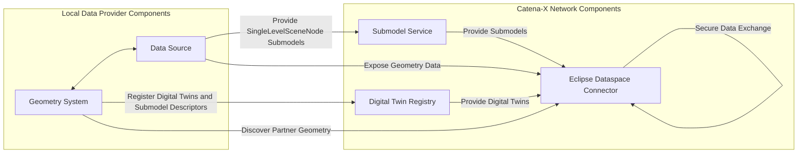
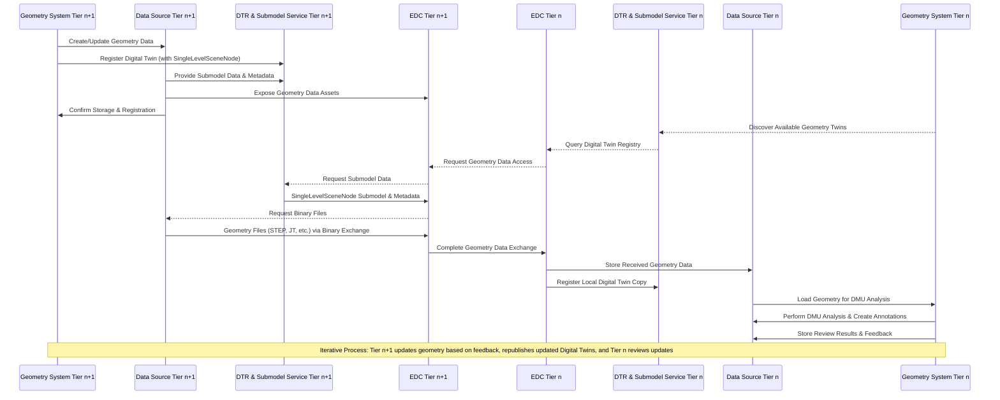

<!--
Copyright(c) 2025 Audi AG
Copyright(c) 2025 BMW Group
Copyright(c) 2025 DLR
Copyright(c) 2025 DRÄXLMAIER Group
Copyright(c) 2025 :em AG
Copyright(c) 2025 Mercedes-Benz AG
Copyright(c) 2025 Robert Bosch GmbH
Copyright(c) 2025 Schaeffler AG
Copyright(c) 2025 Threedy GmbH
Copyright(c) 2025 ZF Group
Copyright(c) 2025 Contributors to the Eclipse Foundation

See the NOTICE file(s) distributed with this work for additional
information regarding copyright ownership.

This work is made available under the terms of the
Creative Commons Attribution 4.0 International (CC-BY-4.0) license,
which is available at
https://creativecommons.org/licenses/by/4.0/legalcode.

SPDX-License-Identifier: CC-BY-4.0
-->

## Architecture

### Component Diagram

The flowchart illustrates the interactions between the main components in the geometry data exchange system:



#### Components

The following components are necessary for the geometry exchange:

- **Company Specific Components (Local to Data Provider):**
  - **Geometry System**: Business application responsible for creating, updating, and managing geometry data (CAD models, STEP files, etc.)
  - **Data Source**: Local storage system that persists and manages geometry files and metadata, tightly integrated with the Geometry System
- **Catena-X Specific Components:**
  - **Eclipse Dataspace Connector (EDC)**: Facilitates secure geometry data exchange between partners
  - **Digital Twin Registry**: Stores and manages digital twin information including geometry metadata
  - **Submodel Service**: Handles SingleLevelSceneNode submodel data and Binary Exchange operations

#### Interactions

The system architecture demonstrates how components interact to facilitate geometry data exchange:

- **Geometry System & Data Source (Tightly Integrated Local Components)**
  - Geometry System creates/updates geometry models and stores them directly in the local Data Source
  - Data Source provides persistent storage for geometry files and metadata, directly accessible by the Geometry System
  - Together they register Digital Twins and SingleLevelSceneNode Submodel Descriptors in the Digital Twin Registry
  - Data Source exposes geometry data through the local EDC for secure external exchange
  - Geometry System uses the EDC to discover and request geometry data from partners
- **Eclipse Dataspace Connector (EDC)**
  - Acts as the secure communication bridge between partners for geometry data exchange
  - Handles geometry data requests and transfers between local Data Sources of different partners
  - Provides secure access to local Data Source for external partners
- **Digital Twin Registry**
  - Provides Digital Twin discovery capabilities to the Eclipse Dataspace Connector
  - Enables partners to find geometry-related Digital Twins across the network
- **Submodel Service**
  - Provides SingleLevelSceneNode and Binary Exchange submodels to the Eclipse Dataspace Connector
  - Serves geometry metadata and structure information

### Geometry Data Exchange Sequence

The sequence diagram illustrates the geometry data exchange flow between a Data Producer *Tier n+1* (e.g., a Supplier) and a Data Consumer *Tier n* (e.g., an OEM) for DMU Analysis collaboration:

1. **Initial Geometry Creation and Publishing**:

    - Data Producer creates/updates 3D geometry data in their geometry system
    - The geometry data is stored in their Data Source and registered as a Digital Twin with SingleLevelSceneNode submodel in their DTR
    - Data Producer makes the geometry data available through their EDC

2. **Geometry Discovery and Request**:

    - Data Consumer discovers available geometry Digital Twins through the DTR
    - Data Consumer's system requests the geometry data through the EDC
    - The geometry data (including STEP files through the BinaryExchange Submodel) is transferred from Data Producer's systems to Data Consumer's systems

3. **Review and Feedback (DMU Analysis)**:

    - Data Consumer performs DMU Analysis, reviews geometry, and creates annotations/feedback
    - Data Consumer can update their local copy with review results and feedback
    - Feedback can be communicated back to Data Producer for iterative collaboration

4. **Iterative Collaboration**:

- The process repeats iteratively: Data Producer updates geometry based on feedback, republishes updated Digital Twins, and Data Consumer reviews the updates
- This enables the collaborative engineering workflow described in the adoption view

The diagram shows the core components involved in this exchange:

- Geometry Systems (on both Data Producer and Data Consumer sides)
- Data Sources for sharing geometry data and associated metadata
- Digital Twin Registry (DTR) & Submodel Services
- Eclipse Dataspace Connector (EDC) for secure data exchange
- Solid lines indicate dataflow
- Dashed lines indicate initialization of a request



## Single Level Scene Node Aspect Model

The following section gives an overview of the SingleLevelScenenNode aspect model. This aspect model is a submodel that contains the geometry information and the linked childItems which are also scene nodes.

| Digital Twin Type | Aspect Model | Mandatory Version | Optional Versions | KIT | Standard |
| :-- | :-- | :-- | :-- | :-- | :-- |
| PartType | SingleLevelSceneNode | 1.0.0 | | Geometry | CX-0156 |

### Example of a SingleLevelScenenNode Aspect Model

```json
{
  "catenaXId": "urn:uuid:055c1128-0375-47c8-98de-7cf802c32411",
  "childItems": [
    {
      "catenaXId": "urn:uuid:055c1128-0375-47c8-98de-7cf802c32412",
      "semanticTags": [
        "DetailLevel_0"
      ],
      "customTags": [
        "Lid_Full"
      ],
      "localTransform": {
        "matrix4x4": [
          0.9207251857543636,
          -0.38884633595477497,
          -0.0326126021173943,
          0,
          0.08264360576868057,
          0.11263901740312576,
          0.9901933073997498,
          0,
          -0.38135951109945837,
          -0.9143910416632972,
          0.13584525182647786,
          0,
          0.24416112623464936,
          0.6885728819820527,
          0.5416958267430446,
          1
        ]
      }
    }
  ],
  "modelItems": [
    {
      "semanticTags": [
        "DetailLevel_0"
      ],
      "catenaXId": "urn:uuid:055c1128-0375-47c8-98de-7cf802c32413",
      "customTags": [
        "Sheet_Tank"
      ]
    }
  ],
  "localTransform": {
    "matrix4x4": [
      0.9202475547790527,
      0,
      -0.3913368284702301,
      0,
      0,
      1,
      0,
      0,
      0.3913368284702301,
      0,
      0.9202475547790527,
      0,
      0.7266845703125,
      0,
      0.45476603507995605,
      1
    ]
  },
  "boundingVolume": {
    "minPoint": [
      0.4734369218349457,
      -0.21899007260799408,
      0.10562050342559814
    ],
    "maxPoint": [
      1.3504363298416138,
      0.21899007260799408,
      0.6533777713775635
    ]
  }
}

```

Also have a look at the example in Adoption View.

## Data Retrieval Flow

### Binary Data Exchange

The geometry data exchange leverages the Binary Exchange aspect model to handle the transfer of geometry data files (such as STEP, JT, or other geometry formats) alongside the SingleLevelSceneNode metadata. The Binary Exchange model provides:

- **File Metadata**: Information about file type, size, and Media Type (e.g., `model/step`, `model/jt`)
- **Access Information**: Secure links to download binary files via the EDC
- **Content Validation**: Checksums and integrity verification for transferred files

### Typical Flow for Geometry Data Retrieval

1. **Discovery**: Data Consumer discovers geometry Digital Twins via the Digital Twin Registry
2. **Submodel Access**: Data Consumer retrieves SingleLevelSceneNode submodel containing geometry metadata and structure
3. **Binary File Request**: For each geometry referenced in the scene node, the system requests the binary files via Binary Exchange links
4. **Secure Transfer**: Files are transferred securely through the EDC using the Dataspace Protocol
5. **Local Integration**: Retrieved geometry data is integrated into the Data Consumer's local systems for DMU Analysis and review

## EDC Setup

In order to set up the EDC for the geometry use case, the following steps are necessary:

- **[Setup for the DTR](../digital-twin-kit/software-development-view/)**: Configure the Digital Twin Registry to provide access to geometry-related Digital Twins for partners
- **Binary Data Exchange Configuration**: Set up EDC policies and endpoints to handle large binary file transfers (STEP, JT, CAD files) securely
- **Asset Configuration**: Register geometry data assets with appropriate access policies and usage constraints
- **Contract Definition**: Define data usage contracts that specify how geometry data can be used (e.g., for DMU analysis, review purposes only)
- **Policy Configuration**: Implement data sovereignty policies ensuring geometry data is only accessible to authorized partners and for specified use cases

### Prerequisites

The following Catena-X components are required for geometry data exchange:

- **[Eclipse Dataspace Connector (EDC)](https://github.com/eclipse-edc/Connector)**: For secure and sovereign data exchange
- **[Digital Twin Registry](../digital-twin-kit/software-development-view/)**: For Digital Twin discovery and management
- **[Submodel Service](https://github.com/eclipse-basyx/basyx-java-server-sdk)**: For SingleLevelSceneNode submodel handling
- **Binary File Storage**: Secure storage solution for 3D geometry files with EDC integration

## Notice

This work is licensed under the [CC-BY-4.0](https://creativecommons.org/licenses/by/4.0/legalcode).

- SPDX-License-Identifier: CC-BY-4.0
- SPDX-FileCopyrightText: 2025 Dräxlmaier GmbH & Co. KG
- SPDX-FileCopyrightText: 2025 Schaeffler AG
- SPDX-FileCopyrightText: 2025 Mercedes Benz Group AG
- SPDX-FileCopyrightText: 2025 Threedy GmbH
- SPDX-FileCopyrightText: 2025 ZF Friedrichshafen AG
- SPDX-FileCopyrightText: 2025 Contributors to the Eclipse Foundation

