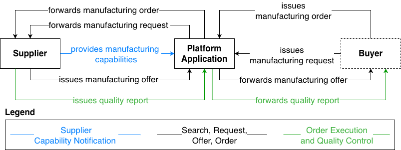
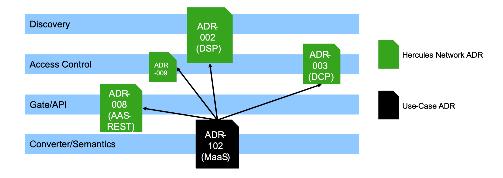

import Kit3DLogo from '@site/src/components/2.0/Kit3DLogo';

<Kit3DLogo kitId="maas" />

## Vision and Mission

### Our Vision

Our vision is that every manufacturer with free machining capacities can easily use on- demand-manufacturing digital marketplaces for additional order entry and collaborates connected and interoperable within manufacturing data space. This allows especially small and medium enterprises more resilience with volatile business and highest competitiveness with fast processes and quality assurance including transparency on sustainability.

### Our Mission

Our mission is to support factory operators and service providers on their path to digital transformation. We support in reducing the effort in acquiring new customers with scalable visibility on digital manufacturing marketplaces, by providing digital connectivity approaches and harmonized manufacturers information handling. Additionally, we structure and formalize the digital bidding process supported by automated cost and capacity calculation, to be fast and reliable in manufacturing as a service offering. Finally, we support vertical IT/OT convergence with standardized data models and interfaces for automated quality control services to ensure that manufacturers remain competitive, even when handling low lot sizes or parts they have never produced before.

## Business Value

The MaaS KIT adds value by combining standardization and automation:

- **Scalable Market Visibility**: Replace manual, individual, heterogeneous manufacturers’ information provision, by Factory-X standardized data formats and connectivity, which enable manufacturers with scalable visibility across digital marketplaces and platforms.

- **Efficient Customer Acquisition**: The effort to acquire new customers is significantly reduced, opening doors for new business models and increased order entry.

- **Automated Quoting and Evaluation**: Inquiries from digital platforms must be evaluated instantaneously. Automated cost calculation and quote generation allow for rapid responses even when experience with a specific product is lacking, ensuring efficiency despite low success rates.

- **Quality Assurance for Small Batches**: For small quantities where "trial-and-error" is too costly, quality requirements and testing procedures are identified automatically. This ensures compliance through multi-level quality control, right down to the machining process.

- **Enhanced Competitiveness**: Automated processes in bidding, planning, and execution allow manufacturers to handle uncertainties consciously and speed up the entire cycle from inquiry to delivery.

These objectives can be supported by business applications that provide information via defined interfaces and exchange formats specified within the project.

## Roles

The main roles in MaaS and the standardized data exchange using MX-Port variants are shown in Figure 1.

Figure 1: MaaS roles and MX-Port data exchange

In the MaaS KIT there are three main roles:

- **Buyer**: A buyer is an entity, e.g., a company, buying manufacturing services from Suppliers.

- **Supplier**: A supplier is an organization, e.g., an SME, that provides manufacturing services to buyers. Suppliers can offer their services via platform applications or platforms representing themselves as suppliers.

- **Platform application**: A platform application is a MaaS cloud platform that acts as a middleware between buyers and suppliers by hosting the manufacturing as a service offering of multiple suppliers and providing them to interested buyers. Suppliers can register at platform applications and publish their manufacturing capabilities there. Buyers can search for suppliers that match their manufacturing request at platform applications.

Figure 2:  MaaS roles and ecosystem.

## MaaS Scenarios

Figure 3:  MaaS scenarios and Factory-X usage view.

The digital manufacturing service ecosystem encompasses not only the roles of buyer, supplier, and platform but also necessitates extensive communication across these diverse stakeholders, each with distinct interests. Figure 3 illustrates the key topics, each clearly attributable to a specific business application. To address this complexity and foster practical knowledge, three primary scenarios are identified for enabling horizontal supply chains and vertical convergence.

### Scenario 1: Supplier Capability Notification

A supplier needs to provide all his manufacturing information to be visible on digital manufacturing marketplaces. From the supplier's perspective, seamless integration into digital manufacturing marketplaces is critical. Especially the offered manufacturing capabilities, based on the available machines and resources on the shop floor, need to be collected and described in a structured format, to be then used as suppliers capability notification at platform side.  The *capability modeler* generates the manufacturer's capabilities based on historical data for each machine and resource. Such automation is crucial for enabling SMEs to participate effectively. To provide the generated data in a structured semantic manner the AAS sub model Capability Description is used. A connectivity component, called Factory Connector, makes the prepared manufacturers’ information available for intercompany data exchange.

On-demand manufacturing platforms, on the other hand, receive and compile the standardized data structure for the subsequent onboarding process and suppliers' visualization as well as in capability-based matchmaking process while searching for appropriate suppliers.

### Scenario 2: Search, Request, Offer, Order

If buyers need a part or product to be produced, they can search for appropriate manufacturing service suppliers on the so-called on-demand manufacturing platforms. Usually, a request will be configured, required capabilities need to be defined, and search for appropriate manufacturer is done. To support the capability-based matchmaking, our *feature recognition service* generates geometry-based production steps automatically and derives the required capabilities to machine the part. In addition to the already semantically structured capability offerings from suppliers, the matchmaking process will be more precise to select the best fitting  manufacturer, who should now quote the buyer’s request. Data exchange in today’s manufacturing landscape remains a highly manual process, often relying on email or personal communication. The prevalence of 2D drawings over 3D models persists, and non-standardized request formats lead to inconsistent detail, requiring substantial manual analysis. This substantial manual effort is impractical for the high volume of requests anticipated on digital Manufacturing as a Service (MaaS) platforms. For manufacturing inquiries placed via manufacturing service platforms and marketplaces, efficient and rapid processing is essential. Therefore, harmonizing data formats and standardizing processes are crucial for cost-efficient request, offer, and order workflows at the manufacturer side.

Based on a buyer request at the on-demand-manufacturing platform, several concepts to automate and standardize workflows have been developed within the MaaS use case.  First, the request is now formalized in an initial Asset Administration Shell (AAS) for the product, including a 'Purchase Order' submodel. This AAS enables the manufacturing service provider to analyze the necessary production process and to calculate a price and delivery date in an automated manner.

The *recognized features* also enable the deduction of suitable machinery for individual processing steps and the estimation of processing times, thereby allowing for the calculation of manufacturing costs. Coupled with a delivery date derived from a production calendar, a comprehensive bid is formulated, enabling the placement of an offer and a subsequent order. The entire process chain is automated through the utilization of a standardized data model.

### Scenario 3: Order Execution and Quality Control

When orders arrive at the manufacturing service provider, an automated order execution is essential for profitable manufacturing, also for small lot sizes. Here, the primary focus lies in the automation of CAM (computer aided manufacturing) processes and quality assurance. This implies an AI-driven feature recognition based on the three-dimensional product description, normally given in a step-file format. To assign the required tools and machines, a novel CAM Automation has been developed within the use case.  The automated recognition of geometrical features also enables the derivation of quality requirements and necessary quality measures. The AAS sub model "Quality Control for Machining" is used for vertical consistency to translate the quality requirements derived from component geometries into operation programs for machine control, define test requirements, and monitor manufacturing quality during processing.

### MaaS scenarios data and AAS submodel overview

Table 1 shows an overview of exchanged data between applications along the scenarios and of used AAS submodels

| **Data**                                                | **Mandatory AAS Submodels**                                                                            | **Involved Business Applications**                                                                                                                     |
| ------------------------------------------------------- | ------------------------------------------------------------------------------------------------------ | ------------------------------------------------------------------------------------------------------------------------------------------------------ |
| **Scenario 1: Capability Notification and Matchmaking**  |
| Manufacturer Capabilities                               | - Digital Nameplate - Capability Description                                                      | - Capability Evaluation - Connectivity / User Interface - Platform Application - Matchmaking                                            |
| **Scenario 2: Request, Offer, Order** |
| Request                                                 | - Purchase Order - Digital Nameplate - Technical Data - Handover Documentation          | - Connectivity / User Interface - Platform Application - Matchmaking - Order Management - Order Processing                         |
| Offer                                                   | - Purchase Order - Digital Nameplate - Technical Data - Handover Documentation          | - Connectivity / User Interface - Capacity Evaluation - Capability Evaluation - Order Processing - Cost Analysis - Platform Application |
| Order                                                   | - Purchase Order - Digital Nameplate - Technical Data - Handover Documentation          | - Order Processing - Connectivity / User Interface - Platform Application                                                                    |
| **Scenario 3: Order Execution and Quality Control** |
| Quality Report                                          | - Quality Control for Machining - Digital Nameplate - Technical Data - Handover Documentation | - Order Processing - Quality Control - Connectivity / User Interface - Platform Application                                             |

Table 1:  Assigning MaaS scenarios to applications and AAS submodels.

## Sequence Diagrams

### Capability Notification

Figure 4:  Sequence diagram “supplier capability notification”.

The sequence diagram shows the sequence of the supplier capability notification, between a connectivity/user interface and a platform application. Authorized capabilities and additional machines and factory information are provided via the MX-Port concepts from the supplier side via a so-called “Connectivity / User Interface”. The data is represented in the standardized and IDTA approved AAS submodel templates. On the data consumer side, the platforms (“Platform Application”) can address the data provided by the suppliers via the MX-Port concepts. This shows the method *getCapabilities()*. In the sequence diagram, this is represented by the 'HTTP pull' approach, which was successfully demonstrated within the project. An alternative to the “HTTP pull” approach is the “push” approach, in which a platform subscribes to an endpoint and is automatically notified of new information.

### Search, Request, and Offer

Figure 5:  Sequence diagram “search, request and offer”.

The scenario on search, request, and offer starts with a customer-side search initiated on the platform application. Based on the requested manufacturing capabilities, the platform calls *getSuppliers (in capabilities)* on the matchmaking service to identify suitable suppliers. The platform (via the automated order management service) can also obtain additional relevant part information by calling *getFeatures (in part)*, resulting in a structured feature set that can be utilized to formulate a request.

After potential suppliers are identified and the part requirements are available, the platform submits the request for quotation (RFQ) to the supplier through the supplier’s connectivity / user interface application using *sendRequest (in request)*. The supplier-side system forwards the request into the automated order processing where it is handled via *processRequest (in request)*. As part of this processing, an automated cost calculation is triggered: the order processing calls *getCostAnalysis (in features)* on the automated cost analysis service to estimate manufacturing cost based on the previously extracted features. The computed cost assessment is then returned to the order processing, which compiles the resulting offer based on the quotation and routes it back through the connectivity / user interface to the platform application. This process enables a fast, standardized request-to-offer workflow that integrates relevant manufacturing details and requirements.

### Order Execution and Quality Control

Figure 6:  Sequence diagram “order execution and quality control”

The scenario on order execution and quality control starts with an order income at the supplier, arriving at the connectivity / user interface application. The supplier starts the preparation steps for production, which are included in the automated order processing application of the sequence diagram. Here, feature recognition, CAM automation, and quality requirement extraction are relevant steps to process the order and prepare production. During production, machine signal data is captured and provided to the quality control application via the *providedQualityData()* function. The *sendMeasurementReport()* function then generates an AAS Submodel – Quality Control for Machining, detailing requirements and results, which can be sent back to the platform application.

## Semantic Model

### Used AAS Submodels in MaaS

| Standard                                                                   | Version | Description                                                                                                                                                                                                                                                                                                                                                                                                                                                                                                                                                                                                                                                                                                                                                                                                                                                                                                                                                                                                                                                                                                                                                                                                                                                                                                                                                                                                                                                                                                                                                                                                                                                                                                                                                                                                                                                                                                                                                                                                                                                                    | Affiliation                           | Link                                                                                                                                                                                                                                                                                   |
| -------------------------------------------------------------------------- | ------- | ------------------------------------------------------------------------------------------------------------------------------------------------------------------------------------------------------------------------------------------------------------------------------------------------------------------------------------------------------------------------------------------------------------------------------------------------------------------------------------------------------------------------------------------------------------------------------------------------------------------------------------------------------------------------------------------------------------------------------------------------------------------------------------------------------------------------------------------------------------------------------------------------------------------------------------------------------------------------------------------------------------------------------------------------------------------------------------------------------------------------------------------------------------------------------------------------------------------------------------------------------------------------------------------------------------------------------------------------------------------------------------------------------------------------------------------------------------------------------------------------------------------------------------------------------------------------------------------------------------------------------------------------------------------------------------------------------------------------------------------------------------------------------------------------------------------------------------------------------------------------------------------------------------------------------------------------------------------------------------------------------------------------------------------------------------------------------ | ------------------------------------- | -------------------------------------------------------------------------------------------------------------------------------------------------------------------------------------------------------------------------------------------------------------------------------------- |
| Digital Nameplate for industrial equipment                                 | 3.0     | This Submodel template aims to provide asset nameplate information to the respective Asset Administration Shells in an interoperable manner. Central element is the provision of properties [7], ideally interoperable by the means of dictionaries such as ECLASS and IEC CDD (Common Data Dictionary). The purpose of this document is to make selected specifications of Submodels in such manner that information about assets and their nameplate can be exchanged in a meaningful way between partners in a value creation network. It targets equipment for processing industry and factory automation by defining standardized meta data. The intended use case is the provision of a standardized property structure within a digital nameplate, which enables the interoperability of digital nameplates from different manufacturers. This concept can serve as a basis for standardizing the respective Submodel. The conception is based on existing norms, directives and standards so that a far-reaching acceptance can be achieved. Besides standardized Submodel this template also introduces standardized SubmodelElementCollections (SMC) in order to improve interoperability while modelling partial aspects within Submodels. The standardized SMCs include address and asset product marking. In addition to the general information for Industrial Equipment listed in this document, it may be necessary to supplement the digital nameplate with additional information for specific areas of application, e.g. for explosion safety or radio. Information for the digital nameplate for additional areas of application are defined in supplementary submodel templates                                                                                                                                                                                                                                                                                                                                                                           | Company, Factory, Machine, Product | [Link](https://github.com/admin-shell-io/submodel-templates/tree/main/published/Digital%20nameplate/3/0)                                                                                 |
| Contact Information                                                        | 1.0     | This Submodel template aims at interoperable provision of contact information in regard to the asset of the respective Asset Administration Shell. Central element is the provision of properties, ideally interoperable by the means of dictionaries such as ECLASS and IEC CDD (Common Data Dictionary). The purpose of this document is to make selected specifications of Submodels in such manner that information about assets can be exchanged in a meaningful way between partners in a value creation network. It targets equipment for process industry and factory automation by defining standardized meta data. The intended use-case is the provision of a standardized property structure for contact information, which can effectively accelerate the preparation for asset maintenance. This concept can serve as a basis for standardizing the respective Submodel. The conception is based on studies of common practices at enterprises. Beside standardized Submodel this template also introduces standardized SubmodelElementCollections (SMC) in order to improve the interoperability while modelling aspects of contact information within other Submodels.                                                                                                                                                                                                                                                                                                                                                                                                                                                                                                                                                                                                                                                                                                                                                                                                                                                                                         | Company, Factory, Machine             | [Link](https://github.com/admin-shell-io/submodel-templates/tree/main/published/Contact%20Information/1/0)                                                                               |
| Generic Frame for Technical Data for Industrial Equipment in Manufacturing | 2.0     | This Submodel template aims at interoperable provision of technical data describing the asset of the respective Asset Administration Shell. Central element is the provision of properties [7], ideally interoperable by the means of dictionaries such as ECLASS and IEC CDD (Common data dictionary). The intended use-case is that a manufacturer of industrial products to equipment describes technical data of assets (type or instance), which are provided to the market. This description is achieved by means of technical data (properties), which are interoperable and unambiguously understood by the other market participants, such as system integrators or operators of industrial products to equipment. These properties are selected for human comprehension and are not necessarily representing a full class definition within a classification system. For providing individual industrial products to equipments to the market, also a supplier is covered by the use-case (for this purpose seen as functioning as manufacturer).                                                                                                                                                                                                                                                                                                                                                                                                                                                                                                                                                                                                                                                                                                                                                                                                                                                                                                                                                                                                                    | Company, Factory, Machine, Product | [Link](https://github.com/admin-shell-io/submodel-templates/tree/main/published/Technical_Data/2/0)                                                                                           |
| Data Model for Asset Location                                              | 1.0     | The location of static or mobile objects (assets / goods / trackables) and, if applicable, the origin and destination of transport processes are naturally the most important information in transport and internal logistics. In the past, the postal address or a simple location description (e.g., hall B, aisle 3) or a GNSS coordinate (Global Navigation Satellite System, like GPS) was sufficient as location information for controlling logistics processes. With the increasing propagation of localization technologies such as Ultra-Wideband (UWB), BLE (Bluetooth Low Energy), RFID (Radio-Frequency Identification) and others, the continuous and precise tracking of objects becomes possible at reasonable costs. This opens new possibilities for the automation, monitoring and analysis of goods flows and internal transportation tasks. It is also possible to measure masses of localization data for short distances within buildings, which is why the integration of a localization solution into warehouse systems or production lines is becoming increasingly popular. The systems for localization are usually referred to as real-time location systems (RTLS). Automated guided vehicles (AGVs) and autonomous transport robots with free navigation (AGVs) are also increasingly being used for internal transportation tasks. These are another driver for the use of localization technologies in companies. Location data for assets are determined by different localization systems during the life cycle and even at the same point in time more than one system can deliver location information. Today location data originate from a variety of non-interoperable systems, for which the data model for the localization information is not standardized. Since asset location data are generated and used by different systems, for different use cases, in different life cycle phases and by different organizations it makes sense to manage the location data in the AAS of an asset in the form of a standardized Submodel. | Factory, Machine                      | [Link](https://github.com/admin-shell-io/submodel-templates/tree/main/published/Data%20Model%20for%20Asset%20Location/1/0)                                               |
| Asset Interface Description                                                | 1.0     | This Submodel specifies an information model and a common representation for describing the interface(s) of an asset service or asset related service. Based on this information, it is possible to initiate a connection to such kind of service and start to request or subscribe to served datapoints, and/or perform operations. Such datapoints of a system service can be, for example, various sensor and/or status values, and an operation can trigger an actuator, such as switching a motor “on” or “off”. The Asset Interfaces Description (AID) in version 1.1 supports the description of interfaces based on following specific protocols: • Modbus • HTTP • MQTT • OPC UA • BACnet                                                                                                                                                                                                                                                                                                                                                                                                                                                                                                                                                                                                                                                                                                                                                                                                                                                                                                                                                                                                                                                                                                                                                                                                                                                                                                                                                           | Asset                                 | [Link](https://github.com/admin-shell-io/submodel-templates/tree/main/published/Asset%20Interfaces%20Description/1/0)                                                         |
| Asset Interfaces Mapping Configuration                                     | 1.0     | This Asset Interfaces Mapping Configuration (AIMC) Submodel specifies an information model and a common representation for describing the mapping of interface(s) of an asset service or asset-related service already described in an Asset Interfaces Description (AID) Submodel. It can be understood as a configuration Submodel for south-bound communication between AAS and asset. Based on this information in the AIMC Submodel, it is possible to configure and initiate a connection to an asset service and map payloads to intended locations in an AAS automatically, and vice versa.                                                                                                                                                                                                                                                                                                                                                                                                                                                                                                                                                                                                                                                                                                                                                                                                                                                                                                                                                                                                                                                                                                                                                                                                                                                                                                                                                                                                                                                                            | Asset                                 | [Link](https://github.com/admin-shell-io/submodel-templates/tree/main/published/Asset%20Interfaces%20Mapping%20Configuration/1/0)                                                                                                                                                           |
| Time Series Data                                                           | 1.1     | In Industrie 4.0, the ubiquity of data sources and sensors and low costs of storage have resulted in increasing amounts of time series data being captured – not only during the operational phase of an asset. A time series is a series of data points in time order over a period of time. Time Series can represent raw data, but can also represent main characteristics, textual descriptions or events in a concise way. This Submodel template aims at an interoperable description of time series data in industrial automation for the complete asset lifecycle. The focus of this Submodel template is on the semantic information of time series data. The Submodel claims to integrate time series data within the AAS itself, but also from external data sources. Figure 1 shows the use cases, such as sensor data from real and virtual sensors, and their technical storage options inside or outside the AAS that were taken into account in the creation of this specification.                                                                                                                                                                                                                                                                                                                                                                                                                                                                                                                                                                                                                                                                                                                                                                                                                                                                                                                                                                                                                                                                            | Machine                               | [Link](https://github.com/admin-shell-io/submodel-templates/tree/main/published/Time%20Series%20Data/1/1)                                                                                 |
| Hierarchical Structures enabling Bills of Material                         | 1.1     | This Submodel Template aims to provide hierarchical structures applicable to industrial equipment in an interoperable manner. For this primarily Entities and Relationship Elements of the AAS Metamodel are used. This industrial equipment, for example production lines, modules and sub systems, are provided by partners in the value chain, such as suppliers, equipment manufacturers and systems integrators and used in specific applications by industrial operators and end users, both in factory as also process automation. Industrial equipment can be composed of subsystems down to material and component level, can include produced products and can be described on type or instance level. The AAS contains Submodels that cover aspects of the assets among their life cycle. Already in the design phase, assets are composed and aggregated into newly created hierarchical structures. Typically, assets have their own AAS (Entity with entityType “SelfManagedEntity"), but it is possible that an Asset has no AAS and is represented by a co-managed Entity. Since nesting of AAS and Submodels is forbidden by the metamodel, this Submodel is intended to provide a description of the internal structure of an asset. It shall allow the consumer of an AAS to identify assets and their corresponding entities and find their respective AAS if they exist. The Submodel serves as an index, pointing to Assets (described as co- or self-managed entities) and AAS in a distributed network capable of transcending the limits of a single organization. Instances of this Submodel Template shall be the authoritative source for hierarchical structures within an AAS during all lifecycle phases. Complementing information about each asset and their own lifecycle phase is enabled to be discoverable into the n-th level of the hierarchy and across the whole supply chain depending on the design of the Submodel Instance.                                                                                                       | Company, Factory, Machine, Product | [Link](https://github.com/admin-shell-io/submodel-templates/tree/main/published/Hierarchical%20Structures%20enabling%20Bills%20of%20Material/1/1) |
| Capability Description                                                     | 1.0     | The submodel Capabilities for Industrial Appliances is used to model process or product requirements (i.e. required capabilities) and resource capabilities (i.e. provided capabilities) in a specified way. Thus, a reliable comparison between required and provided capabilities can be made, enabling efficient planning and orchestration of production processes. The submodel is based on the definition from [8], [9] where a capability is an "implementation-independent specification of a function in industrial production to achieve an effect in the physical or virtual world". From [8] it can be seen that the capability class has three central relationships. It is restricted by constraints, specified by properties and realized by skills.  - Properties specify the capability in more detail (e.g. maximum speed, allowed tolerances, temperature range). - Constraints are divided into two types which further restrict the capability:  &nbsp;&nbsp;- Property constraints: These refer to properties of a capability (e.g. temperature) and can be used as preconditions, invariants or postconditions.  &nbsp;&nbsp;- Transition constraints: Refer to relationships between multiple capabilities to determine their sequence or parallel flow (e.g., transport must occur before tempering). - Skills, on the other hand, implement a capability in the form of technical or software-based solution modules. Overall, the submodel Capabilities for Industrial Appliances provides an important basis for precisely defining the required capabilities in a production process and matching them with the provided capabilities of available resources. It is intended to be used by production planners, machine manufacturers and plant operators.                                                                                                                                                                                                                                                                   | Factory, Machine, Product             | [Link](https://github.com/admin-shell-io/submodel-templates/tree/main/development/Capability/1/0)                                                                                                 |
| Production Calendar                                                        | **1.0** | The submodel should contain a template to store one or more production calendars of mimeType iCalendar (RFC 5545). The iCal format is very abstract and isn’t enough specified for industry requirements. For this, necessary variables, describing the content of the production calendar, will be specified by the working group. A Management Execution System and a value chain simulation can use the calendar submodel to exchange information like the shift schedule of a machine and execute operations on it.                                                                                                                                                                                                                                                                                                                                                                                                                                                                                                                                                                                                                                                                                                                                                                                                                                                                                                                                                                                                                                                                                                                                                                                                                                                                                                                                                                                                                                                                                                                                                        | Machine                               | [Link](https://github.com/admin-shell-io/submodel-templates/tree/main/published/Production%20Calendar/1/0)                                                                               |
| Handover Documentation                                                     | 2.0     | The Submodel Handover Specification defines a standardized exchange format for information or documentation for a specific asset. The scope of this Submodel is to increase the interoperability between the parties that are exchanging asset documentation. These parties can be manufacturers of components or complete machines, or operators using these components or machines. In case a machine manufacturer sells a machine to a customer (operator), the manufacturer hands over the machine and its documentation in form of an AAS with the Submodel “Handover Documentation”. The documents provided can contain information required for e.g. correct design, installation, commissioning, spare parts stocking, operation, cleaning, inspection, maintenance, and repair. In addition, there are legal regulations that stipulate the existence of certain manufacturer documents, such as Communauté Européenne (CE) declarations of conformity, Atmosphères Explosives (ATEX) certificates, or material certificates. Besides the structure of a Submodel and the exchange format of an AAS, this Submodel standardizes the meta data that comes with the asset documentation and the classes that classify the type of the document. With these standardized meta data and classes, the asset documentation can be automatically integrated in the customer’s document management system, backend system, or any other system. The meta data as well as the classification classes of this Submodel are based on the VDI Guideline VDI 2770 Blatt 1 “Operation of process engineering plants – Minimum requirements for digital manufacturer information for the process industry” [7]. While the classification of documents according to VDI 2770 is mandatory, additional classification classes can be added.                                                                                                                                                                                                                                            | Factory, Machine, Product       | [Link](https://github.com/admin-shell-io/submodel-templates/tree/main/published/Handover%20Documentation/2/0)                                                                         |
| Carbon Footprint                                                           | 1.0     | This Submodel template provides the means to exchange an asset\`s Carbon Footprint (CF) between the partners along a value chain. The aim of this Submodel is to increase the interoperability between the parties, who are interested in documenting, exchanging, evaluating, or optimizing the environmental footprint of their assets. These parties can for example be manufacturers, users/consumers, or logistic partners. The CF might be part of larger initiatives, such as the Digital Product Passport (DPP) or the Product Environmental Footprint. It is not the scope of this Submodel template to substitute the relevant certificates. Use cases with increasing complexity are described in the following section. Version 1.0 of this document will focus on Use Cases 1,2, and 3. Additional use cases will be supported in future versions.                                                                                                                                                                                                                                                                                                                                                                                                                                                                                                                                                                                                                                                                                                                                                                                                                                                                                                                                                                                                                                                                                                                                                                                                                | Product                               | [Link](https://github.com/admin-shell-io/submodel-templates/tree/main/published/Carbon%20Footprint/1/0)                                                                                     |
| Quality Control for Machining                                              | 1.0     | The Submodel “Quality Control for Machining” aims at an interoperable description of the quality control relevant data in the field of machining, which provides a comprehensive, structured and standardized data basis for the subsequent tasks of data analysis. On the one hand, the information and data relevant to quality control is presented in a structured manner, whereby the data structure and the required administrative data is summarized as general as possible, independent of specialist areas. On the other hand, the option to specify domain-specific features is included in order to provide the meta-information of specific standards as well as the test parameters and to allow the definition of other characteristics specific to the machining process.                                                                                                                                                                                                                                                                                                                                                                                                                                                                                                                                                                                                                                                                                                                                                                                                                                                                                                                                                                                                                                                                                                                                                                                                                                                                                      | Product                               | [Link](https://github.com/admin-shell-io/submodel-templates/tree/main/published/Quality%20Control%20for%20Machining/1/0)                                                   |
| Submodel Purchase Order                                                    | 1.0     | The objective of the submodel “Purchase Order Creation” is to represent orders regarding the purchase of production resources in a standardized way. It contains e.g. the meta information of the supplier, the identification number of the order, the status of the order, and the information about the receipt of goods as well as ordered goods. Instead of the free text item, the description of the ordered goods is provided in a structured format, e.g. via a product catalog with the order quantity, variants and price. The development of this submodel is synchronized with the InterOpera submodel projects “Purchase Request Notification” and “Purchase Request Response”. The three submodels are used to address the entire purchase order process.                                                                                                                                                                                                                                                                                                                                                                                                                                                                                                                                                                                                                                                                                                                                                                                                                                                                                                                                                                                                                                                                                                                                                                                                                                                                                                       | Product                               | [Link](https://github.com/admin-shell-io/submodel-templates/tree/main/published/Purchase%20Order/1/0)                                                                                                                                                                                     |

Table 2:  AAS submodels used in MaaS and assignment to description types

## Standards

### Data exchange via MX-Port Hercules

Data exchange via MX-Port Hercules for secure data exchange via [Data Space Protocol (DSP)](https://github.com/eclipse-dataspace-protocol-base/DataspaceProtocol) and [Decentralized Claims Protocol (DCP)](https://github.com/eclipse-dataspace-dcp/decentralized-claims-protocol) using the Asset Administration Shell (AAS) as the data model.

| Standard                                                                                   | Version   | Description                                                                                                                                                                                                                                                                                                                                                                                                                                                                                                                                                                                                                                                                | Link                                                                                                                                              |
| ------------------------------------------------------------------------------------------ | --------- | -------------------------------------------------------------------------------------------------------------------------------------------------------------------------------------------------------------------------------------------------------------------------------------------------------------------------------------------------------------------------------------------------------------------------------------------------------------------------------------------------------------------------------------------------------------------------------------------------------------------------------------------------------------------------- | ------------------------------------------------------------------------------------------------------------------------------------------------- |
| Dataspace Protocol 2025-1                                                                  | 2025-1    | The Dataspace Protocol is a specification designed to facilitate interoperable data sharing between entities governed by usage control and based on Web technologies. This specification defines the schemas and protocols required for entities to publish data, negotiate Agreements, and access data as part of a federation of technical systems termed a Dataspace.                                                                                                                                                                                                                                                                                                   | [Link](https://eclipse-dataspace-protocol-base.github.io/DataspaceProtocol/2025-1-err1/)                                                                  |
| Eclipse Decentralized Claims Protocol v1.0                                            | 1.0  | Dataspaces require the ability to communicate participant identities and credentials to secure data access. This specification defines a set of protocols for asserting participant identities, issuing verifiable credentials, and presenting verifiable credentials using a decentralized architecture for verification and trust.                                                                                                                                                                                                                                                                                                                                     | [Link](https://eclipse-dataspace-dcp.github.io/decentralized-claims-protocol/v1.0.1/)                                                                   |
| Specification of the Asset Administration Shell Part 1: Metamodel                          | 3.1.2 | The aim of this document is to define the structure of the Administration Shell to enable the meaningful exchange of information about assets and I4.0 components between partners in a value creation network.                                                                                                                                                                                                                                                                                                                                                                                                                                                            | [Link](https://industrialdigitaltwin.io/aas-specifications/IDTA-01001/v3.1.2/index.html)                                                                  |
| Specification of the Asset Administration Shell Part 2: Application Programming Interfaces | 3.1.1 | This document specifies the interfaces as well as the APIs in selected technologies for the Asset Administration Shells and its submodels.                                                                                                                                                                                                                                                                                                                                                                                                                                                                                                                                 | [Link](https://industrialdigitaltwin.io/aas-specifications/IDTA-01002/v3.1.1/index.html )                                                                 |
| Specification of the Asset Administration Shell Part 4: Security – IDTA Number: 01004      | 3.0.1 | This document defines the security of the Asset Administration Shell. The interaction between authentication and authorisation is explained. The focus of the document is the Access Rule Model. ABAC (Attribute Based Access Control) is used for Access Rules. Access Rules can be defined for both registries and repositories, so that descriptors, AASs, entire submodels or even individual submodel elements can be protected. References to the AAS model, global attributes such as time or claims from a signed access token can be used as attributes. Access tokens can be provided via authentication using OAuth 2.0, OpenID Connect or from a data room. | [Link](https://industrialdigitaltwin.org/content-hub/aasspecifications/specification-of-the-asset-administration-shell-part-4-security-idta-number-01004) |

Table 3:  Standards considered in data exchange via MX-Port Hercules

### Data exchange via MX-Port Leo

| Standard | Version | Description | Link |
| --- | --- | --- | --- |
| Specification of the Asset Administration Shell Part 1: Metamodel | 3.1.2 | The aim of this document is to define the structure of the Administration Shell to enable the meaningful exchange of information about assets and I4.0 components between partners in a value creation network. | [Link](https://industrialdigitaltwin.io/aas-specifications/IDTA-01001/v3.1.2/index.html) |
| Specification of the Asset Administration Shell Part 2: Application Programming Interfaces | 3.1.1 | This document specifies the interfaces as well as the APIs in selected technologies for the Asset Administration Shells and its submodels. | [Link](https://industrialdigitaltwin.io/aas-specifications/IDTA-01002/v3.1.1/index.html) |
| Specification of the Asset Administration Shell Part 4: Security – IDTA Number: 01004 | 3.0.1 | This document defines the security of the Asset Administration Shell. The interaction between authentication and authorisation is explained. The focus of the document is the Access Rule Model. ABAC (Attribute Based Access Control) is used for Access Rules. Access Rules can be defined for both registries and repositories, so that descriptors, AASs, entire submodels or even individual submodel elements can be protected. References to the AAS model, global attributes such as time or claims from a signed access token can be used as attributes. Access tokens can be provided via authentication using OAuth 2.0, OpenID Connect or from a data room. | [Link](https://industrialdigitaltwin.org/content-hub/aasspecifications/specification-of-the-asset-administration-shell-part-4-security-idta-number-01004) |
| FX Token | tbd | tbd | tbd |
| ID Link | 1.0 | IEC 61406-1:2022 specifies minimum requirements for a globally unique identification of physical objects which also constitutes a link to its related digital information. This identification is designated hereinafter as 'Identification Link' (IL), with the encoded data designated as IL string. The IL string has the data-format of a link (URL). The IL is machine-readable and is attached to the physical object in a 2D symbol or NFC tag. The requirements in this standard apply to physical objects: - that are provided by the manufacturer as an individual unit, - and that have already been given a unique identity by the manufacturer. This document does not specify any requirements on the content and the layout of nameplates/typeplates (e.g. spatial arrangement, content of the plain texts, approval symbols etc.). | [Link](https://www.vde-verlag.de/iec-standards/251187/iec-61406-1-2022.html) |

Table 4:  Standards considered in data exchange via MX-Port Leo

### Used Factory-X Architecture Decision Records

When using the MX-Port Hercules reference implementation (Chapter [Development View](development-view/architecture.md)), the following [Factory-X Architecture Decision Records](https://factory-x-contributions.github.io/architecture-decisions/) are fulfilled.

Figure 7: Classification and relationship between MaaS ADR-102 and Hercules Network ADRs

| Hercules Use Case Architecture Decision Record (ADR) | Version | Link |
| --- | --- | --- |
| ADR 102 – Manufacturing as a Service | 0.1.0 | [Link](https://factory-x-contributions.github.io/architecture-decisions/docs/hercules_use_case_adr/adr102-maas) |

Table 5:  Used Hercules Use Case Architecture Decision Records in MaaS

| Hercules Network Architecture Decision Record (ADR) | Version | Link |
| --- | --- | --- |
| ADR 002 – Cross-Company Authorization and Discovery Version 0.2.0 | 0.2.0 | [Link](https://factory-x-contributions.github.io/architecture-decisions/docs/hercules_network_adr/adr002-authorization-discovery) |
| ADR 003 – Authentication for Dataspaces Version 0.2.0 | 0.2.0 | [Link](https://factory-x-contributions.github.io/architecture-decisions/docs/hercules_network_adr/adr003-authentication) |
| ADR 008 – Asset Administration Shell Profile for Factory-X Version 0.2.0 | 0.2.0 | [Link](https://factory-x-contributions.github.io/architecture-decisions/docs/hercules_network_adr/adr008-aas-profile) |
| ADR 009 – Discovery of AAS Services via DSP Version 0.2.0 | 0.2.0 | [Link](https://factory-x-contributions.github.io/architecture-decisions/docs/hercules_network_adr/adr009-aas-rest-dsp) |

Table 6:  Used Hercules Network Architecture Decision Records in MaaS

## NOTICE

This work is licensed under the [CC-BY-4.0](https://creativecommons.org/licenses/by/4.0/legalcode).

- SPDX-License-Identifier: CC-BY-4.0
- SPDX-FileCopyrightText: 2026 SIEMENS AG
- SPDX-FileCopyrightText: 2026 Fraunhofer-Gesellschaft zur Foerderung der angewandten Forschung e.V. (represented by Fraunhofer IOSB)
- SPDX-FileCopyrightText: 2026 TRUMPF SE + Co. KG
- SPDX-FileCopyrightText: 2026 Technologie-Initiative SmartFactory KL e. V. (SmartFactory-KL)
- SPDX-FileCopyrightText: 2026 DMG MORI Bielefeld GmbH
- SPDX-FileCopyrightText: 2026 Instawerk GmbH
- SPDX-FileCopyrightText: 2026 Matchory GmbH
- SPDX-FileCopyrightText: 2026 soffico GmbH
- SPDX-FileCopyrightText: 2026 Institut für Fertigungstechnik und Werkzeugmaschinen (IFW), Gottfried Wilhelm Leibniz Universität Hannover
- SPDX-FileCopyrightText: 2026 MT Analytics GmbH
- SPDX-FileCopyrightText: 2026 Werkzeugmaschininenlabor (WZL) der Fakultaet Maschinenwesen, Rheinisch-Westfaehlische Technische Hochschule (RWTH) Aachen
- SPDX-FileCopyrightText: 2026 Contributors to the Eclipse Foundation
- Source URL: [https://github.com/eclipse-tractusx/eclipse-tractusx.github.io](https://github.com/eclipse-tractusx/eclipse-tractusx.github.io)

### Footnotes

M. Simon, F. Schoeppenthau, R. Kuntschke, C. Czech, B. Obst, B. Fuchs, T. Lepper, T. Schurek,  
S. Currle, K. Wernet, J. Pralle, and P. Ruebel, “Building a Dataspace for Manufacturing as a Service in Factory-X” arXiv [online]. Available: [https://doi.org/10.48550/arXiv.2604.03678](https://doi.org/10.48550/arXiv.2604.03678 "https://doi.org/10.48550/arxiv.2604.03678")
